# 技术指标计算

<cite>
**本文引用的文件**
- [strategy/indicators.py](file://strategy/indicators.py)
- [backtest/indicator_engine.py](file://backtest/indicator_engine.py)
- [ai/features.py](file://ai/features.py)
- [governance/chancellery/scoring_engine.py](file://governance/chancellery/scoring_engine.py)
- [strategy/strategies.py](file://strategy/strategies.py)
- [quant.py](file://quant.py)
- [tests/test_backtest_engine.py](file://tests/test_backtest_engine.py)
</cite>

## 目录
1. [简介](#简介)
2. [项目结构](#项目结构)
3. [核心组件](#核心组件)
4. [架构概览](#架构概览)
5. [详细组件分析](#详细组件分析)
6. [依赖分析](#依赖分析)
7. [性能考虑](#性能考虑)
8. [故障排查指南](#故障排查指南)
9. [结论](#结论)
10. [附录](#附录)

## 简介
本文件面向AIQuant技术指标计算模块，系统梳理并解释各类技术指标的数学公式、计算逻辑与实现细节，涵盖移动平均线（MA）、指数移动平均线（EMA）、相对强弱指数（RSI）、布林带（Bollinger Bands）、MACD、KDJ、DMI、ATR、OBV、VWAP、CCI等。文档同时给出参数设置、平滑算法、信号生成规则，并结合项目中的策略与评分引擎，说明指标组合使用的最佳实践与交易信号构建方法，最后提供性能优化技巧与常见问题排查建议。

## 项目结构
技术指标相关代码主要分布在以下模块：
- 指标计算与批量计算：strategy/indicators.py、backtest/indicator_engine.py
- 特征工程与AI模型输入：ai/features.py
- 多因子评分与信号融合：governance/chancellery/scoring_engine.py、strategy/strategies.py
- 策略扫描与回测参数：quant.py
- 回测引擎与信号验证：tests/test_backtest_engine.py

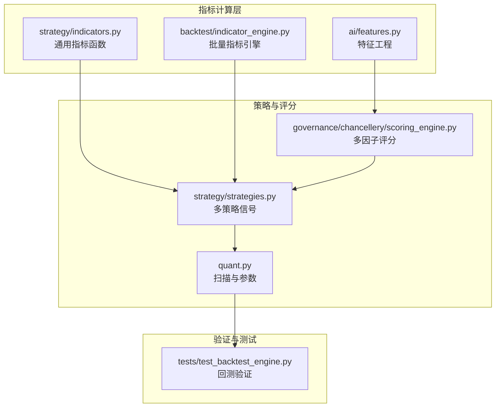

图表来源
- [strategy/indicators.py:1-244](file://strategy/indicators.py#L1-L244)
- [backtest/indicator_engine.py:1-433](file://backtest/indicator_engine.py#L1-L433)
- [ai/features.py:1-189](file://ai/features.py#L1-L189)
- [governance/chancellery/scoring_engine.py:1-370](file://governance/chancellery/scoring_engine.py#L1-L370)
- [strategy/strategies.py:1-431](file://strategy/strategies.py#L1-L431)
- [quant.py:1-631](file://quant.py#L1-L631)
- [tests/test_backtest_engine.py:1-130](file://tests/test_backtest_engine.py#L1-L130)

章节来源
- [strategy/indicators.py:1-244](file://strategy/indicators.py#L1-L244)
- [backtest/indicator_engine.py:1-433](file://backtest/indicator_engine.py#L1-L433)
- [ai/features.py:1-189](file://ai/features.py#L1-L189)
- [governance/chancellery/scoring_engine.py:1-370](file://governance/chancellery/scoring_engine.py#L1-L370)
- [strategy/strategies.py:1-431](file://strategy/strategies.py#L1-L431)
- [quant.py:1-631](file://quant.py#L1-L631)
- [tests/test_backtest_engine.py:1-130](file://tests/test_backtest_engine.py#L1-L130)

## 核心组件
- 通用指标函数：提供MA、EMA、RSI、KDJ、MACD、布林带、ATR、OBV、VWAP、CCI、DMI等指标的向量化实现，支持多周期与多参数组合。
- 批量指标引擎：注册并批量计算指标，统一输出列名与类别，便于策略与评分模块复用。
- 特征工程：从OHLCV构建机器学习特征，包含趋势、动量、波动、量价、形态、收益滞后等特征。
- 多因子评分：将趋势、动量、波动率、成交量、质量等因子评分标准化并加权融合。
- 多策略信号：提供多种交易策略的信号生成逻辑，支持策略融合与阈值控制。
- 扫描与参数：定义回测与实盘参数（止损、止盈、阈值、仓位等），驱动每日扫描与信号输出。

章节来源
- [strategy/indicators.py:13-236](file://strategy/indicators.py#L13-L236)
- [backtest/indicator_engine.py:140-358](file://backtest/indicator_engine.py#L140-L358)
- [ai/features.py:82-159](file://ai/features.py#L82-L159)
- [governance/chancellery/scoring_engine.py:246-314](file://governance/chancellery/scoring_engine.py#L246-L314)
- [strategy/strategies.py:36-431](file://strategy/strategies.py#L36-L431)
- [quant.py:43-51](file://quant.py#L43-L51)

## 架构概览
技术指标计算模块采用“指标函数 + 批量引擎 + 特征工程 + 策略/评分”的分层设计：
- 指标函数层：提供单一指标的纯函数实现，便于单元测试与复用。
- 批量引擎层：集中注册指标，统一计算与赋值，避免重复计算。
- 特征工程层：将指标与价格行为、成交量、形态等组合为模型输入特征。
- 策略/评分层：基于指标与信号生成交易决策，融合多策略与多因子评分。

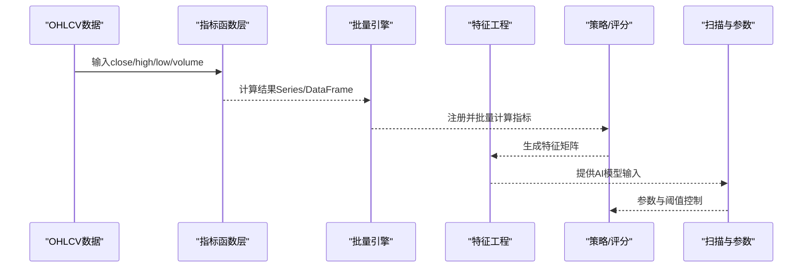

图表来源
- [strategy/indicators.py:13-236](file://strategy/indicators.py#L13-L236)
- [backtest/indicator_engine.py:287-358](file://backtest/indicator_engine.py#L287-L358)
- [ai/features.py:82-159](file://ai/features.py#L82-L159)
- [strategy/strategies.py:36-431](file://strategy/strategies.py#L36-L431)
- [quant.py:43-51](file://quant.py#L43-L51)

## 详细组件分析

### 移动平均线（MA）
- 数学定义：算术平均，窗口长度n。
- 实现要点：使用滚动窗口均值，支持多周期并行计算。
- 参数设置：默认周期[5,10,20,60]，可扩展。
- 信号生成：常用于多头排列、价格位置判断，作为趋势基础。

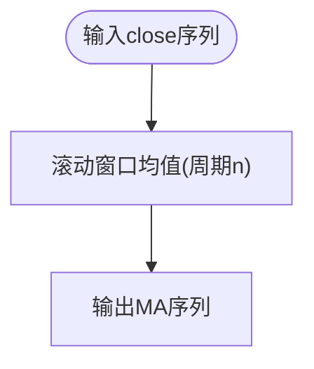

图表来源
- [strategy/indicators.py:13-18](file://strategy/indicators.py#L13-L18)

章节来源
- [strategy/indicators.py:13-18](file://strategy/indicators.py#L13-L18)

### 指数移动平均线（EMA）
- 数学定义：指数平滑，权重随时间递减，span参数控制半衰期。
- 实现要点：使用指数加权均值，adjust=False避免偏差修正。
- 参数设置：默认周期[12,26]，可扩展。
- 信号生成：MACD的核心组成，关注快慢线交叉与柱状图变化。

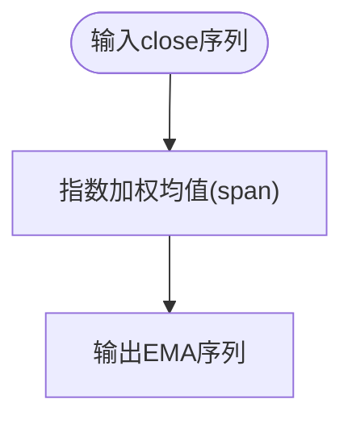

图表来源
- [strategy/indicators.py:21-26](file://strategy/indicators.py#L21-L26)

章节来源
- [strategy/indicators.py:21-26](file://strategy/indicators.py#L21-L26)

### 相对强弱指数（RSI）
- 数学定义：RS = E[收益]/E[损失]，RSI = 100 - 100/(1+RS)。
- 实现要点：收益/损失分别计算，使用指数平滑均值；避免除零。
- 参数设置：默认周期[6,14,24]，可扩展。
- 信号生成：超买/超卖阈值（如70/30），结合趋势与成交量确认。

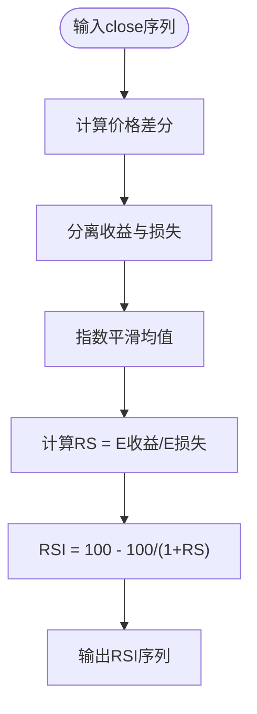

图表来源
- [strategy/indicators.py:46-60](file://strategy/indicators.py#L46-L60)

章节来源
- [strategy/indicators.py:46-60](file://strategy/indicators.py#L46-L60)

### 布林带（Bollinger Bands）
- 数学定义：中轨=MA，上下轨=中轨±k×标准差，带宽=(上轨-下轨)/中轨×100。
- 实现要点：滚动均值与标准差，支持带宽计算。
- 参数设置：周期20，标准差倍数2.0。
- 信号生成：价格突破上下轨、带宽收窄后突破等。

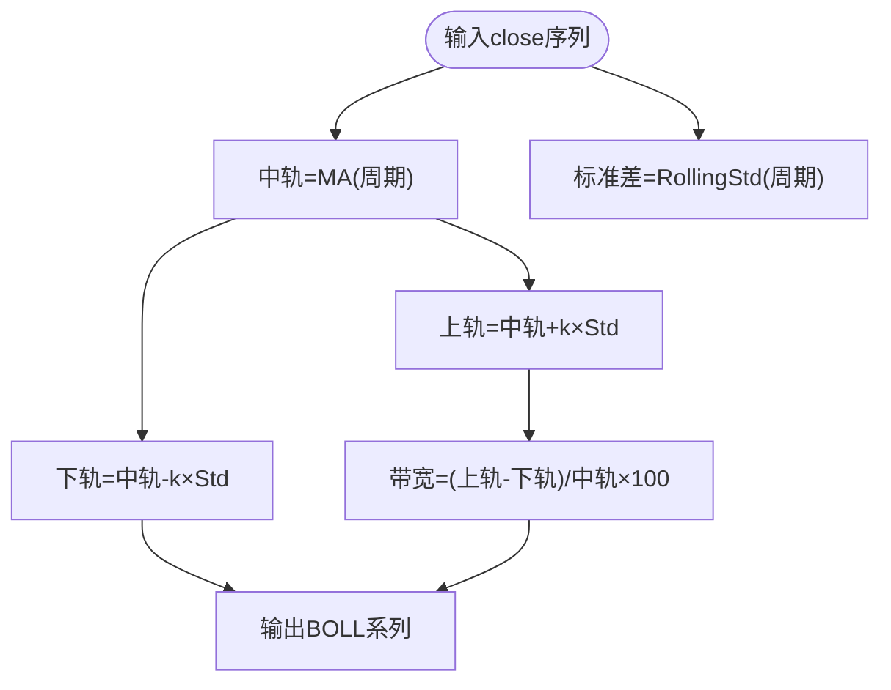

图表来源
- [strategy/indicators.py:85-100](file://strategy/indicators.py#L85-L100)

章节来源
- [strategy/indicators.py:85-100](file://strategy/indicators.py#L85-L100)

### MACD
- 数学定义：DIF=EMA(fast)-EMA(slow)，DEA=EMA(DIF,signal)，柱=2×(DIF-DEA)。
- 实现要点：快慢EMA与信号EMA，柱状图用于颜色变化判断。
- 参数设置：fast=12，slow=26，signal=9。
- 信号生成：金叉/死叉、柱色变化、零轴上下穿越。

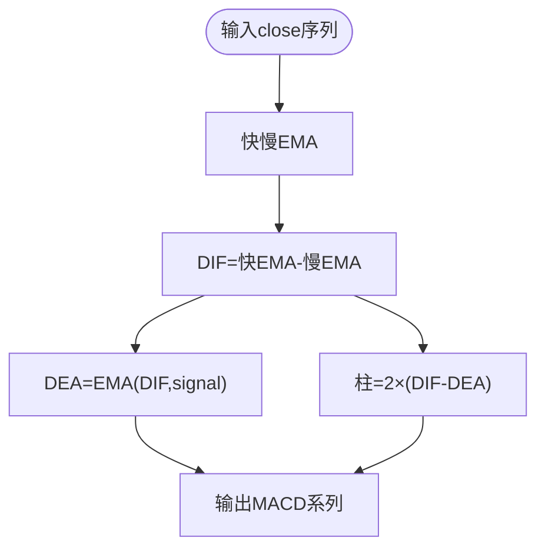

图表来源
- [strategy/indicators.py:29-43](file://strategy/indicators.py#L29-L43)

章节来源
- [strategy/indicators.py:29-43](file://strategy/indicators.py#L29-L43)

### KDJ
- 数学定义：RSV=(close-min)/range×100，K=EWM(RSV,m1)，D=EWM(K,m2)，J=3K-2D。
- 实现要点：窗口n内最高/最低，平滑参数m1/m2，初始值设为50。
- 参数设置：n=9，m1=m2=3。
- 信号生成：K/D交叉、超买超卖区域、J值辅助。

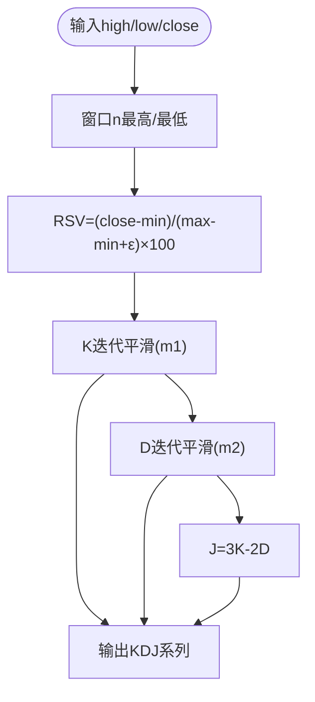

图表来源
- [strategy/indicators.py:63-82](file://strategy/indicators.py#L63-L82)

章节来源
- [strategy/indicators.py:63-82](file://strategy/indicators.py#L63-L82)

### ATR（平均真实波幅）
- 数学定义：TR=max(H-L, abs(H-C(-1)), abs(L-C(-1)))，ATR=滚动均值(TR)。
- 实现要点：滚动窗口均值，用于波动率估计与止损设置。
- 参数设置：周期14。
- 信号生成：波动率适中区间（如2%-5%）更利于交易。

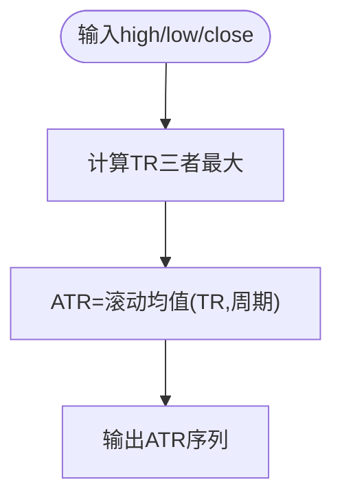

图表来源
- [strategy/indicators.py:103-114](file://strategy/indicators.py#L103-L114)

章节来源
- [strategy/indicators.py:103-114](file://strategy/indicators.py#L103-L114)

### OBV（能量潮）
- 数学定义：方向=sign(close-close(-1))，OBV累积求和。
- 实现要点：累计成交量方向，用于量价背离识别。
- 参数设置：无。
- 信号生成：OBV与价格背离、斜率变化。

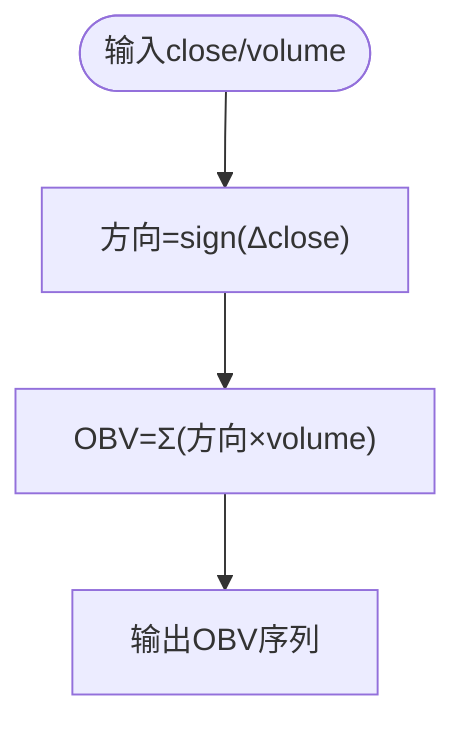

图表来源
- [strategy/indicators.py:117-124](file://strategy/indicators.py#L117-L124)

章节来源
- [strategy/indicators.py:117-124](file://strategy/indicators.py#L117-L124)

### VWAP（成交量加权平均价格）
- 数学定义：VWAP=Σ(典型价×成交量)/Σ成交量。
- 实现要点：滚动窗口，典型价=(H+L+C)/3。
- 参数设置：周期20。
- 信号生成：短期偏离与突破。

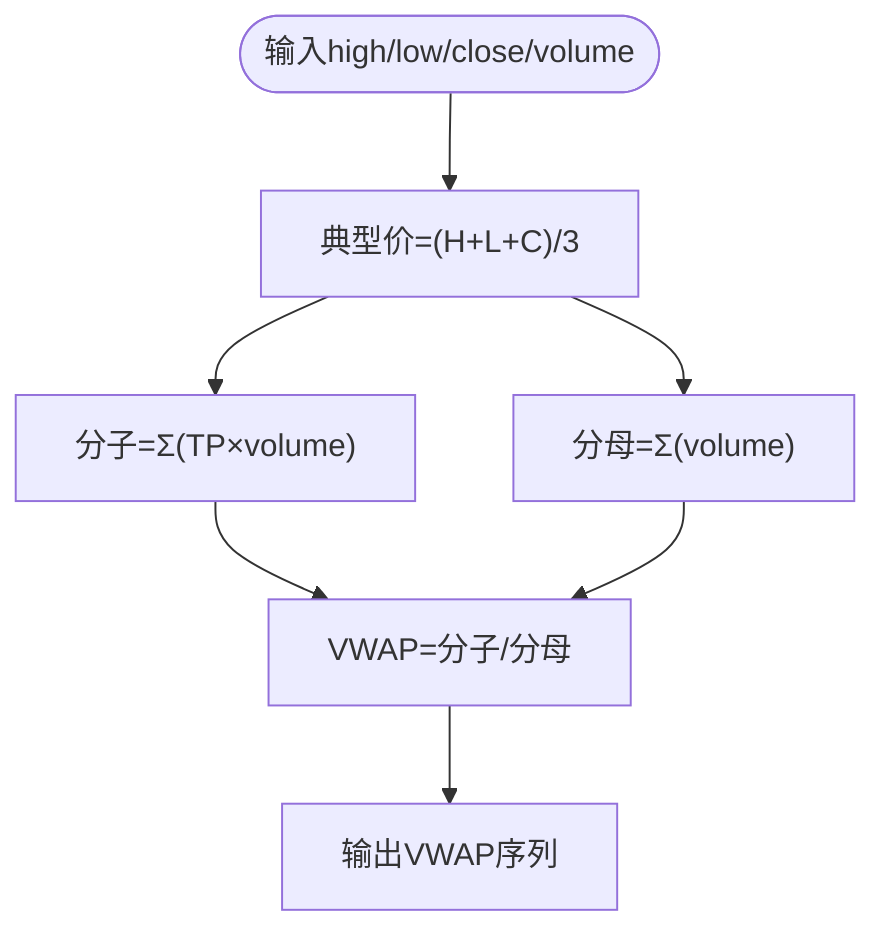

图表来源
- [strategy/indicators.py:127-131](file://strategy/indicators.py#L127-L131)

章节来源
- [strategy/indicators.py:127-131](file://strategy/indicators.py#L127-L131)

### CCI（商品通道指标）
- 数学定义：TP=(H+L+C)/3，MA=滚动均值，MD=滚动平均绝对偏差，CCI=(TP-MA)/(0.015×MD)。
- 实现要点：典型价与均值、绝对偏差，系数0.015。
- 参数设置：周期20。
- 信号生成：±100阈值判断趋势强度。

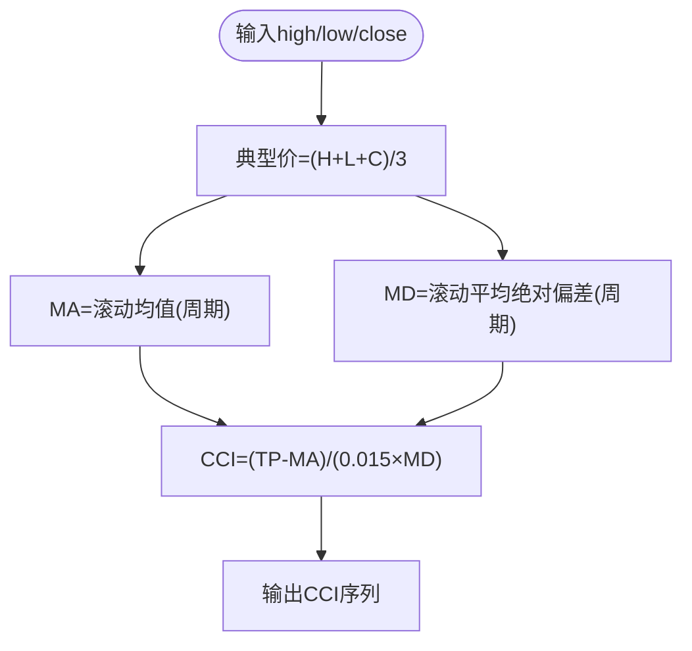

图表来源
- [strategy/indicators.py:134-143](file://strategy/indicators.py#L134-L143)

章节来源
- [strategy/indicators.py:134-143](file://strategy/indicators.py#L134-L143)

### DMI（动向指标）
- 数学定义：+DM/-DM来自价格跳动差异，TR为真实波幅，DI=+DI/-DI/ADX=DX均值。
- 实现要点：+DI上穿-DI为多头信号，ADX>阈值表示趋势强度。
- 参数设置：周期14，信号周期6。
- 信号生成：+DI上穿-DI，ADX>25。

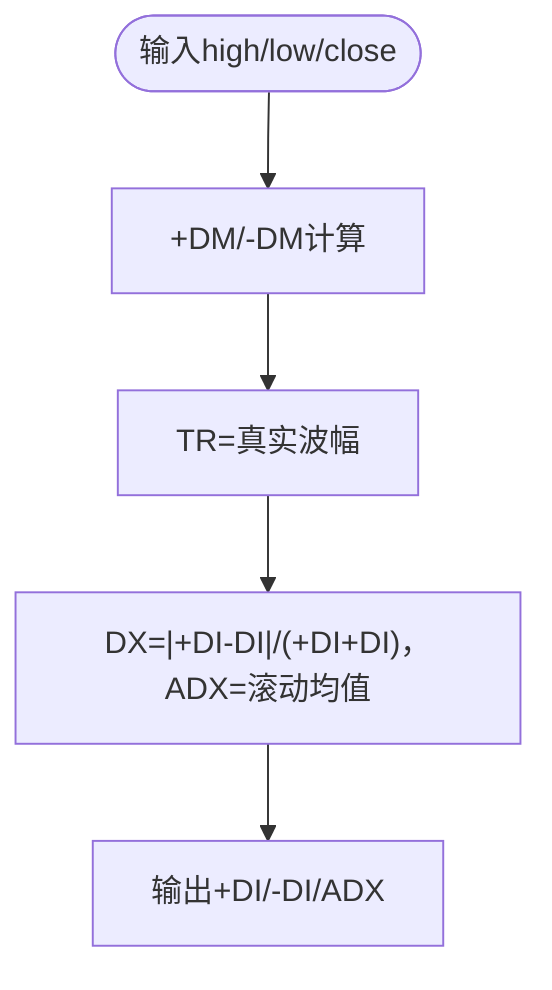

图表来源
- [strategy/indicators.py:146-179](file://strategy/indicators.py#L146-L179)

章节来源
- [strategy/indicators.py:146-179](file://strategy/indicators.py#L146-L179)

### 批量指标引擎（IndicatorRegistry）
- 注册机制：集中注册指标键名、显示名、计算函数与分类。
- 计算流程：遍历注册表，调用计算函数，统一赋值，支持tuple与DataFrame输出。
- 截面排名：可选计算成交量/成交额分位。

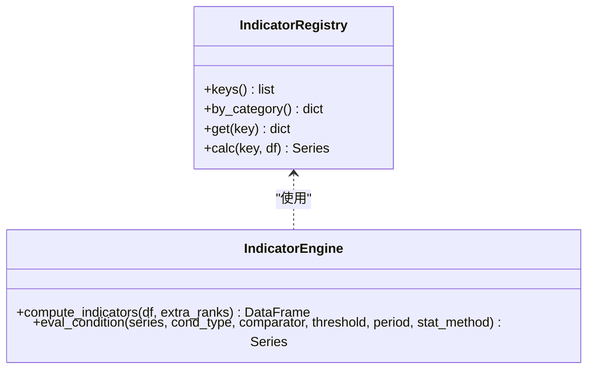

图表来源
- [backtest/indicator_engine.py:140-273](file://backtest/indicator_engine.py#L140-L273)
- [backtest/indicator_engine.py:287-432](file://backtest/indicator_engine.py#L287-L432)

章节来源
- [backtest/indicator_engine.py:140-273](file://backtest/indicator_engine.py#L140-L273)
- [backtest/indicator_engine.py:287-432](file://backtest/indicator_engine.py#L287-L432)

### 特征工程（build_features）
- 趋势特征：MA斜率、价格在MA之上/之下。
- 动量特征：RSI、MACD（DIF/DEA/HIST）。
- 波动特征：ATR、布林带宽度与位置。
- 量价特征：量比、OBV及其斜率、价量相关性。
- 形态特征：实体占比、上下影线、阳线比例、振幅。
- 收益特征：1/5/10/20日收益率与绝对值。
- 滞后特征：close/volume滞后1/2/3日。

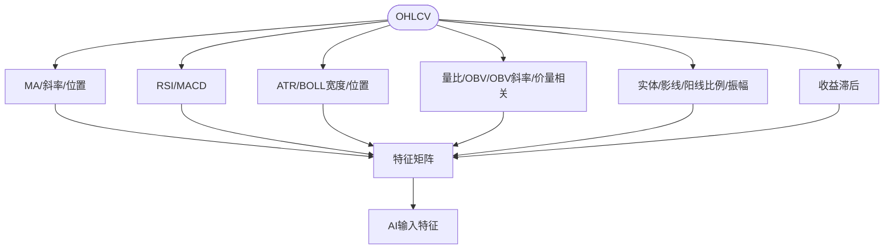

图表来源
- [ai/features.py:82-159](file://ai/features.py#L82-L159)

章节来源
- [ai/features.py:82-159](file://ai/features.py#L82-L159)

### 多因子评分（MultiFactorScoringEngine）
- 因子体系：趋势、动量、波动率、成交量、质量。
- 计算流程：逐因子计算，标准化到0-10，按权重加权，最终0-100。
- 信号提示：因子得分≥8标注“强势”，≤3标注“弱势”。

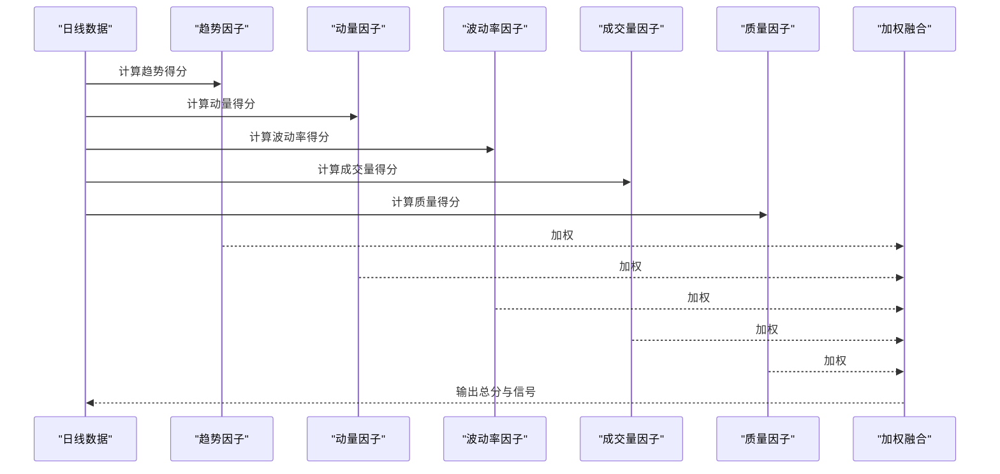

图表来源
- [governance/chancellery/scoring_engine.py:246-314](file://governance/chancellery/scoring_engine.py#L246-L314)

章节来源
- [governance/chancellery/scoring_engine.py:246-314](file://governance/chancellery/scoring_engine.py#L246-L314)

### 多策略信号与融合
- 策略1：放量突破型（量比、多头排列、3日涨幅）。
- 策略2：均线粘合型（粘合度、向上发散、量能稳定）。
- 策略3：量价背离型（底背离、反弹强度、趋势确认）。
- 策略4：抄底型（下跌深度、反弹强度、放量）。
- 策略5：主力建仓型（低位、放量、涨幅受控）。
- 融合：各策略原始分(0-3)映射到(0-10)，加权融合得到0-50融合分，阈值≥20触发。

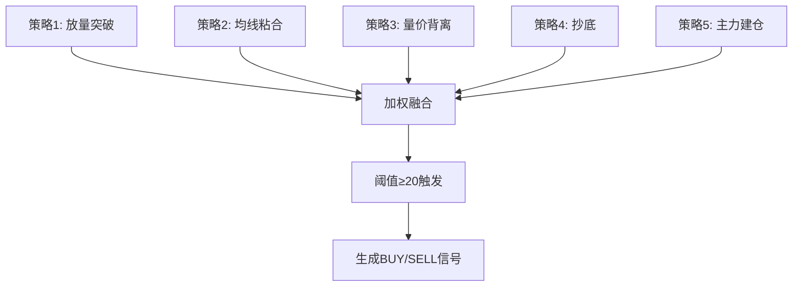

图表来源
- [strategy/strategies.py:36-431](file://strategy/strategies.py#L36-L431)

章节来源
- [strategy/strategies.py:36-431](file://strategy/strategies.py#L36-L431)

### 扫描与参数（quant.py）
- 参数：初始资金、单仓资金比例、止损、止盈、融合阈值、回测阈值、回填阈值。
- 大盘择时：MA5>MA20视为多头市场。
- v4策略：超跌反弹（20日跌幅≥12%、站上MA5、温和放量、RSI区间、不创新低、多头市场）。

章节来源
- [quant.py:43-51](file://quant.py#L43-L51)
- [quant.py:148-175](file://quant.py#L148-L175)
- [quant.py:177-283](file://quant.py#L177-L283)

## 依赖分析
- 指标函数依赖：pandas/numpy，使用rolling/ewm/shift等向量化操作。
- 批量引擎依赖：pandas/numpy，统一索引与列赋值，避免index对齐问题。
- 特征工程依赖：pandas/numpy，多项式拟合计算斜率。
- 策略/评分依赖：pandas/numpy，条件判断与统计函数。
- 回测验证依赖：pandas/numpy，T+1执行、NaN处理、手续费与滑点模拟。

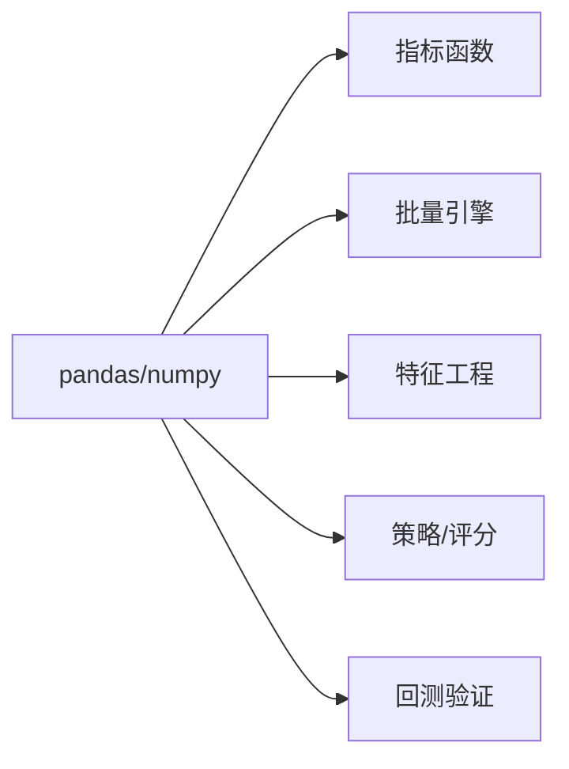

图表来源
- [strategy/indicators.py:9-10](file://strategy/indicators.py#L9-L10)
- [backtest/indicator_engine.py:9-10](file://backtest/indicator_engine.py#L9-L10)
- [ai/features.py:12-13](file://ai/features.py#L12-L13)
- [governance/chancellery/scoring_engine.py:20-21](file://governance/chancellery/scoring_engine.py#L20-L21)
- [tests/test_backtest_engine.py:14-15](file://tests/test_backtest_engine.py#L14-L15)

章节来源
- [strategy/indicators.py:9-10](file://strategy/indicators.py#L9-L10)
- [backtest/indicator_engine.py:9-10](file://backtest/indicator_engine.py#L9-L10)
- [ai/features.py:12-13](file://ai/features.py#L12-L13)
- [governance/chancellery/scoring_engine.py:20-21](file://governance/chancellery/scoring_engine.py#L20-L21)
- [tests/test_backtest_engine.py:14-15](file://tests/test_backtest_engine.py#L14-L15)

## 性能考虑
- 向量化优先：使用pandas/numpy内置函数（rolling/ewm/shift）替代循环，提升速度。
- 避免重复计算：批量引擎统一计算，注册表避免重复调用。
- 索引对齐：批量引擎使用.values赋值，防止index对齐导致的列污染。
- 分块与缓存：特征工程中使用滚动窗口，合理设置min_periods减少无效计算。
- 内存优化：对长序列使用分段处理，及时释放中间变量。
- 并行与批处理：扫描全市场时分批处理，避免内存峰值过高。

## 故障排查指南
- T+1执行：买入信号当日不成交，次日开盘价成交；滑点应用于次日开盘价。
- NaN处理：使用pd.isna()判断，避免np.nan与0混淆。
- 手续费与滑点：双向手续费与印花税计算正确；滑点双向千一。
- 指标缺失：批量引擎对单个指标失败不中断，确保整体可用性。
- 指数对齐：批量引擎统一为RangeIndex，消除index对齐隐患。

章节来源
- [tests/test_backtest_engine.py:19-126](file://tests/test_backtest_engine.py#L19-L126)
- [backtest/indicator_engine.py:303-339](file://backtest/indicator_engine.py#L303-L339)

## 结论
AIQuant技术指标计算模块通过“指标函数 + 批量引擎 + 特征工程 + 策略/评分”的分层设计，实现了高效、可复用且可扩展的技术指标体系。结合多策略信号与多因子评分，能够有效构建交易信号并指导实盘参数设置。建议在实际应用中：
- 严格遵循参数设置与平滑算法；
- 使用批量引擎统一计算，避免重复；
- 结合趋势、动量、波动与成交量因子进行信号融合；
- 通过回测验证与故障排查持续优化。

## 附录
- 指标参数建议（通用）：MA周期[5,10,20,60]；EMA周期[12,26]；RSI周期[6,14,24]；KDJ n=9，m1=m2=3；MACD fast=12，slow=26，signal=9；布林周期20，k=2；ATR周期14；CCI周期20；DMI周期14/6。
- 信号生成规则（通用）：RSI超买超卖、KDJ交叉、MACD金叉死叉、布林突破与收窄、ATR适中波动、OBV背离、DMI多头排列与ADX强度。
- 组合使用最佳实践：多周期指标互证（如MA多头+RSI中性+ATR适中），避免单一指标误导；引入成交量与波动率过滤，提高稳定性。