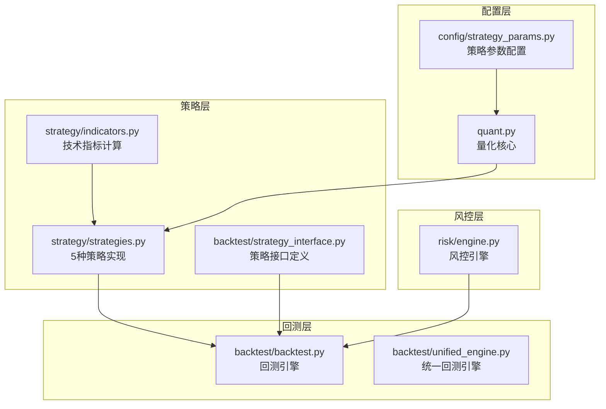
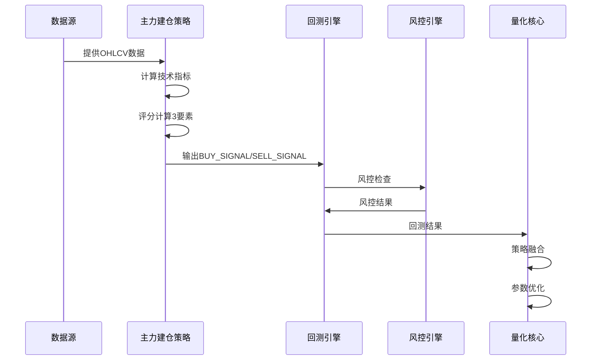
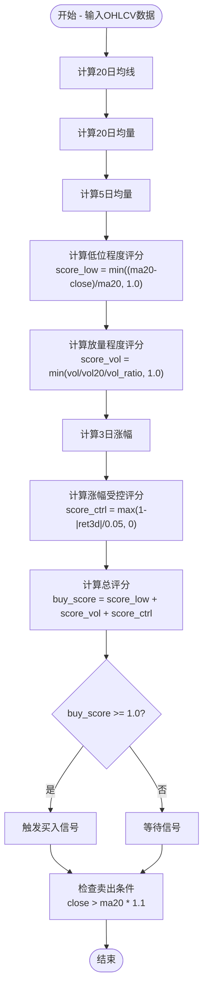
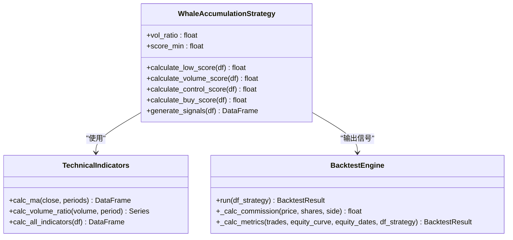
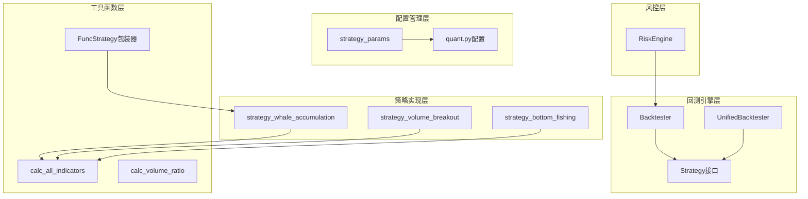

# 主力建仓策略

<cite>
**本文档引用的文件**
- [strategy/strategies.py](file://strategy/strategies.py)
- [strategy/indicators.py](file://strategy/indicators.py)
- [backtest/backtest.py](file://backtest/backtest.py)
- [config/strategy_params.py](file://config/strategy_params.py)
- [quant.py](file://quant.py)
- [backtest/strategy_interface.py](file://backtest/strategy_interface.py)
- [backtest/unified_engine.py](file://backtest/unified_engine.py)
- [risk/engine.py](file://risk/engine.py)
</cite>

## 目录
1. [简介](#简介)
2. [项目结构](#项目结构)
3. [核心组件](#核心组件)
4. [架构概览](#架构概览)
5. [详细组件分析](#详细组件分析)
6. [依赖分析](#依赖分析)
7. [性能考虑](#性能考虑)
8. [故障排除指南](#故障排除指南)
9. [结论](#结论)

## 简介

主力建仓策略是AI量化交易系统中的重要组成部分，专门用于识别主力资金在股价低迷区进行异常放量吸筹的行为特征。该策略通过三个核心评分要素来判断主力资金的建仓时机：低位程度评分、放量程度评分和涨幅受控评分。

策略的核心理念基于以下市场背景：
- 主力资金通常在股价处于历史低位区域时进行秘密建仓
- 异常放量是主力资金介入的重要信号
- 价格在建仓过程中的涨幅控制体现了主力的谨慎态度
- 趋势确认机制确保在合适的市场环境下进行建仓

## 项目结构

AI量化交易系统采用模块化架构设计，主要包含以下核心模块：

**图表来源**
- [strategy/strategies.py:1-431](file://strategy/strategies.py#L1-L431)
- [backtest/backtest.py:1-517](file://backtest/backtest.py#L1-L517)
- [config/strategy_params.py:1-76](file://config/strategy_params.py#L1-L76)

**章节来源**
- [strategy/strategies.py:1-431](file://strategy/strategies.py#L1-L431)
- [backtest/backtest.py:1-517](file://backtest/backtest.py#L1-L517)
- [config/strategy_params.py:1-76](file://config/strategy_params.py#L1-L76)

## 核心组件

### 主力建仓策略实现

主力建仓策略的核心实现位于`strategy/strategies.py`文件中，该策略通过三个评分要素来识别主力资金的建仓行为：

#### 评分要素详解

1. **低位程度评分（Price Low Score）**
   - 计算公式：`score_low = min((ma20 - close) / ma20, 1.0)`
   - 作用：衡量股价相对于20日均线的低估程度
   - 逻辑：股价越低于20日均线，评分越高，表明处于更低的估值区间

2. **放量程度评分（Volume Spike Score）**
   - 计算公式：`score_vol = min(volume / vol20 / vol_ratio, 1.0)`
   - 作用：衡量成交量相对于20日均量的放大量度
   - 逻辑：成交量异常放大且超过设定阈值时获得高分

3. **涨幅受控评分（Price Control Score）**
   - 计算公式：`score_ctrl = max(1 - |ret3d| / 0.05, 0)`
   - 作用：衡量3日涨幅的稳定性控制
   - 逻辑：涨幅越小（越接近0%）评分越高，体现主力建仓的谨慎态度

#### 参数配置

策略的关键参数包括：
- `vol_ratio`: 放量倍数阈值，默认3.0倍
- `score_min`: 触发条件的最低评分阈值，默认1.0分
- 时间周期：20日均线、20日均量、5日均量等技术指标

**章节来源**
- [strategy/strategies.py:224-255](file://strategy/strategies.py#L224-L255)
- [config/strategy_params.py:39-43](file://config/strategy_params.py#L39-L43)

## 架构概览

主力建仓策略在整个量化交易系统中的位置和交互关系如下：

**图表来源**
- [strategy/strategies.py:224-255](file://strategy/strategies.py#L224-L255)
- [backtest/backtest.py:121-409](file://backtest/backtest.py#L121-L409)
- [risk/engine.py:19-49](file://risk/engine.py#L19-L49)

## 详细组件分析

### 主力建仓策略算法流程

**图表来源**
- [strategy/strategies.py:224-255](file://strategy/strategies.py#L224-L255)

### 技术指标计算

策略依赖的基础技术指标由`strategy/indicators.py`提供：

#### 关键指标说明

1. **20日均线（MA20）**
   - 作用：作为股价估值水平的基准线
   - 计算：简单移动平均线，窗口期20天

2. **20日均量（Vol20）**
   - 作用：作为成交量基准，识别异常放量
   - 计算：成交量的简单移动平均线

3. **5日均量（Vol5）**
   - 作用：短期成交量趋势分析
   - 计算：成交量的简单移动平均线

**章节来源**
- [strategy/indicators.py:13-18](file://strategy/indicators.py#L13-L18)
- [strategy/indicators.py:182-189](file://strategy/indicators.py#L182-L189)

### 评分函数设计

主力建仓策略采用连续评分机制，每个评分要素都有明确的计算方法和归一化处理：

#### 评分函数实现

**图表来源**
- [strategy/strategies.py:224-255](file://strategy/strategies.py#L224-L255)
- [strategy/indicators.py:192-236](file://strategy/indicators.py#L192-L236)
- [backtest/backtest.py:121-409](file://backtest/backtest.py#L121-L409)

**章节来源**
- [strategy/strategies.py:236-249](file://strategy/strategies.py#L236-L249)

### 买卖信号判定

策略的买卖信号判定遵循严格的时间序列规则：

#### 买入信号条件
1. **总评分阈值**：`buy_score >= 1.0`
2. **时间约束**：`index >= index[19]`（确保有足够的历史数据）
3. **评分要素**：三个评分要素至少满足一个

#### 卖出信号条件
1. **价格突破**：`close > ma20 * 1.1`（价格上涨超过20日均线10%）
2. **趋势确认**：结合其他技术指标进行确认

**章节来源**
- [strategy/strategies.py:252-254](file://strategy/strategies.py#L252-L254)

## 依赖分析

### 组件耦合关系

**图表来源**
- [strategy/strategies.py:224-255](file://strategy/strategies.py#L224-L255)
- [strategy/indicators.py:192-236](file://strategy/indicators.py#L192-L236)
- [backtest/strategy_interface.py:62-85](file://backtest/strategy_interface.py#L62-L85)
- [backtest/backtest.py:121-409](file://backtest/backtest.py#L121-L409)
- [config/strategy_params.py:39-43](file://config/strategy_params.py#L39-L43)

### 外部依赖

策略实现依赖于以下外部模块：
- **pandas/numpy**：数据处理和数值计算
- **typing**：类型注解支持
- **dataclasses**：数据类定义
- **datetime**：时间处理

**章节来源**
- [strategy/strategies.py:28-30](file://strategy/strategies.py#L28-L30)

## 性能考虑

### 计算复杂度分析

主力建仓策略的时间复杂度为O(n)，其中n为交易日数量。空间复杂度同样为O(n)，主要用于存储中间计算结果。

#### 性能优化措施

1. **向量化计算**：利用pandas的向量化操作提高计算效率
2. **内存管理**：及时释放不需要的中间变量
3. **索引优化**：确保数据按时间顺序排列以提高访问效率

### 参数调优建议

基于历史回测结果，建议的参数配置：
- `vol_ratio`: 2.0-3.0倍（平衡敏感性和稳定性）
- `score_min`: 1.0分（确保信号质量）
- `max_holding_days`: 40天（控制风险暴露）

## 故障排除指南

### 常见问题及解决方案

#### 1. 信号生成异常
**问题描述**：策略无法生成有效的买入/卖出信号
**可能原因**：
- 数据质量差（缺失值、异常值）
- 参数设置不当
- 市场环境不适合策略

**解决方案**：
- 检查输入数据的完整性
- 调整`vol_ratio`参数范围
- 结合其他技术指标进行确认

#### 2. 回测结果异常
**问题描述**：回测结果显示负收益或高回撤
**可能原因**：
- 参数设置过于激进
- 风险控制机制失效
- 市场环境变化

**解决方案**：
- 降低`vol_ratio`阈值
- 加强风控规则
- 考虑市场择时机制

#### 3. 性能问题
**问题描述**：策略运行缓慢
**可能原因**：
- 数据量过大
- 计算冗余
- 内存泄漏

**解决方案**：
- 优化数据处理流程
- 减少不必要的计算
- 实施内存管理策略

**章节来源**
- [backtest/backtest.py:121-409](file://backtest/backtest.py#L121-L409)
- [risk/engine.py:19-49](file://risk/engine.py#L19-L49)

## 结论

主力建仓策略通过三个核心评分要素有效识别了主力资金在股价低迷区的异常放量行为。该策略具有以下特点：

### 优势
1. **理论基础扎实**：基于主力资金行为特征设计
2. **评分机制合理**：三个要素相互补充，提高信号质量
3. **参数灵活**：支持自定义阈值和权重
4. **集成度高**：与整个量化系统无缝集成

### 风险控制
策略实施了多重风险控制机制：
- **卖出条件**：价格上涨超过20日均线10%自动卖出
- **时间限制**：最大持仓天数控制风险暴露
- **参数优化**：基于历史回测结果的参数调优
- **风控集成**：与系统级风控引擎协同工作

### 实践建议
1. **参数调优**：根据具体市场环境调整`vol_ratio`参数
2. **组合策略**：与其他策略结合使用提高稳定性
3. **风险管理**：严格执行止损止盈规则
4. **持续监控**：定期评估策略表现并进行调整

该策略为投资者提供了识别主力资金建仓机会的有效工具，但需要结合其他分析方法和严格的风险管理原则来实现稳健的投资回报。