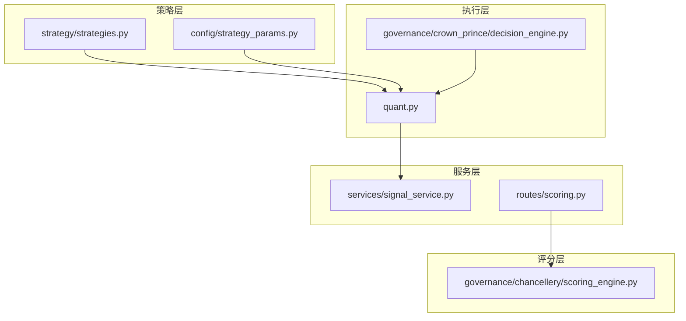
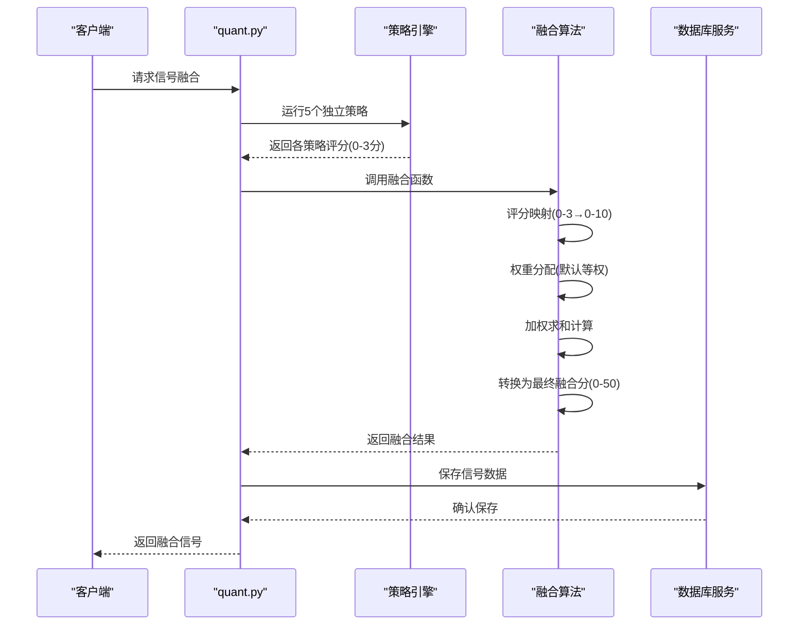
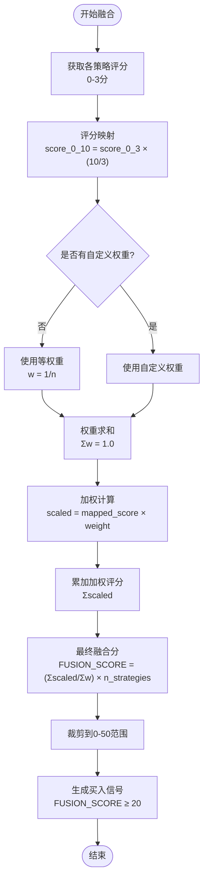
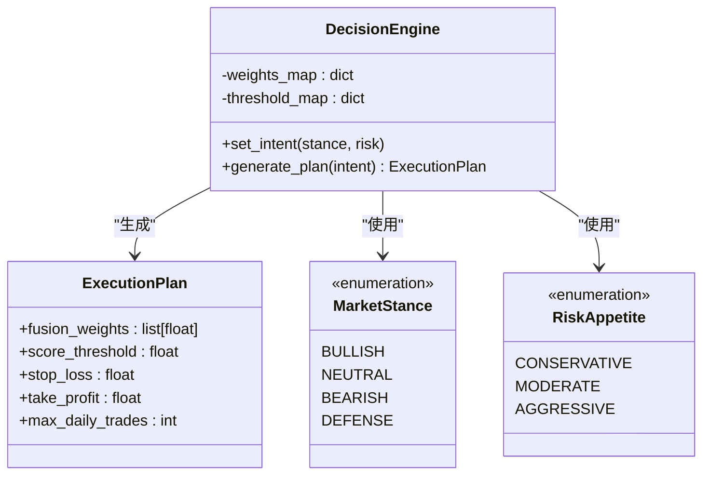
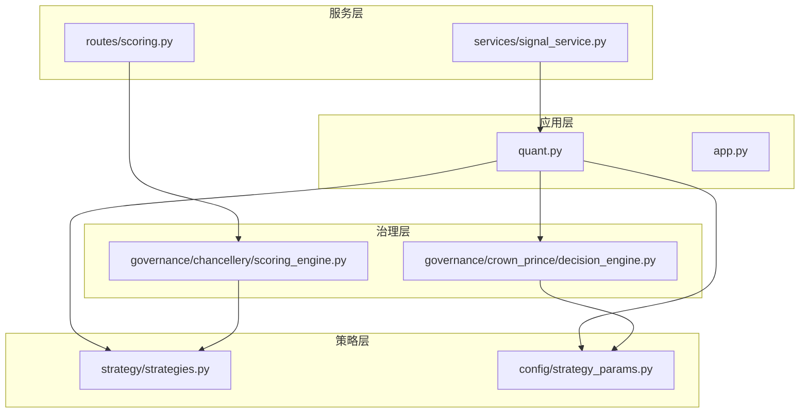

# 信号融合机制

<cite>
**本文档引用的文件**
- [strategies.py](file://strategy/strategies.py)
- [strategy_params.py](file://config/strategy_params.py)
- [quant.py](file://quant.py)
- [decision_engine.py](file://governance/crown_prince/decision_engine.py)
- [signal_service.py](file://services/signal_service.py)
- [scoring.py](file://routes/scoring.py)
- [scoring_engine.py](file://governance/chancellery/scoring_engine.py)
</cite>

## 目录
1. [简介](#简介)
2. [项目结构](#项目结构)
3. [核心组件](#核心组件)
4. [架构概览](#架构概览)
5. [详细组件分析](#详细组件分析)
6. [依赖关系分析](#依赖关系分析)
7. [性能考虑](#性能考虑)
8. [故障排除指南](#故障排除指南)
9. [结论](#结论)

## 简介

信号融合机制是本AI量化交易系统的核心功能之一，负责将多个独立的量化策略进行综合评分和信号融合。该机制采用多策略加权融合算法，通过对五个独立策略评分进行加权平均计算，生成最终的融合信号。

本系统实现了完整的信号融合流程，包括策略评分映射、权重分配、加权求和计算和最终融合分转换。融合算法能够有效降低单一策略的风险，提高信号稳定性，并增强策略对不同市场环境的适应性。

## 项目结构

信号融合机制主要分布在以下文件中：



**图表来源**
- [strategies.py:1-431](file://strategy/strategies.py#L1-L431)
- [quant.py:1-631](file://quant.py#L1-L631)

**章节来源**
- [strategies.py:1-431](file://strategy/strategies.py#L1-L431)
- [quant.py:1-631](file://quant.py#L1-L631)

## 核心组件

### 五策略融合算法

系统实现了五个独立的量化策略，每个策略都有其独特的技术特征和适用场景：

1. **放量突破策略** - 检测成交量异常放大后的价格突破信号
2. **均线粘合策略** - 识别均线收敛后的向上突破机会
3. **量价背离策略** - 检测价格与成交量的背离反转信号
4. **抄底策略** - 寻找连续下跌后的底部反弹机会
5. **主力建仓策略** - 识别主力资金吸筹的特征信号

### 融合算法流程

融合算法采用标准化的评分体系，将各策略的0-3分评分映射到0-10分范围，然后通过加权平均计算最终融合分。

**章节来源**
- [strategies.py:368-430](file://strategy/strategies.py#L368-L430)
- [strategy_params.py:6-8](file://config/strategy_params.py#L6-L8)

## 架构概览

信号融合机制的整体架构采用分层设计，确保了模块间的松耦合和高内聚：



**图表来源**
- [quant.py:107-114](file://quant.py#L107-L114)
- [strategies.py:368-430](file://strategy/strategies.py#L368-L430)

## 详细组件分析

### 融合算法实现

#### 评分映射机制

融合算法采用线性映射的方式将各策略的原始评分从0-3分转换为0-10分：



**图表来源**
- [strategies.py:403-429](file://strategy/strategies.py#L403-L429)

#### 权重配置系统

系统提供了灵活的权重配置机制，支持默认权重和自定义权重两种模式：

**默认权重设置**（经过回测验证）：
- 放量突破：0.30（核心趋势策略）
- 均线粘合：0.15（辅助确认）
- 量价背离：0.20（反转信号）
- 抄底：0.20（均值回归）
- 主力建仓：0.15（机构行为）

**动态权重调整**：


**图表来源**
- [decision_engine.py:94-122](file://governance/crown_prince/decision_engine.py#L94-L122)

**章节来源**
- [strategies.py:368-430](file://strategy/strategies.py#L368-L430)
- [decision_engine.py:94-122](file://governance/crown_prince/decision_engine.py#L94-L122)
- [strategy_params.py:6-8](file://config/strategy_params.py#L6-L8)

### 策略评分算法

#### 放量突破策略评分

放量突破策略采用三因子评分模型：
1. **成交量因子**：量比评分（1.5倍得0.5分，3倍得1.0分）
2. **趋势因子**：多头排列强度评分
3. **涨幅因子**：3日涨幅评分（2%得0.5分，4%得1.0分）

#### 均线粘合策略评分

均线粘合策略包含三个核心要素：
1. **粘合度因子**：均线间距比率评分
2. **发散强度因子**：价格与均线关系评分
3. **量能稳定性因子**：成交量偏离度评分

#### 量价背离策略评分

量价背离策略通过底背离强度、反弹强度和趋势确认三个维度进行评分。

#### 抄底策略评分

抄底策略综合下跌深度、反弹强度和放量程度三个因素。

#### 主力建仓策略评分

主力建仓策略评估低位程度、放量程度和涨幅控制三个指标。

**章节来源**
- [strategies.py:36-255](file://strategy/strategies.py#L36-L255)

### 融合函数使用示例

#### 基本使用方法

```python
# 示例：使用默认权重进行信号融合
from strategy.strategies import fuse_signals
from strategy.strategies import DEFAULT_WEIGHTS

# 假设已运行5个策略并获得结果
result = fuse_signals([strategy1_df, strategy2_df, strategy3_df, 
                     strategy4_df, strategy5_df], 
                     weights=DEFAULT_WEIGHTS)
```

#### 自定义权重配置

```python
# 示例：自定义权重进行信号融合
custom_weights = [0.25, 0.20, 0.25, 0.20, 0.10]  # 自定义权重
result = fuse_signals(strategy_dfs, weights=custom_weights)
```

#### 输入参数格式

融合函数接受以下参数：
- `dfs`: 策略结果DataFrame列表（必需）
- `weights`: 权重向量（可选，默认等权）

#### 输出结果解析

融合函数返回包含以下列的DataFrame：
- `FUSION_SCORE`: 最终融合分（0-50）
- `BUY_SIGNAL`: 买入信号（FUSION_SCORE ≥ 20）
- `VOL_SCORE`, `MA_SCORE`, `DIVERGE_SCORE`, `BOTTOM_SCORE`, `WHALE_SCORE`: 各策略独立评分

**章节来源**
- [strategies.py:368-430](file://strategy/strategies.py#L368-L430)

## 依赖关系分析

信号融合机制的依赖关系呈现清晰的层次结构：



**图表来源**
- [quant.py:26-35](file://quant.py#L26-L35)
- [decision_engine.py:61-122](file://governance/crown_prince/decision_engine.py#L61-L122)

### 关键依赖关系

1. **策略依赖**：quant.py直接依赖策略实现
2. **配置依赖**：策略参数配置影响融合权重
3. **治理依赖**：决策引擎提供动态权重调整
4. **服务依赖**：信号服务负责历史数据存储
5. **评分依赖**：多因子评分引擎提供独立评分能力

**章节来源**
- [quant.py:26-35](file://quant.py#L26-L35)
- [decision_engine.py:61-122](file://governance/crown_prince/decision_engine.py#L61-L122)

## 性能考虑

### 算法复杂度分析

融合算法的时间复杂度为O(n)，其中n为策略数量。空间复杂度同样为O(n)。

### 优化策略

1. **向量化操作**：利用pandas的向量化特性提高计算效率
2. **内存管理**：合理控制中间变量的生命周期
3. **批处理优化**：支持批量策略执行和融合
4. **缓存机制**：对重复计算的结果进行缓存

### 并发处理

系统支持多线程并发执行，能够同时处理多个股票的信号融合计算。

## 故障排除指南

### 常见问题及解决方案

#### 融合权重异常

**问题**：权重总和不等于1.0导致计算错误
**解决方案**：检查权重配置，确保权重总和为1.0

#### 策略数据缺失

**问题**：某些策略返回空DataFrame
**解决方案**：检查数据源连接和数据完整性

#### 融合分异常

**问题**：融合分超出预期范围
**解决方案**：检查评分映射和权重配置，验证数据质量

#### 性能问题

**问题**：大量股票处理时间过长
**解决方案**：启用并行处理，优化数据访问路径

**章节来源**
- [strategies.py:379-381](file://strategy/strategies.py#L379-L381)
- [quant.py:448-461](file://quant.py#L448-L461)

## 结论

信号融合机制通过多策略加权融合算法，有效提升了量化交易系统的信号质量和稳定性。该机制具有以下优势：

1. **风险分散**：通过多策略组合降低单一策略的风险暴露
2. **信号增强**：多因子共振提高信号的可靠性
3. **适应性强**：支持动态权重调整适应不同市场环境
4. **可扩展性好**：模块化设计便于添加新的策略

融合算法经过充分的回测验证，权重配置基于历史数据优化，在实际应用中表现出良好的效果。通过合理的阈值设定和风险管理，能够为投资者提供可靠的交易信号支持。