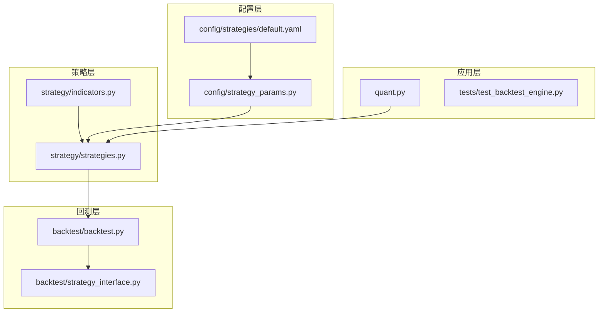
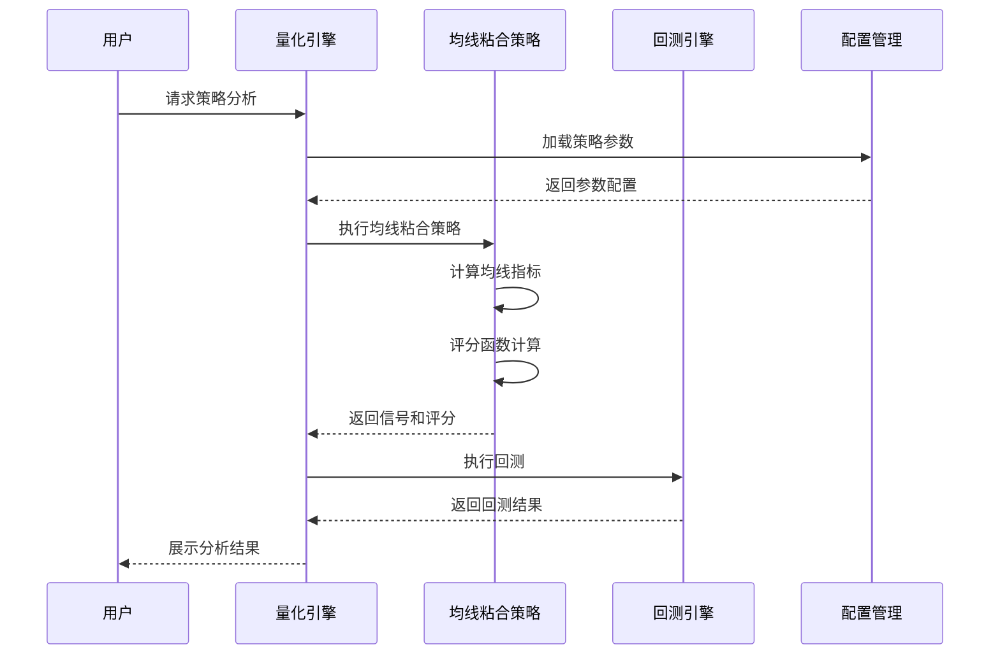
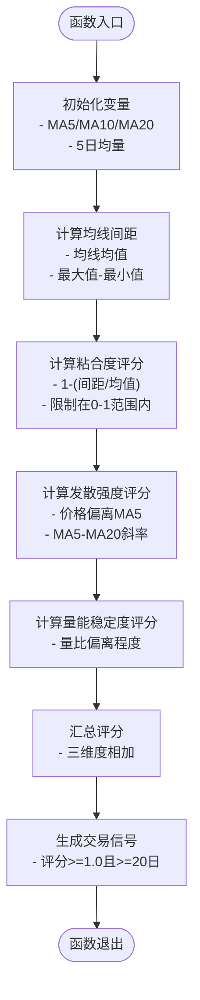
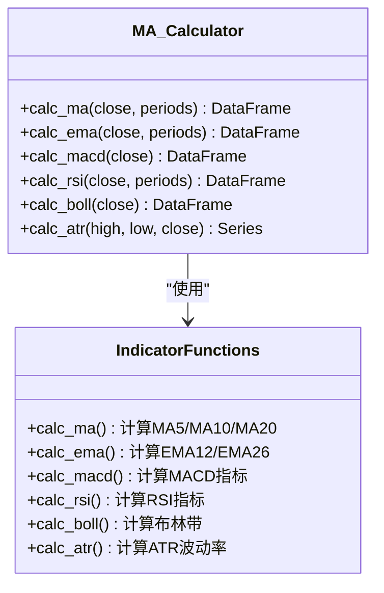
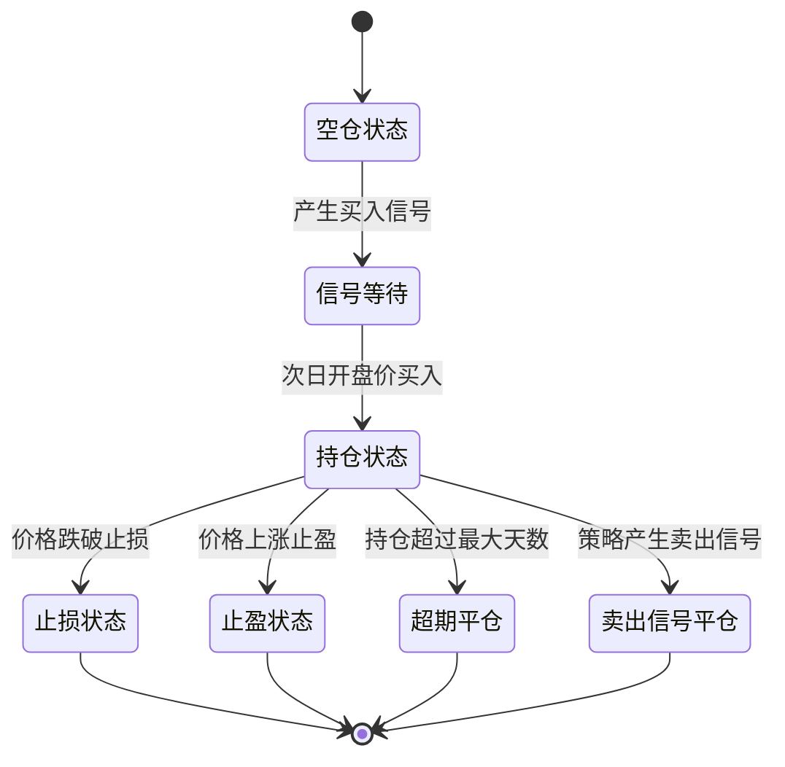
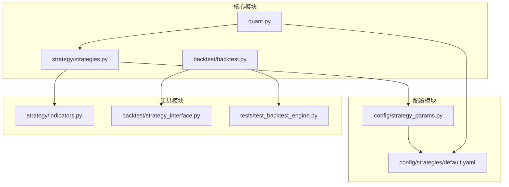

# 均线粘合策略

<cite>
**本文引用的文件**
- [strategy/strategies.py](file://strategy/strategies.py)
- [strategy/indicators.py](file://strategy/indicators.py)
- [backtest/backtest.py](file://backtest/backtest.py)
- [config/strategy_params.py](file://config/strategy_params.py)
- [config/strategies/default.yaml](file://config/strategies/default.yaml)
- [quant.py](file://quant.py)
- [backtest/strategy_interface.py](file://backtest/strategy_interface.py)
- [tests/test_backtest_engine.py](file://tests/test_backtest_engine.py)
</cite>

## 目录
1. [引言](#引言)
2. [项目结构](#项目结构)
3. [核心组件](#核心组件)
4. [架构概览](#架构概览)
5. [详细组件分析](#详细组件分析)
6. [依赖分析](#依赖分析)
7. [性能考虑](#性能考虑)
8. [故障排除指南](#故障排除指南)
9. [结论](#结论)

## 引言
本文档详细阐述了AI量化交易系统中的均线粘合策略，该策略专注于识别MA5/MA10/MA20三均线收窄后向上发散的形态，并通过三个评分维度进行综合评估。系统采用模块化设计，支持策略参数的热加载和回测引擎的统一管理。

## 项目结构
系统采用分层架构设计，主要包含策略层、指标层、回测层和配置层：

**图表来源**
- [strategy/strategies.py:1-431](file://strategy/strategies.py#L1-L431)
- [backtest/backtest.py:1-517](file://backtest/backtest.py#L1-L517)
- [config/strategy_params.py:1-76](file://config/strategy_params.py#L1-L76)
- [config/strategies/default.yaml:1-132](file://config/strategies/default.yaml#L1-L132)

**章节来源**
- [strategy/strategies.py:1-431](file://strategy/strategies.py#L1-L431)
- [backtest/backtest.py:1-517](file://backtest/backtest.py#L1-L517)

## 核心组件
均线粘合策略的核心实现位于`strategy/strategies.py`文件中，包含完整的策略函数、评分机制和信号生成逻辑。

**章节来源**
- [strategy/strategies.py:98-134](file://strategy/strategies.py#L98-L134)

## 架构概览
系统采用策略插件化架构，支持多种策略的统一管理和回测：

**图表来源**
- [quant.py:90-142](file://quant.py#L90-L142)
- [strategy/strategies.py:98-134](file://strategy/strategies.py#L98-L134)
- [backtest/backtest.py:121-409](file://backtest/backtest.py#L121-L409)

## 详细组件分析

### 均线粘合策略实现

#### 策略函数定义
均线粘合策略的核心函数`strategy_ma_convergence`实现了完整的交易逻辑：

**图表来源**
- [strategy/strategies.py:104-134](file://strategy/strategies.py#L104-L134)

#### 评分维度详解

**1. 均线粘合度评分**
- **计算公式**: `score_conv = 1 - (ma_spread / ma_mid)`
- **含义**: 衡量MA5/MA10/MA20三均线的收敛程度
- **范围**: 0-1，数值越大表示均线越收敛
- **阈值**: 通常设置为0.02-0.03之间

**2. 向上发散强度评分**
- **计算公式**: `score_up = 0.5*(close-ma5)/ma5 + 0.5*(ma5-ma20)/ma20`
- **含义**: 衡量价格与均线关系以及均线斜率
- **权重分配**: 价格偏离占50%，均线斜率占50%

**3. 量能稳定度评分**
- **计算公式**: `score_vol = 1 - |vol_ratio-1|/0.5`
- **含义**: 衡量成交量与5日均量的偏离程度
- **最优状态**: 成交量接近均量时评分最高

**章节来源**
- [strategy/strategies.py:111-127](file://strategy/strategies.py#L111-L127)

### 技术指标计算

#### 基础指标实现
系统提供了完整的移动平均线计算功能：

**图表来源**
- [strategy/indicators.py:13-236](file://strategy/indicators.py#L13-L236)

**章节来源**
- [strategy/indicators.py:13-236](file://strategy/indicators.py#L13-L236)

### 参数配置管理

#### 配置文件结构
系统支持YAML格式的策略配置，支持热加载机制：

| 配置项 | 默认值 | 说明 |
|--------|--------|------|
| ma_diff_pct | 0.03 | 均线最大偏差比例阈值 |
| score_min | 1.0 | 触发信号所需的最低评分 |
| enabled | true | 策略启用状态 |

**章节来源**
- [config/strategies/default.yaml:28-37](file://config/strategies/default.yaml#L28-L37)
- [config/strategy_params.py:20-24](file://config/strategy_params.py#L20-L24)

### 回测引擎集成

#### 交易信号处理流程
回测引擎采用T+1执行模式，确保交易的公平性和准确性：

**图表来源**
- [backtest/backtest.py:190-383](file://backtest/backtest.py#L190-L383)

**章节来源**
- [backtest/backtest.py:121-409](file://backtest/backtest.py#L121-L409)

## 依赖分析

### 模块间依赖关系

**图表来源**
- [strategy/strategies.py:26-35](file://strategy/strategies.py#L26-L35)
- [quant.py:26-35](file://quant.py#L26-L35)
- [backtest/backtest.py:16-111](file://backtest/backtest.py#L16-L111)

### 关键依赖关系

1. **策略依赖指标计算**: 均线粘合策略依赖基础技术指标计算
2. **配置依赖参数管理**: 策略参数通过配置文件进行集中管理
3. **回测依赖策略接口**: 回测引擎通过统一接口处理各种策略
4. **应用依赖策略实现**: 主要业务逻辑依赖具体的策略实现

**章节来源**
- [strategy/strategies.py:28-30](file://strategy/strategies.py#L28-L30)
- [quant.py:26-35](file://quant.py#L26-L35)

## 性能考虑

### 计算复杂度分析
- **时间复杂度**: O(n) - 线性遍历数据序列
- **空间复杂度**: O(n) - 存储均线和评分结果
- **内存优化**: 使用滚动窗口计算，避免重复计算

### 性能优化建议
1. **批量计算**: 利用pandas向量化操作提升计算效率
2. **缓存机制**: 对常用指标结果进行缓存
3. **并行处理**: 支持多股票并行分析
4. **增量更新**: 支持历史数据的增量重算

## 故障排除指南

### 常见问题及解决方案

#### 1. 信号生成异常
- **问题**: 信号频繁出现或缺失
- **排查**: 检查评分阈值设置和参数配置
- **解决**: 调整ma_diff_pct和score_min参数

#### 2. 回测结果异常
- **问题**: 回测结果显示不合理的结果
- **排查**: 验证T+1执行逻辑和交易成本计算
- **解决**: 检查手续费、滑点和交易规则配置

#### 3. 性能问题
- **问题**: 处理大量股票时响应缓慢
- **排查**: 分析计算瓶颈和内存使用情况
- **解决**: 实施并行处理和数据缓存策略

**章节来源**
- [tests/test_backtest_engine.py:19-127](file://tests/test_backtest_engine.py#L19-L127)

## 结论
均线粘合策略通过三个核心评分维度实现了对三均线收敛形态的有效识别，结合回测引擎的统一管理，为量化交易提供了可靠的信号生成机制。系统的设计充分考虑了可扩展性和维护性，支持参数的热加载和策略的灵活配置。通过持续的优化和测试，该策略能够在实际交易环境中提供稳定的性能表现。