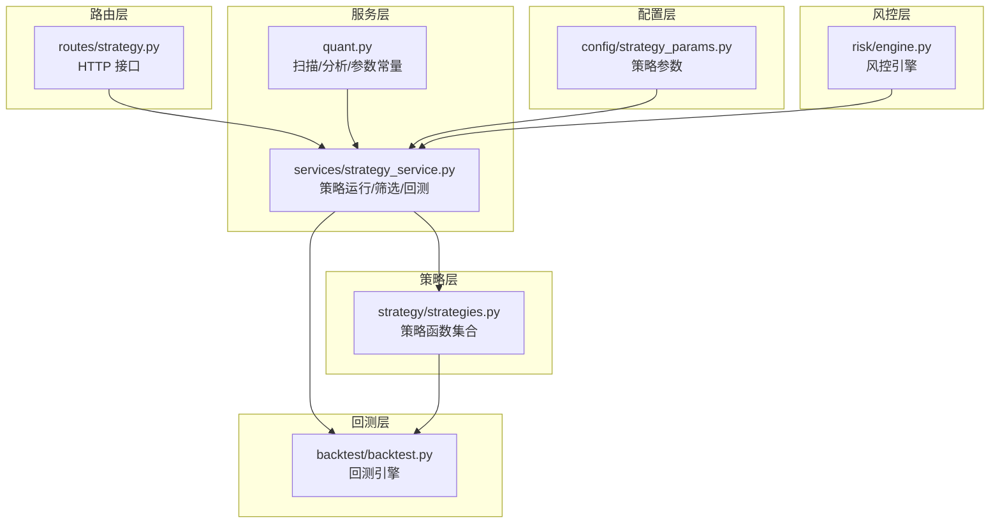
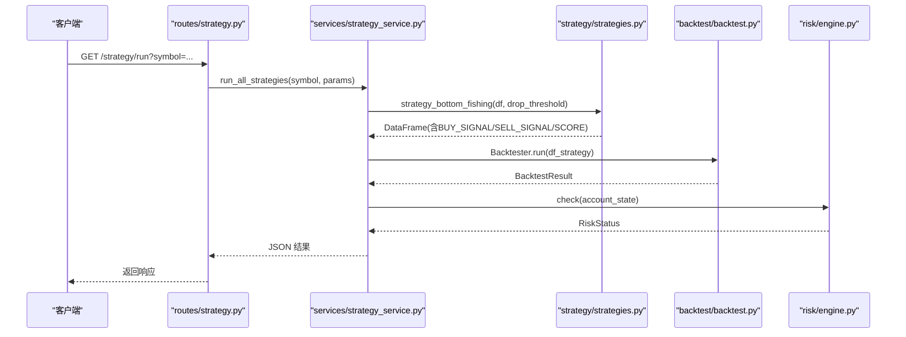
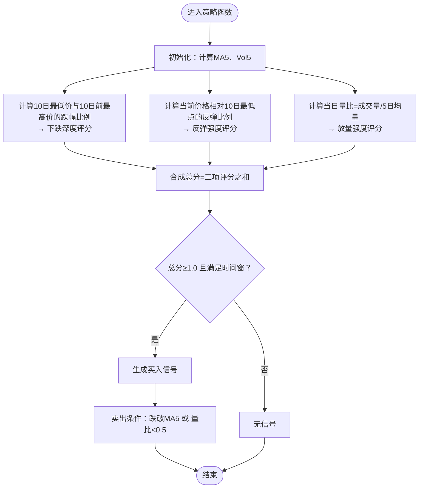
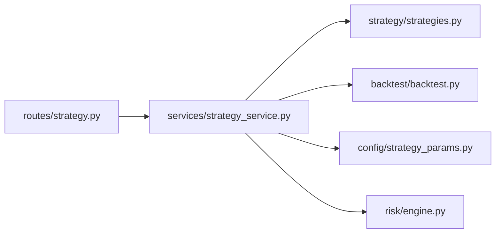

# 抄底策略

<cite>
**本文引用的文件**
- [strategy/strategies.py](file://strategy/strategies.py)
- [backtest/backtest.py](file://backtest/backtest.py)
- [quant.py](file://quant.py)
- [services/strategy_service.py](file://services/strategy_service.py)
- [routes/strategy.py](file://routes/strategy.py)
- [config/strategy_params.py](file://config/strategy_params.py)
- [risk/engine.py](file://risk/risk_engine.py)
</cite>

## 目录
1. [简介](#简介)
2. [项目结构](#项目结构)
3. [核心组件](#核心组件)
4. [架构总览](#架构总览)
5. [详细组件分析](#详细组件分析)
6. [依赖关系分析](#依赖关系分析)
7. [性能考量](#性能考量)
8. [故障排查指南](#故障排查指南)
9. [结论](#结论)
10. [附录](#附录)

## 简介
本文件面向“抄底策略”的技术文档，围绕“连续下跌后的放量反弹”识别机制展开，系统阐述三重确认条件与评分维度，并给出参数配置、滚动窗口计算、评分函数设计、买卖信号生成以及风险控制机制。同时提供策略在系统中的集成路径与回测引擎对接方式，帮助读者快速理解与落地实施。

## 项目结构
该系统采用模块化分层设计：
- 策略层：策略函数集中于策略模块，提供统一的输入输出规范（含 BUY_SIGNAL/SELL_SIGNAL/SCORE 列）。
- 服务层：封装策略调用、批量筛选、多策略并联回测等业务逻辑。
- 路由层：对外暴露 REST 接口，便于 Web/微服务调用。
- 回测层：提供统一的回测引擎，支持 T+1 执行、滑点、手续费、止损止盈、动态仓位等风控规则。
- 配置层：策略参数集中管理，便于统一维护与优化。

图表来源
- [strategy/strategies.py:185-217](file://strategy/strategies.py#L185-L217)
- [services/strategy_service.py:46-107](file://services/strategy_service.py#L46-L107)
- [routes/strategy.py:14-32](file://routes/strategy.py#L14-L32)
- [backtest/backtest.py:56-121](file://backtest/backtest.py#L56-L121)
- [config/strategy_params.py:32-37](file://config/strategy_params.py#L32-L37)
- [risk/engine.py:13-49](file://risk/engine.py#L13-L49)

章节来源
- [strategy/strategies.py:1-431](file://strategy/strategies.py#L1-L431)
- [services/strategy_service.py:1-325](file://services/strategy_service.py#L1-L325)
- [routes/strategy.py:1-87](file://routes/strategy.py#L1-L87)
- [backtest/backtest.py:1-517](file://backtest/backtest.py#L1-L517)
- [config/strategy_params.py:1-76](file://config/strategy_params.py#L1-L76)
- [risk/engine.py:1-168](file://risk/engine.py#L1-L168)

## 核心组件
- 抄底策略函数：实现三重确认评分与买卖信号生成。
- 回测引擎：统一执行 T+1 交易、风控熔断、动态仓位、滑点与手续费。
- 服务层：封装策略调用、参数注入、批量筛选与多策略并联回测。
- 路由层：提供 HTTP 接口，支持参数化调用与回测。
- 配置层：集中管理策略参数与默认权重。

章节来源
- [strategy/strategies.py:185-217](file://strategy/strategies.py#L185-L217)
- [backtest/backtest.py:56-121](file://backtest/backtest.py#L56-L121)
- [services/strategy_service.py:46-107](file://services/strategy_service.py#L46-L107)
- [routes/strategy.py:14-32](file://routes/strategy.py#L14-L32)
- [config/strategy_params.py:32-37](file://config/strategy_params.py#L32-L37)

## 架构总览
抄底策略在系统中的调用链如下：
- 路由层接收请求，解析参数。
- 服务层根据参数调用策略函数，生成信号 DataFrame。
- 回测引擎对策略信号进行回测，输出绩效指标。
- 风控引擎参与风控检查，保障系统安全运行。

图表来源
- [routes/strategy.py:14-32](file://routes/strategy.py#L14-L32)
- [services/strategy_service.py:46-107](file://services/strategy_service.py#L46-L107)
- [strategy/strategies.py:185-217](file://strategy/strategies.py#L185-L217)
- [backtest/backtest.py:121-409](file://backtest/backtest.py#L121-L409)
- [risk/engine.py:19-49](file://risk/engine.py#L19-L49)

## 详细组件分析

### 抄底策略：连续下跌后的放量反弹
- 策略目标：在前期大幅下跌后，识别底部放量反弹信号，避免假突破。
- 三重确认条件（评分维度）：
  1) 下跌深度评分：衡量前期10日内最大涨幅至10日前最低点的跌幅比例，跌幅越大，评分越高。
  2) 反弹强度评分：衡量当前价格相对10日最低点的反弹幅度，反弹越多，评分越高。
  3) 放量强度评分：衡量当日成交量相对5日均量的倍数，放量越多，评分越高。
- 评分与触发：
  - 三项评分均为0~1，合成总分为0~3。
  - 当总分≥1.0且满足时间窗要求时，生成买入信号。
  - 卖出条件：价格跌破5日均线或成交量不足5日均量的一半。
- 参数配置：
  - drop_threshold：下跌阈值（用于其他策略，抄底策略使用内部计算的10日窗口）。

图表来源
- [strategy/strategies.py:185-217](file://strategy/strategies.py#L185-L217)

章节来源
- [strategy/strategies.py:185-217](file://strategy/strategies.py#L185-L217)

### 评分函数设计与滚动窗口
- 滚动窗口：
  - 10日最低价与10日前最高价：用于衡量前期大幅下跌。
  - 5日均量：用于衡量放量强度。
  - 5日均线：用于卖出条件。
- 评分映射：
  - 下跌深度评分：跌幅比例映射到0~1。
  - 反弹强度评分：反弹比例按5%为满分映射到0~1。
  - 放量强度评分：量比按2倍为满分映射到0~1。
- 时间窗约束：
  - 买入信号仅在满足时间窗后触发，确保信号稳定性。

章节来源
- [strategy/strategies.py:196-214](file://strategy/strategies.py#L196-L214)

### 买卖信号生成与回测对接
- 买入信号：总分≥1.0且满足时间窗。
- 卖出信号：价格跌破5日均线或成交量不足5日均量的一半。
- 回测对接：
  - 回测引擎接收含 BUY_SIGNAL/SELL_SIGNAL 的 DataFrame，按 T+1 规则执行。
  - 支持滑点、手续费、止损止盈、动态仓位、回撤熔断等风控。

章节来源
- [strategy/strategies.py:214-216](file://strategy/strategies.py#L214-L216)
- [backtest/backtest.py:121-409](file://backtest/backtest.py#L121-L409)

### 参数配置与调用路径
- 路由层参数：
  - s4_drop_threshold：用于注入到策略函数（默认-0.05）。
- 服务层参数注入：
  - run_all_strategies 中将参数传入策略函数。
- 配置层参数：
  - config/strategy_params.py 提供策略默认参数字典，便于统一管理。

章节来源
- [routes/strategy.py:20-27](file://routes/strategy.py#L20-L27)
- [services/strategy_service.py:57-64](file://services/strategy_service.py#L57-L64)
- [config/strategy_params.py:32-37](file://config/strategy_params.py#L32-L37)

### 风险控制机制
- 回撤熔断：当回撤达到阈值或连续亏损达到限制时暂停开仓。
- 大盘择时：可选启用，通过大盘均线过滤。
- 动态仓位：基于ATR波动率反比调整仓位，降低波动风险。
- 止损止盈：固定止损/止盈或跟踪止盈，结合策略信号平仓。
- 风控引擎：对账户状态进行全量风控检查，输出整体风险等级与明细。

章节来源
- [backtest/backtest.py:66-110](file://backtest/backtest.py#L66-L110)
- [backtest/backtest.py:246-283](file://backtest/backtest.py#L246-L283)
- [risk/engine.py:19-49](file://risk/engine.py#L19-L49)

## 依赖关系分析
- 策略函数依赖 pandas/numpy 进行滚动窗口与数值计算。
- 服务层依赖策略函数与回测引擎，负责参数注入与结果组装。
- 路由层依赖服务层，提供 HTTP 接口。
- 回测引擎依赖策略信号与风控规则，输出绩效指标。
- 配置层为策略与服务层提供参数来源。

图表来源
- [routes/strategy.py:8-11](file://routes/strategy.py#L8-L11)
- [services/strategy_service.py:14-22](file://services/strategy_service.py#L14-L22)
- [strategy/strategies.py:28-30](file://strategy/strategies.py#L28-L30)
- [backtest/backtest.py:9-13](file://backtest/backtest.py#L9-L13)
- [config/strategy_params.py:4-5](file://config/strategy_params.py#L4-L5)
- [risk/engine.py:8-10](file://risk/engine.py#L8-L10)

章节来源
- [routes/strategy.py:1-87](file://routes/strategy.py#L1-L87)
- [services/strategy_service.py:1-325](file://services/strategy_service.py#L1-L325)
- [strategy/strategies.py:1-431](file://strategy/strategies.py#L1-L431)
- [backtest/backtest.py:1-517](file://backtest/backtest.py#L1-L517)
- [config/strategy_params.py:1-76](file://config/strategy_params.py#L1-L76)
- [risk/engine.py:1-168](file://risk/engine.py#L1-L168)

## 性能考量
- 计算复杂度：滚动窗口计算为 O(n)，策略函数整体 O(n)。
- 内存占用：主要为 pandas DataFrame 的滚动窗口缓存，通常可控。
- 优化建议：
  - 对长序列数据可考虑分块处理或缓存中间结果。
  - 合理设置时间窗，避免过长导致信号滞后。
  - 在批量扫描场景中，优先使用服务层提供的接口，减少重复计算。

## 故障排查指南
- 信号缺失：
  - 检查时间窗是否满足（策略要求满足时间窗后才触发）。
  - 确认参数 drop_threshold 是否合理。
- 回测异常：
  - 确认 DataFrame 包含 open/close/volume 等必要列。
  - 检查是否存在 NaN 或异常值影响滚动窗口。
- 风控拦截：
  - 关注风控引擎返回的整体风险等级与活动规则。
  - 调整回撤熔断阈值或连续亏损限制以适应策略特性。

章节来源
- [backtest/backtest.py:121-409](file://backtest/backtest.py#L121-L409)
- [risk/engine.py:19-49](file://risk/engine.py#L19-L49)

## 结论
抄底策略通过三重确认条件与评分机制，在连续下跌后识别底部放量反弹，具备明确的滚动窗口计算、评分函数与买卖信号生成流程。配合回测引擎与风控机制，可在实际交易中实现稳健的信号执行与风险管理。建议在参数调优与风控策略上持续迭代，以提升策略稳定性与收益风险比。

## 附录
- 策略参数参考：
  - s4_drop_threshold：用于注入到策略函数（默认-0.05）。
- 回测参数参考：
  - 滑点、手续费、止损止盈、动态仓位、回撤熔断等由回测引擎统一管理。
- 风控规则参考：
  - 回撤熔断、大盘择时、动态仓位、风控检查等由风控引擎统一管理。

章节来源
- [routes/strategy.py:20-27](file://routes/strategy.py#L20-L27)
- [backtest/backtest.py:66-110](file://backtest/backtest.py#L66-L110)
- [risk/engine.py:19-49](file://risk/engine.py#L19-L49)