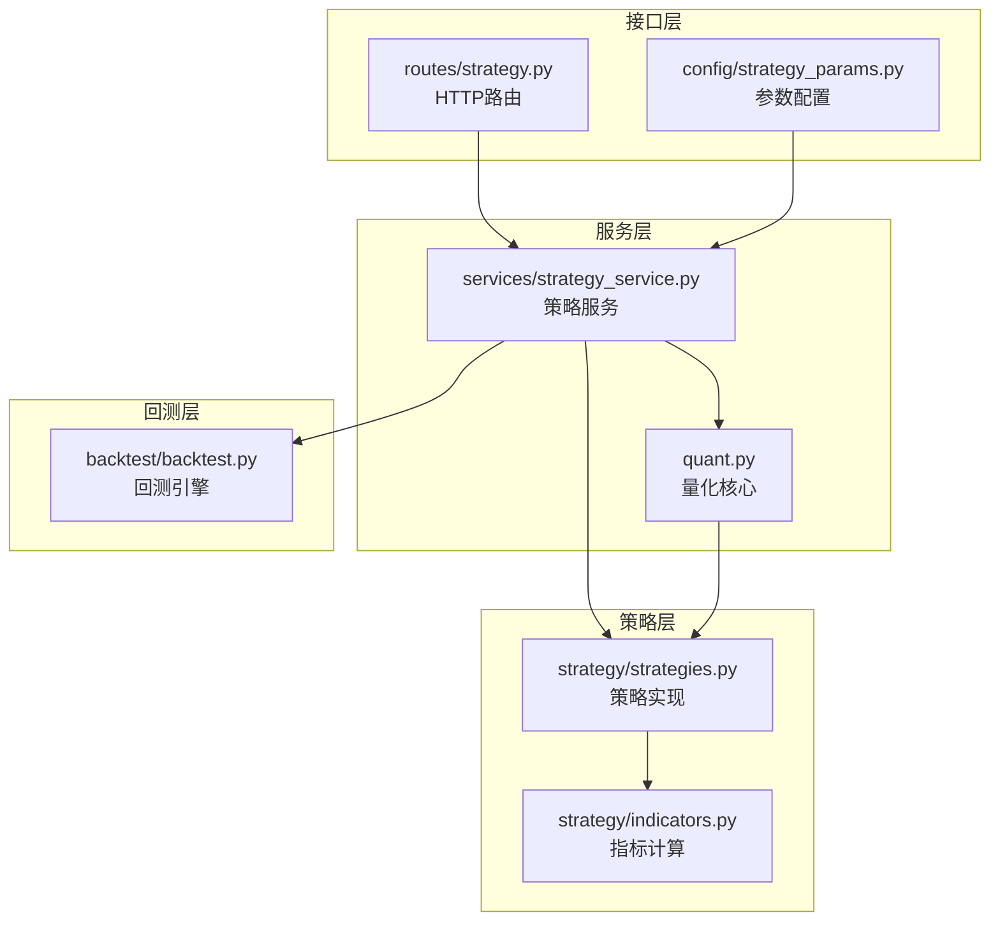
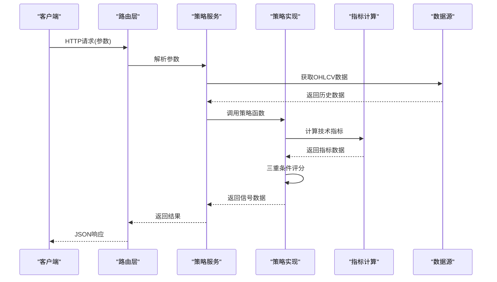
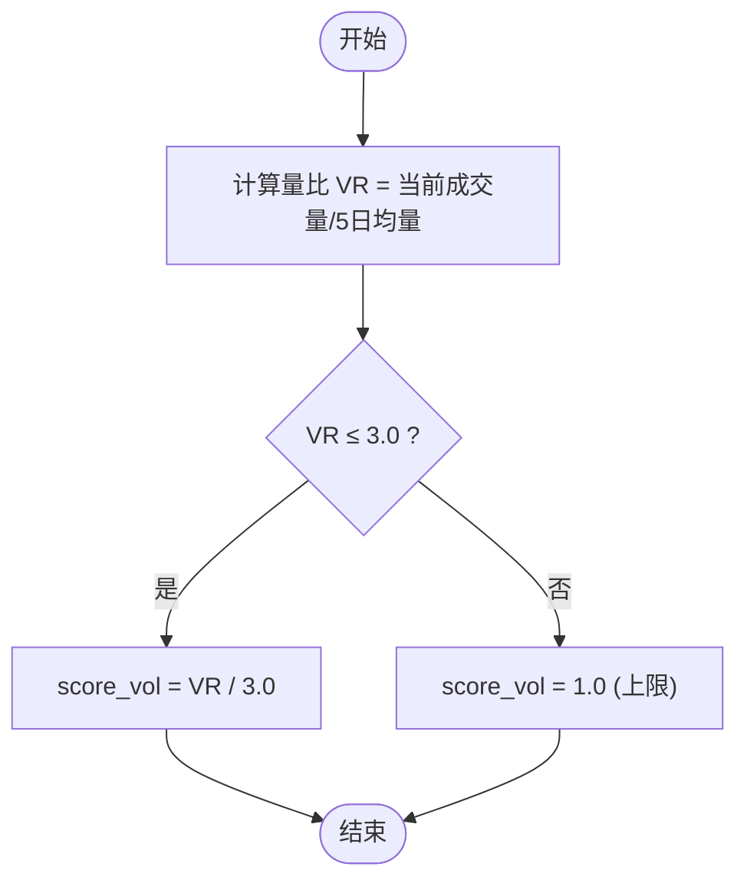
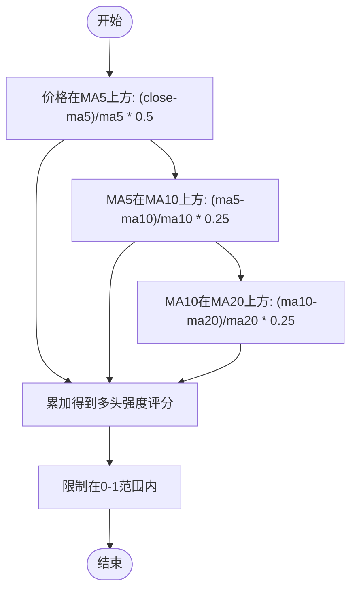
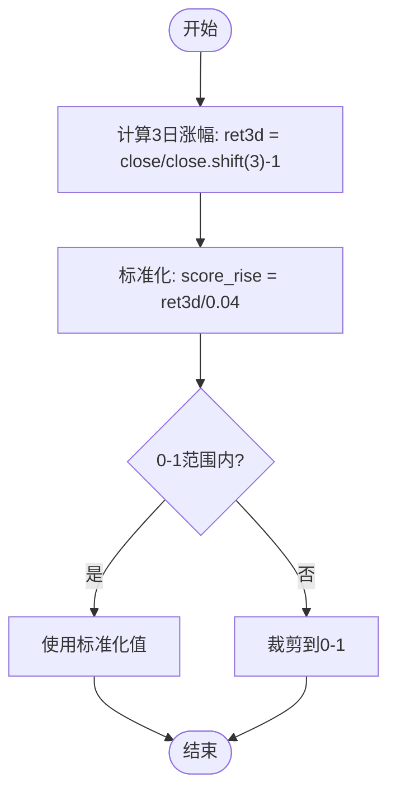
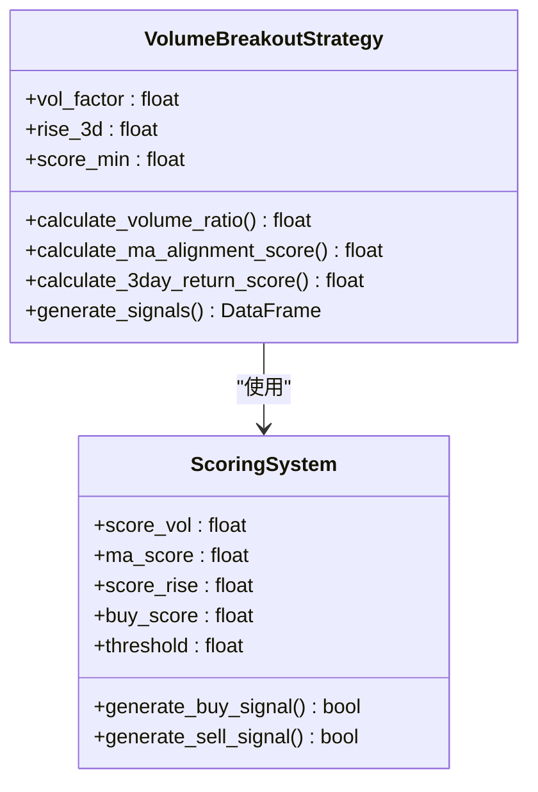
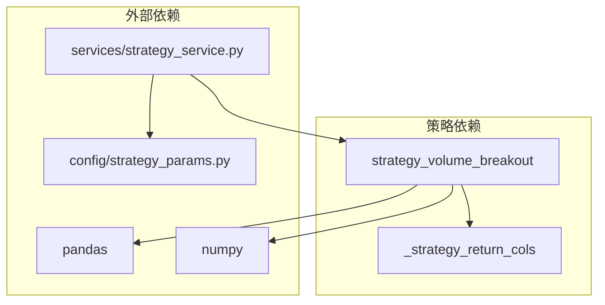

# 放量突破策略

<cite>
**本文引用的文件**
- [strategy/strategies.py](file://strategy/strategies.py)
- [services/strategy_service.py](file://services/strategy_service.py)
- [config/strategy_params.py](file://config/strategy_params.py)
- [routes/strategy.py](file://routes/strategy.py)
- [quant.py](file://quant.py)
- [backtest/backtest.py](file://backtest/backtest.py)
- [strategy/indicators.py](file://strategy/indicators.py)
</cite>

## 目录
1. [简介](#简介)
2. [项目结构](#项目结构)
3. [核心组件](#核心组件)
4. [架构概览](#架构概览)
5. [详细组件分析](#详细组件分析)
6. [依赖分析](#依赖分析)
7. [性能考虑](#性能考虑)
8. [故障排除指南](#故障排除指南)
9. [结论](#结论)
10. [附录](#附录)

## 简介
放量突破策略是本量化系统中的核心趋势策略，采用"放量 + 多头排列 + 3日涨幅"三重条件的综合评分机制。该策略通过连续化打分方法，将三个独立的技术条件转化为0-3分的综合评分，并以score_min作为触发阈值生成买入信号。策略同时定义了明确的卖出条件：死叉或跌破MA5。

该策略适用于中线趋势跟踪，特别适合捕捉强势股的突破性上涨行情。通过与其他策略的融合使用，可以有效降低单一策略的风险暴露。

## 项目结构
本策略位于策略模块的核心位置，与指标计算、服务层、路由层形成完整的架构体系：



**图表来源**
- [strategy/strategies.py:1-431](file://strategy/strategies.py#L1-L431)
- [services/strategy_service.py:1-325](file://services/strategy_service.py#L1-L325)
- [config/strategy_params.py:1-76](file://config/strategy_params.py#L1-L76)
- [routes/strategy.py:1-87](file://routes/strategy.py#L1-L87)
- [quant.py:1-631](file://quant.py#L1-L631)
- [backtest/backtest.py:1-517](file://backtest/backtest.py#L1-L517)

**章节来源**
- [strategy/strategies.py:1-431](file://strategy/strategies.py#L1-L431)
- [services/strategy_service.py:1-325](file://services/strategy_service.py#L1-L325)

## 核心组件
放量突破策略由以下核心组件构成：

### 主要策略函数
- `strategy_volume_breakout`: 主策略函数，实现三重条件评分机制
- `_strategy_return_cols`: 统一输出列格式化函数

### 关键技术指标
- **量比计算**: 当日成交量与5日均量的比值
- **多头排列强度**: MA5/MA10/MA20的相对位置和斜率评分
- **3日涨幅评分**: 连续3日涨跌幅的标准化评分

### 参数配置
- `vol_factor`: 放量倍数阈值（默认1.5）
- `rise_3d`: 3日涨幅阈值（默认0.02）
- `score_min`: 触发所需最少条件数（默认1.0）

**章节来源**
- [strategy/strategies.py:36-91](file://strategy/strategies.py#L36-L91)
- [config/strategy_params.py:14-18](file://config/strategy_params.py#L14-L18)

## 架构概览
放量突破策略在整个系统中的工作流程如下：



**图表来源**
- [routes/strategy.py:14-32](file://routes/strategy.py#L14-L32)
- [services/strategy_service.py:46-107](file://services/strategy_service.py#L46-L107)
- [strategy/strategies.py:36-91](file://strategy/strategies.py#L36-L91)

## 详细组件分析

### 放量突破策略核心逻辑

#### 量比计算方法
量比是衡量成交量相对活跃程度的重要指标：
- **计算公式**: VR = 当日成交量 / 5日平均成交量
- **评分机制**: VR ≤ 3.0 时，score_vol = VR / 3.0；VR > 3.0 时，score_vol = 1.0
- **阈值设定**: 1.5倍为基本阈值，3.0倍为满分标准



**图表来源**
- [strategy/strategies.py:64-66](file://strategy/strategies.py#L64-L66)

#### 多头排列强度评分
多头排列反映了短期、中期、长期趋势的协同一致性：



**图表来源**
- [strategy/strategies.py:70-74](file://strategy/strategies.py#L70-L74)

#### 3日涨幅评分算法
3日涨幅评分体现了近期价格走势的持续性：



**图表来源**
- [strategy/strategies.py:76-78](file://strategy/strategies.py#L76-L78)

### 综合评分与信号判定

#### 评分合成机制
策略将三个独立条件的评分进行线性合成：



**图表来源**
- [strategy/strategies.py:36-91](file://strategy/strategies.py#L36-L91)

#### 信号生成逻辑
- **买入信号**: buy_score ≥ score_min 且处于连续评分有效期
- **卖出信号**: MA5下穿MA10（死叉）或价格跌破MA5
- **评分范围**: 0-3分，score_min通常设为1.0-2.0

**章节来源**
- [strategy/strategies.py:80-91](file://strategy/strategies.py#L80-L91)

### 参数配置详解

#### 默认参数设置
| 参数名 | 默认值 | 含义 | 调优建议 |
|--------|--------|------|----------|
| vol_factor | 1.5 | 放量倍数阈值 | 1.2-2.0之间调整 |
| rise_3d | 0.02 | 3日涨幅阈值 | 0.015-0.03之间调整 |
| score_min | 1.0 | 触发阈值 | 0.5-2.0之间调整 |

#### 参数调优策略
- **严格模式**: vol_factor=2.0, rise_3d=0.025, score_min=1.5
- **宽松模式**: vol_factor=1.2, rise_3d=0.015, score_min=0.5
- **平衡模式**: vol_factor=1.5, rise_3d=0.02, score_min=1.0

**章节来源**
- [config/strategy_params.py:14-18](file://config/strategy_params.py#L14-L18)
- [services/strategy_service.py:58-60](file://services/strategy_service.py#L58-L60)

### API调用示例

#### HTTP接口调用
```bash
# 基本调用
curl "http://localhost:5000/api/strategy/run?symbol=000001&start_date=20230101"

# 自定义参数调用
curl "http://localhost:5000/api/strategy/run?symbol=000001&s1_vol_factor=1.8&s1_rise_3d=0.025&s1_score_min=1.5"
```

#### 返回值结构
```json
{
    "symbol": "000001",
    "price": 15.67,
    "strategies": {
        "s1_volume_breakout": {
            "name": "放量突破",
            "signal": "BUY",
            "score": 8.5,
            "strength": 0.85,
            "reasons": ["放量突破信号触发"]
        }
    },
    "fused": {
        "buy_signal": true,
        "confidence": 0.75,
        "num_triggered": 1,
        "final_score": 37.5,
        "reason": "综合评分"
    }
}
```

**章节来源**
- [routes/strategy.py:14-32](file://routes/strategy.py#L14-L32)
- [services/strategy_service.py:46-107](file://services/strategy_service.py#L46-L107)

## 依赖分析

### 组件耦合关系
放量突破策略与其他组件的依赖关系如下：



**图表来源**
- [strategy/strategies.py:28-29](file://strategy/strategies.py#L28-L29)
- [services/strategy_service.py:14-21](file://services/strategy_service.py#L14-L21)

### 数据流分析
策略的数据处理流程具有良好的内聚性和低耦合性：

1. **输入数据**: OHLCV格式的DataFrame
2. **中间处理**: 技术指标计算和评分合成
3. **输出结果**: 标准化的信号数据帧

**章节来源**
- [strategy/strategies.py:17-26](file://strategy/strategies.py#L17-L26)

## 性能考虑
放量突破策略在性能方面表现出色：

### 时间复杂度
- **主要计算**: O(n) - 线性遍历历史数据
- **指标计算**: O(n) - 滚动窗口计算
- **评分合成**: O(n) - 线性评分过程

### 内存使用
- **数据存储**: O(n) - 存储历史数据和中间结果
- **内存优化**: 使用就地修改减少内存占用
- **大数据处理**: 支持长周期回测数据

### 优化建议
1. **批量处理**: 对多只股票进行批量分析
2. **缓存机制**: 缓存常用指标计算结果
3. **并行计算**: 利用多核CPU进行并行处理

## 故障排除指南

### 常见问题及解决方案

#### 数据不足错误
**问题**: 数据长度小于30条
**解决**: 确保提供足够的历史数据，至少30个交易日

#### 参数配置错误
**问题**: 参数类型不正确或超出合理范围
**解决**: 检查参数类型转换和数值范围

#### 信号生成异常
**问题**: 买入信号过于频繁或稀少
**解决**: 调整score_min参数，优化阈值设置

### 调试技巧
1. **日志记录**: 添加详细的调试信息
2. **中间结果检查**: 验证每个评分步骤的正确性
3. **边界条件测试**: 测试极端情况下的表现

**章节来源**
- [services/strategy_service.py:54-55](file://services/strategy_service.py#L54-L55)

## 结论
放量突破策略通过三重条件的综合评分机制，实现了对强势突破行情的有效识别。该策略具有以下优势：

1. **逻辑清晰**: 量比、多头排列、3日涨幅三个条件相互补充
2. **参数灵活**: 支持多种参数组合，适应不同市场环境
3. **实现简洁**: 代码结构清晰，易于理解和维护
4. **扩展性强**: 可与其他策略融合使用

在实际应用中，建议根据具体市场环境调整参数设置，并结合其他技术指标进行多重确认，以提高策略的稳定性和盈利能力。

## 附录

### 适用场景
- **强势股突破**: 识别强势股的突破性上涨
- **趋势跟踪**: 适合中线趋势跟踪策略
- **多策略融合**: 作为核心策略与其他策略配合使用

### 风险控制要点
- **止损设置**: 建议设置合理的止损位
- **仓位管理**: 控制单笔交易的仓位比例
- **市场过滤**: 结合大盘趋势进行过滤
- **回撤控制**: 设置回撤熔断机制

### 与其他策略的配合使用
放量突破策略通常与以下策略配合使用：
- **均线粘合策略**: 识别整理后的突破机会
- **量价背离策略**: 发现潜在的反转信号
- **主力建仓策略**: 确认机构资金参与程度
- **超跌反弹策略**: 抓住阶段性反弹机会