# 核心策略实现

<cite>
**本文引用的文件**
- [strategy/strategies.py](file://strategy/strategies.py)
- [strategy/indicators.py](file://strategy/indicators.py)
- [backtest/backtest.py](file://backtest/backtest.py)
- [quant.py](file://quant.py)
- [strategy/config.py](file://strategy/config.py)
- [config/strategy_params.py](file://config/strategy_params.py)
- [config/strategies/default.yaml](file://config/strategies/default.yaml)
- [backtest/strategy_interface.py](file://backtest/strategy_interface.py)
- [governance/chancellery/strategy_engine.py](file://governance/chancellery/strategy_engine.py)
- [backtest/custom_strategy_backtest.py](file://backtest/custom_strategy_backtest.py)
- [tests/test_backtest_engine.py](file://tests/test_backtest_engine.py)
</cite>

## 目录
1. [简介](#简介)
2. [项目结构](#项目结构)
3. [核心组件](#核心组件)
4. [架构总览](#架构总览)
5. [详细组件分析](#详细组件分析)
6. [依赖分析](#依赖分析)
7. [性能考虑](#性能考虑)
8. [故障排查指南](#故障排查指南)
9. [结论](#结论)
10. [附录](#附录)

## 简介
本文件面向AIQuant核心策略实现，系统化阐述五种量化策略（放量突破、均线粘合、量价背离、抄底、主力建仓）与一种超跌反弹策略的实现机制，包括信号生成逻辑、技术指标计算、参数配置、评分机制、输入输出规范、参数调优方法与性能评估标准，并给出策略融合与互补性的实践指导。

## 项目结构
AIQuant采用“策略层-回测层-配置层-执行层”的分层设计：
- 策略层：策略函数与指标计算位于strategy目录
- 回测层：统一回测引擎与自定义策略回测引擎位于backtest目录
- 配置层：策略参数与融合权重通过YAML与Python模块管理
- 执行层：扫描与融合评分在quant.py中完成，策略引擎在governance中负责评分与参数下发

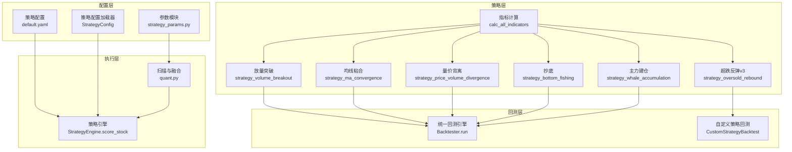

图表来源
- [strategy/strategies.py:36-431](file://strategy/strategies.py#L36-L431)
- [strategy/indicators.py:192-236](file://strategy/indicators.py#L192-L236)
- [backtest/backtest.py:121-409](file://backtest/backtest.py#L121-L409)
- [backtest/custom_strategy_backtest.py:196-668](file://backtest/custom_strategy_backtest.py#L196-L668)
- [quant.py:26-35](file://quant.py#L26-L35)
- [strategy/config.py:103-105](file://strategy/config.py#L103-L105)
- [config/strategy_params.py:65-76](file://config/strategy_params.py#L65-L76)
- [config/strategies/default.yaml:7-13](file://config/strategies/default.yaml#L7-L13)

章节来源
- [strategy/strategies.py:1-431](file://strategy/strategies.py#L1-L431)
- [strategy/indicators.py:1-244](file://strategy/indicators.py#L1-L244)
- [backtest/backtest.py:1-517](file://backtest/backtest.py#L1-L517)
- [quant.py:1-631](file://quant.py#L1-L631)
- [strategy/config.py:1-132](file://strategy/config.py#L1-L132)
- [config/strategy_params.py:1-76](file://config/strategy_params.py#L1-L76)
- [config/strategies/default.yaml:1-132](file://config/strategies/default.yaml#L1-L132)
- [backtest/custom_strategy_backtest.py:1-669](file://backtest/custom_strategy_backtest.py#L1-L669)

## 核心组件
- 策略函数族：统一返回BUY_SIGNAL/SELL_SIGNAL/BUY_SCORE/STRATEGY等列，便于回测与融合
- 指标计算：提供MA/EMA/MACD/RSI/KDJ/布林带/ATR/OBV/VWAP/CCI/DMI/量比等指标
- 回测引擎：支持T+1执行、手续费/印花税/滑点、动态仓位、熔断与大盘择时
- 配置系统：YAML热加载与Python参数模块双通道管理
- 扫描与融合：quant.py负责全市场扫描与策略融合，StrategyEngine负责评分与参数下发

章节来源
- [strategy/strategies.py:17-26](file://strategy/strategies.py#L17-L26)
- [strategy/indicators.py:13-236](file://strategy/indicators.py#L13-L236)
- [backtest/backtest.py:56-471](file://backtest/backtest.py#L56-L471)
- [quant.py:26-35](file://quant.py#L26-L35)
- [strategy/config.py:73-105](file://strategy/config.py#L73-L105)
- [config/strategy_params.py:65-76](file://config/strategy_params.py#L65-L76)

## 架构总览
策略从OHLCV数据出发，经指标计算与策略函数打分，生成信号与评分；回测引擎以T+1规则执行交易，结合成本与风控参数评估绩效；配置系统贯穿参数加载与热更新；最终由扫描与策略引擎输出融合评分与交易建议。

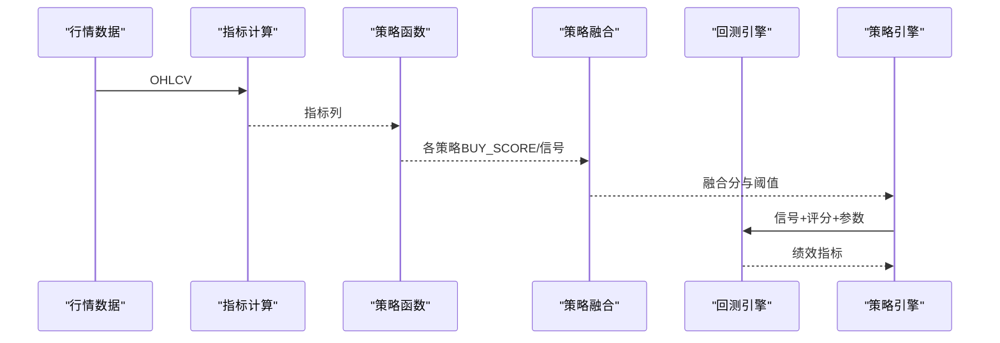

图表来源
- [strategy/strategies.py:36-431](file://strategy/strategies.py#L36-L431)
- [strategy/indicators.py:192-236](file://strategy/indicators.py#L192-L236)
- [quant.py:107-114](file://quant.py#L107-L114)
- [backtest/backtest.py:121-409](file://backtest/backtest.py#L121-L409)
- [governance/chancellery/strategy_engine.py:53-74](file://governance/chancellery/strategy_engine.py#L53-L74)

## 详细组件分析

### 放量突破策略（Volume Breakout）
- 信号生成逻辑
  - 量比打分：当日量/5日均量，映射至0~1
  - 多头排列打分：MA5/MA10/MA20相对位置与斜率，强调价格在均线上方与多头排列
  - 3日涨幅打分：(close/3日前close-1)，映射至0~1
  - 综合得分：三者相加，满分为3分；触发阈值score_min（默认1.0）
  - 卖出条件：MA5死叉MA10或跌破MA5
- 技术指标
  - MA5/MA10/MA20、量比（5日均量）
- 参数配置
  - vol_factor、rise_3d、score_min
  - YAML与Python模块均有默认值
- 评分机制
  - 0~3分，融合时映射至0~10分，再按权重加权
- 输入输出
  - 输入：OHLCV（含close、volume）
  - 输出：BUY_SIGNAL/SELL_SIGNAL/BUY_SCORE/STRATEGY列

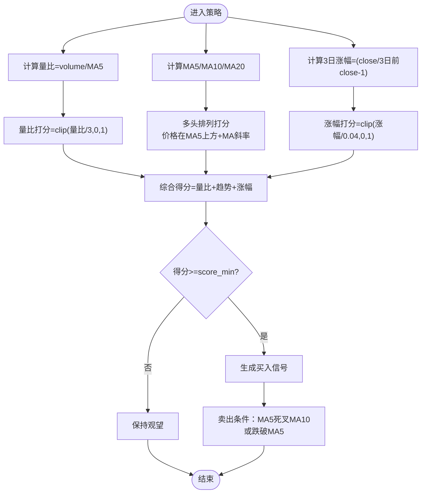

图表来源
- [strategy/strategies.py:36-91](file://strategy/strategies.py#L36-L91)
- [config/strategies/default.yaml:15-27](file://config/strategies/default.yaml#L15-L27)
- [config/strategy_params.py:13-18](file://config/strategy_params.py#L13-L18)

章节来源
- [strategy/strategies.py:36-91](file://strategy/strategies.py#L36-L91)
- [config/strategies/default.yaml:15-27](file://config/strategies/default.yaml#L15-L27)
- [config/strategy_params.py:13-18](file://config/strategy_params.py#L13-L18)

### 均线粘合策略（MA Convergence）
- 信号生成逻辑
  - 粘合度打分：(MA5/MA10/MA20)极差/均值，越小越粘合
  - 向上发散强度：价格偏离MA5程度+MA5-MA20斜率
  - 量能稳定度：量比接近1为佳
  - 综合得分满分为3分；触发阈值1.0
  - 卖出条件：MA5死叉MA10或跌破MA20
- 技术指标
  - MA5/MA10/MA20、量比（5日均量）
- 参数配置
  - YAML中提供ma_diff_pct与score_min
- 评分机制
  - 0~3分映射至0~10分，参与融合

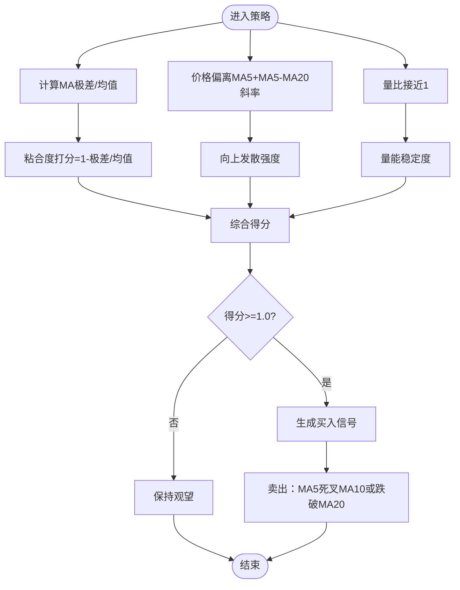

图表来源
- [strategy/strategies.py:98-134](file://strategy/strategies.py#L98-L134)
- [config/strategies/default.yaml:28-38](file://config/strategies/default.yaml#L28-L38)

章节来源
- [strategy/strategies.py:98-134](file://strategy/strategies.py#L98-L134)
- [config/strategies/default.yaml:28-38](file://config/strategies/default.yaml#L28-L38)

### 量价背离策略（Price Volume Divergence）
- 信号生成逻辑
  - 底背离强度：价格相对20日最低越高，成交量相对20日最低越高，得分越高
  - 反弹强度：前3日跌幅×0.4 + 当日涨幅×0.3 + 量比×0.3
  - 趋势确认：MA5上穿MA10
  - 综合得分满分为3分；触发阈值1.0
  - 卖出条件：close < close的MA5×0.95
- 技术指标
  - MA5/MA10、量比（5日均量）

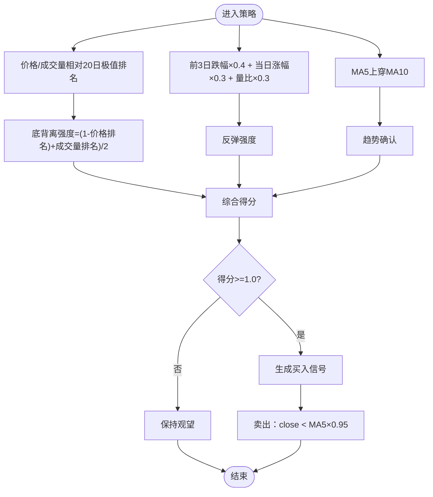

图表来源
- [strategy/strategies.py:141-178](file://strategy/strategies.py#L141-L178)

章节来源
- [strategy/strategies.py:141-178](file://strategy/strategies.py#L141-L178)

### 抄底策略（Bottom Fishing）
- 信号生成逻辑
  - 下跌深度：前期10日最高-10日最低，映射至0~1
  - 反弹强度：当前价格-10日最低，映射至0~1（5%反弹满分）
  - 放量强度：量比，映射至0~1（2倍量满分）
  - 综合得分满分为3分；触发阈值1.0
  - 卖出条件：close < MA5或volume < 5日均量×0.5
- 参数配置
  - YAML中提供drop_5d与rsi_threshold（策略函数未使用，但配置存在）

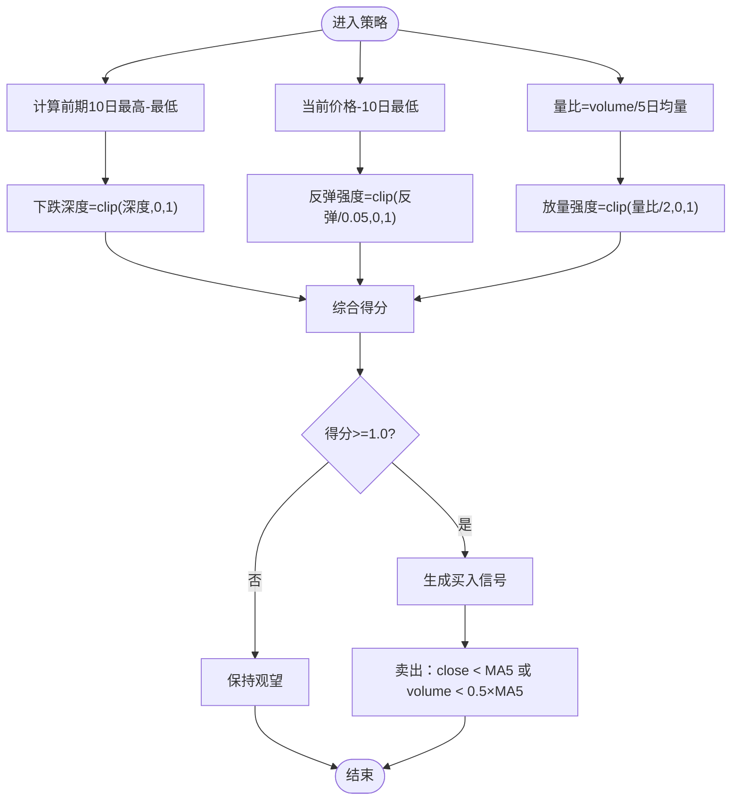

图表来源
- [strategy/strategies.py:185-217](file://strategy/strategies.py#L185-L217)
- [config/strategies/default.yaml:50-62](file://config/strategies/default.yaml#L50-L62)

章节来源
- [strategy/strategies.py:185-217](file://strategy/strategies.py#L185-L217)
- [config/strategies/default.yaml:50-62](file://config/strategies/default.yaml#L50-L62)

### 主力建仓策略（Whale Accumulation）
- 信号生成逻辑
  - 低位程度：(MA20-close)/MA20，越低越高分
  - 放量程度：量比/vol_ratio，映射至0~1（默认3倍量满分）
  - 涨幅受控：3日涨幅越小越好，映射至0~1（0%涨幅满分）
  - 综合得分满分为3分；触发阈值1.0
  - 卖出条件：close > MA20×1.1
- 参数配置
  - YAML中提供volume_spike与score_min

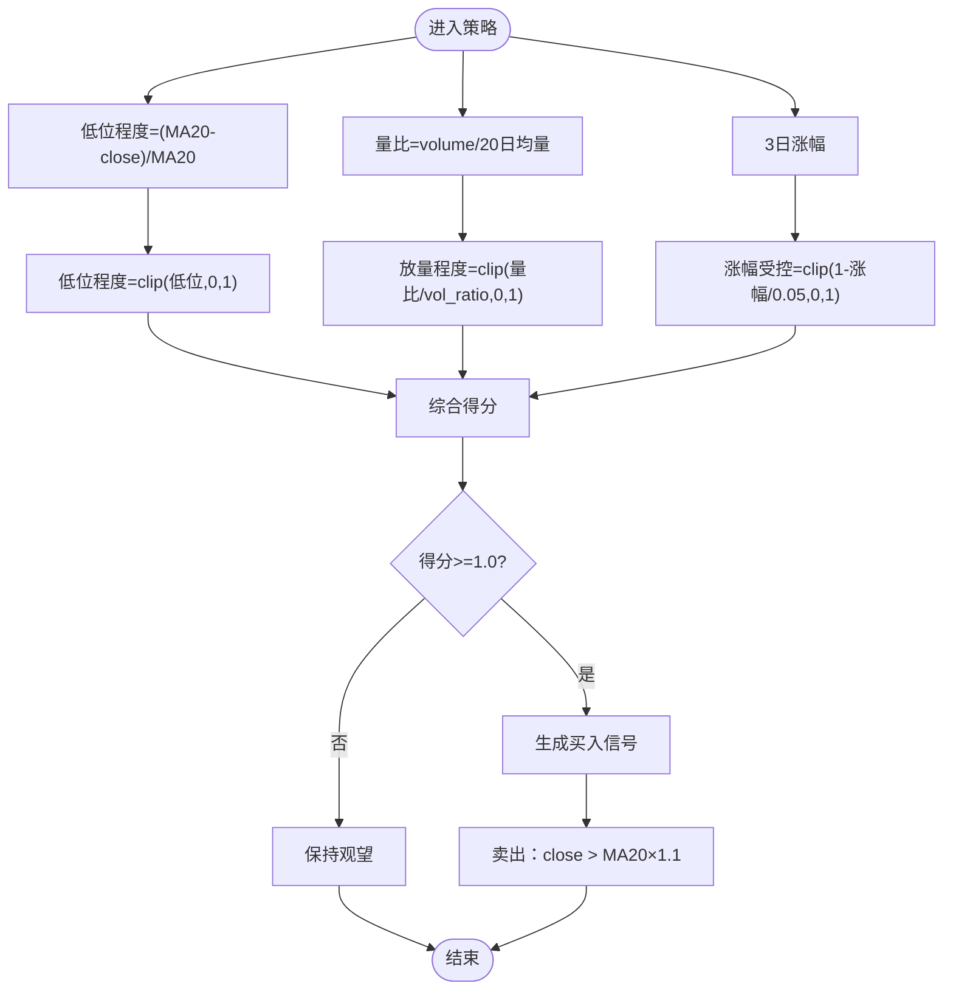

图表来源
- [strategy/strategies.py:224-255](file://strategy/strategies.py#L224-L255)
- [config/strategies/default.yaml:63-73](file://config/strategies/default.yaml#L63-L73)

章节来源
- [strategy/strategies.py:224-255](file://strategy/strategies.py#L224-L255)
- [config/strategies/default.yaml:63-73](file://config/strategies/default.yaml#L63-L73)

### 超跌反弹策略（Oversold Rebound v3）
- 信号生成逻辑
  - 20日跌幅≥12%：(-ret_20d)/12%
  - 站上MA5：(close-MA5)/MA5，2%满分
  - 成交额门槛：20日均成交额≥8000万
  - 温和放量：3日均量/5日均量，1.5倍满分
  - RSI(14)在35~50：线性映射
  - 底部平台：股价不创N日内新低（默认5日）
  - 综合得分满分为4分；触发阈值1.8
  - 卖出条件：close < MA5（回测中处理止盈止损）
- 技术指标
  - MA5、RSI(14)、量比（3日均/5日均）
- 参数配置
  - YAML中提供score_threshold、stop_loss、trailing_pct、single_pos_ratio、use_market_timing、use_trailing_stop
  - Python模块提供默认阈值与网格

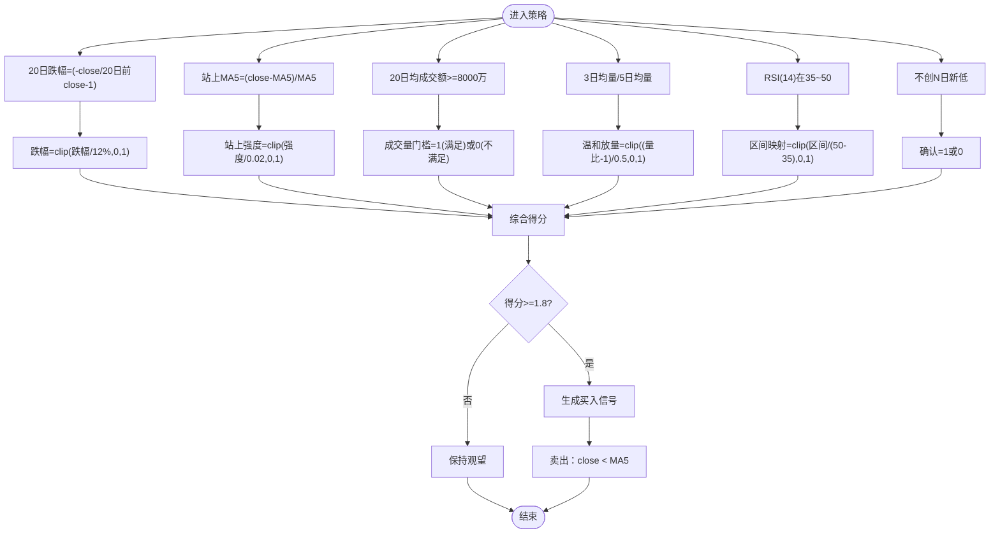

图表来源
- [strategy/strategies.py:281-360](file://strategy/strategies.py#L281-L360)
- [config/strategies/default.yaml:93-131](file://config/strategies/default.yaml#L93-L131)
- [config/strategy_params.py:45-53](file://config/strategy_params.py#L45-L53)

章节来源
- [strategy/strategies.py:281-360](file://strategy/strategies.py#L281-L360)
- [config/strategies/default.yaml:93-131](file://config/strategies/default.yaml#L93-L131)
- [config/strategy_params.py:45-53](file://config/strategy_params.py#L45-L53)

### 策略融合与评分
- 融合方式
  - 各策略原始分0~3映射至0~10
  - 按权重加权求和，再映射至0~50
  - 融合阈值默认20.0（可在配置中调整）
- 权重配置
  - YAML提供default/pure_bottom/conservative/aggressive等预设
  - Python模块提供DEFAULT_WEIGHTS与纯抄底权重
- 触发条件
  - 融合分≥阈值触发买入
  - 各策略独立列：VOL_SCORE/MA_SCORE/DIVERGE_SCORE/BOTTOM_SCORE/WHALE_SCORE/OVERSOLD_SCORE

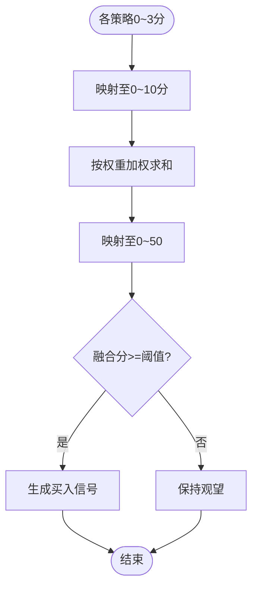

图表来源
- [strategy/strategies.py:368-429](file://strategy/strategies.py#L368-L429)
- [quant.py:107-114](file://quant.py#L107-L114)
- [config/strategies/default.yaml:7-13](file://config/strategies/default.yaml#L7-L13)
- [config/strategy_params.py:6-11](file://config/strategy_params.py#L6-L11)

章节来源
- [strategy/strategies.py:368-429](file://strategy/strategies.py#L368-L429)
- [quant.py:107-114](file://quant.py#L107-L114)
- [config/strategies/default.yaml:7-13](file://config/strategies/default.yaml#L7-L13)
- [config/strategy_params.py:6-11](file://config/strategy_params.py#L6-L11)

### 技术指标计算
- 指标类别
  - 趋势：MA、EMA、MACD、DMI
  - 震荡：RSI、KDJ、CCI
  - 波动：布林带、ATR
  - 成交量：OBV、VWAP、量比
- 使用方式
  - calc_all_indicators(df)一次性计算全部指标，返回含指标列的DataFrame
  - 策略函数可直接复用这些指标

章节来源
- [strategy/indicators.py:13-236](file://strategy/indicators.py#L13-L236)

### 回测与评估
- 回测特性
  - T+1执行：信号日不成交，次日开盘价执行
  - 成本：双向万3手续费、卖出单向千1印花税、千1滑点
  - 风控：回撤熔断（最大回撤达阈值暂停开仓）、连续亏损限制、大盘择时（MA5>MA20）、动态仓位（基于ATR）
  - 交易统计：总收益、年化、最大回撤、夏普、胜率、盈亏比、平均持仓天数、基准收益与Alpha
- 自定义策略回测
  - 用户策略函数需返回signal列（1=买入，-1=卖出，0=持有）
  - 支持按字段排序截面选股、T+1撮合、手续费/印花税/滑点与额外止损止盈

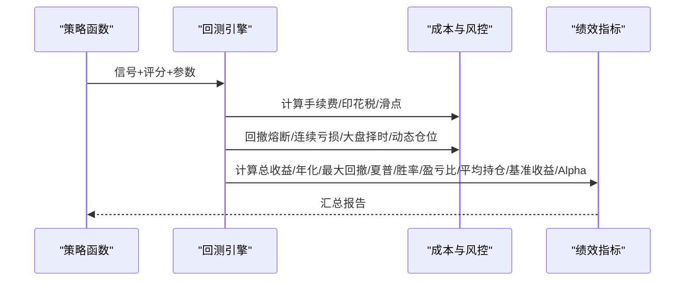

图表来源
- [backtest/backtest.py:121-471](file://backtest/backtest.py#L121-L471)
- [backtest/custom_strategy_backtest.py:196-668](file://backtest/custom_strategy_backtest.py#L196-L668)

章节来源
- [backtest/backtest.py:56-471](file://backtest/backtest.py#L56-L471)
- [backtest/custom_strategy_backtest.py:196-668](file://backtest/custom_strategy_backtest.py#L196-L668)

### 参数配置与调优
- 配置来源
  - YAML：策略启用、参数、评分权重、融合阈值、交易参数、回测参数、v4参数网格
  - Python模块：默认权重、策略参数字典、参数网格
- 调优方法
  - 策略参数：vol_factor/rise_3d/ma_diff_pct/drop_5d/rsi_threshold/volume_spike等
  - 融合权重：针对不同市场风格（保守/激进/纯抄底）调整
  - 回测参数：手续费、滑点、最大持仓天数、熔断阈值、大盘择时开关
  - v4参数网格：score_threshold、stop_loss、trailing_pct、single_pos_ratio、use_market_timing/use_trailing_stop
- 调参流程
  - 使用自定义策略回测引擎或统一回测引擎，批量运行不同参数组合
  - 依据最大回撤、胜率、夏普、盈亏比等指标选择最优组合

章节来源
- [strategy/config.py:73-127](file://strategy/config.py#L73-L127)
- [config/strategies/default.yaml:7-131](file://config/strategies/default.yaml#L7-L131)
- [config/strategy_params.py:65-76](file://config/strategy_params.py#L65-L76)
- [backtest/custom_strategy_backtest.py:36-91](file://backtest/custom_strategy_backtest.py#L36-L91)

### 策略接口与适配
- Strategy接口
  - name：策略名称
  - generate(df)：输入OHLCV，输出含BUY_SIGNAL/SELL_SIGNAL/SCORE的DataFrame
- FuncStrategy适配器
  - 将现有函数式策略包装为Strategy接口，自动映射BUY_SCORE为SCORE

章节来源
- [backtest/strategy_interface.py:23-86](file://backtest/strategy_interface.py#L23-L86)

### 策略引擎与评分
- StrategyEngine
  - 加载执行计划，执行多策略融合评分
  - 支持从配置读取融合权重与阈值
  - 输出交易信号对象（含触发列表、止盈止损、策略备注等）

章节来源
- [governance/chancellery/strategy_engine.py:32-91](file://governance/chancellery/strategy_engine.py#L32-L91)

## 依赖分析
- 策略函数依赖
  - pandas/numpy进行向量化计算
  - rolling/ewm/shift等Pandas方法构建指标序列
- 回测引擎依赖
  - T+1执行严格依赖open列；动态仓位依赖ATR序列
- 配置系统依赖
  - YAML热加载与Python模块互为备份
- 扫描与融合依赖
  - quant.py统一调用策略函数并融合，再写入数据库

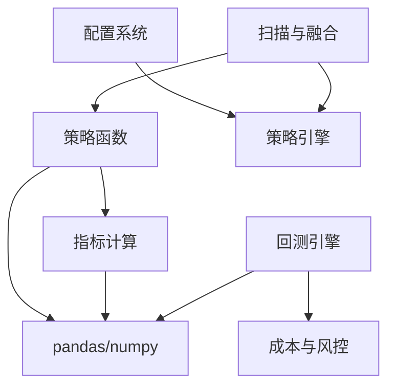

图表来源
- [strategy/strategies.py:28-431](file://strategy/strategies.py#L28-L431)
- [strategy/indicators.py:9-236](file://strategy/indicators.py#L9-L236)
- [backtest/backtest.py:121-409](file://backtest/backtest.py#L121-L409)
- [quant.py:26-35](file://quant.py#L26-L35)
- [strategy/config.py:73-105](file://strategy/config.py#L73-L105)

章节来源
- [strategy/strategies.py:28-431](file://strategy/strategies.py#L28-L431)
- [strategy/indicators.py:9-236](file://strategy/indicators.py#L9-L236)
- [backtest/backtest.py:121-409](file://backtest/backtest.py#L121-L409)
- [quant.py:26-35](file://quant.py#L26-L35)
- [strategy/config.py:73-105](file://strategy/config.py#L73-L105)

## 性能考虑
- 计算复杂度
  - 策略函数主要为滚动窗口与向量化运算，时间复杂度O(N×K)，K为指标数量
  - 融合为O(N×M)，M为策略数
- 内存占用
  - 指标计算会增加列数，建议按需计算或分批处理
- 回测效率
  - T+1延迟执行与滑点计算带来一定开销，可通过并行化与缓存优化
- 风控成本
  - 动态仓位与熔断会降低交易频率，减少潜在损失

## 故障排查指南
- T+1执行验证
  - 信号日不应成交，次日开盘价成交；滑点应作用于次日开盘价
- 资金曲线延续
  - 持仓日无数据时，应使用最近可用收盘价延续估值
- 手续费与滑点
  - 买入+卖出双向费用与卖出单向印花税需正确计算
- NaN处理
  - 使用pd.isna()判断NaN，避免truthy陷阱

章节来源
- [tests/test_backtest_engine.py:19-129](file://tests/test_backtest_engine.py#L19-L129)

## 结论
AIQuant的核心策略实现以函数式策略与统一回测引擎为核心，辅以灵活的配置系统与策略融合机制。通过量价与趋势指标的有机结合，形成多维度信号；借助严格的T+1回测与风控参数，实现稳健的绩效评估。建议在不同市场风格下动态调整融合权重与参数网格，持续优化策略表现。

## 附录
- 输入输出规范
  - 策略函数输入：OHLCV（含open/high/low/close/volume）
  - 策略函数输出：BUY_SIGNAL/SELL_SIGNAL/BUY_SCORE/STRATEGY（以及可选的high/low/open列）
- 参数调优建议
  - 从YAML默认权重与阈值起步，逐步微调至目标风格
  - 使用自定义策略回测引擎批量扫描参数网格，选取最大回撤可控、胜率与夏普兼顾的组合
- 策略互补性与融合优势
  - 放量突破捕捉趋势动能，均线粘合识别突破时机，量价背离捕捉反转信号，抄底与主力建仓捕捉超跌与机构行为，融合后可提升稳定性与覆盖率