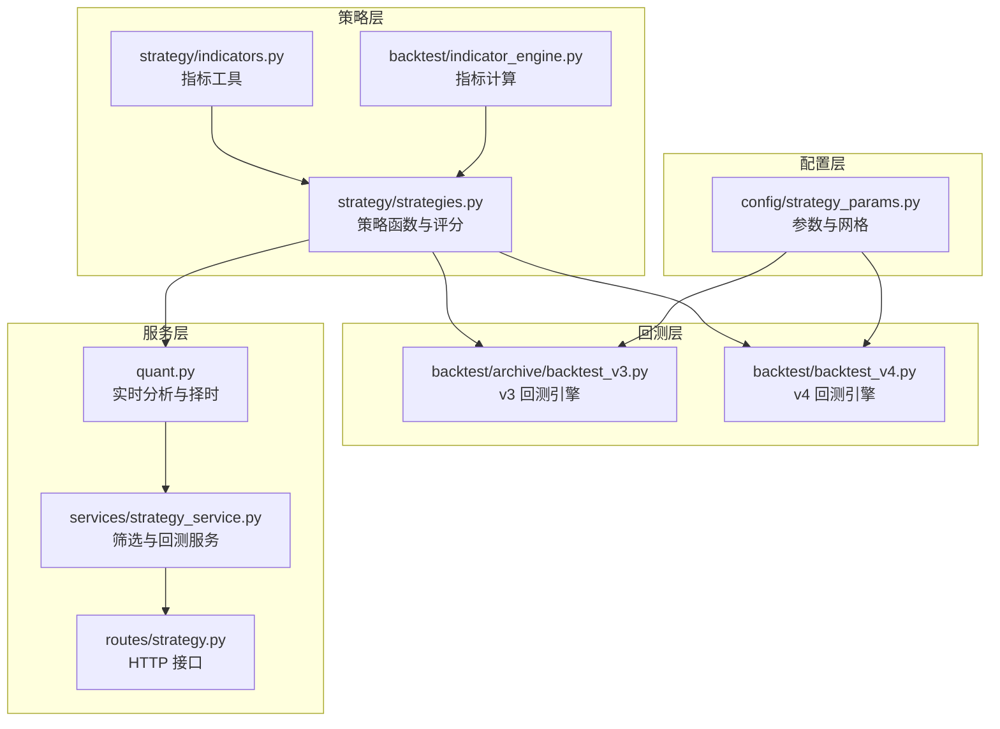
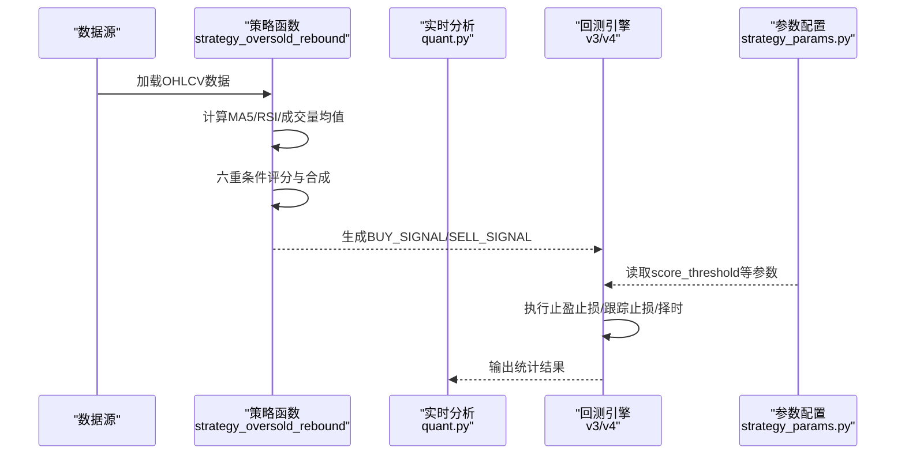
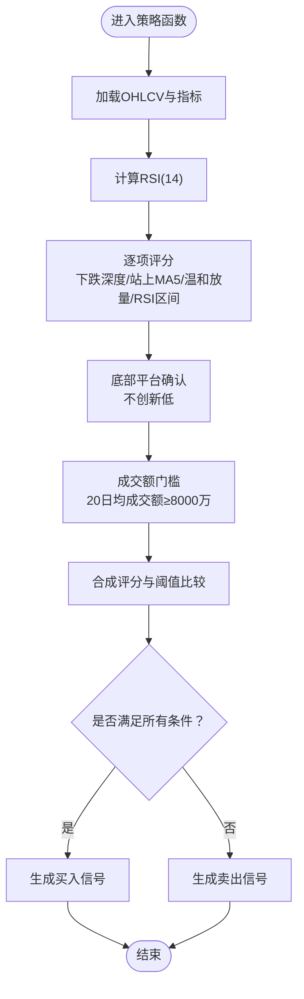
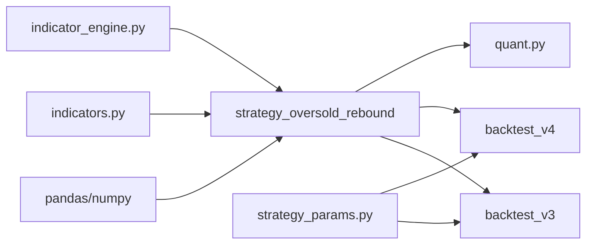

# 超跌反弹策略

<cite>
**本文引用的文件**
- [strategy/strategies.py](file://strategy/strategies.py)
- [backtest/archive/backtest_v3.py](file://backtest/archive/backtest_v3.py)
- [backtest/backtest_v4.py](file://backtest/backtest_v4.py)
- [config/strategy_params.py](file://config/strategy_params.py)
- [quant.py](file://quant.py)
- [services/strategy_service.py](file://services/strategy_service.py)
- [routes/strategy.py](file://routes/strategy.py)
- [strategy/indicators.py](file://strategy/indicators.py)
- [backtest/indicator_engine.py](file://backtest/indicator_engine.py)
</cite>

## 目录
1. [简介](#简介)
2. [项目结构](#项目结构)
3. [核心组件](#核心组件)
4. [架构概览](#架构概览)
5. [详细组件分析](#详细组件分析)
6. [依赖分析](#依赖分析)
7. [性能考虑](#性能考虑)
8. [故障排查指南](#故障排查指南)
9. [结论](#结论)
10. [附录](#附录)

## 简介
本文件面向“超跌反弹策略”的技术实现与应用，系统阐述其多条件复合机制、评分体系、参数配置、交易规则与回测实现，并提供策略参数与信号生成的代码路径指引，帮助读者快速理解并部署该策略。

## 项目结构
围绕超跌反弹策略的关键模块分布如下：
- 策略实现：strategy/strategies.py 提供策略函数与评分逻辑
- 回测引擎：backtest/archive/backtest_v3.py 与 backtest/backtest_v4.py 实现不同版本的回测流程
- 参数配置：config/strategy_params.py 提供默认参数与网格扫描配置
- 实时分析：quant.py 提供 v4 版本的实时分析与择时逻辑
- 服务接口：services/strategy_service.py 与 routes/strategy.py 提供筛选与回测接口
- 技术指标：strategy/indicators.py 与 backtest/indicator_engine.py 提供 RSI 等指标计算

图表来源
- [strategy/strategies.py:281-360](file://strategy/strategies.py#L281-L360)
- [backtest/archive/backtest_v3.py:253-634](file://backtest/archive/backtest_v3.py#L253-L634)
- [backtest/backtest_v4.py:218-581](file://backtest/backtest_v4.py#L218-L581)
- [config/strategy_params.py:45-62](file://config/strategy_params.py#L45-L62)
- [quant.py:177-282](file://quant.py#L177-L282)
- [services/strategy_service.py:14-22](file://services/strategy_service.py#L14-L22)
- [routes/strategy.py:14-87](file://routes/strategy.py#L14-L87)
- [strategy/indicators.py:46-60](file://strategy/indicators.py#L46-L60)
- [backtest/indicator_engine.py:54-60](file://backtest/indicator_engine.py#L54-L60)

章节来源
- [strategy/strategies.py:281-360](file://strategy/strategies.py#L281-L360)
- [backtest/archive/backtest_v3.py:253-634](file://backtest/archive/backtest_v3.py#L253-L634)
- [backtest/backtest_v4.py:218-581](file://backtest/backtest_v4.py#L218-L581)
- [config/strategy_params.py:45-62](file://config/strategy_params.py#L45-L62)
- [quant.py:177-282](file://quant.py#L177-L282)
- [services/strategy_service.py:14-22](file://services/strategy_service.py#L14-L22)
- [routes/strategy.py:14-87](file://routes/strategy.py#L14-L87)
- [strategy/indicators.py:46-60](file://strategy/indicators.py#L46-L60)
- [backtest/indicator_engine.py:54-60](file://backtest/indicator_engine.py#L54-L60)

## 核心组件
- 策略函数：strategy_oversold_rebound 实现六重条件复合与评分
- 回测引擎：v3/v4 提供买入信号生成、交易规则执行与统计输出
- 参数配置：score_threshold、drop_threshold、vol_20d_min、rsi_low、rsi_high、new_low_window 等
- 实时分析：quant.py 的 analyze_stock_v4 提供 v4 版本的实时评分与择时
- 指标工具：RSI 计算、MA 计算等

章节来源
- [strategy/strategies.py:281-360](file://strategy/strategies.py#L281-L360)
- [backtest/archive/backtest_v3.py:253-634](file://backtest/archive/backtest_v3.py#L253-L634)
- [backtest/backtest_v4.py:218-581](file://backtest/backtest_v4.py#L218-L581)
- [config/strategy_params.py:45-62](file://config/strategy_params.py#L45-L62)
- [quant.py:177-282](file://quant.py#L177-L282)
- [strategy/indicators.py:46-60](file://strategy/indicators.py#L46-L60)

## 架构概览
超跌反弹策略的端到端流程包括：数据加载 → 策略评分 → 信号生成 → 回测执行 → 统计输出。v4 在 v3 基础上引入了动态仓位、跟踪止损、大盘择时等增强规则。

图表来源
- [strategy/strategies.py:281-360](file://strategy/strategies.py#L281-L360)
- [backtest/archive/backtest_v3.py:253-634](file://backtest/archive/backtest_v3.py#L253-L634)
- [backtest/backtest_v4.py:218-581](file://backtest/backtest_v4.py#L218-L581)
- [config/strategy_params.py:45-62](file://config/strategy_params.py#L45-L62)
- [quant.py:177-282](file://quant.py#L177-L282)

## 详细组件分析

### 策略函数：strategy_oversold_rebound
- 输入：OHLCV 数据（含 close、volume、amount 可选）
- 输出：BUY_SIGNAL、SELL_SIGNAL、BUY_SCORE、STRATEGY
- 关键步骤：
  - 计算 MA5、3日均量、5日均量、20日均成交额
  - 计算 RSI(14)
  - 六重条件评分：下跌深度、站上MA5强度、温和放量、RSI区间、底部平台、成交额门槛
  - 合成评分 ≥ score_threshold 且不创新低、满足成交额门槛即生成买入信号

图表来源
- [strategy/strategies.py:281-360](file://strategy/strategies.py#L281-L360)

章节来源
- [strategy/strategies.py:281-360](file://strategy/strategies.py#L281-L360)

### 评分要素详解
- 下跌深度评分（基于20日跌幅的比例映射）
  - 计算：(-20日涨跌幅) / 绝对跌幅阈值，映射至0~1
  - 代码路径：[strategy/strategies.py:326-327](file://strategy/strategies.py#L326-L327)
- 站上MA5强度评分（基于相对5日均线的位置）
  - 计算：(close - MA5) / MA5，映射至0~1（涨幅上限2%）
  - 代码路径：[strategy/strategies.py:329-331](file://strategy/strategies.py#L329-L331)
- 温和放量评分（3日均量与5日均量的比较）
  - 计算：(3日均量/5日均量 - 1) / 0.5，映射至0~1（1.5倍量满分）
  - 代码路径：[strategy/strategies.py:333-335](file://strategy/strategies.py#L333-L335)
- RSI区间评分（35-50区间的理想位置）
  - 计算：(RSI - rsi_low) / (rsi_high - rsi_low)，映射至0~1
  - 代码路径：[strategy/strategies.py:337-338](file://strategy/strategies.py#L337-L338)
- 底部平台确认（N日内不创新低）
  - 计算：close > N日最低价×1.002，避免极小幅新低
  - 代码路径：[strategy/strategies.py:344-346](file://strategy/strategies.py#L344-L346)
- 成交额门槛（20日均成交额≥8000万）
  - 计算：20日均成交额 ≥ 8000万
  - 代码路径：[strategy/strategies.py:348-349](file://strategy/strategies.py#L348-L349)

章节来源
- [strategy/strategies.py:326-349](file://strategy/strategies.py#L326-L349)

### 策略参数配置
- drop_threshold：20日跌幅阈值（负值，如-0.12表示-12%）
- vol_20d_min：20日均成交额门槛（如8000万）
- rsi_low/rsi_high：RSI区间下限/上限（默认35~50）
- new_low_window：底部平台确认窗口（默认5日）
- score_threshold：合成评分阈值（默认1.8）

章节来源
- [strategy/strategies.py:281-287](file://strategy/strategies.py#L281-L287)
- [backtest/archive/backtest_v3.py:265-270](file://backtest/archive/backtest_v3.py#L265-L270)
- [backtest/backtest_v4.py:227-233](file://backtest/backtest_v4.py#L227-L233)
- [config/strategy_params.py:45-53](file://config/strategy_params.py#L45-L53)

### 交易规则与回测逻辑
- v3 规则要点
  - 持仓最短2天，最长10天
  - 止损-6%，止盈+8%~+12%减半仓，剩余跟踪MA5
  - 连续2日缩量阴跌+跌破10日低点强制清仓
  - 仓位：单只上限18%，最多6只，留20%现金
  - 代码路径：[backtest/archive/backtest_v3.py:20-31](file://backtest/archive/backtest_v3.py#L20-L31)
- v4 规则要点
  - 持仓最短3天，最长8天
  - 止损-6%，止盈+20%（v4默认）
  - 动态仓位：根据评分映射至20%~40%
  - 跟踪止损：半仓后采用固定百分比回撤跟踪
  - 大盘择时：MA5>MA20才允许开仓
  - 代码路径：[backtest/backtest_v4.py:235-238](file://backtest/backtest_v4.py#L235-L238)

章节来源
- [backtest/archive/backtest_v3.py:20-31](file://backtest/archive/backtest_v3.py#L20-L31)
- [backtest/backtest_v4.py:235-238](file://backtest/backtest_v4.py#L235-L238)

### 实时分析与接口
- quant.py 的 analyze_stock_v4
  - 基于 v4 超跌反弹策略进行实时评分与择时
  - 返回评分、触发条件、止盈止损建议
  - 代码路径：[quant.py:177-282](file://quant.py#L177-L282)
- 服务与路由
  - services/strategy_service.py 提供批量筛选与回测
  - routes/strategy.py 提供 HTTP 接口
  - 代码路径：[services/strategy_service.py:14-22](file://services/strategy_service.py#L14-L22), [routes/strategy.py:14-87](file://routes/strategy.py#L14-L87)

章节来源
- [quant.py:177-282](file://quant.py#L177-L282)
- [services/strategy_service.py:14-22](file://services/strategy_service.py#L14-L22)
- [routes/strategy.py:14-87](file://routes/strategy.py#L14-L87)

### RSI 计算与指标工具
- 策略内 RSI(14) 计算
  - 代码路径：[strategy/strategies.py:317-322](file://strategy/strategies.py#L317-L322)
- 指标工具模块
  - strategy/indicators.py 提供 RSI 多周期计算
  - backtest/indicator_engine.py 提供纯函数式指标计算
  - 代码路径：[strategy/indicators.py:46-60](file://strategy/indicators.py#L46-L60), [backtest/indicator_engine.py:54-60](file://backtest/indicator_engine.py#L54-L60)

章节来源
- [strategy/strategies.py:317-322](file://strategy/strategies.py#L317-L322)
- [strategy/indicators.py:46-60](file://strategy/indicators.py#L46-L60)
- [backtest/indicator_engine.py:54-60](file://backtest/indicator_engine.py#L54-L60)

## 依赖分析
- 策略函数依赖 pandas/numpy 进行滚动计算与向量化操作
- 回测引擎依赖数据库/缓存加载历史数据，调用策略函数生成信号
- 实时分析依赖数据库读取 OHLCV，结合 v4 参数与择时逻辑
- 指标工具模块提供通用指标计算，策略与回测均可复用

图表来源
- [strategy/strategies.py:281-360](file://strategy/strategies.py#L281-L360)
- [backtest/archive/backtest_v3.py:253-634](file://backtest/archive/backtest_v3.py#L253-L634)
- [backtest/backtest_v4.py:218-581](file://backtest/backtest_v4.py#L218-L581)
- [config/strategy_params.py:45-62](file://config/strategy_params.py#L45-L62)
- [quant.py:177-282](file://quant.py#L177-L282)
- [strategy/indicators.py:46-60](file://strategy/indicators.py#L46-L60)
- [backtest/indicator_engine.py:54-60](file://backtest/indicator_engine.py#L54-L60)

章节来源
- [strategy/strategies.py:281-360](file://strategy/strategies.py#L281-L360)
- [backtest/archive/backtest_v3.py:253-634](file://backtest/archive/backtest_v3.py#L253-L634)
- [backtest/backtest_v4.py:218-581](file://backtest/backtest_v4.py#L218-L581)
- [config/strategy_params.py:45-62](file://config/strategy_params.py#L45-L62)
- [quant.py:177-282](file://quant.py#L177-L282)
- [strategy/indicators.py:46-60](file://strategy/indicators.py#L46-L60)
- [backtest/indicator_engine.py:54-60](file://backtest/indicator_engine.py#L54-L60)

## 性能考虑
- 向量化计算：策略评分与指标计算基于 pandas rolling/ewm，具备良好性能
- 数据预加载：回测引擎批量加载历史数据，减少重复 IO
- 参数扫描：v4 提供网格扫描接口，便于快速评估参数敏感性
- 大盘择时：v4 引入 MA5/MA20 择时，降低系统性风险

## 故障排查指南
- 信号缺失
  - 检查 score_threshold 是否过高（默认1.8）
  - 检查 drop_threshold、rsi 区间、new_low_window 设置
  - 代码路径：[strategy/strategies.py:351](file://strategy/strategies.py#L351)
- 回测异常
  - 确认数据完整性（至少25日）
  - 检查参数边界（如 vol_20d_min、rsi 区间）
  - 代码路径：[backtest/archive/backtest_v3.py:326-329](file://backtest/archive/backtest_v3.py#L326-L329)
- 实时分析失败
  - 检查数据库连接与 OHLCV 数据可用性
  - 代码路径：[quant.py:198-201](file://quant.py#L198-L201)

章节来源
- [strategy/strategies.py:351](file://strategy/strategies.py#L351)
- [backtest/archive/backtest_v3.py:326-329](file://backtest/archive/backtest_v3.py#L326-L329)
- [quant.py:198-201](file://quant.py#L198-L201)

## 结论
超跌反弹策略通过六重条件复合与连续评分，形成稳健的信号生成机制。v4 在 v3 基础上引入动态仓位、跟踪止损与大盘择时，进一步提升风险控制能力。配合参数扫描与实时分析，可在回测与实盘中实现高效落地。

## 附录
- 代码示例路径
  - 策略评分函数：[strategy/strategies.py:281-360](file://strategy/strategies.py#L281-L360)
  - v3 回测引擎：[backtest/archive/backtest_v3.py:253-634](file://backtest/archive/backtest_v3.py#L253-L634)
  - v4 回测引擎：[backtest/backtest_v4.py:218-581](file://backtest/backtest_v4.py#L218-L581)
  - 实时分析：[quant.py:177-282](file://quant.py#L177-L282)
  - RSI 计算：[strategy/strategies.py:317-322](file://strategy/strategies.py#L317-L322)