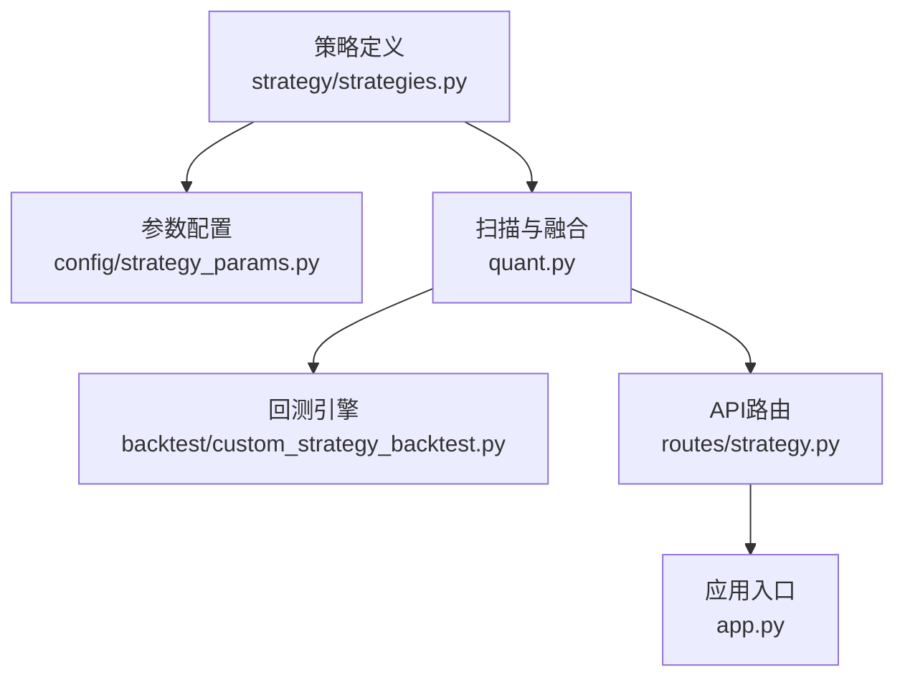
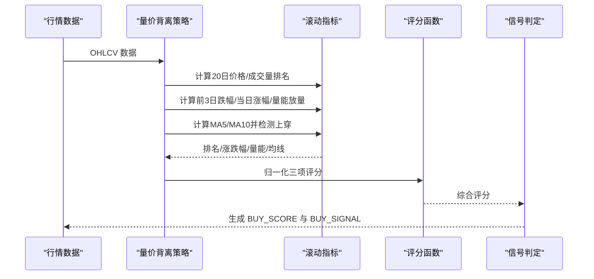
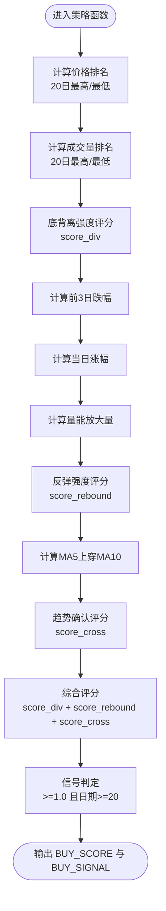
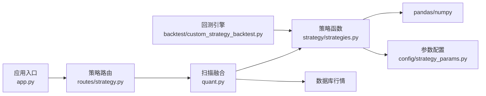

# 量价背离策略

<cite>
**本文引用的文件**
- [strategy/strategies.py](file://strategy/strategies.py)
- [config/strategy_params.py](file://config/strategy_params.py)
- [quant.py](file://quant.py)
- [backtest/custom_strategy_backtest.py](file://backtest/custom_strategy_backtest.py)
- [routes/strategy.py](file://routes/strategy.py)
- [app.py](file://app.py)
</cite>

## 目录
1. [简介](#简介)
2. [项目结构](#项目结构)
3. [核心组件](#核心组件)
4. [架构概览](#架构概览)
5. [详细组件分析](#详细组件分析)
6. [依赖分析](#依赖分析)
7. [性能考虑](#性能考虑)
8. [故障排查指南](#故障排查指南)
9. [结论](#结论)
10. [附录](#附录)

## 简介
本文件面向“量价背离策略”的技术实现与使用，围绕“底背离检测的反转交易机制”展开，系统阐述以下内容：
- 反转交易原理：价格创新低但成交量未创新高的底部背离识别
- 三个评分要素：底背离强度评分（基于价格排名和成交量排名的对比）、反弹强度评分（前3日跌幅、当日涨幅和放量程度的综合）、趋势逆转确认度评分（MA5上穿MA10的技术确认）
- 数学模型：价格排名计算（相对于20日最高价和最低价的位置）、成交量排名算法、综合评分函数
- 实现细节：滚动窗口计算、评分归一化、信号判定过程
- 适用市场环境与风险控制要点

## 项目结构
本策略位于策略框架中，采用“多策略统一返回列”的设计，便于融合与其他策略共同使用。关键位置如下：
- 策略主体：strategy/strategies.py 中的策略3（量价背离）
- 参数配置：config/strategy_params.py 中的 PRICE_VOLUME_DIVERGENCE
- 扫描与融合：quant.py 中的分析与融合流程
- 回测与排名：backtest/custom_strategy_backtest.py 中的截面排名与回测
- API路由：routes/strategy.py 与 app.py 提供对外接口

图表来源
- [strategy/strategies.py:138-178](file://strategy/strategies.py#L138-L178)
- [config/strategy_params.py:26-30](file://config/strategy_params.py#L26-L30)
- [quant.py:88-142](file://quant.py#L88-L142)
- [backtest/custom_strategy_backtest.py:466-517](file://backtest/custom_strategy_backtest.py#L466-L517)
- [routes/strategy.py:14-32](file://routes/strategy.py#L14-L32)
- [app.py:39-75](file://app.py#L39-L75)

章节来源
- [strategy/strategies.py:138-178](file://strategy/strategies.py#L138-L178)
- [config/strategy_params.py:26-30](file://config/strategy_params.py#L26-L30)
- [quant.py:88-142](file://quant.py#L88-L142)
- [backtest/custom_strategy_backtest.py:466-517](file://backtest/custom_strategy_backtest.py#L466-L517)
- [routes/strategy.py:14-32](file://routes/strategy.py#L14-L32)
- [app.py:39-75](file://app.py#L39-L75)

## 核心组件
- 量价背离策略函数：实现底背离强度、反弹强度与趋势确认三项评分，并输出 BUY_SCORE 与 BUY_SIGNAL
- 参数配置：提供 lookback 与 score_min 等默认参数
- 扫描与融合：从数据库读取行情，运行策略，融合多策略并输出综合评分
- 回测与截面排名：在回测引擎中对候选股票进行截面排名，辅助择时与排序
- API路由：提供策略运行与扫描接口，便于前端与自动化任务调用

章节来源
- [strategy/strategies.py:141-178](file://strategy/strategies.py#L141-L178)
- [config/strategy_params.py:26-30](file://config/strategy_params.py#L26-L30)
- [quant.py:88-142](file://quant.py#L88-L142)
- [backtest/custom_strategy_backtest.py:466-517](file://backtest/custom_strategy_backtest.py#L466-L517)
- [routes/strategy.py:14-32](file://routes/strategy.py#L14-L32)

## 架构概览
量价背离策略在系统中的工作流如下：
- 输入：OHLCV 数据（含 close、volume 等）
- 计算：滚动窗口（20日）计算价格与成交量的排名；计算前3日跌幅、当日涨幅与量能放量；计算MA5与MA10交叉
- 评分：三项评分分别归一化至0~1，合成综合评分
- 信号：综合评分达到阈值且满足日期窗口要求时生成买入信号，否则为持有

图表来源
- [strategy/strategies.py:141-178](file://strategy/strategies.py#L141-L178)

## 详细组件分析

### 量价背离策略函数
该函数实现“底背离反转交易”的核心逻辑，包含三个评分要素与综合评分、信号判定。

- 底背离强度评分（score_div）
  - 通过价格排名与成交量排名的对比，衡量“价格创新低而成交量未创新高”的背离程度
  - 价格排名：(close - 20日最低) / (20日最高 - 20日最低)，反映价格在20日区间的相对位置
  - 成交量排名：(volume - 20日最低) / (20日最高 - 20日最低)，反映量能的相对位置
  - 底背离强度 = (1 - 价格排名) + 成交量排名 的平均，映射到0~1

- 反弹强度评分（score_rebound）
  - 综合三因素：前3日跌幅（越大越强）、当日涨幅（越大越强）、放量程度（量能较5日均量的倍数）
  - 权重分配：前3日跌幅 40%、当日涨幅 30%、放量程度 30%
  - 归一化至0~1

- 趋势逆转确认度评分（score_cross）
  - MA5上穿MA10：(ma5 - ma10) > 0 且 (ma5.shift(1) - ma10.shift(1)) <= 0
  - 该条件成立则赋值1，否则0

- 综合评分与信号
  - 综合评分 = 三项评分之和，归一化后在0~3之间
  - 买入信号：综合评分 ≥ 1.0 且日期索引满足至少20日窗口
  - 卖出信号：close < close.rolling(5).mean() * 0.95

图表来源
- [strategy/strategies.py:141-178](file://strategy/strategies.py#L141-L178)

章节来源
- [strategy/strategies.py:141-178](file://strategy/strategies.py#L141-L178)

### 数学模型详解

- 价格排名计算（20日窗口）
  - 位置 = (close - 20日最低) / (20日最高 - 20日最低)
  - 位置越低，表示价格越接近20日底部，底背离信号越强
  - 通过 (1 - 位置) 将“越低越强”映射为评分

- 成交量排名算法（20日窗口）
  - 位置 = (volume - 20日最低) / (20日最高 - 20日最低)
  - 成交量越低，表示放量程度越弱，越符合“量能未创新高”的背离特征

- 综合评分函数
  - score_div ∈ [0,1]：底背离强度
  - score_rebound ∈ [0,1]：反弹强度（前3日跌幅×0.4 + 当日涨幅×0.3 + 放量程度×0.3）
  - score_cross ∈ {0,1}：MA5上穿MA10确认
  - BUY_SCORE = score_div + score_rebound + score_cross
  - 买入条件：BUY_SCORE ≥ 1.0 且索引满足至少20日窗口

- 信号判定与滚动窗口
  - 由于使用了20日滚动极值与5日均线，策略要求至少20日的数据窗口
  - 买入信号仅在索引满足“日期≥第20日”时生效，避免未来数据泄露

章节来源
- [strategy/strategies.py:141-178](file://strategy/strategies.py#L141-L178)

### 参数配置与默认值
- lookback：回溯天数（默认20日）
- score_min：触发阈值（默认1.0）

章节来源
- [config/strategy_params.py:26-30](file://config/strategy_params.py#L26-L30)

### 扫描与融合流程
- 从数据库读取历史行情，运行5个策略（包括量价背离）
- 取当日各策略原始分（0~3），映射到0~10分
- 按权重融合得到0~50分的综合分
- 综合分达到阈值（默认28.0）时输出推荐

章节来源
- [quant.py:88-142](file://quant.py#L88-L142)

### 回测与截面排名
- 回测引擎在每日候选股票上计算截面排名，包括成交量、成交额、5日量能等
- 量能类字段的排名列名映射：vol_rank→volume_rnk、amount_rank→amount_rnk、vol5d_rank→vol_sum_5d_rnk 等
- 通过排序字段（如 fusion_score）对候选进行优先级排序

章节来源
- [backtest/custom_strategy_backtest.py:466-517](file://backtest/custom_strategy_backtest.py#L466-L517)

### API与应用集成
- 策略路由：提供运行单只股票策略与全市场扫描的接口
- 应用入口：注册所有蓝图，提供统一的REST API与WebSocket

章节来源
- [routes/strategy.py:14-32](file://routes/strategy.py#L14-L32)
- [app.py:39-75](file://app.py#L39-L75)

## 依赖分析
- 策略函数依赖 pandas/numpy 进行滚动计算与向量化操作
- 参数配置集中于 config/strategy_params.py，便于统一管理
- 扫描与融合依赖数据库行情数据与量化核心模块
- 回测引擎依赖技术指标计算与截面排名逻辑

图表来源
- [strategy/strategies.py:141-178](file://strategy/strategies.py#L141-L178)
- [config/strategy_params.py:26-30](file://config/strategy_params.py#L26-L30)
- [quant.py:88-142](file://quant.py#L88-L142)
- [backtest/custom_strategy_backtest.py:466-517](file://backtest/custom_strategy_backtest.py#L466-L517)
- [routes/strategy.py:14-32](file://routes/strategy.py#L14-L32)
- [app.py:39-75](file://app.py#L39-L75)

## 性能考虑
- 滚动窗口计算：20日与5日均线、量能均值等均为O(n)线性复杂度
- 排名计算：对候选集进行截面排名时，建议在回测引擎中批量处理，避免逐行计算
- 评分归一化：使用 clip 与 fillna 控制边界与缺失值，减少异常分支
- 信号判定：仅在满足日期窗口条件下生成信号，避免早期数据的无效信号

## 故障排查指南
- 数据不足：策略要求至少20日数据，否则 BUY_SIGNAL 不会触发
- 未来数据泄露：确保仅在索引满足“日期≥第20日”时生成信号
- 参数调整：可通过 config/strategy_params.py 修改 lookback 与 score_min
- 回测排名：若截面排名异常，检查候选集字段是否存在 volume、amount、vol_sum_5d 等

章节来源
- [strategy/strategies.py:141-178](file://strategy/strategies.py#L141-L178)
- [config/strategy_params.py:26-30](file://config/strategy_params.py#L26-L30)
- [backtest/custom_strategy_backtest.py:466-517](file://backtest/custom_strategy_backtest.py#L466-L517)

## 结论
量价背离策略通过“价格创新低而成交量未创新高”的底背离识别，结合反弹强度与趋势确认，形成稳健的反转交易信号。其数学模型清晰、实现简洁，适合在多策略融合框架中作为反转信号源使用。建议在实际应用中：
- 关注市场环境：适用于震荡或阶段性底部区域
- 风险控制：严格遵守信号日期窗口与卖出条件，避免在高位追涨
- 参数优化：根据回测结果微调阈值与权重，提升信号质量

## 附录

### 策略实现路径参考
- 量价背离策略函数：[strategy/strategies.py:141-178](file://strategy/strategies.py#L141-L178)
- 参数配置：[config/strategy_params.py:26-30](file://config/strategy_params.py#L26-L30)
- 扫描与融合：[quant.py:88-142](file://quant.py#L88-L142)
- 回测与截面排名：[backtest/custom_strategy_backtest.py:466-517](file://backtest/custom_strategy_backtest.py#L466-L517)
- API路由与应用入口：[routes/strategy.py:14-32](file://routes/strategy.py#L14-L32)、[app.py:39-75](file://app.py#L39-L75)