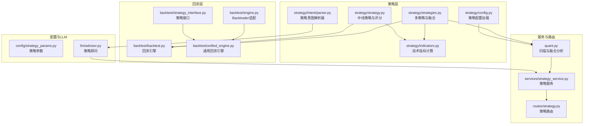
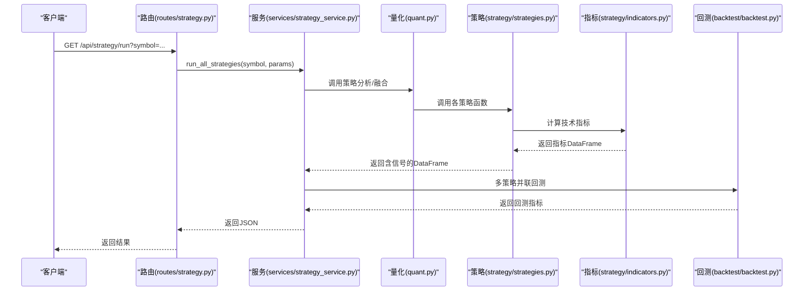
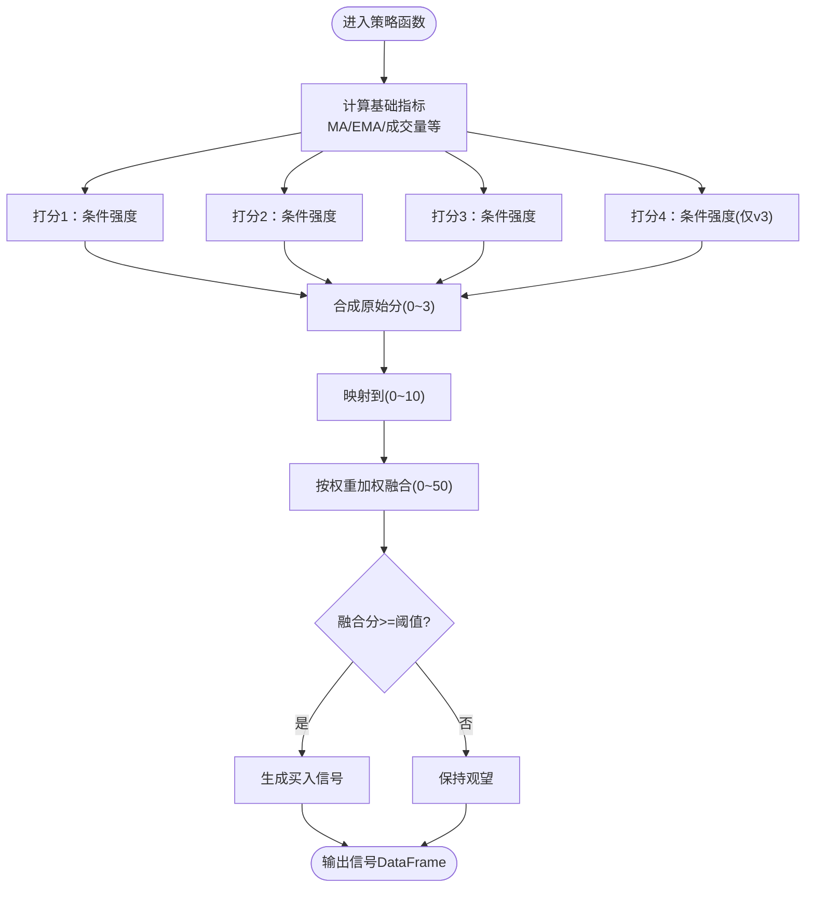
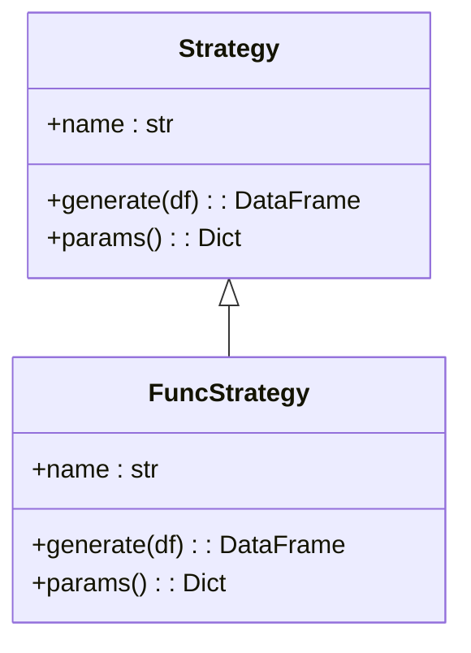
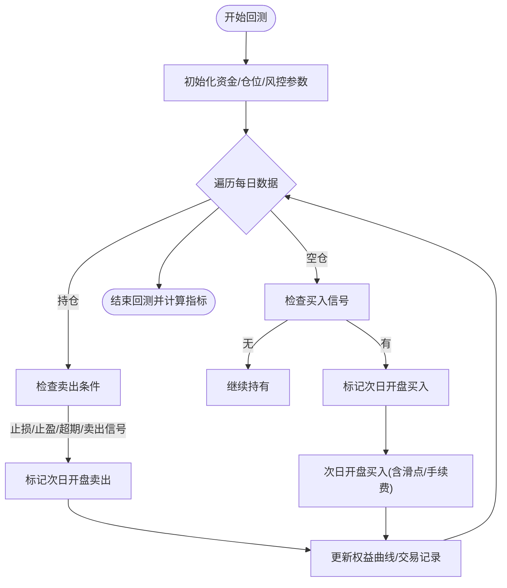
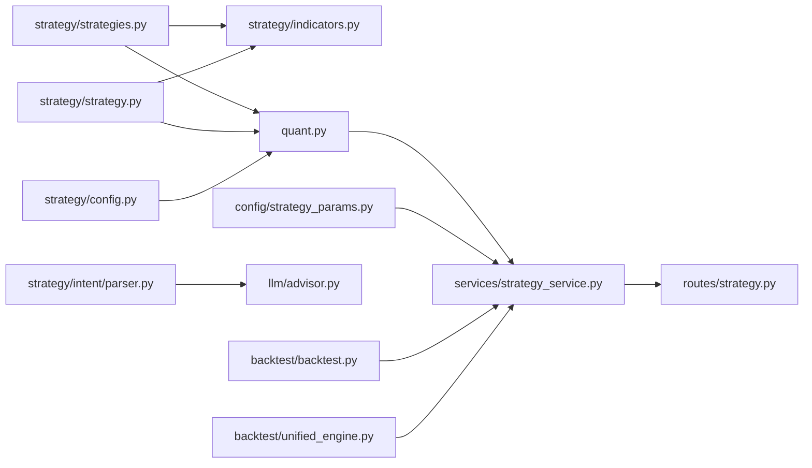

# 策略引擎

<cite>
**本文引用的文件**
- [strategy/strategies.py](file://strategy/strategies.py)
- [strategy/strategy.py](file://strategy/strategy.py)
- [strategy/indicators.py](file://strategy/indicators.py)
- [strategy/config.py](file://strategy/config.py)
- [strategy/intent/parser.py](file://strategy/intent/parser.py)
- [backtest/backtest.py](file://backtest/backtest.py)
- [backtest/unified_engine.py](file://backtest/unified_engine.py)
- [backtest/engine.py](file://backtest/engine.py)
- [backtest/strategy_interface.py](file://backtest/strategy_interface.py)
- [services/strategy_service.py](file://services/strategy_service.py)
- [routes/strategy.py](file://routes/strategy.py)
- [quant.py](file://quant.py)
- [config/strategy_params.py](file://config/strategy_params.py)
- [llm/advisor.py](file://llm/advisor.py)
</cite>

## 目录
1. [引言](#引言)
2. [项目结构](#项目结构)
3. [核心组件](#核心组件)
4. [架构总览](#架构总览)
5. [详细组件分析](#详细组件分析)
6. [依赖关系分析](#依赖关系分析)
7. [性能考量](#性能考量)
8. [故障排查指南](#故障排查指南)
9. [结论](#结论)
10. [附录](#附录)

## 引言
本文件面向AIQuant策略引擎，系统化阐述策略框架设计、五种核心量化策略的实现机制、技术指标计算方法、信号生成逻辑与参数配置、策略融合机制、信号处理流程与性能优化技巧，并结合回测与参数优化的最佳实践，帮助开发者与使用者高效理解与扩展该引擎。

## 项目结构
AIQuant采用“策略层-指标层-回测层-服务层-路由层”的分层组织，策略层提供多策略与融合；指标层封装常用技术指标；回测层提供统一回测与参数优化能力；服务层对接数据库与实时数据；路由层提供HTTP接口；意图解析器与LLM顾问提供自然语言策略解析与增强。

图表来源
- [strategy/strategies.py:1-431](file://strategy/strategies.py#L1-L431)
- [strategy/strategy.py:1-349](file://strategy/strategy.py#L1-L349)
- [strategy/indicators.py:1-244](file://strategy/indicators.py#L1-L244)
- [strategy/config.py:1-132](file://strategy/config.py#L1-L132)
- [strategy/intent/parser.py:1-298](file://strategy/intent/parser.py#L1-L298)
- [backtest/backtest.py:1-517](file://backtest/backtest.py#L1-L517)
- [backtest/unified_engine.py:1-143](file://backtest/unified_engine.py#L1-L143)
- [backtest/engine.py:1-174](file://backtest/engine.py#L1-L174)
- [backtest/strategy_interface.py:1-86](file://backtest/strategy_interface.py#L1-L86)
- [services/strategy_service.py:1-325](file://services/strategy_service.py#L1-L325)
- [routes/strategy.py:1-87](file://routes/strategy.py#L1-L87)
- [quant.py:1-631](file://quant.py#L1-L631)
- [config/strategy_params.py:1-76](file://config/strategy_params.py#L1-L76)
- [llm/advisor.py:1-225](file://llm/advisor.py#L1-L225)

章节来源
- [strategy/strategies.py:1-431](file://strategy/strategies.py#L1-L431)
- [strategy/strategy.py:1-349](file://strategy/strategy.py#L1-L349)
- [strategy/indicators.py:1-244](file://strategy/indicators.py#L1-L244)
- [strategy/config.py:1-132](file://strategy/config.py#L1-L132)
- [strategy/intent/parser.py:1-298](file://strategy/intent/parser.py#L1-L298)
- [backtest/backtest.py:1-517](file://backtest/backtest.py#L1-L517)
- [backtest/unified_engine.py:1-143](file://backtest/unified_engine.py#L1-L143)
- [backtest/engine.py:1-174](file://backtest/engine.py#L1-L174)
- [backtest/strategy_interface.py:1-86](file://backtest/strategy_interface.py#L1-L86)
- [services/strategy_service.py:1-325](file://services/strategy_service.py#L1-L325)
- [routes/strategy.py:1-87](file://routes/strategy.py#L1-L87)
- [quant.py:1-631](file://quant.py#L1-L631)
- [config/strategy_params.py:1-76](file://config/strategy_params.py#L1-L76)
- [llm/advisor.py:1-225](file://llm/advisor.py#L1-L225)

## 核心组件
- 多策略与融合：提供五种独立策略与加权融合，统一返回BUY/SELL信号与评分列，便于回测与展示。
- 中线策略与评分：提供均线多头排列、MACD底背离+金叉、布林带突破与综合评分策略，支持动态止损止盈。
- 技术指标：集中计算MA、EMA、MACD、RSI、KDJ、布林带、ATR、OBV、VWAP、CCI、DMI等，支撑策略信号。
- 回测引擎：支持T+1执行、手续费/印花税、滑点、止损止盈、最大持仓天数、回撤熔断、大盘择时、动态仓位等。
- 服务与路由：提供策略运行、批量筛选、多策略并联回测、比较等功能的HTTP接口。
- 配置与参数：支持YAML热加载策略配置、默认参数与参数网格，便于快速调参。
- 意图解析与LLM顾问：将自然语言策略意图解析为结构化条件，提供策略建议与解释。

章节来源
- [strategy/strategies.py:1-431](file://strategy/strategies.py#L1-L431)
- [strategy/strategy.py:1-349](file://strategy/strategy.py#L1-L349)
- [strategy/indicators.py:1-244](file://strategy/indicators.py#L1-L244)
- [backtest/backtest.py:1-517](file://backtest/backtest.py#L1-L517)
- [services/strategy_service.py:1-325](file://services/strategy_service.py#L1-L325)
- [routes/strategy.py:1-87](file://routes/strategy.py#L1-L87)
- [strategy/config.py:1-132](file://strategy/config.py#L1-L132)
- [config/strategy_params.py:1-76](file://config/strategy_params.py#L1-L76)
- [strategy/intent/parser.py:1-298](file://strategy/intent/parser.py#L1-L298)
- [llm/advisor.py:1-225](file://llm/advisor.py#L1-L225)

## 架构总览
策略引擎以“策略函数/类”为核心，通过统一的信号列（BUY_SIGNAL/SELL_SIGNAL/SCORE）与回测引擎交互；指标层提供统一技术指标；服务层负责数据获取与批量处理；路由层暴露REST接口；配置与参数模块提供热加载与默认值；意图解析器与LLM顾问提供自然语言增强。

图表来源
- [routes/strategy.py:1-87](file://routes/strategy.py#L1-L87)
- [services/strategy_service.py:1-325](file://services/strategy_service.py#L1-L325)
- [quant.py:1-631](file://quant.py#L1-L631)
- [strategy/strategies.py:1-431](file://strategy/strategies.py#L1-L431)
- [strategy/indicators.py:1-244](file://strategy/indicators.py#L1-L244)
- [backtest/backtest.py:1-517](file://backtest/backtest.py#L1-L517)

## 详细组件分析

### 多策略与融合（strategy/strategies.py）
- 放量突破：基于量比、均线多头排列强度与3日涨幅打分，综合形成0~3分，映射至0~10后加权融合。
- 均线粘合：均线收敛+向上发散+量能稳定，强调整理后突破。
- 量价背离：底背离强度、反弹强度与趋势逆转确认，强调反转信号。
- 抄底：连续下跌后的放量反弹，强调底部特征。
- 主力建仓：低位放量+涨幅受控，强调机构行为。
- 超跌反弹v3：基于20日跌幅、站上MA5、温和放量、RSI区间、不创新低等多因子打分，阈值1.8触发。
- 融合：将各策略原始分(0~3)映射到(0~10)，按权重加权求和，得到0~50的融合分，阈值20触发。

图表来源
- [strategy/strategies.py:36-91](file://strategy/strategies.py#L36-L91)
- [strategy/strategies.py:98-134](file://strategy/strategies.py#L98-L134)
- [strategy/strategies.py:141-178](file://strategy/strategies.py#L141-L178)
- [strategy/strategies.py:185-217](file://strategy/strategies.py#L185-L217)
- [strategy/strategies.py:224-255](file://strategy/strategies.py#L224-L255)
- [strategy/strategies.py:281-360](file://strategy/strategies.py#L281-L360)
- [strategy/strategies.py:368-429](file://strategy/strategies.py#L368-L429)

章节来源
- [strategy/strategies.py:1-431](file://strategy/strategies.py#L1-L431)

### 中线策略与评分（strategy/strategy.py）
- 均线多头排列：MA5>MA10>MA20>MA60、MA10上穿MA20、量比>1.5、价格站上MA20，评分0~100。
- MACD底背离+金叉：DIF上穿DEA、零轴附近金叉、RSI健康区间、MACD柱由负转正，评分0~100。
- 布林带突破：带宽收窄后突破、价格上穿上轨或中轨、量能放大，评分0~100。
- 综合评分：趋势、动量、成交量、布林带、ADX强度等因子加权，评分0~100，65分以上建议买入，45分以下建议卖出。
- 动态止损止盈：基于ATR计算止损与止盈位，支持百分比展示。

图表来源
- [backtest/strategy_interface.py:23-86](file://backtest/strategy_interface.py#L23-L86)
- [strategy/strategy.py:271-290](file://strategy/strategy.py#L271-L290)

章节来源
- [strategy/strategy.py:1-349](file://strategy/strategy.py#L1-L349)
- [backtest/strategy_interface.py:1-86](file://backtest/strategy_interface.py#L1-L86)

### 技术指标计算（strategy/indicators.py）
- 趋势类：MA、EMA、MACD、DMI
- 震荡类：RSI、KDJ、CCI
- 波动类：布林带、ATR
- 成交量：OBV、VWAP、量比
- 统一入口：calc_all_indicators(df)一次性计算并拼接到原始DataFrame。

章节来源
- [strategy/indicators.py:1-244](file://strategy/indicators.py#L1-L244)

### 回测引擎（backtest/backtest.py）
- T+1执行：信号日收盘判断，次日开盘价执行，杜绝未来数据泄露。
- 交易成本：手续费（默认万分之三双向）、印花税（卖出单向）、滑点（默认千分之一）。
- 止损止盈：支持固定阈值或基于ATR的动态止损止盈。
- 风控：回撤熔断（最大回撤阈值与连续亏损限制）、大盘择时（MA20过滤）、动态仓位（基于ATR波动率）。
- 绩效指标：总收益、年化收益、最大回撤、夏普比率、胜率、盈亏比、平均持仓天数、基准收益与Alpha。

图表来源
- [backtest/backtest.py:121-409](file://backtest/backtest.py#L121-L409)

章节来源
- [backtest/backtest.py:1-517](file://backtest/backtest.py#L1-L517)

### 通用回测引擎（backtest/unified_engine.py）
- 插件化策略：接收Strategy实例列表，支持多策略同时运行。
- T+1交易：次日开盘价执行。
- 资金曲线：支持手续费、滑点、止损止盈、最大持仓天数、回撤熔断、大盘择时、动态仓位等。
- 批量回测：支持多只股票批量回测，统一结果结构。

章节来源
- [backtest/unified_engine.py:1-143](file://backtest/unified_engine.py#L1-L143)
- [backtest/strategy_interface.py:1-86](file://backtest/strategy_interface.py#L1-L86)

### 策略配置与参数（strategy/config.py、config/strategy_params.py）
- StrategyConfig：YAML热加载策略配置，支持启用开关、参数、融合权重、回测与交易参数。
- 默认参数：提供五策略融合权重与各策略默认参数，支持参数网格扫描。
- 策略参数：提供按名称查询的参数映射，便于服务层与路由层注入。

章节来源
- [strategy/config.py:1-132](file://strategy/config.py#L1-L132)
- [config/strategy_params.py:1-76](file://config/strategy_params.py#L1-L76)

### 策略意图解析器（strategy/intent/parser.py）
- 职责：将自然语言策略描述解析为结构化条件配置，支持常见策略模式识别与参数提取。
- 输出：包含意图类型、条件列表、参数、置信度与解释，可用于筛选与回测。

章节来源
- [strategy/intent/parser.py:1-298](file://strategy/intent/parser.py#L1-L298)

### LLM策略顾问（llm/advisor.py）
- 职责：基于LLM提供策略建议、市场分析、意图解析增强与交易理由生成。
- 降级机制：LLM不可用时回退到本地解析器，确保系统可用性。

章节来源
- [llm/advisor.py:1-225](file://llm/advisor.py#L1-L225)

### 服务与路由（services/strategy_service.py、routes/strategy.py）
- 服务层：提供运行所有策略、批量筛选、多策略并联回测、策略比较等能力。
- 路由层：提供HTTP接口，支持参数化调用与SSE事件流批量筛选。

章节来源
- [services/strategy_service.py:1-325](file://services/strategy_service.py#L1-L325)
- [routes/strategy.py:1-87](file://routes/strategy.py#L1-L87)

### 扫描与融合分析（quant.py）
- 分析函数：从数据库读取历史行情，运行五策略并融合，按阈值过滤，返回精选标的与交易建议。
- v4超跌反弹：独立分析流程，支持大盘择时（MA5>MA20），阈值1.8触发。
- 扫描任务：每日定时扫描全市场，支持强制重算策略分与历史回填stock_signal。

章节来源
- [quant.py:1-631](file://quant.py#L1-L631)

## 依赖关系分析

图表来源
- [strategy/strategies.py:1-431](file://strategy/strategies.py#L1-L431)
- [strategy/strategy.py:1-349](file://strategy/strategy.py#L1-L349)
- [strategy/indicators.py:1-244](file://strategy/indicators.py#L1-L244)
- [quant.py:1-631](file://quant.py#L1-L631)
- [services/strategy_service.py:1-325](file://services/strategy_service.py#L1-L325)
- [routes/strategy.py:1-87](file://routes/strategy.py#L1-L87)
- [strategy/config.py:1-132](file://strategy/config.py#L1-L132)
- [config/strategy_params.py:1-76](file://config/strategy_params.py#L1-L76)
- [strategy/intent/parser.py:1-298](file://strategy/intent/parser.py#L1-L298)
- [llm/advisor.py:1-225](file://llm/advisor.py#L1-L225)
- [backtest/backtest.py:1-517](file://backtest/backtest.py#L1-L517)
- [backtest/unified_engine.py:1-143](file://backtest/unified_engine.py#L1-L143)

章节来源
- [strategy/strategies.py:1-431](file://strategy/strategies.py#L1-L431)
- [strategy/strategy.py:1-349](file://strategy/strategy.py#L1-L349)
- [strategy/indicators.py:1-244](file://strategy/indicators.py#L1-L244)
- [quant.py:1-631](file://quant.py#L1-L631)
- [services/strategy_service.py:1-325](file://services/strategy_service.py#L1-L325)
- [routes/strategy.py:1-87](file://routes/strategy.py#L1-L87)
- [strategy/config.py:1-132](file://strategy/config.py#L1-L132)
- [config/strategy_params.py:1-76](file://config/strategy_params.py#L1-L76)
- [strategy/intent/parser.py:1-298](file://strategy/intent/parser.py#L1-L298)
- [llm/advisor.py:1-225](file://llm/advisor.py#L1-L225)
- [backtest/backtest.py:1-517](file://backtest/backtest.py#L1-L517)
- [backtest/unified_engine.py:1-143](file://backtest/unified_engine.py#L1-L143)

## 性能考量
- 向量化计算：指标计算与信号生成均基于Pandas/Numpy向量化，减少循环开销。
- 数据复用：calc_all_indicators一次性计算并缓存，避免重复计算。
- T+1执行：严格避免未来数据泄露，回测稳定性高。
- 动态仓位：基于ATR波动率动态调整仓位，提升风险适配能力。
- 参数网格：提供参数扫描网格，便于快速定位稳健参数组合。
- 热加载配置：策略配置YAML热加载，无需重启即可生效。

## 故障排查指南
- 回测引擎异常：检查输入DataFrame是否包含open/close/high/low/volume列，确认T+1执行逻辑。
- 信号缺失：确认策略阈值设置是否过高，或指标计算是否存在NaN导致信号生成失败。
- 配置未生效：确认YAML文件路径与命名，检查StrategyConfig是否正确加载。
- LLM不可用：查看降级逻辑是否正常回退到本地解析器。
- 参数优化失败：核对参数网格合法性与回测时间窗，关注最大回撤与胜率指标。

章节来源
- [backtest/backtest.py:121-131](file://backtest/backtest.py#L121-L131)
- [strategy/config.py:58-72](file://strategy/config.py#L58-L72)
- [llm/advisor.py:150-166](file://llm/advisor.py#L150-L166)

## 结论
AIQuant策略引擎以清晰的分层设计与统一的信号接口，实现了从指标计算、策略实现、信号融合到回测与参数优化的完整闭环。通过自然语言意图解析与LLM增强，进一步提升了策略开发与使用的易用性。建议在生产环境中结合回撤熔断、动态仓位与大盘择时等风控措施，持续优化参数网格，以获得稳健的策略表现。

## 附录

### 策略参数配置示例（节选）
- 五策略融合权重：[0.30, 0.15, 0.20, 0.20, 0.15]
- 放量突破：vol_factor=1.5, rise_3d=0.02, score_min=1.0
- 均线粘合：ma_narrow=0.02
- 量价背离：lookback=20
- 抄底：drop_5d=-0.08, rsi_threshold=30
- 主力建仓：volume_spike=2.0
- v4参数网格：包含score_threshold、stop_loss、trailing_pct、single_pos_ratio等

章节来源
- [config/strategy_params.py:6-76](file://config/strategy_params.py#L6-L76)
- [strategy/config.py:103-105](file://strategy/config.py#L103-L105)