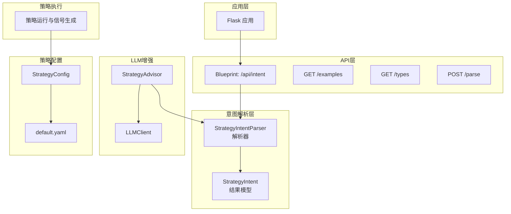
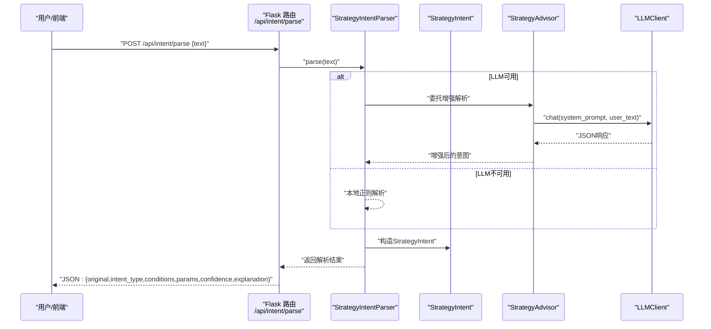
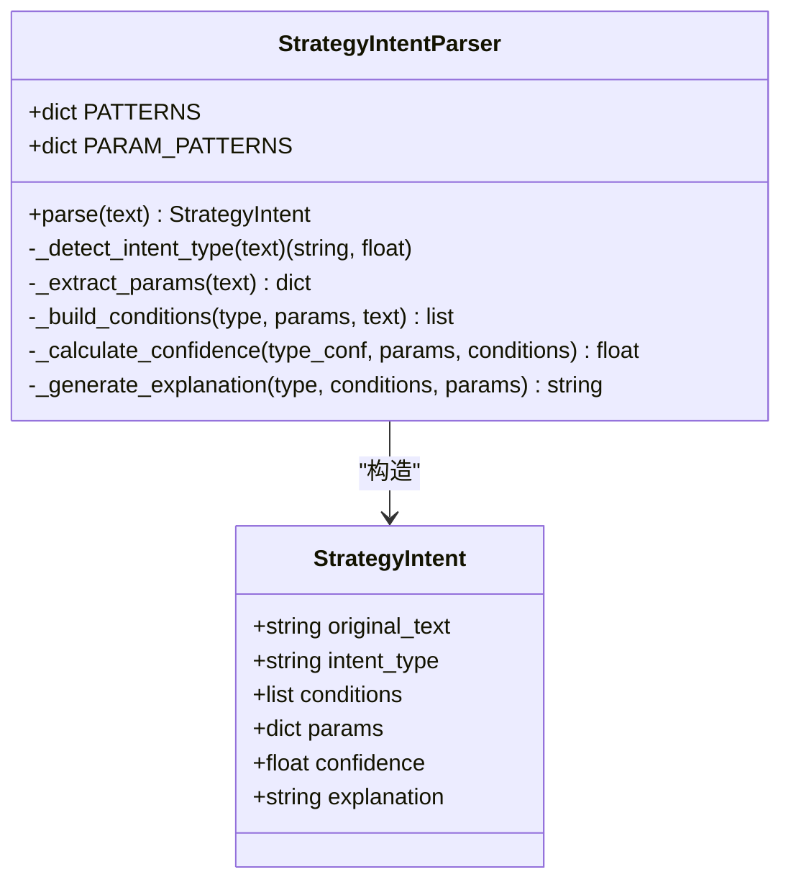
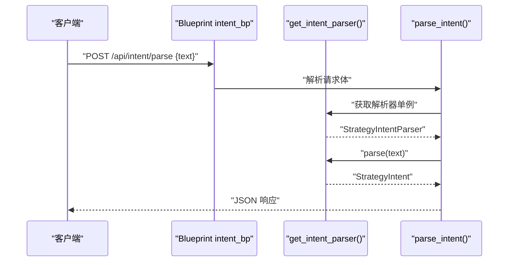
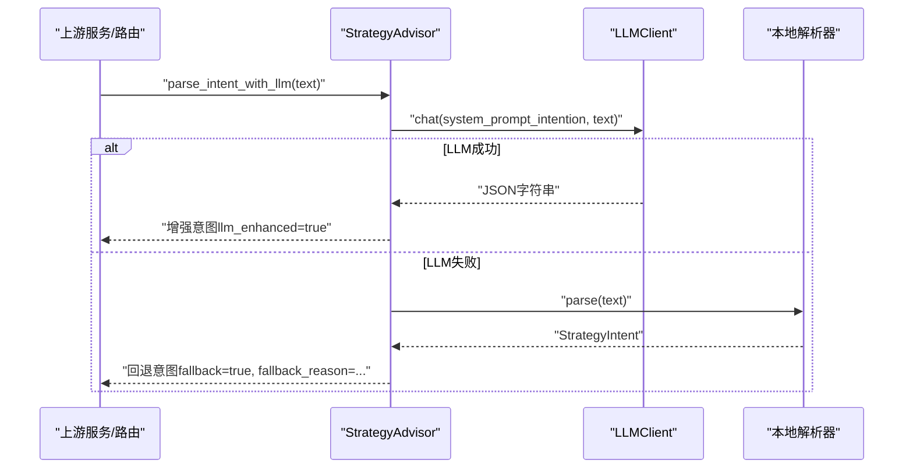
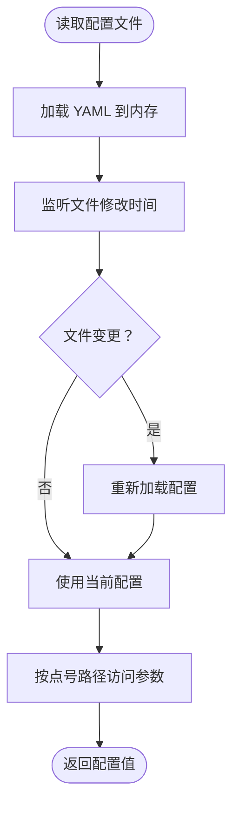
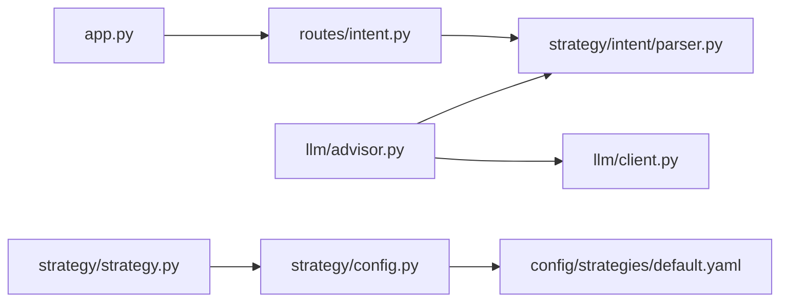

# 策略意图解析

<cite>
**本文引用的文件**
- [strategy/intent/parser.py](file://strategy/intent/parser.py)
- [routes/intent.py](file://routes/intent.py)
- [app.py](file://app.py)
- [llm/advisor.py](file://llm/advisor.py)
- [llm/client.py](file://llm/client.py)
- [strategy/config.py](file://strategy/config.py)
- [config/strategies/default.yaml](file://config/strategies/default.yaml)
- [strategy/strategy.py](file://strategy/strategy.py)
</cite>

## 目录
1. [简介](#简介)
2. [项目结构](#项目结构)
3. [核心组件](#核心组件)
4. [架构总览](#架构总览)
5. [详细组件分析](#详细组件分析)
6. [依赖分析](#依赖分析)
7. [性能考量](#性能考量)
8. [故障排查指南](#故障排查指南)
9. [结论](#结论)
10. [附录](#附录)

## 简介
本文件面向AIQuant策略意图解析模块，系统化阐述从“自然语言策略描述”到“可执行量化条件”的完整流程。内容涵盖算法原理（基于正则的模式识别与参数抽取）、NLP与语义分析方法（关键词匹配与置信度评估）、语法树与条件构建（策略模板匹配与参数提取）、标准化格式与验证规则、复杂描述与边界情况处理，以及可扩展的实现与集成方式。读者可据此理解并扩展该模块，将其接入扫描、回测与实盘交易流水线。

## 项目结构
策略意图解析模块位于strategy/intent目录，配套API路由在routes/intent.py，应用入口在app.py中注册蓝图。同时，系统提供LLM增强解析能力（llm/advisor.py与llm/client.py），策略配置与参数加载（strategy/config.py与config/strategies/default.yaml），以及策略运行与信号生成（strategy/strategy.py）。下图展示与意图解析直接相关的模块关系：

图表来源
- [strategy/intent/parser.py:34-118](file://strategy/intent/parser.py#L34-L118)
- [routes/intent.py:14-37](file://routes/intent.py#L14-L37)
- [app.py:31-66](file://app.py#L31-L66)
- [llm/advisor.py:139-166](file://llm/advisor.py#L139-L166)
- [llm/client.py:39-150](file://llm/client.py#L39-L150)
- [strategy/config.py:20-101](file://strategy/config.py#L20-L101)
- [config/strategies/default.yaml:1-132](file://config/strategies/default.yaml#L1-L132)
- [strategy/strategy.py:271-290](file://strategy/strategy.py#L271-L290)

章节来源
- [app.py:31-66](file://app.py#L31-L66)
- [routes/intent.py:14-37](file://routes/intent.py#L14-L37)
- [strategy/intent/parser.py:34-118](file://strategy/intent/parser.py#L34-L118)

## 核心组件
- StrategyIntentParser：负责将自然语言描述解析为结构化策略意图，包括策略类型识别、参数提取、条件构建、置信度计算与解释生成。
- StrategyIntent：解析结果的数据载体，包含原始文本、意图类型、条件列表、参数映射、置信度与解释说明。
- Blueprint路由：提供意图解析API（POST /api/intent/parse）、示例查询（GET /api/intent/examples）与类型清单（GET /api/intent/types）。
- StrategyAdvisor与LLMClient：提供基于大模型的意图增强解析，并在LLM不可用时回退至本地解析器。
- StrategyConfig与default.yaml：提供策略配置的热加载能力，支撑策略参数化与回测/交易参数的集中管理。
- 策略执行链路：解析得到的条件与参数可用于扫描、回测与信号生成（strategy/strategy.py）。

章节来源
- [strategy/intent/parser.py:23-32](file://strategy/intent/parser.py#L23-L32)
- [strategy/intent/parser.py:34-118](file://strategy/intent/parser.py#L34-L118)
- [routes/intent.py:14-37](file://routes/intent.py#L14-L37)
- [llm/advisor.py:139-166](file://llm/advisor.py#L139-L166)
- [llm/client.py:39-150](file://llm/client.py#L39-L150)
- [strategy/config.py:20-101](file://strategy/config.py#L20-L101)
- [config/strategies/default.yaml:1-132](file://config/strategies/default.yaml#L1-L132)
- [strategy/strategy.py:271-349](file://strategy/strategy.py#L271-L349)

## 架构总览
意图解析的端到端流程如下：
- 输入：用户提交的自然语言策略描述（JSON字段text）。
- 路由：Flask蓝图接收请求，调用解析器进行解析。
- 解析：解析器识别策略类型、提取参数、构建条件、计算置信度并生成解释。
- 输出：返回结构化结果（包含原始文本、意图类型、条件、参数、置信度与解释）。
- 增强：若启用LLM，StrategyAdvisor可对解析结果进行增强，并在失败时回退到本地解析器。
- 集成：解析结果可被扫描、回测与策略执行模块复用。

图表来源
- [routes/intent.py:18-37](file://routes/intent.py#L18-L37)
- [strategy/intent/parser.py:80-118](file://strategy/intent/parser.py#L80-L118)
- [llm/advisor.py:139-166](file://llm/advisor.py#L139-L166)
- [llm/client.py:97-150](file://llm/client.py#L97-L150)

## 详细组件分析

### 组件A：StrategyIntentParser（意图解析器）
- 职责
  - 识别策略类型：基于关键词正则集合进行匹配计分，确定意图类型与置信度。
  - 提取参数：从文本中抽取数值型与标量参数（如天数、百分比、阈值、均线周期等）。
  - 构建条件：依据意图类型与参数映射，生成可执行的条件列表（包含类型、参数、描述）。
  - 计算置信度：综合类型置信度、参数覆盖度与条件数量，给出整体可信度。
  - 生成解释：将条件与参数整合为自然语言解释，便于用户理解。
- 关键数据结构
  - StrategyIntent：包含原始文本、意图类型、条件数组、参数映射、置信度与解释。
- 算法要点
  - 类型识别：对每种意图类型的关键词集合进行匹配计分，按匹配次数加权，归一化得到置信度。
  - 参数提取：采用多组正则分别抽取不同参数，遇到非数值参数保留字符串形式。
  - 条件构建：针对已识别的意图类型，按预设模板组装条件；未知类型时退化为通用条件（涨跌幅或自定义）。
  - 置信度：类型置信度 + 参数覆盖度 + 条件数量的加权和，上限为1.0。
- 可扩展性
  - 新增意图类型：在模式集合中添加新的关键词集合与参数映射，扩展条件构建分支。
  - 参数映射：在参数正则集合中新增键值与对应正则，即可自动抽取新参数。
  - 条件模板：为新意图类型设计条件模板，确保生成的条件可被后续扫描/回测模块消费。

图表来源
- [strategy/intent/parser.py:23-32](file://strategy/intent/parser.py#L23-L32)
- [strategy/intent/parser.py:34-118](file://strategy/intent/parser.py#L34-L118)

章节来源
- [strategy/intent/parser.py:34-118](file://strategy/intent/parser.py#L34-L118)
- [strategy/intent/parser.py:120-150](file://strategy/intent/parser.py#L120-L150)
- [strategy/intent/parser.py:152-265](file://strategy/intent/parser.py#L152-L265)
- [strategy/intent/parser.py:267-285](file://strategy/intent/parser.py#L267-L285)

### 组件B：API路由（/api/intent）
- 路由
  - POST /api/intent/parse：解析策略意图，返回结构化结果。
  - GET /api/intent/examples：返回示例策略描述列表。
  - GET /api/intent/types：返回支持的策略类型与参数清单。
- 请求/响应
  - 请求体：包含text字段（策略描述）。
  - 响应体：包含success、original、intent_type、confidence、explanation、conditions、params等字段。
- 错误处理
  - 当text为空时返回400与错误信息。

图表来源
- [routes/intent.py:18-37](file://routes/intent.py#L18-L37)
- [strategy/intent/parser.py:288-298](file://strategy/intent/parser.py#L288-L298)

章节来源
- [routes/intent.py:18-37](file://routes/intent.py#L18-L37)
- [routes/intent.py:40-119](file://routes/intent.py#L40-L119)

### 组件C：LLM增强解析（StrategyAdvisor + LLMClient）
- 能力
  - 使用系统提示词引导LLM将自然语言策略描述解析为结构化JSON（包含intent_type、conditions、params、explanation等）。
  - 若LLM不可用或解析失败，自动回退到本地解析器，并标记fallback与原因。
- 集成方式
  - 在路由层或业务层调用parse_intent_with_llm，即可获得增强后的意图结果。
- 容错
  - 对LLM输出进行安全解析（提取JSON块、容错处理），保证系统稳定性。

图表来源
- [llm/advisor.py:139-166](file://llm/advisor.py#L139-L166)
- [llm/client.py:97-150](file://llm/client.py#L97-L150)
- [strategy/intent/parser.py:80-118](file://strategy/intent/parser.py#L80-L118)

章节来源
- [llm/advisor.py:139-166](file://llm/advisor.py#L139-L166)
- [llm/client.py:97-150](file://llm/client.py#L97-L150)

### 组件D：策略配置与参数加载（StrategyConfig + default.yaml）
- 能力
  - 策略配置热加载：无需重启服务，自动检测文件变更并重新加载。
  - 属性访问：支持点号路径访问嵌套配置，便于按策略名获取参数。
  - 策略开关与参数：提供策略启用状态、参数映射、回测与交易参数等。
- 用途
  - 与解析结果结合：解析得到的参数可与配置文件中的默认参数合并，形成最终策略参数集。
  - 回测/交易参数：统一管理手续费、滑点、止盈止损等参数。

图表来源
- [strategy/config.py:45-86](file://strategy/config.py#L45-L86)
- [strategy/config.py:88-127](file://strategy/config.py#L88-L127)
- [config/strategies/default.yaml:1-132](file://config/strategies/default.yaml#L1-L132)

章节来源
- [strategy/config.py:45-86](file://strategy/config.py#L45-L86)
- [strategy/config.py:88-127](file://strategy/config.py#L88-L127)
- [config/strategies/default.yaml:1-132](file://config/strategies/default.yaml#L1-L132)

### 组件E：策略执行与信号生成（strategy/strategy.py）
- 能力
  - 计算技术指标与信号：提供多策略（均线多头排列、MACD金叉、布林带突破、综合评分等）。
  - 动态止损止盈：基于ATR计算动态止损与目标止盈。
  - 策略运行入口：统一入口函数运行指定策略，返回含指标与信号的DataFrame。
- 与意图解析的关系
  - 解析得到的条件与参数可作为扫描/筛选条件，或转化为策略运行所需的参数集合，驱动策略执行与信号生成。

章节来源
- [strategy/strategy.py:271-349](file://strategy/strategy.py#L271-L349)

## 依赖分析
- 模块耦合
  - routes/intent.py依赖strategy/intent/parser.py的解析器单例，形成清晰的接口耦合。
  - app.py在应用启动时注册蓝图，确保API可用。
  - llm/advisor.py依赖strategy/intent/parser.py作为回退解析器，形成可选增强链路。
  - strategy/config.py与config/strategies/default.yaml共同构成策略参数的外部配置源。
- 外部依赖
  - Flask：提供Web服务与路由。
  - requests：LLMClient通过HTTP调用外部模型服务。
  - yaml：StrategyConfig加载YAML配置文件。
- 循环依赖
  - 未发现循环导入；各模块职责单一，接口清晰。

图表来源
- [routes/intent.py:12-15](file://routes/intent.py#L12-L15)
- [app.py:31-66](file://app.py#L31-L66)
- [llm/advisor.py:18-80](file://llm/advisor.py#L18-L80)
- [llm/client.py:15-25](file://llm/client.py#L15-L25)
- [strategy/config.py:7-17](file://strategy/config.py#L7-L17)
- [strategy/strategy.py:11-13](file://strategy/strategy.py#L11-L13)

章节来源
- [routes/intent.py:12-15](file://routes/intent.py#L12-L15)
- [app.py:31-66](file://app.py#L31-L66)
- [llm/advisor.py:18-80](file://llm/advisor.py#L18-L80)
- [llm/client.py:15-25](file://llm/client.py#L15-L25)
- [strategy/config.py:7-17](file://strategy/config.py#L7-L17)
- [strategy/strategy.py:11-13](file://strategy/strategy.py#L11-L13)

## 性能考量
- 正则匹配复杂度
  - 类型识别与参数提取均为线性扫描，复杂度与输入长度成正比；关键词集合规模有限，实际开销可控。
- 置信度计算
  - 由类型置信度、参数覆盖度与条件数量加权组成，计算常数时间，开销极低。
- LLM调用
  - LLMClient支持超时控制与流式输出，建议在生产环境合理设置timeout与max_tokens，避免阻塞。
- 配置热加载
  - StrategyConfig通过文件修改时间检测实现热加载，避免频繁IO；建议在高并发场景下避免频繁写入配置文件。

## 故障排查指南
- API返回错误
  - 当text为空时，路由会返回400与错误信息。请检查请求体字段是否正确传递。
- LLM不可用
  - 若LLM未配置或网络异常，LLMClient会返回错误；此时StrategyAdvisor会自动回退到本地解析器，并在响应中标记fallback与原因。
- 解析结果不符合预期
  - 检查输入描述是否包含足够的关键词与数值参数；可通过GET /api/intent/examples与GET /api/intent/types了解期望格式。
- 配置未生效
  - 确认config/strategies/default.yaml存在且格式正确；StrategyConfig会在文件变更时自动热加载，无需重启服务。

章节来源
- [routes/intent.py:24-25](file://routes/intent.py#L24-L25)
- [llm/client.py:104-109](file://llm/client.py#L104-L109)
- [llm/advisor.py:150-162](file://llm/advisor.py#L150-L162)
- [strategy/config.py:52-57](file://strategy/config.py#L52-L57)

## 结论
策略意图解析模块通过“关键词匹配 + 参数抽取 + 条件构建 + 置信度评估”的组合，实现了从自然语言到可执行条件的自动化转换。其设计具备良好的可扩展性：新增意图类型与参数只需扩展正则与模板；通过LLM增强可在复杂描述场景下提升准确性；结合StrategyConfig与default.yaml，可实现策略参数的集中化与热加载。该模块可无缝对接扫描、回测与策略执行链路，为AIQuant提供从“意图”到“行动”的关键桥梁。

## 附录

### 标准化格式与验证规则
- 输入
  - text：必填，策略描述文本。
- 输出
  - original：原始输入文本。
  - intent_type：策略类型标识符（如oversold_rebound、volume_breakout等）。
  - conditions：条件数组，每项包含type、参数与description。
  - params：参数映射（数值或字符串）。
  - confidence：置信度（0~1）。
  - explanation：自然语言解释。
- 验证规则
  - text非空校验：空输入返回错误。
  - 条件完整性：未知类型时退化为通用条件或自定义提示。
  - 参数类型：数值参数转换为浮点数，无法解析时保留原值。
  - 置信度上限：不超过1.0。

章节来源
- [routes/intent.py:21-37](file://routes/intent.py#L21-L37)
- [strategy/intent/parser.py:86-94](file://strategy/intent/parser.py#L86-L94)
- [strategy/intent/parser.py:140-150](file://strategy/intent/parser.py#L140-L150)
- [strategy/intent/parser.py:267-271](file://strategy/intent/parser.py#L267-L271)

### 复杂描述与边界情况处理
- 多意图混合描述
  - 通过类型识别得分聚合，优先选择匹配度最高的意图类型；若多个类型得分相近，可结合上下文进一步细化。
- 数值参数歧义
  - 当同一参数存在多种表达（如“涨幅超过10%”与“上涨10%”），通过多条参数正则覆盖不同表述，提高抽取成功率。
- 未知类型
  - 退化为通用条件（涨跌幅或自定义），并保持解释可读性。
- LLM回退
  - 当LLM不可用或解析失败时，自动回退到本地解析器，保证系统可用性。

章节来源
- [strategy/intent/parser.py:120-138](file://strategy/intent/parser.py#L120-L138)
- [strategy/intent/parser.py:152-265](file://strategy/intent/parser.py#L152-L265)
- [llm/advisor.py:150-162](file://llm/advisor.py#L150-L162)

### 代码示例与扩展方法
- 示例：调用意图解析API
  - 路径参考：[routes/intent.py:18-37](file://routes/intent.py#L18-L37)
- 示例：获取示例与类型清单
  - 路径参考：[routes/intent.py:40-119](file://routes/intent.py#L40-L119)
- 示例：LLM增强解析
  - 路径参考：[llm/advisor.py:139-166](file://llm/advisor.py#L139-L166)
- 示例：解析器单例获取
  - 路径参考：[strategy/intent/parser.py:288-298](file://strategy/intent/parser.py#L288-L298)
- 扩展方法
  - 新增意图类型：在PATTERNS中添加关键词集合，在_build_conditions中添加分支。
  - 新增参数：在PARAM_PATTERNS中添加键与正则，并在_build_conditions中使用。
  - 参数合并：结合StrategyConfig与default.yaml，将解析参数与默认参数合并。

章节来源
- [routes/intent.py:18-37](file://routes/intent.py#L18-L37)
- [routes/intent.py:40-119](file://routes/intent.py#L40-L119)
- [llm/advisor.py:139-166](file://llm/advisor.py#L139-L166)
- [strategy/intent/parser.py:288-298](file://strategy/intent/parser.py#L288-L298)
- [strategy/config.py:73-101](file://strategy/config.py#L73-L101)
- [config/strategies/default.yaml:1-132](file://config/strategies/default.yaml#L1-L132)