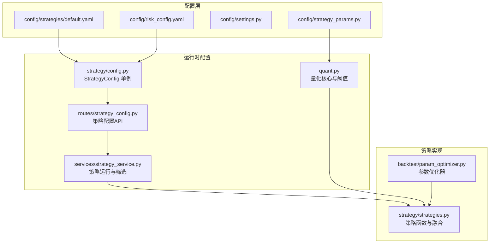
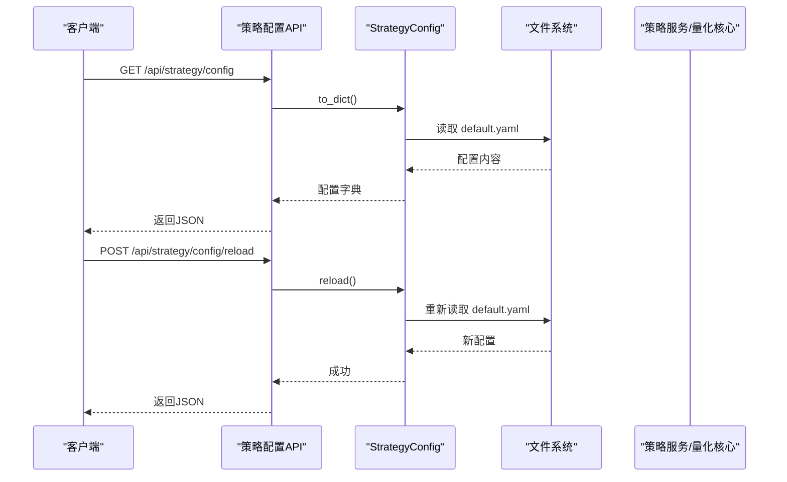
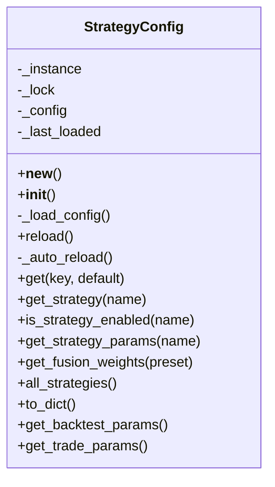
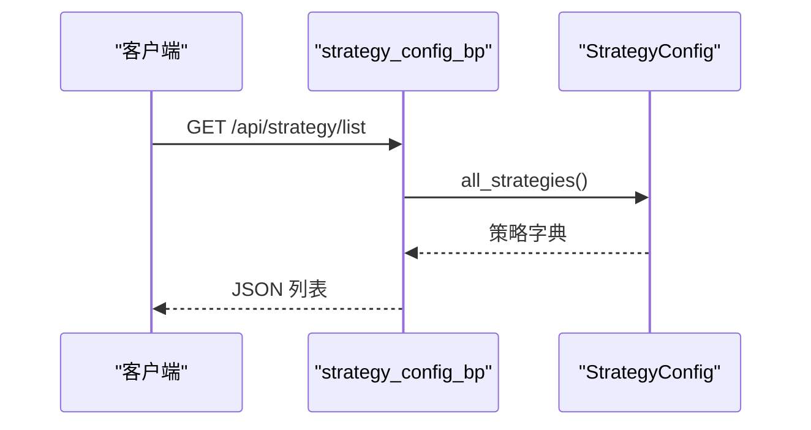
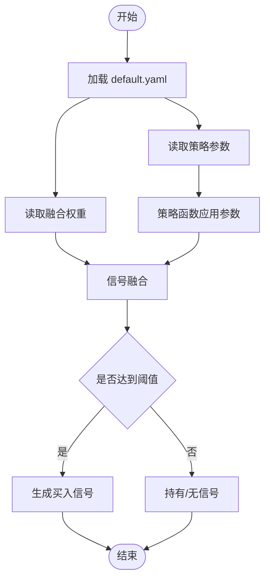
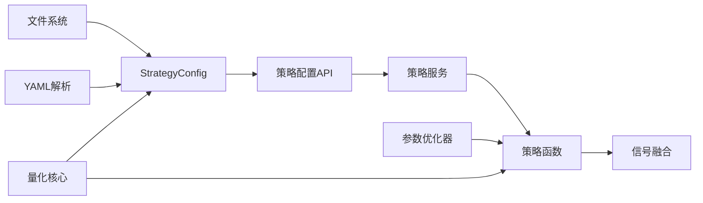

# 策略配置管理

<cite>
**本文引用的文件**
- [config/strategy_params.py](file://config/strategy_params.py)
- [config/settings.py](file://config/settings.py)
- [strategy/config.py](file://strategy/config.py)
- [routes/strategy_config.py](file://routes/strategy_config.py)
- [services/strategy_service.py](file://services/strategy_service.py)
- [strategy/strategies.py](file://strategy/strategies.py)
- [backtest/param_optimizer.py](file://backtest/param_optimizer.py)
- [risk/config_loader.py](file://risk/config_loader.py)
- [quant.py](file://quant.py)
- [config/strategies/default.yaml](file://config/strategies/default.yaml)
- [config/risk_config.yaml](file://config/risk_config.yaml)
- [app.py](file://app.py)
</cite>

## 目录
1. [简介](#简介)
2. [项目结构](#项目结构)
3. [核心组件](#核心组件)
4. [架构总览](#架构总览)
5. [详细组件分析](#详细组件分析)
6. [依赖关系分析](#依赖关系分析)
7. [性能考量](#性能考量)
8. [故障排查指南](#故障排查指南)
9. [结论](#结论)
10. [附录](#附录)

## 简介
本文件面向AIQuant策略配置管理模块，系统性阐述策略参数配置的结构设计、参数分类与管理机制，覆盖策略权重配置、参数范围设置、默认值管理、动态调整、配置文件格式规范、参数验证规则、配置加载流程，以及参数调优方法、市场环境适配策略、配置备份与版本管理、故障恢复机制等。文档同时给出关键流程的可视化图示，帮助读者快速理解与落地实施。

## 项目结构
策略配置管理涉及以下关键目录与文件：
- 配置层：策略配置文件与基础设置
  - config/strategies/default.yaml：策略配置中心（权重、参数、阈值、回测与交易参数）
  - config/strategy_params.py：策略默认参数常量集合
  - config/settings.py：基础系统配置（主机、端口、日志级别等）
  - config/risk_config.yaml：风控规则配置（与策略配置协同）
- 运行时配置加载器：strategy/config.py
- API路由：routes/strategy_config.py
- 策略执行与融合：strategy/strategies.py
- 参数优化：backtest/param_optimizer.py
- 核心量化入口：quant.py
- 后端应用入口：app.py



**图表来源**
- [config/strategies/default.yaml:1-132](file://config/strategies/default.yaml#L1-L132)
- [strategy/config.py:1-132](file://strategy/config.py#L1-L132)
- [routes/strategy_config.py:1-72](file://routes/strategy_config.py#L1-L72)
- [services/strategy_service.py:1-325](file://services/strategy_service.py#L1-L325)
- [strategy/strategies.py:1-431](file://strategy/strategies.py#L1-L431)
- [backtest/param_optimizer.py:1-369](file://backtest/param_optimizer.py#L1-L369)
- [quant.py:1-631](file://quant.py#L1-L631)

**章节来源**
- [config/strategies/default.yaml:1-132](file://config/strategies/default.yaml#L1-L132)
- [strategy/config.py:1-132](file://strategy/config.py#L1-L132)
- [routes/strategy_config.py:1-72](file://routes/strategy_config.py#L1-L72)
- [services/strategy_service.py:1-325](file://services/strategy_service.py#L1-L325)
- [strategy/strategies.py:1-431](file://strategy/strategies.py#L1-L431)
- [backtest/param_optimizer.py:1-369](file://backtest/param_optimizer.py#L1-L369)
- [quant.py:1-631](file://quant.py#L1-L631)

## 核心组件
- 策略配置单例（StrategyConfig）：负责从YAML热加载策略配置，支持键路径查询、策略启用状态、参数提取、权重获取、回测与交易参数读取。
- 策略API路由：提供获取配置、热加载、策略列表、融合权重查询等接口。
- 策略实现与融合：包含五类策略函数与信号融合逻辑，支持权重与阈值控制。
- 参数优化器：提供网格搜索、遗传算法、步行优化等参数调优能力。
- 量化核心：定义全局阈值、仓位与风控参数，并驱动扫描与回测。
- 风控配置：独立的风控规则配置，与策略配置协同工作。

**章节来源**
- [strategy/config.py:20-132](file://strategy/config.py#L20-L132)
- [routes/strategy_config.py:18-72](file://routes/strategy_config.py#L18-L72)
- [strategy/strategies.py:36-431](file://strategy/strategies.py#L36-L431)
- [backtest/param_optimizer.py:19-369](file://backtest/param_optimizer.py#L19-L369)
- [quant.py:40-52](file://quant.py#L40-L52)

## 架构总览
策略配置管理采用“配置文件 + 运行时加载器 + API路由 + 策略实现”的分层架构。配置文件通过StrategyConfig单例进行热加载，API路由暴露配置读取与热加载能力，策略服务与量化核心通过统一接口获取配置，参数优化器基于策略函数与配置网格进行调优。



**图表来源**
- [routes/strategy_config.py:18-39](file://routes/strategy_config.py#L18-L39)
- [strategy/config.py:45-72](file://strategy/config.py#L45-L72)

**章节来源**
- [routes/strategy_config.py:1-72](file://routes/strategy_config.py#L1-L72)
- [strategy/config.py:1-132](file://strategy/config.py#L1-L132)

## 详细组件分析

### 策略配置文件格式规范
- 版本与元信息：包含版本号与最后修改时间，便于版本追踪与回滚。
- 融合权重：支持多套预设权重（默认、纯抄底、保守、激进），用于不同市场环境下的策略组合。
- 策略定义：每个策略包含启用开关、名称、描述、参数与评分权重。
- 融合阈值：融合分触发门槛及最低有效门槛。
- 交易参数：默认止损、止盈等。
- 回测参数：初始资金、手续费、印花税、滑点、仓位比例、最大持仓天数等。
- v4策略：包含启用开关、名称、参数与参数扫描网格。

字段与取值建议：
- enabled：布尔值，控制策略是否参与计算。
- params.*：策略参数键值，建议提供合理范围与默认值。
- scoring.*_weight：评分权重，建议总和为1.0。
- fusion.threshold：融合分阈值，建议与策略稳定性匹配。
- trade.stop_loss/take_profit：止损止盈百分比，建议结合波动率与回撤控制。
- backtest.*：回测成本与约束，建议与实盘一致。

**章节来源**
- [config/strategies/default.yaml:1-132](file://config/strategies/default.yaml#L1-L132)

### 运行时配置加载器（StrategyConfig）
- 单例模式：确保全局唯一配置实例，避免重复加载。
- 热加载机制：自动检测文件修改时间，必要时强制reload。
- 查询接口：
  - get(key, default)：支持点号路径查询，如“volume_breakout.params.vol_factor”。
  - get_strategy(name)：获取指定策略完整配置。
  - is_strategy_enabled(name)：检查策略启用状态。
  - get_strategy_params(name)：获取策略参数。
  - get_fusion_weights(preset)：获取融合权重。
  - all_strategies()：返回所有启用策略。
  - to_dict()：导出完整配置字典。
  - get_backtest_params()/get_trade_params()：获取回测与交易参数。



**图表来源**
- [strategy/config.py:20-132](file://strategy/config.py#L20-L132)

**章节来源**
- [strategy/config.py:1-132](file://strategy/config.py#L1-L132)

### 策略API路由
- GET /api/strategy/config：返回当前策略配置。
- POST /api/strategy/config/reload：热加载配置。
- GET /api/strategy/list：返回所有策略列表（含启用状态与参数）。
- GET /api/strategy/weights：返回多套融合权重预设。



**图表来源**
- [routes/strategy_config.py:41-58](file://routes/strategy_config.py#L41-L58)
- [strategy/config.py:107-114](file://strategy/config.py#L107-L114)

**章节来源**
- [routes/strategy_config.py:1-72](file://routes/strategy_config.py#L1-L72)

### 策略参数分类与管理机制
- 策略权重配置：通过“fusion_weights”键提供多套权重预设，支持在不同市场环境下切换。
- 参数范围设置：策略参数在配置文件中定义默认值与权重，策略函数内部进行归一化与评分映射。
- 默认值管理：策略函数参数具有默认值，同时可通过配置覆盖；量化核心也定义了全局阈值与风控参数。
- 动态调整：通过API热加载配置，无需重启服务即可生效；策略服务与量化核心在运行时读取最新配置。



**图表来源**
- [strategy/strategies.py:367-431](file://strategy/strategies.py#L367-L431)
- [config/strategies/default.yaml:7-78](file://config/strategies/default.yaml#L7-L78)

**章节来源**
- [strategy/strategies.py:1-431](file://strategy/strategies.py#L1-L431)
- [config/strategies/default.yaml:1-132](file://config/strategies/default.yaml#L1-L132)

### 参数验证规则与配置加载流程
- 验证规则：
  - 必填字段：策略启用开关、名称、描述、参数字典。
  - 数值范围：权重总和建议为1.0；阈值应在合理区间；止损止盈应为负值或正值。
  - 类型一致性：参数类型与策略函数期望一致。
- 加载流程：
  - StrategyConfig初始化时尝试读取default.yaml。
  - 每次访问配置前自动检测文件修改时间，必要时热加载。
  - API路由提供显式reload接口，便于运维操作。

**章节来源**
- [strategy/config.py:45-72](file://strategy/config.py#L45-L72)
- [routes/strategy_config.py:27-39](file://routes/strategy_config.py#L27-L39)

### 策略参数调优的系统方法
- 网格搜索：遍历参数网格，评估回测指标（夏普、收益、胜率、最大回撤等）。
- 遗传算法：适用于大参数空间，通过选择、交叉、变异迭代优化。
- 步行优化：滚动训练与测试，模拟真实交易过程，避免过拟合。
- 调优步骤：
  - 明确优化目标（如最大化夏普或收益）。
  - 设定参数范围或网格。
  - 选择策略函数与回测引擎。
  - 执行优化并记录结果。
  - 选择最优参数并在测试集验证。

```mermaid
sequenceDiagram
participant User as "用户"
participant Opt as "ParameterOptimizer"
participant Strat as "策略函数"
participant BT as "Backtester"
User->>Opt : grid_search(param_grid)
loop 遍历参数组合
Opt->>Strat : 调用策略函数(df, params)
Strat-->>Opt : 返回带信号的DataFrame
Opt->>BT : run(df_result)
BT-->>Opt : 回测指标
end
Opt-->>User : 返回最优参数与指标
```

**图表来源**
- [backtest/param_optimizer.py:80-107](file://backtest/param_optimizer.py#L80-L107)
- [backtest/param_optimizer.py:163-210](file://backtest/param_optimizer.py#L163-L210)
- [backtest/param_optimizer.py:213-296](file://backtest/param_optimizer.py#L213-L296)

**章节来源**
- [backtest/param_optimizer.py:1-369](file://backtest/param_optimizer.py#L1-L369)

### 根据市场环境调整策略参数
- 多周期择时：量化核心提供大盘择时检查（MA5/MA20），在空头市场时降低仓位或限制开仓。
- 策略权重切换：根据市场风格切换融合权重（默认/纯抄底/保守/激进）。
- 阈值动态：融合阈值与止损止盈可根据回撤控制与波动率调整。
- v4策略：在特定市场环境下启用v4超跌反弹策略，结合阈值与参数网格进行筛选。

**章节来源**
- [quant.py:148-175](file://quant.py#L148-L175)
- [config/strategies/default.yaml:9-13](file://config/strategies/default.yaml#L9-L13)
- [config/strategies/default.yaml:74-83](file://config/strategies/default.yaml#L74-L83)
- [config/strategies/default.yaml:93-131](file://config/strategies/default.yaml#L93-L131)

### 配置备份、版本管理与故障恢复
- 版本管理：配置文件包含version与last_modified字段，便于版本追踪。
- 备份建议：
  - 定期复制default.yaml到备份目录。
  - 重要变更前保留历史版本。
- 故障恢复：
  - 热加载失败时保留上次成功配置。
  - API提供显式reload接口，便于快速恢复。
  - 风控配置独立于策略配置，可单独热加载与恢复。

**章节来源**
- [config/strategies/default.yaml:4-5](file://config/strategies/default.yaml#L4-L5)
- [strategy/config.py:58-72](file://strategy/config.py#L58-L72)
- [routes/strategy_config.py:27-39](file://routes/strategy_config.py#L27-L39)

## 依赖关系分析
策略配置管理模块的关键依赖如下：
- StrategyConfig依赖文件系统与YAML解析，提供配置读取与热加载。
- 策略API路由依赖StrategyConfig，提供HTTP接口。
- 策略服务与量化核心依赖StrategyConfig与策略函数，进行信号生成与融合。
- 参数优化器依赖策略函数与回测引擎，进行参数搜索与验证。



**图表来源**
- [strategy/config.py:45-72](file://strategy/config.py#L45-L72)
- [routes/strategy_config.py:18-39](file://routes/strategy_config.py#L18-L39)
- [services/strategy_service.py:46-107](file://services/strategy_service.py#L46-L107)
- [strategy/strategies.py:367-431](file://strategy/strategies.py#L367-L431)
- [backtest/param_optimizer.py:19-369](file://backtest/param_optimizer.py#L19-L369)
- [quant.py:26-35](file://quant.py#L26-L35)

**章节来源**
- [strategy/config.py:1-132](file://strategy/config.py#L1-L132)
- [routes/strategy_config.py:1-72](file://routes/strategy_config.py#L1-L72)
- [services/strategy_service.py:1-325](file://services/strategy_service.py#L1-L325)
- [strategy/strategies.py:1-431](file://strategy/strategies.py#L1-L431)
- [backtest/param_optimizer.py:1-369](file://backtest/param_optimizer.py#L1-L369)
- [quant.py:1-631](file://quant.py#L1-L631)

## 性能考量
- 热加载性能：自动检测文件修改时间，避免频繁IO；仅在变更时重新加载。
- 查询性能：点号路径查询为O(k)，k为层级数；建议合理组织配置层级。
- 参数优化性能：网格搜索复杂度随维度增长呈指数上升，建议先粗后细；遗传算法适合大空间；步行优化模拟真实交易，避免过拟合。
- 融合性能：信号融合为线性复杂度，建议在策略函数中尽量减少不必要的列与计算。

[本节为通用指导，无需具体文件来源]

## 故障排查指南
- 配置文件读取失败：
  - 检查default.yaml语法（YAML缩进与键名）。
  - 查看StrategyConfig日志输出，定位异常。
- 热加载无效：
  - 确认文件修改时间更新。
  - 通过API手动触发reload。
- API返回异常：
  - 检查routes/strategy_config.py路由定义与错误处理。
  - 关注后端日志与HTTP状态码。
- 参数优化异常：
  - 检查参数范围与策略函数签名。
  - 逐步缩小参数网格，定位问题组合。

**章节来源**
- [strategy/config.py:52-57](file://strategy/config.py#L52-L57)
- [routes/strategy_config.py:27-39](file://routes/strategy_config.py#L27-L39)
- [backtest/param_optimizer.py:40-49](file://backtest/param_optimizer.py#L40-L49)

## 结论
策略配置管理模块通过YAML配置文件与运行时加载器实现了灵活、可热加载的配置体系，配合API路由与策略实现，形成从配置到执行的闭环。模块支持多套融合权重、参数范围与默认值管理、动态调整与参数优化，能够根据市场环境进行策略参数调优与风控适配。建议在生产环境中定期备份配置、严格版本管理，并通过API进行安全的热加载与故障恢复。

[本节为总结，无需具体文件来源]

## 附录

### 配置文件字段速查
- fusion_weights：融合权重预设（default/pure_bottom/conservative/aggressive）
- volume_breakout/ma_convergence/price_volume_divergence/bottom_fishing/whale_accumulation：策略启用、名称、描述、参数与评分权重
- fusion.threshold/threshold_min：融合分阈值与最低有效门槛
- trade.stop_loss/take_profit：默认止损止盈
- backtest.*：回测成本与约束
- oversold_rebound_v4：v4策略启用与参数
- param_grid：v4参数扫描网格

**章节来源**
- [config/strategies/default.yaml:1-132](file://config/strategies/default.yaml#L1-L132)