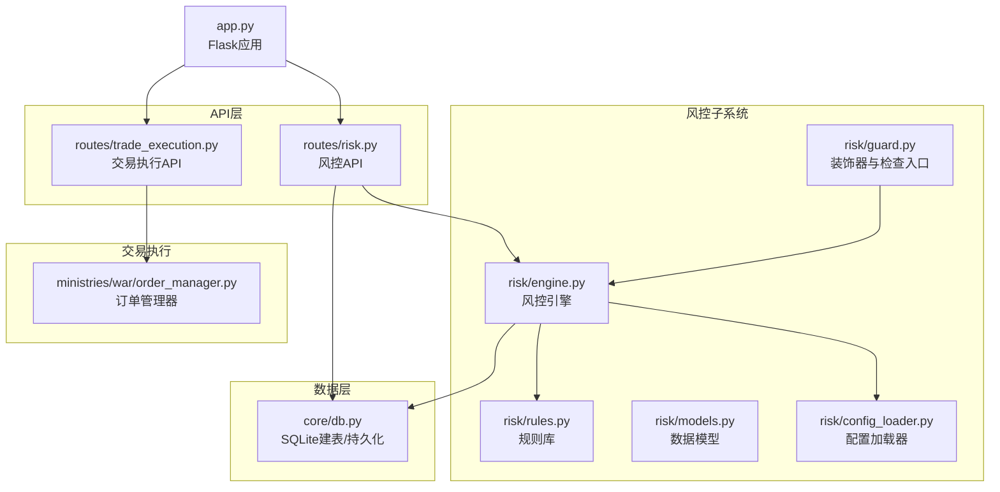
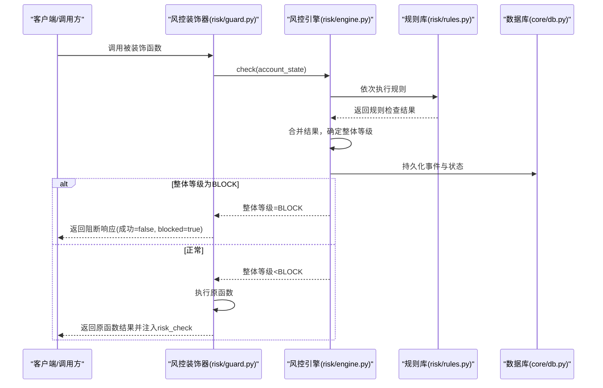
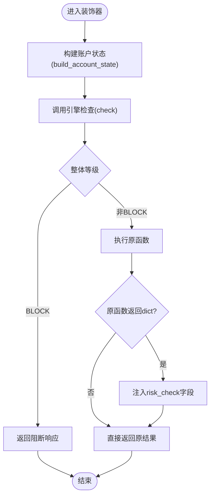
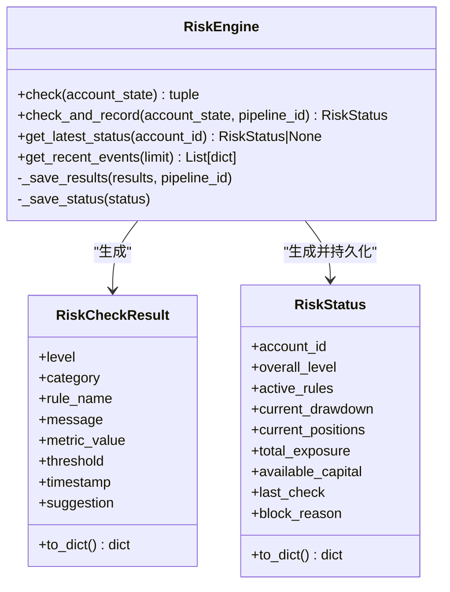
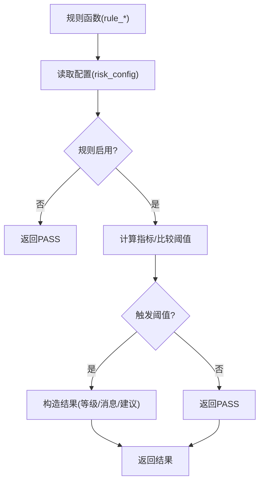
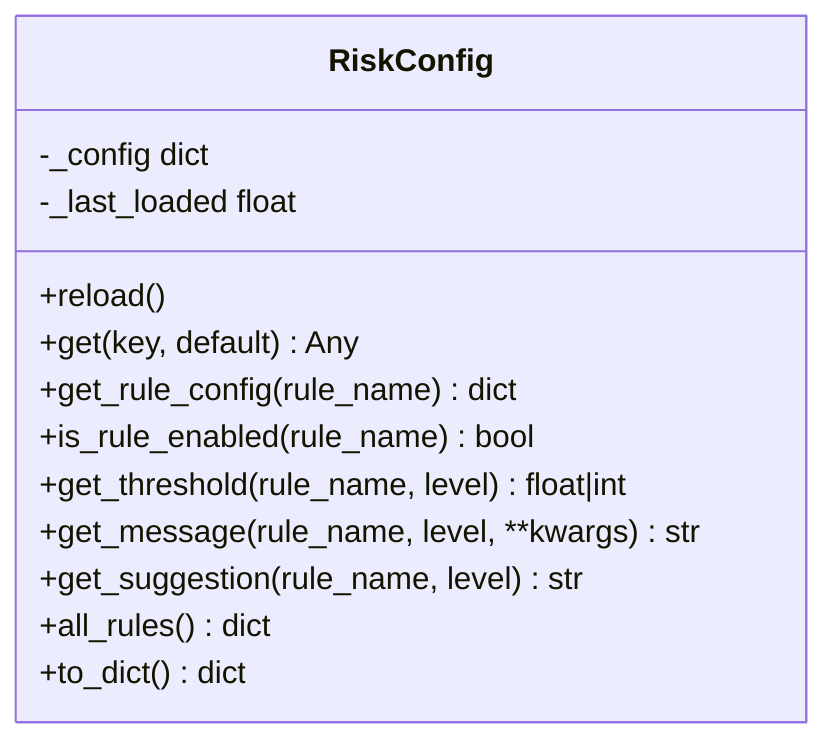
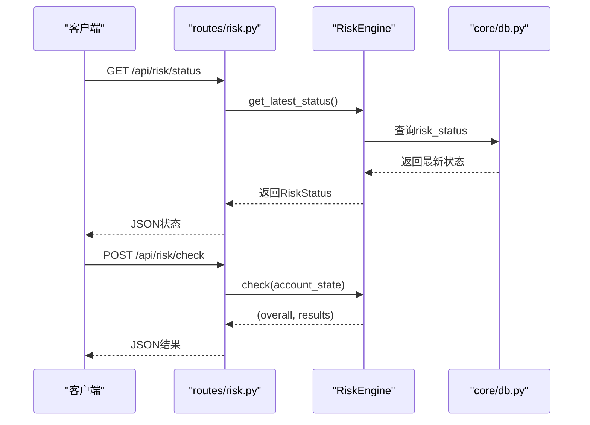
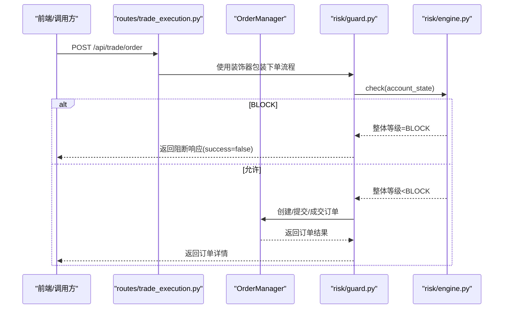
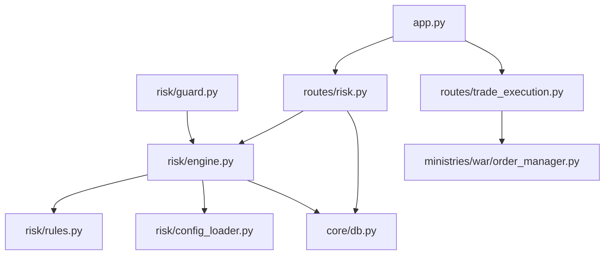

# 风控守卫机制

<cite>
**本文档引用的文件**
- [risk/guard.py](file://risk/guard.py)
- [risk/engine.py](file://risk/engine.py)
- [risk/rules.py](file://risk/rules.py)
- [risk/models.py](file://risk/models.py)
- [risk/config_loader.py](file://risk/config_loader.py)
- [routes/risk.py](file://routes/risk.py)
- [core/db.py](file://core/db.py)
- [routes/trade_execution.py](file://routes/trade_execution.py)
- [ministries/war/order_manager.py](file://ministries/war/order_manager.py)
- [app.py](file://app.py)
</cite>

## 目录
1. [简介](#简介)
2. [项目结构](#项目结构)
3. [核心组件](#核心组件)
4. [架构总览](#架构总览)
5. [详细组件分析](#详细组件分析)
6. [依赖关系分析](#依赖关系分析)
7. [性能考量](#性能考量)
8. [故障排除指南](#故障排除指南)
9. [结论](#结论)
10. [附录](#附录)

## 简介
本文件系统性阐述AIQuant风控守卫机制的设计与实现，覆盖实时风控拦截、交易阻断与状态保护等关键能力；解释风控守卫与交易执行系统的集成方式（阻断条件判断、拦截响应处理、恢复机制）；说明风控守卫的状态管理、阈值监控与异常检测；给出配置选项与自定义扩展方法（新增阻断条件与调整响应策略）；并提供典型使用场景与故障排除建议。

## 项目结构
风控守卫位于risk子系统，围绕规则引擎、规则库、配置加载器与数据模型构建；通过API路由对外提供风控状态查询、事件查询、手动检查、配置热加载与黑名单管理等能力；与交易执行系统通过装饰器与直接检查两种方式集成，实现交易前的实时风控拦截与状态保护。

**图表来源**
- [risk/guard.py:1-92](file://risk/guard.py#L1-L92)
- [risk/engine.py:1-168](file://risk/engine.py#L1-L168)
- [risk/rules.py:1-388](file://risk/rules.py#L1-L388)
- [risk/models.py:1-78](file://risk/models.py#L1-L78)
- [risk/config_loader.py:1-131](file://risk/config_loader.py#L1-L131)
- [routes/risk.py:1-298](file://routes/risk.py#L1-L298)
- [core/db.py:358-414](file://core/db.py#L358-L414)
- [routes/trade_execution.py:1-217](file://routes/trade_execution.py#L1-L217)
- [ministries/war/order_manager.py:1-211](file://ministries/war/order_manager.py#L1-L211)
- [app.py:1-164](file://app.py#L1-L164)

**章节来源**
- [risk/guard.py:1-92](file://risk/guard.py#L1-L92)
- [risk/engine.py:1-168](file://risk/engine.py#L1-L168)
- [risk/rules.py:1-388](file://risk/rules.py#L1-L388)
- [risk/models.py:1-78](file://risk/models.py#L1-L78)
- [risk/config_loader.py:1-131](file://risk/config_loader.py#L1-L131)
- [routes/risk.py:1-298](file://routes/risk.py#L1-L298)
- [core/db.py:358-414](file://core/db.py#L358-L414)
- [routes/trade_execution.py:1-217](file://routes/trade_execution.py#L1-L217)
- [ministries/war/order_manager.py:1-211](file://ministries/war/order_manager.py#L1-L211)
- [app.py:1-164](file://app.py#L1-L164)

## 核心组件
- 风控装饰器与检查入口：提供装饰器模式的风控拦截与直接检查两种使用方式，统一输出风控级别、阻断原因与详细结果。
- 风控引擎：聚合规则执行，计算整体风险等级，持久化事件与状态，并提供查询接口。
- 规则库：内置多条风控规则（最大回撤、集中度、择时、连续亏损、日频限制、波动率、行业集中度、总仓位、节假日提醒、黑名单），规则阈值来自配置。
- 配置加载器：支持YAML配置热加载，按需读取规则开关、阈值、消息模板与建议。
- 数据模型：定义风险等级、分类、检查结果与状态快照的数据结构。
- API路由：提供风控状态、事件查询、手动检查、配置热加载、黑名单管理、豁免申请与查询等接口。
- 交易执行系统：通过装饰器或直接检查在下单前进行风控拦截，保障交易阻断与状态保护。

**章节来源**
- [risk/guard.py:36-92](file://risk/guard.py#L36-L92)
- [risk/engine.py:13-168](file://risk/engine.py#L13-L168)
- [risk/rules.py:376-388](file://risk/rules.py#L376-L388)
- [risk/config_loader.py:20-131](file://risk/config_loader.py#L20-L131)
- [risk/models.py:11-78](file://risk/models.py#L11-L78)
- [routes/risk.py:29-298](file://routes/risk.py#L29-L298)
- [routes/trade_execution.py:23-179](file://routes/trade_execution.py#L23-L179)

## 架构总览
风控守卫采用“装饰器+规则引擎”的双通道集成方式：
- 装饰器通道：对业务函数进行包装，在执行前后注入风控检查与结果。
- 直接检查通道：在需要的地方直接调用风控检查，返回标准化结果字典。
规则引擎负责：
- 执行规则集合，合并结果，确定整体风险等级；
- 将检查结果与状态写入数据库；
- 提供查询最新状态与最近事件的能力。

**图表来源**
- [risk/guard.py:36-74](file://risk/guard.py#L36-L74)
- [risk/engine.py:19-71](file://risk/engine.py#L19-L71)
- [risk/rules.py:34-61](file://risk/rules.py#L34-L61)
- [core/db.py:358-414](file://core/db.py#L358-L414)

**章节来源**
- [risk/guard.py:36-92](file://risk/guard.py#L36-L92)
- [risk/engine.py:19-71](file://risk/engine.py#L19-L71)

## 详细组件分析

### 风控装饰器与检查入口
- 装饰器功能：在函数执行前进行风控检查，若整体等级为禁止级则直接拦截并返回阻断响应；否则继续执行原函数并将风控结果注入返回字典。
- 直接检查：提供独立的检查函数，返回整体等级、阻断标志、活跃规则、当前回撤与阻断原因等信息，便于在任意流程点进行风控评估。

**图表来源**
- [risk/guard.py:15-74](file://risk/guard.py#L15-L74)

**章节来源**
- [risk/guard.py:15-92](file://risk/guard.py#L15-L92)

### 风控引擎
- 规则执行：遍历规则列表，捕获规则异常并以警告等级记录，保证引擎鲁棒性。
- 等级合并：按阻断>限制>警告>通过的优先级合并整体等级。
- 持久化：将每条规则结果与当前状态写入数据库，支持后续审计与复盘。
- 查询接口：提供获取最新状态与最近事件的能力，便于前端展示与告警。

**图表来源**
- [risk/engine.py:13-168](file://risk/engine.py#L13-L168)
- [risk/models.py:28-78](file://risk/models.py#L28-L78)

**章节来源**
- [risk/engine.py:13-168](file://risk/engine.py#L13-L168)
- [risk/models.py:28-78](file://risk/models.py#L28-L78)

### 规则库与阈值监控
- 规则类型：最大回撤、单股集中度、大盘择时(MA5/MA20)、连续亏损冷却、日交易频率、个股波动率、行业集中度、总仓位、节假日提醒、黑名单检查。
- 阈值来源：从配置文件读取，支持热加载；规则可按需启用/禁用。
- 异常检测：规则执行异常会被捕获并记录为警告级别，避免影响整体风控判断。

**图表来源**
- [risk/rules.py:34-61](file://risk/rules.py#L34-L61)
- [risk/config_loader.py:88-116](file://risk/config_loader.py#L88-L116)

**章节来源**
- [risk/rules.py:34-387](file://risk/rules.py#L34-L387)
- [risk/config_loader.py:88-116](file://risk/config_loader.py#L88-L116)

### 配置加载器与热加载
- 单例设计：全局配置实例，支持自动检测文件变更并热加载。
- 键路径访问：支持点号分隔的键路径读取，便于深层配置访问。
- 规则配置：提供规则开关、阈值、消息模板与建议的便捷读取接口。

**图表来源**
- [risk/config_loader.py:20-131](file://risk/config_loader.py#L20-L131)

**章节来源**
- [risk/config_loader.py:20-131](file://risk/config_loader.py#L20-L131)

### API路由与状态保护
- 风控状态：查询最新风控状态，包含整体等级、阻断标志、活跃规则、回撤与最后检查时间。
- 风控事件：查询最近风险事件，支持按等级过滤。
- 手动检查：接收账户状态，返回整体等级与各规则结果。
- 配置管理：获取配置与热加载配置。
- 黑名单管理：查询、添加、删除黑名单。
- 豁免管理：申请、审批与查询风控豁免。

**图表来源**
- [routes/risk.py:31-82](file://routes/risk.py#L31-L82)
- [risk/engine.py:129-167](file://risk/engine.py#L129-L167)
- [core/db.py:374-414](file://core/db.py#L374-L414)

**章节来源**
- [routes/risk.py:31-298](file://routes/risk.py#L31-L298)
- [risk/engine.py:129-167](file://risk/engine.py#L129-L167)

### 与交易执行系统的集成
- 装饰器集成：在下单等关键业务函数上使用风控装饰器，实现交易前拦截。
- 直接检查：在下单流程中调用风控检查，依据返回结果决定是否放行或阻断。
- 阻断响应：当整体等级为禁止级时，返回明确的阻断响应，避免执行后续交易逻辑。
- 状态保护：通过持久化的风控状态与事件，支撑审计与回溯。

**图表来源**
- [routes/trade_execution.py:23-58](file://routes/trade_execution.py#L23-L58)
- [ministries/war/order_manager.py:76-125](file://ministries/war/order_manager.py#L76-L125)
- [risk/guard.py:36-74](file://risk/guard.py#L36-L74)
- [risk/engine.py:19-49](file://risk/engine.py#L19-L49)

**章节来源**
- [routes/trade_execution.py:23-179](file://routes/trade_execution.py#L23-L179)
- [ministries/war/order_manager.py:76-200](file://ministries/war/order_manager.py#L76-L200)
- [risk/guard.py:36-92](file://risk/guard.py#L36-L92)

## 依赖关系分析
- 组件耦合：装饰器依赖引擎；引擎依赖规则库与配置加载器；API路由依赖引擎与数据库；交易执行依赖订单管理器。
- 数据流：风控检查结果写入数据库，API路由读取数据库提供查询；装饰器与直接检查均通过引擎访问规则与配置。
- 外部依赖：Flask蓝图注册于应用入口，WebSocket路由在应用中统一注册。

**图表来源**
- [risk/guard.py:11-12](file://risk/guard.py#L11-L12)
- [risk/engine.py:8-10](file://risk/engine.py#L8-L10)
- [routes/risk.py:21-24](file://routes/risk.py#L21-L24)
- [app.py:19-72](file://app.py#L19-L72)

**章节来源**
- [risk/guard.py:11-12](file://risk/guard.py#L11-L12)
- [risk/engine.py:8-10](file://risk/engine.py#L8-L10)
- [routes/risk.py:21-24](file://routes/risk.py#L21-L24)
- [app.py:19-72](file://app.py#L19-L72)

## 性能考量
- 规则执行：规则数量与复杂度直接影响检查耗时；建议按需启用规则，合理设置阈值，避免冗余计算。
- 数据库写入：检查结果与状态写入数据库可能成为瓶颈；可通过批量插入、索引优化与连接池配置降低延迟。
- 热加载：配置热加载采用文件时间戳检测，频繁变更会影响I/O；建议在生产环境控制变更频率。
- 装饰器开销：装饰器包装会带来少量额外调用开销；对高频路径可考虑直接检查替代装饰器。

## 故障排除指南
- 阻断误判
  - 检查规则配置是否正确，确认阈值与消息模板；
  - 查看最近风险事件，定位具体触发规则；
  - 临时禁用可疑规则验证影响范围。
- 配置不生效
  - 确认配置文件路径与权限；
  - 使用热加载接口或重启服务；
  - 检查配置键路径是否正确。
- 数据库异常
  - 确认表结构是否初始化；
  - 检查连接超时与并发写入问题；
  - 查看引擎持久化异常日志。
- 交易未拦截
  - 确认装饰器是否正确包裹业务函数；
  - 检查传入的账户状态是否包含必要字段；
  - 对直接检查路径，确认返回值处理逻辑。

**章节来源**
- [routes/risk.py:96-107](file://routes/risk.py#L96-L107)
- [risk/engine.py:73-127](file://risk/engine.py#L73-L127)
- [core/db.py:358-414](file://core/db.py#L358-L414)

## 结论
风控守卫通过装饰器与直接检查两种方式无缝集成交易执行系统，结合规则引擎、配置热加载与数据库持久化，实现了实时风控拦截、交易阻断与状态保护。其模块化设计便于扩展新规则与调整阈值，配合完善的API与查询能力，满足生产环境的风控需求与审计要求。

## 附录

### 配置选项与自定义扩展
- 新增规则步骤
  - 在规则库中新增规则函数，遵循统一的结果构造方式；
  - 在规则注册表中添加新规则；
  - 在配置文件中为新规则设置enabled、thresholds、messages、suggestions。
- 调整响应策略
  - 修改规则阈值与消息模板；
  - 通过API热加载配置或重启服务；
  - 如需调整拦截行为，可在装饰器或直接检查处增加前置逻辑。
- 黑名单与豁免
  - 通过API管理黑名单与豁免，支持到期与审批流程。

**章节来源**
- [risk/rules.py:376-387](file://risk/rules.py#L376-L387)
- [risk/config_loader.py:88-116](file://risk/config_loader.py#L88-L116)
- [routes/risk.py:112-244](file://routes/risk.py#L112-L244)