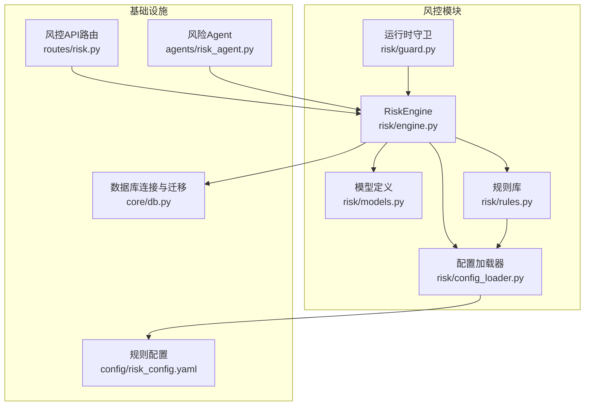
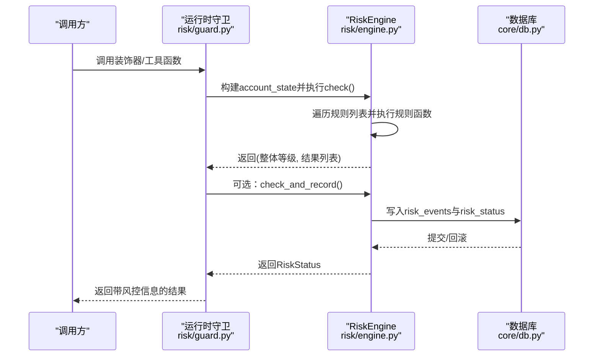
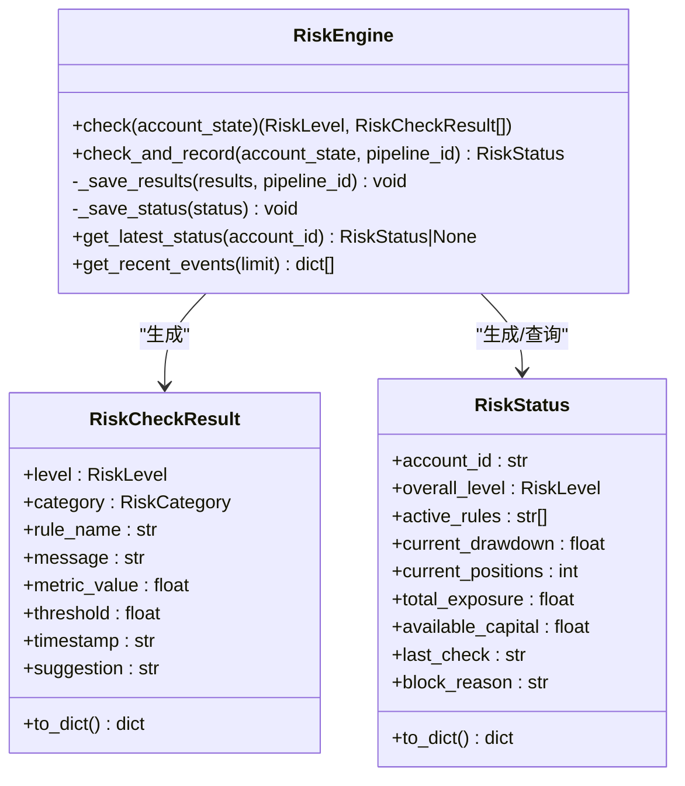
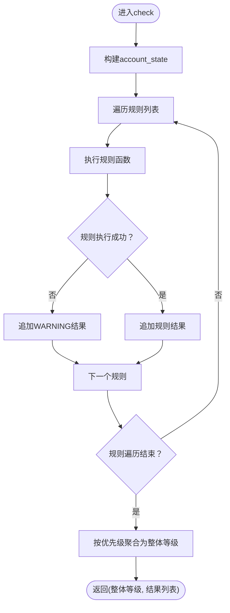
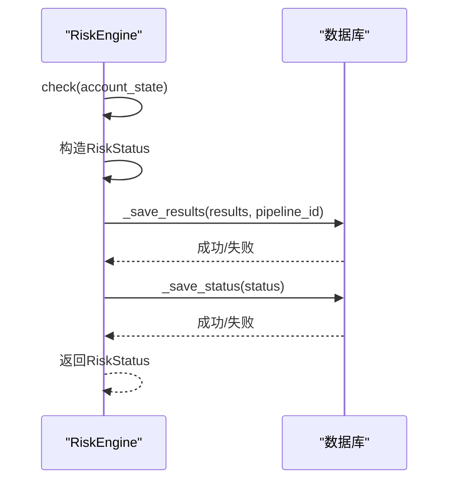
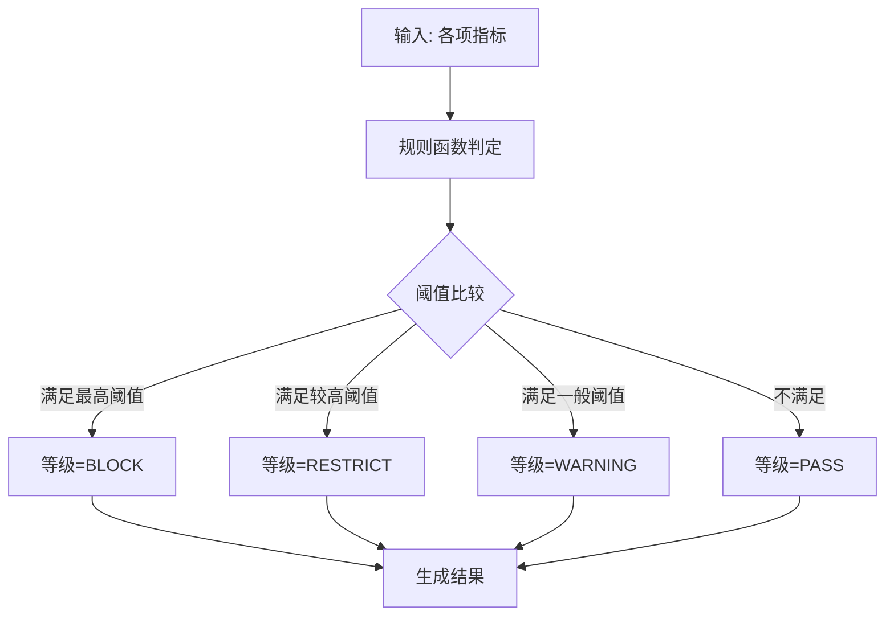
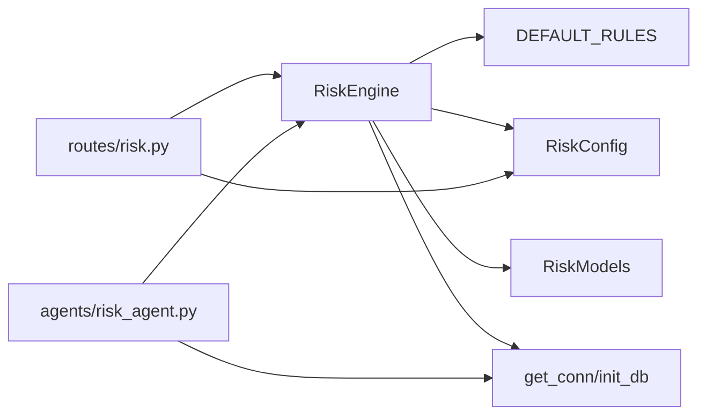

# 风控引擎核心

<cite>
**本文引用的文件**
- [risk/engine.py](file://risk/engine.py)
- [risk/models.py](file://risk/models.py)
- [risk/rules.py](file://risk/rules.py)
- [risk/guard.py](file://risk/guard.py)
- [risk/config_loader.py](file://risk/config_loader.py)
- [core/db.py](file://core/db.py)
- [routes/risk.py](file://routes/risk.py)
- [config/risk_config.yaml](file://config/risk_config.yaml)
- [agents/risk_agent.py](file://agents/risk_agent.py)
</cite>

## 目录
1. [简介](#简介)
2. [项目结构](#项目结构)
3. [核心组件](#核心组件)
4. [架构总览](#架构总览)
5. [详细组件分析](#详细组件分析)
6. [依赖分析](#依赖分析)
7. [性能考量](#性能考量)
8. [故障排查指南](#故障排查指南)
9. [结论](#结论)
10. [附录](#附录)

## 简介
本文件面向AIQuant风控引擎核心模块，系统性阐述RiskEngine类的设计架构与实现原理，覆盖全量风控检查流程、风险等级评估算法、检查结果聚合机制、异常规则执行处理、风险等级优先级计算、状态持久化与事务性保证，并提供与交易流水线的集成方式、使用示例与最佳实践建议。目标读者既包括工程技术人员，也包括对风控体系感兴趣但技术背景有限的业务人员。

## 项目结构
风控引擎位于risk子包，围绕RiskEngine核心类组织规则、模型、配置与守卫层；数据库操作由core/db.py统一提供连接与事务管理；API路由在routes/risk.py中暴露查询与手动检查接口；配置文件config/risk_config.yaml提供规则阈值与消息模板，支持热加载；agents/risk_agent.py将风控检查接入整体交易编排流程。

图表来源
- [risk/engine.py:13-168](file://risk/engine.py#L13-L168)
- [risk/models.py:11-78](file://risk/models.py#L11-L78)
- [risk/rules.py:14-388](file://risk/rules.py#L14-L388)
- [risk/config_loader.py:20-131](file://risk/config_loader.py#L20-L131)
- [core/db.py:26-427](file://core/db.py#L26-L427)
- [routes/risk.py:19-298](file://routes/risk.py#L19-L298)
- [config/risk_config.yaml:1-170](file://config/risk_config.yaml#L1-L170)
- [agents/risk_agent.py:25-262](file://agents/risk_agent.py#L25-L262)

章节来源
- [risk/engine.py:13-168](file://risk/engine.py#L13-L168)
- [core/db.py:26-427](file://core/db.py#L26-L427)

## 核心组件
- RiskEngine：风控引擎核心，负责规则执行、结果聚合、状态持久化与查询。
- RiskCheckResult/RiskStatus：风控检查结果与状态快照的数据模型。
- 规则库DEFAULT_RULES：内置规则集合，按顺序执行并产出单项检查结果。
- RiskConfig：规则配置加载器，支持热加载与模板渲染。
- 运行时守卫risk_guard：装饰器与工具函数，用于在业务流程中自动注入风控检查。
- 数据库层：通过core/db.py的连接管理与事务控制，确保写入一致性。

章节来源
- [risk/engine.py:13-168](file://risk/engine.py#L13-L168)
- [risk/models.py:28-78](file://risk/models.py#L28-L78)
- [risk/rules.py:376-388](file://risk/rules.py#L376-L388)
- [risk/config_loader.py:20-131](file://risk/config_loader.py#L20-L131)
- [risk/guard.py:36-92](file://risk/guard.py#L36-L92)

## 架构总览
风控引擎采用“规则驱动 + 配置化 + 数据持久化”的架构模式：
- 规则驱动：RiskEngine遍历规则列表，逐一执行规则函数，生成单项结果。
- 配置化：RiskConfig从YAML读取阈值与消息模板，支持热加载，规则函数按配置动态判定等级与提示。
- 持久化：RiskEngine将单项结果与状态快照分别写入risk_events与risk_status表，使用数据库连接管理器提供的事务语义保障一致性。
- 守卫集成：risk_guard装饰器与工具函数将风控检查无缝嵌入业务流程，支持直接检查与自动拦截。

图表来源
- [risk/guard.py:36-92](file://risk/guard.py#L36-L92)
- [risk/engine.py:19-168](file://risk/engine.py#L19-L168)
- [core/db.py:26-40](file://core/db.py#L26-L40)

## 详细组件分析

### RiskEngine类设计与实现
- 职责边界清晰：负责规则执行、结果聚合、状态持久化与查询。
- 规则执行：遍历规则列表，逐个调用规则函数；任何规则异常被捕获并记录为WARNING级别，避免单点故障影响整体风控。
- 结果聚合：使用等级优先级映射，取最严格的风险等级作为整体等级。
- 状态持久化：check_and_record将单项结果与状态快照写入数据库；单独的_save_results与_save_status方法便于扩展与单元测试。
- 查询能力：提供最新状态查询与最近事件查询，支持前端展示与审计。

图表来源
- [risk/engine.py:13-168](file://risk/engine.py#L13-L168)
- [risk/models.py:28-78](file://risk/models.py#L28-L78)

章节来源
- [risk/engine.py:19-168](file://risk/engine.py#L19-L168)
- [risk/models.py:28-78](file://risk/models.py#L28-L78)

### 全量风控检查流程（check）
- 输入：account_state字典，包含账户与市场指标。
- 执行：遍历DEFAULT_RULES，逐条调用规则函数；规则函数根据RiskConfig配置判定等级与消息。
- 异常处理：规则执行异常捕获为WARNING级别，确保系统鲁棒性。
- 聚合：使用等级优先级映射，取最严格等级作为整体等级。
- 输出：整体等级与单项结果列表。

图表来源
- [risk/engine.py:19-49](file://risk/engine.py#L19-L49)
- [risk/rules.py:376-388](file://risk/rules.py#L376-L388)

章节来源
- [risk/engine.py:19-49](file://risk/engine.py#L19-L49)
- [risk/rules.py:376-388](file://risk/rules.py#L376-L388)

### 检查并记录流程（check_and_record）
- 调用check获取整体等级与结果列表。
- 构造RiskStatus对象，包含账户关键指标与阻断原因。
- 调用_save_results与_save_status分别持久化单项事件与状态快照。
- 返回RiskStatus供上层使用。

图表来源
- [risk/engine.py:51-71](file://risk/engine.py#L51-L71)
- [risk/engine.py:73-127](file://risk/engine.py#L73-L127)

章节来源
- [risk/engine.py:51-71](file://risk/engine.py#L51-L71)
- [risk/engine.py:73-127](file://risk/engine.py#L73-L127)

### 风险等级评估算法与优先级
- 等级枚举：PASS < WARNING < RESTRICT < BLOCK。
- 优先级映射：BLOCK > RESTRICT > WARNING > PASS，取最大优先级作为整体等级。
- 规则函数内部按阈值分级，输出对应等级与消息。

图表来源
- [risk/engine.py:40-47](file://risk/engine.py#L40-L47)
- [risk/models.py:11-16](file://risk/models.py#L11-L16)

章节来源
- [risk/engine.py:40-47](file://risk/engine.py#L40-L47)
- [risk/models.py:11-16](file://risk/models.py#L11-L16)

### 规则库与配置加载
- 规则注册：DEFAULT_RULES集中注册所有规则函数，便于统一调度。
- 配置加载：RiskConfig支持热加载，提供is_rule_enabled、get_rule_config、get_threshold、get_message、get_suggestion等便捷方法。
- 规则函数签名：rule_name(account_state: dict) -> RiskCheckResult，统一结果结构与消息模板。

章节来源
- [risk/rules.py:376-388](file://risk/rules.py#L376-L388)
- [risk/config_loader.py:88-116](file://risk/config_loader.py#L88-L116)

### 数据持久化与事务性保证
- 连接管理：get_conn提供上下文管理器，自动commit/rollback，确保异常时回滚。
- 表结构：risk_events与risk_status由init_db创建，包含索引以支持查询与审计。
- 写入策略：check_and_record分别写入单项事件与状态快照，保证数据完整性与可追溯性。

章节来源
- [core/db.py:26-40](file://core/db.py#L26-L40)
- [core/db.py:358-427](file://core/db.py#L358-L427)
- [risk/engine.py:73-127](file://risk/engine.py#L73-L127)

### 运行时守卫与集成
- 装饰器risk_guard：在被装饰函数前后自动执行风控检查，若整体等级为BLOCK则直接拦截。
- 工具函数check_risk：直接返回风控结果字典，便于在任意流程中插入风控检查。
- RiskAgent：在交易编排中调用check_and_record并将结果写入上下文，供Orchestrator拦截。

章节来源
- [risk/guard.py:36-92](file://risk/guard.py#L36-L92)
- [agents/risk_agent.py:52-96](file://agents/risk_agent.py#L52-L96)

## 依赖分析
- RiskEngine依赖：
  - 规则集合DEFAULT_RULES（risk/rules.py）
  - 配置RiskConfig（risk/config_loader.py）
  - 数据库连接与表结构（core/db.py）
  - 数据模型（risk/models.py）
- API路由routes/risk.py依赖RiskEngine与RiskConfig，提供查询与手动检查接口。
- RiskAgent依赖RiskEngine与数据库查询，将风控检查融入交易流水线。

图表来源
- [risk/engine.py:8-10](file://risk/engine.py#L8-L10)
- [routes/risk.py:21-24](file://routes/risk.py#L21-L24)
- [agents/risk_agent.py:21-22](file://agents/risk_agent.py#L21-L22)

章节来源
- [risk/engine.py:8-10](file://risk/engine.py#L8-L10)
- [routes/risk.py:21-24](file://routes/risk.py#L21-L24)
- [agents/risk_agent.py:21-22](file://agents/risk_agent.py#L21-L22)

## 性能考量
- 规则执行：规则函数按顺序执行，复杂度取决于规则数量与数据访问。建议：
  - 将高成本规则置于末尾或按条件短路。
  - 使用RiskConfig的is_rule_enabled进行快速跳过。
- 数据库写入：check_and_record包含两次写入，建议：
  - 在高频场景下合并写入或批量写入（如需扩展）。
  - 使用索引优化查询（risk_events已建立索引）。
- 配置热加载：RiskConfig在访问时自动检测文件变更，避免频繁reload导致的I/O压力。
- 并发与事务：get_conn使用WAL模式与NORMAL同步，兼顾性能与可靠性。

[本节为通用性能建议，不直接分析具体文件]

## 故障排查指南
- 规则异常：规则执行异常会被捕获并记录为WARNING级别，检查risk_events中对应规则的message字段。
- 数据库写入失败：检查数据库连接与权限，确认表结构是否初始化完成。
- 配置未生效：确认risk_config.yaml路径正确，且RiskConfig已热加载；可通过API触发reload。
- 阻断拦截：若被BLOCK，检查block_reason与active_rules，定位具体规则。

章节来源
- [risk/engine.py:29-38](file://risk/engine.py#L29-L38)
- [routes/risk.py:96-107](file://routes/risk.py#L96-L107)
- [core/db.py:57-427](file://core/db.py#L57-L427)

## 结论
AIQuant风控引擎以RiskEngine为核心，结合规则库、配置加载与数据库持久化，形成可配置、可扩展、可审计的风控体系。通过等级优先级聚合与异常保护机制，确保系统在复杂市场环境下稳定运行。配合运行时守卫与Agent集成，风控检查可无缝嵌入交易流水线，实现端到端的风险管控。

[本节为总结性内容，不直接分析具体文件]

## 附录

### 使用示例与最佳实践
- 在业务流程中使用装饰器：
  - 对可能产生风险的操作函数使用@risk_guard装饰器，自动注入风控检查与拦截。
- 直接调用风控检查：
  - 使用check_risk(account_state, pipeline_id)获取风控结果字典，适合在API或脚本中使用。
- 集成到交易流水线：
  - RiskAgent在编排中调用check_and_record并将结果写入上下文，Orchestrator可根据risk_status.overall_level决定是否放行。
- 配置管理：
  - 通过config/risk_config.yaml调整阈值与消息模板，支持热加载；必要时通过API触发reload。
- 性能优化建议：
  - 合理设置规则启用开关，避免不必要的计算。
  - 关注数据库写入瓶颈，必要时扩展批量写入或异步化。
  - 使用索引加速查询，定期清理过期数据。

章节来源
- [risk/guard.py:36-92](file://risk/guard.py#L36-L92)
- [agents/risk_agent.py:52-96](file://agents/risk_agent.py#L52-L96)
- [routes/risk.py:67-82](file://routes/risk.py#L67-L82)
- [config/risk_config.yaml:1-170](file://config/risk_config.yaml#L1-L170)