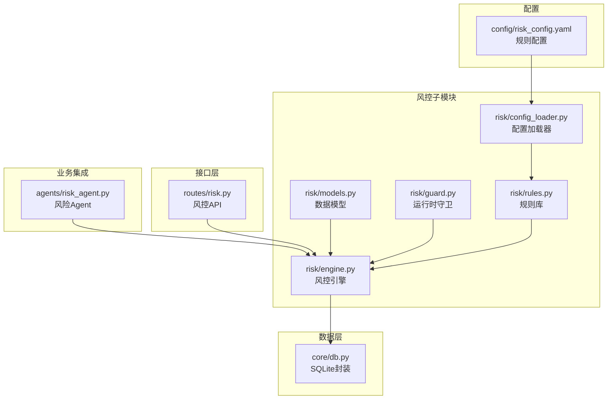
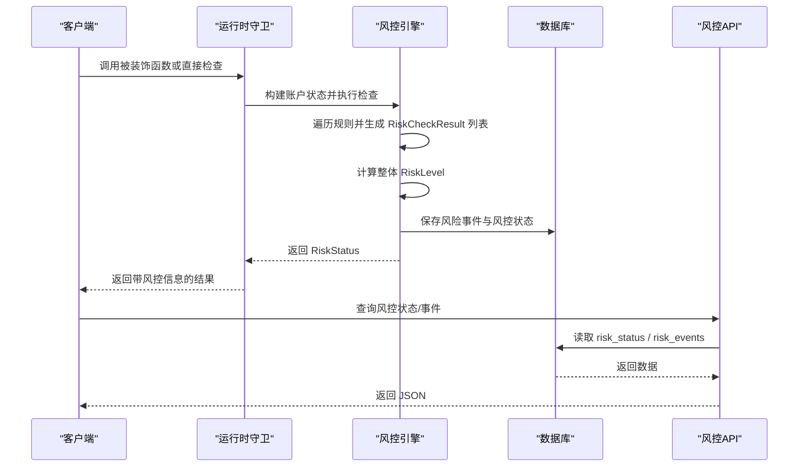
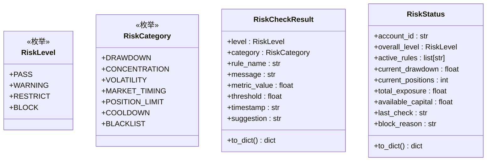
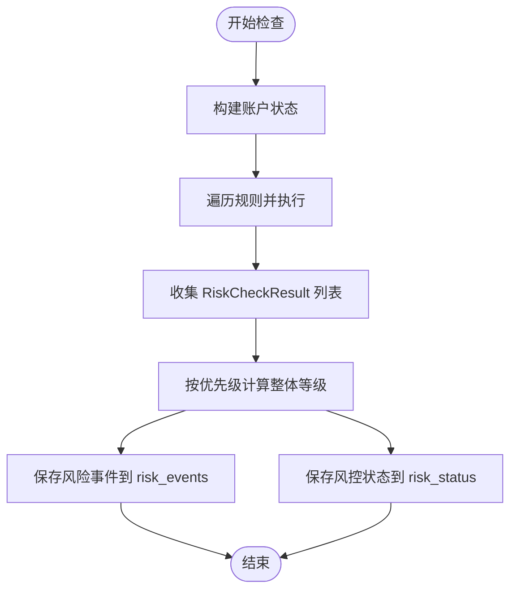
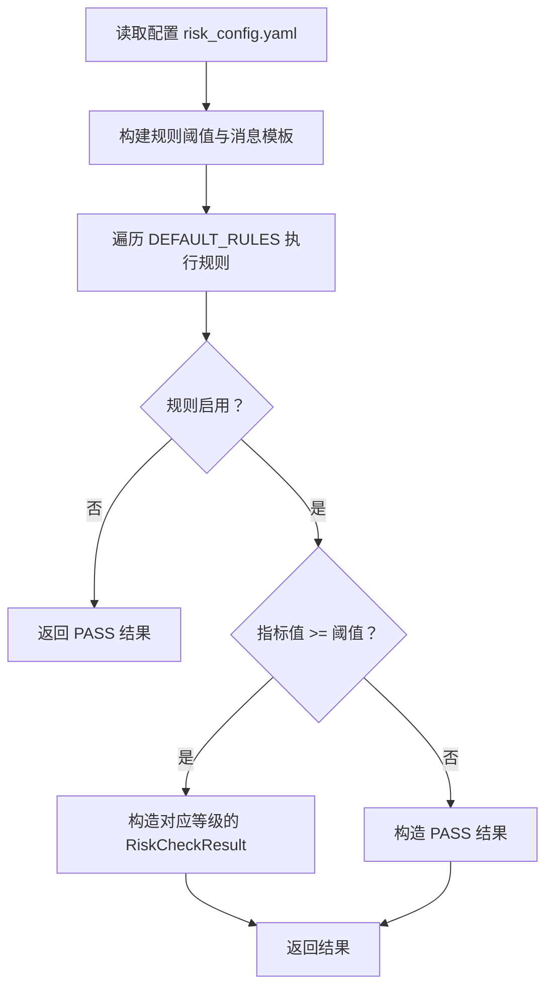
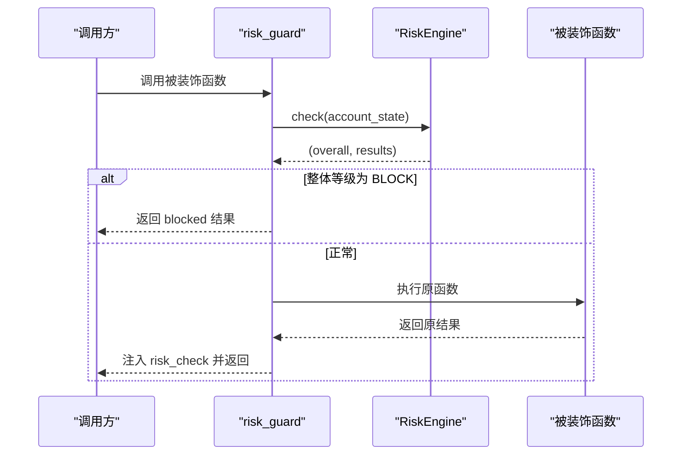
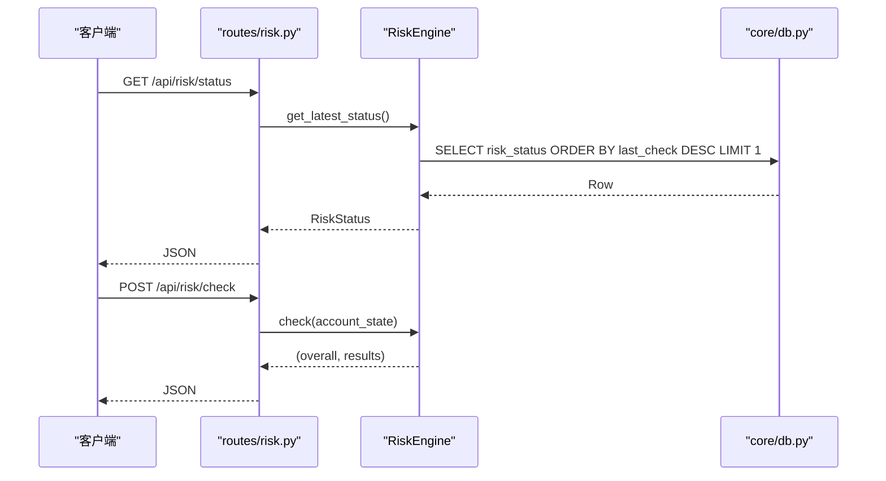
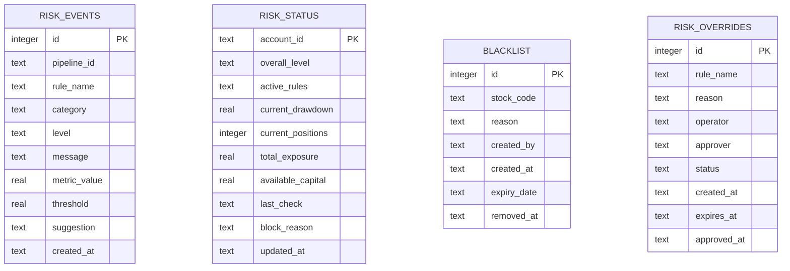
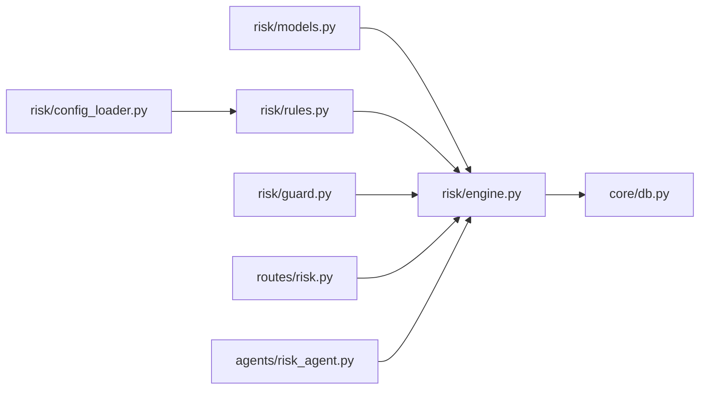

# 风控数据模型

<cite>
**本文引用的文件**
- [risk/models.py](file://risk/models.py)
- [risk/engine.py](file://risk/engine.py)
- [risk/guard.py](file://risk/guard.py)
- [risk/rules.py](file://risk/rules.py)
- [risk/config_loader.py](file://risk/config_loader.py)
- [routes/risk.py](file://routes/risk.py)
- [core/db.py](file://core/db.py)
- [config/risk_config.yaml](file://config/risk_config.yaml)
- [agents/risk_agent.py](file://agents/risk_agent.py)
</cite>

## 目录
1. [简介](#简介)
2. [项目结构](#项目结构)
3. [核心组件](#核心组件)
4. [架构概览](#架构概览)
5. [详细组件分析](#详细组件分析)
6. [依赖分析](#依赖分析)
7. [性能考量](#性能考量)
8. [故障排查指南](#故障排查指南)
9. [结论](#结论)
10. [附录](#附录)

## 简介
本文件系统性阐述 AIQuant 风控数据模型，重点解析 RiskCheckResult、RiskLevel、RiskStatus 等核心数据结构的设计理念、字段语义与关系；详述风险等级枚举、规则检查结果的数据结构与风控状态的完整表示；解释从规则检查到状态更新的完整生命周期；说明数据模型的序列化/反序列化机制及在数据库中的存储格式；并提供使用示例与最佳实践。

## 项目结构
风控相关代码主要分布在 risk 子模块，并通过 routes 提供 API，通过 agents 集成到业务流程，通过 core/db 与 SQLite 数据库存储交互，配置由 risk_config.yaml 管理并通过 RiskConfig 热加载。

图表来源
- [risk/models.py:1-78](file://risk/models.py#L1-L78)
- [risk/engine.py:1-168](file://risk/engine.py#L1-L168)
- [risk/guard.py:1-92](file://risk/guard.py#L1-L92)
- [risk/rules.py:1-388](file://risk/rules.py#L1-L388)
- [risk/config_loader.py:1-131](file://risk/config_loader.py#L1-L131)
- [routes/risk.py:1-298](file://routes/risk.py#L1-L298)
- [core/db.py:1-467](file://core/db.py#L1-L467)
- [config/risk_config.yaml:1-170](file://config/risk_config.yaml#L1-L170)
- [agents/risk_agent.py:1-262](file://agents/risk_agent.py#L1-L262)

章节来源
- [risk/models.py:1-78](file://risk/models.py#L1-L78)
- [risk/engine.py:1-168](file://risk/engine.py#L1-L168)
- [risk/guard.py:1-92](file://risk/guard.py#L1-L92)
- [risk/rules.py:1-388](file://risk/rules.py#L1-L388)
- [risk/config_loader.py:1-131](file://risk/config_loader.py#L1-L131)
- [routes/risk.py:1-298](file://routes/risk.py#L1-L298)
- [core/db.py:1-467](file://core/db.py#L1-L467)
- [config/risk_config.yaml:1-170](file://config/risk_config.yaml#L1-L170)
- [agents/risk_agent.py:1-262](file://agents/risk_agent.py#L1-L262)

## 核心组件
- 风险等级枚举 RiskLevel：用于表示单条规则或整体风控的严重程度，包含通过、警告、限制、禁止四个级别。
- 风险类别枚举 RiskCategory：对风控检查维度进行分类，如回撤、集中度、波动率、择时、仓位限制、冷却、黑名单等。
- 风控检查结果 RiskCheckResult：承载单条规则的检查结果，包含等级、类别、规则名、消息、指标值、阈值、时间戳、建议等字段，并提供 to_dict 序列化方法。
- 风控状态 RiskStatus：账户实时风控状态快照，包含账户标识、整体等级、活跃规则列表、当前回撤、持仓数量、总敞口、可用资金、最后检查时间、阻断原因等字段，并提供 to_dict 序列化方法。

章节来源
- [risk/models.py:11-78](file://risk/models.py#L11-L78)

## 架构概览
风控系统采用“规则库 + 引擎 + 守卫 + API + 数据库”的分层设计：
- 规则库：内置多条风控规则，规则阈值来自配置文件，支持热加载。
- 引擎：负责执行规则、聚合结果、计算整体等级、持久化事件与状态。
- 守卫：提供装饰器与直接调用两种方式，将风控检查无缝嵌入业务流程。
- API：提供风控状态查询、事件查询、手动检查、配置热加载、黑名单与豁免管理等接口。
- 数据库：存储风控事件、风控状态、黑名单、豁免等数据。

图表来源
- [risk/guard.py:36-92](file://risk/guard.py#L36-L92)
- [risk/engine.py:19-168](file://risk/engine.py#L19-L168)
- [routes/risk.py:31-82](file://routes/risk.py#L31-L82)
- [core/db.py:359-414](file://core/db.py#L359-L414)

## 详细组件分析

### 数据模型：RiskLevel、RiskCategory、RiskCheckResult、RiskStatus
- RiskLevel：定义了风控等级的优先级顺序，引擎据此取最严格等级作为整体等级。
- RiskCategory：对风控维度进行归类，便于事件统计与可视化。
- RiskCheckResult：单条规则检查结果，包含指标值、阈值、消息、建议等，便于审计与告警。
- RiskStatus：账户级风控快照，包含活跃规则集合、回撤、敞口、资金等关键指标，便于快速决策。

图表来源
- [risk/models.py:11-78](file://risk/models.py#L11-L78)

章节来源
- [risk/models.py:11-78](file://risk/models.py#L11-L78)

### 风控引擎：规则执行与状态持久化
- 规则执行：遍历规则列表，调用每个规则函数，捕获异常并生成警告级别的检查结果。
- 整体等级：按 RiskLevel 优先级映射取最大值，确保最严格规则决定最终等级。
- 持久化：将每条检查结果写入 risk_events，将账户级状态写入 risk_status（INSERT OR REPLACE）。
- 查询：提供获取最新状态与最近事件的能力。

图表来源
- [risk/engine.py:19-168](file://risk/engine.py#L19-L168)
- [core/db.py:359-414](file://core/db.py#L359-L414)

章节来源
- [risk/engine.py:19-168](file://risk/engine.py#L19-L168)
- [core/db.py:359-414](file://core/db.py#L359-L414)

### 规则库：可配置的风控规则
- 规则函数签名统一：rule_name(account_state: dict) -> RiskCheckResult。
- 阈值与消息模板来自 risk_config.yaml，支持热加载。
- 内置规则覆盖：最大回撤、单股集中度、择时、连续亏损、日交易频率、波动率、行业集中度、总仓位、节假日提醒、黑名单检查等。
- 规则注册：DEFAULT_RULES 自动收集所有 rule_* 函数，便于扩展与维护。

图表来源
- [risk/rules.py:14-388](file://risk/rules.py#L14-L388)
- [risk/config_loader.py:73-116](file://risk/config_loader.py#L73-L116)
- [config/risk_config.yaml:1-170](file://config/risk_config.yaml#L1-L170)

章节来源
- [risk/rules.py:14-388](file://risk/rules.py#L14-L388)
- [risk/config_loader.py:73-116](file://risk/config_loader.py#L73-L116)
- [config/risk_config.yaml:1-170](file://config/risk_config.yaml#L1-L170)

### 运行时守卫：装饰器与直接检查
- 装饰器 risk_guard：对被装饰函数进行风控前置检查，若整体等级为 BLOCK，则直接拦截并返回阻断信息；否则执行原函数并将风控结果注入返回字典。
- 直接检查 check_risk：不装饰函数，直接返回风控状态摘要，便于在任意流程中插入风控检查。

图表来源
- [risk/guard.py:36-92](file://risk/guard.py#L36-L92)
- [risk/engine.py:19-71](file://risk/engine.py#L19-L71)

章节来源
- [risk/guard.py:36-92](file://risk/guard.py#L36-L92)
- [risk/engine.py:19-71](file://risk/engine.py#L19-L71)

### API 层：状态查询、事件查询与配置管理
- /api/risk/status：获取最新风控状态。
- /api/risk/events：查询最近风险事件，支持按等级过滤。
- /api/risk/check：手动触发风控检查。
- /api/risk/config：获取当前风控配置。
- /api/risk/config/reload：热加载风控配置。
- 黑名单与豁免管理：查询、添加、删除黑名单；申请、查询、审批豁免。

图表来源
- [routes/risk.py:31-82](file://routes/risk.py#L31-L82)
- [risk/engine.py:129-168](file://risk/engine.py#L129-L168)
- [core/db.py:374-414](file://core/db.py#L374-L414)

章节来源
- [routes/risk.py:31-82](file://routes/risk.py#L31-L82)
- [risk/engine.py:129-168](file://risk/engine.py#L129-L168)
- [core/db.py:374-414](file://core/db.py#L374-L414)

### 数据库存储与序列化/反序列化
- 表结构：
  - risk_events：存储每条规则检查事件，字段包含 pipeline_id、rule_name、category、level、message、metric_value、threshold、suggestion、created_at。
  - risk_status：存储账户级风控状态快照，字段包含 account_id、overall_level、active_rules（逗号分隔字符串）、current_drawdown、current_positions、total_exposure、available_capital、last_check、block_reason。
  - blacklist：黑名单表。
  - risk_overrides：风控豁免表。
- 序列化/反序列化：
  - 模型提供 to_dict 方法，便于转换为字典用于 API 响应或数据库写入。
  - 读取时，RiskEngine 将数据库行转换为 RiskStatus 对象，active_rules 从逗号分隔字符串还原为列表。

图表来源
- [core/db.py:359-414](file://core/db.py#L359-L414)

章节来源
- [core/db.py:359-414](file://core/db.py#L359-L414)
- [risk/models.py:40-77](file://risk/models.py#L40-L77)
- [risk/engine.py:73-153](file://risk/engine.py#L73-L153)

### 使用示例与最佳实践
- 在业务流程中使用装饰器：
  - 将 risk_guard(action="...") 装饰在关键函数上，自动注入风控检查与结果。
  - 若整体等级为 BLOCK，装饰器直接返回阻断响应，避免继续执行。
- 直接调用风控检查：
  - 使用 check_risk(account_state, pipeline_id) 获取风控状态摘要，适合在任意阶段插入风控检查。
- 配置管理：
  - 修改 config/risk_config.yaml 后，通过 /api/risk/config/reload 热加载配置，无需重启服务。
- 数据模型最佳实践：
  - 使用 RiskCheckResult 的 to_dict 输出用于审计与告警。
  - 使用 RiskStatus 的 to_dict 输出用于前端展示。
  - 在数据库中，active_rules 以逗号分隔存储，读取时再拆分为列表，兼顾存储效率与查询便利。
  - 阻断原因 block_reason 汇聚所有 BLOCK 级别规则的消息，便于快速定位问题。

章节来源
- [risk/guard.py:36-92](file://risk/guard.py#L36-L92)
- [routes/risk.py:86-108](file://routes/risk.py#L86-L108)
- [risk/models.py:40-77](file://risk/models.py#L40-L77)
- [risk/engine.py:101-153](file://risk/engine.py#L101-L153)

## 依赖分析
- 模块内聚与耦合：
  - risk/models.py 为纯数据模型，低耦合，高内聚。
  - risk/engine.py 依赖 models、rules、config_loader，承担核心逻辑，耦合度适中。
  - risk/guard.py 依赖 engine 与 models，提供运行时拦截能力。
  - routes/risk.py 依赖 engine 与 config_loader，提供对外 API。
  - core/db.py 提供数据库连接与建表，被 engine 与 routes 使用。
- 外部依赖：
  - 配置文件 risk_config.yaml 通过 RiskConfig 热加载，避免重启。
  - SQLite 本地数据库，通过上下文管理器保证事务一致性。

图表来源
- [risk/models.py:1-78](file://risk/models.py#L1-L78)
- [risk/engine.py:1-168](file://risk/engine.py#L1-L168)
- [risk/guard.py:1-92](file://risk/guard.py#L1-L92)
- [risk/rules.py:1-388](file://risk/rules.py#L1-L388)
- [risk/config_loader.py:1-131](file://risk/config_loader.py#L1-L131)
- [routes/risk.py:1-298](file://routes/risk.py#L1-L298)
- [agents/risk_agent.py:1-262](file://agents/risk_agent.py#L1-L262)
- [core/db.py:1-467](file://core/db.py#L1-L467)

章节来源
- [risk/models.py:1-78](file://risk/models.py#L1-L78)
- [risk/engine.py:1-168](file://risk/engine.py#L1-L168)
- [risk/guard.py:1-92](file://risk/guard.py#L1-L92)
- [risk/rules.py:1-388](file://risk/rules.py#L1-L388)
- [risk/config_loader.py:1-131](file://risk/config_loader.py#L1-L131)
- [routes/risk.py:1-298](file://routes/risk.py#L1-L298)
- [agents/risk_agent.py:1-262](file://agents/risk_agent.py#L1-L262)
- [core/db.py:1-467](file://core/db.py#L1-L467)

## 性能考量
- 规则执行：规则数量较多时，建议将规则拆分或异步执行，避免阻塞主流程。
- 数据库写入：批量写入 risk_events 时，使用事务与参数化 SQL，减少往返开销。
- 热加载配置：RiskConfig 通过文件修改时间检测热加载，避免频繁 IO。
- 查询优化：为 risk_events、risk_status、blacklist、risk_overrides 建立必要索引，提升查询性能。

## 故障排查指南
- 风控检查异常：
  - 规则执行异常会被捕获并生成 WARNING 级别的检查结果，可在 /api/risk/events 中查看。
- 配置热加载失败：
  - 检查 config/risk_config.yaml 语法与路径，确认 RiskConfig 能正确读取。
- 数据库写入失败：
  - 查看 core/db.py 的错误输出，确认表结构已初始化，索引是否存在。
- API 返回异常：
  - 检查 routes/risk.py 的路由与参数，确认请求体格式正确。

章节来源
- [risk/engine.py:29-39](file://risk/engine.py#L29-L39)
- [risk/config_loader.py:58-72](file://risk/config_loader.py#L58-L72)
- [routes/risk.py:96-107](file://routes/risk.py#L96-L107)
- [core/db.py:359-414](file://core/db.py#L359-L414)

## 结论
AIQuant 风控数据模型以清晰的枚举与数据结构为核心，结合可配置规则库与热加载机制，实现了灵活、可观测、可审计的风控体系。通过运行时守卫与 API 接口，风控检查无缝融入业务流程；通过数据库持久化与索引优化，保障了高性能与可扩展性。遵循本文的最佳实践，可进一步提升系统的稳定性与可维护性。

## 附录
- 风控配置文件位置：config/risk_config.yaml
- 数据库初始化与建表：core/db.py 中 init_db
- 风控规则注册：DEFAULT_RULES 自动收集 rule_* 函数
- 风控状态与事件查询：routes/risk.py 提供相应 API