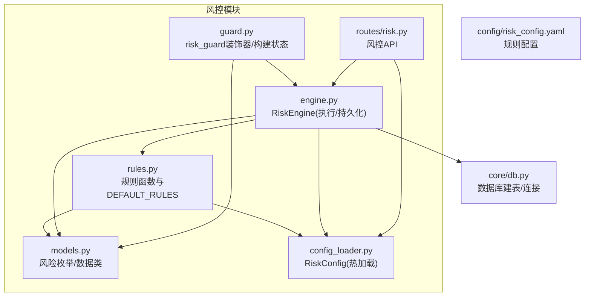
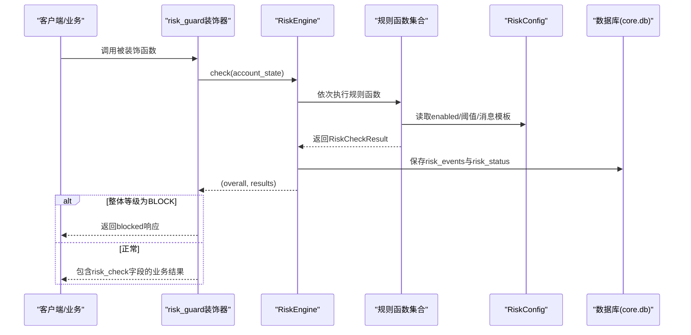
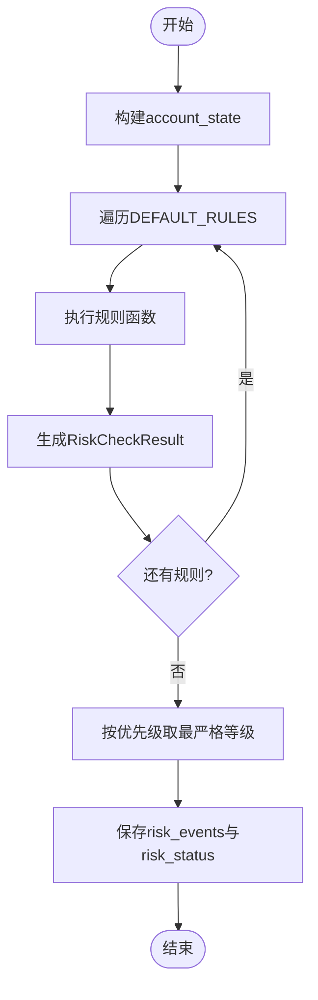
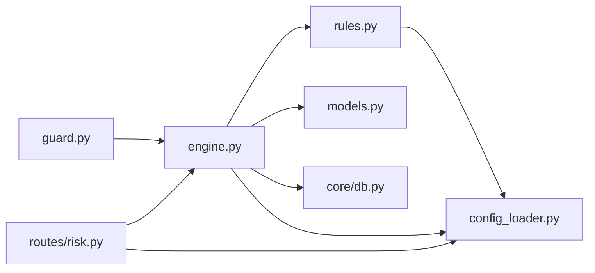

# 风控规则系统

<cite>
**本文引用的文件**
- [risk/__init__.py](file://risk/__init__.py)
- [risk/models.py](file://risk/models.py)
- [risk/engine.py](file://risk/engine.py)
- [risk/rules.py](file://risk/rules.py)
- [risk/config_loader.py](file://risk/config_loader.py)
- [risk/guard.py](file://risk/guard.py)
- [routes/risk.py](file://routes/risk.py)
- [config/risk_config.yaml](file://config/risk_config.yaml)
- [core/db.py](file://core/db.py)
</cite>

## 目录
1. [简介](#简介)
2. [项目结构](#项目结构)
3. [核心组件](#核心组件)
4. [架构总览](#架构总览)
5. [详细组件分析](#详细组件分析)
6. [依赖分析](#依赖分析)
7. [性能考量](#性能考量)
8. [故障排查指南](#故障排查指南)
9. [结论](#结论)
10. [附录](#附录)

## 简介
本文件为 AIQuant 风控规则系统的全面技术文档，聚焦于 DEFAULT_RULES 的定义与组织方式，解释各类风控规则的分类与作用机制，并深入说明内置规则的实现逻辑（如最大回撤、单/行业集中度、择时、连续亏损、日交易频率、波动率、总仓位、节假日提醒、黑名单等）。同时提供自定义风控规则的开发指南（规则函数签名、返回值格式、错误处理）、动态加载机制、规则优先级管理与组合策略，并给出规则配置示例与常见风控场景的设计模式。

## 项目结构
风控模块位于 risk/ 目录，围绕“规则函数 + 配置 + 引擎 + 守卫 + API”的分层组织：
- risk/models.py：定义风险等级、类别、检查结果与状态的数据模型
- risk/rules.py：内置规则集合 DEFAULT_RULES 与各规则函数
- risk/config_loader.py：YAML 风控配置加载器（支持热加载）
- risk/engine.py：风控引擎，负责执行规则、聚合结果、持久化
- risk/guard.py：运行时风控守卫（装饰器与直接检查），封装风控接入
- routes/risk.py：风控相关 API，提供状态查询、事件查询、手动检查、配置热加载、黑名单与豁免管理
- config/risk_config.yaml：规则配置文件，按规则名组织 enabled、阈值、消息模板与建议
- core/db.py：数据库建表与连接管理，包含 risk_events、risk_status、blacklist、risk_overrides 等表

图表来源
- [risk/models.py:11-78](file://risk/models.py#L11-L78)
- [risk/rules.py:14-387](file://risk/rules.py#L14-L387)
- [risk/config_loader.py:20-131](file://risk/config_loader.py#L20-L131)
- [risk/engine.py:13-168](file://risk/engine.py#L13-L168)
- [risk/guard.py:15-92](file://risk/guard.py#L15-L92)
- [routes/risk.py:19-298](file://routes/risk.py#L19-L298)
- [config/risk_config.yaml:1-170](file://config/risk_config.yaml#L1-L170)
- [core/db.py:358-414](file://core/db.py#L358-L414)

章节来源
- [risk/__init__.py:1-20](file://risk/__init__.py#L1-L20)
- [risk/models.py:11-78](file://risk/models.py#L11-L78)
- [risk/rules.py:14-387](file://risk/rules.py#L14-L387)
- [risk/config_loader.py:20-131](file://risk/config_loader.py#L20-L131)
- [risk/engine.py:13-168](file://risk/engine.py#L13-L168)
- [risk/guard.py:15-92](file://risk/guard.py#L15-L92)
- [routes/risk.py:19-298](file://routes/risk.py#L19-L298)
- [config/risk_config.yaml:1-170](file://config/risk_config.yaml#L1-L170)
- [core/db.py:358-414](file://core/db.py#L358-L414)

## 核心组件
- 风险等级与类别：PASS → WARNING → RESTRICT → BLOCK，用于规则结果分级
- 风控检查结果：包含等级、类别、规则名、消息、指标值、阈值、时间戳、建议
- 风控状态：账户快照，包含整体等级、活跃规则、回撤、持仓数量、总敞口、可用资金、最后检查时间、阻断原因
- 规则函数签名：rule_name(account_state: dict) -> RiskCheckResult
- DEFAULT_RULES：内置规则函数列表，引擎默认使用该列表执行全量检查
- 配置加载器：RiskConfig 单例，支持热加载、键路径访问、消息模板格式化、建议获取
- 风控引擎：执行规则、异常兜底、聚合最严格等级、持久化事件与状态
- 运行时守卫：装饰器包装业务流程，遇到 BLOCK 直接拦截；否则注入风控检查结果
- API 接口：状态查询、事件查询、手动检查、配置热加载、黑名单与豁免管理

章节来源
- [risk/models.py:11-78](file://risk/models.py#L11-L78)
- [risk/rules.py:14-387](file://risk/rules.py#L14-L387)
- [risk/config_loader.py:20-131](file://risk/config_loader.py#L20-L131)
- [risk/engine.py:19-168](file://risk/engine.py#L19-L168)
- [risk/guard.py:36-92](file://risk/guard.py#L36-L92)
- [routes/risk.py:31-298](file://routes/risk.py#L31-L298)

## 架构总览
风控系统采用“配置驱动 + 规则函数 + 引擎执行 + 守卫接入 + API 管理”的分层架构。规则函数从 RiskConfig 读取阈值与消息模板，RiskEngine 统一执行并持久化结果，risk_guard 将风控接入业务流程，Flask 路由提供运维与管理能力。

图表来源
- [risk/guard.py:36-74](file://risk/guard.py#L36-L74)
- [risk/engine.py:19-71](file://risk/engine.py#L19-L71)
- [risk/rules.py:34-387](file://risk/rules.py#L34-L387)
- [risk/config_loader.py:88-116](file://risk/config_loader.py#L88-L116)
- [core/db.py:358-414](file://core/db.py#L358-L414)

## 详细组件分析

### DEFAULT_RULES 的定义与组织
- DEFAULT_RULES 是一个规则函数列表，引擎默认使用该列表进行全量风控检查
- 规则函数均遵循统一签名：rule_name(account_state: dict) -> RiskCheckResult
- 规则函数内部通过 RiskConfig 读取 enabled、阈值、消息模板与建议
- 引擎对每个规则的异常进行捕获并生成 WARNING 级别兜底结果，保证鲁棒性

章节来源
- [risk/rules.py:376-387](file://risk/rules.py#L376-L387)
- [risk/engine.py:19-49](file://risk/engine.py#L19-L49)

### 风控规则分类与作用机制
- 分类维度：回撤、集中度（个股/行业）、波动率、择时、交易频率、冷却、黑名单、总仓位、市场时机
- 作用机制：规则函数根据 account_state 中的指标计算指标值并与阈值比较，输出对应等级与建议；引擎聚合最严格等级作为整体风控等级

章节来源
- [risk/models.py:18-26](file://risk/models.py#L18-L26)
- [risk/rules.py:34-387](file://risk/rules.py#L34-L387)

### 内置规则实现要点

#### 最大回撤规则
- 输入：current_drawdown
- 动态阈值：warning(5%) → restrict(10%) → block(15%)
- 结果：回撤正常/预警/限制/禁止

章节来源
- [risk/rules.py:34-62](file://risk/rules.py#L34-L62)
- [config/risk_config.yaml:10-25](file://config/risk_config.yaml#L10-L25)

#### 单股集中度规则
- 输入：positions、total_value
- 计算：个股市值/总资产占比，取最大者
- 动态阈值：warning(25%) → block(30%)

章节来源
- [risk/rules.py:68-100](file://risk/rules.py#L68-L100)
- [config/risk_config.yaml:29-41](file://config/risk_config.yaml#L29-L41)

#### 大盘择时规则（MA5/MA20）
- 输入：index_ma5、index_ma20
- 条件：MA5 < MA20 时限制整体仓位
- 动态阈值：通过消息模板格式化指标值

章节来源
- [risk/rules.py:106-130](file://risk/rules.py#L106-L130)
- [config/risk_config.yaml:45-59](file://config/risk_config.yaml#L45-L59)

#### 连续亏损冷却规则
- 输入：consecutive_losses
- 动态阈值：restrict(3次) → block(5次)

章节来源
- [risk/rules.py:136-159](file://risk/rules.py#L136-L159)
- [config/risk_config.yaml:63-75](file://config/risk_config.yaml#L63-L75)

#### 日交易频率限制规则
- 输入：daily_open_count
- 动态阈值：warning(3次) → block(5次)

章节来源
- [risk/rules.py:165-188](file://risk/rules.py#L165-L188)
- [config/risk_config.yaml:79-91](file://config/risk_config.yaml#L79-L91)

#### 个股波动率限制规则
- 输入：positions 中的 daily_change_pct
- 计算：取最大日涨跌幅
- 动态阈值：warning(5%) → block(7%)

章节来源
- [risk/rules.py:194-226](file://risk/rules.py#L194-L226)
- [config/risk_config.yaml:95-107](file://config/risk_config.yaml#L95-L107)

#### 行业集中度规则
- 输入：positions
- 计算：按 sector 汇总市值占比，取最大者
- 动态阈值：warning(35%) → block(40%)

章节来源
- [risk/rules.py:232-270](file://risk/rules.py#L232-L270)
- [config/risk_config.yaml:111-123](file://config/risk_config.yaml#L111-L123)

#### 总仓位限制规则
- 输入：total_value、available_capital
- 计算：total_value/(total_value+available) 为总仓位比例
- 动态阈值：warning(80%) → block(90%)

章节来源
- [risk/rules.py:276-304](file://risk/rules.py#L276-L304)
- [config/risk_config.yaml:127-139](file://config/risk_config.yaml#L127-L139)

#### 节假日/周末持仓提醒规则
- 输入：upcoming_holiday_days
- 阈值：threshold_days=3
- 结果：达到阈值时预警

章节来源
- [risk/rules.py:310-328](file://risk/rules.py#L310-L328)
- [config/risk_config.yaml:143-152](file://config/risk_config.yaml#L143-L152)

#### 黑名单检查规则
- 输入：positions、trade_target
- 动态来源：从 blacklist 表查询有效期内的黑名单
- 触发：命中黑名单即禁止

章节来源
- [risk/rules.py:334-370](file://risk/rules.py#L334-L370)
- [core/db.py:389-399](file://core/db.py#L389-L399)

### 风控引擎执行流程
- 执行顺序：按 DEFAULT_RULES 列表顺序执行
- 异常处理：任一规则抛出异常，生成 WARNING 级兜底结果
- 等级聚合：按 PASS < WARNING < RESTRICT < BLOCK 的优先级取最严格等级
- 持久化：写入 risk_events 与 risk_status，支持查询最近事件与最新状态

图表来源
- [risk/engine.py:19-71](file://risk/engine.py#L19-L71)
- [risk/rules.py:376-387](file://risk/rules.py#L376-L387)

章节来源
- [risk/engine.py:19-168](file://risk/engine.py#L19-L168)

### 运行时风控守卫
- 装饰器 risk_guard：对被装饰函数进行风控前置检查；若整体等级为 BLOCK，直接返回阻断响应；否则注入 risk_check 字段
- 直接检查 check_risk：返回风控检查结果字典，便于在任意流程中插入风控

章节来源
- [risk/guard.py:36-92](file://risk/guard.py#L36-L92)

### API 与运维能力
- 状态查询：获取最新风控状态
- 事件查询：按等级过滤最近风控事件
- 手动检查：传入 account_state 执行一次风控检查
- 配置管理：获取/热加载风控配置
- 黑名单管理：查询、添加、删除黑名单
- 豁免管理：申请、查询、审批豁免

章节来源
- [routes/risk.py:31-298](file://routes/risk.py#L31-L298)

## 依赖分析
- 模块内聚：rules 仅依赖 config_loader；engine 依赖 models、rules、config_loader；guard 依赖 engine；routes 依赖 engine、config_loader
- 外部依赖：SQLite 数据库（core/db.py 提供建表与连接），Flask（routes/risk.py）
- 配置耦合：所有规则阈值与消息模板来自 risk_config.yaml，RiskConfig 支持热加载

图表来源
- [risk/rules.py:10-11](file://risk/rules.py#L10-L11)
- [risk/engine.py:8-10](file://risk/engine.py#L8-L10)
- [risk/guard.py:11-12](file://risk/guard.py#L11-L12)
- [routes/risk.py:21-24](file://routes/risk.py#L21-L24)
- [core/db.py:358-414](file://core/db.py#L358-L414)

章节来源
- [risk/rules.py:10-11](file://risk/rules.py#L10-L11)
- [risk/engine.py:8-10](file://risk/engine.py#L8-L10)
- [risk/guard.py:11-12](file://risk/guard.py#L11-L12)
- [routes/risk.py:21-24](file://routes/risk.py#L21-L24)
- [core/db.py:358-414](file://core/db.py#L358-L414)

## 性能考量
- 规则执行：线性遍历 DEFAULT_RULES，复杂度 O(N)，N 为规则数量
- 配置访问：RiskConfig 使用内存缓存与文件 mtime 检测，热加载成本低
- 数据库写入：批量插入 risk_events 与 risk_status，使用 WAL 模式提升并发
- 建议：规则函数尽量避免重复 IO；对大数据量遍历（如行业集中度）可考虑缓存中间结果

[本节为通用性能讨论，不直接分析具体文件]

## 故障排查指南
- 配置未生效：确认 risk_config.yaml 存在且路径正确；通过 /api/risk/config/reload 触发热加载
- 规则异常：引擎对规则异常捕获并返回 WARNING 级兜底；可在 /api/risk/events 查看详细事件
- 数据库问题：核对 risk_events、risk_status、blacklist、risk_overrides 表是否存在；检查 core/db.py 初始化逻辑
- 黑名单无效：确认黑名单是否过期；检查 blacklist.expiry_date 与当前时间关系
- API 返回错误：检查 routes/risk.py 的请求参数与数据库连接状态

章节来源
- [risk/engine.py:73-167](file://risk/engine.py#L73-L167)
- [routes/risk.py:96-108](file://routes/risk.py#L96-L108)
- [core/db.py:358-414](file://core/db.py#L358-L414)

## 结论
AIQuant 风控规则系统以配置驱动为核心，通过统一的规则函数签名与 RiskConfig 热加载机制，实现了高扩展与易运维的风控框架。引擎负责规则执行、异常兜底与持久化，守卫与 API 提供了灵活的接入与管理手段。内置规则覆盖回撤、集中度、择时、波动率、交易频率、冷却、黑名单与总仓位等关键维度，满足多场景风控需求。

[本节为总结性内容，不直接分析具体文件]

## 附录

### 自定义风控规则开发指南
- 函数签名：rule_name(account_state: dict) -> RiskCheckResult
- 返回值：使用 _make_result 辅助函数构造，包含 level、category、rule_name、message、metric_value、threshold、timestamp、suggestion
- 错误处理：规则内部异常会被引擎捕获并返回 WARNING 级兜底结果
- 配置集成：在 risk_config.yaml 中新增规则配置（enabled、thresholds、messages、suggestions），并在 DEFAULT_RULES 中注册

章节来源
- [risk/rules.py:14-28](file://risk/rules.py#L14-L28)
- [risk/engine.py:26-39](file://risk/engine.py#L26-L39)
- [config/risk_config.yaml:1-170](file://config/risk_config.yaml#L1-L170)

### 规则优先级与组合策略
- 优先级：PASS < WARNING < RESTRICT < BLOCK，引擎取最严格等级
- 组合策略：多规则并行执行，最终等级为聚合结果；建议按“轻重缓急”顺序排列规则，确保严重风险优先暴露

章节来源
- [risk/engine.py:41-49](file://risk/engine.py#L41-L49)

### 规则配置示例与设计模式
- 示例：max_drawdown、single_stock_limit、market_timing、consecutive_loss、daily_trade_limit、volatility_limit、sector_concentration、total_position_limit、weekend_hold、blacklist
- 设计模式：
  - 阈值分层：warning → restrict → block，形成渐进式风控
  - 消息模板：通过 format 参数注入指标值，便于展示
  - 建议字段：为不同等级提供可执行建议
  - 黑名单：动态从数据库加载，支持有效期与移除

章节来源
- [config/risk_config.yaml:10-170](file://config/risk_config.yaml#L10-L170)
- [risk/rules.py:34-370](file://risk/rules.py#L34-L370)