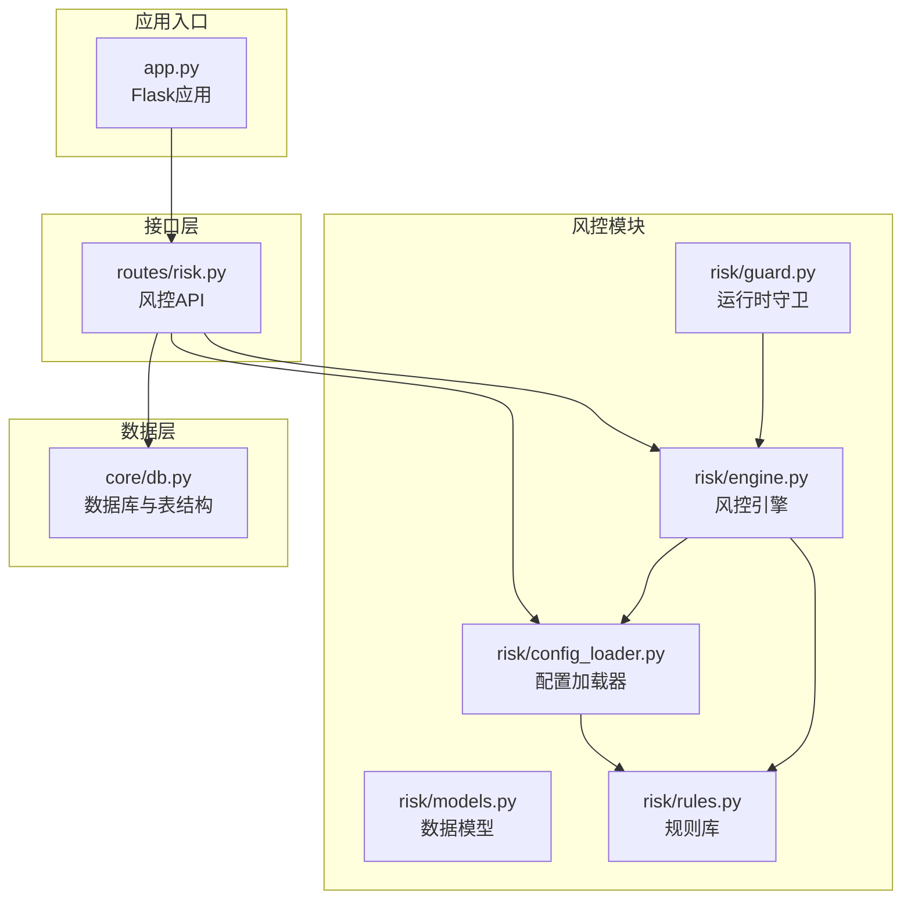
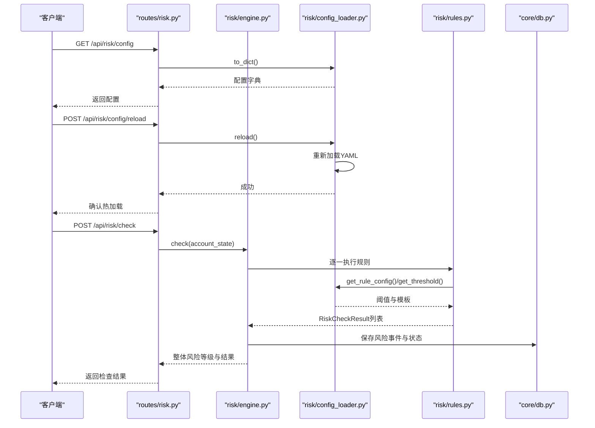
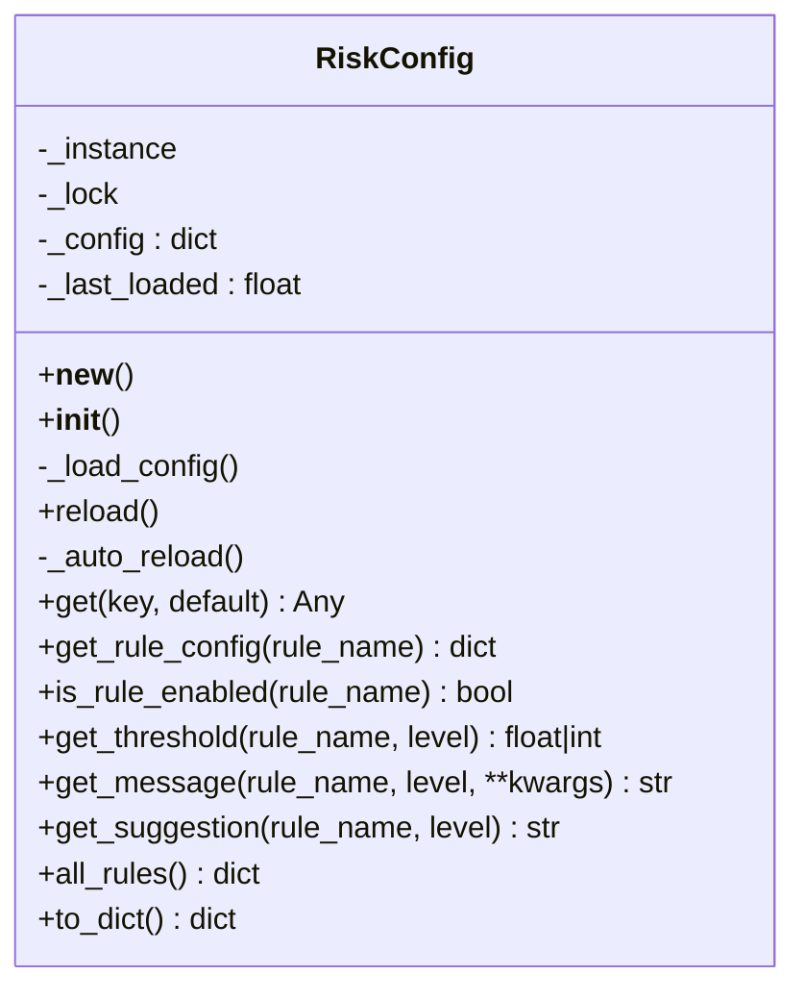
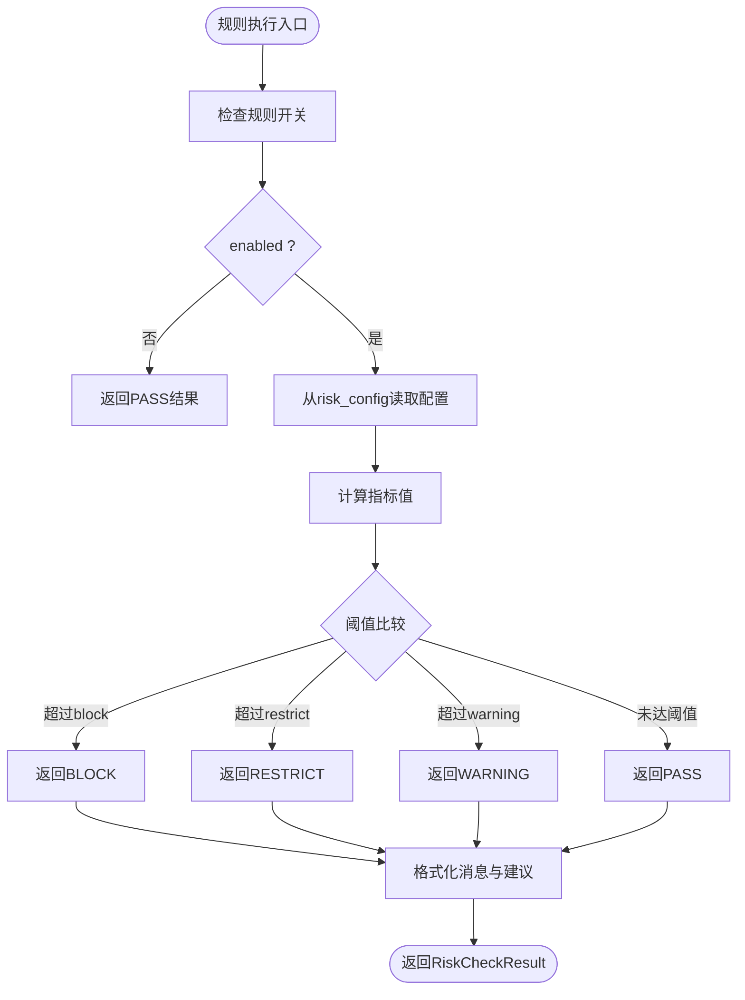
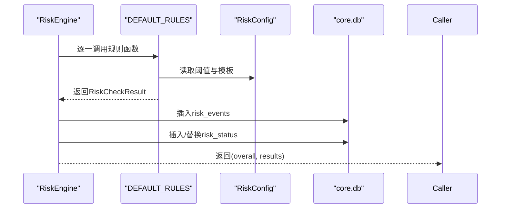
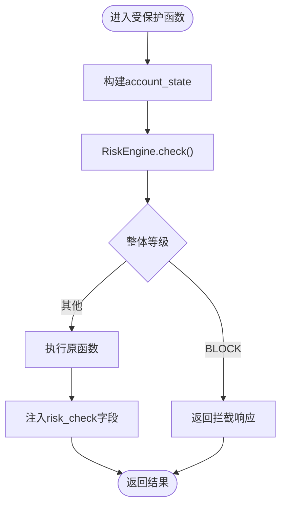
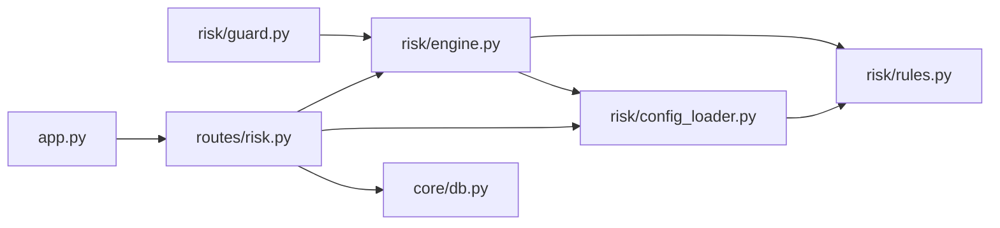

# 风控配置加载器

<cite>
**本文档引用的文件**
- [risk/config_loader.py](file://risk/config_loader.py)
- [risk/engine.py](file://risk/engine.py)
- [risk/guard.py](file://risk/guard.py)
- [risk/models.py](file://risk/models.py)
- [risk/rules.py](file://risk/rules.py)
- [routes/risk.py](file://routes/risk.py)
- [core/db.py](file://core/db.py)
- [app.py](file://app.py)
- [config/settings.py](file://config/settings.py)
</cite>

## 目录
1. [简介](#简介)
2. [项目结构](#项目结构)
3. [核心组件](#核心组件)
4. [架构概览](#架构概览)
5. [详细组件分析](#详细组件分析)
6. [依赖分析](#依赖分析)
7. [性能考虑](#性能考虑)
8. [故障排查指南](#故障排查指南)
9. [结论](#结论)
10. [附录](#附录)

## 简介
本文件面向AIQuant风控配置加载器，系统性阐述risk_config的加载机制、配置管理策略与运行时热更新能力。文档覆盖配置文件解析、默认值处理、阈值参数与监控选项的自定义方法，并提供生产与测试环境的配置策略、变更影响分析与回滚建议。读者可据此快速理解如何通过配置文件定制风控规则、调整阈值参数并安全地进行配置热更新。

## 项目结构
风控相关代码集中在risk目录，配合routes/risk.py对外提供REST API，核心数据持久化依赖core/db.py中的数据库表结构。

图表来源
- [risk/config_loader.py:1-131](file://risk/config_loader.py#L1-L131)
- [risk/engine.py:1-168](file://risk/engine.py#L1-L168)
- [risk/guard.py:1-92](file://risk/guard.py#L1-L92)
- [risk/models.py:1-78](file://risk/models.py#L1-L78)
- [risk/rules.py:1-388](file://risk/rules.py#L1-L388)
- [routes/risk.py:1-298](file://routes/risk.py#L1-L298)
- [core/db.py:358-414](file://core/db.py#L358-L414)
- [app.py:1-164](file://app.py#L1-L164)

章节来源
- [risk/config_loader.py:1-131](file://risk/config_loader.py#L1-L131)
- [routes/risk.py:1-298](file://routes/risk.py#L1-L298)
- [core/db.py:358-414](file://core/db.py#L358-L414)
- [app.py:1-164](file://app.py#L1-L164)

## 核心组件
- 配置加载器：负责从YAML文件加载、解析、缓存与热加载配置，提供键路径查询、规则启用状态与阈值获取等便捷方法。
- 规则库：内置多条风控规则，规则阈值与消息模板均来自risk_config，支持热加载。
- 风控引擎：聚合规则执行，计算整体风险等级，持久化检查结果与状态。
- 运行时守卫：装饰器与检查函数，将风控集成到业务流程中。
- 数据模型：定义风险等级、类别、检查结果与状态快照的数据结构。
- 路由API：提供配置查询、热加载、黑名单管理、豁免管理与风控状态查询等接口。

章节来源
- [risk/config_loader.py:20-131](file://risk/config_loader.py#L20-L131)
- [risk/rules.py:1-388](file://risk/rules.py#L1-L388)
- [risk/engine.py:13-168](file://risk/engine.py#L13-L168)
- [risk/guard.py:15-92](file://risk/guard.py#L15-L92)
- [risk/models.py:11-78](file://risk/models.py#L11-L78)
- [routes/risk.py:19-298](file://routes/risk.py#L19-L298)

## 架构概览
风控配置加载器采用“配置即规则”的设计：规则函数从risk_config读取阈值、消息模板与建议文本，从而实现规则与配置的解耦。配置文件变更通过自动检测与强制reload实现热更新，无需重启服务。

图表来源
- [routes/risk.py:86-108](file://routes/risk.py#L86-L108)
- [routes/risk.py:67-82](file://routes/risk.py#L67-L82)
- [risk/engine.py:19-71](file://risk/engine.py#L19-L71)
- [risk/config_loader.py:58-126](file://risk/config_loader.py#L58-L126)
- [risk/rules.py:34-61](file://risk/rules.py#L34-L61)

## 详细组件分析

### 配置加载器（RiskConfig）
- 单例模式：通过私有实例与锁保证线程安全与单例语义。
- 文件路径：固定位于config/risk_config.yaml，绝对路径基于risk目录上溯定位。
- 加载策略：
  - 首次初始化加载；随后通过_auto_reload在访问时检测文件修改时间，自动热加载。
  - reload()提供强制热加载入口。
- 键路径查询：支持“a.b.c”形式的点号路径，缺失键返回默认值。
- 规则配置访问：
  - is_rule_enabled(rule_name)：检查规则开关。
  - get_rule_config(rule_name)：返回规则完整配置字典。
  - get_threshold(rule_name, level)：获取指定等级阈值。
  - get_message/get_suggestion：模板消息与建议文本，支持占位符格式化。
- 导出与遍历：to_dict()导出完整配置；all_rules()返回所有规则配置（排除元数据）。

图表来源
- [risk/config_loader.py:20-131](file://risk/config_loader.py#L20-L131)

章节来源
- [risk/config_loader.py:14-131](file://risk/config_loader.py#L14-L131)

### 规则库（DEFAULT_RULES与规则函数）
- 规则函数签名：rule_name(account_state: dict) -> RiskCheckResult。
- 阈值来源：从risk_config读取，支持热加载。
- 规则类型与阈值层次：
  - enabled：布尔开关。
  - thresholds：包含不同等级阈值（如block、restrict、warning）。
  - messages：不同等级的消息模板，支持占位符格式化。
  - suggestions：不同等级的建议文本。
- 默认规则集合：DEFAULT_RULES包含10条规则，涵盖最大回撤、集中度、择时、连续亏损、日交易频率、波动率、行业集中度、总仓位、节假日提醒与黑名单检查。

图表来源
- [risk/rules.py:34-61](file://risk/rules.py#L34-L61)
- [risk/rules.py:68-99](file://risk/rules.py#L68-L99)
- [risk/rules.py:106-129](file://risk/rules.py#L106-L129)
- [risk/rules.py:136-158](file://risk/rules.py#L136-L158)
- [risk/rules.py:165-187](file://risk/rules.py#L165-L187)
- [risk/rules.py:194-225](file://risk/rules.py#L194-L225)
- [risk/rules.py:232-269](file://risk/rules.py#L232-L269)
- [risk/rules.py:276-303](file://risk/rules.py#L276-L303)
- [risk/rules.py:310-327](file://risk/rules.py#L310-L327)
- [risk/rules.py:334-369](file://risk/rules.py#L334-L369)

章节来源
- [risk/rules.py:1-388](file://risk/rules.py#L1-L388)

### 风控引擎（RiskEngine）
- 聚合检查：遍历DEFAULT_RULES，执行规则并收集结果。
- 等级合并：按等级优先级（BLOCK > RESTRICT > WARNING > PASS）取最严格等级。
- 持久化：将检查结果写入risk_events表，状态写入risk_status表。
- 查询接口：获取最新状态与最近事件，支持分页与过滤。

图表来源
- [risk/engine.py:19-71](file://risk/engine.py#L19-L71)
- [core/db.py:358-414](file://core/db.py#L358-L414)

章节来源
- [risk/engine.py:13-168](file://risk/engine.py#L13-L168)

### 运行时守卫（risk_guard与check_risk）
- 装饰器：@risk_guard(action="...")对被装饰函数进行风控前置检查，若整体等级为BLOCK则直接拦截，否则执行原函数并在返回字典中注入risk_check字段。
- 直接检查：check_risk(account_state, pipeline_id)返回标准化结果，包含overall_level、blocked、active_rules等。

图表来源
- [risk/guard.py:36-74](file://risk/guard.py#L36-L74)
- [risk/guard.py:77-92](file://risk/guard.py#L77-L92)

章节来源
- [risk/guard.py:15-92](file://risk/guard.py#L15-L92)

### 数据模型（RiskLevel、RiskCategory、RiskCheckResult、RiskStatus）
- RiskLevel：枚举等级（pass、warning、restrict、block）。
- RiskCategory：规则分类（drawdown、concentration、volatility、market_timing、position_limit、cooldown、blacklist）。
- RiskCheckResult：单条规则检查结果，包含等级、类别、规则名、消息、指标值、阈值、时间戳与建议。
- RiskStatus：账户实时风控状态快照，包含整体等级、活跃规则、回撤、持仓数、总敞口、可用资金、最后检查时间与阻断原因。

章节来源
- [risk/models.py:11-78](file://risk/models.py#L11-L78)

### 路由API（/api/risk/*）
- 配置管理：
  - GET /api/risk/config：返回当前配置与配置文件路径。
  - POST /api/risk/config/reload：热加载配置。
- 风控检查：
  - POST /api/risk/check：手动触发风控检查。
- 状态与事件：
  - GET /api/risk/status：获取最新风控状态。
  - GET /api/risk/events：获取最近风险事件（支持limit与level过滤）。
- 黑名单管理：
  - GET /api/risk/blacklist：获取有效黑名单列表。
  - POST /api/risk/blacklist：添加黑名单（支持默认有效期与原因校验）。
  - DELETE /api/risk/blacklist/<code>：移除黑名单。
- 豁免管理：
  - POST /api/risk/override：申请风控豁免（支持是否需要审批、最长时长等配置）。
  - GET /api/risk/overrides：获取有效豁免记录（支持status过滤）。
  - POST /api/risk/override/<id>/approve：审批通过豁免。
- 资产回撤：
  - GET /api/risk/drawdown：获取账户资产回撤曲线与统计指标。

章节来源
- [routes/risk.py:29-298](file://routes/risk.py#L29-L298)

## 依赖分析
- 配置加载器依赖：
  - YAML解析与文件系统（os、yaml、threading、time）。
  - 风控规则通过risk_config读取阈值与模板，形成规则与配置的弱耦合。
- 风控引擎依赖：
  - DEFAULT_RULES与RiskConfig。
  - 数据库连接与表结构（risk_events、risk_status、blacklist、risk_overrides）。
- 路由API依赖：
  - RiskEngine、RiskConfig、数据库操作。
  - Flask蓝图与请求参数解析。

图表来源
- [risk/config_loader.py:1-131](file://risk/config_loader.py#L1-L131)
- [risk/engine.py:1-168](file://risk/engine.py#L1-L168)
- [risk/guard.py:1-92](file://risk/guard.py#L1-L92)
- [routes/risk.py:1-298](file://routes/risk.py#L1-L298)
- [core/db.py:358-414](file://core/db.py#L358-L414)
- [app.py:1-164](file://app.py#L1-L164)

章节来源
- [risk/config_loader.py:1-131](file://risk/config_loader.py#L1-L131)
- [risk/engine.py:1-168](file://risk/engine.py#L1-L168)
- [routes/risk.py:1-298](file://routes/risk.py#L1-L298)
- [core/db.py:358-414](file://core/db.py#L358-L414)
- [app.py:1-164](file://app.py#L1-L164)

## 性能考虑
- 热加载成本：_auto_reload通过文件修改时间检测，避免频繁IO；reload()为显式入口，适合批量变更场景。
- 线程安全：单例与锁确保并发访问安全，避免竞态条件。
- 数据库写入：批量插入与事务回滚机制减少锁竞争；WAL模式与PRAGMA配置提升并发写入性能。
- 规则执行：规则函数独立且无全局状态，便于扩展与并行化（当前顺序执行，后续可引入并行策略）。

[本节为通用性能讨论，不直接分析具体文件]

## 故障排查指南
- 配置文件不存在或解析失败：
  - 现象：打印警告并使用空配置。
  - 排查：确认config/risk_config.yaml路径与权限；检查YAML语法。
- 热加载无效：
  - 现象：修改配置后规则阈值未变化。
  - 排查：确认文件修改时间更新；检查_getmtime调用；必要时调用POST /api/risk/config/reload。
- 规则未生效：
  - 现象：规则始终返回PASS。
  - 排查：检查规则enabled开关；核对thresholds配置；确认account_state字段齐全。
- 黑名单/豁免异常：
  - 现象：黑名单查询或豁免审批失败。
  - 排查：检查blacklist与risk_overrides表结构；确认数据库连接与SQL执行。
- API返回错误：
  - 现象：HTTP 500或JSON错误。
  - 排查：查看routes/risk.py中的异常捕获与返回；检查数据库状态与表结构。

章节来源
- [risk/config_loader.py:45-57](file://risk/config_loader.py#L45-L57)
- [routes/risk.py:106-107](file://routes/risk.py#L106-L107)
- [core/db.py:358-414](file://core/db.py#L358-L414)

## 结论
AIQuant风控配置加载器通过“配置即规则”的设计实现了规则与阈值的完全解耦，结合自动热加载与完善的API，使得风控策略可在不重启服务的情况下灵活调整。配合数据库持久化的风控事件与状态，系统具备良好的可观测性与可追溯性。建议在生产环境中采用“先测试后上线”的策略，利用API进行灰度发布与回滚。

[本节为总结性内容，不直接分析具体文件]

## 附录

### 配置文件格式规范与示例模板
- 文件位置：config/risk_config.yaml
- 结构要点：
  - 每个规则以规则名为顶级键，包含：
    - enabled：布尔开关。
    - thresholds：包含不同等级阈值（如block、restrict、warning）。
    - messages：不同等级的消息模板，支持占位符（如drawdown、ratio、stock等）。
    - suggestions：不同等级的建议文本。
  - 元数据键（可选）：version、last_modified等。
- 示例模板（结构示意，不含具体阈值）：
  - max_drawdown.enabled: true
  - max_drawdown.thresholds.block: 0.15
  - max_drawdown.thresholds.restrict: 0.10
  - max_drawdown.thresholds.warning: 0.05
  - max_drawdown.messages.block: "{drawdown:.2f}% 超过阻断阈值"
  - max_drawdown.suggestions.block: "立即平仓降低损失"
  - blacklist.default_expiry_days: 30
  - override.require_reason: true
  - override.require_approval: false
  - override.max_duration_hours: 4

[本节为通用规范说明，不直接分析具体文件]

### 生产环境与测试环境配置策略
- 生产环境：
  - 严格阈值：较低的阻断阈值，较高的限制阈值，确保稳健性。
  - 审批流程：开启豁免审批与较长有效期控制。
  - 监控告警：结合API定期查询状态与事件，建立告警机制。
- 测试环境：
  - 宽松阈值：较高阻断阈值，便于验证规则行为。
  - 禁用审批：关闭require_approval，便于快速验证。
  - 隔离数据：使用独立数据库或隔离账户ID，避免污染生产数据。

[本节为通用策略说明，不直接分析具体文件]

### 配置变更的影响分析与回滚机制
- 影响分析：
  - 阈值下调：可能触发更多限制或阻断，影响交易执行。
  - 规则禁用：对应规则不再参与检查，整体风险等级可能下降。
  - 消息模板变更：仅影响提示信息，不影响风控逻辑。
- 回滚机制：
  - 热加载：通过POST /api/risk/config/reload快速恢复上次成功加载的配置。
  - 版本控制：在配置文件中保留version字段，便于追踪变更。
  - 备份策略：定期备份config/risk_config.yaml，出现问题时快速恢复。

章节来源
- [routes/risk.py:86-108](file://routes/risk.py#L86-L108)
- [risk/config_loader.py:58-62](file://risk/config_loader.py#L58-L62)