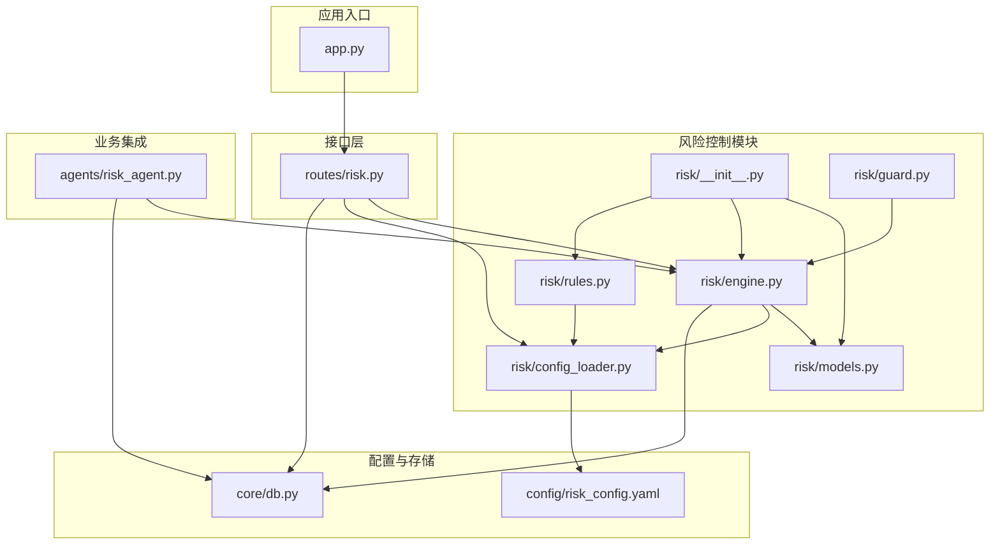
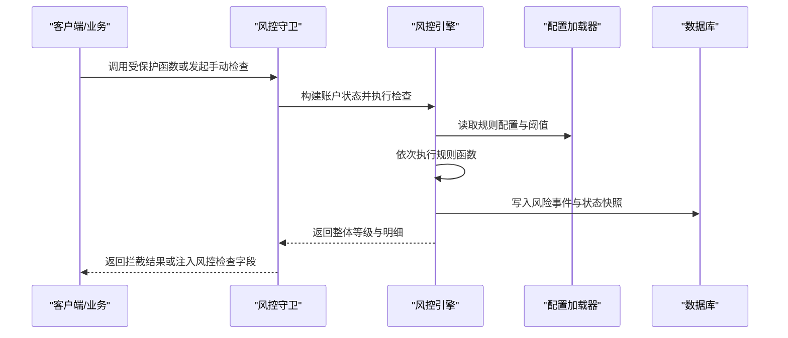
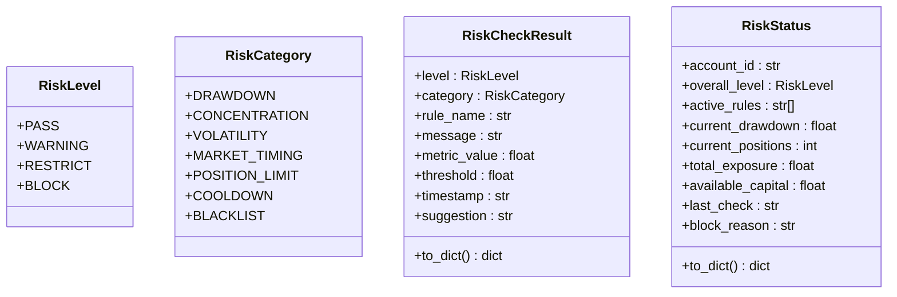
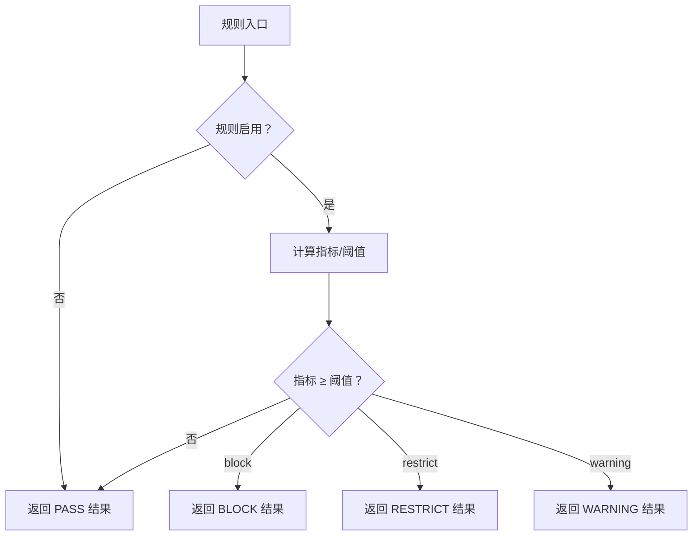
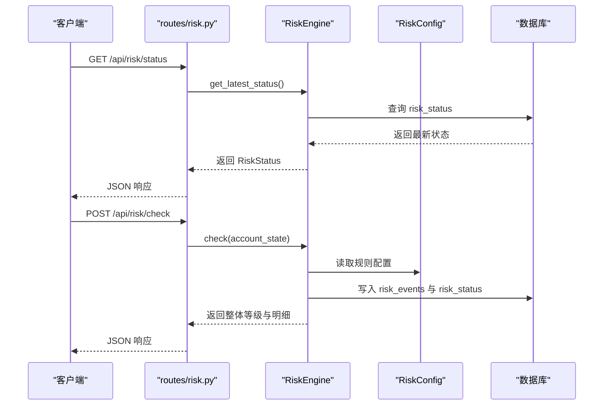
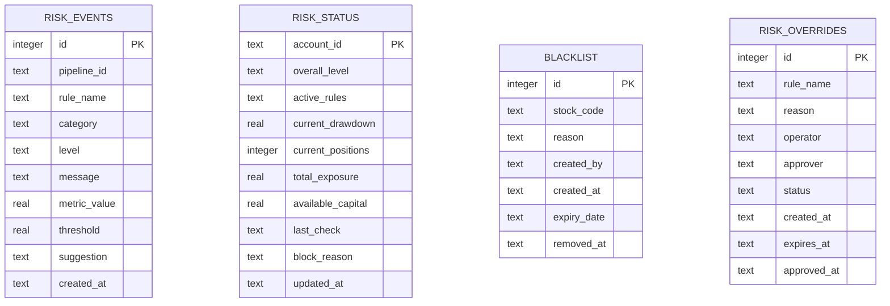
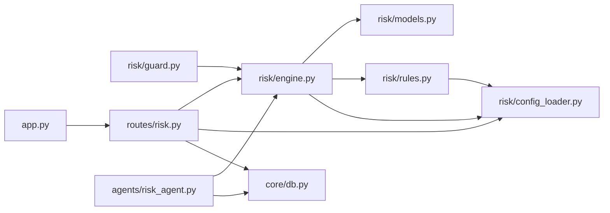

# 风险控制系统

<cite>
**本文引用的文件**
- [risk/__init__.py](file://risk/__init__.py)
- [risk/models.py](file://risk/models.py)
- [risk/engine.py](file://risk/engine.py)
- [risk/guard.py](file://risk/guard.py)
- [risk/rules.py](file://risk/rules.py)
- [risk/config_loader.py](file://risk/config_loader.py)
- [routes/risk.py](file://routes/risk.py)
- [config/risk_config.yaml](file://config/risk_config.yaml)
- [core/db.py](file://core/db.py)
- [agents/risk_agent.py](file://agents/risk_agent.py)
- [app.py](file://app.py)
</cite>

## 目录
1. [简介](#简介)
2. [项目结构](#项目结构)
3. [核心组件](#核心组件)
4. [架构总览](#架构总览)
5. [详细组件分析](#详细组件分析)
6. [依赖关系分析](#依赖关系分析)
7. [性能与扩展性](#性能与扩展性)
8. [故障排查指南](#故障排查指南)
9. [结论](#结论)
10. [附录](#附录)

## 简介
本文件为 AIQuant 风控系统的技术文档，覆盖风控架构设计、多层级风控规则定义、风控状态管理、风控引擎工作原理、风控守卫实现、规则动态加载机制、风控模型数据结构、风控事件记录与处理流程，并提供规则配置示例与自定义规则开发指南，以及实时监控、风险预警与异常处理策略，最后总结性能优化与扩展性设计。

## 项目结构
风险控制相关代码主要位于 risk/ 子模块，配合 routes/risk.py 提供 REST API，配置文件位于 config/risk_config.yaml，数据库表结构定义于 core/db.py，系统入口 app.py 注册风险蓝图，业务侧通过 agents/risk_agent.py 集成风控检查。

**图表来源**
- [risk/__init__.py:1-20](file://risk/__init__.py#L1-L20)
- [risk/models.py:1-78](file://risk/models.py#L1-L78)
- [risk/engine.py:1-168](file://risk/engine.py#L1-L168)
- [risk/guard.py:1-92](file://risk/guard.py#L1-L92)
- [risk/rules.py:1-388](file://risk/rules.py#L1-L388)
- [risk/config_loader.py:1-131](file://risk/config_loader.py#L1-L131)
- [routes/risk.py:1-298](file://routes/risk.py#L1-L298)
- [config/risk_config.yaml:1-170](file://config/risk_config.yaml#L1-L170)
- [core/db.py:358-414](file://core/db.py#L358-L414)
- [app.py:19-72](file://app.py#L19-L72)
- [agents/risk_agent.py:1-262](file://agents/risk_agent.py#L1-L262)

**章节来源**
- [risk/__init__.py:1-20](file://risk/__init__.py#L1-L20)
- [routes/risk.py:19-26](file://routes/risk.py#L19-L26)
- [app.py:19-72](file://app.py#L19-L72)

## 核心组件
- 风控模型与状态
  - 风险等级与分类、检查结果与状态快照等数据模型，用于统一表达规则检查结果与账户风控状态。
- 风控引擎
  - 负责执行规则集、聚合结果、持久化事件与状态、查询最新状态与事件。
- 风控规则库
  - 内置多条规则，按配置驱动阈值与消息模板，支持启用/禁用与热加载。
- 风控配置加载器
  - 支持 YAML 配置热加载，提供规则开关、阈值、消息模板与建议文本的统一访问。
- 风控守卫
  - 为业务函数提供装饰器式风控拦截与结果注入；亦可直接调用执行风控检查。
- 风控 API
  - 提供风控状态查询、事件查询、手动检查、配置查询与热加载、黑名单管理、风控豁免等接口。
- 数据库表
  - 定义 risk_events、risk_status、blacklist、risk_overrides 等表，支撑事件记录、状态快照与治理功能。

**章节来源**
- [risk/models.py:11-78](file://risk/models.py#L11-L78)
- [risk/engine.py:13-168](file://risk/engine.py#L13-L168)
- [risk/rules.py:14-388](file://risk/rules.py#L14-L388)
- [risk/config_loader.py:20-131](file://risk/config_loader.py#L20-L131)
- [risk/guard.py:15-92](file://risk/guard.py#L15-L92)
- [routes/risk.py:31-298](file://routes/risk.py#L31-L298)
- [core/db.py:358-414](file://core/db.py#L358-L414)

## 架构总览
风控系统采用“规则配置驱动 + 引擎执行 + 守卫拦截 + API 暴露”的分层架构。规则从配置中心读取，引擎负责执行与持久化，守卫在业务流程中进行拦截与结果注入，API 提供运维与治理能力，数据库承载事件与状态。

**图表来源**
- [risk/guard.py:36-74](file://risk/guard.py#L36-L74)
- [risk/engine.py:19-71](file://risk/engine.py#L19-L71)
- [risk/config_loader.py:88-116](file://risk/config_loader.py#L88-L116)
- [core/db.py:358-414](file://core/db.py#L358-L414)

## 详细组件分析

### 风控模型与状态
- 风险等级：PASS → WARNING → RESTRICT → BLOCK
- 风险分类：回撤、集中度、波动率、择时、仓位限制、冷却、黑名单等
- 检查结果：包含等级、分类、规则名、消息、指标值、阈值、时间戳、建议
- 状态快照：账户 ID、整体等级、活跃规则、当前回撤、持仓数、总敞口、可用资金、最后检查时间、阻断原因

**图表来源**
- [risk/models.py:11-78](file://risk/models.py#L11-L78)

**章节来源**
- [risk/models.py:11-78](file://risk/models.py#L11-L78)

### 风控引擎
- 执行流程
  - 遍历规则列表，逐一执行规则函数，捕获异常并记录警告级别结果
  - 使用优先级映射取最严格等级作为整体等级
  - 将检查结果与账户状态封装为状态快照，持久化到 risk_events 与 risk_status
- 查询接口
  - 获取最新状态、最近事件，便于监控与审计

**图表来源**
- [risk/engine.py:19-71](file://risk/engine.py#L19-L71)
- [core/db.py:358-414](file://core/db.py#L358-L414)

**章节来源**
- [risk/engine.py:19-168](file://risk/engine.py#L19-L168)
- [core/db.py:358-414](file://core/db.py#L358-L414)

### 风控规则库
- 规则清单
  - 最大回撤、单股集中度、大盘择时(MA5/MA20)、连续亏损冷却、日交易频率、个股波动率、行业集中度、总仓位限制、节假日持仓提醒、黑名单检查
- 配置驱动
  - 通过 risk_config.yaml 的 enabled、thresholds、messages、suggestions 控制行为
  - 规则函数签名统一，返回 RiskCheckResult
- 动态加载
  - 通过 DEFAULT_RULES 列表注册，支持热加载配置后即时生效

**图表来源**
- [risk/rules.py:34-61](file://risk/rules.py#L34-L61)
- [risk/rules.py:68-99](file://risk/rules.py#L68-L99)
- [risk/rules.py:106-129](file://risk/rules.py#L106-L129)
- [risk/rules.py:136-158](file://risk/rules.py#L136-L158)
- [risk/rules.py:165-187](file://risk/rules.py#L165-L187)
- [risk/rules.py:194-225](file://risk/rules.py#L194-L225)
- [risk/rules.py:232-269](file://risk/rules.py#L232-L269)
- [risk/rules.py:276-303](file://risk/rules.py#L276-L303)
- [risk/rules.py:310-327](file://risk/rules.py#L310-L327)
- [risk/rules.py:334-369](file://risk/rules.py#L334-L369)

**章节来源**
- [risk/rules.py:14-388](file://risk/rules.py#L14-L388)
- [config/risk_config.yaml:1-170](file://config/risk_config.yaml#L1-L170)

### 风控配置加载器
- 单例模式，支持自动热加载与强制重载
- 提供 get_rule_config、is_rule_enabled、get_threshold、get_message、get_suggestion 等便捷方法
- 通过点号路径访问嵌套配置，支持模板字符串格式化消息

**章节来源**
- [risk/config_loader.py:20-131](file://risk/config_loader.py#L20-L131)

### 风控守卫
- 装饰器式拦截
  - 对被装饰函数进行风控检查，若整体等级为 BLOCK，则直接返回拦截结果
  - 否则执行原函数并将风控检查结果注入返回字典
- 直接检查
  - 提供 check_risk(account_state, pipeline_id) 直接返回风控结果字典

**章节来源**
- [risk/guard.py:36-92](file://risk/guard.py#L36-L92)

### 风控 API
- 基础接口
  - 获取当前风控状态、最近风控事件、手动触发风控检查
- 配置管理
  - 获取风控配置、热加载配置
- 黑名单管理
  - 查询、添加、删除黑名单
- 风控豁免
  - 申请豁免、查询豁免记录、审批豁免

**图表来源**
- [routes/risk.py:31-82](file://routes/risk.py#L31-L82)
- [risk/engine.py:129-167](file://risk/engine.py#L129-L167)
- [risk/config_loader.py:88-116](file://risk/config_loader.py#L88-L116)
- [core/db.py:358-414](file://core/db.py#L358-L414)

**章节来源**
- [routes/risk.py:31-298](file://routes/risk.py#L31-L298)

### 数据模型与数据库
- 风控事件表 risk_events：记录每次规则检查的明细
- 风控状态表 risk_status：账户级状态快照
- 黑名单表 blacklist：黑名单股票及其有效期
- 风控豁免表 risk_overrides：豁免申请与审批状态

**图表来源**
- [core/db.py:358-414](file://core/db.py#L358-L414)

**章节来源**
- [core/db.py:358-414](file://core/db.py#L358-L414)

### 业务集成：RiskAgent
- 在多 Agent 流水线中，RiskAgent 负责构建账户状态并调用 RiskEngine 执行风控检查
- 将风控状态写入上下文，若整体等级为 BLOCK，则标记拦截，供 Orchestrator 拦截后续流程

**章节来源**
- [agents/risk_agent.py:31-96](file://agents/risk_agent.py#L31-L96)

## 依赖关系分析
- 模块内聚与耦合
  - risk/engine.py 依赖 models、rules、config_loader，负责执行与持久化
  - risk/guard.py 依赖 engine 与 models，提供拦截与注入
  - risk/rules.py 依赖 config_loader，规则函数统一签名
  - routes/risk.py 依赖 engine、config_loader，提供 API
  - agents/risk_agent.py 依赖 engine，集成到业务流程
- 外部依赖
  - core/db.py 提供数据库连接与表结构
  - app.py 注册蓝图，统一对外暴露 API

**图表来源**
- [risk/guard.py:11-12](file://risk/guard.py#L11-L12)
- [risk/engine.py:8-10](file://risk/engine.py#L8-L10)
- [risk/rules.py:10-11](file://risk/rules.py#L10-L11)
- [routes/risk.py:21-24](file://routes/risk.py#L21-L24)
- [agents/risk_agent.py:21-22](file://agents/risk_agent.py#L21-L22)
- [app.py:19-72](file://app.py#L19-L72)

**章节来源**
- [risk/engine.py:13-168](file://risk/engine.py#L13-L168)
- [risk/guard.py:36-74](file://risk/guard.py#L36-L74)
- [routes/risk.py:29-108](file://routes/risk.py#L29-L108)
- [agents/risk_agent.py:52-66](file://agents/risk_agent.py#L52-L66)

## 性能与扩展性
- 性能特性
  - 规则执行为 O(N_rules) 线性扫描，单次检查成本低
  - 配置热加载采用文件时间戳检测，避免频繁 IO
  - 数据库写入使用批量插入与索引优化，查询最近事件与状态具备索引支持
- 扩展性设计
  - 规则函数签名统一，新增规则只需遵循规则函数规范并加入 DEFAULT_RULES
  - 配置驱动，无需修改代码即可调整阈值与消息
  - API 层独立，便于横向扩展与治理功能增强

[本节为通用性能讨论，不直接分析具体文件]

## 故障排查指南
- 配置热加载失败
  - 检查配置文件路径与权限，确认文件存在且可读
  - 查看控制台输出的加载提示与异常信息
- 风控事件未入库
  - 检查数据库连接与表结构是否存在
  - 关注引擎持久化过程中的异常打印
- 风控拦截误判
  - 核对 risk_config.yaml 中对应规则的 enabled 与 thresholds
  - 通过手动检查接口验证规则执行结果
- 黑名单/豁免异常
  - 确认 blacklist 与 risk_overrides 表的有效期与状态字段
  - 通过 API 查询黑名单与豁免记录核对

**章节来源**
- [risk/config_loader.py:58-72](file://risk/config_loader.py#L58-L72)
- [risk/engine.py:73-127](file://risk/engine.py#L73-L127)
- [routes/risk.py:112-167](file://routes/risk.py#L112-L167)
- [routes/risk.py:172-225](file://routes/risk.py#L172-L225)

## 结论
AIQuant 风控系统以配置驱动为核心，结合引擎执行、守卫拦截与 API 暴露，形成可演进、可治理、可观测的风险控制体系。通过规则库与配置中心的解耦，系统实现了快速迭代与热更新；通过数据库事件与状态表，提供了完善的审计与监控基础。建议在生产环境中持续完善规则阈值与消息模板，强化异常监控与告警联动，进一步提升系统的稳定性与可维护性。

[本节为总结性内容，不直接分析具体文件]

## 附录

### 风控规则配置示例
- 配置文件位置：config/risk_config.yaml
- 示例要点
  - 启用/禁用：enabled 字段控制规则开关
  - 阈值：thresholds 下的 warning、restrict、block 分级阈值
  - 消息模板：messages 下按等级提供格式化模板
  - 建议文本：suggestions 下按等级提供处置建议
- 热加载
  - 修改配置文件后无需重启，RiskConfig 自动检测并热加载

**章节来源**
- [config/risk_config.yaml:1-170](file://config/risk_config.yaml#L1-L170)
- [risk/config_loader.py:58-116](file://risk/config_loader.py#L58-L116)

### 自定义风控规则开发指南
- 步骤
  - 新建规则函数，遵循统一签名：rule_name(account_state: dict) -> RiskCheckResult
  - 在规则函数内部读取 risk_config，构造 _make_result 并返回
  - 将新规则函数加入 DEFAULT_RULES 列表
  - 在 risk_config.yaml 中新增规则配置项（enabled、thresholds、messages、suggestions）
- 注意事项
  - 保持规则函数幂等与无副作用
  - 使用 account_state 传递所需指标，避免硬编码
  - 为不同等级提供清晰的消息与建议，便于运营与用户理解

**章节来源**
- [risk/rules.py:14-27](file://risk/rules.py#L14-L27)
- [risk/rules.py:376-387](file://risk/rules.py#L376-L387)
- [risk/config_loader.py:88-116](file://risk/config_loader.py#L88-L116)

### 实时监控与风险预警
- 实时监控
  - 通过 /api/risk/status 获取最新风控状态
  - 通过 /api/risk/events 查询最近风险事件，支持按等级过滤
- 风险预警
  - 规则按等级返回 WARNING/RESTRICT/BLOCK，系统据此进行处置
  - 建议在前端仪表板展示状态与事件，结合回撤曲线进行可视化

**章节来源**
- [routes/risk.py:31-82](file://routes/risk.py#L31-L82)
- [routes/risk.py:246-298](file://routes/risk.py#L246-L298)

### 异常处理策略
- 规则执行异常
  - 引擎捕获异常并记录 WARNING 级别结果，保证系统稳健性
- 数据持久化异常
  - 引擎捕获异常并打印日志，不影响业务主流程
- 配置加载异常
  - 配置加载器捕获异常并回退默认配置，避免服务中断

**章节来源**
- [risk/engine.py:29-38](file://risk/engine.py#L29-L38)
- [risk/engine.py:98-99](file://risk/engine.py#L98-L99)
- [risk/engine.py:126-127](file://risk/engine.py#L126-L127)
- [risk/config_loader.py:52-57](file://risk/config_loader.py#L52-L57)