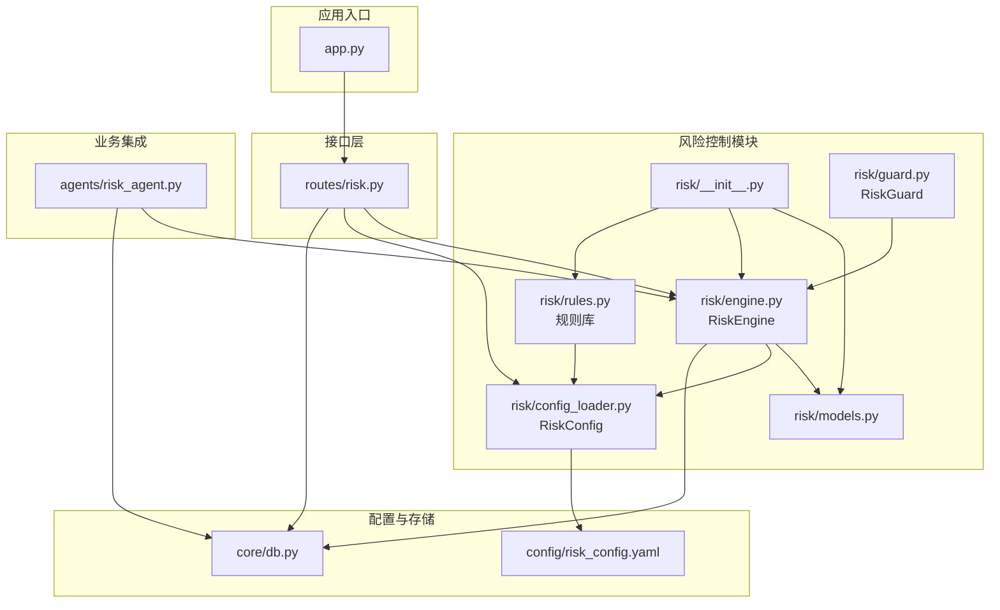
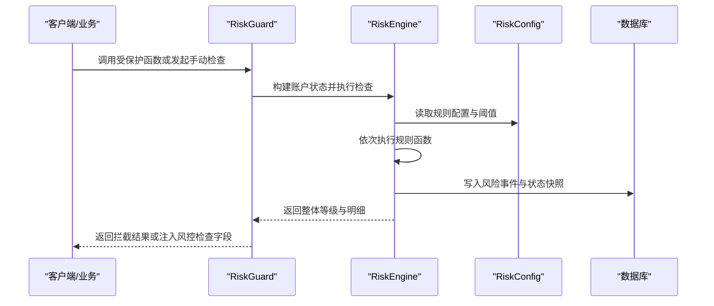
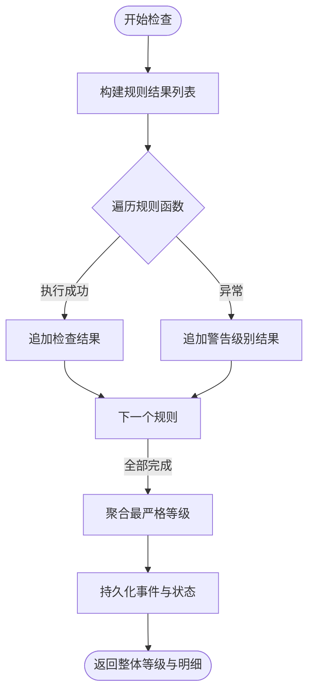
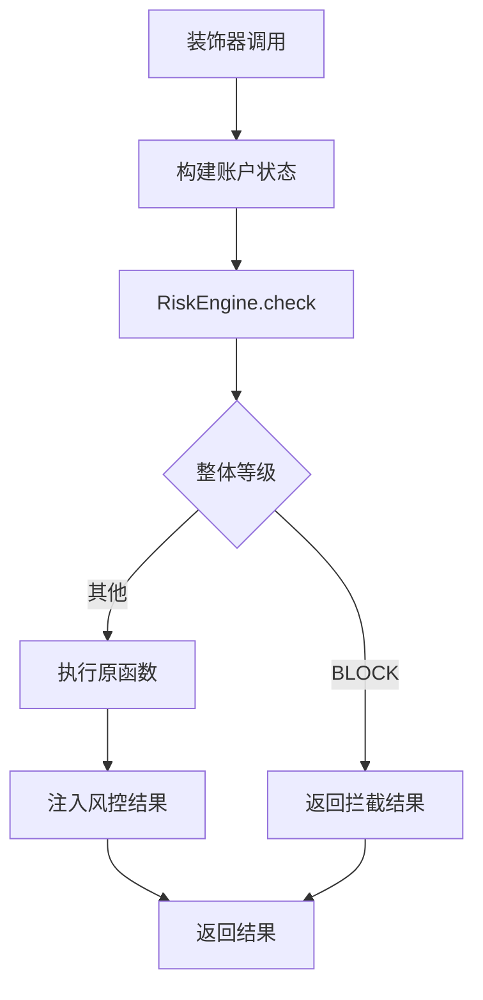
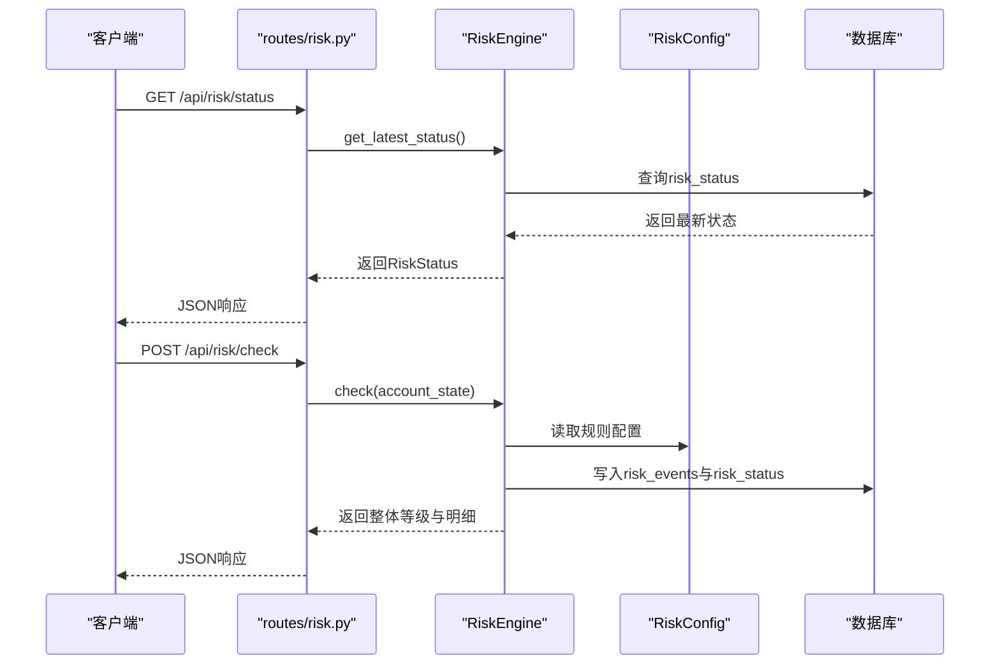
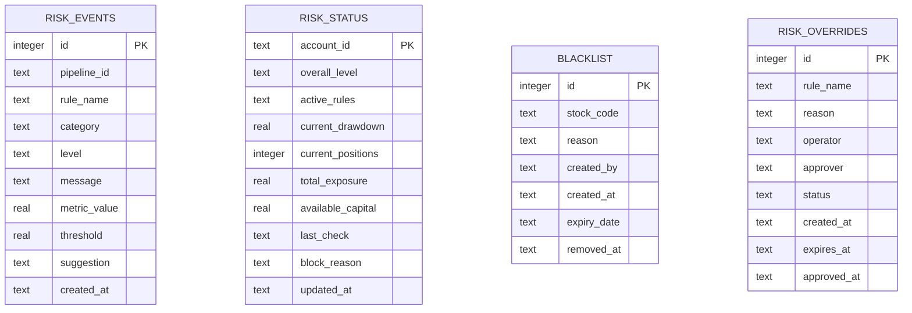
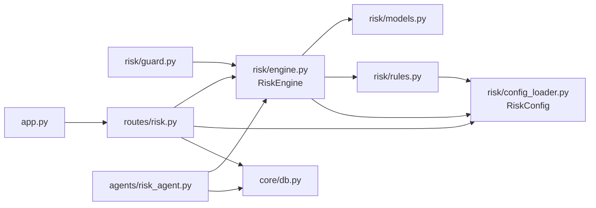

# 风险控制系统

<cite>
**本文引用的文件**
- [risk/__init__.py](file://risk/__init__.py)
- [risk/models.py](file://risk/models.py)
- [risk/engine.py](file://risk/engine.py)
- [risk/guard.py](file://risk/guard.py)
- [risk/rules.py](file://risk/rules.py)
- [risk/config_loader.py](file://risk/config_loader.py)
- [routes/risk.py](file://routes/risk.py)
- [config/risk_config.yaml](file://config/risk_config.yaml)
- [core/db.py](file://core/db.py)
- [agents/risk_agent.py](file://agents/risk_agent.py)
- [app.py](file://app.py)
</cite>

## 更新摘要
**变更内容**
- 新增RiskEngine核心引擎类，提供完整的风控检查和状态管理功能
- 新增RiskGuard装饰器，实现运行时风控拦截和结果注入
- 新增RiskConfig配置加载器，支持YAML配置热加载和实时更新
- 扩展风控规则库，新增6个新的风控规则（波动率限制、行业集中度、总仓位限制、节假日提醒、黑名单检查、连续亏损冷却）
- 增强API接口，提供完整的风控状态查询、事件管理、配置热加载等功能
- 优化业务集成，RiskAgent与系统化风控深度集成

## 目录
1. [简介](#简介)
2. [项目结构](#项目结构)
3. [核心组件](#核心组件)
4. [架构总览](#架构总览)
5. [详细组件分析](#详细组件分析)
6. [依赖关系分析](#依赖关系分析)
7. [性能与扩展性](#性能与扩展性)
8. [故障排查指南](#故障排查指南)
9. [结论](#结论)
10. [附录](#附录)

## 简介
本文件为 AIQuant 风控系统的技术文档，覆盖风险控制系统架构设计、多层级风控规则定义、风控状态管理、RiskEngine核心引擎工作原理、RiskGuard实时风控拦截机制、RiskConfig配置热加载、风控模型数据结构、风控事件记录与处理流程，并提供规则配置示例与自定义规则开发指南，以及实时监控、风险预警与异常处理策略，最后总结性能优化与扩展性设计。

## 项目结构
风险控制相关代码主要位于 risk/ 子模块，配合 routes/risk.py 提供 REST API，配置文件位于 config/risk_config.yaml，数据库表结构定义于 core/db.py，系统入口 app.py 注册风险蓝图，业务侧通过 agents/risk_agent.py 集成风控检查。

**图表来源**
- [risk/__init__.py:1-20](file://risk/__init__.py#L1-L20)
- [risk/engine.py:13-168](file://risk/engine.py#L13-L168)
- [risk/guard.py:36-92](file://risk/guard.py#L36-L92)
- [risk/config_loader.py:20-131](file://risk/config_loader.py#L20-L131)
- [routes/risk.py:19-298](file://routes/risk.py#L19-L298)
- [agents/risk_agent.py:25-262](file://agents/risk_agent.py#L25-L262)

## 核心组件
- **RiskEngine核心引擎**
  - 负责执行规则集、聚合结果、持久化事件与状态、查询最新状态与事件
  - 提供check、check_and_record、get_latest_status、get_recent_events等核心方法
- **RiskGuard实时风控守卫**
  - 为业务函数提供装饰器式风控拦截与结果注入
  - 支持直接调用check_risk执行风控检查
  - 自动构建账户状态并进行风控拦截
- **RiskConfig配置加载器**
  - 支持YAML配置热加载，提供规则开关、阈值、消息模板与建议文本的统一访问
  - 单例模式，支持自动检测文件修改并热加载
- **风控规则库**
  - 内置10条规则，包括最大回撤、单股集中度、大盘择时、连续亏损、日交易频率等
  - 新增6个规则：个股波动率限制、行业集中度、总仓位限制、节假日提醒、黑名单检查、连续亏损冷却
  - 支持启用/禁用与热加载
- **风控模型与状态**
  - 风险等级与分类、检查结果与状态快照等数据模型
  - 统一表达规则检查结果与账户风控状态
- **风控API接口**
  - 提供风控状态查询、事件查询、手动检查、配置查询与热加载、黑名单管理、风控豁免等接口
- **数据库表结构**
  - 定义risk_events、risk_status、blacklist、risk_overrides等表，支撑事件记录、状态快照与治理功能

**章节来源**
- [risk/engine.py:13-168](file://risk/engine.py#L13-L168)
- [risk/guard.py:36-92](file://risk/guard.py#L36-L92)
- [risk/config_loader.py:20-131](file://risk/config_loader.py#L20-L131)
- [risk/models.py:11-78](file://risk/models.py#L11-L78)
- [routes/risk.py:31-298](file://routes/risk.py#L31-L298)
- [core/db.py:358-414](file://core/db.py#L358-L414)

## 架构总览
风控系统采用"规则配置驱动 + RiskEngine执行 + RiskGuard拦截 + API暴露"的分层架构。RiskConfig配置加载器提供配置中心，RiskEngine负责执行与持久化，RiskGuard在业务流程中进行拦截与结果注入，API提供运维与治理能力，数据库承载事件与状态。

**图表来源**
- [risk/guard.py:36-92](file://risk/guard.py#L36-L92)
- [risk/engine.py:19-71](file://risk/engine.py#L19-L71)
- [risk/config_loader.py:58-116](file://risk/config_loader.py#L58-L116)
- [core/db.py:358-414](file://core/db.py#L358-L414)

## 详细组件分析

### RiskEngine核心引擎
- **执行流程**
  - 遍历规则列表，逐一执行规则函数，捕获异常并记录警告级别结果
  - 使用优先级映射取最严格等级作为整体等级
  - 将检查结果与账户状态封装为状态快照，持久化到risk_events与risk_status
- **核心方法**
  - check：执行风控检查，返回整体等级和详细结果
  - check_and_record：执行检查并记录到数据库
  - get_latest_status：查询最新风控状态
  - get_recent_events：查询最近风险事件
- **数据库持久化**
  - _save_results：保存风控检查结果到risk_events表
  - _save_status：保存当前风控状态到risk_status表

**图表来源**
- [risk/engine.py:19-71](file://risk/engine.py#L19-L71)
- [risk/engine.py:73-127](file://risk/engine.py#L73-L127)
- [core/db.py:358-414](file://core/db.py#L358-L414)

**章节来源**
- [risk/engine.py:13-168](file://risk/engine.py#L13-L168)
- [core/db.py:358-414](file://core/db.py#L358-L414)

### RiskGuard实时风控守卫
- **装饰器式拦截**
  - 对被装饰函数进行风控检查，若整体等级为BLOCK，则直接返回拦截结果
  - 否则执行原函数并将风控检查结果注入返回字典
  - 支持action参数配置不同的拦截策略
- **直接检查**
  - 提供check_risk(account_state, pipeline_id)直接返回风控结果字典
  - 自动构建账户状态并执行风控检查
- **账户状态构建**
  - build_account_state函数从各模块收集账户状态
  - 包括账户ID、当前回撤、持仓、总价值、总敞口、可用资金等关键指标

**图表来源**
- [risk/guard.py:36-92](file://risk/guard.py#L36-L92)
- [risk/guard.py:15-33](file://risk/guard.py#L15-L33)

**章节来源**
- [risk/guard.py:36-92](file://risk/guard.py#L36-L92)

### RiskConfig配置加载器
- **单例模式设计**
  - 支持自动热加载与强制重载
  - 线程安全的配置访问机制
  - 单例实例确保全局配置一致性
- **配置访问方法**
  - get_rule_config：获取指定规则的完整配置
  - is_rule_enabled：检查规则是否启用
  - get_threshold：获取指定规则的阈值
  - get_message：获取格式化后的消息模板
  - get_suggestion：获取建议文本
- **热加载机制**
  - 自动检测文件修改时间戳
  - 支持点号路径访问嵌套配置
  - 模板字符串格式化消息

**章节来源**
- [risk/config_loader.py:20-131](file://risk/config_loader.py#L20-L131)

### 扩展风控规则库
- **规则清单**
  - **基础规则**：最大回撤、单股集中度、大盘择时(MA5/MA20)、连续亏损、日交易频率
  - **新增规则**：个股波动率限制、行业集中度、总仓位限制、节假日提醒、黑名单检查、连续亏损冷却
- **配置驱动**
  - 通过risk_config.yaml的enabled、thresholds、messages、suggestions控制行为
  - 规则函数签名统一，返回RiskCheckResult
- **动态加载**
  - 通过DEFAULT_RULES列表注册，支持热加载配置后即时生效
  - 每个规则都支持启用/禁用和阈值配置

**图表来源**
- [risk/rules.py:34-61](file://risk/rules.py#L34-L61)
- [risk/rules.py:194-225](file://risk/rules.py#L194-L225)
- [risk/rules.py:232-269](file://risk/rules.py#L232-L269)
- [risk/rules.py:276-303](file://risk/rules.py#L276-L303)
- [risk/rules.py:310-327](file://risk/rules.py#L310-L327)
- [risk/rules.py:334-369](file://risk/rules.py#L334-L369)

**章节来源**
- [risk/rules.py:14-388](file://risk/rules.py#L14-L388)
- [config/risk_config.yaml:1-170](file://config/risk_config.yaml#L1-L170)

### 风控API接口
- **基础接口**
  - GET /api/risk/status：获取当前风控状态
  - GET /api/risk/events：获取最近风控事件
  - POST /api/risk/check：手动触发风控检查
- **配置管理**
  - GET /api/risk/config：获取风控配置
  - POST /api/risk/config/reload：热加载配置
- **黑名单管理**
  - GET /api/risk/blacklist：查询黑名单列表
  - POST /api/risk/blacklist：添加黑名单
  - DELETE /api/risk/blacklist/<code>：移除黑名单
- **风控豁免**
  - POST /api/risk/override：申请风控豁免
  - GET /api/risk/overrides：查询豁免记录
  - POST /api/risk/override/<id>/approve：审批豁免申请

**图表来源**
- [routes/risk.py:31-82](file://routes/risk.py#L31-L82)
- [routes/risk.py:67-81](file://routes/risk.py#L67-L81)
- [risk/engine.py:129-167](file://risk/engine.py#L129-L167)
- [risk/config_loader.py:88-116](file://risk/config_loader.py#L88-L116)
- [core/db.py:358-414](file://core/db.py#L358-L414)

**章节来源**
- [routes/risk.py:31-298](file://routes/risk.py#L31-L298)

### 数据模型与数据库
- **风控事件表 risk_events**：记录每次规则检查的明细
  - 包含pipeline_id、rule_name、category、level、message、metric_value、threshold、suggestion、created_at
  - 支持按时间、等级查询的索引优化
- **风控状态表 risk_status**：账户级状态快照
  - 包含account_id、overall_level、active_rules、current_drawdown、current_positions、total_exposure、available_capital、last_check、block_reason
  - 主键为account_id，支持状态快照
- **黑名单表 blacklist**：黑名单股票及其有效期
  - 包含stock_code、reason、created_by、created_at、expiry_date、removed_at
  - 唯一约束确保股票代码唯一性
- **风控豁免表 risk_overrides**：豁免申请与审批状态
  - 包含rule_name、reason、operator、approver、status、created_at、expires_at、approved_at
  - 支持状态和过期时间查询索引

**图表来源**
- [core/db.py:358-414](file://core/db.py#L358-L414)

**章节来源**
- [core/db.py:358-414](file://core/db.py#L358-L414)

### 业务集成：RiskAgent
- **系统化风控检查**
  - 在多Agent流水线中，RiskAgent负责构建账户状态并调用RiskEngine执行风控检查
  - 将风控状态写入上下文，若整体等级为BLOCK，则标记拦截，供Orchestrator拦截后续流程
- **账户状态构建**
  - _build_account_state方法构建完整的账户状态
  - 包括当前回撤、总价值、总敞口、可用资金、连续亏损次数、日交易频率等关键指标
- **上下文集成**
  - 将风控状态写入上下文，供后续流程使用
  - 支持风险拦截标记和阻断原因记录

**章节来源**
- [agents/risk_agent.py:52-96](file://agents/risk_agent.py#L52-L96)

## 依赖关系分析
- **模块内聚与耦合**
  - risk/engine.py依赖models、rules、config_loader，负责执行与持久化
  - risk/guard.py依赖engine与models，提供拦截与注入
  - risk/rules.py依赖config_loader，规则函数统一签名
  - routes/risk.py依赖engine、config_loader，提供API
  - agents/risk_agent.py依赖engine，集成到业务流程
- **外部依赖**
  - core/db.py提供数据库连接与表结构
  - app.py注册蓝图，统一对外暴露API
- **核心组件交互**
  - RiskEngine作为核心协调者，管理规则执行和状态持久化
  - RiskGuard作为业务拦截器，提供装饰器和直接检查功能
  - RiskConfig作为配置中心，提供热加载和统一配置访问

**图表来源**
- [risk/guard.py:11-12](file://risk/guard.py#L11-L12)
- [risk/engine.py:8-10](file://risk/engine.py#L8-L10)
- [risk/rules.py:10-11](file://risk/rules.py#L10-L11)
- [routes/risk.py:21-24](file://routes/risk.py#L21-L24)
- [agents/risk_agent.py:21-22](file://agents/risk_agent.py#L21-L22)
- [app.py:19-72](file://app.py#L19-L72)

**章节来源**
- [risk/engine.py:13-168](file://risk/engine.py#L13-L168)
- [risk/guard.py:36-74](file://risk/guard.py#L36-L74)
- [routes/risk.py:29-108](file://routes/risk.py#L29-L108)
- [agents/risk_agent.py:52-66](file://agents/risk_agent.py#L52-L66)

## 性能与扩展性
- **性能特性**
  - 规则执行为O(N_rules)线性扫描，单次检查成本低
  - 配置热加载采用文件时间戳检测，避免频繁IO
  - 数据库写入使用批量插入与索引优化，查询最近事件与状态具备索引支持
  - RiskEngine支持状态快照，避免重复计算
- **扩展性设计**
  - 规则函数签名统一，新增规则只需遵循规则函数规范并加入DEFAULT_RULES
  - 配置驱动，无需修改代码即可调整阈值与消息
  - API层独立，便于横向扩展与治理功能增强
  - RiskGuard支持多种拦截策略，适应不同业务场景
  - RiskConfig支持嵌套配置访问，满足复杂配置需求

## 故障排查指南
- **配置热加载失败**
  - 检查配置文件路径与权限，确认文件存在且可读
  - 查看控制台输出的加载提示与异常信息
  - 确认YAML文件格式正确，缩进规范
- **风控事件未入库**
  - 检查数据库连接与表结构是否存在
  - 关注引擎持久化过程中的异常打印
  - 验证数据库权限和连接池配置
- **风控拦截误判**
  - 核对risk_config.yaml中对应规则的enabled与thresholds
  - 通过手动检查接口验证规则执行结果
  - 检查账户状态构建是否正确
- **黑名单/豁免异常**
  - 确认blacklist与risk_overrides表的有效期与状态字段
  - 通过API查询黑名单与豁免记录核对
  - 检查数据库索引是否正常
- **RiskEngine异常**
  - 检查规则函数是否抛出异常
  - 验证数据库连接和事务处理
  - 查看异常堆栈信息定位问题

**章节来源**
- [risk/config_loader.py:58-72](file://risk/config_loader.py#L58-L72)
- [risk/engine.py:73-127](file://risk/engine.py#L73-L127)
- [routes/risk.py:112-167](file://routes/risk.py#L112-L167)
- [routes/risk.py:172-225](file://routes/risk.py#L172-L225)

## 结论
AIQuant风险控制系统以RiskEngine为核心，结合RiskGuard实时拦截与RiskConfig配置热加载，形成了完整的规则驱动风险控制体系。系统通过RiskEngine统一管理规则执行和状态持久化，通过RiskGuard在业务流程中实现无缝拦截，通过RiskConfig提供灵活的配置管理。新增的6个风控规则和增强的API接口，使得系统能够更好地适应复杂的市场环境和监管要求。建议在生产环境中持续完善规则阈值与消息模板，强化异常监控与告警联动，进一步提升系统的稳定性与可维护性。

## 附录

### 风控规则配置示例
- **配置文件位置**：config/risk_config.yaml
- **配置要点**
  - 启用/禁用：enabled字段控制规则开关
  - 阈值：thresholds下的warning、restrict、block分级阈值
  - 消息模板：messages下按等级提供格式化模板
  - 建议文本：suggestions下按等级提供处置建议
- **热加载机制**
  - 修改配置文件后无需重启，RiskConfig自动检测并热加载
  - 支持点号路径访问嵌套配置
  - 模板字符串格式化支持变量替换

**章节来源**
- [config/risk_config.yaml:1-170](file://config/risk_config.yaml#L1-L170)
- [risk/config_loader.py:58-116](file://risk/config_loader.py#L58-L116)

### 自定义风控规则开发指南
- **开发步骤**
  - 新建规则函数，遵循统一签名：rule_name(account_state: dict) -> RiskCheckResult
  - 在规则函数内部读取risk_config，构造_make_result并返回
  - 将新规则函数加入DEFAULT_RULES列表
  - 在risk_config.yaml中新增规则配置项（enabled、thresholds、messages、suggestions）
- **开发注意事项**
  - 保持规则函数幂等与无副作用
  - 使用account_state传递所需指标，避免硬编码
  - 为不同等级提供清晰的消息与建议，便于运营与用户理解
  - 支持异常处理，确保系统稳健性
- **测试建议**
  - 编写单元测试验证规则逻辑
  - 测试边界条件和异常情况
  - 验证配置热加载效果

**章节来源**
- [risk/rules.py:14-27](file://risk/rules.py#L14-L27)
- [risk/rules.py:376-387](file://risk/rules.py#L376-L387)
- [risk/config_loader.py:88-116](file://risk/config_loader.py#L88-L116)

### 实时监控与风险预警
- **实时监控**
  - 通过/api/risk/status获取最新风控状态
  - 通过/api/risk/events查询最近风险事件，支持按等级过滤
  - 支持按pipeline_id查询特定流程的风险事件
- **风险预警**
  - 规则按等级返回WARNING/RESTRICT/BLOCK，系统据此进行处置
  - 建议在前端仪表板展示状态与事件，结合回撤曲线进行可视化
  - 支持实时WebSocket推送风险事件
- **监控指标**
  - 整体风险等级分布
  - 各规则触发频率统计
  - 黑名单命中情况
  - 豁免申请审批状态

**章节来源**
- [routes/risk.py:31-82](file://routes/risk.py#L31-L82)
- [routes/risk.py:246-298](file://routes/risk.py#L246-L298)

### 异常处理策略
- **规则执行异常**
  - RiskEngine捕获异常并记录WARNING级别结果，保证系统稳健性
  - 异常信息包含规则名称和错误详情
- **数据持久化异常**
  - RiskEngine捕获异常并打印日志，不影响业务主流程
  - 支持重试机制和降级处理
- **配置加载异常**
  - RiskConfig捕获异常并回退默认配置，避免服务中断
  - 支持配置文件缺失时的默认行为
- **数据库异常**
  - 提供连接池管理和事务回滚机制
  - 支持数据库连接失败的重试和降级

**章节来源**
- [risk/engine.py:29-38](file://risk/engine.py#L29-L38)
- [risk/engine.py:98-99](file://risk/engine.py#L98-L99)
- [risk/engine.py:126-127](file://risk/engine.py#L126-L127)
- [risk/config_loader.py:52-57](file://risk/config_loader.py#L52-L57)