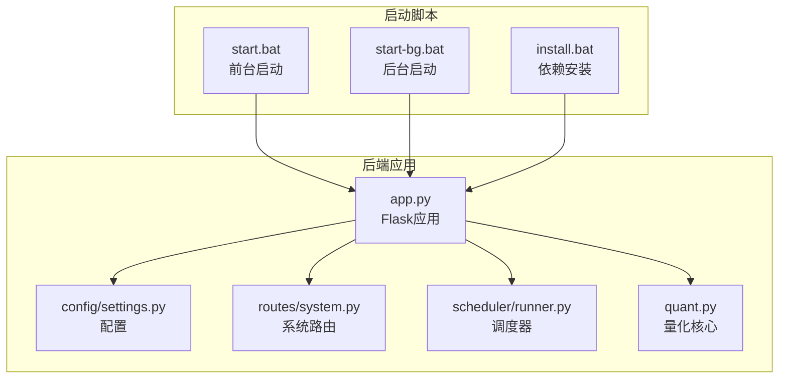
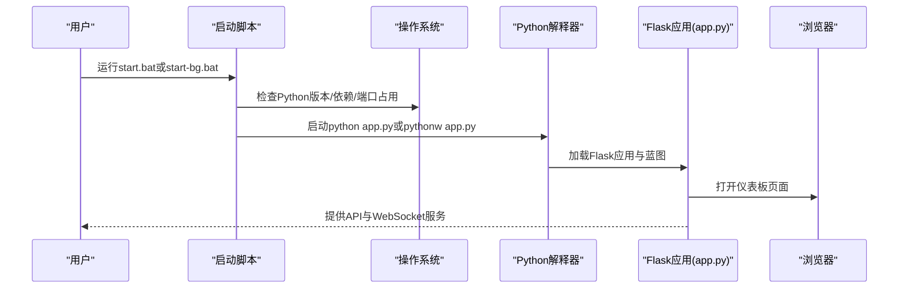
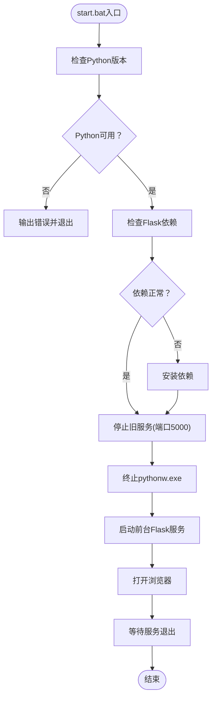
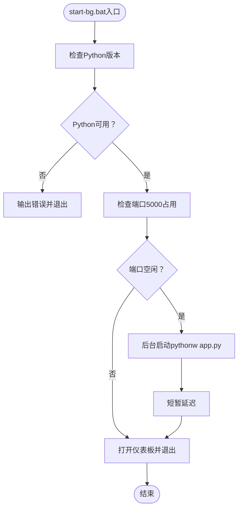
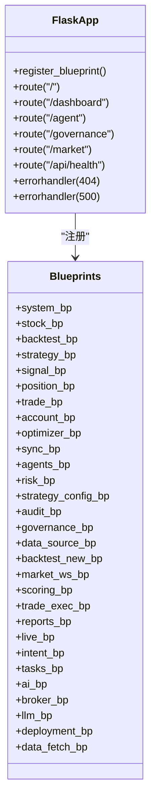
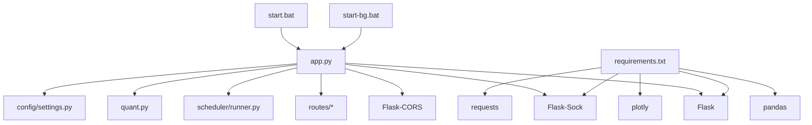

# 启动脚本

<cite>
**本文引用的文件**
- [start.bat](file://start.bat)
- [start-bg.bat](file://start-bg.bat)
- [app.py](file://app.py)
- [quant.py](file://quant.py)
- [requirements.txt](file://requirements.txt)
- [config/settings.py](file://config/settings.py)
- [routes/system.py](file://routes/system.py)
- [scheduler/runner.py](file://scheduler/runner.py)
- [install.bat](file://install.bat)
</cite>

## 目录
1. [简介](#简介)
2. [项目结构](#项目结构)
3. [核心组件](#核心组件)
4. [架构概览](#架构概览)
5. [详细组件分析](#详细组件分析)
6. [依赖分析](#依赖分析)
7. [性能考虑](#性能考虑)
8. [故障排查指南](#故障排查指南)
9. [结论](#结论)
10. [附录](#附录)

## 简介
本指南面向AIQuant系统的启动脚本使用，重点解释start.bat与start-bg.bat两个批处理脚本的功能差异、执行流程、错误处理与故障排查方法，并提供服务化部署建议与调试技巧。AIQuant是一个基于Flask的A股量化系统，提供数据接口、策略扫描、定时任务调度、实时行情监控等功能。

## 项目结构
AIQuant的启动脚本位于仓库根目录，配合Flask后端应用app.py运行。系统通过蓝图组织API路由，通过调度器执行定时任务，通过安装脚本管理Python依赖。

**图表来源**
- [start.bat:1-91](file://start.bat#L1-L91)
- [start-bg.bat:1-36](file://start-bg.bat#L1-L36)
- [app.py:1-164](file://app.py#L1-L164)
- [config/settings.py:1-25](file://config/settings.py#L1-L25)
- [routes/system.py:1-152](file://routes/system.py#L1-L152)
- [scheduler/runner.py:1-212](file://scheduler/runner.py#L1-L212)
- [quant.py:1-631](file://quant.py#L1-L631)

**章节来源**
- [start.bat:1-91](file://start.bat#L1-L91)
- [start-bg.bat:1-36](file://start-bg.bat#L1-L36)
- [app.py:1-164](file://app.py#L1-L164)
- [config/settings.py:1-25](file://config/settings.py#L1-L25)
- [routes/system.py:1-152](file://routes/system.py#L1-L152)
- [scheduler/runner.py:1-212](file://scheduler/runner.py#L1-L212)
- [quant.py:1-631](file://quant.py#L1-L631)

## 核心组件
- start.bat：前台启动脚本，负责环境检查、依赖验证、旧服务清理、浏览器打开与前台进程启动。
- start-bg.bat：后台启动脚本，负责快速检测、后台进程启动与浏览器打开。
- app.py：Flask后端应用，注册蓝图、提供健康检查、仪表板页面与WebSocket路由。
- config/settings.py：系统配置，包括API主机、端口、定时任务时间、日志级别等。
- routes/system.py：系统状态、同步、扫描、调度器控制的API路由。
- scheduler/runner.py：定时任务调度器，支持传统模式与多Agent流水线模式。
- quant.py：量化核心逻辑，包含策略分析、扫描任务、数据同步任务等。
- install.bat：依赖安装脚本，升级pip并安装requirements.txt中的依赖。

**章节来源**
- [start.bat:1-91](file://start.bat#L1-L91)
- [start-bg.bat:1-36](file://start-bg.bat#L1-L36)
- [app.py:1-164](file://app.py#L1-L164)
- [config/settings.py:1-25](file://config/settings.py#L1-L25)
- [routes/system.py:1-152](file://routes/system.py#L1-L152)
- [scheduler/runner.py:1-212](file://scheduler/runner.py#L1-L212)
- [quant.py:1-631](file://quant.py#L1-L631)
- [install.bat:1-32](file://install.bat#L1-L32)

## 架构概览
AIQuant采用前后端分离架构：前端通过浏览器访问仪表板页面，后端通过Flask提供REST API与WebSocket接口。启动脚本负责前置检查与进程启动，app.py负责业务路由与调度器集成。

**图表来源**
- [start.bat:14-91](file://start.bat#L14-L91)
- [start-bg.bat:13-36](file://start-bg.bat#L13-L36)
- [app.py:148-164](file://app.py#L148-L164)

## 详细组件分析

### start.bat（前台启动）
前台启动脚本提供完整的启动流程与用户交互提示，适合开发调试与手动启动。

- 环境检查
  - 检查Python版本，要求Python 3.11+。
  - 输出当前Python版本信息。
- 依赖验证
  - 检查Flask是否已安装，若缺失则通过pip安装requirements.txt及额外依赖。
- 服务清理
  - 检测端口5000占用情况，若存在监听进程则尝试终止。
  - 终止可能存在的pythonw.exe后台进程。
- 应用启动
  - 打印服务访问地址，自动打开浏览器访问仪表板。
  - 启动前台进程运行python app.py。
- 错误处理
  - 任何步骤失败会输出错误信息并暂停等待用户确认。

**图表来源**
- [start.bat:14-91](file://start.bat#L14-L91)

**章节来源**
- [start.bat:1-91](file://start.bat#L1-L91)

### start-bg.bat（后台启动）
后台启动脚本专注于快速启动与静默运行，适合生产环境或无人值守场景。

- 快速检查
  - 检查Python可用性。
  - 检查端口5000是否已被占用。
- 启动策略
  - 若端口被占用，直接打开浏览器并退出。
  - 若未占用，使用最小化窗口启动pythonw app.py作为后台服务。
- 用户体验
  - 启动后短暂延迟，然后打开浏览器访问仪表板。
  - 输出完成提示信息。

**图表来源**
- [start-bg.bat:13-36](file://start-bg.bat#L13-L36)

**章节来源**
- [start-bg.bat:1-36](file://start-bg.bat#L1-L36)

### app.py（Flask后端）
Flask后端应用负责注册所有蓝图、提供静态页面与API、启动WebSocket路由，并在前台模式下自动启动行情监控与实盘监控。

- 蓝图注册
  - 注册系统、股票、回测、策略、信号、仓位、交易、账户、优化器、同步、代理、风控、策略配置、审计、治理、数据源、回测新、市场WS、评分、交易执行、报告、实盘、意图、任务、AI、券商、LLM、部署、数据获取等蓝图。
- 页面路由
  - 提供仪表板、代理控制台、治理控制台、实时行情监控页面等静态页面路由。
- API路由
  - 提供健康检查、调试路由等API。
- WebSocket
  - 注册WebSocket路由，支持实时行情推送。
- 启动逻辑
  - 前台模式下自动启动市场监控与实盘监控，然后在0.0.0.0:5000启动服务。

**图表来源**
- [app.py:9-72](file://app.py#L9-L72)
- [app.py:78-164](file://app.py#L78-L164)

**章节来源**
- [app.py:1-164](file://app.py#L1-L164)

### config/settings.py（系统配置）
系统配置文件定义了数据库路径、Flask API主机与端口、定时任务时间、数据同步批次大小、日志级别等。

- 数据库路径：指向core/quant.db。
- API配置：主机0.0.0.0，端口5000，调试关闭。
- 定时任务：07:00数据同步，09:00策略扫描。
- 日志级别：INFO。

**章节来源**
- [config/settings.py:1-25](file://config/settings.py#L1-L25)

### routes/system.py（系统路由）
系统路由提供数据同步、策略扫描、系统状态查询、调度器启停等API，支持异步后台执行与状态查询。

- /api/system/sync：触发数据同步（异步）。
- /api/system/scan：触发策略扫描（异步），支持force_recalc与use_v4参数。
- /api/system/status：查询系统状态（同步/扫描运行状态、最后结果、调度器状态）。
- /api/system/scheduler：启停定时任务调度器。
- /api/system/auto_check：页面加载时自动检查是否需要执行策略扫描。

**章节来源**
- [routes/system.py:1-152](file://routes/system.py#L1-L152)

### scheduler/runner.py（调度器）
调度器支持两种模式：传统模式与多Agent流水线模式。传统模式在07:00同步数据，在09:00扫描策略；流水线模式在07:30执行DataAgent预同步，在09:00执行完整流水线。

- 传统模式任务
  - run_sync_blocking：根据是否收盘决定全量或增量同步。
  - run_scan_blocking：调用quant.scan_job执行策略扫描。
- 流水线模式任务
  - run_pipeline_blocking：执行完整多Agent流水线。
  - run_data_agent_only：仅执行DataAgent。
- 调度器启动
  - start_scheduler：根据模式注册定时任务并启动调度线程。

**章节来源**
- [scheduler/runner.py:1-212](file://scheduler/runner.py#L1-L212)

### quant.py（量化核心）
量化核心包含策略分析、扫描任务、数据同步任务、后台初始化等逻辑，支持v4超跌反弹策略与5策略融合。

- 策略分析
  - analyze_stock_from_db：基于数据库数据运行5策略并融合。
  - analyze_stock_v4：基于v4超跌反弹策略分析。
- 扫描任务
  - scan_all_stocks：扫描全市场股票，返回精选与全部命中。
  - scan_job：每日扫描任务，支持force_recalc与use_v4。
- 数据同步任务
  - sync_job：每日16:00同步收盘数据。
- 后台初始化
  - _bg_init：数据库为空时自动拉取历史数据。

**章节来源**
- [quant.py:1-631](file://quant.py#L1-L631)

### install.bat（依赖安装）
依赖安装脚本负责升级pip并安装requirements.txt中的依赖，确保系统具备运行所需的Python包。

**章节来源**
- [install.bat:1-32](file://install.bat#L1-L32)

## 依赖分析
启动脚本与后端应用之间的依赖关系如下：

**图表来源**
- [start.bat:25-40](file://start.bat#L25-L40)
- [start-bg.bat:13-17](file://start-bg.bat#L13-L17)
- [app.py:5-41](file://app.py#L5-L41)
- [requirements.txt:1-9](file://requirements.txt#L1-L9)
- [config/settings.py:10-13](file://config/settings.py#L10-L13)

**章节来源**
- [start.bat:25-40](file://start.bat#L25-L40)
- [start-bg.bat:13-17](file://start-bg.bat#L13-L17)
- [app.py:5-41](file://app.py#L5-L41)
- [requirements.txt:1-9](file://requirements.txt#L1-L9)
- [config/settings.py:10-13](file://config/settings.py#L10-L13)

## 性能考虑
- 前台启动与后台启动
  - 前台启动会保持命令行窗口，便于观察日志与调试；后台启动使用pythonw隐藏窗口，适合长期运行。
  - 后台启动脚本在启动后短暂延迟，避免浏览器打开过早导致页面加载失败。
- 依赖安装
  - install.bat会升级pip并安装所需依赖，减少因依赖版本问题导致的启动失败。
- 调度器
  - 传统模式与流水线模式可按需切换，流水线模式在07:30预同步数据，09:00执行完整流水线，提高数据准备效率。

[本节为通用性能讨论，不直接分析具体文件]

## 故障排查指南
- Python版本问题
  - 症状：启动脚本报错提示未找到Python或版本过低。
  - 处理：确保已安装Python 3.11+，并将Python添加到PATH。
- 依赖安装失败
  - 症状：依赖检查阶段安装失败。
  - 处理：使用install.bat重新安装依赖，或手动执行pip安装requirements.txt中的依赖。
- 端口占用
  - 症状：端口5000被占用，服务无法启动。
  - 处理：使用start.bat自动停止占用进程，或手动终止相关进程；确认防火墙设置允许5000端口通信。
- 后台启动失败
  - 症状：start-bg.bat启动后立即退出或浏览器未打开。
  - 处理：检查Python可用性与端口占用情况；确认浏览器可正常打开URL。
- API访问异常
  - 症状：访问/api/health返回错误或页面无法加载。
  - 处理：检查Flask服务是否正常运行，查看日志输出；确认路由注册正确。
- 调度器问题
  - 症状：定时任务未执行或执行异常。
  - 处理：通过/routes/system.py提供的调度器API启停调度器；检查调度器状态与日志。

**章节来源**
- [start.bat:14-58](file://start.bat#L14-L58)
- [start-bg.bat:13-24](file://start-bg.bat#L13-L24)
- [app.py:131-145](file://app.py#L131-L145)
- [routes/system.py:66-83](file://routes/system.py#L66-L83)

## 结论
AIQuant提供了两套启动脚本以适应不同使用场景：前台启动适合开发调试，后台启动适合生产部署。通过完善的环境检查、依赖验证与错误处理机制，启动脚本能够有效提升系统的可用性与稳定性。结合Flask后端、蓝图路由、调度器与量化核心，AIQuant构建了一个功能完备的A股量化平台。

[本节为总结性内容，不直接分析具体文件]

## 附录

### 启动参数与自定义选项
- 环境变量
  - AGENT_MODE：设置为pipeline可启用多Agent流水线模式，否则使用传统模式。
- 系统路由参数
  - /api/system/scan：支持force_recalc（布尔）与use_v4（布尔）参数，控制是否强制重算与使用v4策略。
- 配置文件
  - config/settings.py：可调整API_HOST、API_PORT、SCHEDULE_SYNC_TIME、SCHEDULE_SCAN_TIME等。

**章节来源**
- [scheduler/runner.py:22-22](file://scheduler/runner.py#L22-L22)
- [routes/system.py:29-43](file://routes/system.py#L29-L43)
- [config/settings.py:10-17](file://config/settings.py#L10-L17)

### 服务化部署与Windows服务注册
- 使用后台启动脚本
  - start-bg.bat适合在Windows服务中运行，因为它不会阻塞命令行窗口。
- Windows服务注册建议
  - 使用Windows内置服务管理工具或第三方工具注册服务，设置服务启动类型为自动，登录账户为本地系统或指定用户。
  - 服务命令指向start-bg.bat所在路径，确保工作目录正确。
- 端口与防火墙
  - 确保5000端口在防火墙中开放，允许外部访问。
- 日志与监控
  - 建议在服务环境中配置日志轮转与监控告警，定期检查服务状态与日志输出。

[本节为概念性建议，不直接分析具体文件]

### 调试技巧与日志分析
- 前台启动调试
  - 使用start.bat启动，观察命令行输出，定位依赖安装与服务启动问题。
- 后台启动调试
  - 使用start-bg.bat启动，通过任务管理器查看pythonw进程状态；必要时临时切换为前台启动进行调试。
- API调试
  - 访问/api/debug/routes查看所有注册路由，确认蓝图注册正确。
  - 使用/api/system/status查询系统状态，确认同步/扫描任务状态。
- 日志分析
  - 查看Flask错误处理器返回的JSON错误信息，定位后端异常。
  - 检查调度器日志，确认定时任务执行情况。

**章节来源**
- [app.py:124-145](file://app.py#L124-L145)
- [routes/system.py:46-63](file://routes/system.py#L46-L63)
- [scheduler/runner.py:158-182](file://scheduler/runner.py#L158-L182)