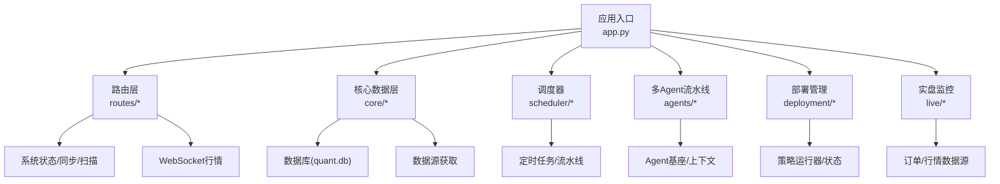
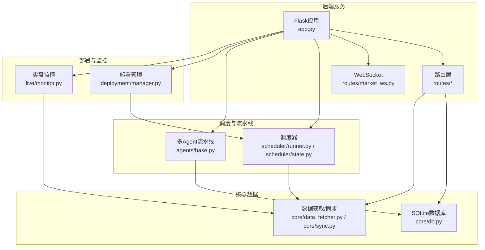
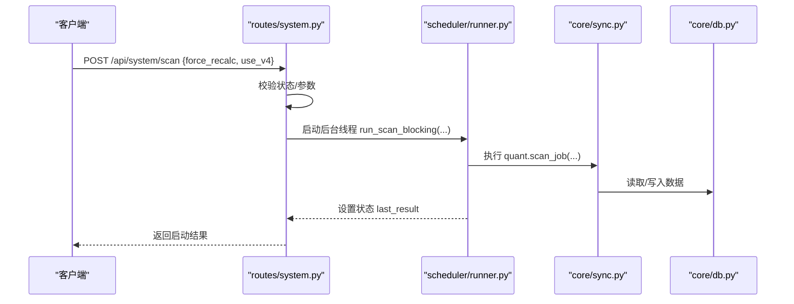
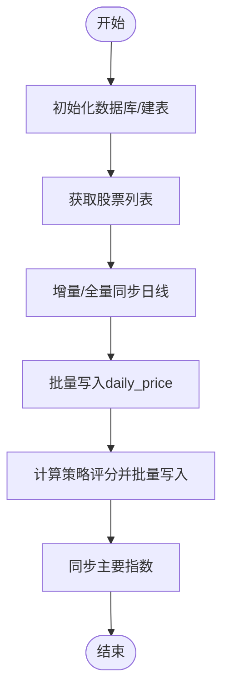
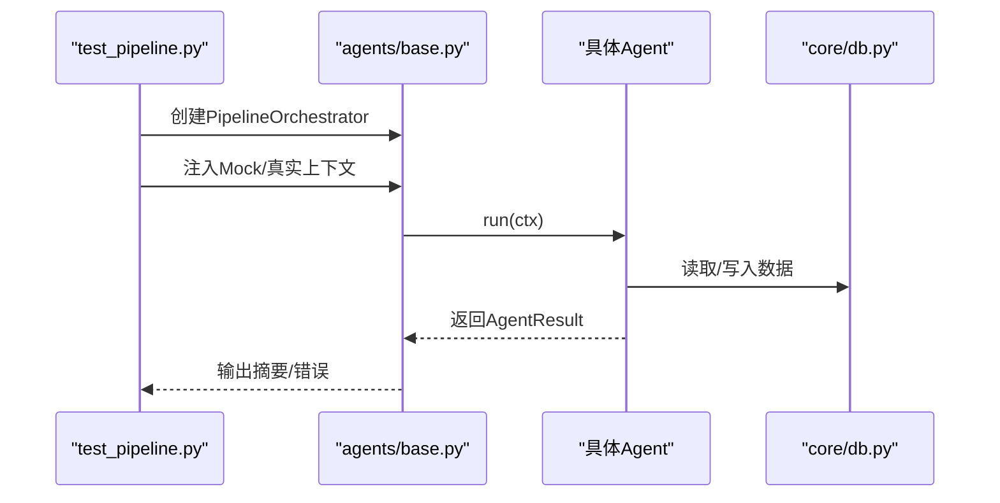
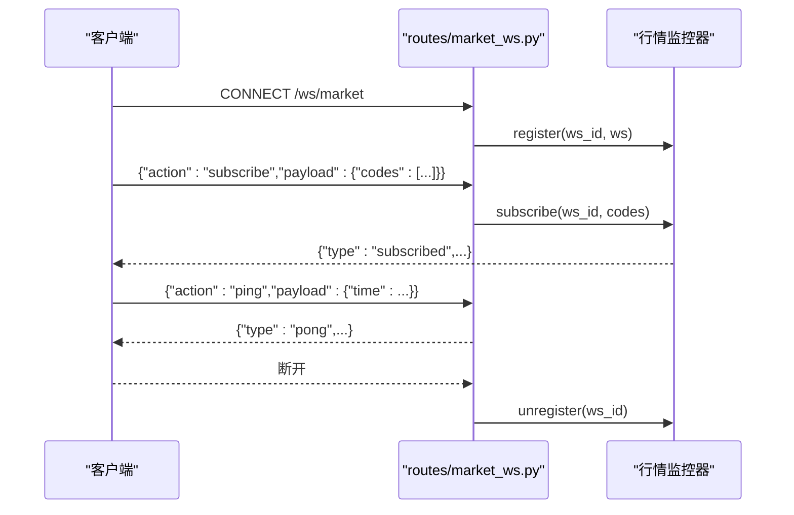
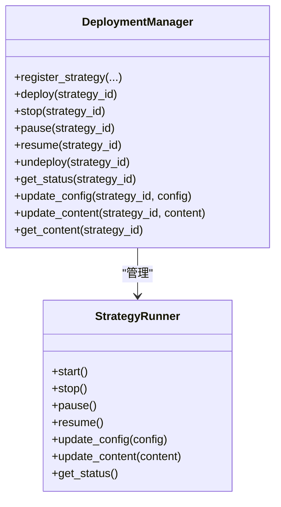
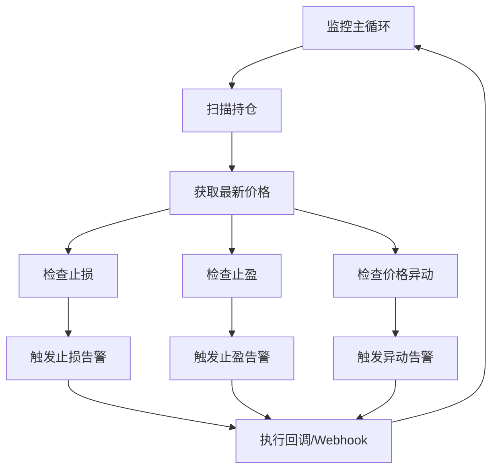
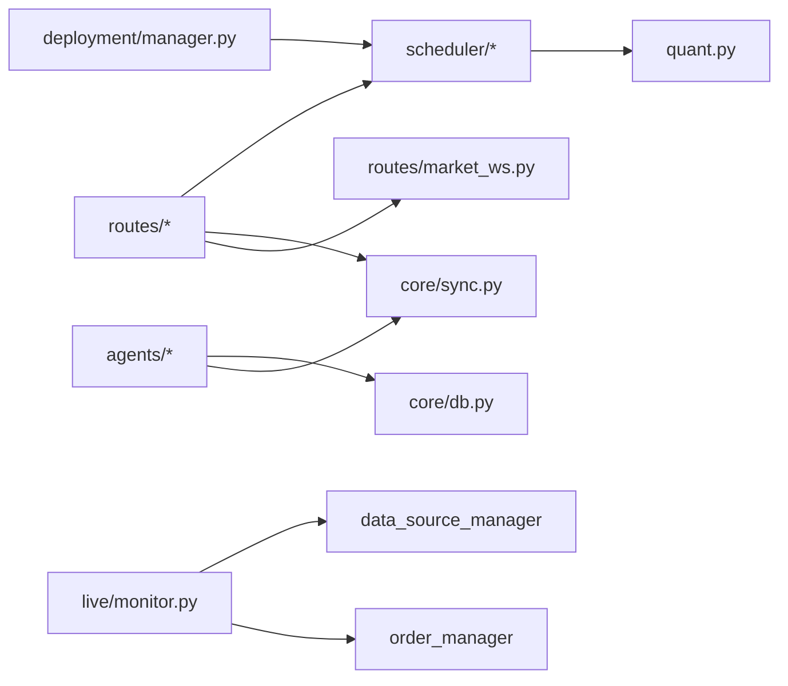

# 故障排查

<cite>
**本文引用的文件**
- [README.md](file://README.md)
- [app.py](file://app.py)
- [quant.py](file://quant.py)
- [test_pipeline.py](file://test_pipeline.py)
- [config/settings.py](file://config/settings.py)
- [routes/system.py](file://routes/system.py)
- [routes/market_ws.py](file://routes/market_ws.py)
- [core/db.py](file://core/db.py)
- [core/data_fetcher.py](file://core/data_fetcher.py)
- [core/sync.py](file://core/sync.py)
- [deployment/manager.py](file://deployment/manager.py)
- [scheduler/runner.py](file://scheduler/runner.py)
- [scheduler/state.py](file://scheduler/state.py)
- [live/monitor.py](file://live/monitor.py)
- [agents/base.py](file://agents/base.py)
</cite>

## 目录
1. [简介](#简介)
2. [项目结构](#项目结构)
3. [核心组件](#核心组件)
4. [架构总览](#架构总览)
5. [详细组件分析](#详细组件分析)
6. [依赖关系分析](#依赖关系分析)
7. [性能考量](#性能考量)
8. [故障排查指南](#故障排查指南)
9. [结论](#结论)
10. [附录](#附录)

## 简介
本指导文档面向AIQuant系统的运维与开发人员，提供系统化、可操作的故障排查方法与流程。内容涵盖策略启动失败、部署异常、运行时错误、数据库连接问题、API接口异常、WebSocket连接失败、性能问题定位、测试管道使用与调试、问题复现与根因分析，以及紧急故障的应急响应与恢复策略。

## 项目结构
AIQuant采用Flask后端提供REST API与WebSocket，配合调度器、数据同步、策略扫描、多Agent流水线、实盘监控等模块协同工作。关键目录与职责概览：
- app.py：后端入口，注册蓝图、启动行情与实盘监控、健康检查与全局错误处理
- routes/*：API路由层，系统状态、同步、扫描、WebSocket等
- core/*：核心数据层（SQLite）、数据获取与同步
- scheduler/*：定时任务与流水线调度
- agents/*：多Agent流水线基座与编排
- deployment/*：策略部署管理
- live/*：实盘监控
- config/*：基础配置

图示来源
- [app.py:1-164](file://app.py#L1-L164)
- [routes/system.py:1-152](file://routes/system.py#L1-L152)
- [routes/market_ws.py:1-142](file://routes/market_ws.py#L1-L142)
- [core/db.py:1-1213](file://core/db.py#L1-L1213)
- [core/data_fetcher.py:1-578](file://core/data_fetcher.py#L1-L578)
- [core/sync.py:1-760](file://core/sync.py#L1-L760)
- [scheduler/runner.py:1-212](file://scheduler/runner.py#L1-L212)
- [agents/base.py:1-120](file://agents/base.py#L1-L120)
- [deployment/manager.py:1-216](file://deployment/manager.py#L1-L216)
- [live/monitor.py:1-286](file://live/monitor.py#L1-L286)

章节来源
- [README.md:1-3](file://README.md#L1-L3)
- [app.py:1-164](file://app.py#L1-L164)

## 核心组件
- 应用入口与健康检查：提供健康检查端点、全局错误处理、自动启动行情与实盘监控
- 路由与状态：系统状态、手动同步/扫描、定时任务开关、自动检查是否需要扫描
- 数据层：SQLite数据库初始化、表结构、连接管理、行情/指数/信号/账户等表
- 数据获取与同步：baostock/akshare双数据源、指数同步、批量初始化与增量同步、策略评分回写
- 调度器：传统模式与多Agent流水线模式、后台线程执行、状态管理
- 多Agent流水线：统一上下文、结果封装、异常捕获与计时
- 部署管理：策略注册/部署/启停/暂停/恢复/注销、状态持久化
- 实盘监控：止损止盈/价格异动检测、告警与回调
- WebSocket：行情推送、状态查询、客户端管理

章节来源
- [app.py:124-164](file://app.py#L124-L164)
- [routes/system.py:12-152](file://routes/system.py#L12-L152)
- [core/db.py:57-467](file://core/db.py#L57-L467)
- [core/sync.py:39-760](file://core/sync.py#L39-L760)
- [scheduler/runner.py:29-212](file://scheduler/runner.py#L29-L212)
- [agents/base.py:20-120](file://agents/base.py#L20-L120)
- [deployment/manager.py:24-216](file://deployment/manager.py#L24-L216)
- [live/monitor.py:55-286](file://live/monitor.py#L55-L286)
- [routes/market_ws.py:67-142](file://routes/market_ws.py#L67-L142)

## 架构总览
系统采用“后端服务 + 数据层 + 调度/流水线 + 实盘监控 + 部署管理”的分层设计。后端通过REST API与WebSocket对外提供能力；数据层负责本地SQLite持久化；调度器与流水线负责周期性任务与端到端流程；部署管理负责策略生命周期；实盘监控负责风控与告警。

图示来源
- [app.py:1-164](file://app.py#L1-L164)
- [routes/market_ws.py:1-142](file://routes/market_ws.py#L1-L142)
- [core/db.py:1-1213](file://core/db.py#L1-L1213)
- [core/sync.py:1-760](file://core/sync.py#L1-L760)
- [scheduler/runner.py:1-212](file://scheduler/runner.py#L1-L212)
- [agents/base.py:1-120](file://agents/base.py#L1-L120)
- [deployment/manager.py:1-216](file://deployment/manager.py#L1-L216)
- [live/monitor.py:1-286](file://live/monitor.py#L1-L286)

## 详细组件分析

### 组件A：系统状态与手动同步/扫描
- 功能要点
  - POST /api/system/sync：触发数据同步（异步线程），防重入
  - POST /api/system/scan：触发策略扫描（异步线程），支持force_recalc/use_v4参数
  - GET /api/system/status：返回同步/扫描/调度器状态
  - GET /api/system/scheduler：开启/关闭定时任务
  - GET /api/system/auto_check：页面加载时自动检查是否需要扫描
- 常见问题
  - 同步/扫描正在运行：接口返回409，等待上次任务结束
  - 数据库无行情：跳过扫描，提示先同步
  - 已完成扫描：跳过本次扫描
  - 扫描进行中：等待扫描完成
- 排查步骤
  - 查看状态端点确认running标志
  - 检查数据库最新日期与扫描记录
  - 若扫描失败，查看后端日志中的异常栈

图示来源
- [routes/system.py:24-43](file://routes/system.py#L24-L43)
- [scheduler/runner.py:90-102](file://scheduler/runner.py#L90-L102)
- [quant.py:433-546](file://quant.py#L433-L546)
- [core/db.py:57-467](file://core/db.py#L57-L467)

章节来源
- [routes/system.py:12-152](file://routes/system.py#L12-L152)
- [scheduler/runner.py:29-102](file://scheduler/runner.py#L29-L102)
- [quant.py:433-546](file://quant.py#L433-L546)

### 组件B：数据库与数据获取
- 数据库
  - 初始化建表、索引、迁移；提供连接上下文、批量写入、查询等
  - 关键表：stock_info、daily_price、index_daily、stock_signal、positions、trades、account_snapshots、risk_events、audit_log等
- 数据获取与同步
  - 主数据源baostock，备用akshare；指数同步；批量初始化与增量同步；策略评分批量写入
  - 交易日判断、覆盖率阈值、断点续传缓存
- 常见问题
  - 数据库连接超时/锁冲突：检查PRAGMA设置与事务提交/回滚
  - 行情缺失/空数据：检查股票列表、过滤规则、北交所跳过
  - 指数数据为空：检查指数代码映射与数据源可用性
- 排查步骤
  - 查看db_stats统计信息
  - 检查daily_price/index_daily是否存在目标日期数据
  - 核对策略评分是否写入（fusion_score等列）

图示来源
- [core/db.py:57-467](file://core/db.py#L57-L467)
- [core/sync.py:136-760](file://core/sync.py#L136-L760)
- [core/data_fetcher.py:173-223](file://core/data_fetcher.py#L173-L223)

章节来源
- [core/db.py:1-1213](file://core/db.py#L1-L1213)
- [core/sync.py:1-760](file://core/sync.py#L1-L760)
- [core/data_fetcher.py:1-578](file://core/data_fetcher.py#L1-L578)

### 组件C：多Agent流水线与测试管道
- Agent基座
  - 统一接口run(ctx)，自动计时、异常捕获、结果封装
  - 上下文AgentContext提供共享数据与结果汇总
- 测试管道test_pipeline.py
  - 基础模块导入测试、Agent导入状态、编排器状态
  - Mock流水线端到端测试（跳过不可用Agent）
  - 真实数据流水线测试（依赖数据库）
- 常见问题
  - Agent导入失败：外部依赖缺失（如baostock）
  - Mock数据注入：确保注入正确的候选数据结构
  - 真实数据测试：数据库为空或不可用
- 排查步骤
  - 使用--mock模式验证流水线骨架
  - 逐步启用可用Agent，定位失败环节
  - 查看AgentResult.error与summary

图示来源
- [agents/base.py:88-120](file://agents/base.py#L88-L120)
- [test_pipeline.py:19-392](file://test_pipeline.py#L19-L392)
- [core/db.py:57-467](file://core/db.py#L57-L467)

章节来源
- [agents/base.py:1-120](file://agents/base.py#L1-L120)
- [test_pipeline.py:1-392](file://test_pipeline.py#L1-L392)

### 组件D：WebSocket行情与监控
- WebSocket路由
  - /ws/market：连接、订阅/退订、心跳、状态查询
  - /api/market/status：监控状态
  - /api/market/clients：客户端列表
- 常见问题
  - 连接异常：客户端断开、解析消息异常
  - 订阅无效：股票代码格式或权限
  - 服务端未启动：手动start_monitor
- 排查步骤
  - 调用/status与/clients确认状态
  - 检查后端日志中的异常栈
  - 确认行情监控器实例与注册

图示来源
- [routes/market_ws.py:67-142](file://routes/market_ws.py#L67-L142)

章节来源
- [routes/market_ws.py:1-142](file://routes/market_ws.py#L1-L142)

### 组件E：部署管理与运行时
- DeploymentManager
  - 注册/部署/启停/暂停/恢复/注销策略
  - 策略内容与配置热更新
  - 部署记录持久化
- 常见问题
  - 策略未注册：先register再deploy
  - 已在运行：避免重复启动
  - 启动失败：检查策略函数/配置
- 排查步骤
  - 查看部署记录与状态
  - 检查策略内容与配置
  - 重启后确认状态

图示来源
- [deployment/manager.py:24-216](file://deployment/manager.py#L24-L216)

章节来源
- [deployment/manager.py:1-216](file://deployment/manager.py#L1-L216)

### 组件F：实盘监控与风控
- 实盘监控
  - 定时扫描持仓，检查止损/止盈/价格异动
  - 告警等级与回调处理
- 常见问题
  - 监控未启动：调用start
  - 回调失败：不影响主流程，但需关注日志
  - 阈值不合理：调整配置
- 排查步骤
  - 调用/get_status查看运行状态与阈值
  - 检查告警列表与解决状态
  - 验证Webhook推送

图示来源
- [live/monitor.py:91-286](file://live/monitor.py#L91-L286)

章节来源
- [live/monitor.py:1-286](file://live/monitor.py#L1-L286)

## 依赖关系分析
- 组件耦合
  - routes依赖scheduler状态与core同步/扫描
  - scheduler依赖core同步模块与quant策略扫描
  - agents依赖core数据库与策略模块
  - deployment依赖scheduler运行器
  - live依赖order_manager与data_source_manager
- 外部依赖
  - 数据源：baostock（主）、akshare（备）
  - WebSocket：flask_sock
  - SQLite：本地数据库
- 潜在环路
  - 通过蓝图与模块导入避免循环依赖

图示来源
- [routes/system.py:1-152](file://routes/system.py#L1-L152)
- [scheduler/runner.py:1-212](file://scheduler/runner.py#L1-L212)
- [quant.py:1-631](file://quant.py#L1-L631)
- [agents/base.py:1-120](file://agents/base.py#L1-L120)
- [deployment/manager.py:1-216](file://deployment/manager.py#L1-L216)
- [live/monitor.py:1-286](file://live/monitor.py#L1-L286)
- [routes/market_ws.py:1-142](file://routes/market_ws.py#L1-L142)

章节来源
- [routes/system.py:1-152](file://routes/system.py#L1-L152)
- [scheduler/runner.py:1-212](file://scheduler/runner.py#L1-L212)
- [quant.py:1-631](file://quant.py#L1-L631)
- [agents/base.py:1-120](file://agents/base.py#L1-L120)
- [deployment/manager.py:1-216](file://deployment/manager.py#L1-L216)
- [live/monitor.py:1-286](file://live/monitor.py#L1-L286)
- [routes/market_ws.py:1-142](file://routes/market_ws.py#L1-L142)

## 性能考量
- 数据库
  - WAL模式与NORMAL同步提升并发；批量写入减少事务开销
  - 合理索引（code+date、trade_date等）提升查询性能
- 数据同步
  - 增量同步基于覆盖率阈值，避免全量重跑
  - 断点续传缓存减少重复工作
- 策略扫描
  - 批量计算策略评分并一次性写入，避免多次IO
- WebSocket
  - 客户端连接管理与消息解析需避免阻塞
- 实盘监控
  - 扫描间隔可配置，避免过于频繁导致资源消耗

章节来源
- [core/db.py:26-40](file://core/db.py#L26-L40)
- [core/sync.py:462-668](file://core/sync.py#L462-L668)
- [quant.py:581-631](file://quant.py#L581-L631)
- [live/monitor.py:44-53](file://live/monitor.py#L44-L53)

## 故障排查指南

### 一、策略启动失败
- 现象
  - /api/system/scan返回“扫描正在进行中”
  - 扫描完成后无推荐或推荐为空
- 排查步骤
  - 调用/status确认running标志
  - 检查数据库最新日期与stock_signal记录
  - 若force_recalc=True，确认是否完成回填
  - 查看后端日志中的异常栈

章节来源
- [routes/system.py:24-43](file://routes/system.py#L24-L43)
- [scheduler/runner.py:90-102](file://scheduler/runner.py#L90-L102)
- [quant.py:433-546](file://quant.py#L433-L546)

### 二、部署异常
- 现象
  - deploy返回“策略未注册”或“已在运行中”
  - 启动失败
- 排查步骤
  - 先register_strategy，再deploy
  - 检查策略内容与配置
  - 查看部署记录与状态

章节来源
- [deployment/manager.py:67-82](file://deployment/manager.py#L67-L82)
- [deployment/manager.py:120-129](file://deployment/manager.py#L120-L129)

### 三、运行时错误
- 现象
  - API返回500，或WebSocket连接异常
- 排查步骤
  - 查看全局错误处理返回的错误信息
  - 检查后端日志中的异常栈
  - 对Agent流水线，查看AgentResult.error与summary

章节来源
- [app.py:136-145](file://app.py#L136-L145)
- [agents/base.py:107-114](file://agents/base.py#L107-L114)

### 四、数据库连接问题
- 现象
  - 数据库初始化失败、查询为空、写入报错
- 排查步骤
  - 确认DB_PATH与quant.db存在
  - 检查get_conn上下文与PRAGMA设置
  - 查看db_stats统计信息
  - 确认表结构与索引存在

章节来源
- [config/settings.py:6-8](file://config/settings.py#L6-L8)
- [core/db.py:26-40](file://core/db.py#L26-L40)
- [core/db.py:57-467](file://core/db.py#L57-L467)

### 五、API接口异常
- 现象
  - /api/system/sync返回409，/api/system/scan参数缺失
- 排查步骤
  - 确认请求体JSON包含force_recalc/use_v4
  - 检查enable参数（定时任务开关）
  - 使用/debug/routes检查路由注册

章节来源
- [routes/system.py:12-83](file://routes/system.py#L12-L83)
- [app.py:124-128](file://app.py#L124-L128)

### 六、WebSocket连接失败
- 现象
  - /ws/market连接异常、订阅失败、客户端列表为空
- 排查步骤
  - 调用/status与/clients确认状态
  - 检查后端日志中的异常栈
  - 确认行情监控器已启动

章节来源
- [routes/market_ws.py:67-142](file://routes/market_ws.py#L67-L142)

### 七、性能问题诊断
- CPU使用率高
  - 检查策略扫描/同步是否长时间运行
  - 调整扫描间隔与批处理大小
- 内存占用高
  - 检查DataFrame构造与缓存
  - 确认及时释放资源
- 网络延迟
  - 检查数据源可用性与超时设置
  - 评估baostock/akshare接口稳定性

章节来源
- [core/sync.py:31-35](file://core/sync.py#L31-L35)
- [core/data_fetcher.py:173-223](file://core/data_fetcher.py#L173-L223)

### 八、测试管道(test_pipeline.py)使用与调试
- 使用方法
  - 基础模块导入测试：验证agents.base与orchestrator导入
  - Agent导入状态：跳过不可用Agent
  - Mock流水线：注入候选数据，验证端到端流程
  - 真实数据流水线：依赖数据库，逐步启用可用Agent
- 调试技巧
  - 使用--mock跳过外部依赖
  - 逐步启用Agent，定位失败环节
  - 查看AgentResult与summary输出

章节来源
- [test_pipeline.py:19-392](file://test_pipeline.py#L19-L392)
- [agents/base.py:71-86](file://agents/base.py#L71-L86)

### 九、问题复现与根因分析
- 复现步骤
  - 使用最小化输入（如单只股票/固定日期）
  - 逐步启用功能模块，缩小范围
- 根因分析
  - 依据AgentResult.error与summary
  - 检查数据库写入与查询链路
  - 对比历史运行成功的记录

章节来源
- [agents/base.py:107-114](file://agents/base.py#L107-L114)
- [test_pipeline.py:314-345](file://test_pipeline.py#L314-L345)

### 十、紧急故障应急响应与恢复策略
- 应急响应
  - 停止定时任务：调用/scheduler {enable:false}
  - 停止实盘监控：调用/stop
  - 清理缓存：R6清理旧缓存文件
- 恢复策略
  - 修复后重新启动定时任务
  - 重新部署策略（若涉及）
  - 重新启动行情监控

章节来源
- [routes/system.py:66-83](file://routes/system.py#L66-L83)
- [live/monitor.py:79-84](file://live/monitor.py#L79-L84)
- [quant.py:555-567](file://quant.py#L555-L567)

## 结论
本指导文档提供了AIQuant系统从API、数据库、数据同步、调度与流水线、部署管理到实盘监控的全链路故障排查方法。建议在日常运维中结合状态端点、日志与测试管道进行快速定位与恢复，并在紧急情况下遵循应急响应流程，确保系统稳定运行。

## 附录
- 常用端点
  - /api/health：健康检查
  - /api/system/status：系统状态
  - /api/system/sync：手动同步
  - /api/system/scan：手动扫描
  - /api/system/scheduler：定时任务开关
  - /api/system/auto_check：自动检查
  - /api/market/status：WebSocket状态
  - /api/market/clients：WebSocket客户端
- 常用配置
  - DB_PATH：数据库路径
  - API_HOST/PORT：监听地址
  - LOG_LEVEL：日志级别

章节来源
- [app.py:131-134](file://app.py#L131-L134)
- [routes/system.py:46-83](file://routes/system.py#L46-L83)
- [routes/market_ws.py:26-64](file://routes/market_ws.py#L26-L64)
- [config/settings.py:6-25](file://config/settings.py#L6-L25)