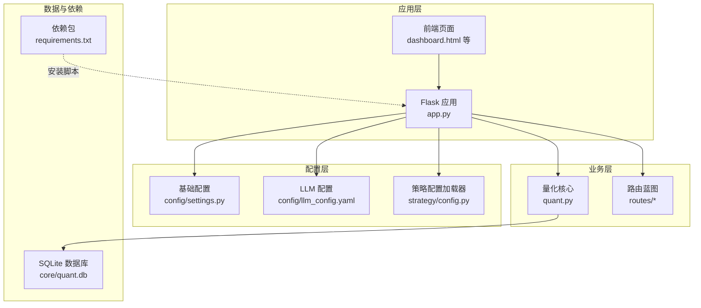
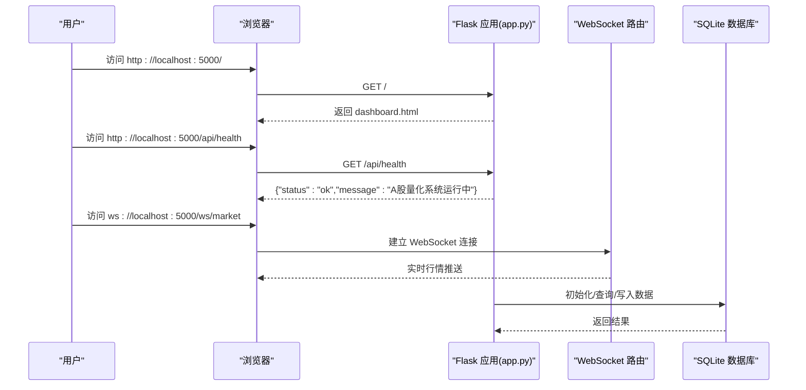
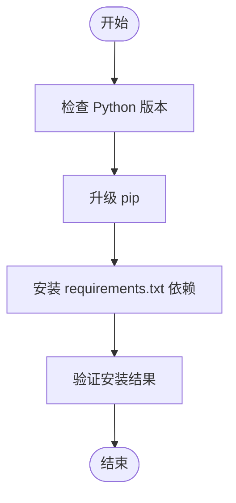
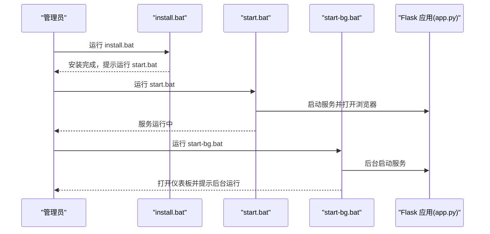
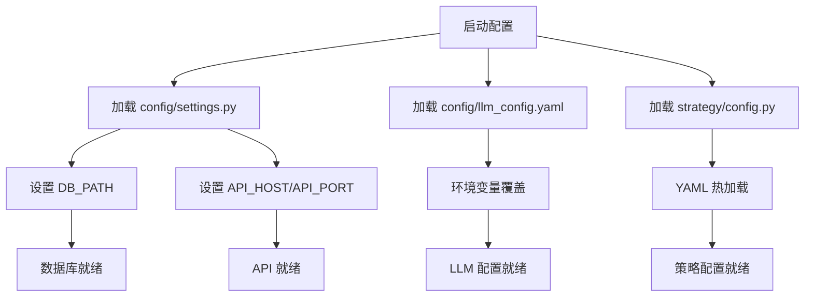
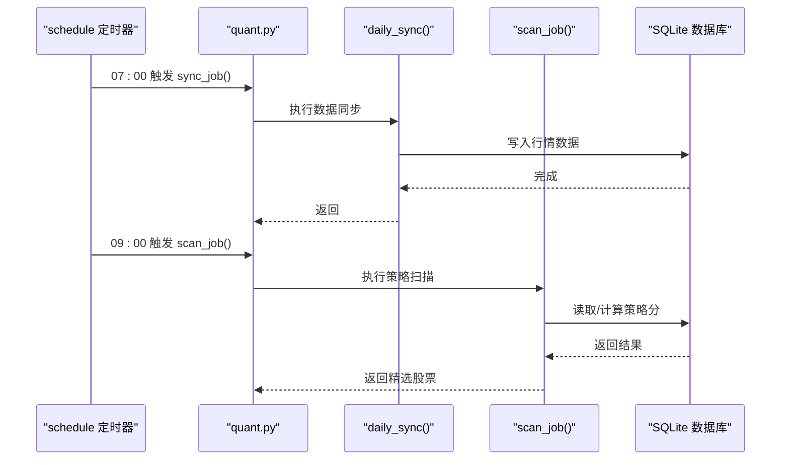
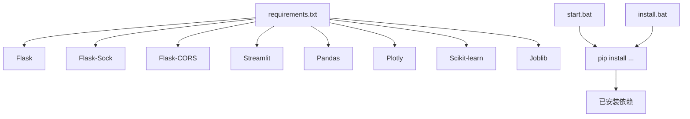

# 环境准备

<cite>
**本文引用的文件**
- [requirements.txt](file://requirements.txt)
- [install.bat](file://install.bat)
- [start.bat](file://start.bat)
- [start-bg.bat](file://start-bg.bat)
- [app.py](file://app.py)
- [config/settings.py](file://config/settings.py)
- [config/llm_config.yaml](file://config/llm_config.yaml)
- [strategy/config.py](file://strategy/config.py)
- [quant.py](file://quant.py)
- [README.md](file://README.md)
</cite>

## 目录
1. [简介](#简介)
2. [项目结构](#项目结构)
3. [核心组件](#核心组件)
4. [架构概览](#架构概览)
5. [详细组件分析](#详细组件分析)
6. [依赖分析](#依赖分析)
7. [性能考虑](#性能考虑)
8. [故障排除指南](#故障排除指南)
9. [结论](#结论)
10. [附录](#附录)

## 简介
本指南面向AIQuant系统的环境准备与部署，覆盖开发与生产环境的系统要求、依赖安装、Windows脚本使用、虚拟环境创建与激活、环境变量与数据库连接配置、常见问题排查以及环境验证方法。内容基于仓库中的安装脚本、依赖清单与配置文件进行整理，帮助用户在Windows环境下快速搭建并稳定运行系统。

## 项目结构
AIQuant采用前后端分离的Flask后端与静态页面前端的架构。后端通过Blueprint组织路由，前端通过静态HTML页面提供仪表板与控制台。配置集中在config目录，策略配置支持热加载。

图表来源
- [app.py:1-164](file://app.py#L1-L164)
- [config/settings.py:1-25](file://config/settings.py#L1-L25)
- [config/llm_config.yaml:1-23](file://config/llm_config.yaml#L1-L23)
- [strategy/config.py:1-132](file://strategy/config.py#L1-L132)
- [quant.py:1-631](file://quant.py#L1-L631)

章节来源
- [README.md:1-3](file://README.md#L1-L3)
- [app.py:1-164](file://app.py#L1-L164)
- [config/settings.py:1-25](file://config/settings.py#L1-L25)
- [config/llm_config.yaml:1-23](file://config/llm_config.yaml#L1-L23)
- [strategy/config.py:1-132](file://strategy/config.py#L1-L132)
- [quant.py:1-631](file://quant.py#L1-L631)

## 核心组件
- 依赖管理：通过requirements.txt声明核心依赖，包含Web框架、数据处理、可视化与机器学习相关库。
- 安装脚本：install.bat负责检查Python版本、升级pip并安装依赖；start.bat负责启动服务并打开浏览器；start-bg.bat用于后台静默启动。
- 配置系统：基础配置settings.py定义数据库路径、API主机与端口、定时任务时间等；LLM配置llm_config.yaml支持环境变量覆盖；策略配置加载器strategy/config.py支持YAML热加载。
- 量化核心：quant.py封装策略扫描、数据同步、初始化流程与定时任务注册，作为系统运行的核心逻辑。

章节来源
- [requirements.txt:1-9](file://requirements.txt#L1-L9)
- [install.bat:1-32](file://install.bat#L1-L32)
- [start.bat:1-91](file://start.bat#L1-L91)
- [start-bg.bat:1-36](file://start-bg.bat#L1-L36)
- [config/settings.py:1-25](file://config/settings.py#L1-L25)
- [config/llm_config.yaml:1-23](file://config/llm_config.yaml#L1-L23)
- [strategy/config.py:1-132](file://strategy/config.py#L1-L132)
- [quant.py:1-631](file://quant.py#L1-L631)

## 架构概览
系统后端基于Flask，通过Blueprint组织功能模块，WebSocket用于实时行情推送。前端静态页面通过后端路由提供，健康检查与调试路由便于验证服务可用性。

图表来源
- [app.py:78-164](file://app.py#L78-L164)
- [config/settings.py:10-17](file://config/settings.py#L10-L17)

章节来源
- [app.py:1-164](file://app.py#L1-L164)
- [config/settings.py:1-25](file://config/settings.py#L1-L25)

## 详细组件分析

### 依赖安装与版本要求
- 依赖来源：requirements.txt列出所有必需的Python包。
- 版本约束：部分包带有最低版本要求（如流式界面、数据处理、可视化与机器学习库），确保兼容性。
- 安装方式：install.bat会自动升级pip并安装requirements.txt中的依赖；start.bat在缺失依赖时也会尝试安装。

图表来源
- [install.bat:13-24](file://install.bat#L13-L24)
- [requirements.txt:1-9](file://requirements.txt#L1-L9)

章节来源
- [requirements.txt:1-9](file://requirements.txt#L1-L9)
- [install.bat:1-32](file://install.bat#L1-L32)
- [start.bat:25-40](file://start.bat#L25-L40)

### Windows安装脚本使用说明
- install.bat：一次性完成Python版本检查、pip升级与依赖安装，完成后提示运行start.bat。
- start.bat：启动前检查Python与依赖，停止占用5000端口的旧进程，然后启动Flask服务并在浏览器打开仪表板。
- start-bg.bat：后台静默启动，若服务已在运行则直接打开仪表板。

图表来源
- [install.bat:1-32](file://install.bat#L1-L32)
- [start.bat:1-91](file://start.bat#L1-L91)
- [start-bg.bat:1-36](file://start-bg.bat#L1-L36)
- [app.py:148-164](file://app.py#L148-L164)

章节来源
- [install.bat:1-32](file://install.bat#L1-L32)
- [start.bat:1-91](file://start.bat#L1-L91)
- [start-bg.bat:1-36](file://start-bg.bat#L1-L36)
- [app.py:148-164](file://app.py#L148-L164)

### 虚拟环境创建与激活
- 建议使用Python 3.11+创建独立虚拟环境，隔离系统Python与项目依赖。
- 在虚拟环境中执行pip安装与运行命令，避免全局污染。
- Windows下可使用Python内置venv创建虚拟环境，并在安装脚本前激活该环境。

章节来源
- [install.bat:13-18](file://install.bat#L13-L18)
- [start.bat:14-21](file://start.bat#L14-L21)

### 环境变量与数据库连接设置
- 数据库路径：DB_PATH指向SQLite数据库文件位置，位于core目录下。
- API监听：API_HOST与API_PORT分别控制Flask监听地址与端口。
- LLM配置：llm_config.yaml支持通过环境变量覆盖API Key、Base URL与模型名称，便于在不同环境切换。
- 策略配置：strategy/config.py支持从YAML文件热加载策略参数，无需重启服务。

图表来源
- [config/settings.py:6-17](file://config/settings.py#L6-L17)
- [config/llm_config.yaml:2-23](file://config/llm_config.yaml#L2-L23)
- [strategy/config.py:45-72](file://strategy/config.py#L45-L72)

章节来源
- [config/settings.py:1-25](file://config/settings.py#L1-L25)
- [config/llm_config.yaml:1-23](file://config/llm_config.yaml#L1-L23)
- [strategy/config.py:1-132](file://strategy/config.py#L1-L132)

### 量化核心与定时任务
- 定时任务：quant.py注册每日07:00的数据同步与09:00的策略扫描任务，主循环每30秒检查一次。
- 初始化流程：首次运行时根据数据库股票数量决定是否进行历史数据初始化。
- 策略扫描：支持v4超跌反弹与5策略融合两种模式，输出精选股票列表与面板数据。

图表来源
- [quant.py:619-631](file://quant.py#L619-L631)
- [quant.py:552-567](file://quant.py#L552-L567)
- [quant.py:433-546](file://quant.py#L433-L546)

章节来源
- [quant.py:1-631](file://quant.py#L1-L631)

## 依赖分析
- 直接依赖：Flask、Flask-Sock、Flask-CORS、Streamlit、Pandas、Plotly、Scikit-learn、Joblib等。
- 版本约束：部分包带有最低版本要求，确保Web框架、数据处理与机器学习能力满足系统需求。
- 运行时依赖：安装脚本会自动安装requirements.txt与额外的Flask相关包，start.bat在缺失时也会尝试安装。

图表来源
- [requirements.txt:1-9](file://requirements.txt#L1-L9)
- [install.bat:20-24](file://install.bat#L20-L24)
- [start.bat:27-37](file://start.bat#L27-L37)

章节来源
- [requirements.txt:1-9](file://requirements.txt#L1-L9)
- [install.bat:1-32](file://install.bat#L1-L32)
- [start.bat:1-91](file://start.bat#L1-L91)

## 性能考虑
- 数据库：SQLite适合中小规模数据，建议定期备份与监控数据库大小。
- 定时任务：0.5秒检查间隔的主循环较为轻量，但应避免在扫描过程中执行高负载操作。
- 策略计算：批量策略重算可能耗时较长，建议在维护窗口执行或使用增量更新。
- 网络与并发：WebSocket与REST接口在同一进程中运行，注意端口冲突与资源占用。

## 故障排除指南
- Python未找到：install.bat与start.bat均会在Python未安装或不在PATH时提示安装Python 3.11+。
- 端口占用：start.bat会检测并尝试终止占用5000端口的进程，必要时以管理员权限运行。
- 依赖缺失：start.bat在导入Flask失败时会尝试安装依赖，若失败请手动执行pip安装命令。
- 数据库连接：确认DB_PATH指向的文件存在且可写，首次运行会自动初始化表结构。
- LLM配置：若API Key或Base URL无效，可在llm_config.yaml中通过环境变量覆盖，或直接修改配置文件。

章节来源
- [install.bat:13-18](file://install.bat#L13-L18)
- [start.bat:42-65](file://start.bat#L42-L65)
- [start.bat:27-37](file://start.bat#L27-L37)
- [config/settings.py:6-8](file://config/settings.py#L6-L8)
- [config/llm_config.yaml:7-11](file://config/llm_config.yaml#L7-L11)

## 结论
通过本指南，您可以在Windows环境下完成AIQuant的环境准备与部署。建议优先使用虚拟环境隔离依赖，按顺序执行安装脚本与启动脚本，并结合健康检查与日志输出验证服务状态。遇到问题时，可依据故障排除指南逐项排查端口、依赖与配置问题。

## 附录

### 环境验证方法与测试步骤
- 健康检查：访问 http://localhost:5000/api/health，应返回状态正常的消息。
- 仪表板访问：访问 http://localhost:5000/dashboard，确认前端页面加载成功。
- WebSocket连接：访问 ws://localhost:5000/ws/market，确认实时行情推送建立。
- 定时任务：等待07:00与09:00触发，观察日志输出与数据库变化。
- 后台启动：运行start-bg.bat，确认后台服务启动并打开仪表板。

章节来源
- [app.py:131-133](file://app.py#L131-L133)
- [app.py:83-115](file://app.py#L83-L115)
- [quant.py:619-631](file://quant.py#L619-L631)
- [start-bg.bat:26-35](file://start-bg.bat#L26-L35)