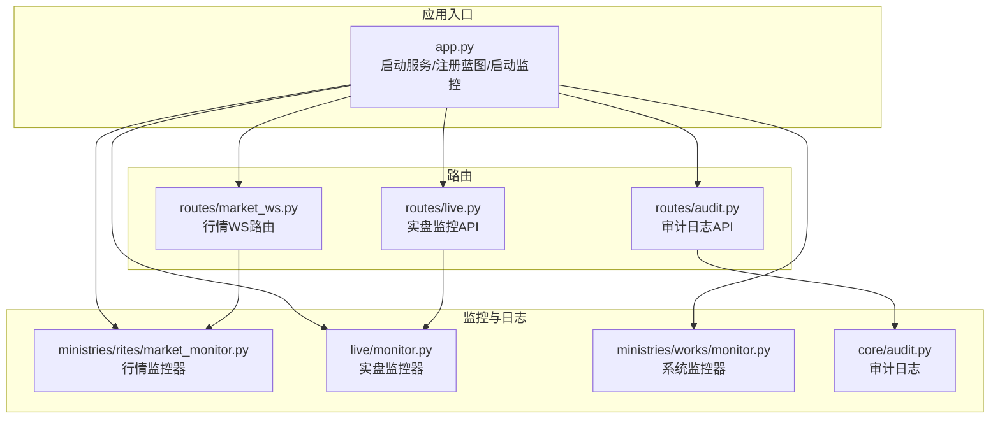
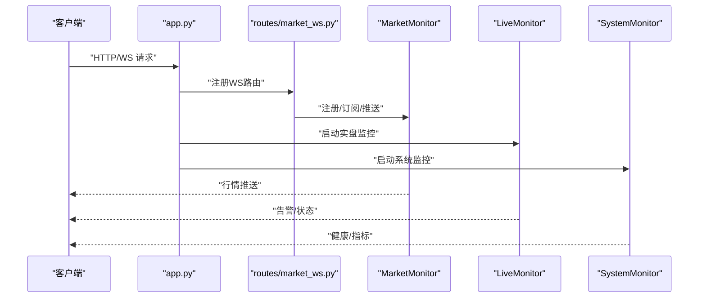
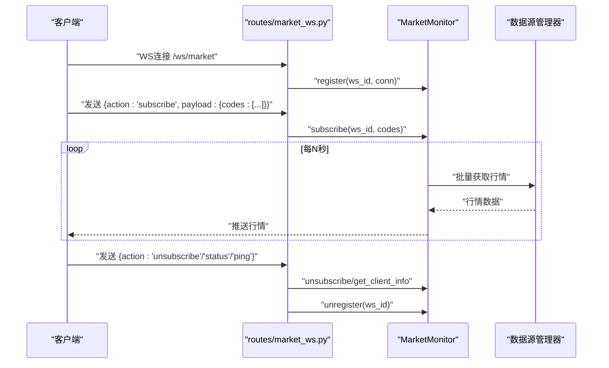
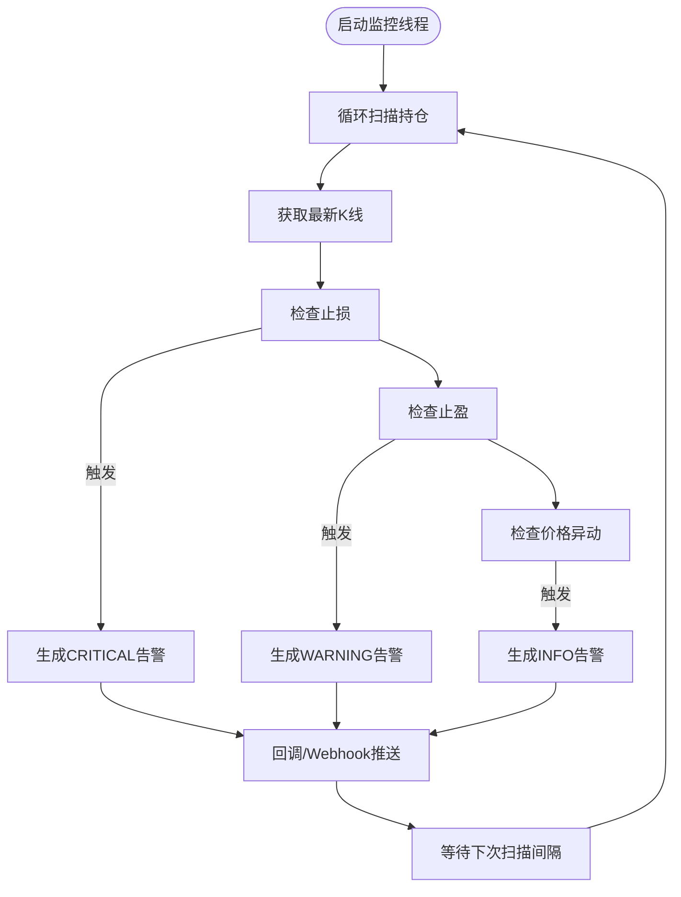
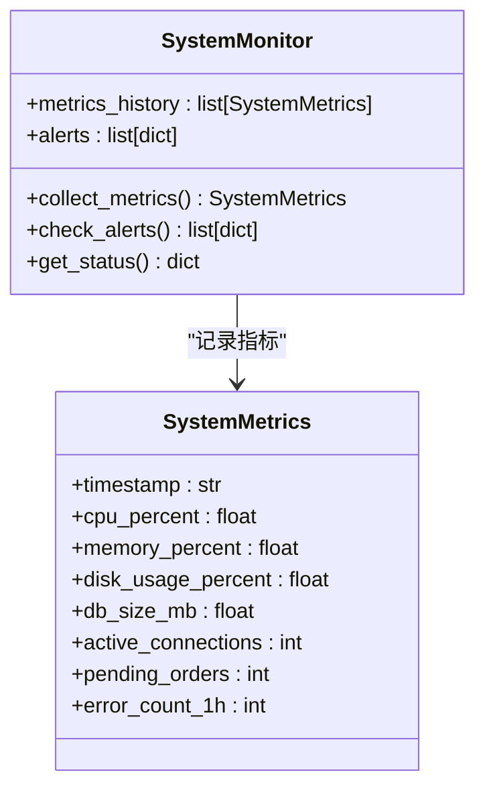
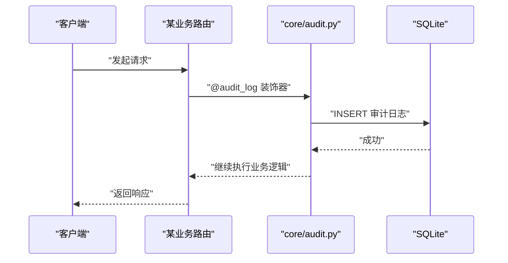
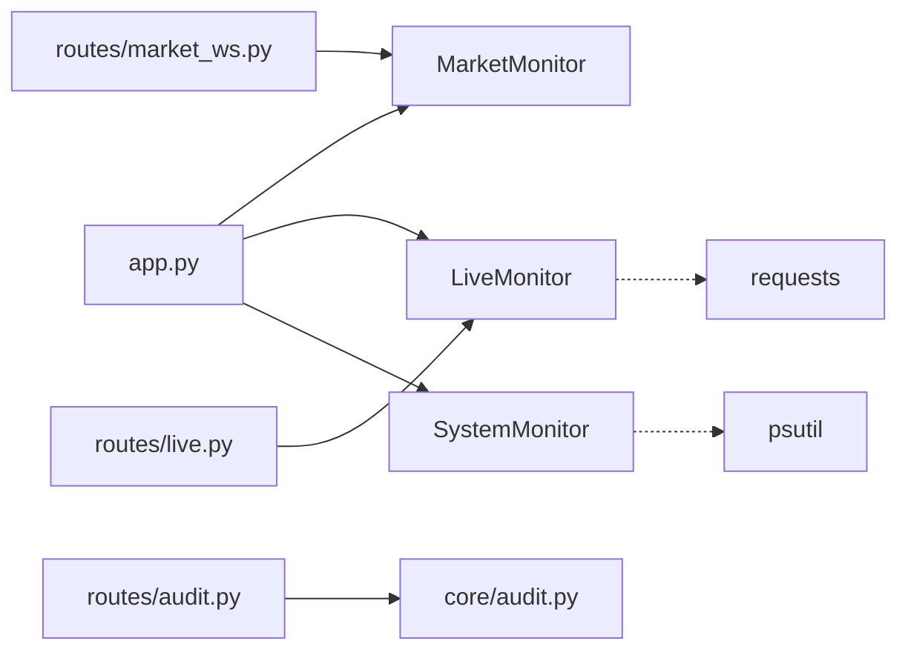

# 监控日志

<cite>
**本文引用的文件**
- [app.py](file://app.py)
- [config/settings.py](file://config/settings.py)
- [ministries/rites/market_monitor.py](file://ministries/rites/market_monitor.py)
- [routes/market_ws.py](file://routes/market_ws.py)
- [live/monitor.py](file://live/monitor.py)
- [routes/live.py](file://routes/live.py)
- [ministries/works/monitor.py](file://ministries/works/monitor.py)
- [core/audit.py](file://core/audit.py)
- [routes/audit.py](file://routes/audit.py)
- [.workbuddy/memory/MEMORY.md](file://.workbuddy/memory/MEMORY.md)
- [.workbuddy/memory/2026-05-02.md](file://.workbuddy/memory/2026-05-02.md)
</cite>

## 目录
1. [简介](#简介)
2. [项目结构](#项目结构)
3. [核心组件](#核心组件)
4. [架构总览](#架构总览)
5. [详细组件分析](#详细组件分析)
6. [依赖分析](#依赖分析)
7. [性能考虑](#性能考虑)
8. [故障排查指南](#故障排查指南)
9. [结论](#结论)
10. [附录](#附录)

## 简介
本指南面向AIQuant系统的监控与日志管理，覆盖实时行情监控、实盘策略监控、系统健康监控与审计日志四大维度。文档详细说明：
- 实时监控系统的配置与使用方法（行情监控、策略状态监控、系统健康监控）
- 日志记录级别与格式（INFO、WARNING、CRITICAL等）
- 内存管理记录的查看与分析（MEMORY.md与日期工作日志）
- 日志收集、存储与查询最佳实践
- 监控告警机制的配置与触发条件
- 性能指标监控与阈值设置
- 日志分析工具与可视化报表使用说明
- 日志轮转与清理策略

## 项目结构
AIQuant采用“三省六部”组织架构，监控与日志相关的关键模块分布如下：
- 礼部（ministries/rites）：负责实时行情监控与WebSocket推送
- 工部（ministries/works）：负责系统健康与性能指标采集
- 实盘监控（live）：负责实盘持仓扫描、风控告警与Webhook推送
- 审计日志（core/audit.py + routes/audit.py）：统一审计日志记录与查询
- 应用入口（app.py）：注册蓝图、启动监控线程、提供健康检查端点
- 配置（config/settings.py）：基础配置，含日志级别

**图表来源**
- [app.py:148-164](file://app.py#L148-L164)
- [ministries/rites/market_monitor.py:21-36](file://ministries/rites/market_monitor.py#L21-L36)
- [live/monitor.py:55-67](file://live/monitor.py#L55-L67)
- [ministries/works/monitor.py:29-35](file://ministries/works/monitor.py#L29-L35)
- [routes/market_ws.py:17-24](file://routes/market_ws.py#L17-L24)
- [routes/live.py:18-19](file://routes/live.py#L18-L19)
- [routes/audit.py:13-13](file://routes/audit.py#L13-L13)

**章节来源**
- [app.py:148-164](file://app.py#L148-L164)
- [config/settings.py:23-25](file://config/settings.py#L23-L25)

## 核心组件
- 行情监控器（MarketMonitor）：维护WebSocket客户端连接、订阅管理、定时拉取并推送行情
- 实盘监控器（LiveMonitor）：定时扫描持仓、检查止损/止盈/价格异动、产生告警并支持Webhook推送
- 系统监控器（SystemMonitor）：采集CPU/内存/磁盘/数据库大小等指标，检查阈值并生成告警
- 审计日志（Audit）：统一记录操作行为，支持装饰器自动记录与查询统计

**章节来源**
- [ministries/rites/market_monitor.py:21-36](file://ministries/rites/market_monitor.py#L21-L36)
- [live/monitor.py:55-67](file://live/monitor.py#L55-L67)
- [ministries/works/monitor.py:29-35](file://ministries/works/monitor.py#L29-L35)
- [core/audit.py:16-39](file://core/audit.py#L16-L39)

## 架构总览
AIQuant的监控与日志体系以应用入口为中心，通过蓝图注册各监控模块与API路由，形成“监控器 + 路由 + 日志”的闭环。

**图表来源**
- [app.py:61-75](file://app.py#L61-L75)
- [routes/market_ws.py:67-123](file://routes/market_ws.py#L67-L123)
- [ministries/rites/market_monitor.py:108-132](file://ministries/rites/market_monitor.py#L108-L132)
- [live/monitor.py:70-99](file://live/monitor.py#L70-L99)
- [ministries/works/monitor.py:36-61](file://ministries/works/monitor.py#L36-L61)

## 详细组件分析

### 实时行情监控（WebSocket）
- 功能要点
  - 客户端注册/注销、订阅/取消订阅管理
  - 定时批量拉取行情并推送至订阅者
  - 广播系统事件（连接/断开）
- 关键API
  - GET /api/market/status：获取监控状态
  - GET /api/market/clients：获取客户端列表
  - POST /api/market/start：手动启动推送
  - POST /api/market/stop：手动停止推送
  - WS /ws/market：行情推送通道
- 配置与行为
  - 默认推送间隔可在构造函数中设置
  - 批量拉取每次最多10只股票，避免过载
  - 异常打印日志，不影响其他订阅者

**图表来源**
- [routes/market_ws.py:72-123](file://routes/market_ws.py#L72-L123)
- [ministries/rites/market_monitor.py:39-94](file://ministries/rites/market_monitor.py#L39-L94)
- [ministries/rites/market_monitor.py:133-174](file://ministries/rites/market_monitor.py#L133-L174)

**章节来源**
- [routes/market_ws.py:26-65](file://routes/market_ws.py#L26-L65)
- [routes/market_ws.py:72-123](file://routes/market_ws.py#L72-L123)
- [ministries/rites/market_monitor.py:21-36](file://ministries/rites/market_monitor.py#L21-L36)

### 实盘策略监控（LiveMonitor）
- 功能要点
  - 定时扫描持有中的持仓
  - 检查止损、止盈、价格异动阈值
  - 生成告警记录，支持回调与Webhook推送
  - 提供状态查询、告警列表、解决与清空
- 关键API
  - GET /api/live/status：监控状态
  - POST /api/live/start：启动监控
  - POST /api/live/stop：停止监控
  - GET /api/live/alerts：告警列表（支持过滤/限制）
  - POST /api/live/alerts/<id>/resolve：解决告警
  - POST /api/live/alerts/clear：清空告警
  - POST /api/live/config：更新监控配置（含Webhook）
- 配置项
  - 止损阈值、止盈阈值、价格异动阈值、扫描间隔、最大告警数、Webhook地址
- 告警等级
  - INFO：价格异动
  - WARNING：止盈触发
  - CRITICAL：止损触发

**图表来源**
- [live/monitor.py:91-155](file://live/monitor.py#L91-L155)
- [live/monitor.py:158-197](file://live/monitor.py#L158-L197)
- [routes/live.py:22-126](file://routes/live.py#L22-L126)

**章节来源**
- [routes/live.py:22-126](file://routes/live.py#L22-L126)
- [live/monitor.py:44-53](file://live/monitor.py#L44-L53)
- [live/monitor.py:24-29](file://live/monitor.py#L24-L29)

### 系统健康监控（SystemMonitor）
- 功能要点
  - 采集CPU/内存/磁盘使用率与数据库大小
  - 历史指标保留最近24小时（每分钟一条）
  - 检查阈值并生成告警（CPU>80%、内存>85%、磁盘>90%）
  - 提供健康状态摘要与告警计数
- 阈值与指标
  - CPU使用率>80%：warning
  - 内存使用率>85%：warning
  - 磁盘使用率>90%：critical
  - 数据库大小：MB

**图表来源**
- [ministries/works/monitor.py:16-27](file://ministries/works/monitor.py#L16-L27)
- [ministries/works/monitor.py:29-114](file://ministries/works/monitor.py#L29-L114)

**章节来源**
- [ministries/works/monitor.py:62-84](file://ministries/works/monitor.py#L62-L84)
- [ministries/works/monitor.py:86-101](file://ministries/works/monitor.py#L86-L101)

### 审计日志（Audit）
- 功能要点
  - 统一日志记录：操作类型、资源、详情、用户、IP、结果
  - 装饰器自动记录API调用耗时与结果状态
  - 提供日志查询与统计（今日操作数、操作类型Top、近7日趋势）
- 关键API
  - GET /api/audit/logs：分页查询（支持action/user_id过滤）
  - GET /api/audit/stats：统计信息

**图表来源**
- [core/audit.py:41-92](file://core/audit.py#L41-L92)
- [routes/audit.py:16-38](file://routes/audit.py#L16-L38)

**章节来源**
- [core/audit.py:16-39](file://core/audit.py#L16-L39)
- [core/audit.py:107-147](file://core/audit.py#L107-L147)
- [routes/audit.py:41-79](file://routes/audit.py#L41-L79)

## 依赖分析
- 组件耦合
  - app.py作为入口，分别启动MarketMonitor与LiveMonitor
  - routes/market_ws.py依赖MarketMonitor
  - routes/live.py依赖LiveMonitor
  - routes/audit.py依赖core/audit.py
- 外部依赖
  - psutil用于系统指标采集
  - requests用于Webhook推送
  - flask/flask-sock用于HTTP/WS路由

**图表来源**
- [app.py:154-161](file://app.py#L154-L161)
- [routes/market_ws.py:15-23](file://routes/market_ws.py#L15-L23)
- [routes/live.py:16-19](file://routes/live.py#L16-L19)
- [routes/audit.py:11-11](file://routes/audit.py#L11-L11)
- [ministries/works/monitor.py:39-46](file://ministries/works/monitor.py#L39-L46)
- [live/monitor.py:262-273](file://live/monitor.py#L262-L273)

**章节来源**
- [app.py:154-161](file://app.py#L154-L161)
- [ministries/works/monitor.py:39-46](file://ministries/works/monitor.py#L39-L46)
- [live/monitor.py:262-273](file://live/monitor.py#L262-L273)

## 性能考虑
- 行情推送
  - 批量拉取：每次最多10只股票，降低接口压力
  - 间隔控制：默认5秒，可根据网络与服务器负载调整
- 实盘监控
  - 扫描间隔默认30秒，可通过配置调整
  - 单股告警频率限制，避免重复告警风暴
- 系统监控
  - 指标历史保留1440条（24小时），占用内存有限
  - 阈值设置适中，兼顾稳定性与预警及时性
- 日志级别
  - 基础配置提供日志级别（INFO），便于生产环境控制输出

**章节来源**
- [ministries/rites/market_monitor.py:141-145](file://ministries/rites/market_monitor.py#L141-L145)
- [live/monitor.py:48-51](file://live/monitor.py#L48-L51)
- [ministries/works/monitor.py:56-58](file://ministries/works/monitor.py#L56-L58)
- [config/settings.py:24-25](file://config/settings.py#L24-L25)

## 故障排查指南
- WebSocket连接异常
  - 现象：客户端无法订阅或接收行情
  - 排查：确认WS路由已注册、监控器已启动、客户端消息格式正确
  - 参考：routes/market_ws.py中的注册与消息解析
- 实盘监控无告警
  - 现象：持仓变化未触发告警
  - 排查：检查配置阈值、扫描间隔、Webhook地址是否正确
  - 参考：routes/live.py配置更新与告警生成逻辑
- 系统健康告警频繁
  - 现象：CPU/内存/磁盘持续告警
  - 排查：检查服务器资源、数据库大小增长、并发任务数
  - 参考：SystemMonitor阈值与指标采集
- 审计日志缺失
  - 现象：某些API未记录审计日志
  - 排查：确认使用了@audit_log装饰器、数据库连接正常
  - 参考：core/audit.py装饰器与查询API

**章节来源**
- [routes/market_ws.py:125-142](file://routes/market_ws.py#L125-L142)
- [routes/live.py:94-126](file://routes/live.py#L94-L126)
- [ministries/works/monitor.py:62-84](file://ministries/works/monitor.py#L62-L84)
- [core/audit.py:41-92](file://core/audit.py#L41-L92)

## 结论
AIQuant的监控与日志体系以模块化设计实现“行情、策略、系统、审计”四维监控，配合清晰的API与阈值配置，能够满足生产环境的可观测性需求。建议结合业务场景对阈值与推送策略进行定制，并建立定期巡检与日志轮转机制，保障系统稳定运行。

## 附录

### 日志级别与格式
- 日志级别
  - INFO：一般性信息（如行情推送异常、告警触发）
  - WARNING：警告（如止损触发、CPU/内存使用率偏高）
  - CRITICAL：严重问题（如止损触发）
- 日志格式
  - 实时监控：包含告警等级、类别、消息、时间戳
  - 系统监控：包含指标名称、数值、告警级别
  - 审计日志：包含操作类型、资源、详情、用户、IP、结果、时间

**章节来源**
- [live/monitor.py:24-29](file://live/monitor.py#L24-L29)
- [ministries/works/monitor.py:62-84](file://ministries/works/monitor.py#L62-L84)
- [core/audit.py:16-39](file://core/audit.py#L16-L39)

### 内存管理记录解读（MEMORY.md与日期工作日志）
- MEMORY.md
  - 记录项目版本、模块完成情况、API端点、注意事项等
  - 用于宏观理解项目现状与功能范围
- 日期工作日志（如2026-05-02.md）
  - 记录当日完成的功能、修复与增强
  - 包含LLM接入、策略部署、数据可视化升级等内容
  - 有助于定位近期变更对监控的影响

**章节来源**
- [.workbuddy/memory/MEMORY.md:1-134](file://.workbuddy/memory/MEMORY.md#L1-L134)
- [.workbuddy/memory/2026-05-02.md:1-99](file://.workbuddy/memory/2026-05-02.md#L1-L99)

### 日志收集、存储与查询最佳实践
- 日志收集
  - 使用基础日志级别（INFO）控制输出规模
  - 对关键路径（如Webhook推送、异常捕获）保留必要日志
- 存储
  - 审计日志存储于SQLite数据库，建议定期备份
  - 系统指标历史仅保留最近24小时，避免无限增长
- 查询
  - 审计日志支持按action、user_id分页过滤
  - 告警列表支持按股票、等级、活跃状态过滤与限制数量

**章节来源**
- [config/settings.py:24-25](file://config/settings.py#L24-L25)
- [routes/audit.py:16-38](file://routes/audit.py#L16-L38)
- [ministries/works/monitor.py:56-58](file://ministries/works/monitor.py#L56-L58)

### 监控告警机制配置与触发条件
- 实盘监控
  - 触发条件：浮亏达到止损阈值（默认-6%）、浮盈达到止盈阈值（默认+15%）、当日涨跌幅达到价格异动阈值（默认±7%）
  - 触发后生成告警并可推送Webhook
- 系统监控
  - 触发条件：CPU>80%（warning）、内存>85%（warning）、磁盘>90%（critical）
- 告警处理
  - 支持回调与Webhook推送
  - 提供解决与清空操作，便于人工干预与恢复

**章节来源**
- [live/monitor.py:47-51](file://live/monitor.py#L47-L51)
- [live/monitor.py:121-148](file://live/monitor.py#L121-L148)
- [ministries/works/monitor.py:71-81](file://ministries/works/monitor.py#L71-L81)

### 性能指标监控与阈值设置
- 指标
  - CPU使用率、内存使用率、磁盘使用率、数据库大小
- 阈值
  - CPU>80%：warning
  - 内存>85%：warning
  - 磁盘>90%：critical
- 建议
  - 根据服务器规格与业务负载调整阈值
  - 结合历史指标趋势进行容量规划

**章节来源**
- [ministries/works/monitor.py:62-84](file://ministries/works/monitor.py#L62-L84)

### 日志分析工具与可视化报表
- 审计统计
  - 今日操作数、操作类型Top、近7日趋势
- 可视化建议
  - 使用ECharts集成图表（资产曲线、持仓饼图、盈亏柱状图、风险仪表盘、回撤图、特征重要性）
  - 将系统指标与告警事件叠加展示，辅助定位问题

**章节来源**
- [routes/audit.py:41-79](file://routes/audit.py#L41-L79)
- [.workbuddy/memory/MEMORY.md:20-27](file://.workbuddy/memory/MEMORY.md#L20-L27)

### 日志轮转与清理策略
- 审计日志
  - 建议定期归档与压缩旧数据，避免数据库膨胀
- 系统指标
  - 历史仅保留24小时，天然具备清理效果
- 建议
  - 配置外部日志系统（如logrotate）进行文件轮转
  - 对Webhook推送失败的日志进行重试与死信队列处理

**章节来源**
- [ministries/works/monitor.py:56-58](file://ministries/works/monitor.py#L56-L58)