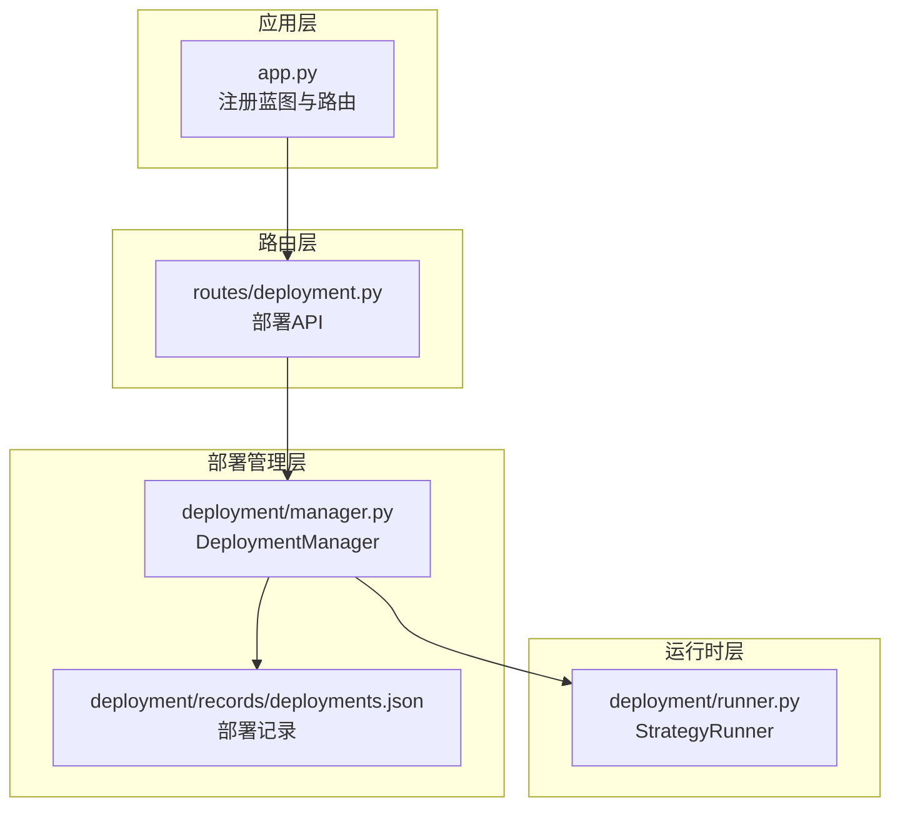
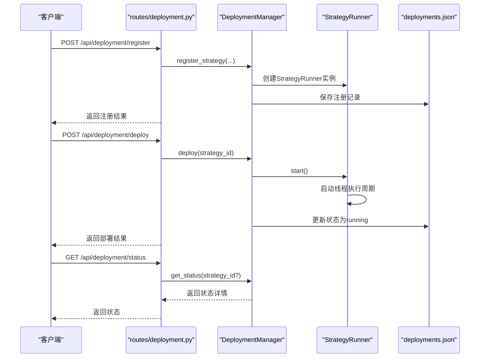
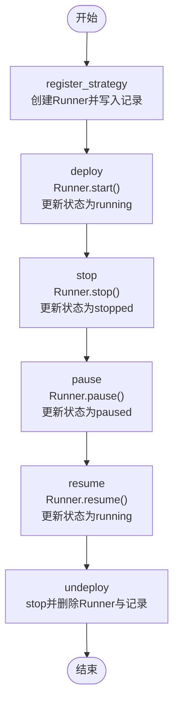
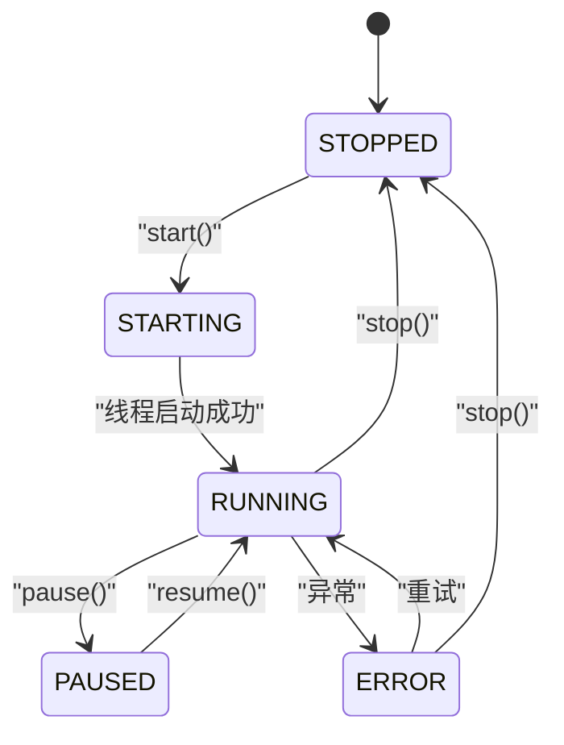
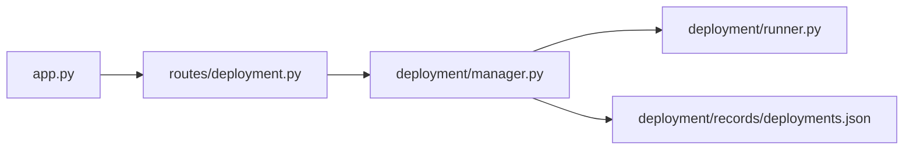

# 部署管理

<cite>
**本文引用的文件**
- [deployment/manager.py](file://deployment/manager.py)
- [deployment/runner.py](file://deployment/runner.py)
- [deployment/records/deployments.json](file://deployment/records/deployments.json)
- [routes/deployment.py](file://routes/deployment.py)
- [app.py](file://app.py)
- [quant.py](file://quant.py)
- [config/settings.py](file://config/settings.py)
- [config/strategies/default.yaml](file://config/strategies/default.yaml)
- [config/risk_config.yaml](file://config/risk_config.yaml)
</cite>

## 目录
1. [简介](#简介)
2. [项目结构](#项目结构)
3. [核心组件](#核心组件)
4. [架构总览](#架构总览)
5. [组件详解](#组件详解)
6. [依赖关系分析](#依赖关系分析)
7. [性能与可靠性](#性能与可靠性)
8. [故障排查指南](#故障排查指南)
9. [结论](#结论)
10. [附录](#附录)

## 简介
本文件面向AIQuant系统的部署管理，围绕“策略部署管理器”和“策略运行时”两大核心模块，提供从策略注册、部署启动、暂停/恢复、停止、注销，到状态监控、配置热更新、内容更新、部署记录持久化与加载的完整指导。同时给出批量部署与自动化部署的实现思路，并提供部署脚本与命令行工具的使用说明，帮助用户在生产环境中安全、稳定地管理实盘策略生命周期。

## 项目结构
AIQuant的部署管理位于deployment目录，配合routes层暴露HTTP接口，app.py注册蓝图，形成“API路由 -> 管理器 -> 运行时”的清晰分层。

图表来源
- [app.py:36](file://app.py#L36)
- [routes/deployment.py:17](file://routes/deployment.py#L17)
- [deployment/manager.py:24](file://deployment/manager.py#L24)
- [deployment/runner.py:44](file://deployment/runner.py#L44)
- [deployment/records/deployments.json:1](file://deployment/records/deployments.json#L1)

章节来源
- [app.py:36](file://app.py#L36)
- [routes/deployment.py:17](file://routes/deployment.py#L17)
- [deployment/manager.py:24](file://deployment/manager.py#L24)
- [deployment/runner.py:44](file://deployment/runner.py#L44)
- [deployment/records/deployments.json:1](file://deployment/records/deployments.json#L1)

## 核心组件
- DeploymentManager：策略注册、部署、启停、暂停/恢复、注销、状态查询、配置热更新、内容更新、记录持久化与加载。
- StrategyRunner：策略运行时，负责在独立线程中定时执行策略函数、状态机管理、统计指标、日志与错误处理。
- routes/deployment.py：对外HTTP接口，封装DeploymentManager的所有操作。
- deployments.json：部署记录文件，保存每个策略的注册/部署信息与状态。

章节来源
- [deployment/manager.py:24](file://deployment/manager.py#L24)
- [deployment/runner.py:44](file://deployment/runner.py#L44)
- [routes/deployment.py:17](file://routes/deployment.py#L17)
- [deployment/records/deployments.json:1](file://deployment/records/deployments.json#L1)

## 架构总览
部署管理采用“管理器 + 运行时 + 路由 + 文件记录”的分层设计，管理器持有运行时实例与部署记录，运行时在独立线程中执行策略函数，路由提供REST接口，记录文件持久化部署状态。

图表来源
- [routes/deployment.py:22](file://routes/deployment.py#L22)
- [deployment/manager.py:32](file://deployment/manager.py#L32)
- [deployment/manager.py:67](file://deployment/manager.py#L67)
- [deployment/runner.py:69](file://deployment/runner.py#L69)
- [deployment/records/deployments.json:1](file://deployment/records/deployments.json#L1)

## 组件详解

### 策略部署管理器（DeploymentManager）
职责与能力
- 策略注册：创建StrategyRunner实例，写入初始部署记录。
- 部署启动：调用Runner.start()，更新状态为running并持久化。
- 停止/暂停/恢复：委托Runner对应方法，更新状态并持久化。
- 注销：停止并移除Runner与部署记录。
- 状态查询：支持单个与全局状态聚合。
- 配置热更新：更新Runner配置并合并到记录。
- 内容更新：更新策略内容文本并持久化。
- 记录持久化与加载：deployments.json文件的读写。

关键流程图（注册/部署/停止/注销）

图表来源
- [deployment/manager.py:32](file://deployment/manager.py#L32)
- [deployment/manager.py:67](file://deployment/manager.py#L67)
- [deployment/manager.py:84](file://deployment/manager.py#L84)
- [deployment/manager.py:97](file://deployment/manager.py#L97)
- [deployment/manager.py:108](file://deployment/manager.py#L108)
- [deployment/manager.py:119](file://deployment/manager.py#L119)

章节来源
- [deployment/manager.py:24](file://deployment/manager.py#L24)
- [deployment/manager.py:32](file://deployment/manager.py#L32)
- [deployment/manager.py:67](file://deployment/manager.py#L67)
- [deployment/manager.py:84](file://deployment/manager.py#L84)
- [deployment/manager.py:97](file://deployment/manager.py#L97)
- [deployment/manager.py:108](file://deployment/manager.py#L108)
- [deployment/manager.py:119](file://deployment/manager.py#L119)
- [deployment/manager.py:130](file://deployment/manager.py#L130)
- [deployment/manager.py:154](file://deployment/manager.py#L154)
- [deployment/manager.py:164](file://deployment/manager.py#L164)
- [deployment/manager.py:174](file://deployment/manager.py#L174)
- [deployment/manager.py:186](file://deployment/manager.py#L186)
- [deployment/manager.py:195](file://deployment/manager.py#L195)

### 策略运行时（StrategyRunner）
职责与能力
- 线程化执行：独立线程中循环执行策略函数，支持间隔控制。
- 状态机：STOPPED/STARTING/RUNNING/PAUSED/ERROR五态转换。
- 统计指标：信号数、交易数、胜/负、总收益、最大回撤、错误计数与日志。
- 日志与错误：记录运行日志，异常捕获并进入ERROR态。
- 配置与内容热更新：线程安全更新config与strategy_content。

状态机图

图表来源
- [deployment/runner.py:21](file://deployment/runner.py#L21)
- [deployment/runner.py:69](file://deployment/runner.py#L69)
- [deployment/runner.py:82](file://deployment/runner.py#L82)
- [deployment/runner.py:93](file://deployment/runner.py#L93)
- [deployment/runner.py:102](file://deployment/runner.py#L102)
- [deployment/runner.py:111](file://deployment/runner.py#L111)

章节来源
- [deployment/runner.py:44](file://deployment/runner.py#L44)
- [deployment/runner.py:69](file://deployment/runner.py#L69)
- [deployment/runner.py:82](file://deployment/runner.py#L82)
- [deployment/runner.py:93](file://deployment/runner.py#L93)
- [deployment/runner.py:102](file://deployment/runner.py#L102)
- [deployment/runner.py:111](file://deployment/runner.py#L111)
- [deployment/runner.py:133](file://deployment/runner.py#L133)
- [deployment/runner.py:148](file://deployment/runner.py#L148)
- [deployment/runner.py:159](file://deployment/runner.py#L159)
- [deployment/runner.py:171](file://deployment/runner.py#L171)
- [deployment/runner.py:177](file://deployment/runner.py#L177)

### 部署记录（deployments.json）
- 存储位置：deployment/records/deployments.json
- 字段说明：
  - strategy_id：策略标识
  - strategy_name：策略名称
  - interval：执行间隔（秒）
  - config：策略配置字典
  - strategy_content：策略内容文本
  - registered_at：注册时间
  - deployed_at：部署时间
  - status：registered/running/stopped/paused
- 加载与保存：启动时加载，每次状态变更后保存。

章节来源
- [deployment/records/deployments.json:1](file://deployment/records/deployments.json#L1)
- [deployment/manager.py:186](file://deployment/manager.py#L186)
- [deployment/manager.py:195](file://deployment/manager.py#L195)

### HTTP路由（routes/deployment.py）
- 提供注册、部署、停止、暂停、恢复、注销、状态查询、配置热更新、内容获取/更新等接口。
- 请求体字段：register/deploy/stop/pause/resume/undeploy/status/config/content等。
- 返回体：统一包含success与status/error等键。

章节来源
- [routes/deployment.py:22](file://routes/deployment.py#L22)
- [routes/deployment.py:44](file://routes/deployment.py#L44)
- [routes/deployment.py:56](file://routes/deployment.py#L56)
- [routes/deployment.py:68](file://routes/deployment.py#L68)
- [routes/deployment.py:80](file://routes/deployment.py#L80)
- [routes/deployment.py:92](file://routes/deployment.py#L92)
- [routes/deployment.py:104](file://routes/deployment.py#L104)
- [routes/deployment.py:112](file://routes/deployment.py#L112)
- [routes/deployment.py:125](file://routes/deployment.py#L125)
- [routes/deployment.py:136](file://routes/deployment.py#L136)

## 依赖关系分析
- routes/deployment.py依赖deployment/manager.py提供的单例管理器。
- deployment/manager.py依赖deployment/runner.py的运行时类。
- deployment/manager.py依赖文件系统进行deployments.json的读写。
- app.py注册deployment蓝图，使HTTP接口可用。

图表来源
- [routes/deployment.py:17](file://routes/deployment.py#L17)
- [deployment/manager.py:17](file://deployment/manager.py#L17)
- [app.py:36](file://app.py#L36)

章节来源
- [routes/deployment.py:17](file://routes/deployment.py#L17)
- [deployment/manager.py:17](file://deployment/manager.py#L17)
- [app.py:36](file://app.py#L36)

## 性能与可靠性
- 线程模型：StrategyRunner在守护线程中运行，避免主线程阻塞；线程安全通过锁保护配置与内容更新。
- 错误处理：运行时异常被捕获并记录，状态切换至ERROR，等待重试或手动干预。
- 日志与统计：内置日志队列与统计指标，便于监控与审计。
- 配置热更新：支持增量更新，无需重启策略即可生效。
- 文件IO：部署记录采用JSON序列化，异常时打印错误但不影响运行。

章节来源
- [deployment/runner.py:69](file://deployment/runner.py#L69)
- [deployment/runner.py:111](file://deployment/runner.py#L111)
- [deployment/runner.py:148](file://deployment/runner.py#L148)
- [deployment/manager.py:186](file://deployment/manager.py#L186)
- [deployment/manager.py:195](file://deployment/manager.py#L195)

## 故障排查指南
常见问题与处理
- 策略未注册即部署：返回错误提示“策略未注册”，先调用注册接口。
- 策略已在运行仍部署：返回错误提示“策略已在运行中”，先停止或暂停。
- 停止失败：可能已处于停止态，返回“停止失败（可能已停止）”，检查状态后重试。
- 运行异常：查看运行时日志与错误计数，定位异常原因并修复。
- 记录保存失败：管理器会打印错误信息，检查磁盘权限与路径。

章节来源
- [deployment/manager.py:67](file://deployment/manager.py#L67)
- [deployment/manager.py:84](file://deployment/manager.py#L84)
- [deployment/runner.py:121](file://deployment/runner.py#L121)
- [deployment/runner.py:148](file://deployment/runner.py#L148)

## 结论
AIQuant的部署管理以“管理器 + 运行时 + 路由 + 记录文件”为核心，提供了完整的策略生命周期管理能力。通过HTTP接口与文件持久化，用户可以便捷地进行策略注册、部署、启停、暂停/恢复、注销与状态监控，并支持配置与内容的热更新。结合本指南的最佳实践与故障排查方法，可在生产环境中安全、稳定地管理实盘策略。

## 附录

### 策略生命周期最佳实践
- 注册阶段：明确strategy_id与strategy_name，合理设置interval与初始config。
- 部署阶段：先注册，再部署；部署后立即查询状态，确认running。
- 运行阶段：定期监控状态与日志；必要时暂停观察，再恢复。
- 配置热更新：优先使用增量更新，避免覆盖关键参数；更新后验证策略行为。
- 内容更新：更新策略内容文本，便于审计与回溯。
- 停止/注销：停止后再注销，确保资源释放；注销后记录文件会被清理。

章节来源
- [deployment/manager.py:32](file://deployment/manager.py#L32)
- [deployment/manager.py:67](file://deployment/manager.py#L67)
- [deployment/manager.py:154](file://deployment/manager.py#L154)
- [deployment/manager.py:164](file://deployment/manager.py#L164)
- [deployment/runner.py:159](file://deployment/runner.py#L159)

### 部署状态监控与故障处理
- 状态查询：GET /api/deployment/status，支持strategy_id参数或全量查询。
- 日志查看：运行时最近日志与错误日志可用于快速定位问题。
- 故障处理：ERROR态时先修复异常，再尝试resume或重新deploy；必要时stop后重新start。

章节来源
- [routes/deployment.py:104](file://routes/deployment.py#L104)
- [deployment/runner.py:159](file://deployment/runner.py#L159)
- [deployment/runner.py:121](file://deployment/runner.py#L121)

### 批量部署与自动化部署
- 批量注册：通过循环调用注册接口，传入不同strategy_id与config。
- 批量部署：注册完成后，循环调用部署接口，控制并发与限速。
- 自动化脚本：编写Python脚本或Shell脚本，按顺序执行注册、部署、状态校验。
- 配置与内容：通过批量上传策略内容与配置，结合热更新接口动态下发。

章节来源
- [routes/deployment.py:22](file://routes/deployment.py#L22)
- [routes/deployment.py:44](file://routes/deployment.py#L44)
- [routes/deployment.py:112](file://routes/deployment.py#L112)
- [routes/deployment.py:136](file://routes/deployment.py#L136)

### 部署脚本与命令行工具使用说明
- 启动后端服务：通过app.py启动Flask服务，默认监听0.0.0.0:5000。
- 健康检查：GET /api/health，确认服务可用。
- 策略管理：使用HTTP客户端或curl调用部署API，完成注册、部署、启停、暂停/恢复、注销、状态查询、配置热更新、内容更新与获取。
- 配置文件：策略参数与风控规则位于config目录，支持热加载；部署记录位于deployment/records/deployments.json。

章节来源
- [app.py:148](file://app.py#L148)
- [app.py:131](file://app.py#L131)
- [routes/deployment.py:22](file://routes/deployment.py#L22)
- [routes/deployment.py:44](file://routes/deployment.py#L44)
- [routes/deployment.py:104](file://routes/deployment.py#L104)
- [routes/deployment.py:112](file://routes/deployment.py#L112)
- [routes/deployment.py:136](file://routes/deployment.py#L136)
- [config/settings.py:11](file://config/settings.py#L11)
- [config/strategies/default.yaml:1](file://config/strategies/default.yaml#L1)
- [config/risk_config.yaml:1](file://config/risk_config.yaml#L1)
- [deployment/records/deployments.json:1](file://deployment/records/deployments.json#L1)