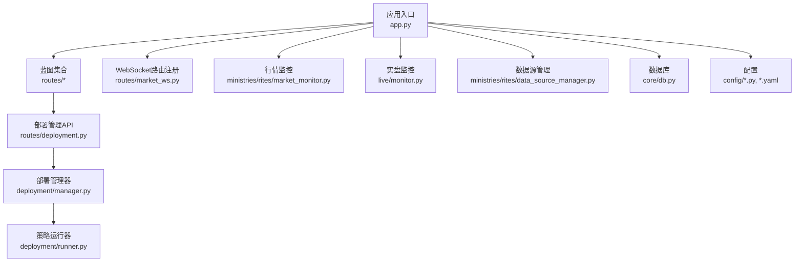
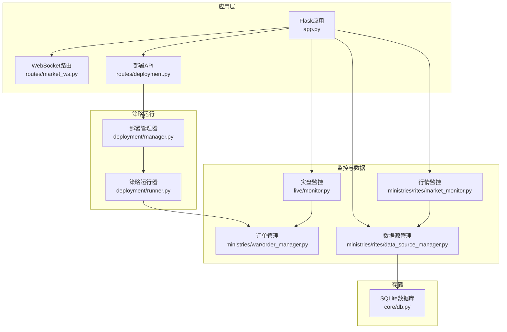
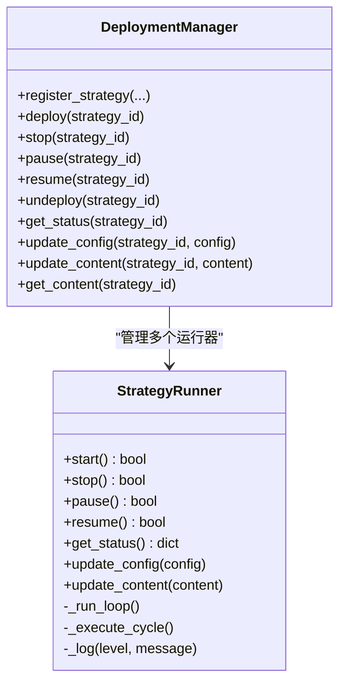
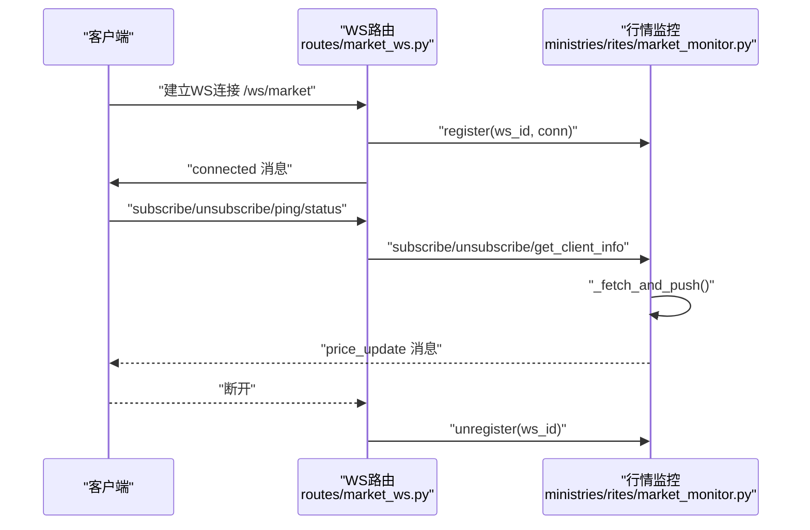
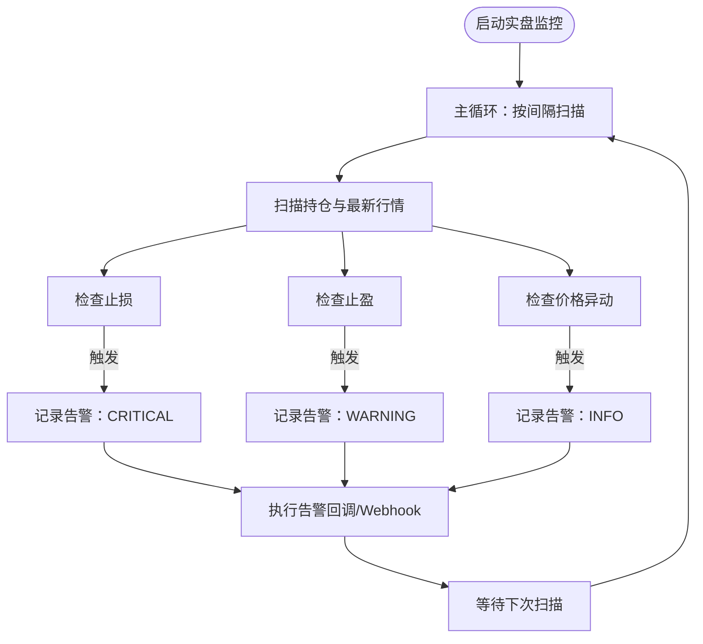
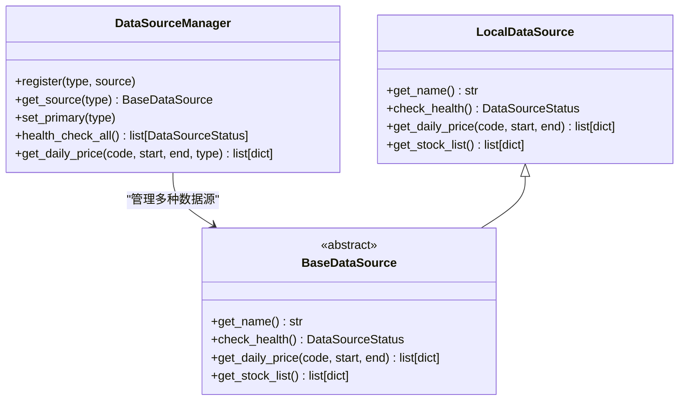
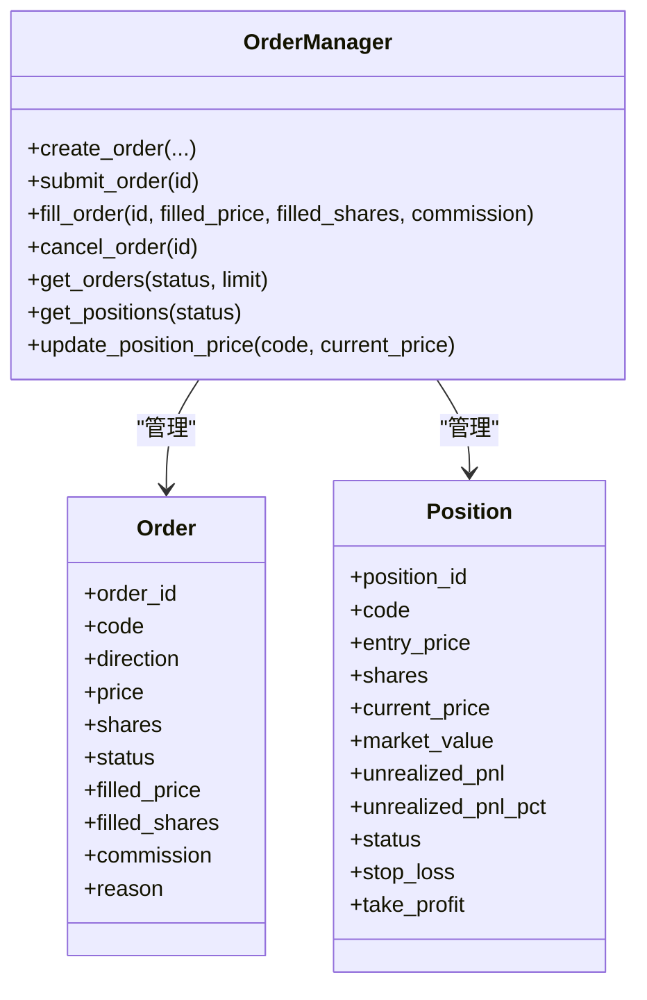
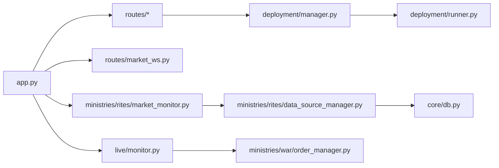

# 部署运维

<cite>
**本文引用的文件**   
- [README.md](file://README.md)
- [requirements.txt](file://requirements.txt)
- [app.py](file://app.py)
- [deployment/manager.py](file://deployment/manager.py)
- [deployment/runner.py](file://deployment/runner.py)
- [routes/deployment.py](file://routes/deployment.py)
- [config/settings.py](file://config/settings.py)
- [config/llm_config.yaml](file://config/llm_config.yaml)
- [config/risk_config.yaml](file://config/risk_config.yaml)
- [config/strategy_params.py](file://config/strategy_params.py)
- [ministries/rites/market_monitor.py](file://ministries/rites/market_monitor.py)
- [routes/market_ws.py](file://routes/market_ws.py)
- [ministries/rites/data_source_manager.py](file://ministries/rites/data_source_manager.py)
- [ministries/war/order_manager.py](file://ministries/war/order_manager.py)
- [live/monitor.py](file://live/monitor.py)
- [core/db.py](file://core/db.py)
- [install.bat](file://install.bat)
- [start.bat](file://start.bat)
</cite>

## 目录
1. [简介](#简介)
2. [项目结构](#项目结构)
3. [核心组件](#核心组件)
4. [架构总览](#架构总览)
5. [详细组件分析](#详细组件分析)
6. [依赖关系分析](#依赖关系分析)
7. [性能与资源优化](#性能与资源优化)
8. [监控与日志管理](#监控与日志管理)
9. [故障排查指南](#故障排查指南)
10. [备份与恢复、高可用与灾备](#备份与恢复高可用与灾备)
11. [版本发布、滚动更新与回滚](#版本发布滚动更新与回滚)
12. [运维自动化与工具](#运维自动化与工具)
13. [结论](#结论)

## 简介
本文件面向AIQuant系统的生产环境部署与运维，覆盖环境准备、依赖安装、配置设置、启动流程、容器化部署、监控与日志、故障排查、性能优化、备份恢复、高可用、版本发布与回滚、自动化运维等全链路运维主题。文档以仓库现有代码为依据，结合蓝图路由、策略部署管理器、WebSocket行情监控、实盘监控与风控、数据库与数据源管理等模块，形成可执行的操作手册与应急响应流程。

## 项目结构
AIQuant采用Python Flask后端，配合多模块子系统（“礼部”数据、“兵部”交易、“三省六部”治理等），并通过Blueprint组织API路由，提供仪表板、策略部署、实时行情、实盘监控等功能。

图表来源
- [app.py:1-164](file://app.py#L1-L164)
- [routes/deployment.py:1-147](file://routes/deployment.py#L1-L147)
- [deployment/manager.py:1-216](file://deployment/manager.py#L1-L216)
- [deployment/runner.py:1-182](file://deployment/runner.py#L1-L182)
- [routes/market_ws.py:1-142](file://routes/market_ws.py#L1-L142)
- [ministries/rites/market_monitor.py:1-244](file://ministries/rites/market_monitor.py#L1-L244)
- [live/monitor.py:1-286](file://live/monitor.py#L1-L286)
- [ministries/rites/data_source_manager.py:1-190](file://ministries/rites/data_source_manager.py#L1-L190)
- [core/db.py:1-800](file://core/db.py#L1-L800)
- [config/settings.py:1-25](file://config/settings.py#L1-L25)
- [config/llm_config.yaml:1-23](file://config/llm_config.yaml#L1-L23)
- [config/risk_config.yaml:1-170](file://config/risk_config.yaml#L1-L170)
- [config/strategy_params.py:1-76](file://config/strategy_params.py#L1-L76)

章节来源
- [README.md:1-3](file://README.md#L1-L3)
- [app.py:1-164](file://app.py#L1-L164)

## 核心组件
- 应用入口与蓝图注册：负责启动Flask应用、注册所有业务蓝图与WebSocket路由，并提供健康检查与静态页面路由。
- 部署管理器与策略运行器：提供策略注册、部署、启停、暂停/恢复、热更新配置与内容、状态查询等能力。
- 实时行情监控：基于WebSocket推送行情，维护订阅关系与客户端连接，定时批量拉取并推送行情。
- 实盘监控：定时扫描持仓，检查止损/止盈/价格异动，触发告警并支持Webhook推送。
- 数据源管理：抽象数据源接口，支持本地数据库为主数据源，提供健康检查与自动切换。
- 数据库：SQLite本地数据库，提供建表、迁移、批量写入、查询等能力。
- 配置体系：基础配置、LLM配置、风控配置、策略参数配置等。

章节来源
- [app.py:1-164](file://app.py#L1-L164)
- [deployment/manager.py:1-216](file://deployment/manager.py#L1-L216)
- [deployment/runner.py:1-182](file://deployment/runner.py#L1-L182)
- [routes/deployment.py:1-147](file://routes/deployment.py#L1-L147)
- [ministries/rites/market_monitor.py:1-244](file://ministries/rites/market_monitor.py#L1-L244)
- [routes/market_ws.py:1-142](file://routes/market_ws.py#L1-L142)
- [live/monitor.py:1-286](file://live/monitor.py#L1-L286)
- [ministries/rites/data_source_manager.py:1-190](file://ministries/rites/data_source_manager.py#L1-L190)
- [core/db.py:1-800](file://core/db.py#L1-L800)
- [config/settings.py:1-25](file://config/settings.py#L1-L25)
- [config/llm_config.yaml:1-23](file://config/llm_config.yaml#L1-L23)
- [config/risk_config.yaml:1-170](file://config/risk_config.yaml#L1-L170)
- [config/strategy_params.py:1-76](file://config/strategy_params.py#L1-L76)

## 架构总览
AIQuant后端以Flask为核心，通过Blueprint划分功能域；WebSocket提供实时行情；策略部署管理器在独立线程中运行策略周期；实盘监控与数据源管理贯穿交易与风控；数据库承载全量历史数据与风控/交易状态。

图表来源
- [app.py:1-164](file://app.py#L1-L164)
- [routes/market_ws.py:1-142](file://routes/market_ws.py#L1-L142)
- [routes/deployment.py:1-147](file://routes/deployment.py#L1-L147)
- [deployment/manager.py:1-216](file://deployment/manager.py#L1-L216)
- [deployment/runner.py:1-182](file://deployment/runner.py#L1-L182)
- [ministries/rites/market_monitor.py:1-244](file://ministries/rites/market_monitor.py#L1-L244)
- [live/monitor.py:1-286](file://live/monitor.py#L1-L286)
- [ministries/rites/data_source_manager.py:1-190](file://ministries/rites/data_source_manager.py#L1-L190)
- [ministries/war/order_manager.py:1-211](file://ministries/war/order_manager.py#L1-L211)
- [core/db.py:1-800](file://core/db.py#L1-L800)

## 详细组件分析

### 部署管理器与策略运行器
- 职责：注册/注销策略、部署启动、启停/暂停/恢复、热更新配置与内容、状态聚合、持久化部署记录。
- 关键点：运行器在独立线程中按间隔执行策略函数，记录运行统计与日志，异常时进入错误状态并等待重试。
- API：提供注册、部署、停止、暂停、恢复、注销、状态查询、配置更新、内容更新等REST接口。

图表来源
- [deployment/manager.py:24-216](file://deployment/manager.py#L24-L216)
- [deployment/runner.py:44-182](file://deployment/runner.py#L44-L182)

章节来源
- [deployment/manager.py:1-216](file://deployment/manager.py#L1-L216)
- [deployment/runner.py:1-182](file://deployment/runner.py#L1-L182)
- [routes/deployment.py:1-147](file://routes/deployment.py#L1-L147)

### 实时行情监控（WebSocket）
- 职责：维护客户端连接、订阅关系、定时批量拉取行情并推送、系统事件广播。
- 关键点：批量拉取避免瞬时压力，推送失败不影响整体循环；支持手动启停。
- 路由：WS /ws/market；API /api/market/status、/api/market/clients、/api/market/start、/api/market/stop。

图表来源
- [routes/market_ws.py:67-142](file://routes/market_ws.py#L67-L142)
- [ministries/rites/market_monitor.py:21-244](file://ministries/rites/market_monitor.py#L21-L244)

章节来源
- [routes/market_ws.py:1-142](file://routes/market_ws.py#L1-L142)
- [ministries/rites/market_monitor.py:1-244](file://ministries/rites/market_monitor.py#L1-L244)

### 实盘监控与告警
- 职责：定时扫描持仓，检查止损/止盈/价格异动，触发告警并支持回调与Webhook推送。
- 配置：止损/止盈/异动阈值、扫描间隔、最大告警数、Webhook地址等。
- 状态：运行状态、活跃告警数、阈值等。

图表来源
- [live/monitor.py:55-286](file://live/monitor.py#L55-L286)

章节来源
- [live/monitor.py:1-286](file://live/monitor.py#L1-L286)

### 数据源管理与数据库
- 数据源管理：抽象基类定义健康检查与日线接口，本地数据库作为主数据源，失败时自动切换备用。
- 数据库：SQLite WAL模式、索引优化、批量写入、迁移补列、唯一索引重建等。

图表来源
- [ministries/rites/data_source_manager.py:48-190](file://ministries/rites/data_source_manager.py#L48-L190)

章节来源
- [ministries/rites/data_source_manager.py:1-190](file://ministries/rites/data_source_manager.py#L1-L190)
- [core/db.py:1-800](file://core/db.py#L1-L800)

### 订单与持仓管理
- 订单生命周期：创建、提交、部分/完全成交、撤销、拒绝。
- 持仓管理：加仓/减仓、更新当前价格与浮动盈亏、状态变更。

图表来源
- [ministries/war/order_manager.py:69-211](file://ministries/war/order_manager.py#L69-L211)

章节来源
- [ministries/war/order_manager.py:1-211](file://ministries/war/order_manager.py#L1-L211)

## 依赖关系分析
- 应用入口依赖所有蓝图与WebSocket注册，同时启动行情监控与实盘监控。
- 部署API依赖部署管理器；部署管理器依赖策略运行器。
- 行情监控依赖数据源管理器；实盘监控依赖订单管理器与数据源管理器。
- 数据源管理器依赖数据库模块；数据库模块提供建表、迁移、批量写入、查询等。

图表来源
- [app.py:1-164](file://app.py#L1-L164)
- [routes/market_ws.py:1-142](file://routes/market_ws.py#L1-L142)
- [routes/deployment.py:1-147](file://routes/deployment.py#L1-L147)
- [deployment/manager.py:1-216](file://deployment/manager.py#L1-L216)
- [deployment/runner.py:1-182](file://deployment/runner.py#L1-L182)
- [ministries/rites/market_monitor.py:1-244](file://ministries/rites/market_monitor.py#L1-L244)
- [live/monitor.py:1-286](file://live/monitor.py#L1-L286)
- [ministries/rites/data_source_manager.py:1-190](file://ministries/rites/data_source_manager.py#L1-L190)
- [ministries/war/order_manager.py:1-211](file://ministries/war/order_manager.py#L1-L211)
- [core/db.py:1-800](file://core/db.py#L1-L800)

章节来源
- [app.py:1-164](file://app.py#L1-L164)
- [routes/deployment.py:1-147](file://routes/deployment.py#L1-L147)
- [deployment/manager.py:1-216](file://deployment/manager.py#L1-L216)
- [deployment/runner.py:1-182](file://deployment/runner.py#L1-L182)
- [routes/market_ws.py:1-142](file://routes/market_ws.py#L1-L142)
- [ministries/rites/market_monitor.py:1-244](file://ministries/rites/market_monitor.py#L1-L244)
- [live/monitor.py:1-286](file://live/monitor.py#L1-L286)
- [ministries/rites/data_source_manager.py:1-190](file://ministries/rites/data_source_manager.py#L1-L190)
- [ministries/war/order_manager.py:1-211](file://ministries/war/order_manager.py#L1-L211)
- [core/db.py:1-800](file://core/db.py#L1-L800)

## 性能与资源优化
- 数据库优化
  - WAL模式与PRAGMA同步级别平衡性能与可靠性。
  - 为高频查询建立复合索引（如日线按(code,date)、按日期等）。
  - 批量写入与冲突更新（ON CONFLICT）减少往返。
- 行情推送
  - 批量获取（每次最多N只）避免瞬时压力；按固定间隔轮询。
- 策略运行
  - 独立线程运行，异常时短暂等待重试，避免阻塞主线程。
- 资源占用
  - 控制运行日志条数上限，避免内存膨胀。
  - WebSocket推送失败不中断主循环，保证稳定性。

章节来源
- [core/db.py:26-40](file://core/db.py#L26-L40)
- [core/db.py:92-110](file://core/db.py#L92-L110)
- [core/db.py:567-578](file://core/db.py#L567-L578)
- [ministries/rites/market_monitor.py:141-152](file://ministries/rites/market_monitor.py#L141-L152)
- [deployment/runner.py:65-68](file://deployment/runner.py#L65-L68)
- [deployment/runner.py:116-130](file://deployment/runner.py#L116-L130)

## 监控与日志管理
- 健康检查
  - 提供 /api/health 返回系统健康状态。
- 日志
  - 应用层全局错误处理器统一返回JSON错误。
  - 策略运行器内部记录运行日志与错误堆栈，限制条数。
  - 行情监控与实盘监控打印异常信息，便于定位。
- 告警
  - 实盘监控支持回调与Webhook推送，可对接企业微信/飞书等。
- 可观测性建议
  - 结合外部APM（如OpenTelemetry）采集指标与追踪。
  - 对关键路径埋点（策略执行耗时、行情拉取耗时、数据库写入耗时）。

章节来源
- [app.py:131-145](file://app.py#L131-L145)
- [deployment/runner.py:148-158](file://deployment/runner.py#L148-L158)
- [ministries/rites/market_monitor.py:124-132](file://ministries/rites/market_monitor.py#L124-L132)
- [live/monitor.py:158-186](file://live/monitor.py#L158-L186)
- [routes/market_ws.py:26-64](file://routes/market_ws.py#L26-L64)

## 故障排查指南
- 启动失败
  - 检查端口占用与旧进程，脚本会尝试终止占用5000端口的进程并清理pythonw.exe后台进程。
  - 确认Python版本与依赖安装成功。
- API不可用
  - 访问 /api/health 检查健康状态。
  - 查看全局错误处理器返回的404/500错误详情。
- WebSocket无法连接
  - 检查WS路由注册与连接逻辑；查看行情监控状态与客户端列表。
- 策略不执行
  - 检查部署状态、运行器状态与日志；确认策略函数返回包含signals的结构。
- 数据异常
  - 检查数据源健康状态与主备切换；确认数据库表结构与索引是否存在。
- 实盘告警未触发
  - 检查扫描间隔、阈值配置、Webhook地址；确认回调函数正确注册。

章节来源
- [start.bat:42-91](file://start.bat#L42-L91)
- [app.py:131-145](file://app.py#L131-L145)
- [routes/market_ws.py:67-142](file://routes/market_ws.py#L67-L142)
- [deployment/manager.py:67-129](file://deployment/manager.py#L67-L129)
- [deployment/runner.py:111-130](file://deployment/runner.py#L111-L130)
- [ministries/rites/data_source_manager.py:136-151](file://ministries/rites/data_source_manager.py#L136-L151)
- [live/monitor.py:91-99](file://live/monitor.py#L91-L99)

## 备份与恢复、高可用与灾备
- 数据库备份
  - 备份SQLite文件（quant.db）；建议定期归档并校验完整性。
- 配置备份
  - 备份 config/*.yaml 与 config/*.py；策略参数与风控规则需纳入版本管理。
- 高可用
  - 多实例部署时，共享同一数据库；避免共享文件状态；通过外部负载均衡分发请求。
- 灾难恢复
  - 快速恢复：恢复quant.db与配置；重启应用与策略运行器；验证WebSocket与实盘监控。
  - 验证清单：/api/health、行情推送状态、策略部署状态、告警回调可用性。

章节来源
- [core/db.py:19](file://core/db.py#L19)
- [config/llm_config.yaml:1-23](file://config/llm_config.yaml#L1-L23)
- [config/risk_config.yaml:1-170](file://config/risk_config.yaml#L1-L170)
- [config/strategy_params.py:1-76](file://config/strategy_params.py#L1-L76)

## 版本发布、滚动更新与回滚
- 发布流程
  - 代码合并后打包；更新依赖（pip install -r requirements.txt）；运行安装脚本。
  - 重启应用服务；验证 /api/health 与关键功能。
- 滚动更新
  - 多实例部署时逐台重启；确保数据库与配置一致。
- 回滚
  - 恢复上一版本二进制与配置；回滚quant.db（如有必要）；验证服务可用性。

章节来源
- [requirements.txt:1-9](file://requirements.txt#L1-L9)
- [install.bat:20-32](file://install.bat#L20-L32)
- [app.py:147-164](file://app.py#L147-L164)

## 运维自动化与工具
- 安装脚本
  - install.bat：升级pip并安装依赖，提示安装完成。
- 启动脚本
  - start.bat：检查Python、依赖、端口占用、旧进程，启动Flask并打开浏览器。
- 部署自动化建议
  - 结合CI/CD流水线：拉取代码、安装依赖、运行测试、打包镜像、部署到目标环境。
  - 使用Supervisor或systemd管理进程，自动重启异常退出的服务。

章节来源
- [install.bat:1-32](file://install.bat#L1-L32)
- [start.bat:1-91](file://start.bat#L1-L91)

## 结论
本文基于仓库现有代码，梳理了AIQuant的部署与运维要点：从环境准备、依赖安装、配置设置到启动流程；从策略部署、WebSocket行情、实盘监控到数据库与数据源管理；并给出了监控日志、故障排查、性能优化、备份恢复、高可用、版本发布与回滚、自动化运维的完整指导。建议在生产环境中结合外部监控与日志平台，完善告警与审计，持续优化策略与数据管道性能。