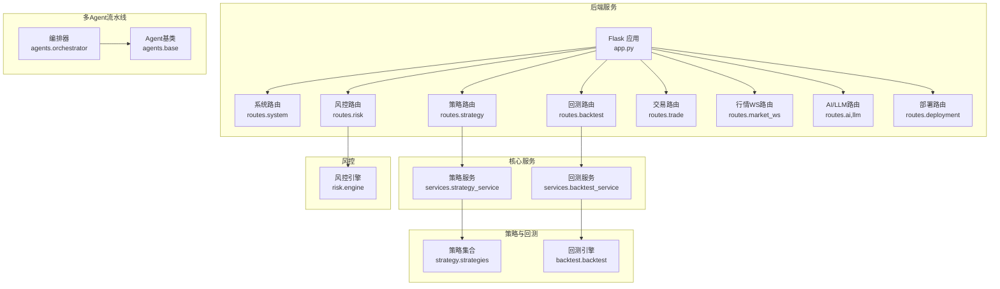
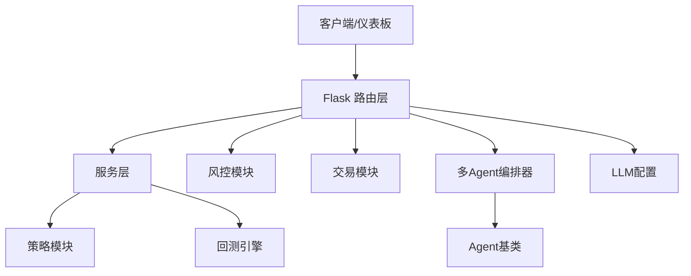
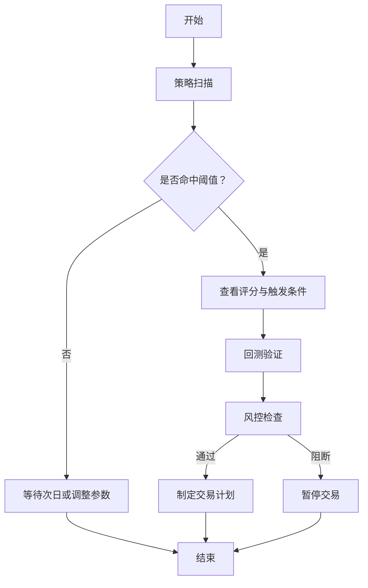
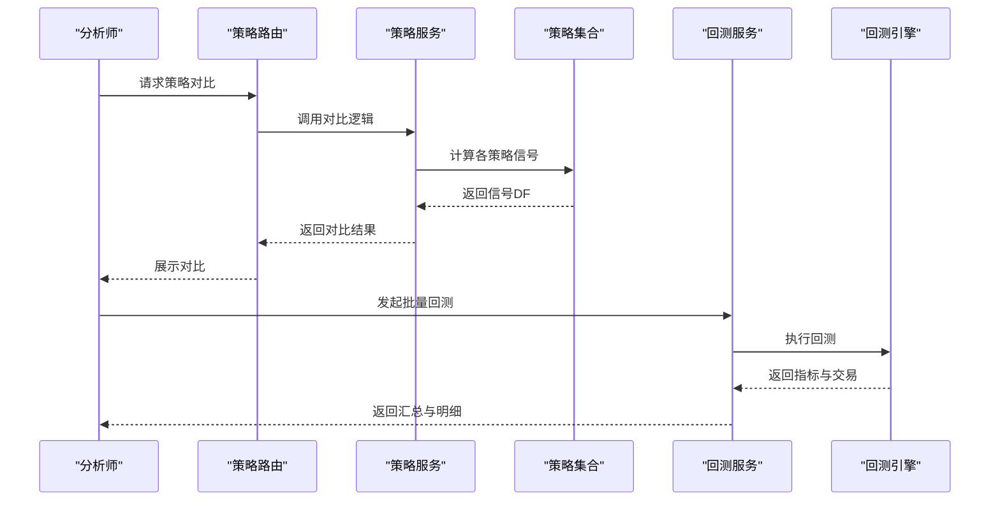
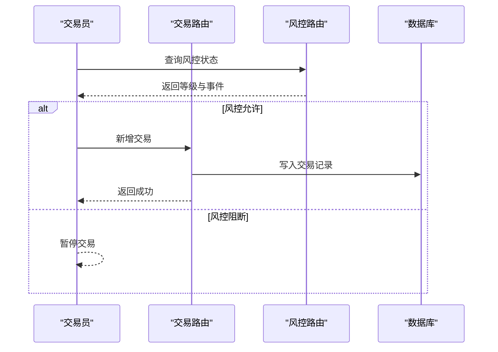
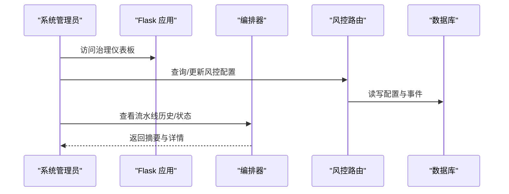
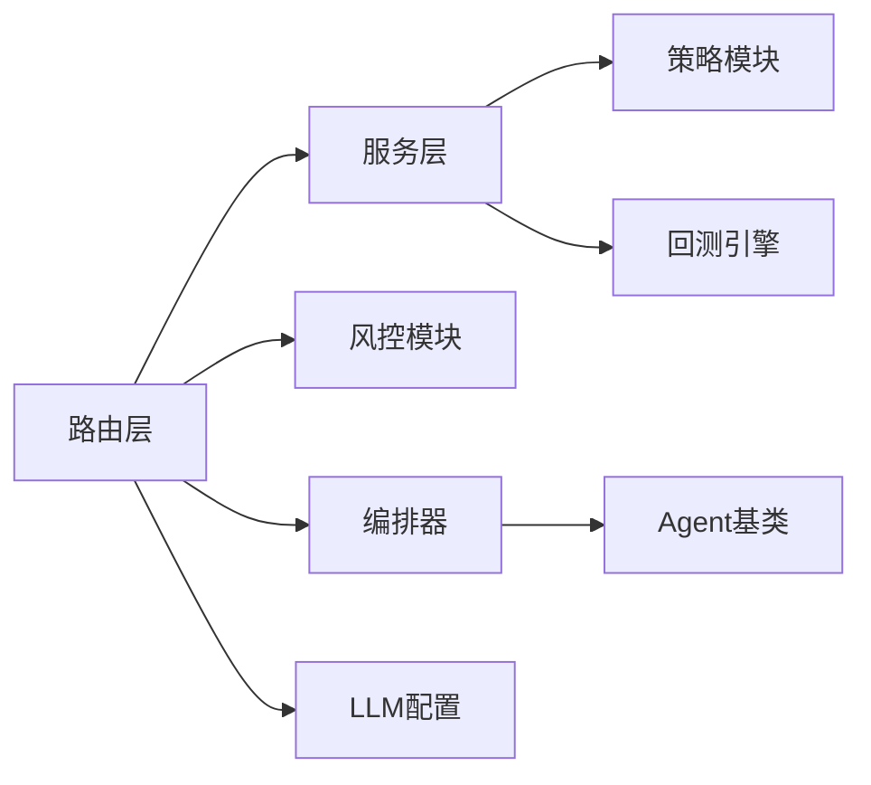

# 应用场景

<cite>
**本文引用的文件**
- [README.md](file://README.md)
- [app.py](file://app.py)
- [quant.py](file://quant.py)
- [config/settings.py](file://config/settings.py)
- [config/llm_config.yaml](file://config/llm_config.yaml)
- [routes/backtest.py](file://routes/backtest.py)
- [routes/strategy.py](file://routes/strategy.py)
- [routes/trade.py](file://routes/trade.py)
- [routes/risk.py](file://routes/risk.py)
- [agents/orchestrator.py](file://agents/orchestrator.py)
- [services/backtest_service.py](file://services/backtest_service.py)
- [strategy/strategies.py](file://strategy/strategies.py)
- [backtest/backtest.py](file://backtest/backtest.py)
- [risk/engine.py](file://risk/engine.py)
- [agents/base.py](file://agents/base.py)
</cite>

## 目录
1. [引言](#引言)
2. [项目结构](#项目结构)
3. [核心组件](#核心组件)
4. [架构总览](#架构总览)
5. [详细组件分析](#详细组件分析)
6. [依赖分析](#依赖分析)
7. [性能考虑](#性能考虑)
8. [故障排查指南](#故障排查指南)
9. [结论](#结论)
10. [附录](#附录)

## 引言
本文件面向AIQuant量化交易系统在不同用户群体中的应用场景，围绕个人投资者、量化分析师、交易员、系统管理员等角色，梳理系统如何支撑策略开发、回测验证、实盘交易、风险管理等业务流程，并给出具体使用案例、工作流示例、适用范围与局限性，帮助潜在用户快速建立对系统价值与适用性的认知。

## 项目结构
AIQuant采用后端API + 前端仪表板的模式，核心后端通过Flask注册大量蓝图路由，覆盖数据、策略、回测、风控、交易、部署、LLM增强等多个领域；同时内置定时任务与多Agent流水线编排，形成“策略扫描—信号生成—风控校验—回测评估—报告产出”的闭环。

图表来源
- [app.py:43-72](file://app.py#L43-L72)
- [routes/strategy.py:14-87](file://routes/strategy.py#L14-L87)
- [routes/backtest.py:12-45](file://routes/backtest.py#L12-L45)
- [routes/risk.py:31-108](file://routes/risk.py#L31-L108)
- [services/backtest_service.py:10-38](file://services/backtest_service.py#L10-L38)
- [strategy/strategies.py:36-431](file://strategy/strategies.py#L36-L431)
- [backtest/backtest.py:56-472](file://backtest/backtest.py#L56-L472)
- [risk/engine.py:13-72](file://risk/engine.py#L13-L72)
- [agents/orchestrator.py:36-175](file://agents/orchestrator.py#L36-L175)
- [agents/base.py:20-120](file://agents/base.py#L20-L120)

章节来源
- [app.py:43-72](file://app.py#L43-L72)
- [config/settings.py:15-17](file://config/settings.py#L15-L17)

## 核心组件
- 策略与信号
  - 多策略框架：包含放量突破、均线粘合、量价背离、抄底、主力建仓等策略，支持融合评分与v4超跌反弹策略。
  - 信号生成：支持全市场扫描、按条件筛选、单标的多策略回测与对比。
- 回测与评估
  - 回测引擎：支持T+1执行、止损止盈、动态仓位、大盘择时、回撤熔断等；输出全面绩效指标。
  - 批量回测服务：封装参数化批量回测，便于API调用与自动化。
- 风控
  - 风控引擎：规则化检查，支持分级阻断、事件记录、状态持久化与豁免管理。
- 实盘与交易
  - 交易记录API：支持查询与新增交易，便于手工或外部系统接入。
- 多Agent流水线
  - 三省六部制编排：数据采集、信号生成、并行风控与回测、报表生成，支持串行/并行与错误处理。
- LLM增强
  - LLM配置：支持意图解析、市场分析、自动交易理由生成等能力开关。

章节来源
- [strategy/strategies.py:36-431](file://strategy/strategies.py#L36-L431)
- [backtest/backtest.py:56-472](file://backtest/backtest.py#L56-L472)
- [services/backtest_service.py:10-74](file://services/backtest_service.py#L10-L74)
- [routes/risk.py:31-108](file://routes/risk.py#L31-L108)
- [risk/engine.py:13-72](file://risk/engine.py#L13-L72)
- [routes/trade.py:12-43](file://routes/trade.py#L12-L43)
- [agents/orchestrator.py:36-175](file://agents/orchestrator.py#L36-L175)
- [agents/base.py:20-120](file://agents/base.py#L20-L120)
- [config/llm_config.yaml:1-23](file://config/llm_config.yaml#L1-L23)

## 架构总览
AIQuant后端以Flask为中心，通过蓝图组织功能域；核心业务通过服务层对接策略与回测模块；风控贯穿流水线关键节点；多Agent流水线提供自动化编排；LLM配置支持意图解析与市场分析增强。

图表来源
- [app.py:43-72](file://app.py#L43-L72)
- [services/backtest_service.py:10-38](file://services/backtest_service.py#L10-L38)
- [strategy/strategies.py:36-431](file://strategy/strategies.py#L36-L431)
- [backtest/backtest.py:56-472](file://backtest/backtest.py#L56-L472)
- [routes/risk.py:31-108](file://routes/risk.py#L31-L108)
- [agents/orchestrator.py:36-175](file://agents/orchestrator.py#L36-L175)
- [agents/base.py:20-120](file://agents/base.py#L20-L120)
- [config/llm_config.yaml:1-23](file://config/llm_config.yaml#L1-L23)

## 详细组件分析

### 个人投资者（小资金、追求稳健）
典型诉求
- 快速了解当日/近期市场机会，获得明确的买卖建议与止盈止损提示。
- 通过回测验证策略效果，降低主观决策偏差。

使用路径
- 策略扫描与信号
  - 使用策略扫描接口获取当日精选标的，查看评分与触发条件。
  - 参考v4超跌反弹策略的阈值与交易规则，结合大盘择时决定是否参与。
- 回测验证
  - 选择关注标的，进行多策略对比与回测，观察胜率、盈亏比、最大回撤等指标。
- 风险管理
  - 关注风控状态与事件，避免在高风险时段盲目加仓。

工作流示例（概念流程）

图表来源
- [quant.py:289-337](file://quant.py#L289-L337)
- [routes/strategy.py:35-54](file://routes/strategy.py#L35-L54)
- [routes/backtest.py:12-45](file://routes/backtest.py#L12-L45)
- [routes/risk.py:31-82](file://routes/risk.py#L31-L82)

章节来源
- [quant.py:289-337](file://quant.py#L289-L337)
- [routes/strategy.py:35-54](file://routes/strategy.py#L35-L54)
- [routes/backtest.py:12-45](file://routes/backtest.py#L12-L45)
- [routes/risk.py:31-82](file://routes/risk.py#L31-L82)

### 量化分析师（策略研发与评估）
典型诉求
- 快速构建与融合多策略，进行参数扫描与回测评估。
- 对比不同策略在同一标的上的表现，形成策略组合。

使用路径
- 策略开发与对比
  - 使用策略对比接口，针对一组标的比较不同策略的信号与评分。
  - 通过参数化回测接口，调整资金、止盈止损、仓位等参数，观察指标变化。
- 批量回测
  - 使用批量回测服务，设定时间窗、阈值、风控参数，输出汇总指标与交易明细。

工作流示例（序列图）

图表来源
- [routes/strategy.py:73-87](file://routes/strategy.py#L73-L87)
- [services/backtest_service.py:10-74](file://services/backtest_service.py#L10-L74)
- [strategy/strategies.py:36-431](file://strategy/strategies.py#L36-L431)
- [backtest/backtest.py:121-472](file://backtest/backtest.py#L121-L472)

章节来源
- [routes/strategy.py:73-87](file://routes/strategy.py#L73-L87)
- [services/backtest_service.py:10-74](file://services/backtest_service.py#L10-L74)
- [strategy/strategies.py:36-431](file://strategy/strategies.py#L36-L431)
- [backtest/backtest.py:121-472](file://backtest/backtest.py#L121-L472)

### 交易员（实盘执行与风控）
典型诉求
- 获取实时信号与交易计划，快速下单并记录交易。
- 在风控阻断时及时停止交易，避免扩大损失。

使用路径
- 交易执行
  - 通过交易记录接口新增交易，记录方向、价格、份额、手续费、原因等。
- 风控联动
  - 实时查询风控状态与事件，结合风控规则决定是否执行交易。
- 实时监控
  - 结合行情WS与仪表板，关注市场节奏与信号变化。

工作流示例（序列图）

图表来源
- [routes/trade.py:23-43](file://routes/trade.py#L23-L43)
- [routes/risk.py:31-82](file://routes/risk.py#L31-L82)

章节来源
- [routes/trade.py:23-43](file://routes/trade.py#L23-L43)
- [routes/risk.py:31-82](file://routes/risk.py#L31-L82)

### 系统管理员（运维与治理）
典型诉求
- 配置与监控：管理定时任务、健康检查、部署与回滚。
- 风控治理：配置风控规则、黑名单、豁免审批与审计。
- 多Agent流水线治理：查看流水线执行历史、状态与错误。

使用路径
- 健康与配置
  - 通过健康接口确认服务状态；通过配置文件设置数据库、定时任务、日志级别等。
- 风控治理
  - 管理黑名单、查询风控事件、热加载风控配置、申请与审批豁免。
- 多Agent治理
  - 查看流水线历史、当前状态、执行摘要，必要时手动触发单Agent执行。

工作流示例（序列图）

图表来源
- [app.py:131-134](file://app.py#L131-L134)
- [config/settings.py:15-17](file://config/settings.py#L15-L17)
- [routes/risk.py:86-108](file://routes/risk.py#L86-L108)
- [agents/orchestrator.py:67-76](file://agents/orchestrator.py#L67-L76)

章节来源
- [app.py:131-134](file://app.py#L131-L134)
- [config/settings.py:15-17](file://config/settings.py#L15-L17)
- [routes/risk.py:86-108](file://routes/risk.py#L86-L108)
- [agents/orchestrator.py:67-76](file://agents/orchestrator.py#L67-L76)

## 依赖分析
- 组件耦合
  - 路由层薄封装，服务层集中业务逻辑，策略与回测模块解耦，便于替换与扩展。
  - 风控模块通过规则接口与引擎解耦，支持热加载与灵活配置。
  - 多Agent编排器通过延迟导入与上下文共享，降低模块间耦合。
- 外部依赖
  - 数据源：行情数据、指数数据等，策略与回测依赖统一的数据接口。
  - LLM：通过配置文件启用/禁用，增强意图解析与市场分析。

图表来源
- [routes/strategy.py:14-87](file://routes/strategy.py#L14-L87)
- [routes/backtest.py:12-45](file://routes/backtest.py#L12-L45)
- [routes/risk.py:31-108](file://routes/risk.py#L31-L108)
- [agents/orchestrator.py:36-175](file://agents/orchestrator.py#L36-L175)
- [agents/base.py:20-120](file://agents/base.py#L20-L120)
- [config/llm_config.yaml:1-23](file://config/llm_config.yaml#L1-L23)

章节来源
- [routes/strategy.py:14-87](file://routes/strategy.py#L14-L87)
- [routes/backtest.py:12-45](file://routes/backtest.py#L12-L45)
- [routes/risk.py:31-108](file://routes/risk.py#L31-L108)
- [agents/orchestrator.py:36-175](file://agents/orchestrator.py#L36-L175)
- [agents/base.py:20-120](file://agents/base.py#L20-L120)
- [config/llm_config.yaml:1-23](file://config/llm_config.yaml#L1-L23)

## 性能考虑
- 策略扫描与回测
  - 扫描过程对全市场股票迭代计算，建议合理设置阈值与并发；批量回测可按标的分批执行。
- 回测引擎
  - T+1执行与滑点、手续费、印花税等成本计入，注意参数设置对结果的影响。
- 风控与编排
  - 风控检查与流水线并行执行，建议在高负载时限制并发与增加重试策略。
- LLM增强
  - LLM调用存在延迟与配额限制，建议开启缓存与降级策略。

## 故障排查指南
- 健康检查
  - 通过健康接口确认服务可用性，定位网络与进程问题。
- 路由与参数
  - 参数校验失败会返回错误信息，检查URL参数类型与范围。
- 风控阻断
  - 若风控状态为阻断，检查事件列表与阻断原因，必要时申请豁免或调整参数。
- 交易异常
  - 新增交易失败时，检查必填字段与数据库连接状态。

章节来源
- [app.py:131-144](file://app.py#L131-L144)
- [routes/backtest.py:40-45](file://routes/backtest.py#L40-L45)
- [routes/risk.py:67-82](file://routes/risk.py#L67-L82)
- [routes/trade.py:23-43](file://routes/trade.py#L23-L43)

## 结论
AIQuant为A股市场提供从策略开发、回测验证到实盘交易与风控管理的一体化能力，通过多Agent流水线实现自动化编排，适合个人投资者稳健参与、量化分析师高效验证、交易员快速执行以及系统管理员统一治理。建议根据自身角色与目标，选择合适的接口与工作流，并结合风控与LLM增强提升决策质量。

## 附录
- 用户故事与需求场景
  - 个人投资者：希望获得“可执行”的买卖建议与风控提示，减少择时与情绪干扰。
  - 量化分析师：需要参数化回测与策略对比工具，快速评估策略稳定性与收益风险。
  - 交易员：需要实时信号与交易记录能力，配合风控阻断机制保障安全。
  - 系统管理员：需要配置、监控与审计能力，保障系统稳定与合规。
- 适用范围与局限性
  - 适用范围：A股日频数据、T+1交易机制、中小盘与部分主板标的。
  - 局限性：策略参数需结合市场环境调整；回测与实盘存在滑点、流动性与冲击成本差异；风控与LLM能力依赖配置与外部服务稳定性。