# 技术架构

<cite>
**本文引用的文件**
- [app.py](file://app.py)
- [quant.py](file://quant.py)
- [requirements.txt](file://requirements.txt)
- [config/settings.py](file://config/settings.py)
- [core/db.py](file://core/db.py)
- [routes/__init__.py](file://routes/__init__.py)
- [strategy/strategies.py](file://strategy/strategies.py)
- [agents/orchestrator.py](file://agents/orchestrator.py)
- [backtest/engine.py](file://backtest/engine.py)
- [governance/chancellery/strategy_engine.py](file://governance/chancellery/strategy_engine.py)
- [risk/engine.py](file://risk/engine.py)
- [services/backtest_service.py](file://services/backtest_service.py)
- [deployment/manager.py](file://deployment/manager.py)
</cite>

## 目录
1. [简介](#简介)
2. [项目结构](#项目结构)
3. [核心组件](#核心组件)
4. [架构总览](#架构总览)
5. [详细组件分析](#详细组件分析)
6. [依赖分析](#依赖分析)
7. [性能考虑](#性能考虑)
8. [故障排查指南](#故障排查指南)
9. [结论](#结论)
10. [附录](#附录)

## 简介
本技术架构文档面向AIQuant量化交易系统，系统采用分层架构与模块化设计，围绕“数据-策略-回测-风控-部署-流水线”六大主线展开。后端以Flask提供REST与WebSocket接口，核心业务逻辑由策略引擎、回测引擎、风控引擎与部署管理器协同完成，并通过统一的数据库层持久化数据与状态。系统同时支持传统策略扫描与新一代“三省六部制”多Agent流水线，便于未来扩展与治理。

## 项目结构
项目采用按功能域划分的模块化组织方式，主要目录与职责如下：
- app.py：Flask应用入口，注册蓝图与WebSocket路由，内置定时任务与健康检查
- core：基础设施层，包含数据库连接、迁移、索引与通用同步工具
- routes：Flask蓝图路由集合，按领域划分API前缀
- strategy：策略工厂与多策略实现，提供融合评分与信号输出
- backtest：回测引擎封装（Backtrader），提供回测与参数优化能力
- risk：风控引擎与规则集，负责风险评估与状态持久化
- governance：三省六部制治理模块，包含策略引擎、决策引擎与执行引擎
- agents：多Agent流水线编排器与各Agent实现
- services：服务层封装，如批量回测服务
- deployment：策略部署管理器，支持注册、部署、启停与热更新
- config：基础配置（数据库路径、定时任务时间、日志级别等）

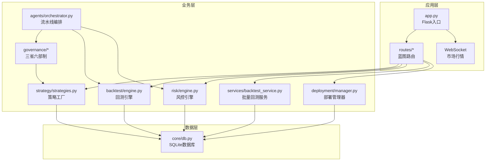

图表来源
- [app.py:1-164](file://app.py#L1-L164)
- [routes/__init__.py:1-16](file://routes/__init__.py#L1-L16)
- [core/db.py:1-1213](file://core/db.py#L1-L1213)
- [strategy/strategies.py:1-431](file://strategy/strategies.py#L1-L431)
- [agents/orchestrator.py:1-263](file://agents/orchestrator.py#L1-L263)
- [backtest/engine.py:1-174](file://backtest/engine.py#L1-L174)
- [risk/engine.py:1-168](file://risk/engine.py#L1-L168)
- [services/backtest_service.py:1-135](file://services/backtest_service.py#L1-L135)
- [deployment/manager.py:1-216](file://deployment/manager.py#L1-L216)

章节来源
- [app.py:1-164](file://app.py#L1-L164)
- [routes/__init__.py:1-16](file://routes/__init__.py#L1-L16)
- [core/db.py:1-1213](file://core/db.py#L1-L1213)

## 核心组件
- Flask后端与路由：集中式蓝图注册，统一健康检查与静态资源服务，WebSocket提供实时行情
- 数据库层：SQLite本地数据库，统一建表、索引与迁移，支持策略评分与风控状态持久化
- 策略层：多策略评分与融合，支持v4超跌反弹与五因子融合，输出BUY信号与评分
- 回测层：Backtrader封装，提供回测与参数优化，支持分析器提取关键指标
- 风控层：规则驱动的风险评估，支持阻断与限制两类动作，记录事件与状态
- 治理与流水线：三省六部制流水线编排，串行与并行结合，支持一票否决
- 部署管理：策略注册、部署、启停、暂停/恢复与热更新，记录部署状态

章节来源
- [app.py:1-164](file://app.py#L1-L164)
- [core/db.py:1-1213](file://core/db.py#L1-L1213)
- [strategy/strategies.py:1-431](file://strategy/strategies.py#L1-L431)
- [backtest/engine.py:1-174](file://backtest/engine.py#L1-L174)
- [risk/engine.py:1-168](file://risk/engine.py#L1-L168)
- [agents/orchestrator.py:1-263](file://agents/orchestrator.py#L1-L263)
- [deployment/manager.py:1-216](file://deployment/manager.py#L1-L216)

## 架构总览
系统采用“分层+流水线”的混合架构模式：
- 分层架构：应用层（Flask）、业务层（策略/回测/风控/治理/服务/部署）、数据层（SQLite）
- 模块化设计：按领域拆分蓝图与包，降低耦合，增强可维护性
- 流水线模式：三省六部制多Agent流水线，串行依赖与并行加速，支持一票否决
- 策略模式：策略工厂与融合器，支持不同策略组合与参数化

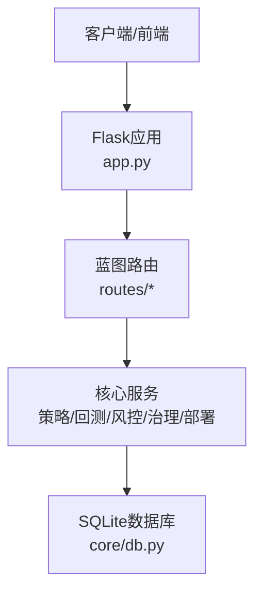

图表来源
- [app.py:1-164](file://app.py#L1-L164)
- [routes/__init__.py:1-16](file://routes/__init__.py#L1-L16)
- [core/db.py:1-1213](file://core/db.py#L1-L1213)

## 详细组件分析

### Flask后端与路由
- 蓝图注册：系统将系统、股票、回测、策略、信号、账户、风控、治理、数据源等蓝图统一注册，便于按领域扩展
- WebSocket：提供市场行情实时推送，便于前端仪表板与监控
- 健康检查与静态页：提供健康状态查询与仪表板页面服务
- 定时任务：内置schedule线程，支持每日数据同步与策略扫描

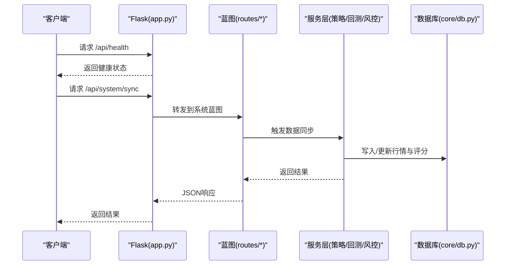

图表来源
- [app.py:1-164](file://app.py#L1-L164)
- [routes/__init__.py:1-16](file://routes/__init__.py#L1-L16)
- [core/db.py:1-1213](file://core/db.py#L1-L1213)

章节来源
- [app.py:1-164](file://app.py#L1-L164)
- [routes/__init__.py:1-16](file://routes/__init__.py#L1-L16)

### 数据库层（SQLite）
- 表结构：stock_info、daily_price、index_daily、stock_signal、positions、trades、account_snapshots、risk_events、risk_status、blacklist、risk_overrides、audit_log等
- 连接管理：上下文管理器，WAL模式与NORMAL同步，自动回滚与提交
- 迁移与索引：动态添加列、唯一索引与复合索引，保障查询效率
- 批量写入：行情与策略评分的批量UPSERT，支持幂等

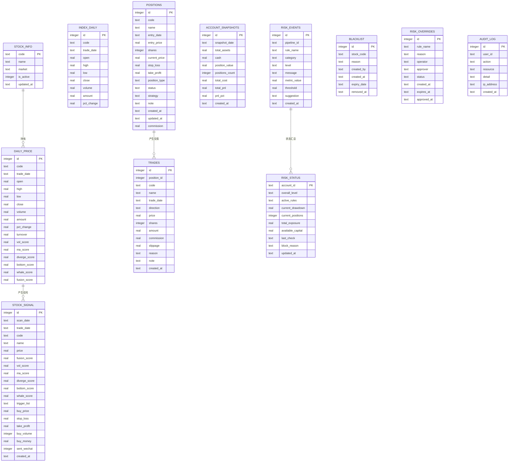

图表来源
- [core/db.py:57-427](file://core/db.py#L57-L427)

章节来源
- [core/db.py:1-1213](file://core/db.py#L1-L1213)

### 策略层（多策略与融合）
- 策略实现：放量突破、均线粘合、量价背离、抄底、主力建仓、超跌反弹（v4）
- 融合评分：将各策略原始分映射至0-10后加权融合，输出FUSION_SCORE与BUY信号
- v4策略：强调超跌反弹条件与大盘择时，适合中小盘与基本面过滤

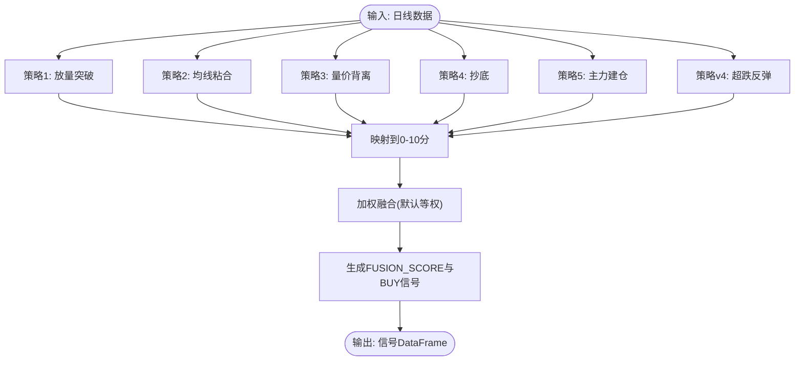

图表来源
- [strategy/strategies.py:36-431](file://strategy/strategies.py#L36-L431)

章节来源
- [strategy/strategies.py:1-431](file://strategy/strategies.py#L1-L431)

### 回测引擎（Backtrader封装）
- 回测流程：设置初始资金、佣金、数据源、策略与分析器，运行并提取指标
- 参数优化：遍历参数网格，输出各组合回测结果
- 结果模型：统一的BacktestResult数据结构，便于统计分析

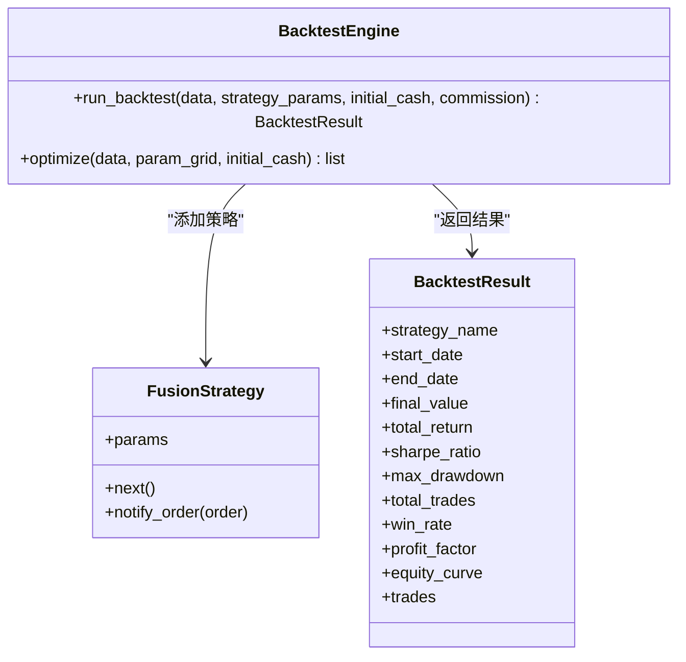

图表来源
- [backtest/engine.py:17-174](file://backtest/engine.py#L17-L174)

章节来源
- [backtest/engine.py:1-174](file://backtest/engine.py#L1-L174)

### 风控引擎
- 规则集：默认规则列表，逐条执行并汇总最严格等级
- 状态持久化：将检查结果与当前风控状态写入数据库，支持查询
- 事件记录：记录风险事件，便于审计与复盘

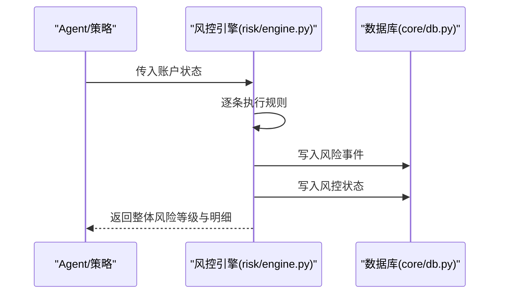

图表来源
- [risk/engine.py:19-168](file://risk/engine.py#L19-L168)
- [core/db.py:358-427](file://core/db.py#L358-L427)

章节来源
- [risk/engine.py:1-168](file://risk/engine.py#L1-L168)

### 三省六部制流水线（多Agent编排）
- 执行图：太子院（数据）→ 中书省（策略）→ 门下省（风控）+ 尚书省（回测）→ 尚书省（报表）
- 并行加速：回测与风控并行执行
- 一票否决：风控BLOCK级别直接拦截，跳过报表阶段
- 状态持久化：流水线执行上下文与历史记录

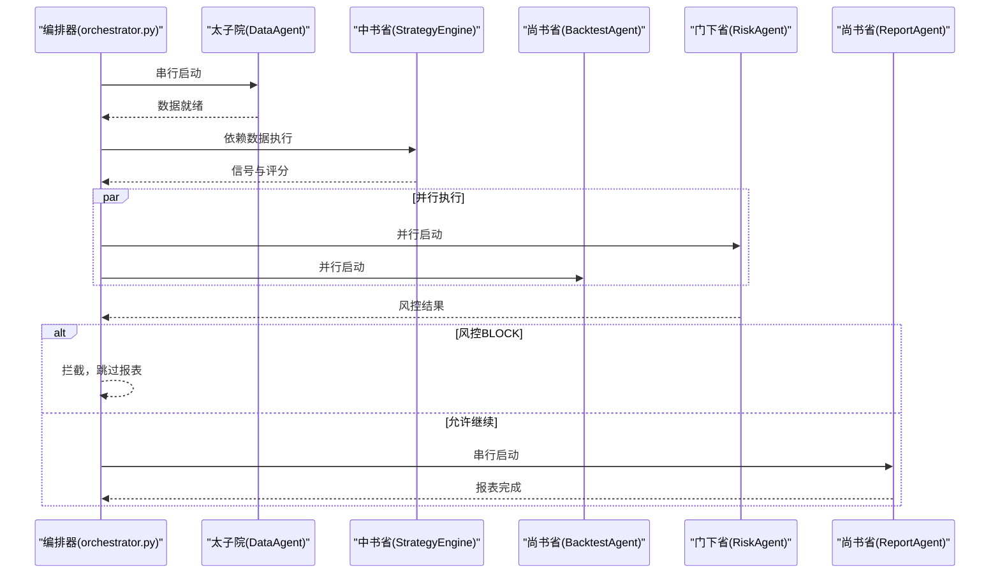

图表来源
- [agents/orchestrator.py:81-175](file://agents/orchestrator.py#L81-L175)
- [governance/chancellery/strategy_engine.py:43-91](file://governance/chancellery/strategy_engine.py#L43-L91)

章节来源
- [agents/orchestrator.py:1-263](file://agents/orchestrator.py#L1-L263)
- [governance/chancellery/strategy_engine.py:1-103](file://governance/chancellery/strategy_engine.py#L1-L103)

### 部署管理器
- 策略注册：创建Runner并登记注册信息
- 部署启停：启动/停止/暂停/恢复策略运行
- 状态查询：支持单策略与全量状态查询
- 热更新：支持配置与策略内容热更新

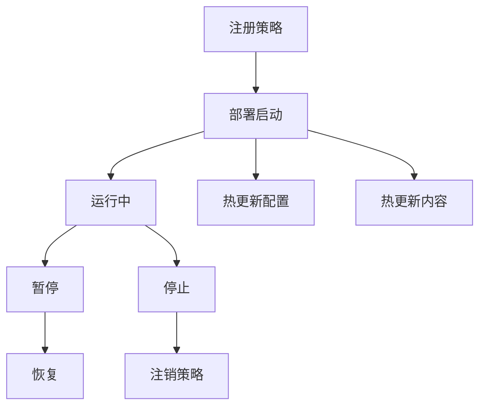

图表来源
- [deployment/manager.py:67-173](file://deployment/manager.py#L67-L173)

章节来源
- [deployment/manager.py:1-216](file://deployment/manager.py#L1-L216)

### 批量回测服务
- 输入参数：时间范围、资金、仓位、止损止盈、权重、是否使用v4等
- 输出指标：总收益、年化收益、最大回撤、胜率、盈亏比、交易明细等
- 交易配对：将买入/卖出按股票代码配对，计算持有天数与盈亏

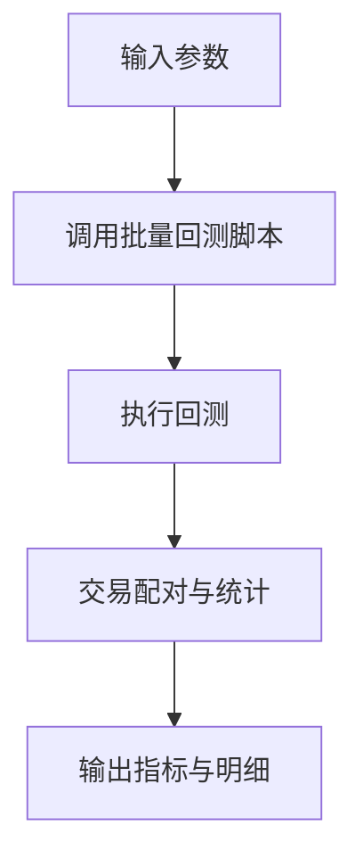

图表来源
- [services/backtest_service.py:10-135](file://services/backtest_service.py#L10-L135)

章节来源
- [services/backtest_service.py:1-135](file://services/backtest_service.py#L1-L135)

## 依赖分析
- 技术栈选择
  - Python：生态成熟、易用、可快速迭代
  - Flask：轻量Web框架，蓝图清晰，适合API与WebSocket
  - pandas/numpy：高性能数值计算与数据处理，支撑策略与回测
  - scikit-learn/joblib：机器学习与并行加速，便于扩展AI模型
  - Backtrader：成熟的回测框架，便于策略验证与参数优化
  - SQLite：本地存储，无需额外运维，满足中小规模数据
- 外部依赖与集成点
  - 数据源：AkShare/Tushare等（通过数据源管理器与同步模块集成）
  - 实盘：Broker适配器与订单管理器（war/ministries）
  - LLM/智能顾问：LLM模块与Advisor接口（llm/）
  - 前端：静态页面与仪表板（dashboard.html等）
- 关键依赖关系
  - routes依赖core/db与strategy/backtest/risk/service/deployment
  - agents依赖governance与backtest/risk
  - backtest依赖strategy与pandas

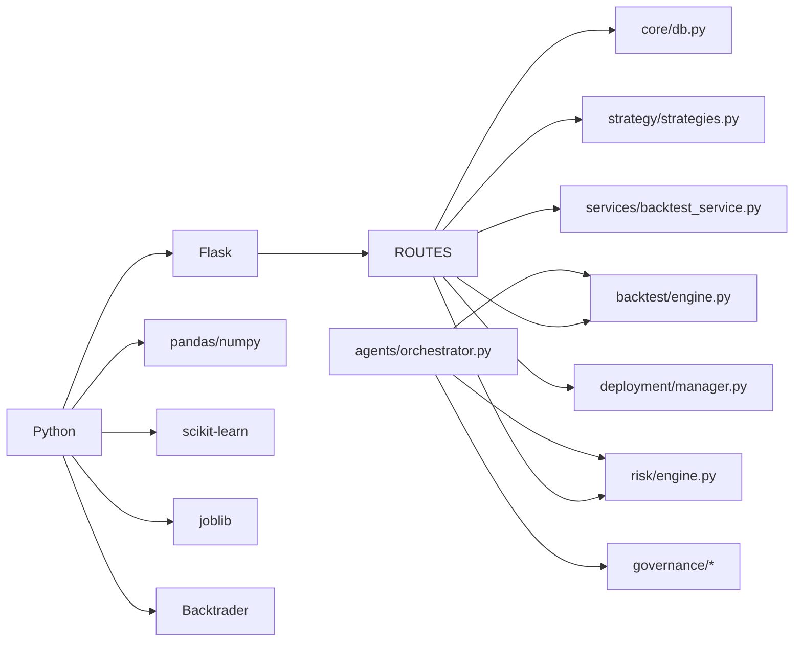

图表来源
- [requirements.txt:1-9](file://requirements.txt#L1-L9)
- [app.py:1-164](file://app.py#L1-L164)
- [core/db.py:1-1213](file://core/db.py#L1-L1213)
- [strategy/strategies.py:1-431](file://strategy/strategies.py#L1-L431)
- [backtest/engine.py:1-174](file://backtest/engine.py#L1-L174)
- [risk/engine.py:1-168](file://risk/engine.py#L1-L168)
- [services/backtest_service.py:1-135](file://services/backtest_service.py#L1-L135)
- [deployment/manager.py:1-216](file://deployment/manager.py#L1-L216)
- [agents/orchestrator.py:1-263](file://agents/orchestrator.py#L1-L263)
- [governance/chancellery/strategy_engine.py:1-103](file://governance/chancellery/strategy_engine.py#L1-L103)

章节来源
- [requirements.txt:1-9](file://requirements.txt#L1-L9)
- [config/settings.py:1-25](file://config/settings.py#L1-L25)

## 性能考虑
- 数据库性能
  - WAL模式与NORMAL同步平衡性能与可靠性
  - 多处建立索引（如daily_price/code+date、stock_signal/unique索引），提升查询效率
  - 批量写入与UPSER进行幂等更新，减少重复IO
- 数值计算
  - pandas/numpy向量化运算，策略评分与指标计算高效
  - 融合评分映射与加权在DataFrame层面完成，避免Python循环
- 并行与异步
  - 流水线阶段并行（回测与风控），缩短整体执行时间
  - WebSocket推送实时行情，降低轮询开销
- 回测优化
  - 参数网格搜索与分析器指标提取，便于快速筛选优参数
- 部署与热更新
  - Runner状态机与热更新，降低策略切换成本

## 故障排查指南
- 健康检查
  - 访问 /api/health 确认服务可用
- 蓝图路由
  - 使用 /api/debug/routes 查看已注册路由，定位接口问题
- 数据库
  - 检查表结构与索引是否存在；关注唯一约束冲突与迁移失败
- 策略扫描
  - 确认数据库中有行情数据；检查策略阈值与v4择时逻辑
- 回测
  - 检查输入数据格式（OHLCV）与参数合法性；查看分析器指标异常
- 风控
  - 查询 risk_events 与 risk_status，定位阻断原因
- 部署
  - 检查部署记录文件与Runner状态；确认热更新成功

章节来源
- [app.py:124-145](file://app.py#L124-L145)
- [core/db.py:57-427](file://core/db.py#L57-L427)
- [risk/engine.py:129-168](file://risk/engine.py#L129-L168)
- [deployment/manager.py:186-204](file://deployment/manager.py#L186-L204)

## 结论
AIQuant系统以Flask为核心，围绕策略、回测、风控、治理与部署构建了清晰的分层架构与模块化设计。通过SQLite本地存储与pandas/numpy高效计算，系统在中小规模数据场景下具备良好的可维护性与扩展性。三省六部制流水线进一步提升了策略研发与验证的自动化水平。建议后续在以下方面持续演进：引入分布式任务队列以支持更大规模回测、完善Broker适配与实盘执行、增强LLM与AI模型的可插拔能力、以及加强监控与可观测性建设。

## 附录
- 系统边界
  - 内部：策略、回测、风控、治理、部署、数据库
  - 外部：数据源（AkShare/Tushare）、Broker、前端仪表板
- 架构决策与权衡
  - 选择Flask而非更重的框架，降低复杂度，便于快速迭代
  - 选择SQLite本地存储，简化运维，适合个人/小团队使用
  - 采用Backtrader进行回测，兼顾易用性与专业性
  - 三省六部制流水线提升策略研发与评审效率，便于治理与审计