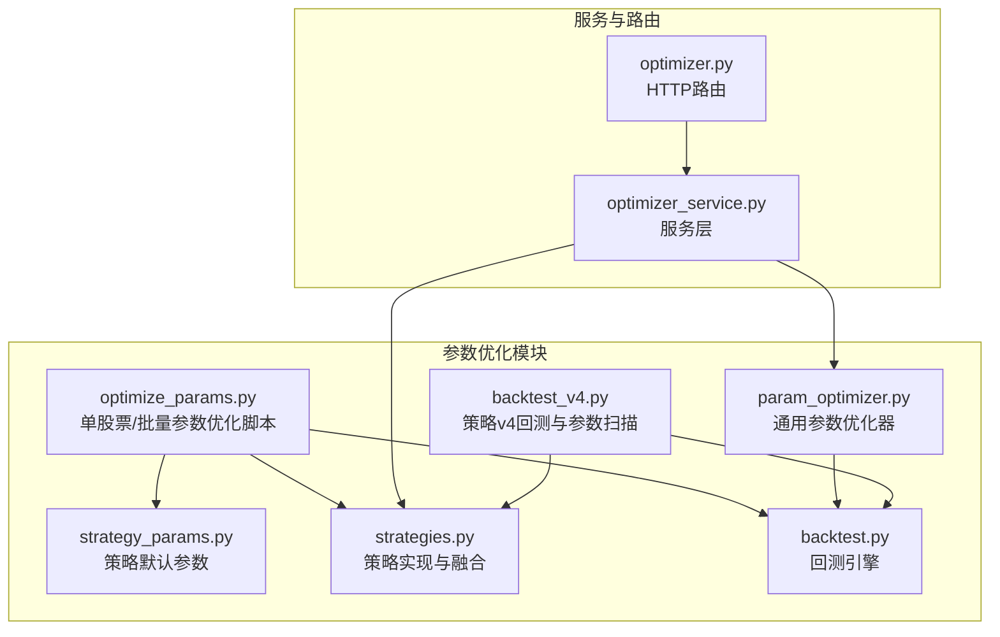
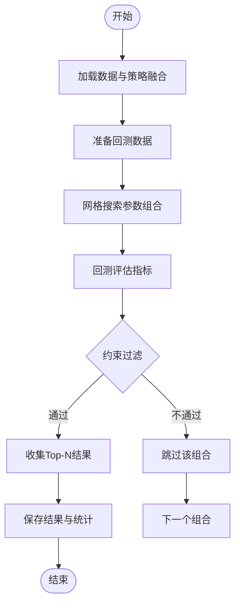
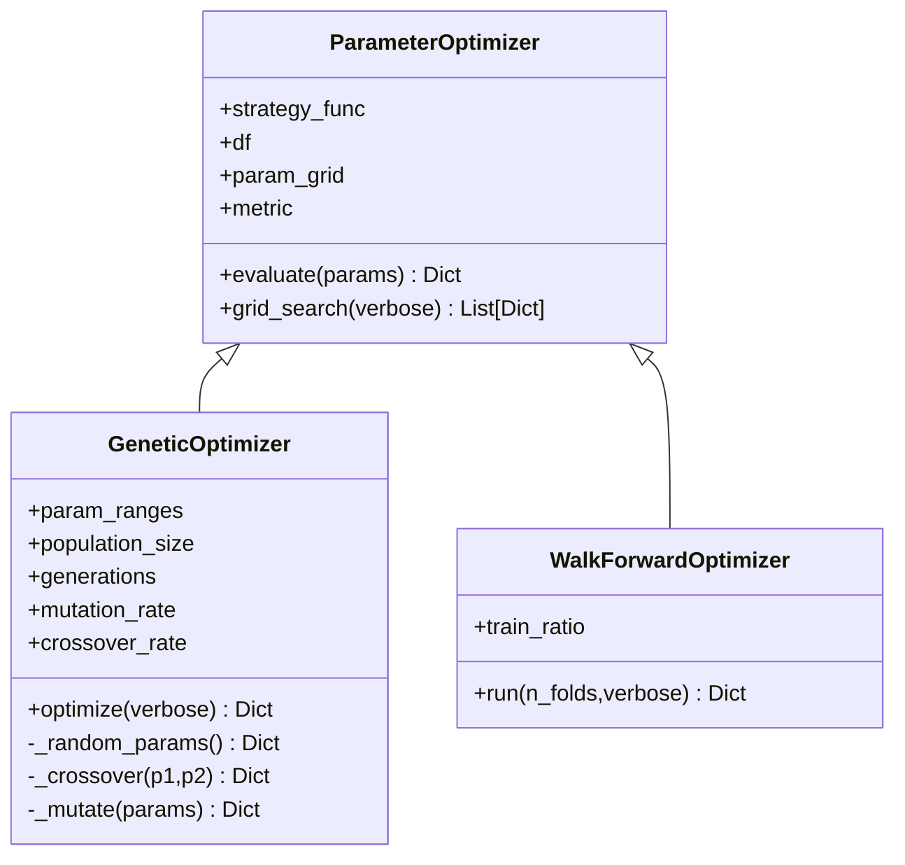
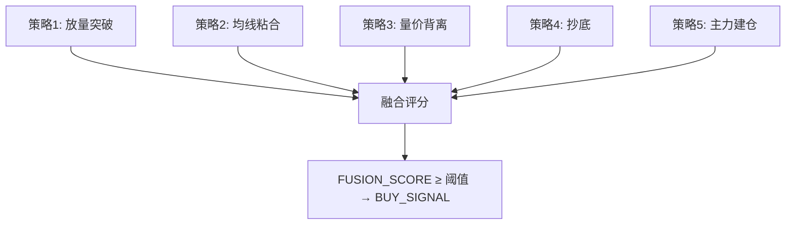
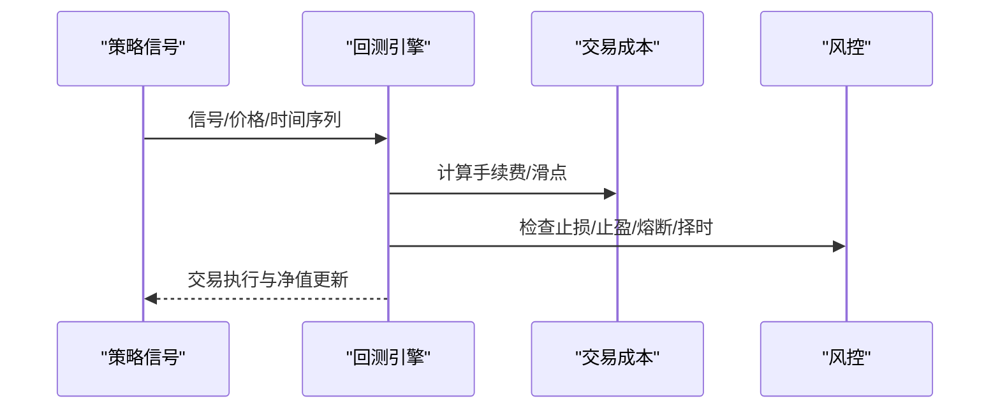
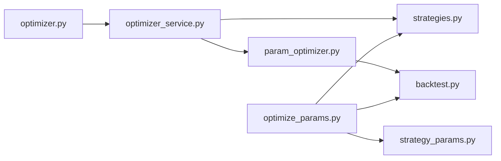

# 参数优化系统

<cite>
**本文档引用的文件**
- [optimize_params.py](file://backtest/optimize_params.py)
- [param_optimizer.py](file://backtest/param_optimizer.py)
- [optimizer.py](file://routes/optimizer.py)
- [optimizer_service.py](file://services/optimizer_service.py)
- [strategy_params.py](file://config/strategy_params.py)
- [strategies.py](file://strategy/strategies.py)
- [backtest.py](file://backtest/backtest.py)
- [backtest_v4.py](file://backtest/backtest_v4.py)
</cite>

## 目录
1. [简介](#简介)
2. [项目结构](#项目结构)
3. [核心组件](#核心组件)
4. [架构概览](#架构概览)
5. [详细组件分析](#详细组件分析)
6. [依赖关系分析](#依赖关系分析)
7. [性能考虑](#性能考虑)
8. [故障排查指南](#故障排查指南)
9. [结论](#结论)
10. [附录](#附录)

## 简介
本系统为AIQuant的参数优化子系统，提供多种参数搜索策略（网格搜索、遗传算法、步行优化）与回测验证能力，支持批量参数测试、约束条件过滤与结果汇总。系统以策略融合与回测引擎为核心，结合HTTP接口与服务层，形成从数据准备、策略执行、参数搜索到结果输出的完整流水线。

## 项目结构
参数优化相关模块主要分布在以下位置：
- backtest：参数优化脚本与通用优化器实现
- services：参数优化服务封装
- routes：HTTP路由层
- strategy：策略定义与融合
- config：策略默认参数配置
- backtest/backtest.py：回测引擎（用于评估参数组合）



图表来源
- [optimize_params.py:1-462](file://backtest/optimize_params.py#L1-L462)
- [param_optimizer.py:1-369](file://backtest/param_optimizer.py#L1-L369)
- [optimizer_service.py:1-92](file://services/optimizer_service.py#L1-L92)
- [optimizer.py:1-48](file://routes/optimizer.py#L1-L48)
- [strategy_params.py:1-76](file://config/strategy_params.py#L1-L76)
- [strategies.py:1-431](file://strategy/strategies.py#L1-L431)
- [backtest.py:1-517](file://backtest/backtest.py#L1-L517)
- [backtest_v4.py:1-624](file://backtest/backtest_v4.py#L1-L624)

章节来源
- [optimize_params.py:1-462](file://backtest/optimize_params.py#L1-L462)
- [param_optimizer.py:1-369](file://backtest/param_optimizer.py#L1-L369)
- [optimizer_service.py:1-92](file://services/optimizer_service.py#L1-L92)
- [optimizer.py:1-48](file://routes/optimizer.py#L1-L48)
- [strategy_params.py:1-76](file://config/strategy_params.py#L1-L76)
- [strategies.py:1-431](file://strategy/strategies.py#L1-L431)
- [backtest.py:1-517](file://backtest/backtest.py#L1-L517)
- [backtest_v4.py:1-624](file://backtest/backtest_v4.py#L1-L624)

## 核心组件
- 参数优化脚本：提供单股票/批量优化流程，使用回测引擎评估参数组合，支持约束过滤与结果汇总。
- 通用参数优化器：实现网格搜索、遗传算法与步行优化，支持自定义指标与参数范围。
- 策略与融合：提供多策略实现与融合逻辑，输出统一的信号与评分列。
- 回测引擎：提供交易成本、风控、动态仓位等回测能力，并计算关键指标。
- 服务与路由：封装参数优化调用，暴露HTTP接口。

章节来源
- [optimize_params.py:120-176](file://backtest/optimize_params.py#L120-L176)
- [param_optimizer.py:19-107](file://backtest/param_optimizer.py#L19-L107)
- [param_optimizer.py:110-210](file://backtest/param_optimizer.py#L110-L210)
- [param_optimizer.py:213-296](file://backtest/param_optimizer.py#L213-L296)
- [strategies.py:36-255](file://strategy/strategies.py#L36-L255)
- [strategies.py:368-430](file://strategy/strategies.py#L368-L430)
- [backtest.py:56-471](file://backtest/backtest.py#L56-L471)
- [optimizer_service.py:9-61](file://services/optimizer_service.py#L9-L61)
- [optimizer.py:11-28](file://routes/optimizer.py#L11-L28)

## 架构概览
系统采用“脚本/服务/路由”三层结构：
- 脚本层：optimize_params.py负责端到端流程（数据加载→策略融合→参数优化→结果输出）
- 服务层：optimizer_service.py封装策略选择、参数网格构建与优化器调用
- 路由层：optimizer.py提供HTTP接口，调用服务层执行优化
- 策略层：strategies.py定义策略与融合逻辑
- 回测层：backtest.py提供回测评估能力

```mermaid
sequenceDiagram
participant Client as "客户端"
participant Route as "路由(optimizer.py)"
participant Service as "服务(optimizer_service.py)"
participant Opt as "优化器(param_optimizer.py)"
participant Strat as "策略(strategies.py)"
participant Backtest as "回测(backtest.py)"
Client->>Route : GET /optimizer/run?symbol=...
Route->>Service : run_optimizer(...)
Service->>Strat : 导入策略函数与参数网格
Service->>Opt : 创建优化器(grid/genetic)
Opt->>Backtest : 评估参数组合
Backtest-->>Opt : 返回指标
Opt-->>Service : 返回最佳参数与结果
Service-->>Route : 返回JSON
Route-->>Client : 返回优化结果
```

图表来源
- [optimizer.py:11-28](file://routes/optimizer.py#L11-L28)
- [optimizer_service.py:9-61](file://services/optimizer_service.py#L9-L61)
- [param_optimizer.py:19-107](file://backtest/param_optimizer.py#L19-L107)
- [strategies.py:36-255](file://strategy/strategies.py#L36-L255)
- [backtest.py:121-471](file://backtest/backtest.py#L121-L471)

## 详细组件分析

### 组件A：参数优化脚本（optimize_params.py）
- 功能概述
  - 单股票/批量参数优化：加载数据、策略融合、网格搜索、约束过滤、结果汇总与持久化
  - 搜索空间与约束：定义参数范围、固定参数、约束条件（交易次数、最大回撤、夏普比率）
  - 评估指标：最大化SQN（综合质量），同时输出Return、Sharpe、WinRate、ProfitFactor等
- 关键流程
  - 数据加载与策略融合：调用多个策略函数并融合评分
  - 参数优化：使用回测引擎bt.optimize()进行网格搜索
  - 结果提取与过滤：按约束条件筛选有效组合，排序输出Top-N
  - 批量执行：遍历股票池，汇总统计与保存结果



图表来源
- [optimize_params.py:94-117](file://backtest/optimize_params.py#L94-L117)
- [optimize_params.py:120-176](file://backtest/optimize_params.py#L120-L176)
- [optimize_params.py:179-240](file://backtest/optimize_params.py#L179-L240)
- [optimize_params.py:372-429](file://backtest/optimize_params.py#L372-L429)

章节来源
- [optimize_params.py:63-85](file://backtest/optimize_params.py#L63-L85)
- [optimize_params.py:120-176](file://backtest/optimize_params.py#L120-L176)
- [optimize_params.py:179-240](file://backtest/optimize_params.py#L179-L240)
- [optimize_params.py:372-429](file://backtest/optimize_params.py#L372-L429)

### 组件B：通用参数优化器（param_optimizer.py）
- 类设计
  - ParameterOptimizer：基类，定义策略函数、参数网格、评估指标与网格搜索
  - GeneticOptimizer：继承基类，实现遗传算法（选择、交叉、变异）
  - WalkForwardOptimizer：实现步行优化（滚动验证）
- 评估与指标
  - 支持多种优化指标：Sharpe比率、总收益、胜率、最大回撤、卡玛比率
  - 通过回测引擎计算指标并排序
- 遗传算法要点
  - 参数范围转为连续/整数随机初始化
  - 锦标赛选择精英个体，交叉与变异产生下一代
  - 每代记录最佳结果



图表来源
- [param_optimizer.py:19-107](file://backtest/param_optimizer.py#L19-L107)
- [param_optimizer.py:110-210](file://backtest/param_optimizer.py#L110-L210)
- [param_optimizer.py:213-296](file://backtest/param_optimizer.py#L213-L296)

章节来源
- [param_optimizer.py:19-107](file://backtest/param_optimizer.py#L19-L107)
- [param_optimizer.py:110-210](file://backtest/param_optimizer.py#L110-L210)
- [param_optimizer.py:213-296](file://backtest/param_optimizer.py#L213-L296)

### 组件C：策略与融合（strategies.py）
- 策略实现
  - 放量突破、均线粘合、量价背离、抄底、主力建仓等策略，均返回BUY_SIGNAL/SELL_SIGNAL与评分列
  - 融合函数将多策略评分映射到0-10后加权求和，得到FUSION_SCORE与BUY_SIGNAL
- 默认权重与参数
  - 提供策略默认参数与融合权重，便于快速复用与对比
- v4策略
  - 超跌反弹策略v4在回测脚本中使用，包含动态仓位、跟踪止盈、大盘择时等特性



图表来源
- [strategies.py:36-255](file://strategy/strategies.py#L36-L255)
- [strategies.py:368-430](file://strategy/strategies.py#L368-L430)

章节来源
- [strategies.py:36-255](file://strategy/strategies.py#L36-L255)
- [strategies.py:368-430](file://strategy/strategies.py#L368-L430)
- [strategy_params.py:6-76](file://config/strategy_params.py#L6-L76)

### 组件D：回测引擎（backtest.py）
- 功能特性
  - T+1执行规则、滑点与手续费、止损止盈、最大持仓天数
  - 动态仓位（基于ATR波动率）、回撤熔断、大盘择时
  - 计算指标：总/年化收益、最大回撤、夏普比率、胜率、盈亏比、Alpha等
- 评估流程
  - 读取信号列与OHLC数据，按日迭代执行买卖与风控逻辑
  - 记录逐笔交易与净值曲线，最终汇总指标



图表来源
- [backtest.py:56-471](file://backtest/backtest.py#L56-L471)

章节来源
- [backtest.py:56-471](file://backtest/backtest.py#L56-L471)

### 组件E：服务与路由（optimizer_service.py, optimizer.py）
- 服务层
  - 根据策略名称导入策略函数与参数网格
  - 调用参数优化器执行网格搜索或遗传算法
  - 返回最佳参数与Top结果
- 路由层
  - 提供HTTP接口，接收参数并调用服务层
  - 错误处理与异常捕获

```mermaid
sequenceDiagram
participant Client as "客户端"
participant Route as "路由"
participant Service as "服务"
participant Opt as "优化器"
Client->>Route : 请求 /optimizer/run
Route->>Service : run_optimizer(...)
Service->>Opt : grid_search/optimize
Opt-->>Service : 结果
Service-->>Route : JSON
Route-->>Client : 响应
```

图表来源
- [optimizer.py:11-28](file://routes/optimizer.py#L11-L28)
- [optimizer_service.py:9-61](file://services/optimizer_service.py#L9-L61)

章节来源
- [optimizer.py:11-28](file://routes/optimizer.py#L11-L28)
- [optimizer_service.py:9-61](file://services/optimizer_service.py#L9-L61)

## 依赖关系分析
- optimize_params.py依赖策略实现与回测引擎，负责端到端流程
- param_optimizer.py独立于具体策略，提供通用优化能力
- optimizer_service.py与routes共同构成对外接口层
- strategy_params.py提供策略默认参数，便于快速配置



图表来源
- [optimize_params.py:1-462](file://backtest/optimize_params.py#L1-L462)
- [param_optimizer.py:1-369](file://backtest/param_optimizer.py#L1-L369)
- [optimizer_service.py:1-92](file://services/optimizer_service.py#L1-L92)
- [optimizer.py:1-48](file://routes/optimizer.py#L1-L48)
- [strategy_params.py:1-76](file://config/strategy_params.py#L1-L76)
- [strategies.py:1-431](file://strategy/strategies.py#L1-L431)
- [backtest.py:1-517](file://backtest/backtest.py#L1-L517)

章节来源
- [optimize_params.py:1-462](file://backtest/optimize_params.py#L1-L462)
- [param_optimizer.py:1-369](file://backtest/param_optimizer.py#L1-L369)
- [optimizer_service.py:1-92](file://services/optimizer_service.py#L1-L92)
- [optimizer.py:1-48](file://routes/optimizer.py#L1-L48)
- [strategy_params.py:1-76](file://config/strategy_params.py#L1-L76)
- [strategies.py:1-431](file://strategy/strategies.py#L1-L431)
- [backtest.py:1-517](file://backtest/backtest.py#L1-L517)

## 性能考虑
- 搜索空间规模与评估次数：网格搜索组合数随维度增长呈乘积关系，建议先用“精简网格”快速定位区域
- 评估指标选择：在追求稳定性时可优先SQN或夏普比率，兼顾交易频率时可引入交易次数约束
- 并行优化：可在服务层对不同股票或参数组合进行并行评估（需注意资源限制与数据一致性）
- 数据预处理：提前缓存常用指标（如均线、RSI）可减少重复计算
- 结果缓存：批量优化结果可持久化，避免重复计算

## 故障排查指南
- 输入参数错误
  - 策略名称或方法不支持：检查服务层策略映射与方法枚举
- 数据不足
  - 股票数据行数不足：优化脚本会跳过并输出错误信息
- 约束过滤
  - 交易次数过少或最大回撤过大：调整约束阈值或放宽参数范围
- 接口异常
  - 路由层捕获异常并返回错误码，检查请求参数与服务日志

章节来源
- [optimizer_service.py:31-32](file://services/optimizer_service.py#L31-L32)
- [optimize_params.py:308-310](file://backtest/optimize_params.py#L308-L310)
- [optimize_params.py:82-84](file://backtest/optimize_params.py#L82-L84)
- [optimizer.py:24-28](file://routes/optimizer.py#L24-L28)

## 结论
本参数优化系统提供了从策略融合到参数搜索再到回测验证的完整链路，支持多种优化策略与约束条件。通过脚本层、服务层与路由层的清晰分工，系统具备良好的扩展性与可维护性。建议在大规模参数搜索场景下结合“精简网格+遗传算法”的混合策略，并配合并行优化与结果缓存以提升效率。

## 附录
- 参数优化流程指南
  - 单股票优化：使用脚本直接运行，支持快速模式与批量模式
  - 服务接口：通过HTTP路由调用，支持策略选择与方法切换
- 搜索效率提升技巧
  - 先粗后细：先用“精简网格”缩小范围，再在局部精细搜索
  - 指标导向：根据目标选择合适的优化指标（如SQN、Sharpe）
  - 并行评估：对不同参数组合或股票进行并行回测（注意资源与数据隔离）
- 结果验证策略
  - 步行优化：使用滚动验证评估泛化能力
  - 多指标对比：关注总收益、最大回撤、胜率、盈亏比等综合指标
  - 可视化分析：结合净值曲线、交易记录与退出原因饼图进行诊断