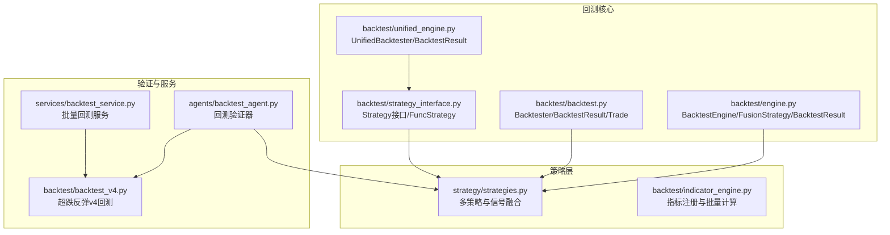
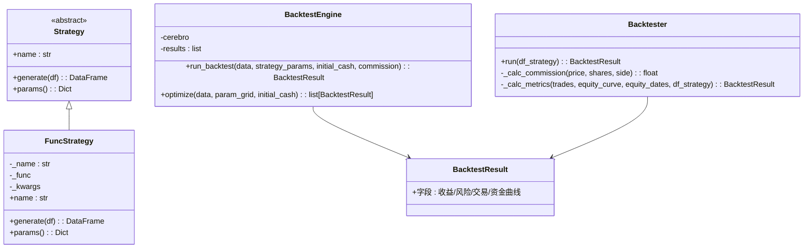
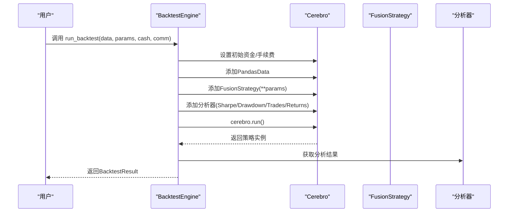
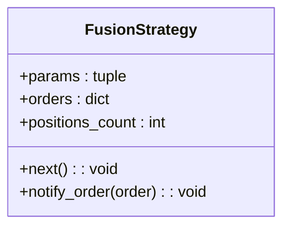
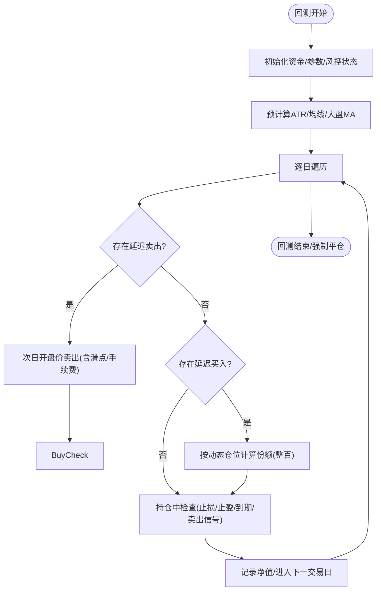
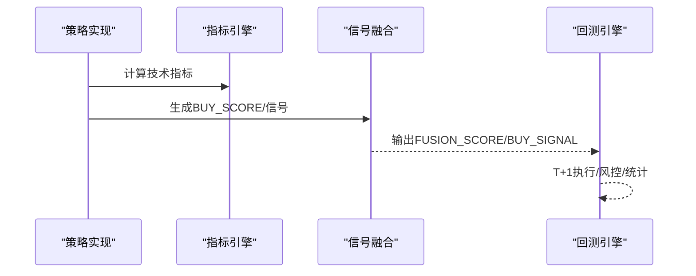
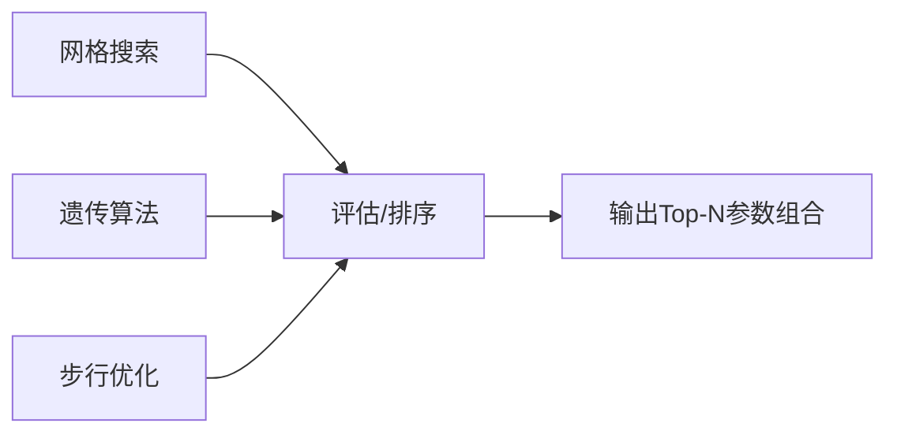
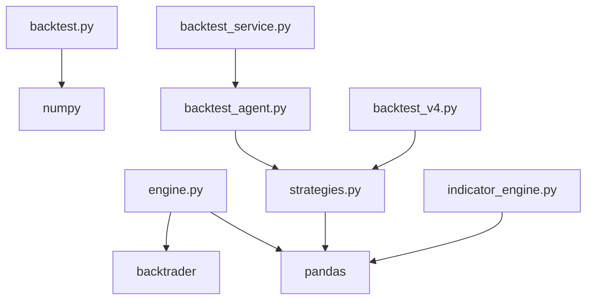

# 回测引擎核心

<cite>
**本文档引用的文件**
- [backtest/engine.py](file://backtest/engine.py)
- [backtest/backtest.py](file://backtest/backtest.py)
- [backtest/unified_engine.py](file://backtest/unified_engine.py)
- [backtest/strategy_interface.py](file://backtest/strategy_interface.py)
- [backtest/backtest_v4.py](file://backtest/backtest_v4.py)
- [backtest/custom_strategy_backtest.py](file://backtest/custom_strategy_backtest.py)
- [backtest/strategy_screen_backtest.py](file://backtest/strategy_screen_backtest.py)
- [backtest/optimize_params.py](file://backtest/optimize_params.py)
- [backtest/param_optimizer.py](file://backtest/param_optimizer.py)
- [backtest/indicator_engine.py](file://backtest/indicator_engine.py)
- [strategy/strategies.py](file://strategy/strategies.py)
- [agents/backtest_agent.py](file://agents/backtest_agent.py)
- [services/backtest_service.py](file://services/backtest_service.py)
</cite>

## 目录
1. [简介](#简介)
2. [项目结构](#项目结构)
3. [核心组件](#核心组件)
4. [架构概览](#架构概览)
5. [详细组件分析](#详细组件分析)
6. [依赖分析](#依赖分析)
7. [性能考虑](#性能考虑)
8. [故障排除指南](#故障排除指南)
9. [结论](#结论)
10. [附录](#附录)

## 简介
本文件面向AIQuant回测引擎核心模块，系统性解析以下关键能力：
- Backtrader封装实现与BacktestResult结果数据结构
- FusionStrategy策略适配器的设计原理
- 回测执行流程、参数配置机制与性能分析器使用
- T+1交易机制、手续费与滑点处理策略
- 初始化配置、数据加载与策略参数传递机制
- 结果提取、分析指标计算与异常处理策略
- 通过实际代码示例展示如何正确使用回测引擎进行策略验证

## 项目结构
回测相关代码主要分布在backtest目录，并与策略、代理、服务层协同工作：
- backtest目录：核心回测引擎、策略接口、参数优化、指标引擎
- strategy目录：多策略实现与信号融合
- agents目录：回测验证器，对接策略信号与回测结果
- services目录：批量回测服务封装
- backtest_v4.py：超跌反弹策略的完整回测实现

**图表来源**
- [backtest/engine.py:1-174](file://backtest/engine.py#L1-L174)
- [backtest/backtest.py:1-517](file://backtest/backtest.py#L1-L517)
- [backtest/unified_engine.py:1-143](file://backtest/unified_engine.py#L1-L143)
- [backtest/strategy_interface.py:1-86](file://backtest/strategy_interface.py#L1-L86)
- [strategy/strategies.py:1-431](file://strategy/strategies.py#L1-L431)
- [backtest/indicator_engine.py:1-433](file://backtest/indicator_engine.py#L1-L433)
- [agents/backtest_agent.py:1-181](file://agents/backtest_agent.py#L1-L181)
- [services/backtest_service.py:1-135](file://services/backtest_service.py#L1-L135)
- [backtest/backtest_v4.py:1-624](file://backtest/backtest_v4.py#L1-L624)

**章节来源**
- [backtest/engine.py:1-174](file://backtest/engine.py#L1-L174)
- [backtest/backtest.py:1-517](file://backtest/backtest.py#L1-L517)
- [backtest/unified_engine.py:1-143](file://backtest/unified_engine.py#L1-L143)
- [backtest/strategy_interface.py:1-86](file://backtest/strategy_interface.py#L1-L86)
- [strategy/strategies.py:1-431](file://strategy/strategies.py#L1-L431)
- [backtest/indicator_engine.py:1-433](file://backtest/indicator_engine.py#L1-L433)
- [agents/backtest_agent.py:1-181](file://agents/backtest_agent.py#L1-L181)
- [services/backtest_service.py:1-135](file://services/backtest_service.py#L1-L135)
- [backtest/backtest_v4.py:1-624](file://backtest/backtest_v4.py#L1-L624)

## 核心组件
- BacktestEngine：封装Backtrader回测流程，负责数据喂入、策略添加、分析器挂载与结果提取
- FusionStrategy：Backtrader策略适配器，承载参数化风控与订单状态回调
- BacktestResult：统一回测结果数据结构，包含收益、风险、交易明细与资金曲线
- Backtester：纯Python实现的中线回测引擎，支持T+1交易、手续费/滑点、风控熔断、动态仓位等
- Strategy接口：策略插件化抽象，支持函数式策略包装
- 指标引擎：批量计算技术指标，支持注册与条件评估
- 参数优化：网格搜索、遗传算法、步行优化等多策略参数寻优

**章节来源**
- [backtest/engine.py:72-174](file://backtest/engine.py#L72-L174)
- [backtest/backtest.py:33-54](file://backtest/backtest.py#L33-L54)
- [backtest/unified_engine.py:59-143](file://backtest/unified_engine.py#L59-L143)
- [backtest/strategy_interface.py:23-86](file://backtest/strategy_interface.py#L23-L86)
- [backtest/indicator_engine.py:287-358](file://backtest/indicator_engine.py#L287-L358)
- [backtest/optimize_params.py:120-177](file://backtest/optimize_params.py#L120-L177)

## 架构概览
回测引擎采用“策略插件化 + 指标批量计算 + 多回测实现”的分层设计：
- 策略层：Strategy接口与多策略实现，支持信号融合
- 指标层：IndicatorRegistry集中注册指标，compute_indicators批量计算
- 回测层：Backtrader封装与纯Python回测双轨并行
- 验证层：Agent与Service封装批量回测与报告

**图表来源**
- [backtest/strategy_interface.py:23-86](file://backtest/strategy_interface.py#L23-L86)
- [backtest/engine.py:72-174](file://backtest/engine.py#L72-L174)
- [backtest/backtest.py:56-472](file://backtest/backtest.py#L56-L472)

## 详细组件分析

### Backtrader封装与BacktestResult
- BacktestEngine负责：
  - 初始化Cerebro实例，设置初始资金与手续费
  - 添加PandasData数据源与FusionStrategy策略
  - 挂载SharpeRatio、DrawDown、TradeAnalyzer、Returns分析器
  - 运行回测并提取分析结果，构建BacktestResult
- BacktestResult字段涵盖总收益、年化收益、最大回撤、夏普比率、胜率、盈亏比、平均盈亏、交易明细与资金曲线

**图表来源**
- [backtest/engine.py:79-140](file://backtest/engine.py#L79-L140)

**章节来源**
- [backtest/engine.py:72-174](file://backtest/engine.py#L72-L174)

### FusionStrategy策略适配器
- 参数化风控：阈值、止损、止盈、最大持仓、单仓比例
- 订单回调：统计持仓数量，便于风控与统计
- 通知回调：记录订单状态变化，支撑后续风控逻辑

**图表来源**
- [backtest/engine.py:39-71](file://backtest/engine.py#L39-L71)

**章节来源**
- [backtest/engine.py:39-71](file://backtest/engine.py#L39-L71)

### Backtester（纯Python回测引擎）
- T+1交易机制：信号日触发，次日开盘价执行，避免未来数据泄露
- 手续费与滑点：买入含滑点成本，卖出含滑点与印花税
- 风控熔断：基于最大回撤与连续亏损限制暂停开仓
- 动态仓位：基于ATR波动率调整单仓比例
- 大盘择时：基于均线过滤，仅在趋势向好时开仓
- 指标预计算：提前计算ATR、均线、量能等指标，提升回测效率

**图表来源**
- [backtest/backtest.py:121-409](file://backtest/backtest.py#L121-L409)

**章节来源**
- [backtest/backtest.py:56-472](file://backtest/backtest.py#L56-L472)

### 策略插件化与信号融合
- Strategy接口：统一策略生成信号的规范，支持函数式策略包装
- 多策略融合：将5个子策略的评分映射到0-10后加权求和，得到融合分，触发买入信号

**图表来源**
- [strategy/strategies.py:367-431](file://strategy/strategies.py#L367-L431)
- [backtest/indicator_engine.py:287-358](file://backtest/indicator_engine.py#L287-L358)

**章节来源**
- [backtest/strategy_interface.py:23-86](file://backtest/strategy_interface.py#L23-L86)
- [strategy/strategies.py:367-431](file://strategy/strategies.py#L367-L431)
- [backtest/indicator_engine.py:140-273](file://backtest/indicator_engine.py#L140-L273)

### 参数优化与敏感性分析
- 网格搜索：遍历参数组合，最大化目标指标（如夏普比率/SQN）
- 遗传算法：适合大规模参数空间的高效寻优
- 步行优化：滚动验证训练/测试集，评估泛化能力
- 约束条件：交易次数、最大回撤、夏普比率等

**图表来源**
- [backtest/optimize_params.py:120-177](file://backtest/optimize_params.py#L120-L177)
- [backtest/param_optimizer.py:19-107](file://backtest/param_optimizer.py#L19-L107)

**章节来源**
- [backtest/optimize_params.py:120-177](file://backtest/optimize_params.py#L120-L177)
- [backtest/param_optimizer.py:19-369](file://backtest/param_optimizer.py#L19-L369)

### 统一回测引擎（待实现）
- 目标：统一多策略回测逻辑，屏蔽策略差异
- 当前状态：框架占位，核心逻辑待迁移至统一引擎

**章节来源**
- [backtest/unified_engine.py:59-143](file://backtest/unified_engine.py#L59-L143)

## 依赖分析
- backtest/engine.py依赖backtrader与pandas，输出BacktestResult
- backtest/backtest.py为纯Python实现，依赖numpy进行数值计算
- strategy/strategies.py提供多策略与信号融合
- backtest/indicator_engine.py提供指标注册与批量计算
- agents/backtest_agent.py与services/backtest_service.py封装批量回测与报告
- backtest/backtest_v4.py提供超跌反弹策略的完整实现

**图表来源**
- [backtest/engine.py:10-14](file://backtest/engine.py#L10-L14)
- [backtest/backtest.py:9-13](file://backtest/backtest.py#L9-L13)
- [strategy/strategies.py:28-31](file://strategy/strategies.py#L28-L31)
- [backtest/indicator_engine.py:9-11](file://backtest/indicator_engine.py#L9-L11)
- [agents/backtest_agent.py:16-28](file://agents/backtest_agent.py#L16-L28)
- [services/backtest_service.py:10-15](file://services/backtest_service.py#L10-L15)
- [backtest/backtest_v4.py:16-18](file://backtest/backtest_v4.py#L16-L18)

**章节来源**
- [backtest/engine.py:10-14](file://backtest/engine.py#L10-L14)
- [backtest/backtest.py:9-13](file://backtest/backtest.py#L9-L13)
- [strategy/strategies.py:28-31](file://strategy/strategies.py#L28-L31)
- [backtest/indicator_engine.py:9-11](file://backtest/indicator_engine.py#L9-L11)
- [agents/backtest_agent.py:16-28](file://agents/backtest_agent.py#L16-L28)
- [services/backtest_service.py:10-15](file://services/backtest_service.py#L10-L15)
- [backtest/backtest_v4.py:16-18](file://backtest/backtest_v4.py#L16-L18)

## 性能考虑
- 指标批量计算：通过compute_indicators一次性计算所有注册指标，减少重复计算
- 预计算与缓存：ATR、均线、量能等指标在回测前预计算，降低循环内计算开销
- T+1执行：避免未来数据泄露的同时，增加延迟执行逻辑复杂度，需平衡实时性与准确性
- 参数优化：网格搜索代价高，建议结合遗传算法与步行优化提高效率

[本节为通用指导，无需特定文件引用]

## 故障排除指南
- 数据缺失：检查数据加载函数是否返回空DataFrame，确认数据库连接与列名一致性
- 参数异常：在参数优化中加入约束条件（最小交易次数、最大回撤、最低夏普比率）
- 回测结果异常：核对手续费/滑点/风控参数设置，确保与实盘一致
- 性能问题：启用指标批量计算，避免在策略函数中重复计算指标

**章节来源**
- [backtest/optimize_params.py:80-86](file://backtest/optimize_params.py#L80-L86)
- [backtest/backtest.py:112-119](file://backtest/backtest.py#L112-L119)

## 结论
AIQuant回测引擎通过Backtrader封装与纯Python回测双轨并行，结合策略插件化与指标批量计算，提供了灵活、可扩展且高性能的回测框架。T+1交易机制、手续费与滑点处理、风控熔断与动态仓位等特性，使其能够贴近实盘环境进行策略验证。参数优化模块进一步提升了策略参数寻优的效率与效果。

[本节为总结性内容，无需特定文件引用]

## 附录

### 回测执行流程示例（Backtrader封装）
- 准备数据：构造包含OHLCV的DataFrame
- 配置参数：设置初始资金、手续费、策略参数
- 运行回测：调用BacktestEngine.run_backtest
- 提取结果：读取BacktestResult字段进行分析

**章节来源**
- [backtest/engine.py:79-140](file://backtest/engine.py#L79-L140)

### 回测执行流程示例（纯Python回测）
- 准备数据：确保包含open/close/high/low/volume等列
- 生成信号：调用策略函数或信号融合
- 运行回测：调用Backtester.run
- 提取结果：使用BacktestResult与Trade结构

**章节来源**
- [backtest/backtest.py:121-409](file://backtest/backtest.py#L121-L409)

### 参数配置机制
- Backtrader：通过cerebro.broker.setcash/setcommission设置资金与手续费
- 纯Python：通过Backtester构造函数参数控制手续费、滑点、风控等

**章节来源**
- [backtest/engine.py:93-95](file://backtest/engine.py#L93-L95)
- [backtest/backtest.py:66-111](file://backtest/backtest.py#L66-L111)

### 性能分析器使用
- Backtrader：添加SharpeRatio、DrawDown、TradeAnalyzer、Returns分析器
- 纯Python：通过_backcalc_metrics计算年化收益、最大回撤、夏普比率等

**章节来源**
- [backtest/engine.py:105-119](file://backtest/engine.py#L105-L119)
- [backtest/backtest.py:411-471](file://backtest/backtest.py#L411-L471)

### T+1交易机制与风控
- T+1：信号日触发，次日开盘价执行，避免未来数据泄露
- 风控：止损止盈、最大持仓天数、熔断机制、动态仓位、大盘择时

**章节来源**
- [backtest/backtest.py:127-131](file://backtest/backtest.py#L127-L131)
- [backtest/backtest.py:143-111](file://backtest/backtest.py#L143-L111)

### 手续费与滑点处理
- 手续费：买入佣金与卖出印花税，最低收费限制
- 滑点：买入加滑点、卖出减滑点，模拟真实买卖价差

**章节来源**
- [backtest/backtest.py:112-119](file://backtest/backtest.py#L112-L119)
- [backtest/backtest.py:207-211](file://backtest/backtest.py#L207-L211)

### 数据加载与策略参数传递
- 数据加载：从数据库读取OHLCV与财务数据，提供市值等衍生列
- 策略参数：通过策略函数参数或Strategy.params传递

**章节来源**
- [backtest/custom_strategy_backtest.py:97-131](file://backtest/custom_strategy_backtest.py#L97-L131)
- [backtest/strategy_interface.py:55-86](file://backtest/strategy_interface.py#L55-L86)

### 结果提取与分析
- 提取字段：总收益、年化收益、最大回撤、夏普比率、胜率、盈亏比、交易明细
- 汇总函数：get_summary输出易读摘要

**章节来源**
- [backtest/backtest.py:473-494](file://backtest/backtest.py#L473-L494)