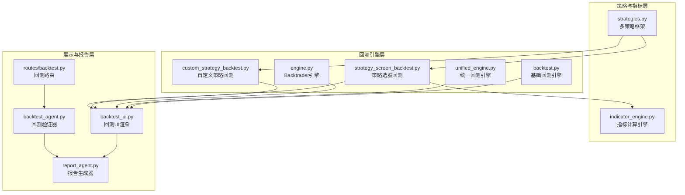
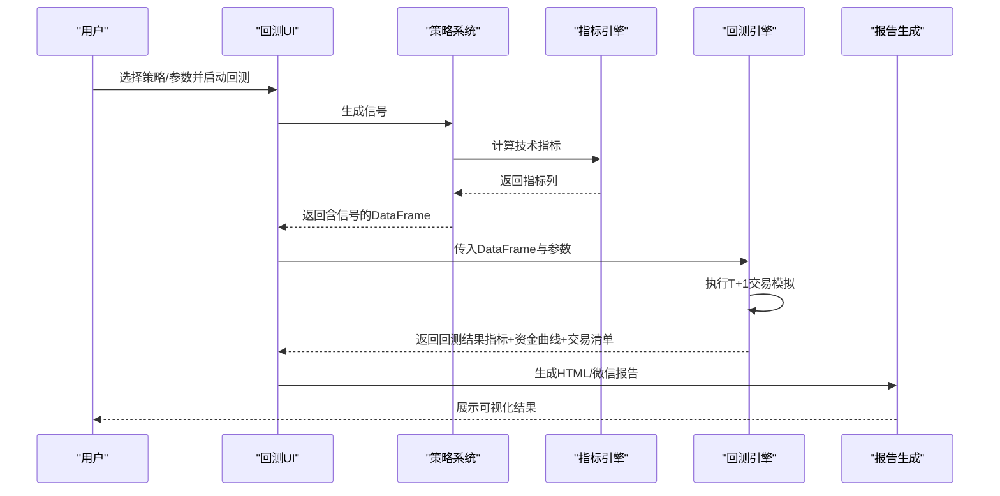
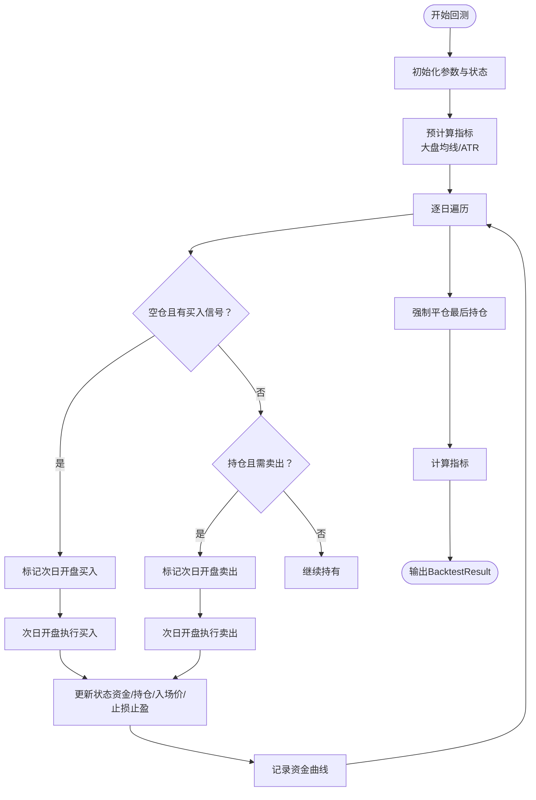
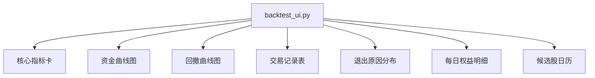
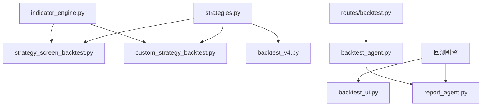

# 回测结果分析

<cite>
**本文档引用的文件**
- [backtest.py](file://backtest/backtest.py)
- [backtest_ui.py](file://backtest/backtest_ui.py)
- [engine.py](file://backtest/engine.py)
- [unified_engine.py](file://backtest/unified_engine.py)
- [custom_strategy_backtest.py](file://backtest/custom_strategy_backtest.py)
- [strategy_screen_backtest.py](file://backtest/strategy_screen_backtest.py)
- [report_agent.py](file://agents/report_agent.py)
- [backtest_agent.py](file://agents/backtest_agent.py)
- [backtest.py](file://routes/backtest.py)
- [indicator_engine.py](file://backtest/indicator_engine.py)
- [strategies.py](file://strategy/strategies.py)
- [backtest_v4.py](file://backtest/backtest_v4.py)
</cite>

## 目录
1. [简介](#简介)
2. [项目结构](#项目结构)
3. [核心组件](#核心组件)
4. [架构概览](#架构概览)
5. [详细组件分析](#详细组件分析)
6. [依赖分析](#依赖分析)
7. [性能考虑](#性能考虑)
8. [故障排除指南](#故障排除指南)
9. [结论](#结论)
10. [附录](#附录)

## 简介
本文件为AIQuant回测结果分析模块的技术文档，系统性阐述回测指标计算方法、统计分析技术与可视化展示策略。内容涵盖：
- 收益率曲线分析、最大回撤计算与夏普比率评估
- 交易行为分析、胜率统计与盈亏比计算
- 回测报告生成机制、结果对比分析与趋势预测方法
- UI界面展示、交互式图表与实时监控功能
- 通过实际案例展示如何深入分析回测结果并做出合理的策略调整决策

## 项目结构
回测分析模块围绕回测引擎、策略系统、指标引擎与UI展示四个层面构建，形成从数据到可视化的完整闭环。

**图表来源**
- [backtest.py:56-471](file://backtest/backtest.py#L56-L471)
- [unified_engine.py:59-143](file://backtest/unified_engine.py#L59-L143)
- [engine.py:72-174](file://backtest/engine.py#L72-L174)
- [custom_strategy_backtest.py:196-669](file://backtest/custom_strategy_backtest.py#L196-L669)
- [strategy_screen_backtest.py:305-746](file://backtest/strategy_screen_backtest.py#L305-L746)
- [strategies.py:36-431](file://strategy/strategies.py#L36-L431)
- [indicator_engine.py:287-358](file://backtest/indicator_engine.py#L287-L358)
- [backtest_ui.py:427-564](file://backtest/backtest_ui.py#L427-L564)
- [report_agent.py:20-90](file://agents/report_agent.py#L20-L90)
- [backtest_agent.py:31-68](file://agents/backtest_agent.py#L31-L68)
- [routes/backtest.py:12-44](file://routes/backtest.py#L12-L44)

**章节来源**
- [backtest.py:1-517](file://backtest/backtest.py#L1-L517)
- [backtest_ui.py:1-856](file://backtest/backtest_ui.py#L1-L856)
- [engine.py:1-174](file://backtest/engine.py#L1-L174)
- [unified_engine.py:1-143](file://backtest/unified_engine.py#L1-L143)
- [custom_strategy_backtest.py:1-669](file://backtest/custom_strategy_backtest.py#L1-L669)
- [strategy_screen_backtest.py:1-803](file://backtest/strategy_screen_backtest.py#L1-L803)
- [report_agent.py:1-393](file://agents/report_agent.py#L1-L393)
- [backtest_agent.py:1-181](file://agents/backtest_agent.py#L1-L181)
- [routes/backtest.py:1-45](file://routes/backtest.py#L1-L45)
- [indicator_engine.py:1-433](file://backtest/indicator_engine.py#L1-L433)
- [strategies.py:1-431](file://strategy/strategies.py#L1-L431)
- [backtest_v4.py:1-624](file://backtest/backtest_v4.py#L1-L624)

## 核心组件
- 回测引擎：负责执行回测、计算交易成本、滑点、止损止盈与动态仓位，并生成资金曲线与交易清单。
- 策略系统：提供多策略（放量突破、均线粘合、量价背离、抄底、主力建仓）与信号融合，支撑回测信号生成。
- 指标引擎：批量计算技术指标（RSI、KDJ、MACD、布林带、ATR等），为策略与回测提供统一的数据基础。
- UI展示：Streamlit驱动的交互界面，提供指标卡、资金/回撤曲线、交易记录与退出原因分析。
- 报告生成：整合回测结果、风险与信号，生成HTML报告与微信推送文本。

**章节来源**
- [backtest.py:56-471](file://backtest/backtest.py#L56-L471)
- [strategies.py:36-431](file://strategy/strategies.py#L36-L431)
- [indicator_engine.py:287-358](file://backtest/indicator_engine.py#L287-L358)
- [backtest_ui.py:427-564](file://backtest/backtest_ui.py#L427-L564)
- [report_agent.py:20-90](file://agents/report_agent.py#L20-L90)

## 架构概览
回测分析采用分层架构：策略与指标层提供信号与数据，回测引擎层执行交易模拟与指标计算，展示与报告层负责可视化与输出。

**图表来源**
- [backtest_ui.py:427-564](file://backtest/backtest_ui.py#L427-L564)
- [strategies.py:36-431](file://strategy/strategies.py#L36-L431)
- [indicator_engine.py:287-358](file://backtest/indicator_engine.py#L287-L358)
- [backtest.py:121-409](file://backtest/backtest.py#L121-L409)
- [report_agent.py:63-90](file://agents/report_agent.py#L63-L90)

## 详细组件分析

### 基础回测引擎（backtest.py）
- 职责：执行T+1回测，支持手续费、滑点、止损止盈、最大持仓天数、回撤熔断、大盘择时与动态仓位。
- 关键流程：
  - 初始化参数与状态（资金、持仓、入场价、止损止盈、最大持仓天数、滑点率等）
  - 预计算指标：大盘均线、ATR波动率
  - 信号溯源：识别各策略评分列，标记触发策略
  - T+1执行：买入信号日收盘判断 → 次日开盘价买入；卖出信号日收盘判断 → 次日开盘价卖出
  - 持仓管理：按收盘价检查止损/止盈/超期/卖出信号
  - 资金曲线：每日净值 = 现金 + 持仓市值
  - 指标计算：总收益、年化收益、最大回撤、夏普比率、胜率、盈亏比、平均持仓天数、基准收益与Alpha
- 输出：BacktestResult对象，包含交易清单、资金曲线与摘要指标。

**图表来源**
- [backtest.py:121-409](file://backtest/backtest.py#L121-L409)
- [backtest.py:411-471](file://backtest/backtest.py#L411-L471)

**章节来源**
- [backtest.py:56-471](file://backtest/backtest.py#L56-L471)

### 统一回测引擎（unified_engine.py）
- 职责：接收Strategy实例列表，统一执行回测逻辑，支持多策略并行与策略插件化。
- 特性：T+1交易、手续费/滑点、止损止盈、回撤熔断、大盘择时与动态仓位。
- 当前状态：框架占位，后续将迁移核心回测逻辑至该引擎。

**章节来源**
- [unified_engine.py:59-143](file://backtest/unified_engine.py#L59-L143)

### Backtrader回测引擎（engine.py）
- 职责：封装Backtrader回测流程，提供策略适配器与结果分析。
- 特性：基于多因子评分的策略适配、分析器（夏普比率、最大回撤、交易分析、收益）集成。
- 输出：BacktestResult对象，包含策略名称、起止日期、初始/最终资金、总收益、年化收益、夏普比率、最大回撤、总交易数、胜率、盈亏比等。

**章节来源**
- [engine.py:72-174](file://backtest/engine.py#L72-L174)

### 自定义策略回测（custom_strategy_backtest.py）
- 职责：支持用户编写strategy_function进行全市场/指定股票回测，提供参数化配置与进度回调。
- 特性：信号生成、T+1撮合、截面排名、资金曲线、交易统计与错误收集。
- 输出：包含初始/最终资金、总收益、年化收益、最大回撤、夏普比率、总交易数、胜率、平均盈亏、盈亏比、资金曲线、交易清单、每日信号等。

**章节来源**
- [custom_strategy_backtest.py:196-669](file://backtest/custom_strategy_backtest.py#L196-L669)

### 策略选股回测（strategy_screen_backtest.py）
- 职责：同花顺式策略回测：每日用选股条件筛出候选股，按排序字段取Top N，模拟开盘买入与多种退出条件。
- 特性：静态过滤（ST/科创/创业板）、动态选股条件（均线、量能、振幅、换手率、融合分等）、截面排名、跟踪止损、资金曲线与交易统计。
- 输出：包含初始/最终资金、总收益、年化收益、最大回撤、夏普比率、总交易数、胜率、平均盈亏、盈亏比、资金曲线、交易清单、每日候选与最终持仓等。

**章节来源**
- [strategy_screen_backtest.py:305-746](file://backtest/strategy_screen_backtest.py#L305-L746)

### 策略系统（strategies.py）
- 职责：提供五种独立策略与信号融合，统一返回列（含BUY_SIGNAL/SELL_SIGNAL/BUY_SCORE/STRATEGY等）。
- 策略：
  - 放量突破：量比、多头排列、3日涨幅打分
  - 均线粘合：均线粘合度、向上发散强度、量能稳定度打分
  - 量价背离：底背离强度、反弹强度、趋势逆转确认打分
  - 抄底：下跌深度、反弹强度、放量强度打分
  - 主力建仓：低位程度、放量程度、涨幅受控打分
- 融合：多策略加权融合，生成FUSION_SCORE与BUY_SIGNAL

**章节来源**
- [strategies.py:36-431](file://strategy/strategies.py#L36-L431)

### 指标引擎（indicator_engine.py）
- 职责：批量计算常用技术指标（RSI、KDJ、MACD、布林带、ATR、威廉%R、CCI、OBV、量比、振幅等），并提供条件评估与截面排名。
- 特性：注册表模式、批量计算、安全除法、滚动统计、条件表达式（点位、窗口内全部/任一、统计量比较、金叉死叉）。

**章节来源**
- [indicator_engine.py:287-433](file://backtest/indicator_engine.py#L287-L433)

### 回测UI展示（backtest_ui.py）
- 职责：Streamlit驱动的交互界面，渲染核心指标卡、资金/回撤双轴图、交易记录与退出原因分析、每日权益明细与候选股日历。
- 特性：彩色指标卡（红涨绿跌）、Plotly图表、分页表格、搜索过滤、条件解析与填充。

**图表来源**
- [backtest_ui.py:427-564](file://backtest/backtest_ui.py#L427-L564)
- [backtest_ui.py:569-676](file://backtest/backtest_ui.py#L569-L676)
- [backtest_ui.py:682-800](file://backtest/backtest_ui.py#L682-L800)

**章节来源**
- [backtest_ui.py:1-856](file://backtest/backtest_ui.py#L1-L856)

### 报告生成（report_agent.py）
- 职责：整合上游Agent输出（数据、信号、回测、风控），生成HTML报告与微信推送文本，保存到reports目录。
- 特性：风险标记与市场趋势翻译、推荐列表合并与排序、风险摘要、管道状态汇总。

**章节来源**
- [report_agent.py:63-174](file://agents/report_agent.py#L63-L174)

### 回测验证（backtest_agent.py）
- 职责：对候选股做快速历史回测验证，计算近3个月/6个月/1年策略表现，输出历史胜率、盈亏比、最大回撤。
- 特性：融合策略与v4策略分别回测，统计平均胜率与平均收益。

**章节来源**
- [backtest_agent.py:37-68](file://agents/backtest_agent.py#L37-L68)

### 回测路由（routes/backtest.py）
- 职责：Flask路由，接收批量回测请求，调用服务层执行回测并返回JSON结果。
- 特性：参数校验、异常捕获、默认参数设置。

**章节来源**
- [routes/backtest.py:12-44](file://routes/backtest.py#L12-L44)

### 超跌反弹策略v4（backtest_v4.py）
- 职责：基于strategies.py中的超跌反弹策略，改进止盈止损规则、仓位管理与大盘择时，支持参数扫描与对比分析。
- 特性：信号分到仓位映射、半仓止盈、跟踪止损、缩量破底清仓、大盘择时过滤、统计指标输出。

**章节来源**
- [backtest_v4.py:218-581](file://backtest/backtest_v4.py#L218-L581)

## 依赖分析
回测模块内部依赖清晰，策略与指标解耦，UI与引擎分离，便于扩展与维护。

**图表来源**
- [strategies.py:36-431](file://strategy/strategies.py#L36-L431)
- [indicator_engine.py:287-358](file://backtest/indicator_engine.py#L287-L358)
- [strategy_screen_backtest.py:305-746](file://backtest/strategy_screen_backtest.py#L305-L746)
- [custom_strategy_backtest.py:196-669](file://backtest/custom_strategy_backtest.py#L196-L669)
- [backtest_v4.py:218-581](file://backtest/backtest_v4.py#L218-L581)
- [backtest_ui.py:427-564](file://backtest/backtest_ui.py#L427-L564)
- [report_agent.py:63-90](file://agents/report_agent.py#L63-L90)
- [backtest_agent.py:37-68](file://agents/backtest_agent.py#L37-L68)
- [routes/backtest.py:12-44](file://routes/backtest.py#L12-L44)

**章节来源**
- [strategies.py:36-431](file://strategy/strategies.py#L36-L431)
- [indicator_engine.py:287-358](file://backtest/indicator_engine.py#L287-L358)
- [strategy_screen_backtest.py:305-746](file://backtest/strategy_screen_backtest.py#L305-L746)
- [custom_strategy_backtest.py:196-669](file://backtest/custom_strategy_backtest.py#L196-L669)
- [backtest_v4.py:218-581](file://backtest/backtest_v4.py#L218-L581)
- [backtest_ui.py:427-564](file://backtest/backtest_ui.py#L427-L564)
- [report_agent.py:63-90](file://agents/report_agent.py#L63-L90)
- [backtest_agent.py:37-68](file://agents/backtest_agent.py#L37-L68)
- [routes/backtest.py:12-44](file://routes/backtest.py#L12-L44)

## 性能考虑
- 指标计算优化：使用pandas原生滚动与向量化操作，避免显式循环；批量指标计算减少重复计算。
- 数据加载优化：按交易日分组与索引预建，实现O(1)查询；预热期避免指标无效期。
- 内存管理：分批处理股票池，及时释放中间结果；资金曲线与交易清单按需记录。
- 可视化性能：Plotly图表按需渲染，表格分页展示，避免大数据量导致的渲染阻塞。

[本节为通用指导，无需特定文件引用]

## 故障排除指南
- 回测无数据：检查日期范围、数据同步状态与股票池过滤条件。
- 信号缺失：确认策略函数返回列包含signal列，trade_date未被删除；检查指标计算是否成功。
- UI渲染异常：确认Plotly依赖安装；检查数据格式与列名一致性。
- 报告生成失败：检查上游Agent结果完整性与路径权限。

**章节来源**
- [custom_strategy_backtest.py:314-328](file://backtest/custom_strategy_backtest.py#L314-L328)
- [backtest_ui.py:562-564](file://backtest/backtest_ui.py#L562-L564)
- [report_agent.py:228-250](file://agents/report_agent.py#L228-L250)

## 结论
AIQuant回测结果分析模块通过策略系统、指标引擎与多类回测引擎的协同，实现了从信号生成到可视化展示的全流程自动化。模块具备完善的指标计算能力（总收益、年化收益、最大回撤、夏普比率、胜率、盈亏比等）、丰富的交易行为分析与直观的UI展示，能够支撑策略优化与实盘决策。建议在后续迭代中完善统一回测引擎的迁移、增强参数扫描与趋势预测能力，并持续优化性能与可扩展性。

[本节为总结性内容，无需特定文件引用]

## 附录

### 回测指标计算方法速览
- 总收益：最终资金/初始资金 - 1
- 年化收益：(最终资金/初始资金)^(252/交易日数) - 1
- 最大回撤：资金曲线滚动峰值与回撤的最小百分比
- 夏普比率：日收益均值/标准差×√252（假设无风险利率）
- 胜率：盈利交易数/总交易数
- 盈亏比：总盈利/绝对值总亏损
- 平均持仓天数：交易清单中持有天数均值
- 基准收益：买入持有策略的总收益
- Alpha：总收益 - 基准收益

**章节来源**
- [backtest.py:411-471](file://backtest/backtest.py#L411-L471)
- [strategy_screen_backtest.py:677-746](file://backtest/strategy_screen_backtest.py#L677-L746)
- [custom_strategy_backtest.py:615-669](file://backtest/custom_strategy_backtest.py#L615-L669)

### 实战案例：基于融合策略的回测分析
- 步骤：
  1) 选择策略模板（如“融合信号高分选股”）
  2) 运行回测，获取核心指标卡与资金/回撤图
  3) 查看交易记录与退出原因分布，分析胜率与平均盈亏
  4) 对比不同参数组合（如止盈/止损、最大持仓天数）的结果
  5) 生成报告并导出HTML/JSON，用于策略调整与复盘
- 决策建议：
  - 若最大回撤偏高，考虑收紧止损或引入回撤熔断
  - 若胜率偏低但盈亏比尚可，优化入场条件或提高信号质量
  - 若夏普比率较低，评估交易频率与滑点成本影响

**章节来源**
- [backtest_ui.py:427-564](file://backtest/backtest_ui.py#L427-L564)
- [report_agent.py:176-226](file://agents/report_agent.py#L176-L226)