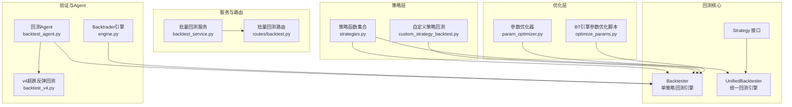
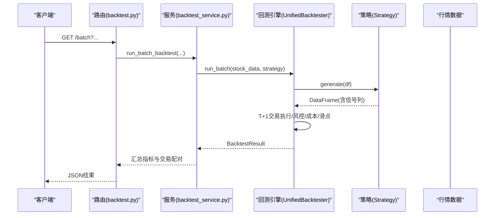
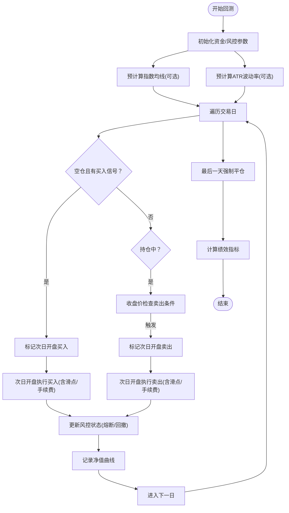
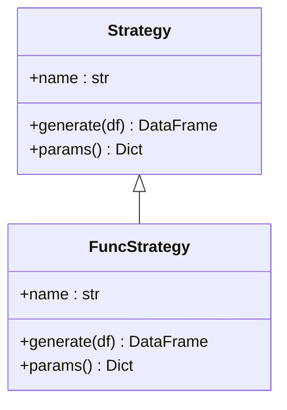
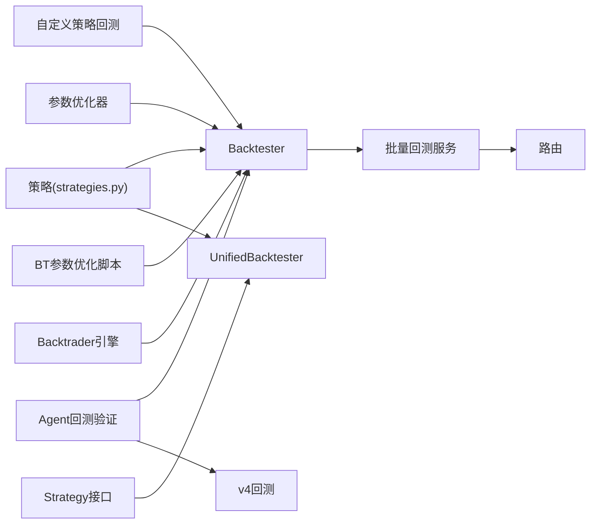

# 回测验证系统

<cite>
**本文引用的文件**
- [backtest.py](file://backtest/backtest.py)
- [engine.py](file://backtest/engine.py)
- [unified_engine.py](file://backtest/unified_engine.py)
- [param_optimizer.py](file://backtest/param_optimizer.py)
- [optimize_params.py](file://backtest/optimize_params.py)
- [custom_strategy_backtest.py](file://backtest/custom_strategy_backtest.py)
- [strategy_interface.py](file://backtest/strategy_interface.py)
- [backtest_agent.py](file://agents/backtest_agent.py)
- [backtest_service.py](file://services/backtest_service.py)
- [backtest.py](file://routes/backtest.py)
- [strategies.py](file://strategy/strategies.py)
- [backtest_v4.py](file://backtest/backtest_v4.py)
</cite>

## 目录
1. [简介](#简介)
2. [项目结构](#项目结构)
3. [核心组件](#核心组件)
4. [架构总览](#架构总览)
5. [详细组件分析](#详细组件分析)
6. [依赖关系分析](#依赖关系分析)
7. [性能考量](#性能考量)
8. [故障排查指南](#故障排查指南)
9. [结论](#结论)
10. [附录](#附录)

## 简介
本文件面向AIQuant回测验证系统，系统提供两类核心能力：
- 单策略回测：基于策略函数或策略类接口，对单只股票或多只股票进行T+1交易机制下的回测，支持手续费、滑点、止损止盈、最大持仓天数、回撤熔断、大盘择时、动态仓位等风控与交易规则。
- 多策略融合回测：将多个独立策略的信号进行融合评分，形成统一的交易信号，再进行回测与参数优化，支持参数网格搜索、遗传算法、步行优化等优化方法，并提供性能评估指标与可视化分析。

系统还提供参数优化脚本、批量回测服务、Web路由封装，以及Agent驱动的候选信号快速回测验证，便于在生产环境中进行策略筛选与验证。

## 项目结构
回测系统主要位于backtest目录，配合策略模块、服务层、路由层与Agent层协同工作。核心文件包括：
- 回测引擎与结果模型：backtest/backtest.py、backtest/unified_engine.py、backtest/strategy_interface.py
- 参数优化：backtest/param_optimizer.py、backtest/optimize_params.py
- 自定义策略回测：backtest/custom_strategy_backtest.py
- 融合策略与策略函数：strategy/strategies.py
- 批量回测服务与路由：services/backtest_service.py、routes/backtest.py
- Agent回测验证：agents/backtest_agent.py
- Backtrader引擎（兼容）：backtest/engine.py
- v4超跌反弹策略回测：backtest/backtest_v4.py



图表来源
- [backtest.py:121-409](file://backtest/backtest.py#L121-L409)
- [unified_engine.py:108-132](file://backtest/unified_engine.py#L108-L132)
- [strategy_interface.py:23-53](file://backtest/strategy_interface.py#L23-L53)
- [strategies.py:1-200](file://strategy/strategies.py#L1-L200)
- [custom_strategy_backtest.py:196-613](file://backtest/custom_strategy_backtest.py#L196-L613)
- [param_optimizer.py:19-107](file://backtest/param_optimizer.py#L19-L107)
- [optimize_params.py:120-176](file://backtest/optimize_params.py#L120-L176)
- [backtest_service.py:10-74](file://services/backtest_service.py#L10-L74)
- [routes/backtest.py:12-44](file://routes/backtest.py#L12-L44)
- [backtest_agent.py:31-68](file://agents/backtest_agent.py#L31-L68)
- [engine.py:72-140](file://backtest/engine.py#L72-L140)
- [backtest_v4.py:1-200](file://backtest/backtest_v4.py#L1-L200)

章节来源
- [backtest.py:121-409](file://backtest/backtest.py#L121-L409)
- [unified_engine.py:108-132](file://backtest/unified_engine.py#L108-L132)
- [strategy_interface.py:23-53](file://backtest/strategy_interface.py#L23-L53)
- [strategies.py:1-200](file://strategy/strategies.py#L1-L200)
- [custom_strategy_backtest.py:196-613](file://backtest/custom_strategy_backtest.py#L196-L613)
- [param_optimizer.py:19-107](file://backtest/param_optimizer.py#L19-L107)
- [optimize_params.py:120-176](file://backtest/optimize_params.py#L120-L176)
- [backtest_service.py:10-74](file://services/backtest_service.py#L10-L74)
- [routes/backtest.py:12-44](file://routes/backtest.py#L12-L44)
- [backtest_agent.py:31-68](file://agents/backtest_agent.py#L31-L68)
- [engine.py:72-140](file://backtest/engine.py#L72-L140)
- [backtest_v4.py:1-200](file://backtest/backtest_v4.py#L1-L200)

## 核心组件
- 单策略回测引擎（Backtester）
  - 支持T+1交易机制（信号日触发，次日开盘价执行）
  - 交易成本：双向手续费（默认万分之三）、卖出印花税（默认千分之一，最低5元）
  - 止损止盈：可配置止损/止盈阈值
  - 风控：最大持仓天数、回撤熔断（最大回撤阈值与连续亏损限制）、大盘择时（均线过滤）、动态仓位（基于ATR波动率）
  - 信号溯源：记录触发策略名称，便于多策略融合回测分析
  - 交易记录与资金曲线：逐笔交易记录、净值曲线与日期序列
  - 绩效指标：总收益、年化收益、最大回撤、夏普比率、胜率、盈亏比、平均持仓天数、平均盈利/亏损幅度、基准收益（买入持有）、Alpha
- 统一回测引擎（UnifiedBacktester）
  - 接收Strategy实例列表，支持多策略同时运行
  - 保持与单策略回测一致的交易与风控规则
  - 为后续替换现有回测逻辑提供统一框架
- 策略接口（Strategy）
  - 规范generate(df)返回含BUY_SIGNAL/SELL_SIGNAL/SCORE的DataFrame
  - 提供参数导出与兼容函数式策略的适配器
- 参数优化器（ParameterOptimizer/GenticOptimizer/WalkForwardOptimizer）
  - 网格搜索、遗传算法、步行优化（Walk-Forward Optimization）
  - 支持多种优化目标（夏普比率、总收益、胜率、最大回撤、卡玛比率）
- 批量回测服务与路由
  - 提供批量回测服务封装，路由层暴露HTTP接口
- Agent回测验证
  - 对候选信号进行快速历史回测验证，输出胜率、盈亏比、最大回撤等统计
- Backtrader兼容引擎
  - 提供基于Backtrader的策略适配与分析器封装

章节来源
- [backtest.py:56-471](file://backtest/backtest.py#L56-L471)
- [unified_engine.py:59-132](file://backtest/unified_engine.py#L59-L132)
- [strategy_interface.py:23-86](file://backtest/strategy_interface.py#L23-L86)
- [param_optimizer.py:19-210](file://backtest/param_optimizer.py#L19-L210)
- [optimize_params.py:120-176](file://backtest/optimize_params.py#L120-L176)
- [backtest_service.py:10-74](file://services/backtest_service.py#L10-L74)
- [routes/backtest.py:12-44](file://routes/backtest.py#L12-L44)
- [backtest_agent.py:31-68](file://agents/backtest_agent.py#L31-L68)
- [engine.py:72-140](file://backtest/engine.py#L72-L140)

## 架构总览
回测系统采用“策略-回测-优化-服务-路由”的分层架构：
- 策略层：提供独立策略函数与融合策略，统一输出信号列
- 回测层：单策略与统一回测引擎，负责T+1交易、风控与绩效计算
- 优化层：参数优化器与BT引擎参数优化脚本，支持网格搜索、遗传算法、步行优化
- 服务层：批量回测服务，将原始交易记录配对为买入/卖出，计算汇总指标
- 路由层：HTTP接口，对外提供批量回测查询
- Agent层：对候选信号进行快速回测验证，辅助策略筛选



图表来源
- [routes/backtest.py:12-44](file://routes/backtest.py#L12-L44)
- [backtest_service.py:10-74](file://services/backtest_service.py#L10-L74)
- [unified_engine.py:108-132](file://backtest/unified_engine.py#L108-L132)
- [strategy_interface.py:38-53](file://backtest/strategy_interface.py#L38-L53)

## 详细组件分析

### 单策略回测引擎（Backtester）
- T+1交易机制
  - 信号日收盘判断是否触发买入/卖出，次日开盘价执行
  - 支持延迟执行队列，避免未来数据泄露
- 交易成本与滑点
  - 手续费：双向默认万分之三，最低5元
  - 印花税：卖出单向默认千分之一
  - 滑点：买入加滑点、卖出减滑点，默认千分之一
- 风控与保护
  - 止损/止盈：可配置阈值
  - 最大持仓天数：防止长期套牢
  - 回撤熔断：最大回撤或连续亏损达到阈值暂停开仓
  - 大盘择时：基于指数均线过滤，弱市不入场
  - 动态仓位：基于ATR波动率调整有效仓位比例
- 信号溯源与多策略融合
  - 记录触发策略名称，便于分析各策略贡献
  - 识别各策略评分列（放量突破、均线粘合、量价背离、抄底型、主力建仓）
- 绩效指标计算
  - 总收益、年化收益、最大回撤、夏普比率、胜率、盈亏比、平均持仓天数、平均盈利/亏损幅度、基准收益（买入持有）、Alpha



图表来源
- [backtest.py:121-409](file://backtest/backtest.py#L121-L409)
- [backtest.py:411-471](file://backtest/backtest.py#L411-L471)

章节来源
- [backtest.py:56-471](file://backtest/backtest.py#L56-L471)

### 统一回测引擎（UnifiedBacktester）
- 接收Strategy实例列表，支持多策略同时运行
- 生成信号后执行T+1交易，遵循统一的资金曲线、手续费、滑点、风控与止损止盈规则
- 为后续替换现有回测逻辑提供统一框架

章节来源
- [unified_engine.py:59-132](file://backtest/unified_engine.py#L59-L132)

### 策略接口（Strategy）
- 规范generate(df)返回含BUY_SIGNAL/SELL_SIGNAL/SCORE的DataFrame
- 提供参数导出与兼容函数式策略的适配器（FuncStrategy）



图表来源
- [strategy_interface.py:23-86](file://backtest/strategy_interface.py#L23-L86)

章节来源
- [strategy_interface.py:23-86](file://backtest/strategy_interface.py#L23-L86)

### 参数优化器（ParameterOptimizer/GenticOptimizer/WalkForwardOptimizer）
- 网格搜索：遍历参数组合，评估得分（支持多种目标）
- 遗传算法：适用于参数空间较大场景，包含选择、交叉、变异
- 步行优化：滚动验证，训练集优化参数，测试集验证效果

```mermaid
sequenceDiagram
participant User as "用户"
participant Opt as "优化器(param_optimizer.py)"
participant Strat as "策略函数"
participant BT as "回测引擎(Backtester)"
User->>Opt : grid_search()/optimize()
loop 遍历参数组合
Opt->>Strat : 策略函数(df, params)
Strat-->>Opt : DataFrame(含信号列)
Opt->>BT : run(df_signal)
BT-->>Opt : BacktestResult
Opt->>Opt : 计算评分/排序
end
Opt-->>User : 最优参数与结果
```

图表来源
- [param_optimizer.py:19-107](file://backtest/param_optimizer.py#L19-L107)
- [param_optimizer.py:110-210](file://backtest/param_optimizer.py#L110-L210)
- [param_optimizer.py:213-296](file://backtest/param_optimizer.py#L213-L296)

章节来源
- [param_optimizer.py:19-210](file://backtest/param_optimizer.py#L19-L210)
- [param_optimizer.py:213-296](file://backtest/param_optimizer.py#L213-L296)

### BT引擎参数优化脚本（optimize_params.py）
- 使用backtesting.py的bt.optimize()进行网格搜索
- 支持约束条件（最少交易次数、最大回撤上限、最低夏普比率）
- 输出Top-N参数组合与汇总统计

章节来源
- [optimize_params.py:120-176](file://backtest/optimize_params.py#L120-L176)
- [optimize_params.py:179-240](file://backtest/optimize_params.py#L179-L240)
- [optimize_params.py:298-369](file://backtest/optimize_params.py#L298-L369)

### 自定义策略回测（custom_strategy_backtest.py）
- 支持用户编写strategy_function(df, **params)，返回含signal列的DataFrame
- 支持批量股票回测，按时间模拟交易，支持T+1或当日收盘价买入
- 提供详细的回测摘要指标与每日信号记录

章节来源
- [custom_strategy_backtest.py:196-613](file://backtest/custom_strategy_backtest.py#L196-L613)

### 批量回测服务与路由（backtest_service.py、routes/backtest.py）
- 批量回测服务：将原始交易记录按code配对为买入/卖出，计算汇总指标
- 路由层：提供HTTP接口，支持权重参数传递与参数校验

章节来源
- [backtest_service.py:10-74](file://services/backtest_service.py#L10-L74)
- [routes/backtest.py:12-44](file://routes/backtest.py#L12-L44)

### Agent回测验证（backtest_agent.py）
- 对融合策略与v4候选信号进行快速历史回测验证
- 输出各候选股的历史胜率、盈亏比、最大回撤、年化收益等

章节来源
- [backtest_agent.py:31-68](file://agents/backtest_agent.py#L31-L68)

### Backtrader兼容引擎（engine.py）
- 封装Backtrader回测流程，提供策略适配器与分析器
- 为兼容旧有回测流程提供支撑

章节来源
- [engine.py:72-140](file://backtest/engine.py#L72-L140)

### v4超跌反弹策略回测（backtest_v4.py）
- 使用strategies.py中的超跌反弹策略
- 改动止盈止损规则、仓位管理、大盘择时
- 提供基本面过滤与缓存机制

章节来源
- [backtest_v4.py:1-200](file://backtest/backtest_v4.py#L1-L200)

## 依赖关系分析
- 回测引擎依赖策略层提供的信号列（BUY_SIGNAL/SELL_SIGNAL/SCORE）
- 统一回测引擎依赖策略接口（Strategy），可扩展为多策略并行
- 参数优化器依赖回测引擎与策略函数，支持多种优化方法
- 批量回测服务依赖回测引擎输出的原始交易记录，进行配对与汇总
- 路由层依赖批量回测服务，提供HTTP接口
- Agent层依赖策略层与回测引擎，进行候选信号验证



图表来源
- [strategies.py:1-200](file://strategy/strategies.py#L1-L200)
- [backtest.py:121-409](file://backtest/backtest.py#L121-L409)
- [unified_engine.py:108-132](file://backtest/unified_engine.py#L108-L132)
- [strategy_interface.py:23-53](file://backtest/strategy_interface.py#L23-L53)
- [custom_strategy_backtest.py:196-613](file://backtest/custom_strategy_backtest.py#L196-L613)
- [param_optimizer.py:19-107](file://backtest/param_optimizer.py#L19-L107)
- [optimize_params.py:120-176](file://backtest/optimize_params.py#L120-L176)
- [backtest_service.py:10-74](file://services/backtest_service.py#L10-L74)
- [routes/backtest.py:12-44](file://routes/backtest.py#L12-L44)
- [backtest_agent.py:31-68](file://agents/backtest_agent.py#L31-L68)
- [engine.py:72-140](file://backtest/engine.py#L72-L140)
- [backtest_v4.py:1-200](file://backtest/backtest_v4.py#L1-L200)

## 性能考量
- 计算复杂度
  - 单策略回测：O(N)遍历交易日，预计算均线与ATR为O(N)
  - 参数优化：网格搜索为K^p（K为参数取值数量，p为参数维度），遗传算法为G×P（代数×种群大小），步行优化为F×K^p（F为折数）
- 内存占用
  - 资金曲线与交易记录列表随交易日增长，建议控制回测区间长度
  - 大盘择时与动态仓位需预计算均线与ATR，增加内存占用
- I/O与数据库
  - 批量回测涉及大量数据加载与查询，建议使用缓存与索引优化
- 并发与批处理
  - 批量回测可通过多进程/多线程并行处理不同股票，提升吞吐量

## 故障排查指南
- 信号列缺失
  - 确保策略函数返回DataFrame包含BUY_SIGNAL/SELL_SIGNAL/SCORE列
  - 自定义策略回测要求strategy_function返回含signal列
- T+1执行异常
  - 检查是否存在次日开盘价缺失（停牌/数据缺失），系统会回退到收盘价执行
- 交易成本与滑点
  - 确认手续费率、最低手续费、滑点率设置合理
- 回撤熔断与风控
  - 如出现频繁熔断，适当提高阈值或放宽风控参数
- 参数优化失败
  - 检查参数范围与目标指标设置，确保策略函数可正常运行
- 路由参数错误
  - 确认weights参数格式正确，且数量为5；其他参数类型转换无误

章节来源
- [custom_strategy_backtest.py:253-276](file://backtest/custom_strategy_backtest.py#L253-L276)
- [backtest.py:200-210](file://backtest/backtest.py#L200-L210)
- [routes/backtest.py:14-22](file://routes/backtest.py#L14-L22)

## 结论
AIQuant回测验证系统提供了从策略到回测、从参数优化到批量服务的完整闭环。单策略回测引擎支持严格的T+1交易机制与完善的风控体系；统一回测引擎为多策略融合与扩展提供基础；参数优化器支持网格搜索、遗传算法与步行优化；服务与路由层将回测结果标准化输出。结合Agent层的候选信号验证，系统能够高效地进行策略筛选与验证，具备良好的扩展性与实用性。

## 附录

### 回测配置指南
- 单策略回测参数
  - 初始资金、手续费率、印花税率、每笔建仓资金比例、最大持仓天数
  - 止损止盈开关与阈值、滑点率
  - 回撤熔断开关与阈值、连续亏损限制
  - 大盘择时开关与均线周期、动态仓位开关与ATR周期
- 统一回测参数
  - 与单策略一致，但接收Strategy实例列表
- 自定义策略回测参数
  - 日期范围、资金、最大持仓数、每仓占比、额外止损/止盈、最大持仓天数
  - 买入/卖出执行方式（T+1或当日收盘价）、手续费率、最低手续费、印花税
  - 股票池过滤、历史数据预热天数、策略参数传递、排序字段

章节来源
- [backtest.py:66-110](file://backtest/backtest.py#L66-L110)
- [unified_engine.py:72-106](file://backtest/unified_engine.py#L72-L106)
- [custom_strategy_backtest.py:36-91](file://backtest/custom_strategy_backtest.py#L36-L91)

### 参数调优策略
- 网格搜索：适用于参数空间较小、目标明确的场景
- 遗传算法：适用于参数空间较大、非凸优化问题
- 步行优化：模拟真实交易，避免过拟合，适合滚动验证
- 约束条件：设置最少交易次数、最大回撤上限、最低夏普比率等，提升泛化能力

章节来源
- [param_optimizer.py:80-107](file://backtest/param_optimizer.py#L80-L107)
- [param_optimizer.py:163-210](file://backtest/param_optimizer.py#L163-L210)
- [param_optimizer.py:230-296](file://backtest/param_optimizer.py#L230-L296)
- [optimize_params.py:80-85](file://backtest/optimize_params.py#L80-L85)

### 回测结果解读方法
- 绩效指标：总收益、年化收益、最大回撤、夏普比率、胜率、盈亏比、平均持仓天数、平均盈利/亏损幅度、基准收益、Alpha
- 交易记录：逐笔交易的买入/卖出日期、价格、份额、滑点、触发策略、持有天数
- 资金曲线：每日净值、现金与持仓价值构成
- 多策略融合：通过信号溯源与各策略评分列，分析不同策略的贡献与表现

章节来源
- [backtest.py:411-471](file://backtest/backtest.py#L411-L471)
- [backtest.py:473-494](file://backtest/backtest.py#L473-L494)

### 扩展性设计与自定义策略集成
- 策略接口：实现Strategy.generate(df)即可接入统一回测引擎
- 函数式策略适配：使用FuncStrategy包装现有策略函数
- 多策略融合：通过信号融合与评分列，统一输出BUY_SIGNAL/SELL_SIGNAL/SCORE
- 批量扩展：通过服务层与路由层，支持大规模股票池与参数组合的并行回测

章节来源
- [strategy_interface.py:23-86](file://backtest/strategy_interface.py#L23-L86)
- [unified_engine.py:108-132](file://backtest/unified_engine.py#L108-L132)
- [strategies.py:1-200](file://strategy/strategies.py#L1-L200)

### 实际案例
- 单策略回测：以某策略函数为例，加载历史数据，生成信号，执行T+1回测，输出绩效指标与交易记录
- 多策略融合回测：加载五策略信号，融合评分，执行回测，分析各策略贡献
- 参数优化：网格搜索或遗传算法优化参数，步行优化验证泛化能力
- 批量回测：通过路由接口查询批量回测结果，进行策略筛选与比较

章节来源
- [backtest.py:497-517](file://backtest/backtest.py#L497-L517)
- [backtest_agent.py:70-161](file://agents/backtest_agent.py#L70-L161)
- [optimize_params.py:298-369](file://backtest/optimize_params.py#L298-L369)
- [routes/backtest.py:12-44](file://routes/backtest.py#L12-L44)