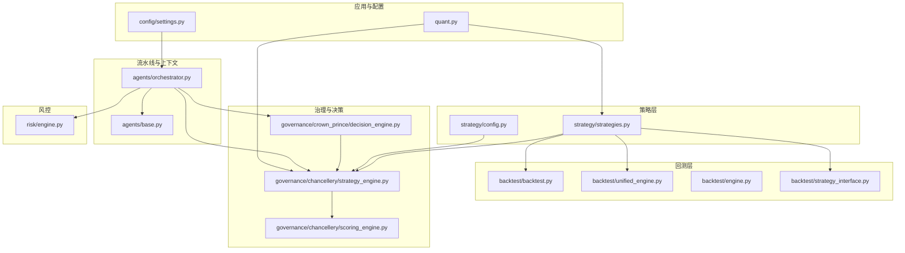
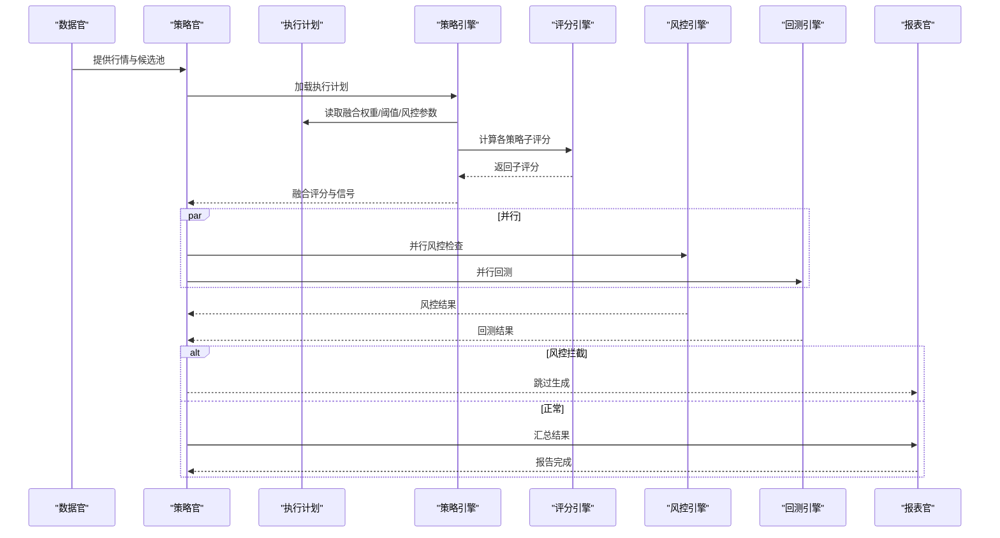
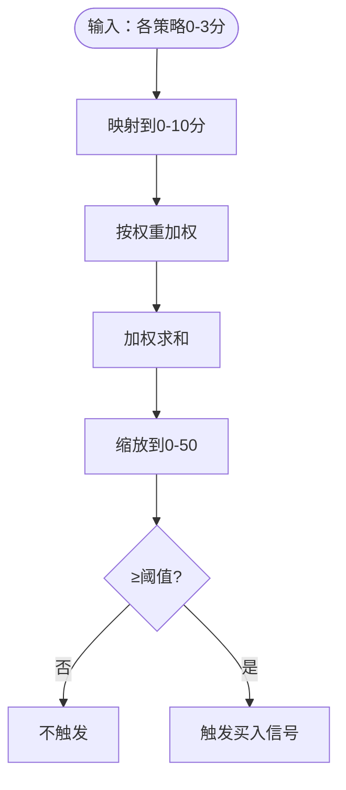
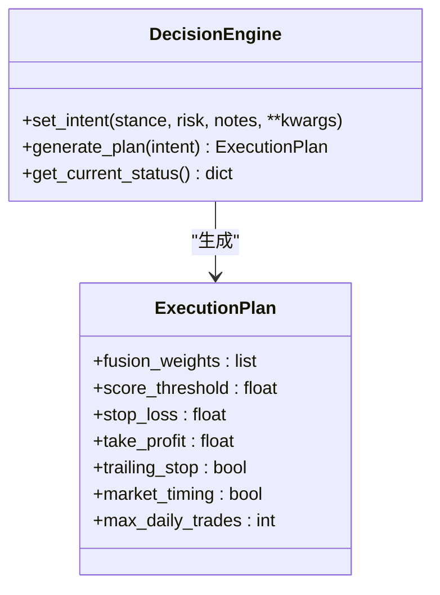
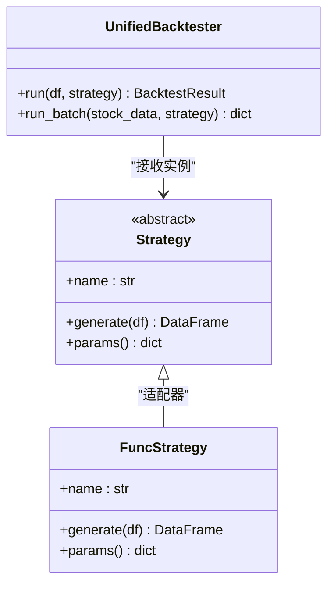
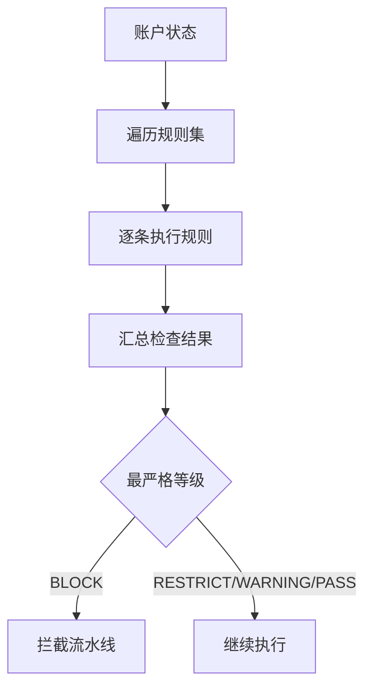
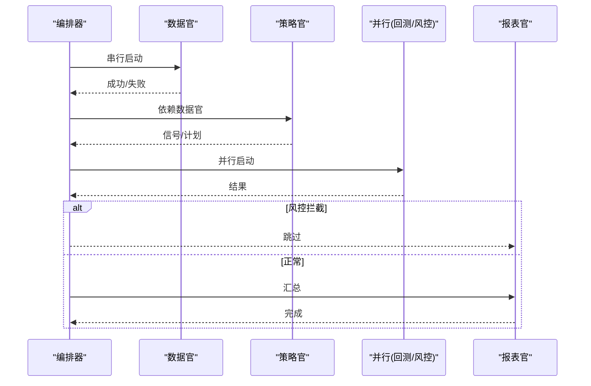
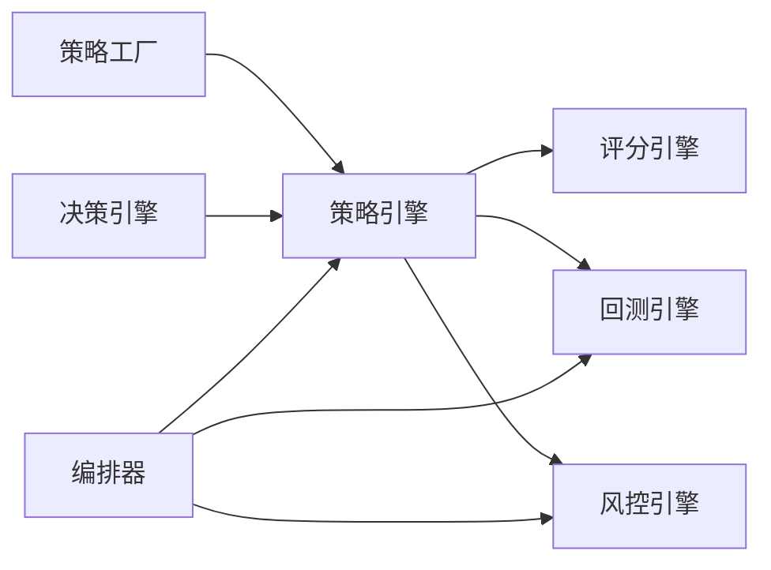

# 多策略融合回测

<cite>
**本文引用的文件**
- [README.md](file://README.md)
- [backtest/backtest.py](file://backtest/backtest.py)
- [backtest/unified_engine.py](file://backtest/unified_engine.py)
- [backtest/engine.py](file://backtest/engine.py)
- [backtest/strategy_interface.py](file://backtest/strategy_interface.py)
- [strategy/strategies.py](file://strategy/strategies.py)
- [strategy/config.py](file://strategy/config.py)
- [governance/chancellery/scoring_engine.py](file://governance/chancellery/scoring_engine.py)
- [governance/chancellery/strategy_engine.py](file://governance/chancellery/strategy_engine.py)
- [governance/crown_prince/decision_engine.py](file://governance/crown_prince/decision_engine.py)
- [agents/orchestrator.py](file://agents/orchestrator.py)
- [agents/base.py](file://agents/base.py)
- [risk/engine.py](file://risk/engine.py)
- [quant.py](file://quant.py)
- [config/settings.py](file://config/settings.py)
</cite>

## 目录
1. [引言](#引言)
2. [项目结构](#项目结构)
3. [核心组件](#核心组件)
4. [架构总览](#架构总览)
5. [详细组件分析](#详细组件分析)
6. [依赖分析](#依赖分析)
7. [性能考虑](#性能考虑)
8. [故障排查指南](#故障排查指南)
9. [结论](#结论)
10. [附录](#附录)

## 引言
本技术文档面向AIQuant多策略融合回测系统，围绕“多策略融合算法”“评分机制”“决策流程”“统一回测引擎”“策略协调与资源管理”“参数配置与融合规则”“性能评估与对比分析”等主题，系统梳理代码架构、数据流与处理逻辑，并提供可视化图示与实操指引，帮助读者快速理解并高效构建可验证的多策略融合体系。

## 项目结构
项目采用“模块化+流水线编排”的组织方式：
- backtest：回测核心与引擎
- strategy：策略工厂与融合
- governance：三省（中书省/太子院/尚书省）治理与决策
- agents：流水线编排与上下文
- risk：风控引擎
- quant：扫描与参数常量
- config：基础配置与策略配置

图表来源
- [backtest/backtest.py:1-517](file://backtest/backtest.py#L1-L517)
- [backtest/unified_engine.py:1-143](file://backtest/unified_engine.py#L1-L143)
- [backtest/engine.py:1-174](file://backtest/engine.py#L1-L174)
- [backtest/strategy_interface.py:1-86](file://backtest/strategy_interface.py#L1-L86)
- [strategy/strategies.py:1-431](file://strategy/strategies.py#L1-L431)
- [strategy/config.py:1-132](file://strategy/config.py#L1-L132)
- [governance/crown_prince/decision_engine.py:1-157](file://governance/crown_prince/decision_engine.py#L1-L157)
- [governance/chancellery/scoring_engine.py:1-370](file://governance/chancellery/scoring_engine.py#L1-L370)
- [governance/chancellery/strategy_engine.py:1-103](file://governance/chancellery/strategy_engine.py#L1-L103)
- [agents/orchestrator.py:1-263](file://agents/orchestrator.py#L1-L263)
- [agents/base.py:1-120](file://agents/base.py#L1-L120)
- [risk/engine.py:1-168](file://risk/engine.py#L1-L168)
- [quant.py:1-631](file://quant.py#L1-L631)
- [config/settings.py:1-25](file://config/settings.py#L1-L25)

章节来源
- [README.md:1-3](file://README.md#L1-L3)
- [config/settings.py:1-25](file://config/settings.py#L1-L25)

## 核心组件
- 多策略融合与评分
  - 策略工厂与融合：提供5类独立策略及融合函数，支持将各策略0-3分映射至0-10分，再按权重加权得到0-50的融合分。
  - 多因子评分：中书省评分引擎提供趋势、动量、波动率、成交量、质量五因子，支持权重配置与信号汇总。
- 决策与执行计划
  - 太子院决策引擎：根据市场立场与风险偏好生成执行计划，包括融合权重、阈值、止损止盈、择时开关等。
  - 中书省策略引擎：加载执行计划，对单只股票进行策略子评分融合，输出信号与参数。
- 回测引擎
  - 传统回测：支持T+1执行、滑点、手续费、止损止盈、最大持仓天数、回撤熔断、大盘择时、动态仓位等。
  - 统一回测引擎：面向Strategy接口的插件化回测框架，逐步替代历史回测逻辑。
  - Backtrader适配：提供FusionStrategy适配器，封装策略参数与回测流程。
- 风控引擎
  - 全量风控检查，聚合最严格等级，记录状态与事件，支持数据库持久化。
- 流水线编排
  - 三省六部制流水线：数据官→策略官→回测官/风控官（并行）→报表官；风控一票否决。
- 应用与参数
  - 扫描与参数常量：提供扫描任务、阈值、止损止盈、融合阈值、回填策略分等。

章节来源
- [strategy/strategies.py:1-431](file://strategy/strategies.py#L1-L431)
- [governance/chancellery/scoring_engine.py:1-370](file://governance/chancellery/scoring_engine.py#L1-L370)
- [governance/crown_prince/decision_engine.py:1-157](file://governance/crown_prince/decision_engine.py#L1-L157)
- [governance/chancellery/strategy_engine.py:1-103](file://governance/chancellery/strategy_engine.py#L1-L103)
- [backtest/backtest.py:1-517](file://backtest/backtest.py#L1-L517)
- [backtest/unified_engine.py:1-143](file://backtest/unified_engine.py#L1-L143)
- [backtest/engine.py:1-174](file://backtest/engine.py#L1-L174)
- [risk/engine.py:1-168](file://risk/engine.py#L1-L168)
- [agents/orchestrator.py:1-263](file://agents/orchestrator.py#L1-L263)
- [quant.py:1-631](file://quant.py#L1-L631)

## 架构总览
多策略融合回测系统采用“策略→评分→决策→执行→风控→回测→报告”的闭环流水线。策略层产出子评分，中书省融合为融合分，决策引擎给出执行计划，流水线并行执行回测与风控，最终生成报告。

图表来源
- [agents/orchestrator.py:112-153](file://agents/orchestrator.py#L112-L153)
- [governance/crown_prince/decision_engine.py:87-122](file://governance/crown_prince/decision_engine.py#L87-L122)
- [governance/chancellery/strategy_engine.py:39-91](file://governance/chancellery/strategy_engine.py#L39-L91)
- [governance/chancellery/scoring_engine.py:264-314](file://governance/chancellery/scoring_engine.py#L264-L314)
- [risk/engine.py:19-49](file://risk/engine.py#L19-L49)
- [backtest/backtest.py:121-409](file://backtest/backtest.py#L121-L409)

## 详细组件分析

### 多策略融合与评分机制
- 策略工厂
  - 5类策略各自独立，返回BUY_SIGNAL/SELL_SIGNAL/SCORE列，便于统一处理。
  - 融合函数将各策略0-3分映射到0-10分，按权重加权，得到0-50融合分，设定阈值触发。
- 多因子评分
  - 五因子：趋势、动量、波动率、成交量、质量，支持权重配置与信号汇总。
  - 输出标准化评分与等级、推荐语，便于高层决策。

图表来源
- [strategy/strategies.py:368-429](file://strategy/strategies.py#L368-L429)
- [governance/chancellery/scoring_engine.py:246-314](file://governance/chancellery/scoring_engine.py#L246-L314)

章节来源
- [strategy/strategies.py:1-431](file://strategy/strategies.py#L1-L431)
- [governance/chancellery/scoring_engine.py:1-370](file://governance/chancellery/scoring_engine.py#L1-L370)

### 决策与执行计划
- 市场立场与风险偏好
  - 市场立场：看多/中性/看空/防守
  - 风险偏好：保守/稳健/激进
- 执行计划
  - 融合权重映射（随立场变化）
  - 阈值、止损止盈、移动止损、择时开关、日交易频次等

图表来源
- [governance/crown_prince/decision_engine.py:61-137](file://governance/crown_prince/decision_engine.py#L61-L137)

章节来源
- [governance/crown_prince/decision_engine.py:1-157](file://governance/crown_prince/decision_engine.py#L1-L157)

### 统一回测引擎与策略接口
- Strategy接口
  - 统一generate(df)生成信号与评分，便于回测引擎插件化。
- UnifiedBacktester
  - 插件化回测框架，接收Strategy实例列表，支持T+1执行、滑点、手续费、止损止盈、最大持仓天数、回撤熔断、择时、动态仓位等。
- Backtrader适配
  - FusionStrategy适配器，封装策略参数与回测流程。

图表来源
- [backtest/strategy_interface.py:23-86](file://backtest/strategy_interface.py#L23-L86)
- [backtest/unified_engine.py:59-143](file://backtest/unified_engine.py#L59-L143)
- [backtest/engine.py:39-174](file://backtest/engine.py#L39-L174)

章节来源
- [backtest/strategy_interface.py:1-86](file://backtest/strategy_interface.py#L1-L86)
- [backtest/unified_engine.py:1-143](file://backtest/unified_engine.py#L1-L143)
- [backtest/engine.py:1-174](file://backtest/engine.py#L1-L174)

### 风控引擎与拦截机制
- 全量风控检查，聚合最严格等级
- 记录风险事件与状态，支持数据库持久化
- 流水线中门下省一票否决，阻止进入报表阶段

图表来源
- [risk/engine.py:19-49](file://risk/engine.py#L19-L49)
- [agents/orchestrator.py:140-150](file://agents/orchestrator.py#L140-L150)

章节来源
- [risk/engine.py:1-168](file://risk/engine.py#L1-L168)
- [agents/orchestrator.py:1-263](file://agents/orchestrator.py#L1-L263)

### 流水线编排与上下文
- 三省六部制：数据官→策略官→回测官/风控官（并行）→报表官
- 并行执行与错误处理，状态持久化
- AgentContext统一传递上下文数据

图表来源
- [agents/orchestrator.py:112-175](file://agents/orchestrator.py#L112-L175)
- [agents/base.py:38-86](file://agents/base.py#L38-L86)

章节来源
- [agents/orchestrator.py:1-263](file://agents/orchestrator.py#L1-L263)
- [agents/base.py:1-120](file://agents/base.py#L1-L120)

### 参数配置与融合规则
- 策略配置加载器
  - YAML热加载，支持获取融合权重、回测参数、交易参数等
- 扫描与参数常量
  - 提供扫描阈值、止损止盈、融合阈值、回填阈值等常量
  - 支持v4超跌反弹策略与5策略融合两种扫描模式

章节来源
- [strategy/config.py:1-132](file://strategy/config.py#L1-L132)
- [quant.py:43-52](file://quant.py#L43-L52)
- [quant.py:177-282](file://quant.py#L177-L282)

## 依赖分析
- 组件耦合
  - 策略层与回测层通过Strategy接口解耦
  - 决策层与策略层通过执行计划解耦
  - 风控层独立于策略与回测，仅消费账户状态
- 关键依赖链
  - 策略工厂 → 策略引擎 → 评分引擎 → 决策引擎 → 回测/风控并行
  - 流水线编排器贯穿各Agent，负责顺序与并行控制

图表来源
- [strategy/strategies.py:1-431](file://strategy/strategies.py#L1-L431)
- [governance/chancellery/strategy_engine.py:1-103](file://governance/chancellery/strategy_engine.py#L1-L103)
- [governance/chancellery/scoring_engine.py:1-370](file://governance/chancellery/scoring_engine.py#L1-L370)
- [governance/crown_prince/decision_engine.py:1-157](file://governance/crown_prince/decision_engine.py#L1-L157)
- [agents/orchestrator.py:1-263](file://agents/orchestrator.py#L1-L263)

章节来源
- [agents/orchestrator.py:1-263](file://agents/orchestrator.py#L1-L263)
- [strategy/strategies.py:1-431](file://strategy/strategies.py#L1-L431)

## 性能考虑
- 回测性能
  - T+1执行与延迟队列减少未来数据泄露风险
  - 滑点、手续费、动态仓位等实时成本纳入计算
  - 大盘择时与回撤熔断降低极端风险暴露
- 融合评分
  - 各策略0-3分映射到0-10分，避免极端值干扰
  - 权重总和为1，融合分0-50，便于阈值设定
- 并行执行
  - 回测与风控并行，缩短端到端时延
- 数据与配置
  - YAML热加载避免重启，提升策略参数调整效率

## 故障排查指南
- 回测失败
  - 检查输入数据是否包含open列（T+1执行必需）
  - 核对信号列命名与生成逻辑
- 风控拦截
  - 查看风控事件与状态表，定位触发规则
  - 调整阈值或策略参数
- 流水线异常
  - 查看编排器历史记录与AgentResult错误信息
  - 确认依赖Agent是否成功

章节来源
- [backtest/unified_engine.py:119-125](file://backtest/unified_engine.py#L119-L125)
- [risk/engine.py:73-127](file://risk/engine.py#L73-L127)
- [agents/orchestrator.py:155-157](file://agents/orchestrator.py#L155-L157)

## 结论
本系统通过“策略工厂+多因子评分+决策计划+统一回测+风控拦截+流水线编排”的架构，实现了可插拔、可配置、可验证的多策略融合回测体系。策略层提供灵活的子评分与融合规则，决策层依据市场环境动态调整权重与阈值，回测与风控并行保障执行质量，流水线确保流程可控与可观测。建议在实际部署中结合历史回测与滚动测试，持续优化权重与参数，以获得稳健的超额收益与可控的风险水平。

## 附录

### 多策略参数配置指南
- 策略配置
  - 通过YAML热加载获取融合权重、回测参数、交易参数
  - 支持按预设方案切换权重
- 扫描参数
  - v4超跌反弹：阈值1.8，映射到0-50分
  - 5策略融合：默认权重，融合阈值28.0
  - 止损-6%、止盈+20%、日交易频次等

章节来源
- [strategy/config.py:103-127](file://strategy/config.py#L103-L127)
- [quant.py:43-52](file://quant.py#L43-L52)
- [quant.py:177-282](file://quant.py#L177-L282)

### 融合规则设置
- 子评分映射：0-3分 → 0-10分
- 权重加权：融合分 ∈ [0,50]
- 触发阈值：融合分≥阈值触发买入

章节来源
- [strategy/strategies.py:368-429](file://strategy/strategies.py#L368-L429)

### 绩效评估方法
- 传统回测指标：总收益、年化收益、最大回撤、夏普比率、胜率、盈亏比、平均持仓天数、基准收益与Alpha
- 统一回测结果对象：包含交易明细、资金曲线、日期序列等

章节来源
- [backtest/backtest.py:34-54](file://backtest/backtest.py#L34-L54)
- [backtest/backtest.py:411-494](file://backtest/backtest.py#L411-L494)
- [backtest/unified_engine.py:37-57](file://backtest/unified_engine.py#L37-L57)

### 实战案例与验证建议
- 案例：以某日行情数据为输入，分别运行5策略融合与v4超跌反弹，比较融合分与触发信号
- 验证：对历史N日滚动回测，观察胜率、最大回撤与年化收益稳定性
- 优化：基于回测结果微调权重与阈值，结合风控策略调整止损止盈与择时开关

章节来源
- [quant.py:289-337](file://quant.py#L289-L337)
- [backtest/backtest.py:121-409](file://backtest/backtest.py#L121-L409)