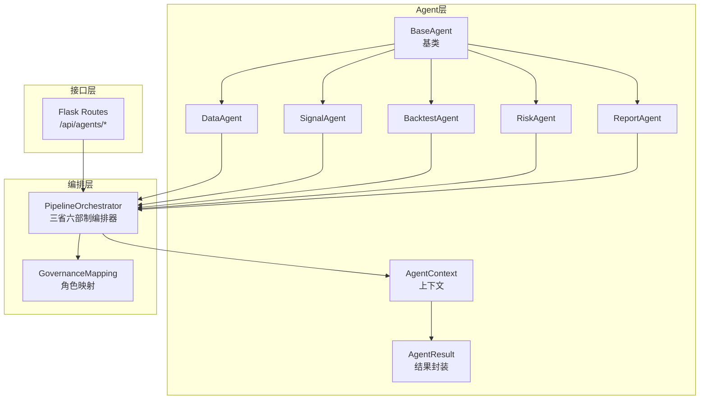
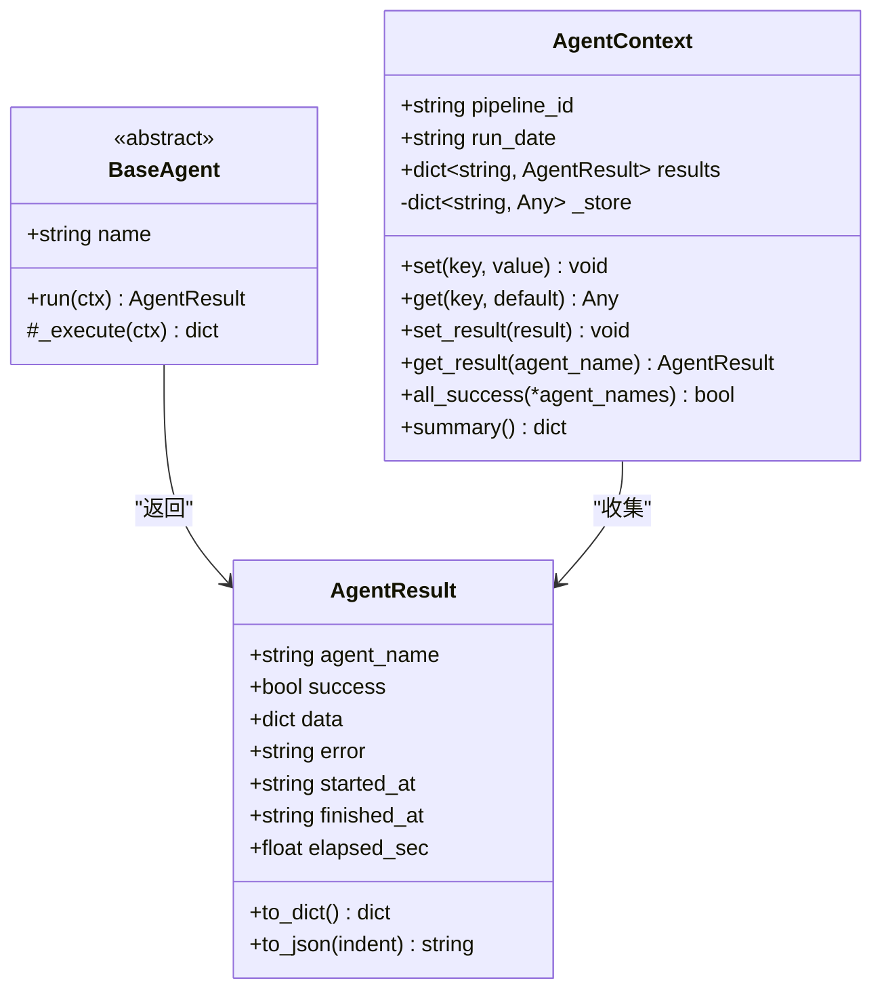
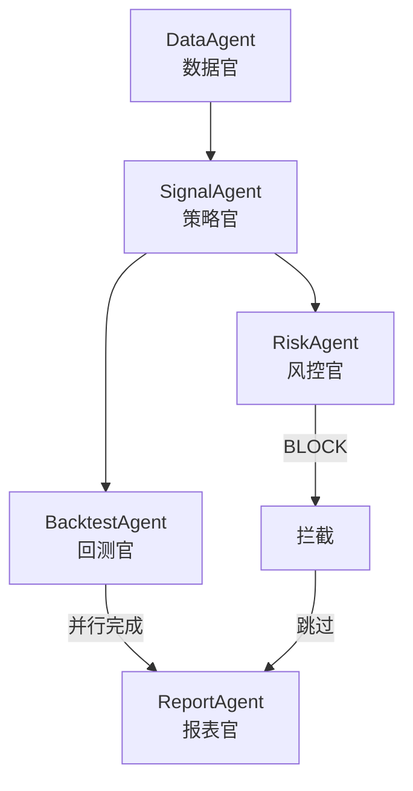
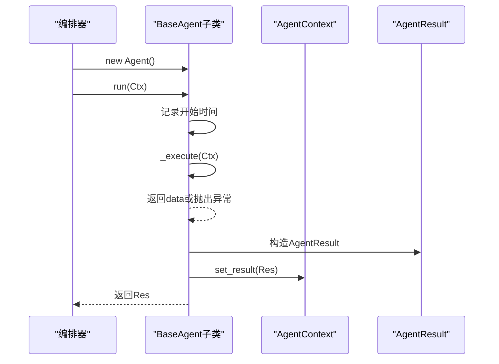
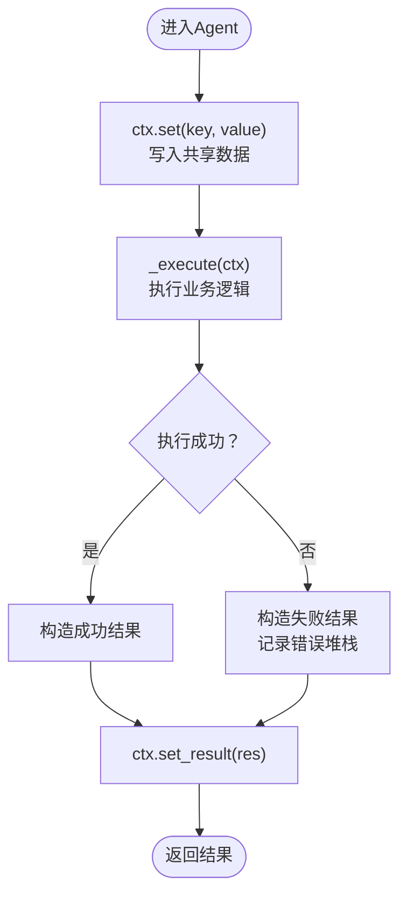
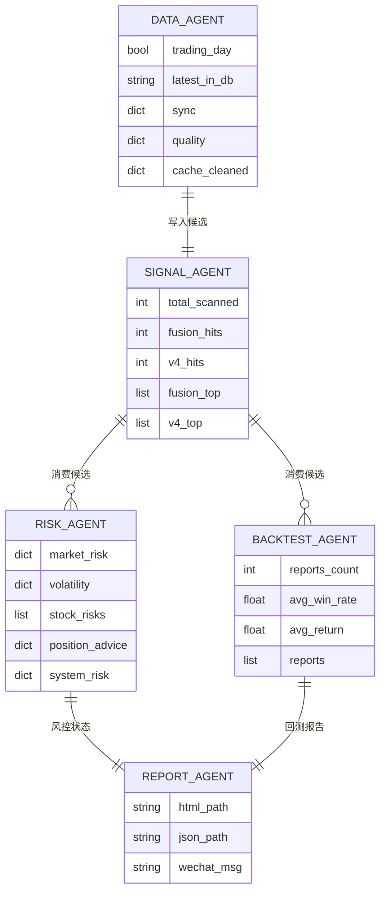
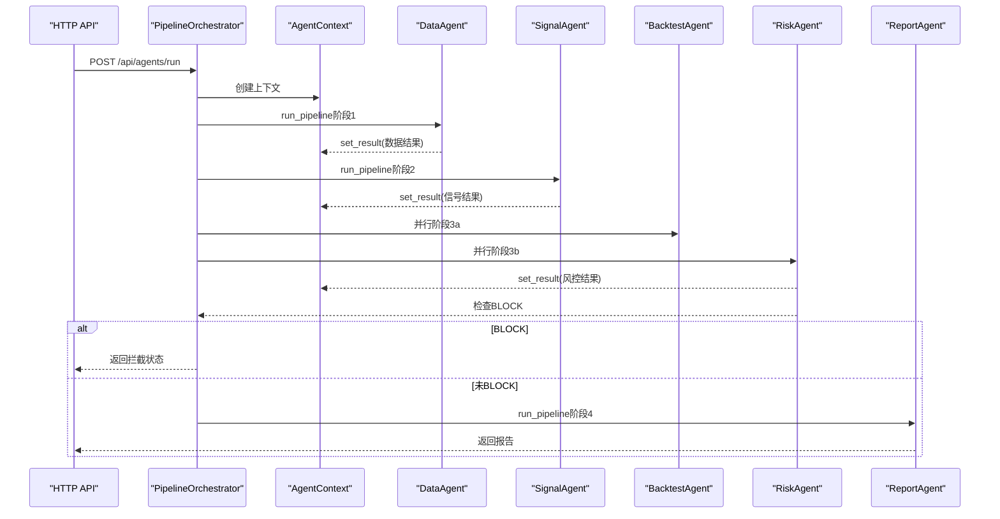
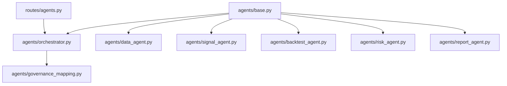

# Agent基类设计

<cite>
**本文档引用的文件**
- [agents/base.py](file://agents/base.py)
- [agents/orchestrator.py](file://agents/orchestrator.py)
- [agents/__init__.py](file://agents/__init__.py)
- [agents/governance_mapping.py](file://agents/governance_mapping.py)
- [agents/data_agent.py](file://agents/data_agent.py)
- [agents/signal_agent.py](file://agents/signal_agent.py)
- [agents/backtest_agent.py](file://agents/backtest_agent.py)
- [agents/risk_agent.py](file://agents/risk_agent.py)
- [agents/report_agent.py](file://agents/report_agent.py)
- [routes/agents.py](file://routes/agents.py)
</cite>

## 目录
1. [引言](#引言)
2. [项目结构](#项目结构)
3. [核心组件](#核心组件)
4. [架构概览](#架构概览)
5. [详细组件分析](#详细组件分析)
6. [依赖分析](#依赖分析)
7. [性能考虑](#性能考虑)
8. [故障排除指南](#故障排除指南)
9. [结论](#结论)
10. [附录](#附录)

## 引言
本文件面向AIQuant项目的Agent基类系统，提供从架构设计到实现细节的完整技术文档。重点涵盖：
- AgentContext上下文管理机制：跨Agent共享数据、结果收集与汇总
- AgentResult结果封装：统一的执行结果结构、序列化与摘要
- BaseAgent基类的设计模式、生命周期管理与接口规范
- Agent状态管理、错误处理与结果传递机制
- Agent之间的通信协议与数据交换格式
- 继承指南、扩展方法与自定义Agent示例路径
- 三省六部制流水线编排与API交互

## 项目结构
AIQuant采用多Agent协作的Alpha流水线，核心位于agents目录，围绕BaseAgent与PipelineOrchestrator构建：
- agents/base.py：定义AgentResult、AgentContext与BaseAgent基类
- agents/orchestrator.py：三省六部制流水线编排器，负责串行/并行调度、状态持久化与历史记录
- agents/governance_mapping.py：三省六部角色映射，提供统一命名与流程描述
- agents/data_agent.py、signal_agent.py、backtest_agent.py、risk_agent.py、report_agent.py：具体Agent实现
- routes/agents.py：提供流水线状态查询、手动触发、历史查询与报告查看的HTTP API

**图表来源**
- [agents/base.py:88-120](file://agents/base.py#L88-L120)
- [agents/orchestrator.py:36-263](file://agents/orchestrator.py#L36-L263)
- [agents/governance_mapping.py:21-155](file://agents/governance_mapping.py#L21-L155)
- [routes/agents.py:13-128](file://routes/agents.py#L13-L128)

**章节来源**
- [agents/__init__.py:1-27](file://agents/__init__.py#L1-L27)
- [agents/base.py:20-120](file://agents/base.py#L20-L120)
- [agents/orchestrator.py:36-263](file://agents/orchestrator.py#L36-L263)
- [agents/governance_mapping.py:1-155](file://agents/governance_mapping.py#L1-L155)
- [routes/agents.py:13-128](file://routes/agents.py#L13-L128)

## 核心组件
本节深入剖析Agent基类系统的核心数据结构与接口。

- AgentResult：统一的结果封装，包含Agent名称、成功标志、数据载荷、错误信息、起止时间与耗时，并提供字典与JSON序列化能力
- AgentContext：流水线共享上下文，提供键值存储、结果登记、批量查询与摘要生成
- BaseAgent：抽象基类，定义run(ctx)统一入口与生命周期钩子，内部自动计时、异常捕获与结果登记

**图表来源**
- [agents/base.py:20-120](file://agents/base.py#L20-L120)

**章节来源**
- [agents/base.py:20-120](file://agents/base.py#L20-L120)

## 架构概览
AIQuant采用“三省六部制”组织Agent协作，编排器负责控制执行顺序、并行与拦截点：
- 太子院·数据官(DataAgent)：数据前置校验与同步
- 中书省·策略官(SignalAgent)：策略信号生成与候选筛选
- 门下省·风控官(RiskAgent)：风控审核与一票否决
- 尚书省·回测官(BacktestAgent)：历史回测验证
- 尚书省·报表官(ReportAgent)：整合输出与报告生成

**图表来源**
- [agents/orchestrator.py:111-153](file://agents/orchestrator.py#L111-L153)
- [agents/governance_mapping.py:111-155](file://agents/governance_mapping.py#L111-L155)

**章节来源**
- [agents/orchestrator.py:36-263](file://agents/orchestrator.py#L36-L263)
- [agents/governance_mapping.py:1-155](file://agents/governance_mapping.py#L1-L155)

## 详细组件分析

### BaseAgent与生命周期
BaseAgent定义了Agent的统一生命周期：
- run(ctx)：自动记录开始时间、调用子类_execute、捕获异常、计算耗时、登记结果并返回
- _execute(ctx)：抽象方法，子类实现具体业务逻辑，返回字典作为data载荷

**图表来源**
- [agents/base.py:93-119](file://agents/base.py#L93-L119)

**章节来源**
- [agents/base.py:88-120](file://agents/base.py#L88-L120)

### AgentContext上下文管理
AgentContext提供：
- set/get：键值存储，用于跨Agent共享数据
- set_result/get_result：登记与查询Agent执行结果
- all_success：批量检查多个Agent是否全部成功
- summary：生成流水线执行摘要，包含每个Agent的成功标志、耗时与错误片段

**图表来源**
- [agents/base.py:38-86](file://agents/base.py#L38-L86)

**章节来源**
- [agents/base.py:38-86](file://agents/base.py#L38-L86)

### AgentResult结果封装
AgentResult提供：
- 字段：agent_name、success、data、error、started_at、finished_at、elapsed_sec
- 序列化：to_dict与to_json，便于日志与API传输
- 与AgentContext的集成：编排器通过ctx.summary聚合结果

**章节来源**
- [agents/base.py:20-36](file://agents/base.py#L20-L36)

### 具体Agent实现与数据交换
- DataAgent：返回trading_day、latest_in_db、sync统计、quality检查与cache清理结果
- SignalAgent：返回融合与v4策略命中数量、Top候选列表，并写入fusion_candidates、v4_candidates等上下文键
- BacktestAgent：基于候选列表进行历史回测，返回各候选的胜率、平均收益与最大回撤
- RiskAgent：返回大盘趋势、波动率、个股风险筛查、仓位建议与系统化风控状态
- ReportAgent：整合上游结果，生成HTML与JSON报告，以及微信推送文本

**图表来源**
- [agents/data_agent.py:31-86](file://agents/data_agent.py#L31-L86)
- [agents/signal_agent.py:47-108](file://agents/signal_agent.py#L47-L108)
- [agents/backtest_agent.py:37-68](file://agents/backtest_agent.py#L37-L68)
- [agents/risk_agent.py:31-96](file://agents/risk_agent.py#L31-L96)
- [agents/report_agent.py:63-90](file://agents/report_agent.py#L63-L90)

**章节来源**
- [agents/data_agent.py:25-167](file://agents/data_agent.py#L25-L167)
- [agents/signal_agent.py:41-213](file://agents/signal_agent.py#L41-L213)
- [agents/backtest_agent.py:31-181](file://agents/backtest_agent.py#L31-L181)
- [agents/risk_agent.py:25-262](file://agents/risk_agent.py#L25-L262)
- [agents/report_agent.py:20-393](file://agents/report_agent.py#L20-L393)

### 编排器与流水线控制
PipelineOrchestrator负责：
- 状态查询：is_running、get_current_status、get_history
- 核心执行：run_pipeline，按阶段串行/并行执行，支持非交易日处理与风控拦截
- 单Agent执行：run_single用于调试
- 并行执行：_run_parallel通过多线程并行运行多个Agent

**图表来源**
- [agents/orchestrator.py:81-175](file://agents/orchestrator.py#L81-L175)
- [routes/agents.py:34-69](file://routes/agents.py#L34-L69)

**章节来源**
- [agents/orchestrator.py:36-263](file://agents/orchestrator.py#L36-L263)
- [routes/agents.py:13-128](file://routes/agents.py#L13-L128)

### API与状态查询
routes/agents.py提供：
- GET /api/agents/status：当前流水线运行状态与摘要
- POST /api/agents/run：异步触发完整流水线
- POST /api/agents/run/<name>：触发单个Agent
- GET /api/agents/history：最近执行历史
- GET /api/agents/report：查看最新报告
- GET /api/agents/governance：三省六部制架构信息

**章节来源**
- [routes/agents.py:13-128](file://routes/agents.py#L13-L128)

## 依赖分析
- BaseAgent与AgentResult、AgentContext为纯Python数据结构，无外部依赖
- Orchestrator依赖延迟导入机制避免缺失第三方库导致的加载失败
- 各Agent实现依赖各自领域模块（数据、策略、回测、风控、报告）
- API层依赖Flask蓝图与编排器单例

**图表来源**
- [agents/base.py:88-120](file://agents/base.py#L88-L120)
- [agents/orchestrator.py:36-52](file://agents/orchestrator.py#L36-L52)
- [routes/agents.py:13-17](file://routes/agents.py#L13-L17)

**章节来源**
- [agents/base.py:88-120](file://agents/base.py#L88-L120)
- [agents/orchestrator.py:36-52](file://agents/orchestrator.py#L36-L52)
- [routes/agents.py:13-17](file://routes/agents.py#L13-L17)

## 性能考虑
- 计时精度：run方法使用高精度计时器记录执行耗时
- 并行执行：编排器对回测与风控阶段采用多线程并行，提升吞吐
- 数据访问：Agent通过上下文键读写，避免重复计算与冗余IO
- 序列化开销：AgentResult提供to_json便于日志与API传输，注意大对象序列化成本

[本节为通用指导，无需特定文件引用]

## 故障排除指南
- 流水线已在运行：编排器在并发执行时会拒绝重复启动
- 非交易日处理：若数据官返回非交易日，编排器尝试使用最近交易日数据继续执行
- 风控拦截：风控官若判定BLOCK，编排器跳过报表生成并记录拦截事件
- 结果查询：通过API获取当前状态与历史记录，定位失败Agent与错误片段

**章节来源**
- [agents/orchestrator.py:94-175](file://agents/orchestrator.py#L94-L175)
- [routes/agents.py:22-77](file://routes/agents.py#L22-L77)

## 结论
AIQuant的Agent基类系统通过统一的上下文与结果封装，实现了清晰的职责分离与可扩展的流水线编排。BaseAgent提供稳定的生命周期与错误处理，编排器确保执行顺序与并行效率，API层提供可观测性与可操作性。三省六部制的角色映射使系统具备良好的组织性与可维护性。

[本节为总结性内容，无需特定文件引用]

## 附录

### 继承指南与扩展方法
- 继承BaseAgent并实现_name与_abstract _execute(ctx)方法
- 在_execute中读取上下文键，执行业务逻辑，返回字典作为data载荷
- 使用ctx.set(key, value)写入共享数据，供下游Agent消费
- 注意异常处理：框架会自动捕获异常并记录到AgentResult.error

**章节来源**
- [agents/base.py:88-120](file://agents/base.py#L88-L120)

### 自定义Agent示例路径
- 参考DataAgent的完整实现，学习数据前置与质量检查流程
  - [agents/data_agent.py:25-167](file://agents/data_agent.py#L25-L167)
- 参考SignalAgent的策略扫描与候选生成流程
  - [agents/signal_agent.py:41-213](file://agents/signal_agent.py#L41-L213)
- 参考BacktestAgent的历史回测与统计聚合
  - [agents/backtest_agent.py:31-181](file://agents/backtest_agent.py#L31-L181)
- 参考RiskAgent的风控评估与系统化检查
  - [agents/risk_agent.py:25-262](file://agents/risk_agent.py#L25-L262)
- 参考ReportAgent的报告整合与输出
  - [agents/report_agent.py:20-393](file://agents/report_agent.py#L20-L393)

### 通信协议与数据交换格式
- 上下文键：Agent通过ctx.set/get在流水线内传递数据
- 结果格式：AgentResult包含统一字段，支持to_dict与to_json
- API响应：状态查询返回流水线摘要，历史查询返回最近执行记录，报告查询返回JSON数据

**章节来源**
- [agents/base.py:20-36](file://agents/base.py#L20-L36)
- [routes/agents.py:22-97](file://routes/agents.py#L22-L97)