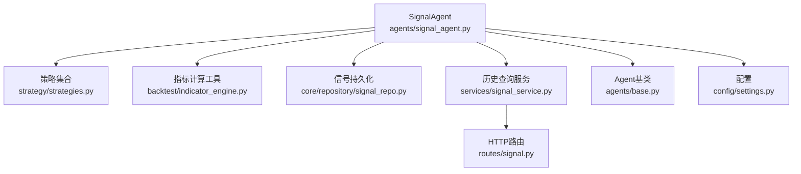
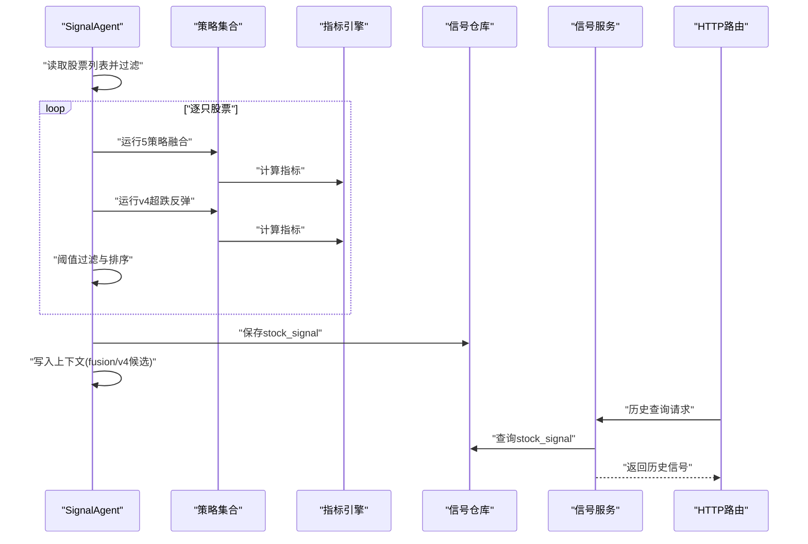
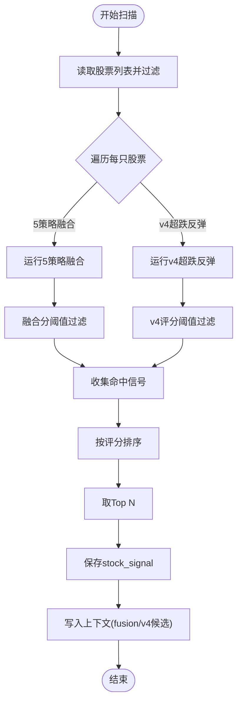
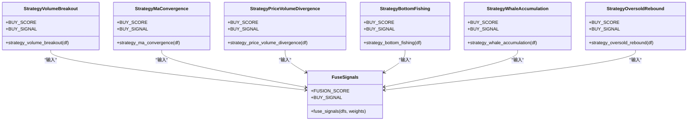
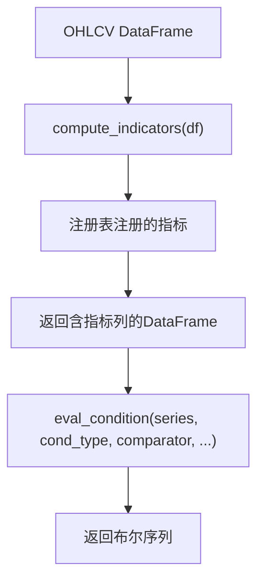
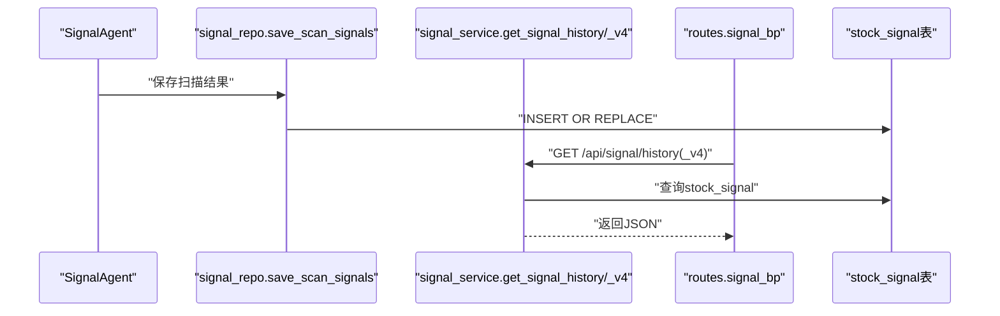
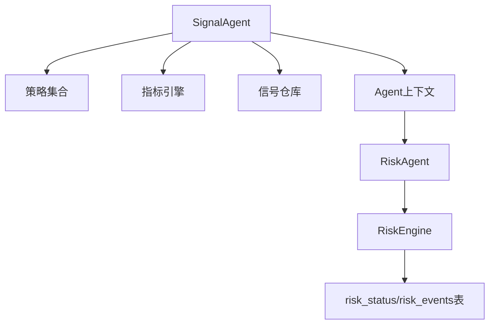
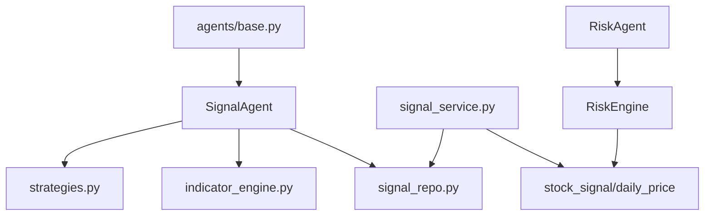

# 信号Agent

<cite>
**本文档引用的文件**
- [agents/signal_agent.py](file://agents/signal_agent.py)
- [services/signal_service.py](file://services/signal_service.py)
- [strategy/strategies.py](file://strategy/strategies.py)
- [strategy/indicators.py](file://strategy/indicators.py)
- [backtest/indicator_engine.py](file://backtest/indicator_engine.py)
- [core/repository/signal_repo.py](file://core/repository/signal_repo.py)
- [routes/signal.py](file://routes/signal.py)
- [quant.py](file://quant.py)
- [agents/base.py](file://agents/base.py)
- [risk/engine.py](file://risk/engine.py)
- [config/settings.py](file://config/settings.py)
</cite>

## 目录
1. [简介](#简介)
2. [项目结构](#项目结构)
3. [核心组件](#核心组件)
4. [架构概览](#架构概览)
5. [详细组件分析](#详细组件分析)
6. [依赖分析](#依赖分析)
7. [性能考虑](#性能考虑)
8. [故障排查指南](#故障排查指南)
9. [结论](#结论)
10. [附录](#附录)

## 简介
本文件为AIQuant信号Agent的技术文档，聚焦多策略信号生成、信号融合与信号过滤机制，系统阐述技术指标计算、信号判定逻辑与风险评估方法，并详细说明信号质量评分、信号时效性与一致性检查。文档还提供信号Agent的参数配置与优化策略、具体信号生成示例与验证方法，以及与策略引擎和风控系统的集成方式。

## 项目结构
信号Agent位于agents目录，负责运行多策略扫描、生成候选列表并保存至数据库供面板展示。其核心流程包括：
- 读取全市场股票列表，排除科创板与创业板
- 逐只股票运行5策略融合与v4超跌反弹策略
- 依据阈值过滤并排序，生成Top候选
- 保存到stock_signal表，供历史查询与面板展示

图表来源
- [agents/signal_agent.py:41-108](file://agents/signal_agent.py#L41-L108)
- [strategy/strategies.py:36-431](file://strategy/strategies.py#L36-L431)
- [backtest/indicator_engine.py:287-358](file://backtest/indicator_engine.py#L287-L358)
- [core/repository/signal_repo.py:46-99](file://core/repository/signal_repo.py#L46-L99)
- [services/signal_service.py:12-122](file://services/signal_service.py#L12-L122)
- [routes/signal.py:12-45](file://routes/signal.py#L12-L45)
- [agents/base.py:88-119](file://agents/base.py#L88-L119)
- [config/settings.py:6-25](file://config/settings.py#L6-L25)

章节来源
- [agents/signal_agent.py:41-108](file://agents/signal_agent.py#L41-L108)
- [strategy/strategies.py:36-431](file://strategy/strategies.py#L36-L431)
- [backtest/indicator_engine.py:287-358](file://backtest/indicator_engine.py#L287-L358)
- [core/repository/signal_repo.py:46-99](file://core/repository/signal_repo.py#L46-L99)
- [services/signal_service.py:12-122](file://services/signal_service.py#L12-L122)
- [routes/signal.py:12-45](file://routes/signal.py#L12-L45)
- [agents/base.py:88-119](file://agents/base.py#L88-L119)
- [config/settings.py:6-25](file://config/settings.py#L6-L25)

## 核心组件
- SignalAgent：执行多策略扫描、融合与过滤，生成候选列表并保存
- 策略集合：包含5策略融合与v4超跌反弹策略，统一返回BUY_SCORE与BUY_SIGNAL
- 指标计算：提供批量指标计算与条件评估能力
- 信号持久化：将扫描结果保存至stock_signal表
- 历史查询服务：支持按日期范围查询历史信号
- Agent基类：提供统一的执行、计时与异常包装
- 配置：数据库路径、API端口、定时任务等基础配置

章节来源
- [agents/signal_agent.py:41-108](file://agents/signal_agent.py#L41-L108)
- [strategy/strategies.py:36-431](file://strategy/strategies.py#L36-L431)
- [backtest/indicator_engine.py:287-358](file://backtest/indicator_engine.py#L287-L358)
- [core/repository/signal_repo.py:46-99](file://core/repository/signal_repo.py#L46-L99)
- [services/signal_service.py:12-122](file://services/signal_service.py#L12-L122)
- [agents/base.py:88-119](file://agents/base.py#L88-L119)
- [config/settings.py:6-25](file://config/settings.py#L6-L25)

## 架构概览
信号Agent的执行流程如下：
- 读取全市场股票列表并过滤
- 对每只股票分别运行5策略融合与v4超跌反弹策略
- 基于阈值过滤并排序，取Top N
- 保存到stock_signal表，同时写入Agent上下文供下游使用
- 提供历史查询接口，支持按日期范围与阈值检索

图表来源
- [agents/signal_agent.py:47-108](file://agents/signal_agent.py#L47-L108)
- [strategy/strategies.py:36-431](file://strategy/strategies.py#L36-L431)
- [backtest/indicator_engine.py:287-358](file://backtest/indicator_engine.py#L287-L358)
- [core/repository/signal_repo.py:46-99](file://core/repository/signal_repo.py#L46-L99)
- [services/signal_service.py:12-122](file://services/signal_service.py#L12-L122)
- [routes/signal.py:12-45](file://routes/signal.py#L12-L45)

## 详细组件分析

### SignalAgent：多策略信号生成与过滤
- 输入：全市场股票列表（排除科创板与创业板）
- 处理：
  - 逐只股票运行5策略融合与v4超跌反弹
  - 基于阈值过滤（融合分≥28，v4评分≥1.8）
  - 排序取Top N（默认3）
- 输出：融合与v4候选Top列表，写入上下文与stock_signal表

图表来源
- [agents/signal_agent.py:47-108](file://agents/signal_agent.py#L47-L108)

章节来源
- [agents/signal_agent.py:47-108](file://agents/signal_agent.py#L47-L108)

### 策略集合：多策略融合与判定逻辑
- 5策略融合：
  - 放量突破、均线粘合、量价背离、抄底、主力建仓
  - 各策略输出BUY_SCORE（0-3），映射到0-10后按权重加权融合
  - 融合分FUSION_SCORE∈[0,50]，阈值≥28触发
- v4超跌反弹：
  - 近20日跌幅≥12%、站上MA5、温和放量、RSI区间、不创近期新低
  - 原生评分0-4，映射到0-50用于展示与面板对比
  - 阈值≥1.8触发

图表来源
- [strategy/strategies.py:36-431](file://strategy/strategies.py#L36-L431)

章节来源
- [strategy/strategies.py:36-431](file://strategy/strategies.py#L36-L431)

### 指标计算：批量指标与条件评估
- 批量指标计算：提供MA、EMA、RSI、KDJ、MACD、布林带、ATR、OBV、量比、换手率、收益等指标
- 条件评估：支持点位、窗口内全部/任一满足、统计量比较与金叉死叉等条件表达
- 用于策略评分与信号判定

图表来源
- [backtest/indicator_engine.py:287-432](file://backtest/indicator_engine.py#L287-L432)

章节来源
- [backtest/indicator_engine.py:287-432](file://backtest/indicator_engine.py#L287-L432)

### 信号持久化与历史查询
- 保存：将扫描结果写入stock_signal表，包含融合分、各策略分、触发列表、止盈止损、买卖金额与数量等
- 历史查询：支持按日期范围查询融合与v4两类历史推荐，支持阈值与数量限制
- HTTP路由：提供/history与/history_v4两个接口

图表来源
- [core/repository/signal_repo.py:46-99](file://core/repository/signal_repo.py#L46-L99)
- [services/signal_service.py:12-122](file://services/signal_service.py#L12-L122)
- [routes/signal.py:12-45](file://routes/signal.py#L12-L45)

章节来源
- [core/repository/signal_repo.py:46-99](file://core/repository/signal_repo.py#L46-L99)
- [services/signal_service.py:12-122](file://services/signal_service.py#L12-L122)
- [routes/signal.py:12-45](file://routes/signal.py#L12-L45)

### 参数配置与优化策略
- 策略参数（来自quant.py）：
  - 起始资金、单股仓位、止损、止盈、融合阈值、v4阈值、回填阈值、候选数量
- 优化建议：
  - 融合权重：当前默认为纯抄底策略权重，可根据回测结果调整
  - 阈值：融合分28、v4评分1.8经回测验证，可结合市场环境微调
  - 仓位：单股50%、最多3只，兼顾集中度与分散度
- 配置文件：数据库路径、API主机端口、定时任务时间、同步批次与日志级别

章节来源
- [quant.py:43-51](file://quant.py#L43-L51)
- [quant.py:26-35](file://quant.py#L26-L35)
- [config/settings.py:6-25](file://config/settings.py#L6-L25)

### 信号质量评分、时效性与一致性检查
- 融合分质量：0-50分，阈值≥28触发；v4评分0-4映射到0-50用于面板对比
- 时效性：保存当日trade_date，支持按日期范围查询；回填stock_signal时使用回填阈值15
- 一致性：触发列表记录各策略得分≥2.0的策略名称，便于一致性核验
- 历史回填：当stock_signal中某日不足3条时，从daily_price表补填融合分≥阈值的记录

章节来源
- [agents/signal_agent.py:138-170](file://agents/signal_agent.py#L138-L170)
- [services/signal_service.py:72-112](file://services/signal_service.py#L72-L112)
- [quant.py:344-430](file://quant.py#L344-L430)

### 信号生成示例与验证方法
- 示例：融合策略
  - 逐只股票运行5策略，取当日各策略BUY_SCORE（0-3），映射到0-10后加权融合
  - 融合分≥28即为命中，按分值降序取Top 3
- 示例：v4超跌反弹
  - 近20日跌幅≥12%、站上MA5、温和放量、RSI区间、不创近期新低且大盘择时为多头
  - 原生评分≥1.8或满足买入信号即为命中
- 验证方法：
  - 历史查询：通过/history与/history_v4接口按日期范围与阈值检索
  - 触发列表：查看trigger_list中是否包含“放量突破”、“均线粘合”、“量价背离”、“抄底”、“主力建仓”或“超跌反弹”
  - 回填校验：若某日不足3条，检查是否从daily_price补填

章节来源
- [agents/signal_agent.py:110-212](file://agents/signal_agent.py#L110-L212)
- [services/signal_service.py:12-122](file://services/signal_service.py#L12-L122)
- [quant.py:177-282](file://quant.py#L177-L282)

### 与策略引擎和风控系统的集成
- 与策略引擎集成：
  - SignalAgent直接调用strategy/strategies.py中的策略函数，无需回测引擎参与
  - 指标计算通过backtest/indicator_engine.py提供的compute_indicators与eval_condition进行
- 与风控系统集成：
  - RiskEngine在agents/risk_agent.py中被调用，执行风控检查并将结果写入数据库
  - SignalAgent输出的候选列表可作为风控检查的输入之一（账户状态、暴露度、可用资金等）

图表来源
- [agents/signal_agent.py:95-108](file://agents/signal_agent.py#L95-L108)
- [risk/engine.py:51-71](file://risk/engine.py#L51-L71)

章节来源
- [agents/signal_agent.py:95-108](file://agents/signal_agent.py#L95-L108)
- [risk/engine.py:51-71](file://risk/engine.py#L51-L71)

## 依赖分析
- SignalAgent依赖策略集合与指标引擎，输出到信号仓库
- 信号服务依赖数据库查询stock_signal与daily_price
- Agent基类提供统一的执行与上下文管理
- 风控引擎提供风控检查与状态持久化

图表来源
- [agents/signal_agent.py:18-27](file://agents/signal_agent.py#L18-L27)
- [services/signal_service.py:9-10](file://services/signal_service.py#L9-L10)
- [agents/base.py:88-119](file://agents/base.py#L88-L119)
- [risk/engine.py:13-49](file://risk/engine.py#L13-L49)

章节来源
- [agents/signal_agent.py:18-27](file://agents/signal_agent.py#L18-L27)
- [services/signal_service.py:9-10](file://services/signal_service.py#L9-L10)
- [agents/base.py:88-119](file://agents/base.py#L88-L119)
- [risk/engine.py:13-49](file://risk/engine.py#L13-L49)

## 性能考虑
- 批量扫描：逐只股票运行策略，建议分批处理与进度打印
- 指标计算：compute_indicators一次性计算所有指标，避免重复计算
- 数据库写入：批量executemany插入stock_signal，幂等INSERT OR REPLACE
- 查询优化：按日期范围与阈值过滤，限制返回数量

## 故障排查指南
- 无股票：当get_all_stocks为空时，返回空命中
- 数据不足：当行情数据少于30日或为空时，跳过该股票
- 异常捕获：SignalAgent与策略分析函数均包含异常捕获，返回None
- 历史查询异常：routes层捕获异常并返回错误信息
- 风控拦截：RiskEngine检查后若BLOCK，RiskAgent在上下文中标记拦截原因

章节来源
- [agents/signal_agent.py:49-50](file://agents/signal_agent.py#L49-L50)
- [agents/signal_agent.py:171-172](file://agents/signal_agent.py#L171-L172)
- [services/signal_service.py:23-27](file://services/signal_service.py#L23-L27)
- [quant.py:141-142](file://quant.py#L141-L142)
- [agents/risk_agent.py:63-66](file://agents/risk_agent.py#L63-L66)

## 结论
SignalAgent通过多策略融合与v4超跌反弹策略，实现了高效、可解释的信号生成与过滤。配合批量指标计算、历史查询与风控集成，形成从信号生成到落地执行的闭环。建议在不同市场环境下动态调整阈值与权重，并结合历史回填与触发列表进行一致性验证。

## 附录
- 关键阈值与参数
  - 融合阈值：28
  - v4评分阈值：1.8
  - 回填阈值：15
  - 单股仓位：50%
  - 候选数量：3
- 常用接口
  - GET /api/signal/history
  - GET /api/signal/history_v4

章节来源
- [quant.py:43-51](file://quant.py#L43-L51)
- [routes/signal.py:12-45](file://routes/signal.py#L12-L45)