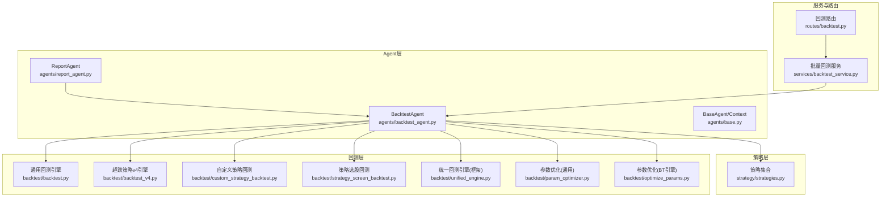
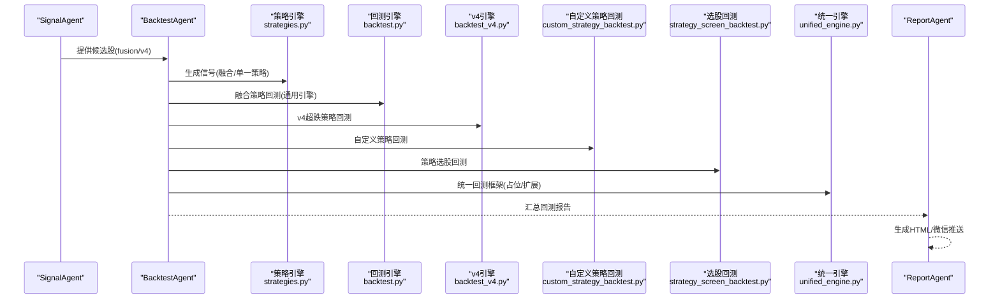
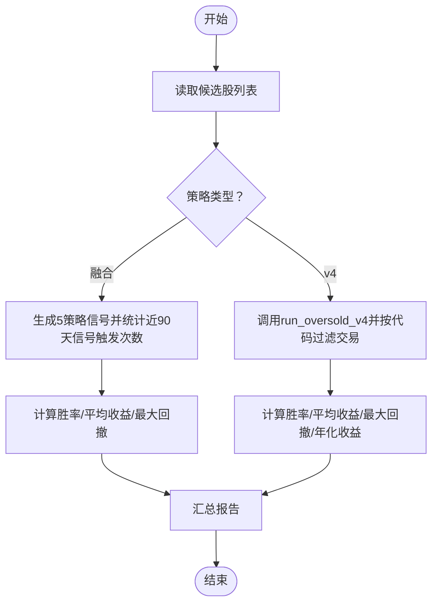
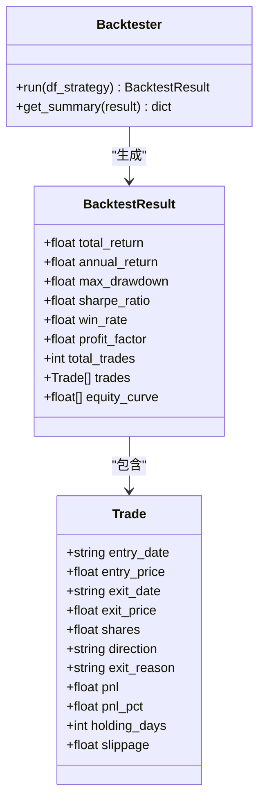
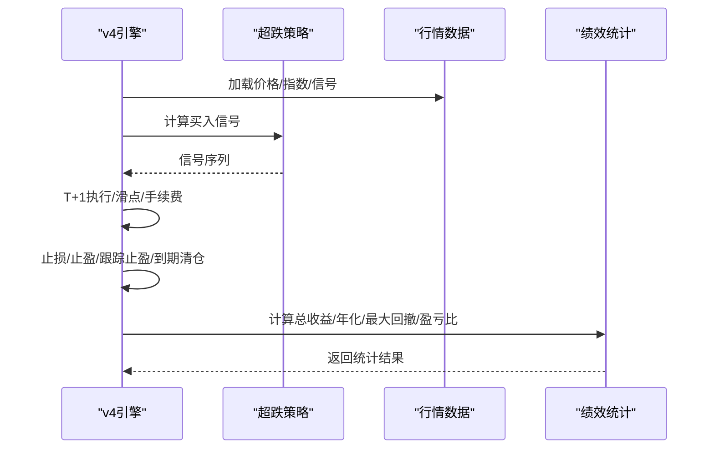
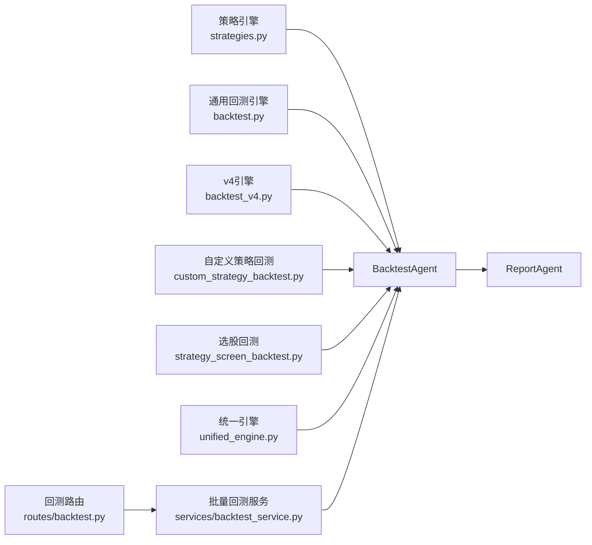

# 回测Agent

<cite>
**本文档引用的文件**
- [agents/backtest_agent.py](file://agents/backtest_agent.py)
- [backtest/backtest.py](file://backtest/backtest.py)
- [backtest/backtest_v4.py](file://backtest/backtest_v4.py)
- [backtest/custom_strategy_backtest.py](file://backtest/custom_strategy_backtest.py)
- [backtest/strategy_screen_backtest.py](file://backtest/strategy_screen_backtest.py)
- [backtest/unified_engine.py](file://backtest/unified_engine.py)
- [services/backtest_service.py](file://services/backtest_service.py)
- [routes/backtest.py](file://routes/backtest.py)
- [strategy/strategies.py](file://strategy/strategies.py)
- [agents/base.py](file://agents/base.py)
- [agents/report_agent.py](file://agents/report_agent.py)
- [backtest/param_optimizer.py](file://backtest/param_optimizer.py)
- [backtest/optimize_params.py](file://backtest/optimize_params.py)
</cite>

## 目录
1. [简介](#简介)
2. [项目结构](#项目结构)
3. [核心组件](#核心组件)
4. [架构总览](#架构总览)
5. [详细组件分析](#详细组件分析)
6. [依赖分析](#依赖分析)
7. [性能考虑](#性能考虑)
8. [故障排查指南](#故障排查指南)
9. [结论](#结论)
10. [附录](#附录)

## 简介
本文件面向AIQuant回测Agent，系统性阐述回测引擎集成、策略回测与性能评估方法，涵盖交易成本计算、滑点模拟与市场冲击处理，以及回测数据准备、参数配置与结果分析。文档还提供回测Agent的配置选项、性能优化技巧、回测示例与结果解读方法，并说明回测Agent与策略引擎、报告系统的协作关系。

## 项目结构
AIQuant采用“Agent流水线 + 多回测引擎 + 策略框架”的分层设计：
- Agent层：负责编排与协调，如BacktestAgent、ReportAgent等
- 策略层：提供多策略与信号融合能力
- 回测层：提供多种回测引擎与参数优化工具
- 服务与路由层：对外提供批量回测API
- 报告层：整合上游Agent输出，生成HTML与微信推送

图表来源
- [agents/backtest_agent.py:1-181](file://agents/backtest_agent.py#L1-L181)
- [strategy/strategies.py:1-431](file://strategy/strategies.py#L1-L431)
- [backtest/backtest.py:1-517](file://backtest/backtest.py#L1-L517)
- [backtest/backtest_v4.py:1-624](file://backtest/backtest_v4.py#L1-L624)
- [backtest/custom_strategy_backtest.py:1-669](file://backtest/custom_strategy_backtest.py#L1-L669)
- [backtest/strategy_screen_backtest.py:1-803](file://backtest/strategy_screen_backtest.py#L1-L803)
- [backtest/unified_engine.py:1-143](file://backtest/unified_engine.py#L1-L143)
- [services/backtest_service.py:1-135](file://services/backtest_service.py#L1-L135)
- [routes/backtest.py:1-45](file://routes/backtest.py#L1-L45)
- [agents/base.py:1-120](file://agents/base.py#L1-L120)
- [agents/report_agent.py:1-393](file://agents/report_agent.py#L1-L393)
- [backtest/param_optimizer.py:1-369](file://backtest/param_optimizer.py#L1-L369)
- [backtest/optimize_params.py:1-462](file://backtest/optimize_params.py#L1-L462)

章节来源
- [agents/backtest_agent.py:1-181](file://agents/backtest_agent.py#L1-L181)
- [agents/base.py:1-120](file://agents/base.py#L1-L120)

## 核心组件
- BacktestAgent：对SignalAgent产出的候选股进行快速历史回测验证，输出胜率、盈亏比、最大回撤等指标；支持融合策略与v4超跌策略两种模式
- 通用回测引擎Backtester：支持手续费、滑点、止损止盈、最大持仓天数、回撤熔断、大盘择时、动态仓位等特性，提供标准化回测结果与摘要
- 超跌策略v4引擎：针对超跌反弹场景的专用回测，内置信号生成、资金曲线、滑点与手续费、跟踪止盈、缩量破底等规则
- 自定义策略回测引擎：支持用户编写strategy_function(df, **params)形式的策略函数，进行全市场/指定股票回测
- 策略选股回测引擎：基于选股条件的策略回测，支持T+1执行、止盈止损、跟踪止损、最大持仓天数等
- 统一回测引擎：策略插件化框架，接收Strategy实例列表，逐步替代现有重复逻辑
- 参数优化：提供网格搜索、遗传算法、步行优化等多种参数优化方法
- 批量回测服务与路由：对外提供批量回测API，支持权重、仓位、止损止盈等参数透传

章节来源
- [agents/backtest_agent.py:31-181](file://agents/backtest_agent.py#L31-L181)
- [backtest/backtest.py:56-494](file://backtest/backtest.py#L56-L494)
- [backtest/backtest_v4.py:218-581](file://backtest/backtest_v4.py#L218-L581)
- [backtest/custom_strategy_backtest.py:196-668](file://backtest/custom_strategy_backtest.py#L196-L668)
- [backtest/strategy_screen_backtest.py:305-746](file://backtest/strategy_screen_backtest.py#L305-L746)
- [backtest/unified_engine.py:59-143](file://backtest/unified_engine.py#L59-L143)
- [backtest/param_optimizer.py:19-361](file://backtest/param_optimizer.py#L19-L361)
- [backtest/optimize_params.py:120-461](file://backtest/optimize_params.py#L120-L461)
- [services/backtest_service.py:10-135](file://services/backtest_service.py#L10-L135)
- [routes/backtest.py:12-45](file://routes/backtest.py#L12-L45)

## 架构总览
回测Agent在Agent流水线中承担“快速验证候选信号”的角色，串联策略引擎与报告系统，形成“信号→回测→报告”的闭环。

图表来源
- [agents/backtest_agent.py:37-68](file://agents/backtest_agent.py#L37-L68)
- [strategy/strategies.py:36-431](file://strategy/strategies.py#L36-L431)
- [backtest/backtest.py:121-409](file://backtest/backtest.py#L121-L409)
- [backtest/backtest_v4.py:218-581](file://backtest/backtest_v4.py#L218-L581)
- [backtest/custom_strategy_backtest.py:212-613](file://backtest/custom_strategy_backtest.py#L212-L613)
- [backtest/strategy_screen_backtest.py:362-674](file://backtest/strategy_screen_backtest.py#L362-L674)
- [backtest/unified_engine.py:108-143](file://backtest/unified_engine.py#L108-L143)
- [agents/report_agent.py:63-90](file://agents/report_agent.py#L63-L90)

## 详细组件分析

### BacktestAgent：快速回测验证器
- 输入：融合策略候选股与v4候选股
- 处理：
  - 融合策略：90天内信号触发次数与后续5/10日收益统计
  - v4策略：调用run_oversold_v4，按代码过滤交易记录，计算胜率、平均收益、最大回撤、年化收益
- 输出：每只股票的回测报告，汇总平均胜率与平均收益

图表来源
- [agents/backtest_agent.py:37-181](file://agents/backtest_agent.py#L37-L181)

章节来源
- [agents/backtest_agent.py:31-181](file://agents/backtest_agent.py#L31-L181)

### 通用回测引擎Backtester：交易成本、滑点与风控
- 交易成本：手续费（默认万三双向）、印花税（卖出单向，千一）
- 滑点：买入加滑点、卖出减滑点（默认千分之一）
- 止损止盈：支持固定止损/止盈与最大持仓天数
- 风控机制：
  - 回撤熔断：超过阈值暂停开仓
  - 大盘择时：基于均线过滤
  - 动态仓位：基于ATR波动率调整仓位比例
- 绩效指标：总收益、年化收益、最大回撤、夏普比率、胜率、盈亏比、平均持仓天数、基准收益与Alpha

图表来源
- [backtest/backtest.py:16-54](file://backtest/backtest.py#L16-L54)
- [backtest/backtest.py:56-494](file://backtest/backtest.py#L56-L494)

章节来源
- [backtest/backtest.py:56-494](file://backtest/backtest.py#L56-L494)

### 超跌策略v4引擎：信号、资金曲线与止盈规则
- 信号生成：基于strategy_oversold_rebound，包含20日跌幅、站上MA5、温和放量、RSI区间、不创新低等条件
- 资金管理：固定初始资金、最大持仓数、单股上限、止盈/止损、跟踪止盈（半仓后跟踪）
- 交易执行：T+1模式，滑点与手续费计入，支持缩量破底清仓
- 绩效统计：总交易数、胜率、总收益、年化收益、最大回撤、盈亏比、均盈/均亏、平均持仓天数

图表来源
- [backtest/backtest_v4.py:218-581](file://backtest/backtest_v4.py#L218-L581)
- [strategy/strategies.py:281-360](file://strategy/strategies.py#L281-L360)

章节来源
- [backtest/backtest_v4.py:218-581](file://backtest/backtest_v4.py#L218-L581)
- [strategy/strategies.py:281-360](file://strategy/strategies.py#L281-L360)

### 自定义策略回测引擎：策略函数式回测
- 策略函数约定：strategy_function(df, **params) → 返回含signal列的DataFrame（1=买入，-1=卖出，0=持有）
- 支持T+1撮合：按次日开盘价执行，支持收盘价买入/卖出（存在未来数据泄露风险）
- 选股排序：按sort_by字段排序，支持量能类字段的截面排名
- 交易成本：可配置手续费率、印花税、最低佣金
- 输出：资金曲线、交易明细、每日信号、汇总统计

章节来源
- [backtest/custom_strategy_backtest.py:196-668](file://backtest/custom_strategy_backtest.py#L196-L668)

### 策略选股回测引擎：条件驱动的策略回测
- 数据加载：一次性加载回测区间内所有股票日线数据并计算技术指标
- 选股条件：支持多条件AND组合，包括均线、涨跌幅、振幅、换手率、成交量等
- 回测执行：T+1模式，支持跟踪止损、最大持仓天数、到期退出
- 输出：资金曲线、交易明细、每日候选、最终持仓

章节来源
- [backtest/strategy_screen_backtest.py:305-746](file://backtest/strategy_screen_backtest.py#L305-L746)

### 统一回测引擎：策略插件化框架
- 目标：接收Strategy实例列表，统一处理T+1、手续费、滑点、止损止盈、回撤熔断、大盘择时、动态仓位
- 当前状态：框架占位，逐步迁移现有回测逻辑

章节来源
- [backtest/unified_engine.py:59-143](file://backtest/unified_engine.py#L59-L143)

### 参数优化：网格搜索、遗传算法与步行优化
- 网格搜索：遍历参数组合，最大化目标指标（如夏普比率、SQN）
- 遗传算法：适用于参数空间较大场景，支持锦标赛选择、交叉与变异
- 步行优化：滚动验证，模拟真实交易过程，避免过拟合

章节来源
- [backtest/param_optimizer.py:19-361](file://backtest/param_optimizer.py#L19-L361)
- [backtest/optimize_params.py:120-461](file://backtest/optimize_params.py#L120-L461)

### 批量回测服务与路由
- 批量回测服务：封装v4超跌策略批量回测，支持权重、仓位、止损止盈、择时等参数
- 路由接口：提供GET /batch，解析weights、min_score、capital、max_positions等参数

章节来源
- [services/backtest_service.py:10-135](file://services/backtest_service.py#L10-L135)
- [routes/backtest.py:12-45](file://routes/backtest.py#L12-L45)

## 依赖分析
- BacktestAgent依赖策略引擎与多个回测引擎，输出回测报告供ReportAgent消费
- ReportAgent整合BacktestAgent、SignalAgent、RiskAgent输出，生成HTML与微信推送
- 批量回测服务与路由为外部提供统一入口，内部调用BacktestAgent或底层回测引擎

图表来源
- [agents/backtest_agent.py:19-28](file://agents/backtest_agent.py#L19-L28)
- [agents/report_agent.py:67-70](file://agents/report_agent.py#L67-L70)
- [services/backtest_service.py:20-38](file://services/backtest_service.py#L20-L38)
- [routes/backtest.py:25-38](file://routes/backtest.py#L25-L38)

章节来源
- [agents/backtest_agent.py:19-28](file://agents/backtest_agent.py#L19-L28)
- [agents/report_agent.py:67-70](file://agents/report_agent.py#L67-L70)
- [services/backtest_service.py:20-38](file://services/backtest_service.py#L20-L38)
- [routes/backtest.py:25-38](file://routes/backtest.py#L25-L38)

## 性能考虑
- 数据加载与指标计算：策略选股回测引擎对全市场数据进行groupby计算技术指标，避免O(n²)扫描
- T+1执行与延迟队列：通过延迟队列减少未来数据泄露风险，提高回测真实性
- 动态仓位与滑点：基于ATR的动态仓位与滑点模拟提升资金利用率与交易成本准确性
- 参数优化：网格搜索与遗传算法结合，步行优化避免过拟合，提升参数鲁棒性
- 批量回测：服务层统一入口，便于并发与缓存

章节来源
- [backtest/strategy_screen_backtest.py:372-382](file://backtest/strategy_screen_backtest.py#L372-L382)
- [backtest/backtest.py:185-383](file://backtest/backtest.py#L185-L383)
- [backtest/backtest.py:252-264](file://backtest/backtest.py#L252-L264)
- [backtest/param_optimizer.py:80-107](file://backtest/param_optimizer.py#L80-L107)
- [backtest/optimize_params.py:120-176](file://backtest/optimize_params.py#L120-L176)

## 故障排查指南
- 无候选信号：BacktestAgent对无信号或无数据的股票返回“无信号”状态，检查策略信号生成与数据加载
- 回测区间无数据：策略选股回测引擎与自定义策略回测引擎在无有效交易日时返回错误提示
- 参数优化失败：检查参数范围与约束条件，确保至少5笔交易且最大回撤小于阈值
- 滑点与手续费异常：核对手续费率、印花税与最低佣金设置，确认滑点率合理
- 报告生成异常：检查上游Agent结果是否存在，确保BacktestAgent输出在ReportAgent上下文中可被读取

章节来源
- [agents/backtest_agent.py:171-181](file://agents/backtest_agent.py#L171-L181)
- [backtest/strategy_screen_backtest.py:369-370](file://backtest/strategy_screen_backtest.py#L369-L370)
- [backtest/custom_strategy_backtest.py:327-328](file://backtest/custom_strategy_backtest.py#L327-L328)
- [backtest/optimize_params.py:80-85](file://backtest/optimize_params.py#L80-L85)

## 结论
回测Agent通过融合策略与v4超跌策略的快速回测，为候选信号提供历史表现验证，配合通用回测引擎、参数优化与报告系统，形成完整的回测与决策支持闭环。建议在实际部署中结合交易成本、滑点与风控机制进行参数校准，并利用参数优化与步行优化提升策略稳健性。

## 附录

### 回测示例与结果解读
- 融合策略回测示例：对候选股生成5策略信号，统计近90天信号触发次数与后续5/10日收益，输出胜率与平均收益
- v4超跌策略回测示例：调用run_oversold_v4，按代码过滤交易记录，输出胜率、平均收益、最大回撤、年化收益
- 结果解读要点：
  - 胜率与盈亏比：衡量策略盈利能力与稳定性
  - 最大回撤：评估下行风险
  - 年化收益与夏普比率：评估收益风险比
  - 平均持仓天数：反映策略交易频率与持有周期

章节来源
- [agents/backtest_agent.py:70-181](file://agents/backtest_agent.py#L70-L181)
- [backtest/backtest_v4.py:540-581](file://backtest/backtest_v4.py#L540-L581)

### 回测Agent配置选项与最佳实践
- 融合策略回测
  - 信号统计窗口：近90天
  - 收益观察期：5/10日
- v4超跌策略回测
  - 初始资金：10万元
  - 最大持仓数：4只
  - 单股上限：40%
  - 止损：-6%
  - 跟踪止盈：10%
  - 最小/最大持仓天数：3/8天
  - 大盘择时：启用
- 通用回测引擎
  - 手续费：万三双向
  - 印花税：千一（卖出）
  - 滑点：千分之一
  - 回撤熔断：启用（10%）
  - 大盘择时：启用（MA20）
  - 动态仓位：启用（ATR波动率）
- 自定义策略回测
  - 买入模式：T+1开盘价（可配置）
  - 买入排序：按sort_by字段排序（支持量能类字段截面排名）
  - 交易成本：可配置手续费率、印花税、最低佣金
- 策略选股回测
  - 选股条件：多条件AND组合（均线、涨跌幅、振幅、换手率、成交量等）
  - 止盈止损：支持固定止损/止盈、跟踪止损、最大持仓天数
- 参数优化
  - 网格搜索：遍历参数组合，最大化目标指标
  - 遗传算法：适用于大空间参数优化
  - 步行优化：滚动验证，避免过拟合

章节来源
- [agents/backtest_agent.py:79-113](file://agents/backtest_agent.py#L79-L113)
- [backtest/backtest.py:66-111](file://backtest/backtest.py#L66-L111)
- [backtest/custom_strategy_backtest.py:36-91](file://backtest/custom_strategy_backtest.py#L36-L91)
- [backtest/strategy_screen_backtest.py:245-299](file://backtest/strategy_screen_backtest.py#L245-L299)
- [backtest/param_optimizer.py:19-107](file://backtest/param_optimizer.py#L19-L107)
- [backtest/optimize_params.py:120-176](file://backtest/optimize_params.py#L120-L176)