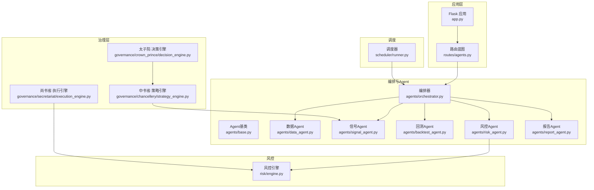
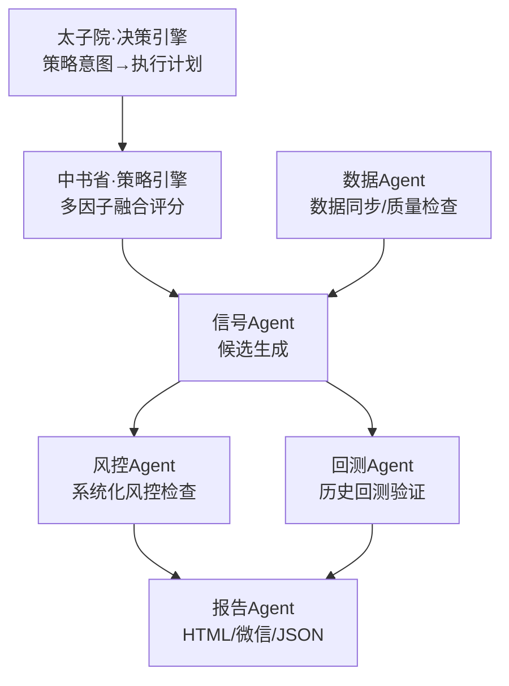
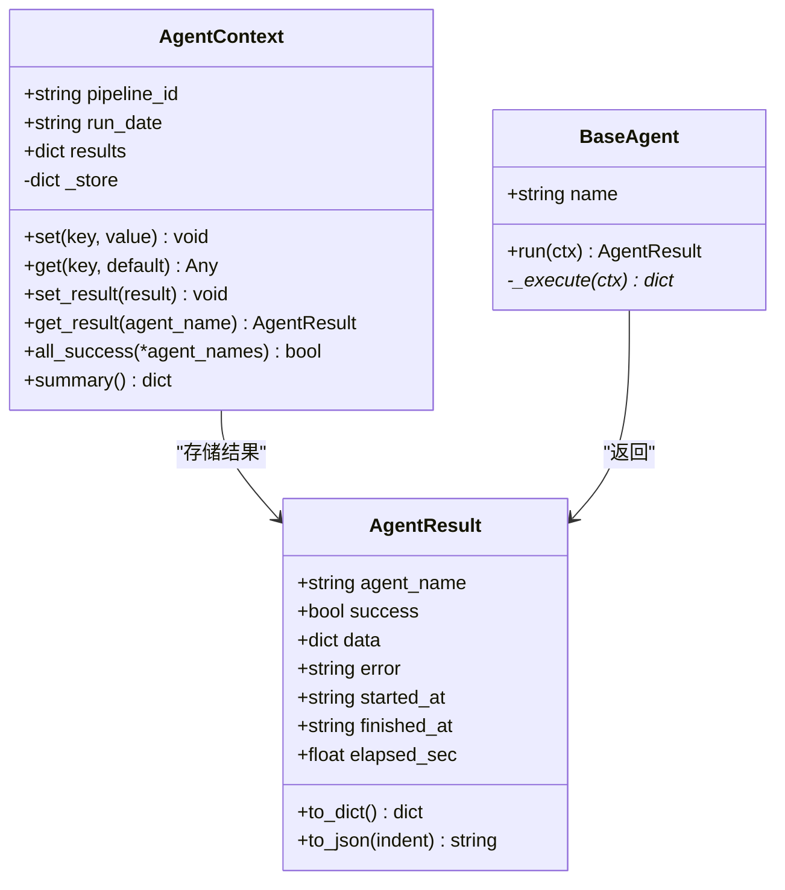
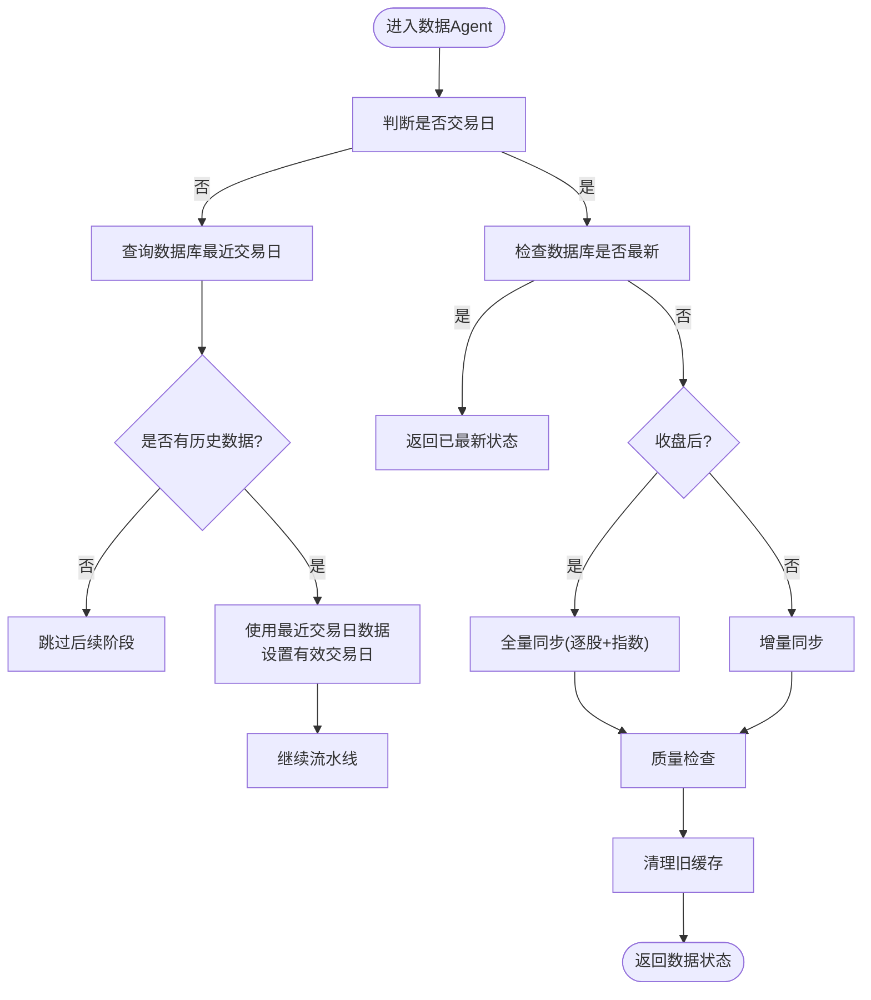
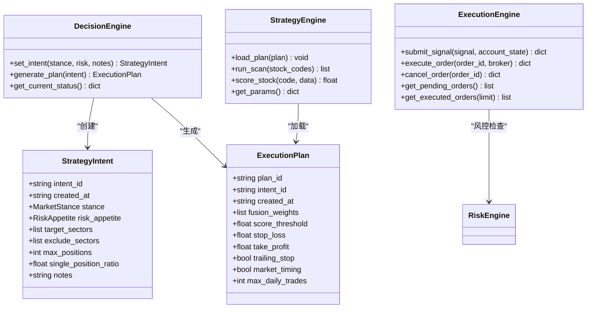
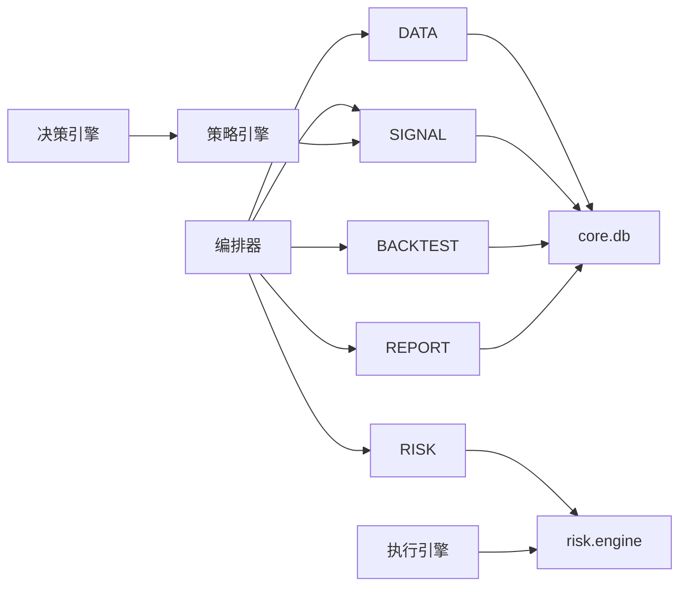

# 多Agent编排系统

<cite>
**本文引用的文件**
- [README.md](file://README.md)
- [app.py](file://app.py)
- [agents/orchestrator.py](file://agents/orchestrator.py)
- [agents/base.py](file://agents/base.py)
- [agents/data_agent.py](file://agents/data_agent.py)
- [agents/signal_agent.py](file://agents/signal_agent.py)
- [agents/backtest_agent.py](file://agents/backtest_agent.py)
- [agents/risk_agent.py](file://agents/risk_agent.py)
- [agents/report_agent.py](file://agents/report_agent.py)
- [governance/__init__.py](file://governance/__init__.py)
- [governance/crown_prince/decision_engine.py](file://governance/crown_prince/decision_engine.py)
- [governance/chancellery/strategy_engine.py](file://governance/chancellery/strategy_engine.py)
- [governance/secretariat/execution_engine.py](file://governance/secretariat/execution_engine.py)
- [risk/engine.py](file://risk/engine.py)
- [routes/agents.py](file://routes/agents.py)
- [scheduler/runner.py](file://scheduler/runner.py)
</cite>

## 目录
1. [简介](#简介)
2. [项目结构](#项目结构)
3. [核心组件](#核心组件)
4. [架构总览](#架构总览)
5. [详细组件分析](#详细组件分析)
6. [依赖分析](#依赖分析)
7. [性能考虑](#性能考虑)
8. [故障排查指南](#故障排查指南)
9. [结论](#结论)
10. [附录](#附录)

## 简介
本项目为“AIQuant多Agent编排系统”，围绕“三省六部制”组织治理与执行，形成从“决策—策略—风控—执行—报告”的完整流水线。系统通过Agent流水线在后台定时或手动触发，完成数据同步、信号生成、回测验证、风控评估与报告生成，并提供REST API与仪表板进行状态监控与人工干预。

- 项目目标：自动化生成每日交易计划，降低主观决策成本，提升策略一致性与可追溯性。
- 关键特性：三省六部制职责分离、Agent上下文共享、并行执行、风控拦截、状态持久化与历史记录、定时调度与API控制台。

**章节来源**
- [README.md:1-3](file://README.md#L1-L3)

## 项目结构
系统采用模块化分层组织：
- 应用入口与路由：Flask应用与蓝图路由，提供API与静态页面。
- 编排与Agent：agents目录包含流水线编排器与各职能Agent。
- 治理层：governance目录实现“三省六部”概念化引擎（策略意图、策略生成、执行调度）。
- 风控：risk目录提供系统化风控检查与状态记录。
- 调度：scheduler目录负责定时任务与流水线状态更新。
- 路由：routes目录提供Agent流水线相关API。



**图表来源**
- [app.py:39-72](file://app.py#L39-L72)
- [routes/agents.py:13-19](file://routes/agents.py#L13-L19)
- [agents/orchestrator.py:36-52](file://agents/orchestrator.py#L36-L52)
- [governance/crown_prince/decision_engine.py:61-122](file://governance/crown_prince/decision_engine.py#L61-L122)
- [governance/chancellery/strategy_engine.py:32-90](file://governance/chancellery/strategy_engine.py#L32-L90)
- [governance/secretariat/execution_engine.py:57-170](file://governance/secretariat/execution_engine.py#L57-L170)
- [risk/engine.py:13-71](file://risk/engine.py#L13-L71)
- [scheduler/runner.py:108-137](file://scheduler/runner.py#L108-L137)

**章节来源**
- [app.py:39-72](file://app.py#L39-L72)
- [routes/agents.py:13-19](file://routes/agents.py#L13-L19)
- [agents/orchestrator.py:36-52](file://agents/orchestrator.py#L36-L52)

## 核心组件
- 编排器（PipelineOrchestrator）：负责流水线执行顺序、并行执行、状态持久化、历史记录与错误处理。
- Agent基类与上下文（BaseAgent、AgentContext）：统一Agent接口、结果封装、上下文共享与摘要生成。
- 五大Agent：数据、信号、回测、风控、报告，分别对应“太子院·数据官”、“中书省·策略官”、“尚书省·回测官”、“门下省·风控官”、“尚书省·报表官”。
- 治理层引擎：决策引擎（策略意图与执行计划）、策略引擎（多因子融合评分）、执行引擎（订单生成与风控检查）。
- 风控引擎：系统化规则检查、状态记录与事件入库。
- 调度器：定时触发流水线与单Agent任务，维护流水线状态。

**章节来源**
- [agents/orchestrator.py:36-175](file://agents/orchestrator.py#L36-L175)
- [agents/base.py:20-119](file://agents/base.py#L20-L119)
- [agents/data_agent.py:25-86](file://agents/data_agent.py#L25-L86)
- [agents/signal_agent.py:41-108](file://agents/signal_agent.py#L41-L108)
- [agents/backtest_agent.py:31-68](file://agents/backtest_agent.py#L31-L68)
- [agents/risk_agent.py:25-96](file://agents/risk_agent.py#L25-L96)
- [agents/report_agent.py:20-90](file://agents/report_agent.py#L20-L90)
- [governance/crown_prince/decision_engine.py:61-122](file://governance/crown_prince/decision_engine.py#L61-L122)
- [governance/chancellery/strategy_engine.py:32-90](file://governance/chancellery/strategy_engine.py#L32-L90)
- [governance/secretariat/execution_engine.py:57-170](file://governance/secretariat/execution_engine.py#L57-L170)
- [risk/engine.py:13-71](file://risk/engine.py#L13-L71)
- [scheduler/runner.py:108-137](file://scheduler/runner.py#L108-L137)

## 架构总览
系统采用“三省六部制”组织治理与执行：
- 太子院（决策层）：接收策略意图，生成执行计划，驱动策略层。
- 中书省（策略层）：执行多策略融合扫描，生成候选信号。
- 门下省（风控层）：执行系统化风控检查，支持“一票否决”拦截。
- 尚书省（执行层）：并行执行回测与风控，最终生成报告。



**图表来源**
- [governance/crown_prince/decision_engine.py:61-122](file://governance/crown_prince/decision_engine.py#L61-L122)
- [governance/chancellery/strategy_engine.py:32-90](file://governance/chancellery/strategy_engine.py#L32-L90)
- [agents/data_agent.py:25-86](file://agents/data_agent.py#L25-L86)
- [agents/signal_agent.py:41-108](file://agents/signal_agent.py#L41-L108)
- [agents/backtest_agent.py:31-68](file://agents/backtest_agent.py#L31-L68)
- [agents/risk_agent.py:25-96](file://agents/risk_agent.py#L25-L96)
- [agents/report_agent.py:20-90](file://agents/report_agent.py#L20-L90)

## 详细组件分析

### 编排器与流水线执行
- 职责：管理三省六部执行顺序与依赖、支持串行与并行、错误处理与重试、状态持久化、定时触发集成。
- 执行图：数据→信号→[回测, 风控]→报告；风控拦截点为“一票否决”。

```mermaid
sequenceDiagram
participant API as "API控制器"
participant ORCH as "编排器"
participant DATA as "数据Agent"
participant SIG as "信号Agent"
participant PAR as "并行(回测, 风控)"
participant BT as "回测Agent"
participant RK as "风控Agent"
participant RP as "报告Agent"
API->>ORCH : 触发流水线
ORCH->>DATA : run(ctx)
DATA-->>ORCH : 结果(数据状态)
ORCH->>SIG : run(ctx)
SIG-->>ORCH : 结果(候选列表)
ORCH->>PAR : 并行启动
PAR->>BT : run(ctx)
PAR->>RK : run(ctx)
BT-->>ORCH : 结果(回测报告)
RK-->>ORCH : 结果(风控状态)
ORCH->>RP : run(ctx)
RP-->>API : 返回报告路径/内容
```

**图表来源**
- [agents/orchestrator.py:81-175](file://agents/orchestrator.py#L81-L175)
- [agents/data_agent.py:31-86](file://agents/data_agent.py#L31-L86)
- [agents/signal_agent.py:47-108](file://agents/signal_agent.py#L47-L108)
- [agents/backtest_agent.py:37-68](file://agents/backtest_agent.py#L37-L68)
- [agents/risk_agent.py:31-96](file://agents/risk_agent.py#L31-L96)
- [agents/report_agent.py:63-90](file://agents/report_agent.py#L63-L90)

**章节来源**
- [agents/orchestrator.py:81-175](file://agents/orchestrator.py#L81-L175)

### Agent基类与上下文
- AgentResult：统一封装成功/失败、数据、错误、耗时与时间戳。
- AgentContext：提供共享存储（set/get）、结果存储（set_result/get_result）、汇总生成（summary）与成功判定（all_success）。
- BaseAgent：run自动计时、异常捕获与结果落盘，子类只需实现_execute。



**图表来源**
- [agents/base.py:20-119](file://agents/base.py#L20-L119)

**章节来源**
- [agents/base.py:20-119](file://agents/base.py#L20-L119)

### 数据Agent（太子院·数据官）
- 职责：交易日判断、全量/增量数据同步、质量检查、缓存清理。
- 非交易日处理：若数据库存在最近交易日数据则继续执行，否则跳过后续阶段。



**图表来源**
- [agents/data_agent.py:31-86](file://agents/data_agent.py#L31-L86)

**章节来源**
- [agents/data_agent.py:31-86](file://agents/data_agent.py#L31-L86)

### 信号Agent（中书省·策略官）
- 职责：5策略融合扫描与v4超跌反弹扫描，生成候选列表并保存至数据库。
- 上下文写入：融合与v4候选TopN、命中数量等，供下游Agent使用。

**章节来源**
- [agents/signal_agent.py:47-108](file://agents/signal_agent.py#L47-L108)

### 回测Agent（尚书省·回测官）
- 职责：对候选股做快速历史回测，计算胜率、平均收益、最大回撤等指标。
- 输出：回测报告列表与平均指标，供报告Agent整合。

**章节来源**
- [agents/backtest_agent.py:37-68](file://agents/backtest_agent.py#L37-L68)

### 风控Agent（门下省·风控官）
- 职责：大盘趋势与波动率评估、个股风险筛查、仓位建议、系统化风控检查。
- 拦截机制：当风控状态为BLOCK时，编排器跳过报告生成。

**章节来源**
- [agents/risk_agent.py:31-96](file://agents/risk_agent.py#L31-L96)

### 报告Agent（尚书省·报表官）
- 职责：整合上游结果，生成HTML与JSON报告、微信推送文本，保存至reports目录。
- 非交易日处理：使用有效交易日数据并标注。

**章节来源**
- [agents/report_agent.py:63-90](file://agents/report_agent.py#L63-L90)

### 治理层引擎
- 太子院·决策引擎：策略意图（市场立场、风险偏好）→执行计划（权重、阈值、止盈止损等）。
- 中书省·策略引擎：加载计划，多因子融合评分，输出信号参数。
- 尚书省·执行引擎：接收信号，风控检查，生成订单，模拟/实盘执行。



**图表来源**
- [governance/crown_prince/decision_engine.py:61-122](file://governance/crown_prince/decision_engine.py#L61-L122)
- [governance/chancellery/strategy_engine.py:32-90](file://governance/chancellery/strategy_engine.py#L32-L90)
- [governance/secretariat/execution_engine.py:57-170](file://governance/secretariat/execution_engine.py#L57-L170)
- [risk/engine.py:13-71](file://risk/engine.py#L13-L71)

**章节来源**
- [governance/crown_prince/decision_engine.py:61-122](file://governance/crown_prince/decision_engine.py#L61-L122)
- [governance/chancellery/strategy_engine.py:32-90](file://governance/chancellery/strategy_engine.py#L32-L90)
- [governance/secretariat/execution_engine.py:57-170](file://governance/secretariat/execution_engine.py#L57-L170)

### 风控引擎
- 职责：遍历规则执行，取最严格等级作为整体风险等级；记录事件与状态到数据库。

**章节来源**
- [risk/engine.py:13-71](file://risk/engine.py#L13-L71)

### API与调度
- API路由：/api/agents/status、/api/agents/run、/api/agents/run/<name>、/api/agents/history、/api/agents/report、/api/agents/governance。
- 调度器：支持流水线模式（07:30数据Agent，09:00完整流水线）与传统模式（07:00同步，09:00扫描）。

**章节来源**
- [routes/agents.py:22-127](file://routes/agents.py#L22-L127)
- [scheduler/runner.py:158-212](file://scheduler/runner.py#L158-L212)

## 依赖分析
- 组件耦合与内聚：编排器集中管理Agent生命周期与依赖；Agent通过上下文共享数据，降低耦合。
- 外部依赖：数据库连接、第三方数据源（通过core.sync与core.db）、风控规则集合。
- 潜在循环依赖：当前结构清晰，编排器→Agent→核心模块，未见循环导入迹象。



**图表来源**
- [agents/orchestrator.py:36-52](file://agents/orchestrator.py#L36-L52)
- [agents/data_agent.py:18-22](file://agents/data_agent.py#L18-L22)
- [agents/signal_agent.py:17-28](file://agents/signal_agent.py#L17-L28)
- [agents/backtest_agent.py:17-28](file://agents/backtest_agent.py#L17-L28)
- [agents/risk_agent.py:21-22](file://agents/risk_agent.py#L21-L22)
- [agents/report_agent.py:17](file://agents/report_agent.py#L17)
- [governance/crown_prince/decision_engine.py:11-14](file://governance/crown_prince/decision_engine.py#L11-L14)
- [governance/chancellery/strategy_engine.py:14](file://governance/chancellery/strategy_engine.py#L14)
- [governance/secretariat/execution_engine.py:18-19](file://governance/secretariat/execution_engine.py#L18-L19)
- [risk/engine.py:8-10](file://risk/engine.py#L8-L10)

**章节来源**
- [agents/orchestrator.py:36-52](file://agents/orchestrator.py#L36-L52)
- [agents/data_agent.py:18-22](file://agents/data_agent.py#L18-L22)
- [agents/signal_agent.py:17-28](file://agents/signal_agent.py#L17-L28)
- [agents/backtest_agent.py:17-28](file://agents/backtest_agent.py#L17-L28)
- [agents/risk_agent.py:21-22](file://agents/risk_agent.py#L21-L22)
- [agents/report_agent.py:17](file://agents/report_agent.py#L17)
- [governance/crown_prince/decision_engine.py:11-14](file://governance/crown_prince/decision_engine.py#L11-L14)
- [governance/chancellery/strategy_engine.py:14](file://governance/chancellery/strategy_engine.py#L14)
- [governance/secretariat/execution_engine.py:18-19](file://governance/secretariat/execution_engine.py#L18-L19)
- [risk/engine.py:8-10](file://risk/engine.py#L8-L10)

## 性能考虑
- 并行执行：回测与风控并行，缩短整体耗时。
- 数据质量前置：数据Agent在信号生成前完成质量检查与缓存清理，减少下游失败重试。
- 交易日智能跳过：非交易日直接使用最近交易日数据，避免无效工作。
- 调度模式切换：流水线模式在07:30预同步，09:00完整流水线，平衡资源占用。
- 日志与状态：编排器记录每个Agent耗时与错误，便于定位瓶颈。

[本节为通用指导，无需特定文件引用]

## 故障排查指南
- API错误处理：全局404/500返回JSON，便于前端与监控系统识别。
- 编排器异常：捕获并记录堆栈，保证流水线状态可恢复。
- Agent异常：BaseAgent自动捕获异常并写入结果，便于API查询历史。
- 风控拦截：风控Agent将BLOCK状态写入上下文，编排器跳过报告生成并记录拦截事件。
- 调度状态：通过API查询流水线状态与历史，结合日志定位问题。

**章节来源**
- [app.py:136-144](file://app.py#L136-L144)
- [agents/orchestrator.py:155-157](file://agents/orchestrator.py#L155-L157)
- [agents/base.py:107-113](file://agents/base.py#L107-L113)
- [agents/risk_agent.py:63-66](file://agents/risk_agent.py#L63-L66)
- [routes/agents.py:22-31](file://routes/agents.py#L22-L31)

## 结论
本系统以“三省六部制”理念实现策略意图、信号生成、风控与执行的解耦与协同，通过Agent流水线与API控制台实现自动化与可观测性。编排器承担协调与容错职责，治理层引擎提供策略参数化能力，风控引擎保障系统安全边界。配合定时调度与报告输出，形成可复用、可扩展的多Agent编排框架。

[本节为总结，无需特定文件引用]

## 附录

### 三省六部职责与协作
- 太子院（决策层）：制定策略意图与执行计划，驱动策略层。
- 中书省（策略层）：多策略融合扫描，生成候选信号。
- 门下省（风控层）：系统化风控检查，支持“一票否决”。
- 尚书省（执行层）：并行回测与风控，生成报告。

**章节来源**
- [governance/__init__.py:4-9](file://governance/__init__.py#L4-L9)

### 六部职能概览
- 吏部：账户与权限
- 户部：资金与收益
- 礼部：数据源与清洗
- 兵部：交易执行与订单
- 刑部：风控与合规
- 工部：基础设施与监控

**章节来源**
- [ministries/__init__.py:4-11](file://ministries/__init__.py#L4-L11)

### Agent扩展指南与自定义Agent开发
- 继承BaseAgent，实现name与_execute(ctx)。
- 在编排器注册表中添加Agent映射，以便按名调度。
- 使用AgentContext.set/get在Agent间传递数据。
- 通过AgentResult.data返回结构化结果，便于上层消费。
- 如需系统化风控，参考RiskEngine.check_and_record写入风控状态与事件。

**章节来源**
- [agents/base.py:88-119](file://agents/base.py#L88-L119)
- [agents/orchestrator.py:46-52](file://agents/orchestrator.py#L46-L52)
- [agents/report_agent.py:63-90](file://agents/report_agent.py#L63-L90)
- [risk/engine.py:51-71](file://risk/engine.py#L51-L71)

### 实际应用场景示例
- 每日交易计划：数据Agent→信号Agent→[回测Agent, 风控Agent]→报告Agent，输出HTML/JSON与微信推送。
- 非交易日处理：若数据库存在最近交易日数据，使用该数据继续流水线。
- 风控拦截：当风控状态为BLOCK，跳过报告生成并记录拦截原因。

**章节来源**
- [agents/orchestrator.py:112-150](file://agents/orchestrator.py#L112-L150)
- [agents/data_agent.py:120-130](file://agents/data_agent.py#L120-L130)
- [agents/risk_agent.py:63-66](file://agents/risk_agent.py#L63-L66)