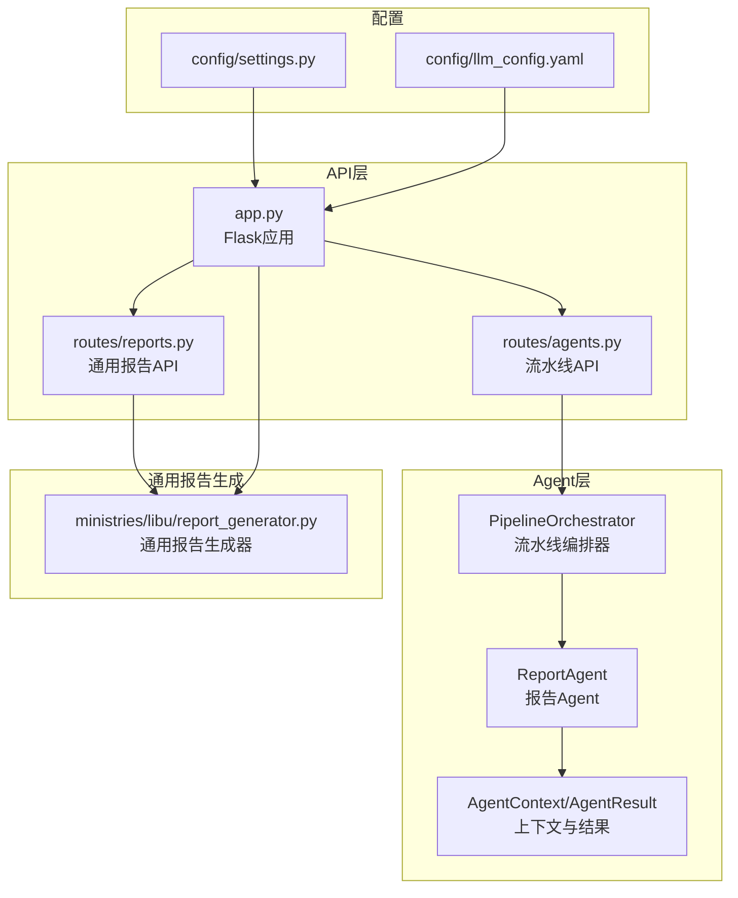
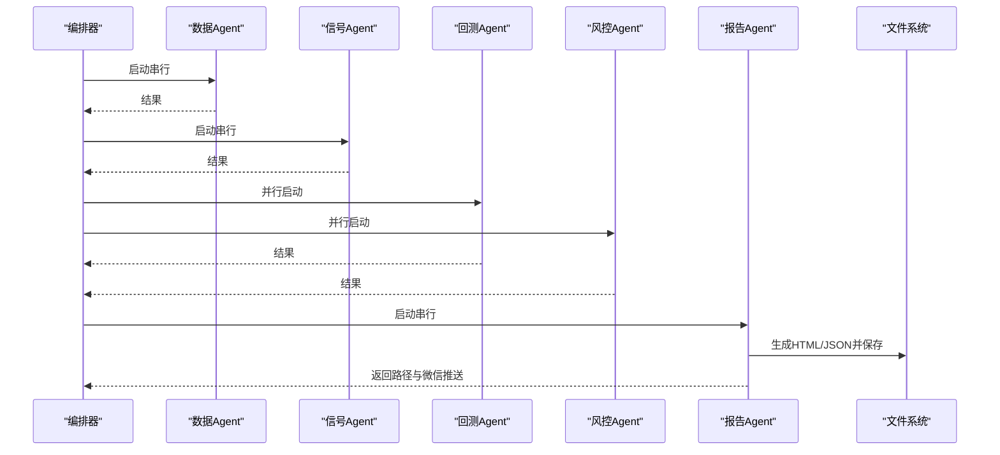
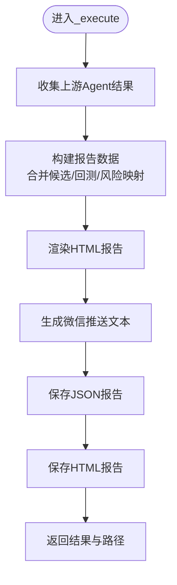
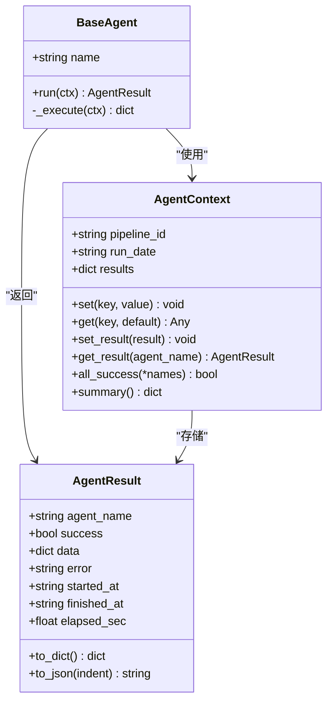
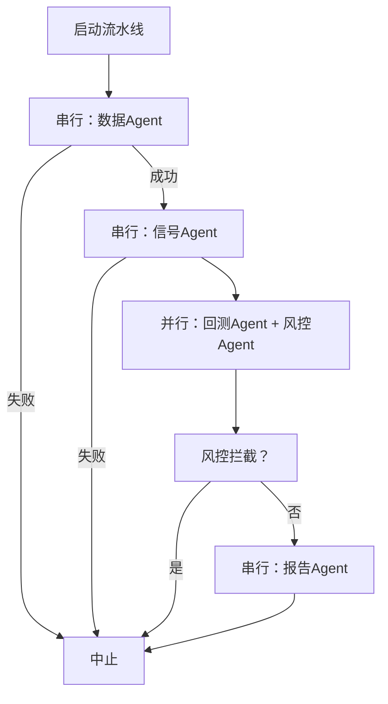
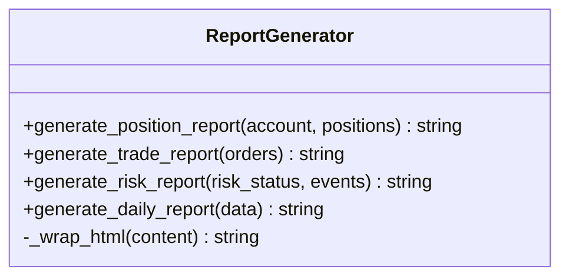
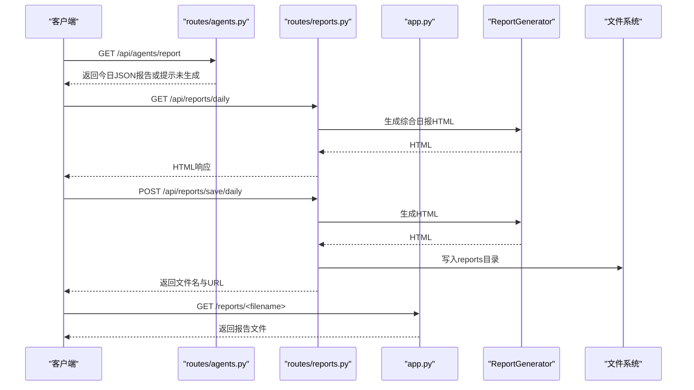
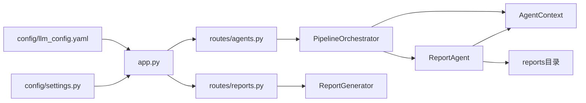

# 报告Agent

<cite>
**本文引用的文件**
- [agents/report_agent.py](file://agents/report_agent.py)
- [agents/base.py](file://agents/base.py)
- [agents/orchestrator.py](file://agents/orchestrator.py)
- [routes/reports.py](file://routes/reports.py)
- [routes/agents.py](file://routes/agents.py)
- [ministries/libu/report_generator.py](file://ministries/libu/report_generator.py)
- [app.py](file://app.py)
- [config/settings.py](file://config/settings.py)
- [config/llm_config.yaml](file://config/llm_config.yaml)
</cite>

## 目录
1. [简介](#简介)
2. [项目结构](#项目结构)
3. [核心组件](#核心组件)
4. [架构总览](#架构总览)
5. [详细组件分析](#详细组件分析)
6. [依赖关系分析](#依赖关系分析)
7. [性能考量](#性能考量)
8. [故障排查指南](#故障排查指南)
9. [结论](#结论)
10. [附录](#附录)

## 简介
本文件面向AIQuant系统中的“报告Agent”，系统性阐述其职责、数据整合与报告生成机制、模板设计与格式化方法、自动化流程、分发与存储策略，并提供配置选项与个性化设置指南、生成示例与质量检查方法，以及与数据Agent与其他业务系统的集成关系。报告Agent作为“尚书省·报表官”，负责整合上游Agent输出，生成每日交易计划HTML报告、微信推送文本，并将报告持久化至本地reports目录，同时通过API对外提供报告查询与下载能力。

## 项目结构
围绕报告Agent的关键文件与模块如下：
- agents/report_agent.py：报告Agent主体，负责数据聚合、HTML/JSON生成、微信推送文本生成与落盘。
- agents/base.py：Agent基类与上下文定义，提供统一的执行接口、结果封装与上下文共享。
- agents/orchestrator.py：三省六部制流水线编排器，定义Agent执行顺序与依赖关系，串联数据、信号、回测、风控与报告Agent。
- routes/reports.py：通用报告API（持仓、交易、风控、综合日报），与ministries/libu/report_generator配合生成不同类型的HTML报告。
- routes/agents.py：与报告Agent直接相关的API（流水线状态、手动触发、历史、最新报告查询）。
- ministries/libu/report_generator.py：通用报告生成器（礼部报表官），用于生成HTML格式的持仓、交易、风控、综合日报。
- app.py：Flask应用入口，注册所有蓝图，提供静态资源服务与报告文件访问。
- config/settings.py：基础系统配置（主机、端口、定时任务、日志级别等）。
- config/llm_config.yaml：LLM配置（模型、API Key、Base URL、功能开关等），与报告Agent的意图解析、市场分析等功能存在间接关联。

图表来源
- [agents/report_agent.py:1-393](file://agents/report_agent.py#L1-L393)
- [agents/orchestrator.py:1-263](file://agents/orchestrator.py#L1-L263)
- [routes/reports.py:1-188](file://routes/reports.py#L1-L188)
- [routes/agents.py:1-128](file://routes/agents.py#L1-L128)
- [ministries/libu/report_generator.py:1-304](file://ministries/libu/report_generator.py#L1-L304)
- [app.py:1-164](file://app.py#L1-L164)
- [config/settings.py:1-25](file://config/settings.py#L1-L25)
- [config/llm_config.yaml:1-23](file://config/llm_config.yaml#L1-L23)

章节来源
- [agents/report_agent.py:1-393](file://agents/report_agent.py#L1-L393)
- [agents/orchestrator.py:1-263](file://agents/orchestrator.py#L1-L263)
- [routes/reports.py:1-188](file://routes/reports.py#L1-L188)
- [routes/agents.py:1-128](file://routes/agents.py#L1-L128)
- [ministries/libu/report_generator.py:1-304](file://ministries/libu/report_generator.py#L1-L304)
- [app.py:1-164](file://app.py#L1-L164)
- [config/settings.py:1-25](file://config/settings.py#L1-L25)
- [config/llm_config.yaml:1-23](file://config/llm_config.yaml#L1-L23)

## 核心组件
- 报告Agent（ReportAgent）：整合上游Agent输出，构建报告数据结构，生成HTML与JSON报告，生成微信推送文本，保存至reports目录。
- Agent基类与上下文（BaseAgent、AgentContext、AgentResult）：统一执行接口、异常捕获、耗时统计、结果持久化与跨Agent共享数据。
- 流水线编排器（PipelineOrchestrator）：定义“太子院·数据官 → 中书省·策略官 → [尚书省·回测官, 门下省·风控官] → 尚书省·报表官”的执行顺序；支持并行与串行组合，风控拦截点。
- 通用报告生成器（ReportGenerator）：生成HTML格式的持仓、交易、风控、综合日报，采用主题化CSS样式。
- API层：提供流水线状态、手动触发、历史查询、最新报告查询与通用报告API（持仓/交易/风控/综合日报）。
- 应用入口（app.py）：注册蓝图、提供静态资源与报告文件访问、健康检查、WebSocket路由注册。

章节来源
- [agents/report_agent.py:20-90](file://agents/report_agent.py#L20-L90)
- [agents/base.py:20-120](file://agents/base.py#L20-L120)
- [agents/orchestrator.py:36-175](file://agents/orchestrator.py#L36-L175)
- [ministries/libu/report_generator.py:13-304](file://ministries/libu/report_generator.py#L13-L304)
- [routes/reports.py:21-188](file://routes/reports.py#L21-L188)
- [routes/agents.py:19-128](file://routes/agents.py#L19-L128)
- [app.py:39-164](file://app.py#L39-L164)

## 架构总览
报告Agent位于三省六部制流水线末端，依赖上游Agent（数据、信号、回测、风控）的结果进行整合与展示。其核心流程包括：
- 从AgentContext收集上游Agent结果；
- 构建报告数据（合并候选、回测映射、风险映射、排序、摘要）；
- 渲染HTML报告与生成微信推送文本；
- 保存HTML与JSON报告至reports目录；
- 返回执行结果与路径信息。

图表来源
- [agents/orchestrator.py:112-153](file://agents/orchestrator.py#L112-L153)
- [agents/report_agent.py:63-90](file://agents/report_agent.py#L63-L90)

章节来源
- [agents/orchestrator.py:112-153](file://agents/orchestrator.py#L112-L153)
- [agents/report_agent.py:63-90](file://agents/report_agent.py#L63-L90)

## 详细组件分析

### 报告Agent（ReportAgent）
职责与能力：
- 整合上游Agent输出（数据、信号、回测、风控）；
- 生成每日交易计划HTML报告与JSON数据；
- 生成微信推送文本；
- 保存报告至reports目录；
- 提供中文翻译（风险标记、市场趋势、风险等级）。

关键流程：
- 数据聚合：从AgentContext读取各Agent结果，合并候选股票，去重，建立回测与风险映射；
- 报告数据构建：计算摘要（融合命中、v4命中、推荐数、风险等级）、风险摘要（市场趋势、波动率、综合风险、建议仓位）；
- HTML渲染：根据模板生成HTML，包含摘要卡片、推荐表格、风险状态、非交易日提示；
- 微信推送：生成简洁文本，包含市场环境、建议仓位、前3只推荐及回测与风险提示；
- 文件落盘：HTML与JSON分别保存至reports目录，返回路径。

图表来源
- [agents/report_agent.py:63-90](file://agents/report_agent.py#L63-L90)
- [agents/report_agent.py:92-174](file://agents/report_agent.py#L92-L174)
- [agents/report_agent.py:228-250](file://agents/report_agent.py#L228-L250)
- [agents/report_agent.py:252-388](file://agents/report_agent.py#L252-L388)
- [agents/report_agent.py:176-226](file://agents/report_agent.py#L176-L226)

章节来源
- [agents/report_agent.py:20-90](file://agents/report_agent.py#L20-L90)
- [agents/report_agent.py:92-174](file://agents/report_agent.py#L92-L174)
- [agents/report_agent.py:176-226](file://agents/report_agent.py#L176-L226)
- [agents/report_agent.py:228-250](file://agents/report_agent.py#L228-L250)
- [agents/report_agent.py:252-388](file://agents/report_agent.py#L252-L388)

### Agent基类与上下文（BaseAgent、AgentContext、AgentResult）
- BaseAgent：统一run接口，自动计时、异常捕获、结果封装；
- AgentContext：跨Agent共享数据区，存储results与自定义键值，提供summary；
- AgentResult：包含agent_name、success、data、error、时间戳与耗时。

图表来源
- [agents/base.py:20-120](file://agents/base.py#L20-L120)

章节来源
- [agents/base.py:20-120](file://agents/base.py#L20-L120)

### 流水线编排器（PipelineOrchestrator）
- 定义执行顺序：串行（数据、信号）→ 并行（回测、风控）→ 串行（报告）；
- 风控拦截：若风控整体等级为block，则跳过报告生成；
- 非交易日处理：若数据Agent返回非交易日且数据库有历史数据，使用最近交易日数据继续执行；
- 状态持久化：将每次执行摘要写入历史，便于API查询。

图表来源
- [agents/orchestrator.py:112-153](file://agents/orchestrator.py#L112-L153)

章节来源
- [agents/orchestrator.py:36-175](file://agents/orchestrator.py#L36-L175)

### 通用报告生成器（ReportGenerator）
- 生成多种HTML报告：持仓、交易、风控、综合日报；
- 主题化样式：深色背景、卡片式布局、响应式网格；
- 数据结构：接收账户、持仓、订单、风控状态等数据，渲染为HTML。

图表来源
- [ministries/libu/report_generator.py:13-304](file://ministries/libu/report_generator.py#L13-L304)

章节来源
- [ministries/libu/report_generator.py:13-304](file://ministries/libu/report_generator.py#L13-L304)

### API与文件服务
- routes/agents.py：提供流水线状态、手动触发、历史查询、最新报告查询；
- routes/reports.py：提供通用报告API（持仓、交易、风控、综合日报），支持保存HTML报告至reports目录；
- app.py：注册所有蓝图，提供静态资源与报告文件访问，暴露健康检查与WebSocket路由。

图表来源
- [routes/agents.py:80-97](file://routes/agents.py#L80-L97)
- [routes/reports.py:90-150](file://routes/reports.py#L90-L150)
- [app.py:118-121](file://app.py#L118-L121)
- [ministries/libu/report_generator.py:174-216](file://ministries/libu/report_generator.py#L174-L216)

章节来源
- [routes/agents.py:19-128](file://routes/agents.py#L19-L128)
- [routes/reports.py:21-188](file://routes/reports.py#L21-L188)
- [app.py:118-121](file://app.py#L118-L121)

## 依赖关系分析
- ReportAgent依赖AgentContext进行数据聚合与状态汇总；
- 编排器负责调度与依赖管理，确保风控拦截与非交易日处理；
- 通用报告生成器用于生成不同类型的HTML报告；
- API层提供查询与下载能力，app.py提供静态资源与文件访问；
- 配置文件影响系统行为（主机、端口、定时任务、LLM开关等）。

图表来源
- [agents/report_agent.py:63-90](file://agents/report_agent.py#L63-L90)
- [agents/orchestrator.py:112-153](file://agents/orchestrator.py#L112-L153)
- [routes/reports.py:21-188](file://routes/reports.py#L21-L188)
- [routes/agents.py:19-128](file://routes/agents.py#L19-L128)
- [app.py:39-164](file://app.py#L39-L164)
- [config/settings.py:1-25](file://config/settings.py#L1-L25)
- [config/llm_config.yaml:1-23](file://config/llm_config.yaml#L1-L23)

章节来源
- [agents/report_agent.py:63-90](file://agents/report_agent.py#L63-L90)
- [agents/orchestrator.py:112-153](file://agents/orchestrator.py#L112-L153)
- [routes/reports.py:21-188](file://routes/reports.py#L21-L188)
- [routes/agents.py:19-128](file://routes/agents.py#L19-L128)
- [app.py:39-164](file://app.py#L39-L164)
- [config/settings.py:1-25](file://config/settings.py#L1-L25)
- [config/llm_config.yaml:1-23](file://config/llm_config.yaml#L1-L23)

## 性能考量
- 并行执行：回测与风控并行，缩短流水线总时长；
- 非交易日快速路径：若无历史数据则跳过，避免无效计算；
- 资源落盘：HTML与JSON分离保存，便于前端与下游系统消费；
- 异常与耗时：基类自动记录耗时与错误，便于监控与优化；
- 前端渲染：HTML内联样式，减少外部依赖，提升加载速度。

[本节为通用性能讨论，不直接分析具体文件]

## 故障排查指南
- 报告未生成：确认流水线是否成功执行，检查AgentContext中各Agent结果与风控拦截状态；
- 文件不存在：检查reports目录权限与磁盘空间，确认保存路径与文件名；
- API返回“尚未生成”：确认当天日期与文件命名一致，或检查是否在非交易日使用了最近交易日数据；
- 风控拦截：若风控整体等级为block，报告Agent不会执行，需先解除拦截或调整风控规则；
- 微信推送为空：检查风险标志与推荐列表是否为空，确认翻译映射是否正确。

章节来源
- [agents/orchestrator.py:144-150](file://agents/orchestrator.py#L144-L150)
- [routes/agents.py:80-97](file://routes/agents.py#L80-L97)
- [agents/report_agent.py:176-226](file://agents/report_agent.py#L176-L226)

## 结论
报告Agent在AIQuant系统中承担“整合与展示”的关键角色，通过与数据、信号、回测、风控Agent的协同，形成完整的自动化报告流水线。其HTML与JSON双格式输出、微信推送文本生成、文件落盘与API查询能力，满足了多场景下的报告需求。结合编排器的并行与拦截机制、通用报告生成器的主题化模板，以及API与文件服务的完善，形成了稳定、可扩展的报告体系。

[本节为总结性内容，不直接分析具体文件]

## 附录

### 报告模板设计与格式化方法
- 报告数据结构：包含日期、有效交易日、是否交易日、生成时间、摘要（融合命中、v4命中、推荐数、风险等级）、风险摘要（市场趋势、波动率、综合风险、建议仓位）、推荐列表（含回测与风险信息）、流水线状态摘要；
- HTML模板：采用卡片式布局与表格展示，风险等级对应颜色标识，非交易日提示横幅，推荐列表包含策略标签、评分、现价、触发条件、止损止盈、历史胜率、平均收益与风险状态；
- 微信推送：简洁文本，包含市场环境、建议仓位、前3只推荐及回测与风险提示。

章节来源
- [agents/report_agent.py:92-174](file://agents/report_agent.py#L92-L174)
- [agents/report_agent.py:252-388](file://agents/report_agent.py#L252-L388)
- [agents/report_agent.py:176-226](file://agents/report_agent.py#L176-L226)

### 报告自动化流程与分发机制
- 自动化：编排器按固定顺序执行，非交易日与风控拦截均有明确分支；
- 分发：HTML与JSON分别保存至reports目录，可通过API查询与下载；
- 文件服务：app.py提供静态资源与报告文件访问，支持直接浏览器打开。

章节来源
- [agents/orchestrator.py:112-153](file://agents/orchestrator.py#L112-L153)
- [routes/agents.py:80-97](file://routes/agents.py#L80-L97)
- [app.py:118-121](file://app.py#L118-L121)

### 报告存储策略
- 存储位置：reports目录，HTML与JSON同名不同后缀；
- 文件命名：daily_report_<YYYY-MM-DD>.html/.json；
- API保存：通用报告API支持保存HTML至reports目录并返回文件名与URL。

章节来源
- [agents/report_agent.py:228-250](file://agents/report_agent.py#L228-L250)
- [routes/reports.py:126-150](file://routes/reports.py#L126-L150)

### 配置选项与个性化设置
- 基础配置：主机、端口、调试模式、定时任务时间、同步批大小、日志级别；
- LLM配置：模型、API Key、Base URL、默认参数、功能开关（增强意图解析、自动交易理由、市场分析等）。

章节来源
- [config/settings.py:6-25](file://config/settings.py#L6-L25)
- [config/llm_config.yaml:4-23](file://config/llm_config.yaml#L4-L23)

### 报告生成示例与质量检查
- 示例：通过routes/agents.py触发流水线，等待ReportAgent生成HTML与JSON报告；
- 质量检查：核对推荐列表是否为空、风险等级与市场趋势翻译是否正确、非交易日提示是否显示、建议仓位是否合理、历史胜率与平均收益字段是否存在。

章节来源
- [routes/agents.py:34-69](file://routes/agents.py#L34-L69)
- [agents/report_agent.py:176-226](file://agents/report_agent.py#L176-L226)

### 报告Agent与数据Agent及其他业务系统的集成关系
- 与数据Agent：依赖其提供的交易日判断与历史数据回退；
- 与信号Agent：合并融合与v4策略候选，去重排序；
- 与回测Agent：合并回测结果（胜率、平均收益、状态）；
- 与风控Agent：合并风险信息（风险标志、RSI、市场趋势、波动率、综合风险、建议仓位）；
- 与通用报告生成器：用于生成HTML格式的持仓、交易、风控、综合日报；
- 与API与文件服务：提供查询、下载与静态文件访问。

章节来源
- [agents/report_agent.py:67-70](file://agents/report_agent.py#L67-L70)
- [agents/report_agent.py:102-148](file://agents/report_agent.py#L102-L148)
- [ministries/libu/report_generator.py:28-216](file://ministries/libu/report_generator.py#L28-L216)
- [routes/reports.py:29-123](file://routes/reports.py#L29-L123)
- [app.py:118-121](file://app.py#L118-L121)