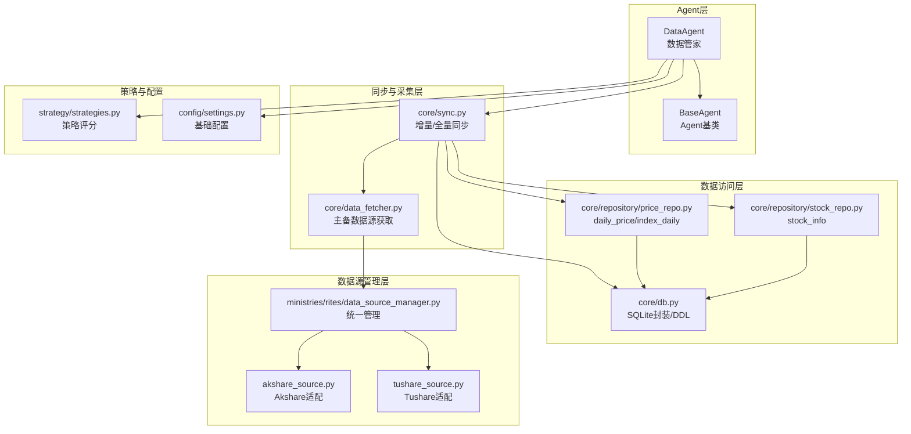
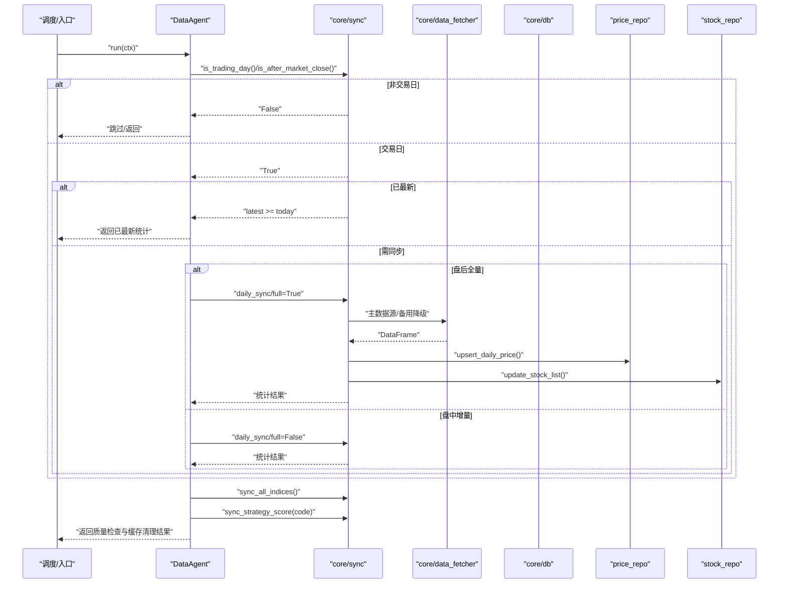
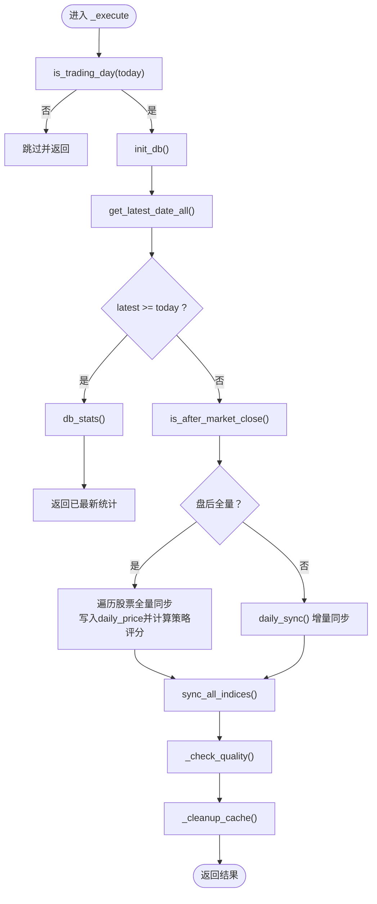
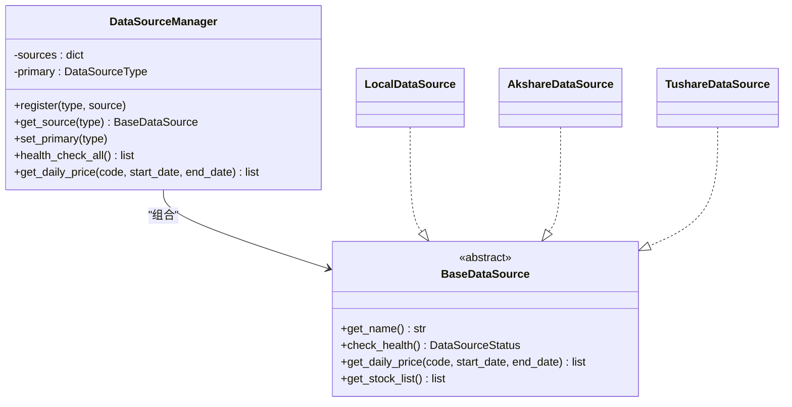
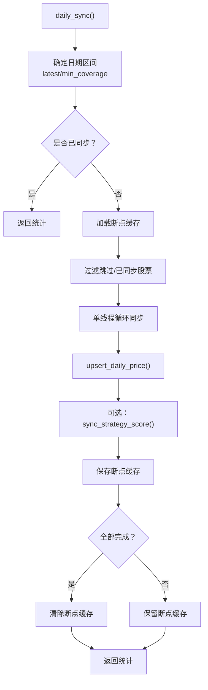
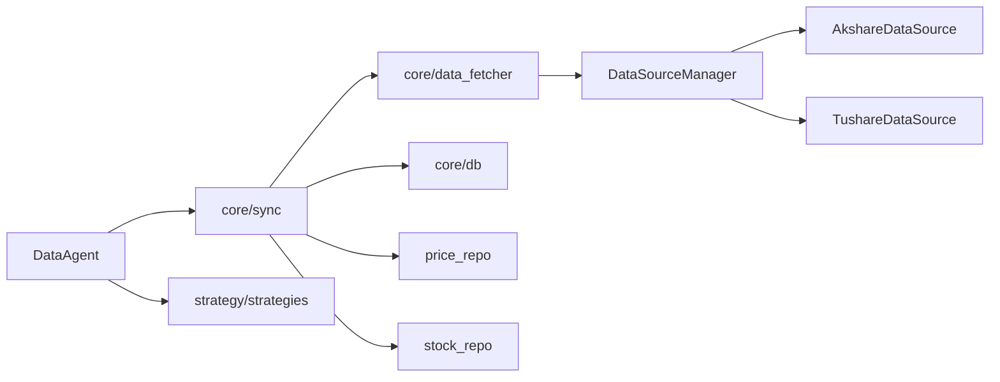

# 数据Agent

<cite>
**本文引用的文件**
- [agents/data_agent.py](file://agents/data_agent.py)
- [agents/base.py](file://agents/base.py)
- [core/sync.py](file://core/sync.py)
- [core/data_fetcher.py](file://core/data_fetcher.py)
- [core/db.py](file://core/db.py)
- [core/repository/price_repo.py](file://core/repository/price_repo.py)
- [core/repository/stock_repo.py](file://core/repository/stock_repo.py)
- [ministries/rites/data_source_manager.py](file://ministries/rites/data_source_manager.py)
- [ministries/rites/akshare_source.py](file://ministries/rites/akshare_source.py)
- [ministries/rites/tushare_source.py](file://ministries/rites/tushare_source.py)
- [config/settings.py](file://config/settings.py)
- [strategy/strategies.py](file://strategy/strategies.py)
</cite>

## 目录
1. [简介](#简介)
2. [项目结构](#项目结构)
3. [核心组件](#核心组件)
4. [架构总览](#架构总览)
5. [详细组件分析](#详细组件分析)
6. [依赖分析](#依赖分析)
7. [性能考量](#性能考量)
8. [故障排查指南](#故障排查指南)
9. [结论](#结论)
10. [附录](#附录)

## 简介
本文件为 AIQuant 数据Agent（“数据管家”）的全面技术文档，聚焦于数据采集、数据清洗与预处理的完整流程，涵盖数据源管理、数据质量检查与异常处理机制，以及数据缓存策略、增量更新与批量处理方法。同时提供配置选项与参数调优建议、典型数据处理示例与错误恢复策略，并说明数据Agent与其他Agent之间的协作关系与数据依赖。

## 项目结构
数据Agent位于 agents 子系统，围绕核心同步与数据访问模块组织，辅以策略评分与数据源适配层，形成“采集-入库-评分-校验-清理”的闭环。

图表来源
- [agents/data_agent.py:1-167](file://agents/data_agent.py#L1-L167)
- [agents/base.py:1-120](file://agents/base.py#L1-L120)
- [core/sync.py:1-760](file://core/sync.py#L1-L760)
- [core/data_fetcher.py:1-578](file://core/data_fetcher.py#L1-L578)
- [core/db.py:1-800](file://core/db.py#L1-L800)
- [core/repository/price_repo.py:1-237](file://core/repository/price_repo.py#L1-L237)
- [core/repository/stock_repo.py:1-80](file://core/repository/stock_repo.py#L1-L80)
- [ministries/rites/data_source_manager.py:1-190](file://ministries/rites/data_source_manager.py#L1-L190)
- [ministries/rites/akshare_source.py:1-135](file://ministries/rites/akshare_source.py#L1-L135)
- [ministries/rites/tushare_source.py:1-167](file://ministries/rites/tushare_source.py#L1-L167)
- [strategy/strategies.py:1-200](file://strategy/strategies.py#L1-L200)
- [config/settings.py:1-25](file://config/settings.py#L1-L25)

章节来源
- [agents/data_agent.py:1-167](file://agents/data_agent.py#L1-L167)
- [agents/base.py:1-120](file://agents/base.py#L1-L120)
- [core/sync.py:1-760](file://core/sync.py#L1-L760)
- [core/data_fetcher.py:1-578](file://core/data_fetcher.py#L1-L578)
- [core/db.py:1-800](file://core/db.py#L1-L800)
- [core/repository/price_repo.py:1-237](file://core/repository/price_repo.py#L1-L237)
- [core/repository/stock_repo.py:1-80](file://core/repository/stock_repo.py#L1-L80)
- [ministries/rites/data_source_manager.py:1-190](file://ministries/rites/data_source_manager.py#L1-L190)
- [ministries/rites/akshare_source.py:1-135](file://ministries/rites/akshare_source.py#L1-L135)
- [ministries/rites/tushare_source.py:1-167](file://ministries/rites/tushare_source.py#L1-L167)
- [strategy/strategies.py:1-200](file://strategy/strategies.py#L1-L200)
- [config/settings.py:1-25](file://config/settings.py#L1-L25)

## 核心组件
- DataAgent：负责交易日判断、全量/增量同步、指数同步、数据质量检查、缓存清理与结果汇总。
- BaseAgent：统一Agent生命周期、异常捕获与计时，输出标准化结果。
- core/sync：提供交易日判断、全量初始化、增量同步、指数同步、策略评分写入、断点续传缓存等能力。
- core/data_fetcher：主数据源（baostock）与备用（akshare/tushare）的统一接口，含本地缓存与降级策略。
- 数据访问层：db.py 提供连接池与DDL迁移；price_repo/stock_repo 提供表级CRUD封装。
- 数据源管理：DataSourceManager统一注册与切换，支持健康检查与自动降级。
- 策略评分：策略模块产出多策略评分并批量写入数据库，供回测与信号Agent使用。
- 配置：settings.py 提供数据库路径、定时时间、同步批大小、日志级别等基础配置。

章节来源
- [agents/data_agent.py:25-167](file://agents/data_agent.py#L25-L167)
- [agents/base.py:88-120](file://agents/base.py#L88-L120)
- [core/sync.py:39-760](file://core/sync.py#L39-L760)
- [core/data_fetcher.py:1-578](file://core/data_fetcher.py#L1-L578)
- [core/db.py:1-800](file://core/db.py#L1-L800)
- [core/repository/price_repo.py:13-237](file://core/repository/price_repo.py#L13-L237)
- [core/repository/stock_repo.py:13-80](file://core/repository/stock_repo.py#L13-L80)
- [ministries/rites/data_source_manager.py:111-190](file://ministries/rites/data_source_manager.py#L111-L190)
- [strategy/strategies.py:1-200](file://strategy/strategies.py#L1-L200)
- [config/settings.py:1-25](file://config/settings.py#L1-L25)

## 架构总览
数据Agent在每日盘后进行全量同步，在盘中进行增量同步；通过策略评分写入数据库，供后续信号与回测Agent消费。数据源采用主备自动降级，数据访问层统一抽象，配置集中管理。

图表来源
- [agents/data_agent.py:31-121](file://agents/data_agent.py#L31-L121)
- [core/sync.py:462-702](file://core/sync.py#L462-L702)
- [core/data_fetcher.py:173-223](file://core/data_fetcher.py#L173-L223)
- [core/repository/price_repo.py:13-93](file://core/repository/price_repo.py#L13-L93)
- [core/repository/stock_repo.py:13-28](file://core/repository/stock_repo.py#L13-L28)

## 详细组件分析

### DataAgent：数据管家
职责与流程
- 交易日判断：非交易日直接返回跳过原因。
- 已最新检查：若数据库最新日期已达今日，直接返回统计。
- 同步执行：盘后全量同步（逐股拉取并写入，同时写入策略评分），盘中增量同步（单线程，断点续传）。
- 质量检查：随机抽样检查缺失与过期比例，评估健康度。
- 缓存清理：定期清理本地缓存文件。

关键实现要点
- 全量同步：遍历股票列表，逐个调用同步函数，同时对每只股票计算策略评分。
- 增量同步：基于全市场覆盖率阈值动态确定同步区间，支持断点续传缓存。
- 质量检查：抽样检查最新日期，统计缺失与过期比例，返回健康度。
- 缓存清理：调用数据获取模块的清理函数，按天数阈值删除旧缓存。

图表来源
- [agents/data_agent.py:31-167](file://agents/data_agent.py#L31-L167)
- [core/sync.py:462-702](file://core/sync.py#L462-L702)

章节来源
- [agents/data_agent.py:31-167](file://agents/data_agent.py#L31-L167)

### BaseAgent：Agent基类与上下文
- 统一接口：run(ctx) 自动计时、异常捕获与结果封装。
- AgentContext：提供流水线共享上下文，支持跨Agent传递数据与结果汇总。

章节来源
- [agents/base.py:20-120](file://agents/base.py#L20-L120)

### 数据源管理与适配
- DataSourceManager：注册与切换数据源，支持健康检查与自动降级。
- 适配器：AkshareDataSource、TushareDataSource 实现统一接口，标准化数据格式。
- 默认主源：LocalDataSource（本地数据库），便于内部一致性与快速读取。

图表来源
- [ministries/rites/data_source_manager.py:111-190](file://ministries/rites/data_source_manager.py#L111-L190)
- [ministries/rites/akshare_source.py:15-135](file://ministries/rites/akshare_source.py#L15-L135)
- [ministries/rites/tushare_source.py:16-167](file://ministries/rites/tushare_source.py#L16-L167)

章节来源
- [ministries/rites/data_source_manager.py:111-190](file://ministries/rites/data_source_manager.py#L111-L190)
- [ministries/rites/akshare_source.py:15-135](file://ministries/rites/akshare_source.py#L15-L135)
- [ministries/rites/tushare_source.py:16-167](file://ministries/rites/tushare_source.py#L16-L167)

### 数据获取与缓存策略
- 主数据源：baostock（免费、稳定、无频率限制），自动登录与线程安全控制。
- 备用数据源：akshare/tushare，按接口可用性自动降级。
- 本地缓存：按“代码_复权_起止日期”命名缓存文件，命中即直接读取，避免重复请求。
- 代码格式转换：统一为 baostock 格式（含交易所前缀），并提供双向转换。
- 指数数据：统一指数代码格式，支持 baostock 与 akshare 备用。

章节来源
- [core/data_fetcher.py:31-223](file://core/data_fetcher.py#L31-L223)
- [core/data_fetcher.py:371-424](file://core/data_fetcher.py#L371-L424)

### 同步与增量更新
- 交易日判断：基于 akshare 的交易日历，失败时按工作日回退。
- 全量初始化：断点续传，支持历史区间与限流参数，适合首次拉取。
- 增量同步：单线程（baostock 登录限制），基于覆盖率阈值动态确定区间，支持断点续传缓存。
- 指数同步：每日同步主要指数至 index_daily 表，供大盘择时使用。
- 策略评分：对每只股票全量历史计算多策略评分并批量写入 daily_price。

图表来源
- [core/sync.py:462-702](file://core/sync.py#L462-L702)

章节来源
- [core/sync.py:39-131](file://core/sync.py#L39-L131)
- [core/sync.py:319-390](file://core/sync.py#L319-L390)
- [core/sync.py:462-702](file://core/sync.py#L462-L702)

### 数据质量检查与异常处理
- 质量检查：随机抽样股票，检查最新日期是否为今日，统计缺失与过期比例，返回健康度。
- 异常处理：各步骤均包裹 try-except，保证单点异常不影响整体流程；缓存清理失败也降级返回。
- 断点续传：同步过程异常中断后，下次启动自动从断点继续，减少重复工作量。

章节来源
- [agents/data_agent.py:122-157](file://agents/data_agent.py#L122-L157)
- [core/sync.py:422-460](file://core/sync.py#L422-L460)

### 数据清洗与预处理
- 数据清洗：过滤空值、剔除异常价格（close<=0）、统一列名与类型，补全必要字段。
- 预处理：策略评分写入 daily_price，便于后续回测与信号生成。
- 指数预处理：标准化列名与索引，写入 index_daily 表。

章节来源
- [core/data_fetcher.py:104-133](file://core/data_fetcher.py#L104-L133)
- [core/repository/price_repo.py:50-93](file://core/repository/price_repo.py#L50-L93)
- [core/sync.py:91-131](file://core/sync.py#L91-L131)

### 数据缓存策略
- 文件缓存：data_cache 目录下按“代码_复权_起止日期.csv”命名，命中即读取。
- 断点缓存：.sync_cache 目录下按“sync_起止日期.json”记录已同步股票集合，支持续传。
- 旧缓存清理：DataAgent 调用清理函数，按天数阈值删除旧文件。

章节来源
- [core/data_fetcher.py:194-223](file://core/data_fetcher.py#L194-L223)
- [core/sync.py:415-460](file://core/sync.py#L415-L460)
- [agents/data_agent.py:159-167](file://agents/data_agent.py#L159-L167)

### 配置选项与参数调优
- 数据库路径：DB_PATH（默认 core/quant.db）
- API主机与端口：API_HOST、API_PORT、API_DEBUG
- 定时任务：SCHEDULE_SYNC_TIME、SCHEDULE_SCAN_TIME
- 同步批大小与日志：SYNC_BATCH_SIZE、SYNC_VERBOSE
- 日志级别：LOG_LEVEL
- 同步模块内部参数：BATCH_SIZE、BASE_INTERVAL、INTER_BATCH_DELAY（影响全量初始化性能）

章节来源
- [config/settings.py:6-25](file://config/settings.py#L6-L25)
- [core/sync.py:31-35](file://core/sync.py#L31-L35)

### 数据处理示例与错误恢复
- 示例场景：盘后全量同步某日所有股票，同时写入策略评分与指数数据。
- 错误恢复：若某股票拉取失败，记录失败并继续；断点缓存保留，下次重试；缓存清理失败不阻塞主流程。
- 参数调优建议：在全量初始化阶段适当增大批次与间隔，平衡吞吐与稳定性；盘中增量同步保持单线程以规避登录限制。

章节来源
- [agents/data_agent.py:88-121](file://agents/data_agent.py#L88-L121)
- [core/sync.py:319-390](file://core/sync.py#L319-L390)
- [core/sync.py:462-702](file://core/sync.py#L462-L702)

### 与其他Agent的协作关系与数据依赖
- 与信号Agent：DataAgent写入 daily_price 与策略评分，信号Agent读取用于生成买卖信号。
- 与回测Agent：DataAgent写入的策略评分与行情数据直接供回测引擎使用。
- 与风控Agent：风控关注账户与策略层面，数据Agent提供基础数据保障。
- 与Orchestrator：通过 AgentContext 共享上下文，串联多Agent流水线。

章节来源
- [agents/data_agent.py:108-121](file://agents/data_agent.py#L108-L121)
- [core/sync.py:675-702](file://core/sync.py#L675-L702)
- [agents/base.py:38-86](file://agents/base.py#L38-L86)

## 依赖分析
- DataAgent 依赖 core/sync 与策略模块，间接依赖数据源管理与数据访问层。
- core/sync 依赖 core/data_fetcher 与 core/db，同时依赖策略模块写入评分。
- 数据源管理通过适配器解耦不同外部接口，支持健康检查与自动降级。
- 数据访问层通过仓库模式隔离表级操作，便于扩展与维护。

图表来源
- [agents/data_agent.py:17-22](file://agents/data_agent.py#L17-L22)
- [core/sync.py:16-26](file://core/sync.py#L16-L26)
- [core/data_fetcher.py:12-23](file://core/data_fetcher.py#L12-L23)
- [ministries/rites/data_source_manager.py:111-190](file://ministries/rites/data_source_manager.py#L111-L190)

章节来源
- [agents/data_agent.py:17-22](file://agents/data_agent.py#L17-L22)
- [core/sync.py:16-26](file://core/sync.py#L16-L26)
- [core/data_fetcher.py:12-23](file://core/data_fetcher.py#L12-L23)
- [ministries/rites/data_source_manager.py:111-190](file://ministries/rites/data_source_manager.py#L111-L190)

## 性能考量
- 全量初始化：baostock 无频率限制，适合高速拉取；通过批次与间隔参数平衡吞吐与稳定性。
- 增量同步：单线程登录限制，断点续传避免重复工作；覆盖率阈值减少无效同步。
- 数据库写入：批量写入与唯一索引优化，策略评分单独批量更新，降低锁竞争。
- 缓存策略：本地文件缓存显著降低重复请求；断点缓存提升容错与效率。

## 故障排查指南
- 交易日判断失败：回退为工作日判断，确认网络与 akshare 接口可用性。
- 同步失败：检查数据源可用性与健康检查结果；查看断点缓存文件是否存在与可读。
- 策略评分未写入：确认 daily_price 是否存在有效历史数据；检查评分计算函数返回值。
- 缓存清理失败：确认 data_cache 与 .sync_cache 目录权限；查看清理函数返回值。
- 数据库异常：检查 WAL 模式与同步级别配置；确认连接池与事务提交/回滚逻辑。

章节来源
- [core/sync.py:39-54](file://core/sync.py#L39-L54)
- [core/sync.py:422-460](file://core/sync.py#L422-L460)
- [core/sync.py:675-702](file://core/sync.py#L675-L702)
- [agents/data_agent.py:159-167](file://agents/data_agent.py#L159-L167)
- [core/db.py:26-40](file://core/db.py#L26-L40)

## 结论
数据Agent通过“主备数据源 + 本地缓存 + 断点续传 + 策略评分写入”的设计，实现了稳定高效的行情数据采集与预处理流程。其与策略、回测、信号等Agent形成清晰的数据依赖链路，配合统一的配置与异常处理机制，能够满足生产环境下的可靠性与可维护性要求。

## 附录
- 关键函数与文件映射
  - DataAgent._execute → [agents/data_agent.py:31-86](file://agents/data_agent.py#L31-L86)
  - DataAgent._run_sync → [agents/data_agent.py:88-121](file://agents/data_agent.py#L88-L121)
  - DataAgent._check_quality → [agents/data_agent.py:122-157](file://agents/data_agent.py#L122-L157)
  - DataAgent._cleanup_cache → [agents/data_agent.py:159-167](file://agents/data_agent.py#L159-L167)
  - core/sync.daily_sync → [core/sync.py:462-702](file://core/sync.py#L462-L702)
  - core/data_fetcher.get_stock_history → [core/data_fetcher.py:173-223](file://core/data_fetcher.py#L173-L223)
  - core/repository/price_repo.upsert_daily_price → [core/repository/price_repo.py:13-48](file://core/repository/price_repo.py#L13-L48)
  - core/repository/stock_repo.upsert_stock_list → [core/repository/stock_repo.py:13-28](file://core/repository/stock_repo.py#L13-L28)
  - Ministries DataSourceManager → [ministries/rites/data_source_manager.py:111-190](file://ministries/rites/data_source_manager.py#L111-L190)
  - 策略评分写入 → [core/sync.py:675-702](file://core/sync.py#L675-L702)