# 风险Agent

<cite>
**本文档引用的文件**
- [agents/risk_agent.py](file://agents/risk_agent.py)
- [risk/engine.py](file://risk/engine.py)
- [risk/guard.py](file://risk/guard.py)
- [risk/rules.py](file://risk/rules.py)
- [risk/models.py](file://risk/models.py)
- [risk/config_loader.py](file://risk/config_loader.py)
- [routes/risk.py](file://routes/risk.py)
- [agents/base.py](file://agents/base.py)
- [agents/orchestrator.py](file://agents/orchestrator.py)
- [config/risk_config.yaml](file://config/risk_config.yaml)
- [core/db.py](file://core/db.py)
</cite>

## 目录
1. [简介](#简介)
2. [项目结构](#项目结构)
3. [核心组件](#核心组件)
4. [架构概览](#架构概览)
5. [详细组件分析](#详细组件分析)
6. [依赖关系分析](#依赖关系分析)
7. [性能考虑](#性能考虑)
8. [故障排除指南](#故障排除指南)
9. [结论](#结论)
10. [附录](#附录)

## 简介

AIQuant风险Agent是一个增强版的风控系统，负责执行全面的风险评估、风险控制和风险监控。该Agent集成了传统技术分析指标和现代系统化风控规则，为投资决策提供实时的风险评估和控制机制。

风险Agent的主要职责包括：
- 大盘风险评估（沪深300 MA5/MA20/MA60趋势分析）
- 波动率评估（VIX近似：涨跌幅标准差）
- 个股风险筛查（ST、退市风险、停牌等）
- 仓位建议（基于大盘环境的动态调整）
- 系统化风控检查（接入risk/模块）
- 风控拦截和缓解措施

## 项目结构

风险Agent位于AIQuant项目的agents目录中，采用模块化设计，与其他Agent协同工作形成完整的投资决策流水线。

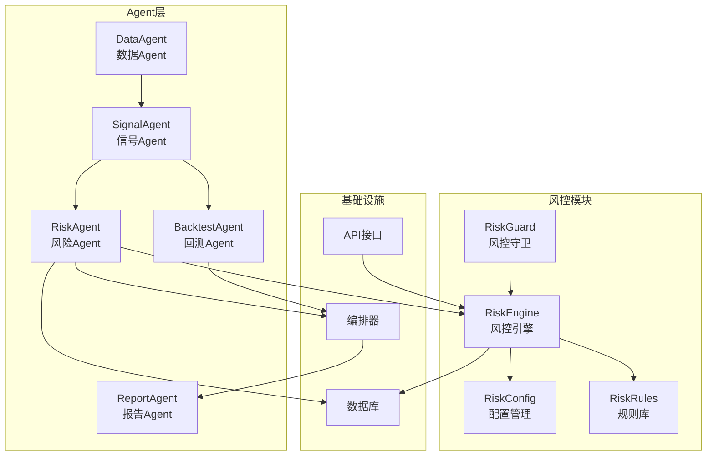
```mermaid
graph TB
subgraph "Agent层"
RA[RiskAgent<br/>风险Agent]
DA[DataAgent<br/>数据Agent]
SA[SignalAgent<br/>信号Agent]
BA[BacktestAgent<br/>回测Agent]
RPA[ReportAgent<br/>报告Agent]
end
subgraph "风控模块"
RE[RiskEngine<br/>风控引擎]
RG[RiskGuard<br/>风控守卫]
RC[RiskConfig<br/>配置管理]
RR[RiskRules<br/>规则库]
end
subgraph "基础设施"
DB[数据库]
API[API接口]
ORCH[编排器]
end
DA --> SA
SA --> RA
SA --> BA
RA --> ORCH
BA --> ORCH
ORCH --> RPA
RA --> RE
RE --> RR
RE --> RC
RA --> DB
RE --> DB
RG --> RE
API --> RE
```

**图表来源**
- [agents/risk_agent.py:1-262](file://agents/risk_agent.py#L1-L262)
- [agents/orchestrator.py:1-263](file://agents/orchestrator.py#L1-L263)

**章节来源**
- [agents/risk_agent.py:1-262](file://agents/risk_agent.py#L1-L262)
- [agents/orchestrator.py:1-263](file://agents/orchestrator.py#L1-L263)

## 核心组件

风险Agent由多个核心组件构成，每个组件都有明确的职责和接口：

### 主要组件架构

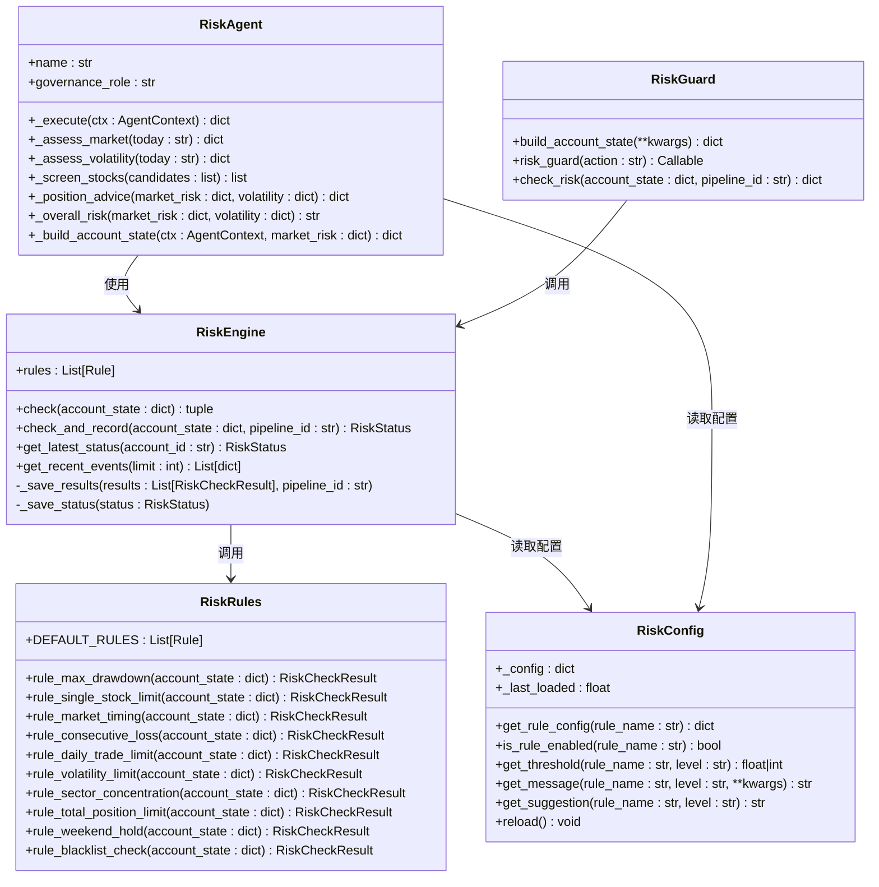
```mermaid
classDiagram
class RiskAgent {
+name : str
+governance_role : str
+_execute(ctx : AgentContext) dict
+_assess_market(today : str) dict
+_assess_volatility(today : str) dict
+_screen_stocks(candidates : list) list
+_position_advice(market_risk : dict, volatility : dict) dict
+_overall_risk(market_risk : dict, volatility : dict) str
+_build_account_state(ctx : AgentContext, market_risk : dict) dict
}
class RiskEngine {
+rules : List[Rule]
+check(account_state : dict) tuple
+check_and_record(account_state : dict, pipeline_id : str) RiskStatus
+get_latest_status(account_id : str) RiskStatus
+get_recent_events(limit : int) List[dict]
-_save_results(results : List[RiskCheckResult], pipeline_id : str)
-_save_status(status : RiskStatus)
}
class RiskGuard {
+build_account_state(**kwargs) dict
+risk_guard(action : str) Callable
+check_risk(account_state : dict, pipeline_id : str) dict
}
class RiskConfig {
+_config : dict
+_last_loaded : float
+get_rule_config(rule_name : str) dict
+is_rule_enabled(rule_name : str) bool
+get_threshold(rule_name : str, level : str) float|int
+get_message(rule_name : str, level : str, **kwargs) str
+get_suggestion(rule_name : str, level : str) str
+reload() void
}
class RiskRules {
+DEFAULT_RULES : List[Rule]
+rule_max_drawdown(account_state : dict) RiskCheckResult
+rule_single_stock_limit(account_state : dict) RiskCheckResult
+rule_market_timing(account_state : dict) RiskCheckResult
+rule_consecutive_loss(account_state : dict) RiskCheckResult
+rule_daily_trade_limit(account_state : dict) RiskCheckResult
+rule_volatility_limit(account_state : dict) RiskCheckResult
+rule_sector_concentration(account_state : dict) RiskCheckResult
+rule_total_position_limit(account_state : dict) RiskCheckResult
+rule_weekend_hold(account_state : dict) RiskCheckResult
+rule_blacklist_check(account_state : dict) RiskCheckResult
}
RiskAgent --> RiskEngine : 使用
RiskEngine --> RiskRules : 调用
RiskEngine --> RiskConfig : 读取配置
RiskGuard --> RiskEngine : 调用
RiskAgent --> RiskConfig : 读取配置
```

**图表来源**
- [agents/risk_agent.py:25-262](file://agents/risk_agent.py#L25-L262)
- [risk/engine.py:13-168](file://risk/engine.py#L13-L168)
- [risk/guard.py:15-92](file://risk/guard.py#L15-L92)
- [risk/config_loader.py:20-131](file://risk/config_loader.py#L20-L131)
- [risk/rules.py:376-388](file://risk/rules.py#L376-L388)

### 风控等级体系

风险Agent采用四级风控等级体系，从低到高依次为：

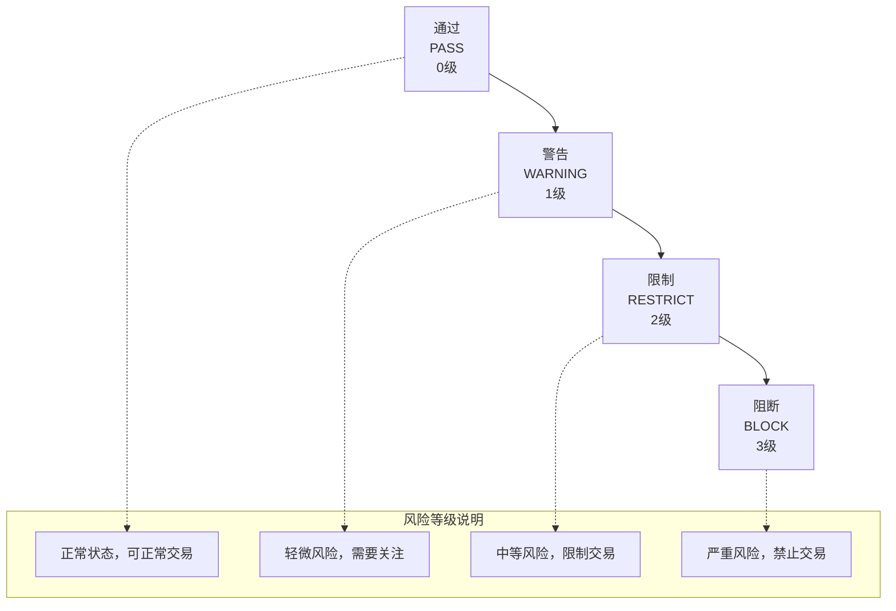
```mermaid
flowchart TD
PASS["通过<br/>PASS<br/>0级"] --> WARNING["警告<br/>WARNING<br/>1级"]
WARNING --> RESTRICT["限制<br/>RESTRICT<br/>2级"]
RESTRICT --> BLOCK["阻断<br/>BLOCK<br/>3级"]
subgraph "风险等级说明"
PASS_DESC["正常状态，可正常交易"]
WARNING_DESC["轻微风险，需要关注"]
RESTRICT_DESC["中等风险，限制交易"]
BLOCK_DESC["严重风险，禁止交易"]
end
PASS -.-> PASS_DESC
WARNING -.-> WARNING_DESC
RESTRICT -.-> RESTRICT_DESC
BLOCK -.-> BLOCK_DESC
```

**图表来源**
- [risk/models.py:11-16](file://risk/models.py#L11-L16)

**章节来源**
- [risk/models.py:1-78](file://risk/models.py#L1-L78)
- [risk/engine.py:13-168](file://risk/engine.py#L13-L168)

## 架构概览

风险Agent采用分层架构设计，实现了风险评估、规则执行、状态管理和拦截控制的完整闭环。

### 整体架构流程

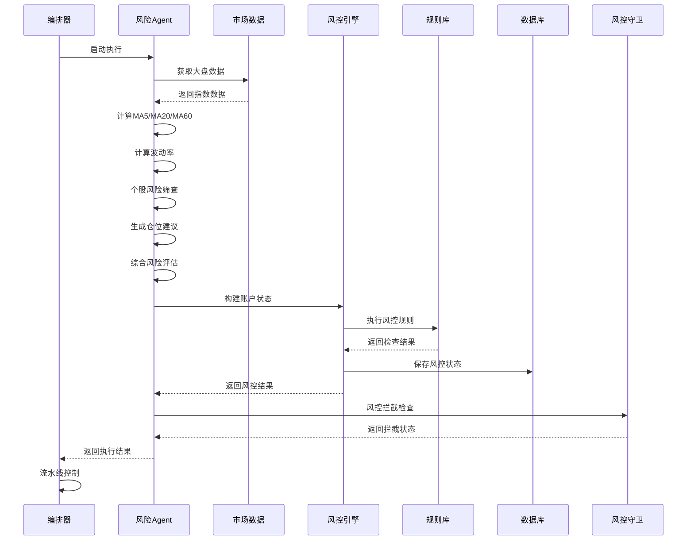
```mermaid
sequenceDiagram
participant Orchestrator as 编排器
participant RiskAgent as 风险Agent
participant Market as 市场数据
participant Engine as 风控引擎
participant Rules as 规则库
participant DB as 数据库
participant Guard as 风控守卫
Orchestrator->>RiskAgent : 启动执行
RiskAgent->>Market : 获取大盘数据
Market-->>RiskAgent : 返回指数数据
RiskAgent->>RiskAgent : 计算MA5/MA20/MA60
RiskAgent->>RiskAgent : 计算波动率
RiskAgent->>RiskAgent : 个股风险筛查
RiskAgent->>RiskAgent : 生成仓位建议
RiskAgent->>RiskAgent : 综合风险评估
RiskAgent->>Engine : 构建账户状态
Engine->>Rules : 执行风控规则
Rules-->>Engine : 返回检查结果
Engine->>DB : 保存风控状态
Engine-->>RiskAgent : 返回风控结果
RiskAgent->>Guard : 风控拦截检查
Guard-->>RiskAgent : 返回拦截状态
RiskAgent-->>Orchestrator : 返回执行结果
Orchestrator->>Orchestrator : 流水线控制
```

**图表来源**
- [agents/risk_agent.py:31-96](file://agents/risk_agent.py#L31-L96)
- [risk/engine.py:51-71](file://risk/engine.py#L51-L71)
- [agents/orchestrator.py:140-150](file://agents/orchestrator.py#L140-L150)

### 风控规则执行流程

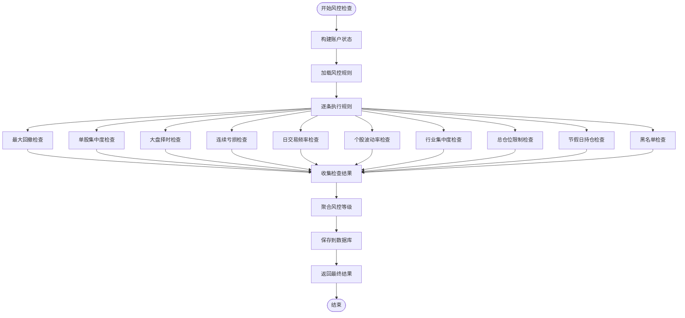
```mermaid
flowchart TD
Start([开始风控检查]) --> BuildState["构建账户状态"]
BuildState --> LoadRules["加载风控规则"]
LoadRules --> ExecuteRules["逐条执行规则"]
ExecuteRules --> Rule1["最大回撤检查"]
ExecuteRules --> Rule2["单股集中度检查"]
ExecuteRules --> Rule3["大盘择时检查"]
ExecuteRules --> Rule4["连续亏损检查"]
ExecuteRules --> Rule5["日交易频率检查"]
ExecuteRules --> Rule6["个股波动率检查"]
ExecuteRules --> Rule7["行业集中度检查"]
ExecuteRules --> Rule8["总仓位限制检查"]
ExecuteRules --> Rule9["节假日持仓检查"]
ExecuteRules --> Rule10["黑名单检查"]
Rule1 --> CheckResults["收集检查结果"]
Rule2 --> CheckResults
Rule3 --> CheckResults
Rule4 --> CheckResults
Rule5 --> CheckResults
Rule6 --> CheckResults
Rule7 --> CheckResults
Rule8 --> CheckResults
Rule9 --> CheckResults
Rule10 --> CheckResults
CheckResults --> Aggregate["聚合风控等级"]
Aggregate --> SaveDB["保存到数据库"]
SaveDB --> ReturnResult["返回最终结果"]
ReturnResult --> End([结束])
```

**图表来源**
- [risk/engine.py:19-49](file://risk/engine.py#L19-L49)
- [risk/rules.py:376-388](file://risk/rules.py#L376-L388)

**章节来源**
- [agents/risk_agent.py:1-262](file://agents/risk_agent.py#L1-L262)
- [risk/engine.py:1-168](file://risk/engine.py#L1-L168)

## 详细组件分析

### RiskAgent核心功能

RiskAgent作为门下省·风控官，承担着系统化的风险评估和控制职责。其核心功能包括：

#### 大盘风险评估

RiskAgent通过分析沪深300指数的移动平均线来评估市场趋势：

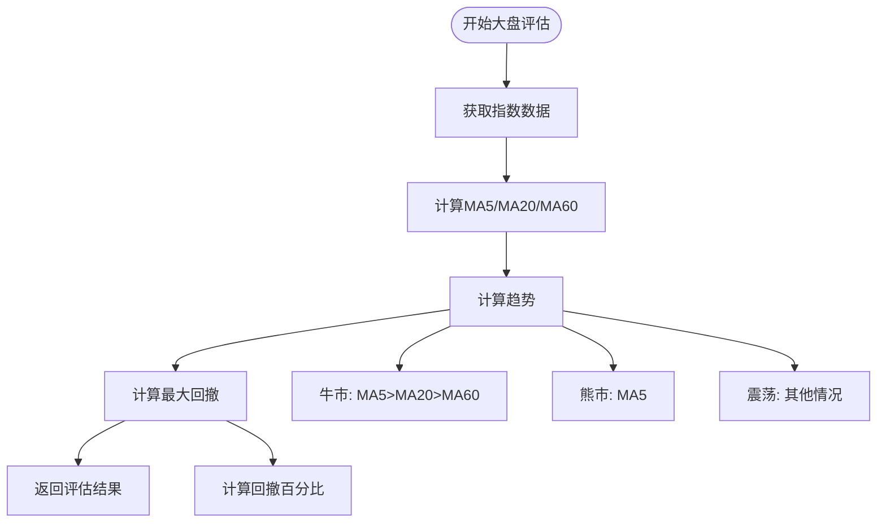
```mermaid
flowchart TD
Start([开始大盘评估]) --> GetData["获取指数数据"]
GetData --> CalcMA["计算MA5/MA20/MA60"]
CalcMA --> TrendCalc["计算趋势"]
TrendCalc --> DrawdownCalc["计算最大回撤"]
DrawdownCalc --> ReturnResult["返回评估结果"]
TrendCalc --> Bull["牛市: MA5>MA20>MA60"]
TrendCalc --> Bear["熊市: MA5<MA20"]
TrendCalc --> Neutral["震荡: 其他情况"]
DrawdownCalc --> DDValue["计算回撤百分比"]
```

**图表来源**
- [agents/risk_agent.py:117-151](file://agents/risk_agent.py#L117-L151)

#### 波动率评估

通过计算20个交易日的标准差来评估市场波动性：

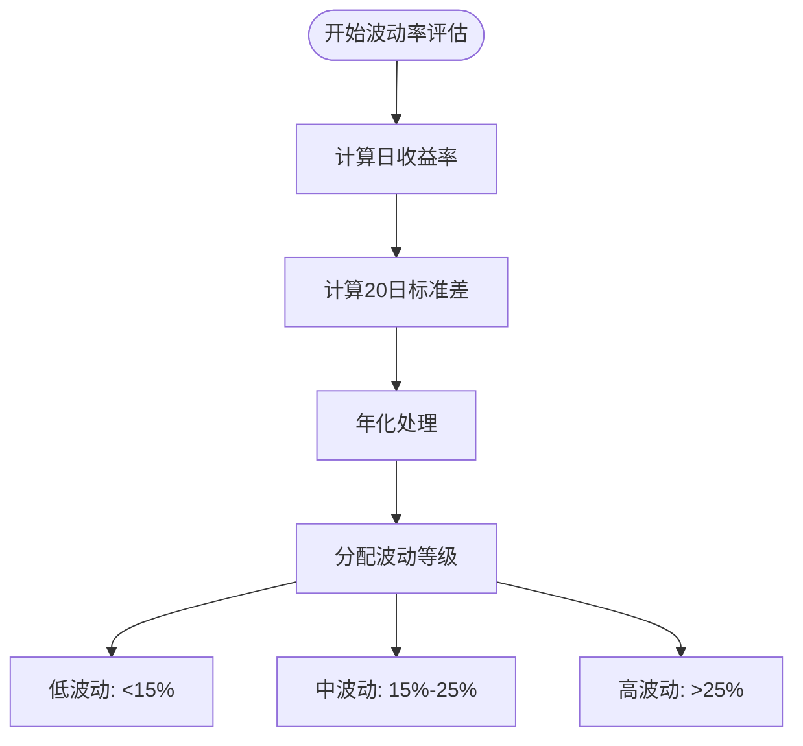
```mermaid
flowchart TD
Start([开始波动率评估]) --> GetReturns["计算日收益率"]
GetReturns --> CalcStd["计算20日标准差"]
CalcStd --> Annualize["年化处理"]
Annualize --> LevelAssign["分配波动等级"]
LevelAssign --> Low["低波动: <15%"]
LevelAssign --> Medium["中波动: 15%-25%"]
LevelAssign --> High["高波动: >25%"]
```

**图表来源**
- [agents/risk_agent.py:155-177](file://agents/risk_agent.py#L155-L177)

#### 个股风险筛查

对候选股票进行多维度风险评估：

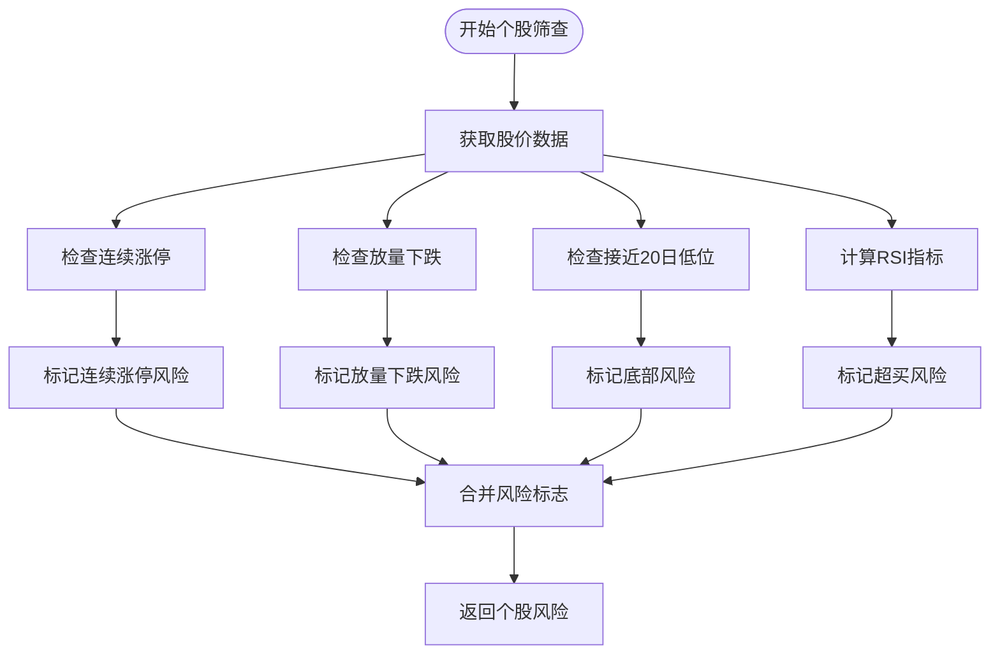
```mermaid
flowchart TD
Start([开始个股筛查]) --> GetPrice["获取股价数据"]
GetPrice --> LimitUp["检查连续涨停"]
GetPrice --> HeavyDrop["检查放量下跌"]
GetPrice --> NearLow["检查接近20日低位"]
GetPrice --> RSI["计算RSI指标"]
LimitUp --> Flag1["标记连续涨停风险"]
HeavyDrop --> Flag2["标记放量下跌风险"]
NearLow --> Flag3["标记底部风险"]
RSI --> Flag4["标记超买风险"]
Flag1 --> CombineFlags["合并风险标志"]
Flag2 --> CombineFlags
Flag3 --> CombineFlags
Flag4 --> CombineFlags
CombineFlags --> ReturnStockRisk["返回个股风险"]
```

**图表来源**
- [agents/risk_agent.py:179-227](file://agents/risk_agent.py#L179-L227)

**章节来源**
- [agents/risk_agent.py:25-262](file://agents/risk_agent.py#L25-L262)

### 风控引擎（RiskEngine）

RiskEngine是风控系统的核心执行组件，负责协调所有风控规则的执行和状态管理。

#### 规则执行机制

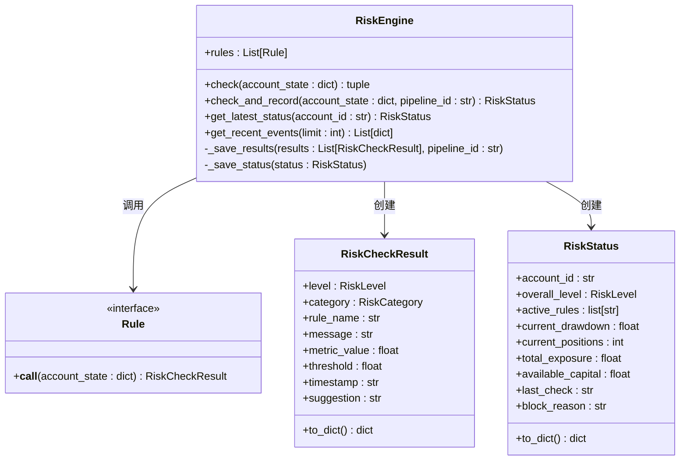
```mermaid
classDiagram
class RiskEngine {
+rules : List[Rule]
+check(account_state : dict) tuple
+check_and_record(account_state : dict, pipeline_id : str) RiskStatus
+get_latest_status(account_id : str) RiskStatus
+get_recent_events(limit : int) List[dict]
-_save_results(results : List[RiskCheckResult], pipeline_id : str)
-_save_status(status : RiskStatus)
}
class Rule {
<<interface>>
+__call__(account_state : dict) RiskCheckResult
}
class RiskCheckResult {
+level : RiskLevel
+category : RiskCategory
+rule_name : str
+message : str
+metric_value : float
+threshold : float
+timestamp : str
+suggestion : str
+to_dict() dict
}
class RiskStatus {
+account_id : str
+overall_level : RiskLevel
+active_rules : list[str]
+current_drawdown : float
+current_positions : int
+total_exposure : float
+available_capital : float
+last_check : str
+block_reason : str
+to_dict() dict
}
RiskEngine --> Rule : 调用
RiskEngine --> RiskCheckResult : 创建
RiskEngine --> RiskStatus : 创建
```

**图表来源**
- [risk/engine.py:13-168](file://risk/engine.py#L13-L168)
- [risk/models.py:28-78](file://risk/models.py#L28-L78)

#### 风控等级聚合

RiskEngine采用严格优先级机制来确定最终风控等级：

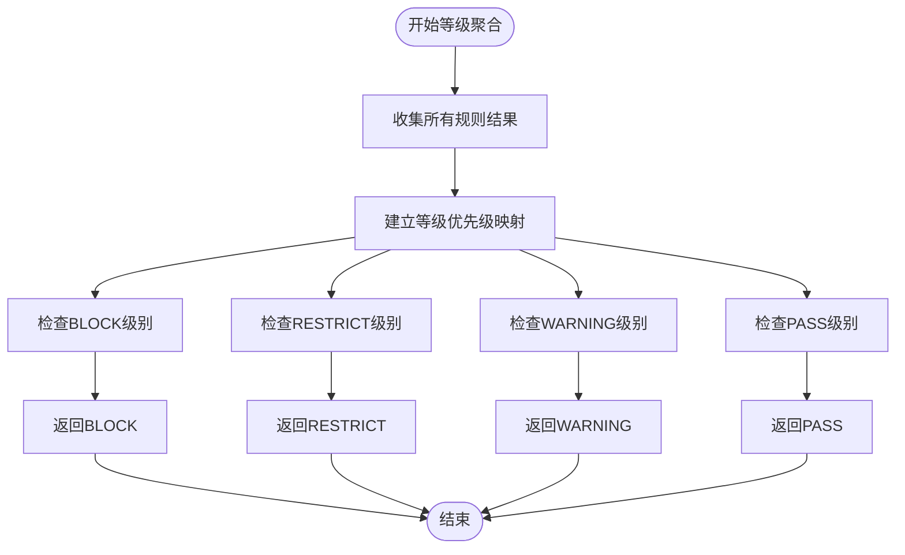
```mermaid
flowchart TD
Start([开始等级聚合]) --> CollectResults["收集所有规则结果"]
CollectResults --> PriorityMap["建立等级优先级映射"]
PriorityMap --> CheckBlock["检查BLOCK级别"]
PriorityMap --> CheckRestrict["检查RESTRICT级别"]
PriorityMap --> CheckWarning["检查WARNING级别"]
PriorityMap --> CheckPass["检查PASS级别"]
CheckBlock --> BlockResult["返回BLOCK"]
CheckRestrict --> RestrictResult["返回RESTRICT"]
CheckWarning --> WarningResult["返回WARNING"]
CheckPass --> PassResult["返回PASS"]
BlockResult --> End([结束])
RestrictResult --> End
WarningResult --> End
PassResult --> End
```

**图表来源**
- [risk/engine.py:40-49](file://risk/engine.py#L40-L49)

**章节来源**
- [risk/engine.py:1-168](file://risk/engine.py#L1-L168)
- [risk/models.py:1-78](file://risk/models.py#L1-L78)

### 风控规则库

风控规则库提供了完整的规则集合，涵盖了市场风险、投资组合风险和合规风险等多个维度。

#### 规则分类体系

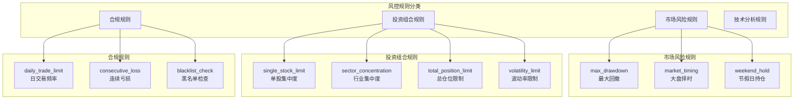
```mermaid
graph TB
subgraph "风控规则分类"
Market[市场风险规则]
Portfolio[投资组合规则]
Compliance[合规规则]
Technical[技术分析规则]
end
subgraph "市场风险规则"
MD[max_drawdown<br/>最大回撤]
MT[market_timing<br/>大盘择时]
WH[weekend_hold<br/>节假日持仓]
end
subgraph "投资组合规则"
SSL[single_stock_limit<br/>单股集中度]
SC[sector_concentration<br/>行业集中度]
TPL[total_position_limit<br/>总仓位限制]
VL[volatility_limit<br/>波动率限制]
end
subgraph "合规规则"
DL[daily_trade_limit<br/>日交易频率]
CL[consecutive_loss<br/>连续亏损]
BL[blacklist_check<br/>黑名单检查]
end
Market --> MD
Market --> MT
Market --> WH
Portfolio --> SSL
Portfolio --> SC
Portfolio --> TPL
Portfolio --> VL
Compliance --> DL
Compliance --> CL
Compliance --> BL
```

**图表来源**
- [risk/rules.py:376-388](file://risk/rules.py#L376-L388)

#### 规则配置管理

RiskConfig提供了灵活的配置管理系统，支持热加载和动态调整：

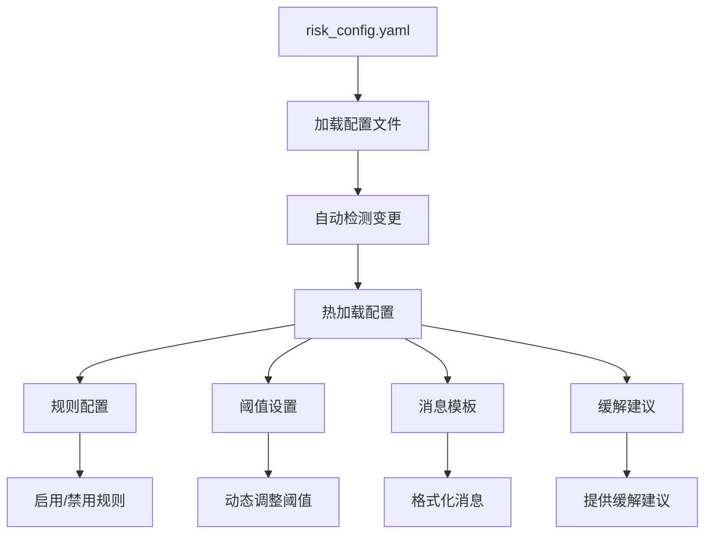
```mermaid
flowchart TD
ConfigFile[risk_config.yaml] --> LoadConfig["加载配置文件"]
LoadConfig --> AutoReload["自动检测变更"]
AutoReload --> HotReload["热加载配置"]
HotReload --> RuleConfig["规则配置"]
HotReload --> Thresholds["阈值设置"]
HotReload --> Messages["消息模板"]
HotReload --> Suggestions["缓解建议"]
RuleConfig --> EnableDisable["启用/禁用规则"]
Thresholds --> DynamicAdjust["动态调整阈值"]
Messages --> FormatMessages["格式化消息"]
Suggestions --> ProvideAdvice["提供缓解建议"]
```

**图表来源**
- [risk/config_loader.py:58-126](file://risk/config_loader.py#L58-L126)

**章节来源**
- [risk/rules.py:1-388](file://risk/rules.py#L1-L388)
- [risk/config_loader.py:1-131](file://risk/config_loader.py#L1-L131)

### 风控守卫（RiskGuard）

RiskGuard提供了装饰器模式的风控拦截机制，可以在函数执行前后自动进行风险检查。

#### 风控拦截流程

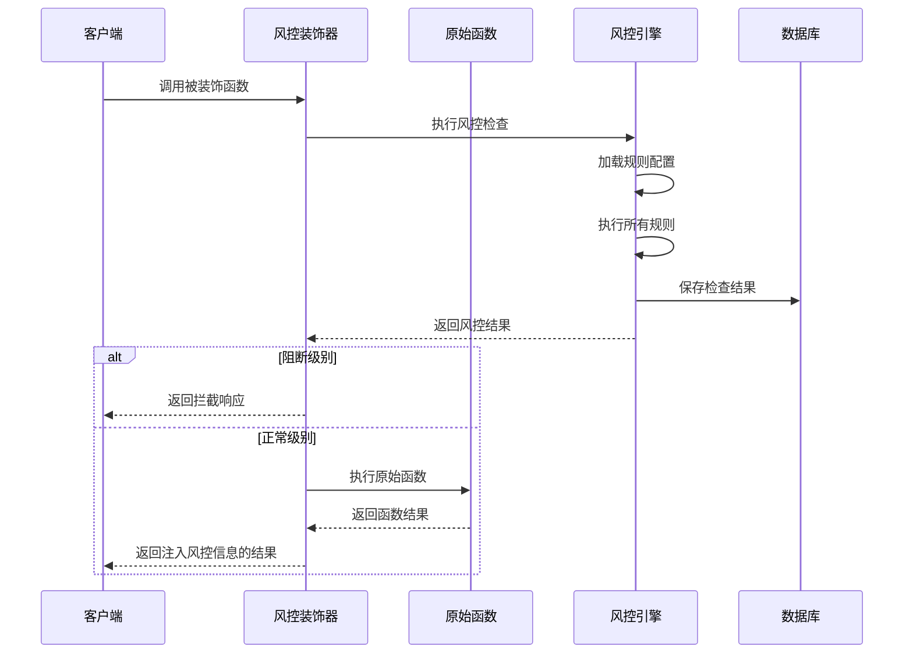
```mermaid
sequenceDiagram
participant Client as 客户端
participant Decorator as 风控装饰器
participant OriginalFunc as 原始函数
participant Engine as 风控引擎
participant DB as 数据库
Client->>Decorator : 调用被装饰函数
Decorator->>Engine : 执行风控检查
Engine->>Engine : 加载规则配置
Engine->>Engine : 执行所有规则
Engine->>DB : 保存检查结果
Engine-->>Decorator : 返回风控结果
alt 阻断级别
Decorator-->>Client : 返回拦截响应
else 正常级别
Decorator->>OriginalFunc : 执行原始函数
OriginalFunc-->>Decorator : 返回函数结果
Decorator-->>Client : 返回注入风控信息的结果
end
```

**图表来源**
- [risk/guard.py:36-74](file://risk/guard.py#L36-L74)

**章节来源**
- [risk/guard.py:1-92](file://risk/guard.py#L1-L92)

## 依赖关系分析

风险Agent的依赖关系清晰明确，遵循了单一职责原则和依赖倒置原则。

### 组件依赖图

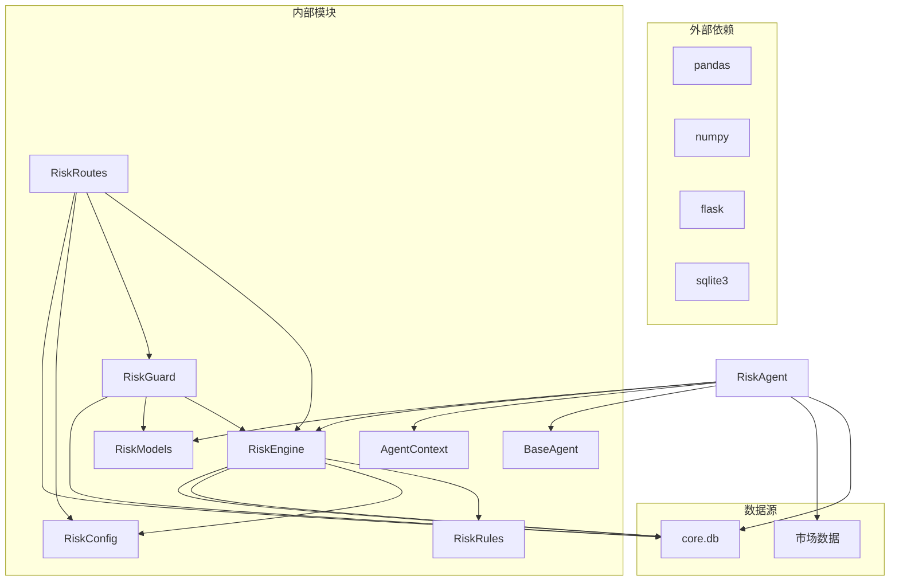
```mermaid
graph TB
subgraph "外部依赖"
Pandas[pandas]
Numpy[numpy]
Flask[flask]
SQLite[sqlite3]
end
subgraph "内部模块"
BaseAgent[BaseAgent]
AgentContext[AgentContext]
RiskModels[RiskModels]
RiskEngine[RiskEngine]
RiskRules[RiskRules]
RiskConfig[RiskConfig]
RiskGuard[RiskGuard]
Routes[RiskRoutes]
end
subgraph "数据源"
DB[core.db]
MarketData[市场数据]
end
RiskAgent --> BaseAgent
RiskAgent --> AgentContext
RiskAgent --> RiskEngine
RiskAgent --> RiskModels
RiskEngine --> RiskRules
RiskEngine --> RiskConfig
RiskEngine --> DB
RiskGuard --> RiskEngine
RiskGuard --> RiskModels
Routes --> RiskEngine
Routes --> RiskGuard
Routes --> RiskConfig
RiskAgent --> DB
RiskAgent --> MarketData
RiskEngine --> DB
RiskGuard --> DB
Routes --> DB
```

**图表来源**
- [agents/risk_agent.py:19-22](file://agents/risk_agent.py#L19-L22)
- [risk/engine.py:8-10](file://risk/engine.py#L8-L10)
- [routes/risk.py:21-24](file://routes/risk.py#L21-L24)

### 数据流分析

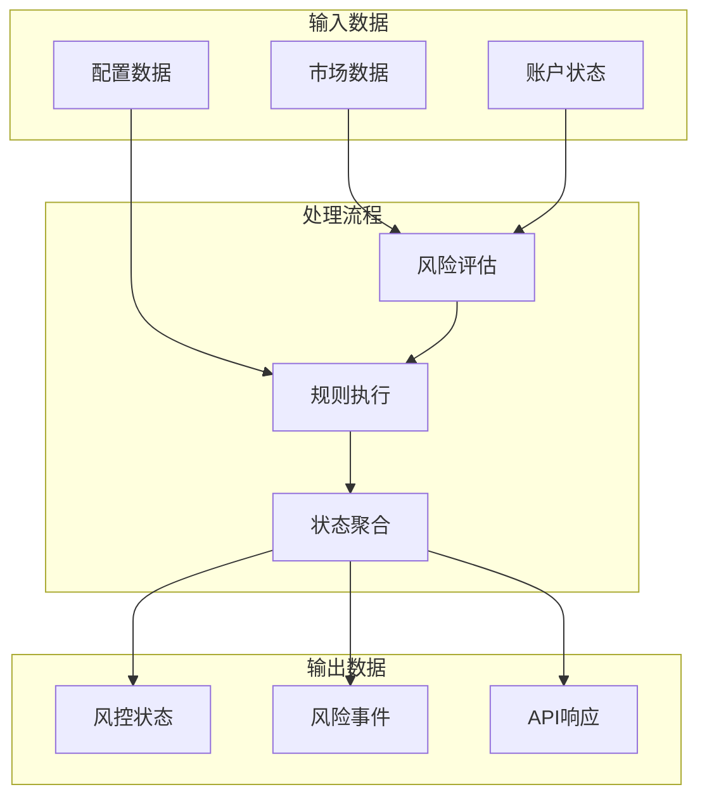
```mermaid
flowchart TD
subgraph "输入数据"
MarketData[市场数据]
AccountState[账户状态]
ConfigData[配置数据]
end
subgraph "处理流程"
RiskAssessment[风险评估]
RuleExecution[规则执行]
StatusAggregation[状态聚合]
end
subgraph "输出数据"
RiskStatus[风控状态]
RiskEvents[风险事件]
APIResponse[API响应]
end
MarketData --> RiskAssessment
AccountState --> RiskAssessment
ConfigData --> RuleExecution
RiskAssessment --> RuleExecution
RuleExecution --> StatusAggregation
StatusAggregation --> RiskStatus
StatusAggregation --> RiskEvents
StatusAggregation --> APIResponse
```

**图表来源**
- [agents/risk_agent.py:98-115](file://agents/risk_agent.py#L98-L115)
- [risk/engine.py:51-71](file://risk/engine.py#L51-L71)

**章节来源**
- [agents/risk_agent.py:1-262](file://agents/risk_agent.py#L1-L262)
- [risk/engine.py:1-168](file://risk/engine.py#L1-L168)

## 性能考虑

风险Agent在设计时充分考虑了性能优化，采用了多种策略来确保系统的高效运行。

### 性能优化策略

1. **延迟加载**: Agent类采用延迟导入机制，避免不必要的依赖加载
2. **缓存机制**: 配置文件支持热加载，减少重复IO操作
3. **并行执行**: 支持并行执行多个Agent，提高整体吞吐量
4. **数据库优化**: 使用索引和批量操作优化数据库访问
5. **内存管理**: 合理的数据结构选择和内存使用策略

### 性能监控指标

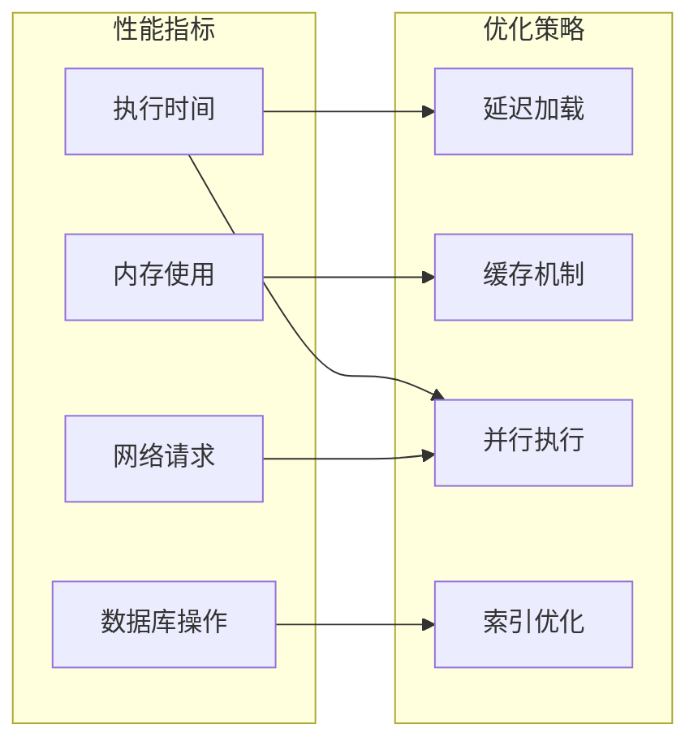
```mermaid
graph LR
subgraph "性能指标"
ExecTime[执行时间]
Memory[内存使用]
DBOps[数据库操作]
Network[网络请求]
end
subgraph "优化策略"
LazyLoad[延迟加载]
Caching[缓存机制]
Parallel[并行执行]
Indexing[索引优化]
end
ExecTime --> LazyLoad
ExecTime --> Parallel
Memory --> Caching
DBOps --> Indexing
Network --> Parallel
```

## 故障排除指南

风险Agent提供了完善的错误处理和故障排除机制。

### 常见问题及解决方案

#### 风控配置问题

**问题**: 配置文件加载失败
**解决方案**: 
1. 检查配置文件路径是否正确
2. 验证YAML语法格式
3. 确认文件权限设置
4. 查看日志输出获取详细错误信息

#### 数据获取问题

**问题**: 市场数据无法获取
**解决方案**:
1. 检查数据源连接状态
2. 验证数据接口可用性
3. 确认网络连接正常
4. 查看数据缓存状态

#### 规则执行问题

**问题**: 风控规则执行异常
**解决方案**:
1. 检查规则函数签名是否正确
2. 验证账户状态数据完整性
3. 查看规则配置是否正确
4. 检查数据库连接状态

### 调试工具

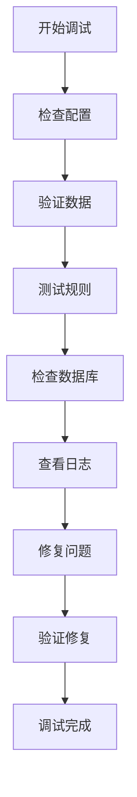
```mermaid
flowchart TD
DebugStart[开始调试] --> CheckConfig["检查配置"]
CheckConfig --> VerifyData["验证数据"]
VerifyData --> TestRules["测试规则"]
TestRules --> CheckDB["检查数据库"]
CheckDB --> ReviewLogs["查看日志"]
ReviewLogs --> FixIssues["修复问题"]
FixIssues --> VerifyFix["验证修复"]
VerifyFix --> DebugEnd[调试完成]
```

**章节来源**
- [risk/config_loader.py:58-72](file://risk/config_loader.py#L58-L72)
- [risk/engine.py:73-127](file://risk/engine.py#L73-L127)

## 结论

AIQuant风险Agent是一个功能完善、架构清晰的风控系统。它通过多层次的风险评估、灵活的规则配置和严格的拦截控制，为投资决策提供了可靠的风险保障。

### 主要优势

1. **模块化设计**: 清晰的组件分离和职责划分
2. **配置驱动**: 灵活的规则配置和阈值设置
3. **实时监控**: 实时的风险评估和状态更新
4. **拦截控制**: 强制性的风控拦截机制
5. **扩展性强**: 易于添加新的风控规则和指标

### 应用场景

- **自动化交易系统**: 为算法交易提供实时风控保障
- **投资组合管理**: 监控投资组合风险暴露
- **合规监管**: 满足监管要求的风险控制
- **风险管理**: 帮助投资者识别和控制风险

## 附录

### 风控指标计算公式

#### 大盘趋势计算
- MA5 = Σ(收盘价)/5
- MA20 = Σ(收盘价)/20  
- MA60 = Σ(收盘价)/60
- 趋势判断: MA5>MA20>MA60(牛市), MA5<MA20(熊市), 其他(震荡)

#### 波动率计算
- 日收益率 = (今日收盘价-昨日收盘价)/昨日收盘价
- 波动率 = 标准差(日收益率) × √252

#### 回撤计算
- 最高净值 = max(历史净值)
- 回撤 = (当前净值 - 最高净值)/最高净值

### 风险等级阈值设置

| 风险类别 | 预警阈值 | 限制阈值 | 禁止阈值 |
|---------|---------|---------|---------|
| 最大回撤 | 5% | 10% | 15% |
| 单股集中度 | 25% | 30% | - |
| 行业集中度 | 35% | 40% | - |
| 总仓位 | 80% | 90% | - |
| 日交易频率 | 3次 | 5次 | - |
| 连续亏损 | 3次 | 5次 | - |
| 个股波动率 | 5% | 7% | - |

### 风控拦截策略

当风控等级达到BLOCK级别时，系统将执行以下拦截策略：

1. **立即停止**: 拦截当前交易指令
2. **状态更新**: 更新风控状态到BLOCK级别
3. **事件记录**: 记录风险事件到数据库
4. **通知机制**: 发送告警通知给相关人员
5. **恢复条件**: 设置恢复条件和时间窗口

### 风险缓解措施

针对不同级别的风险，系统提供相应的缓解措施：

- **WARNING级别**: 提醒关注，建议降低仓位
- **RESTRICT级别**: 限制交易，建议人工确认
- **BLOCK级别**: 禁止交易，建议清仓观望

### 配置定制指南

#### 风控规则配置

1. **启用/禁用规则**: 在配置文件中设置`enabled`字段
2. **调整阈值**: 修改`thresholds`下的各级别阈值
3. **自定义消息**: 修改`messages`下的提示信息
4. **缓解建议**: 更新`suggestions`下的处理建议

#### 风险Agent配置

1. **数据源配置**: 配置市场数据获取参数
2. **计算参数**: 设置技术指标计算周期
3. **拦截策略**: 配置不同风险级别的处理策略
4. **监控设置**: 设置告警和通知参数

**章节来源**
- [config/risk_config.yaml:1-170](file://config/risk_config.yaml#L1-L170)
- [agents/risk_agent.py:117-262](file://agents/risk_agent.py#L117-L262)