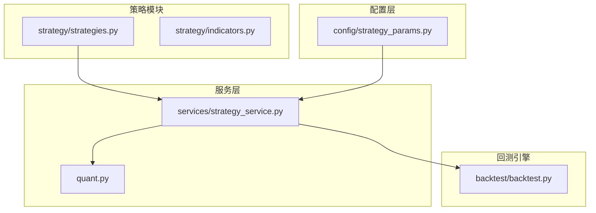
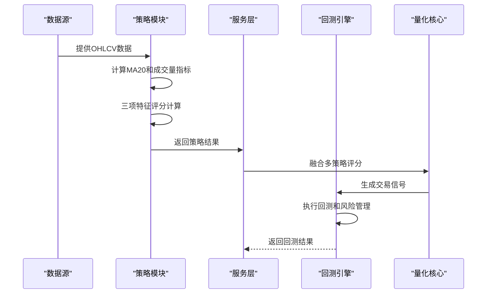
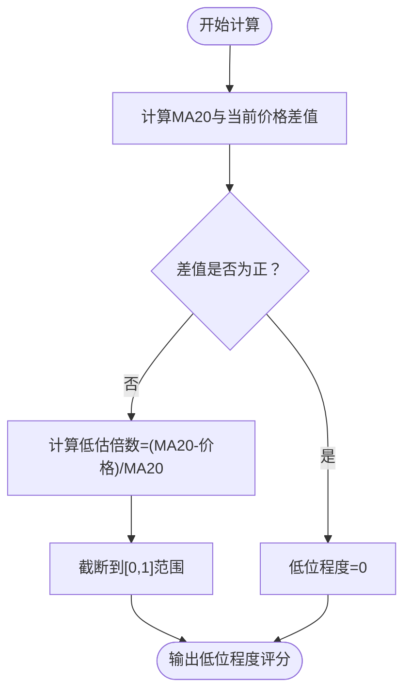
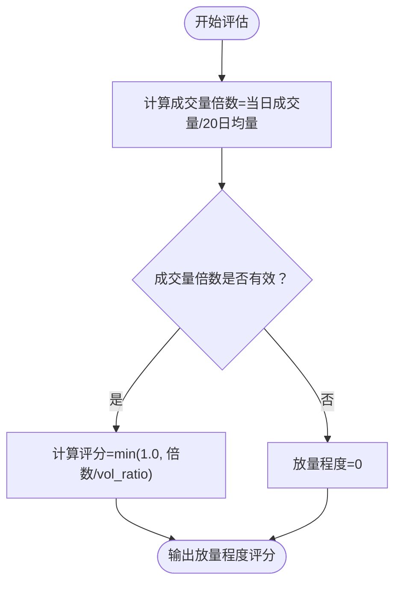
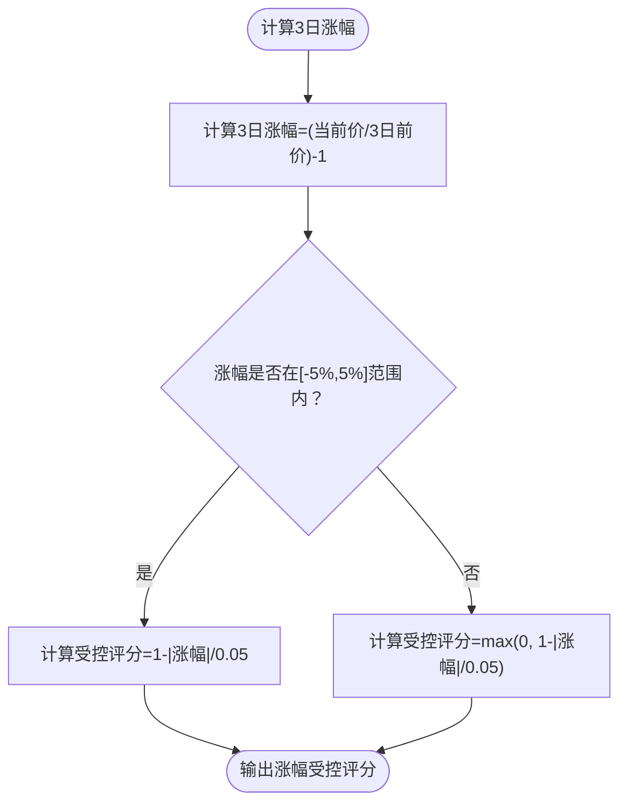
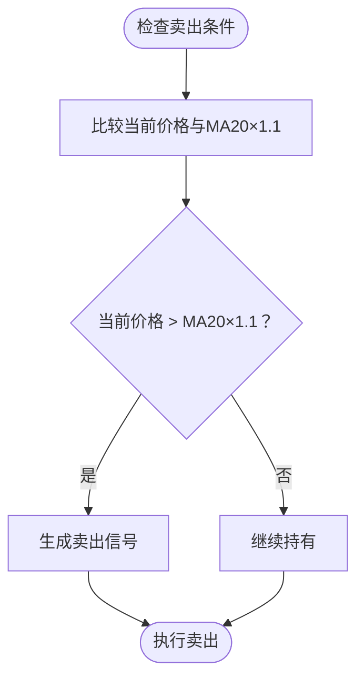
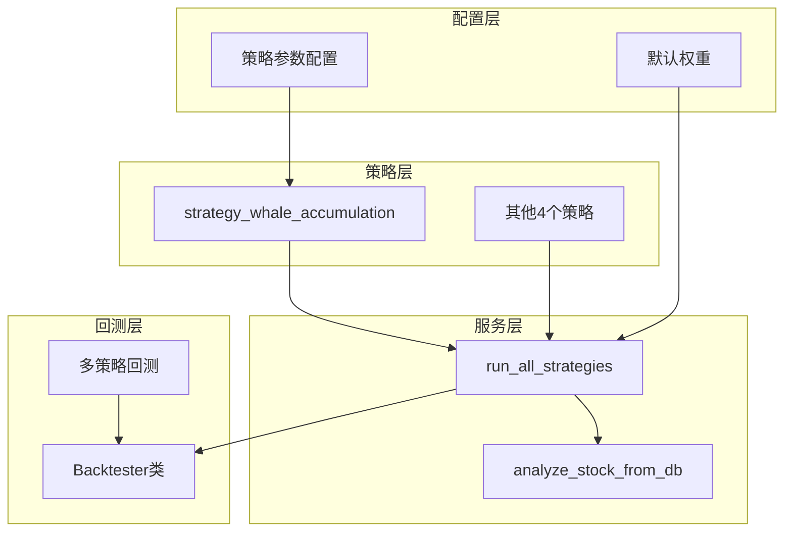

# 主力建仓型策略

<cite>
**本文档引用的文件**
- [strategy/strategies.py](file://strategy/strategies.py)
- [services/strategy_service.py](file://services/strategy_service.py)
- [config/strategy_params.py](file://config/strategy_params.py)
- [quant.py](file://quant.py)
- [backtest/backtest.py](file://backtest/backtest.py)
</cite>

## 目录
1. [简介](#简介)
2. [项目结构](#项目结构)
3. [核心组件](#核心组件)
4. [架构概览](#架构概览)
5. [详细组件分析](#详细组件分析)
6. [依赖分析](#依赖分析)
7. [性能考虑](#性能考虑)
8. [故障排除指南](#故障排除指南)
9. [结论](#结论)
10. [附录](#附录)

## 简介
主力建仓型策略是AIQuant量化系统中的一个专门用于识别主力资金建仓时机的策略模块。该策略通过三个核心维度的连续评分来判断主力资金是否在股价低迷区进行异常放量建仓，从而为投资者提供潜在的买入信号。

该策略的核心理念是：当股价处于历史低位区域时，如果出现成交量异常放大且股价涨幅受到严格控制，这通常表明主力资金正在悄然建仓。策略通过量化这三个关键特征来构建一个可靠的信号系统。

## 项目结构
AIQuant项目采用模块化设计，主力建仓型策略位于策略模块中，与其他四个基础策略共同构成完整的多策略框架。



**图表来源**
- [strategy/strategies.py:1-431](file://strategy/strategies.py#L1-L431)
- [services/strategy_service.py:1-325](file://services/strategy_service.py#L1-L325)
- [config/strategy_params.py:1-76](file://config/strategy_params.py#L1-L76)
- [backtest/backtest.py:1-517](file://backtest/backtest.py#L1-L517)

**章节来源**
- [strategy/strategies.py:1-431](file://strategy/strategies.py#L1-L431)
- [services/strategy_service.py:1-325](file://services/strategy_service.py#L1-L325)

## 核心组件
主力建仓型策略由五个主要组件构成，每个组件负责特定的功能领域：

### 策略函数主体
主力建仓型策略的核心实现位于`strategy_whale_accumulation`函数中，该函数接收OHLCV数据和可选的成交量倍数参数，返回包含买卖信号和评分的DataFrame。

### 评分系统
策略采用连续评分机制，将三个核心特征分别评分（0-1分），然后求和得到总分。每个特征都有明确的计算逻辑和评分标准。

### 信号生成器
策略根据总分和时间约束生成买入和卖出信号，确保信号的可靠性和实用性。

**章节来源**
- [strategy/strategies.py:224-255](file://strategy/strategies.py#L224-L255)

## 架构概览
主力建仓型策略在整个AIQuant系统中扮演着重要角色，它与其他四个基础策略共同构成多策略融合框架。



**图表来源**
- [strategy/strategies.py:224-255](file://strategy/strategies.py#L224-L255)
- [services/strategy_service.py:46-107](file://services/strategy_service.py#L46-L107)
- [quant.py:89-114](file://quant.py#L89-L114)

## 详细组件分析

### 低位程度评分机制
低位程度评分是主力建仓型策略的第一个核心特征，用于衡量股价相对于20日均线的低估程度。

#### 计算原理
低位程度评分通过以下公式计算：
```
低位程度 = min(1.0, (MA20 - 当前价格) / MA20)
```

这个公式的含义是：
- 当股价等于MA20时，低位程度为0（无低估）
- 当股价低于MA20时，低估程度越高，评分越高（最大1.0）
- 当股价高于MA20时，评分被截断为0（不给予低估加分）

#### 数学特性
- **范围限制**：评分始终在[0, 1]范围内
- **单调递增**：股价越低，评分越高
- **饱和效应**：超过1.0的低估会被截断，防止过度放大



**图表来源**
- [strategy/strategies.py:237-239](file://strategy/strategies.py#L237-L239)

**章节来源**
- [strategy/strategies.py:237-239](file://strategy/strategies.py#L237-L239)

### 放量程度评估系统
放量程度评估是主力建仓型策略的第二个核心特征，用于识别成交量异常放大的情况。

#### 评估标准
放量程度评分基于成交量相对于20日均量的倍数关系计算：

```
放量程度 = min(1.0, 成交量 / 20日均量 / vol_ratio)
```

其中`vol_ratio`是可配置参数，默认值为3.0，表示3倍量为满分。

#### 评分机制
- **3倍量**：获得满分1.0分
- **1.5倍量**：获得0.5分
- **1倍量**：获得0分（无放量）
- **超过3倍量**：被截断为1.0分（饱和效应）



**图表来源**
- [strategy/strategies.py:241-243](file://strategy/strategies.py#L241-L243)

**章节来源**
- [strategy/strategies.py:241-243](file://strategy/strategies.py#L241-L243)

### 涨幅受控判断机制
涨幅受控判断是主力建仓型策略的第三个核心特征，用于确保股价在建仓过程中的稳定性。

#### 判断逻辑
涨幅受控评分基于3日涨幅的控制程度：

```
涨幅受控 = max(0, 1 - |3日涨幅| / 0.05)
```

其中0.05表示5%的涨幅阈值，这是策略的默认参数。

#### 评分特点
- **5%涨幅**：获得满分1.0分（最理想状态）
- **0%涨幅**：获得1.0分（完全受控）
- **超过5%涨幅**：评分线性下降
- **负增长**：评分保持在0-1范围内



**图表来源**
- [strategy/strategies.py:245-247](file://strategy/strategies.py#L245-L247)

**章节来源**
- [strategy/strategies.py:245-247](file://strategy/strategies.py#L245-L247)

### 策略核心理念详解
主力建仓型策略的核心理念建立在对主力资金行为模式的深入理解之上：

#### 主力资金建仓特征
1. **股价低迷区**：主力通常在市场恐慌或下跌过程中收集筹码
2. **异常放量**：成交量显著放大，但股价涨幅有限
3. **价格稳定**：涨幅控制在合理范围内，避免引起市场注意

#### 识别逻辑
策略通过三个维度的协同作用来识别主力建仓：
- **时机选择**：股价处于历史低位
- **量价配合**：成交量异常放大
- **价格控制**：涨幅受到严格控制

#### 信号生成规则
买入信号生成需要满足：
1. **总分阈值**：三项评分之和≥1.0
2. **时间约束**：至少在第20个交易日之后
3. **综合评分**：确保信号的可靠性

**章节来源**
- [strategy/strategies.py:224-255](file://strategy/strategies.py#L224-L255)

### 卖出条件设计
主力建仓型策略的卖出条件基于技术分析的基本原则：

#### 卖出逻辑
```
卖出信号 = 当前价格 > MA20 × 1.1
```

这意味着当股价上涨超过20日均线10%时，策略建议获利了结。

#### 设计原理
1. **趋势确认**：股价突破20日均线表明趋势转强
2. **获利保护**：10%的获利空间提供了合理的退出点
3. **风险控制**：避免让利润过度回吐



**图表来源**
- [strategy/strategies.py:253](file://strategy/strategies.py#L253)

**章节来源**
- [strategy/strategies.py:253](file://strategy/strategies.py#L253)

## 依赖分析
主力建仓型策略在AIQuant系统中有明确的依赖关系和集成方式：



**图表来源**
- [strategy/strategies.py:224-255](file://strategy/strategies.py#L224-L255)
- [services/strategy_service.py:46-107](file://services/strategy_service.py#L46-L107)
- [quant.py:89-114](file://quant.py#L89-L114)

### 关键依赖关系
1. **策略函数依赖**：`strategy_whale_accumulation`依赖pandas和numpy进行数据处理
2. **服务层集成**：策略通过`run_all_strategies`函数被服务层调用
3. **参数配置**：策略参数通过`config/strategy_params.py`进行配置管理
4. **回测集成**：策略结果通过回测引擎进行性能验证

**章节来源**
- [services/strategy_service.py:14-22](file://services/strategy_service.py#L14-L22)
- [config/strategy_params.py:39-43](file://config/strategy_params.py#L39-L43)

## 性能考虑
主力建仓型策略在设计时充分考虑了性能优化：

### 计算效率
- **向量化操作**：使用pandas的rolling函数进行高效的时间序列计算
- **内存优化**：只保留必要的中间变量，避免重复计算
- **数据类型优化**：使用float64确保计算精度

### 时间复杂度
- **单日计算**：O(n)时间复杂度，其中n为数据长度
- **滚动窗口**：MA20和vol20的计算具有O(n)的线性复杂度
- **评分计算**：O(1)时间复杂度，每个评分都是简单的数学运算

### 内存使用
- **中间变量**：仅创建必要的临时变量（ma20、vol20、vol5等）
- **数据复制**：使用copy()确保数据隔离，但避免不必要的数据拷贝
- **返回值**：只返回必需的列，减少内存占用

## 故障排除指南
在实际使用主力建仓型策略时，可能会遇到以下常见问题：

### 数据质量问题
**问题**：策略返回空结果或NaN值
**解决方案**：
1. 确保输入数据至少包含30个交易日
2. 检查OHLCV数据的完整性
3. 验证数据时间序列的连续性

### 参数设置不当
**问题**：策略信号过于稀少或过于频繁
**解决方案**：
1. 调整`vol_ratio`参数（默认3.0）
2. 修改`score_min`阈值（默认1.0）
3. 考虑结合其他策略进行信号确认

### 性能问题
**问题**：策略运行速度过慢
**解决方案**：
1. 确保使用最新的pandas版本
2. 检查数据预处理步骤
3. 考虑使用更高效的计算方法

**章节来源**
- [services/strategy_service.py:54-55](file://services/strategy_service.py#L54-L55)

## 结论
主力建仓型策略通过三个核心维度的量化评估，为识别主力资金建仓时机提供了科学的方法。该策略的设计充分体现了技术分析的基本原理，同时结合了现代量化交易的理念。

### 策略优势
1. **理论基础扎实**：基于主力资金行为模式的深入分析
2. **计算简洁高效**：使用简单的数学公式实现复杂的逻辑判断
3. **可配置性强**：提供灵活的参数调整机制
4. **集成度高**：与整个AIQuant系统的无缝集成

### 实战价值
该策略特别适用于：
- **中线投资**：识别主力资金的长期建仓时机
- **趋势跟踪**：结合其他指标进行趋势确认
- **风险控制**：通过严格的止损机制保护资本

### 局限性
1. **滞后性**：技术指标固有的滞后特性
2. **市场环境依赖**：在不同市场环境下表现可能差异较大
3. **参数敏感性**：需要根据具体市场环境调整参数

## 附录

### 参数调优建议
基于策略的实现细节，以下是具体的参数调优建议：

#### 低位程度参数
- **默认值**：3.0（3倍量为满分）
- **调优方向**：根据市场波动性调整
  - 高波动市场：可适当提高至3.5-4.0
  - 低波动市场：可适当降低至2.5-3.0

#### 涨幅受控参数
- **默认值**：5%（0.05）
- **调优方向**：根据交易风格调整
  - 保守交易：可降至3-4%
  - 激进交易：可提高至6-7%

#### 评分阈值
- **默认值**：1.0
- **调优方向**：根据信号质量调整
  - 严格筛选：提高至1.2-1.5
  - 宽松筛选：降低至0.8-1.0

### 实战应用技巧
1. **多策略验证**：结合其他策略进行交叉验证
2. **时间过滤**：在重要的技术位置（如重要支撑位）使用
3. **成交量确认**：关注成交量的真实放大而非虚假放量
4. **风险控制**：严格执行止损和止盈机制
5. **资金管理**：合理分配仓位，避免过度集中

### 与回测系统的集成
主力建仓型策略与AIQuant的回测系统完美集成，支持：
- **T+1交易机制**：信号日触发，次日开盘价执行
- **滑点模拟**：内置0.1%的滑点成本
- **手续费计算**：支持万三双向手续费
- **风险管理**：集成回撤熔断和动态仓位管理

**章节来源**
- [backtest/backtest.py:66-111](file://backtest/backtest.py#L66-L111)
- [quant.py:43-51](file://quant.py#L43-L51)