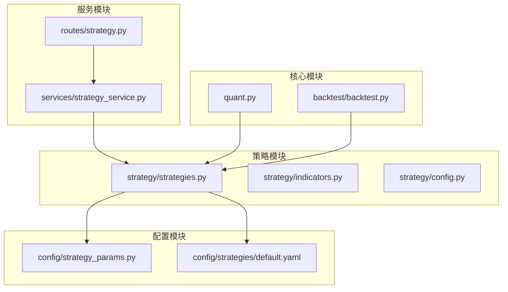
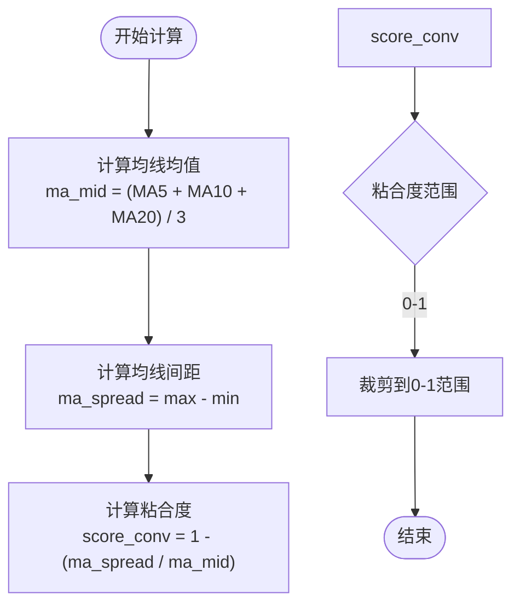
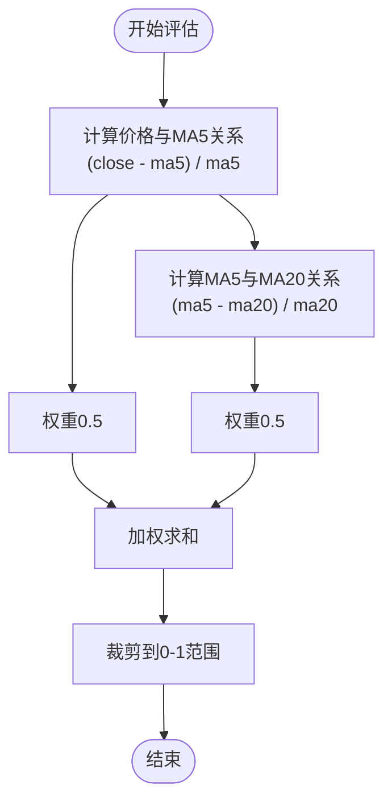
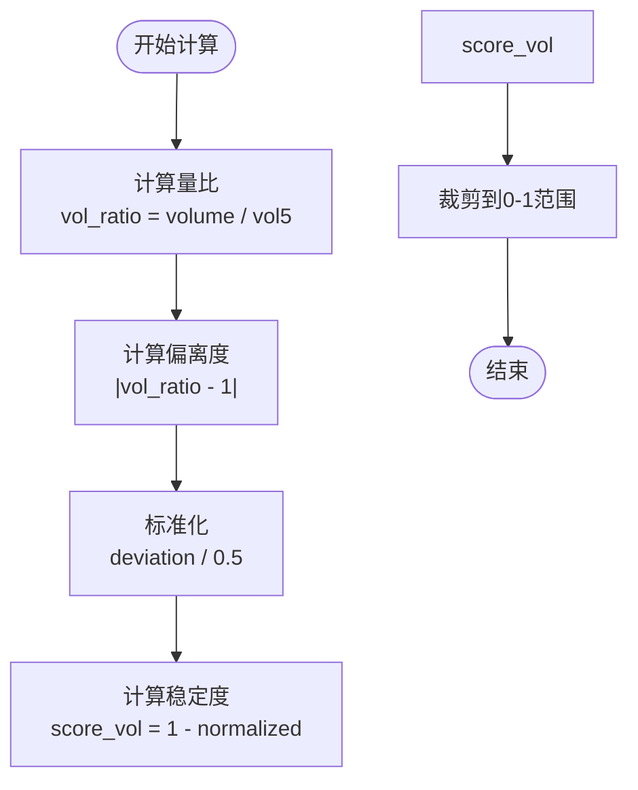
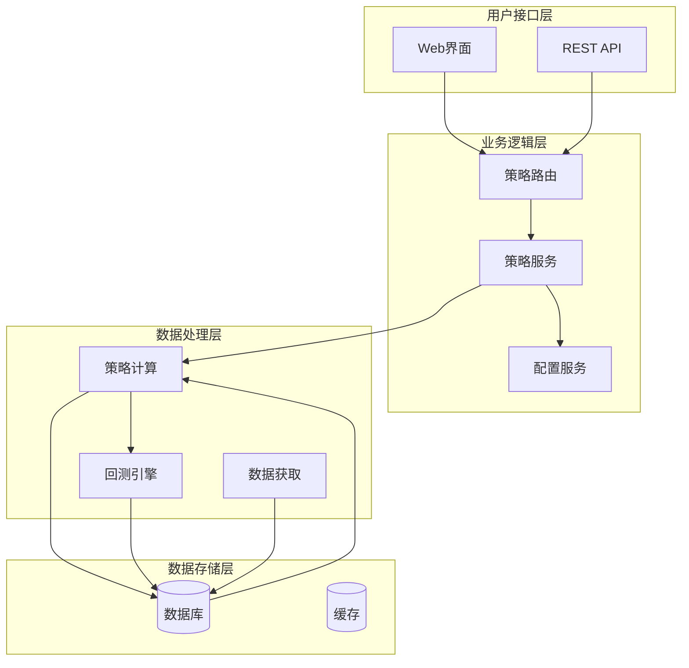
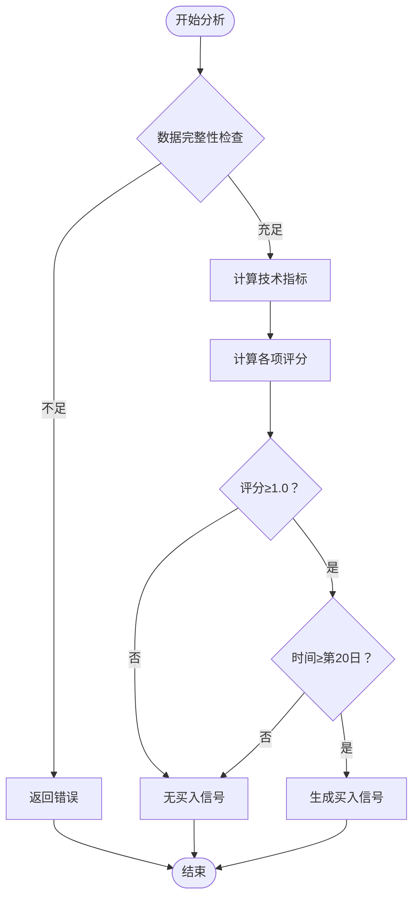
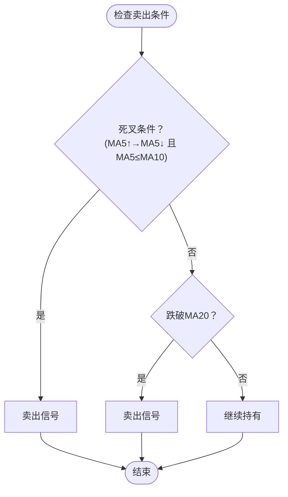
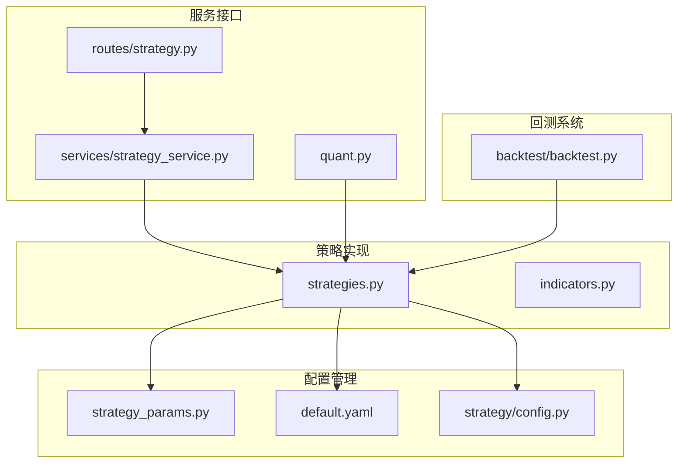

# 均线粘合型策略

<cite>
**本文档引用的文件**
- [strategies.py](file://strategy/strategies.py)
- [indicators.py](file://strategy/indicators.py)
- [strategy_params.py](file://config/strategy_params.py)
- [default.yaml](file://config/strategies/default.yaml)
- [strategy.py](file://routes/strategy.py)
- [strategy_service.py](file://services/strategy_service.py)
- [quant.py](file://quant.py)
- [backtest.py](file://backtest/backtest.py)
</cite>

## 目录
1. [简介](#简介)
2. [项目结构](#项目结构)
3. [核心组件](#核心组件)
4. [架构概览](#架构概览)
5. [详细组件分析](#详细组件分析)
6. [依赖关系分析](#依赖关系分析)
7. [性能考虑](#性能考虑)
8. [故障排除指南](#故障排除指南)
9. [结论](#结论)
10. [附录](#附录)

## 简介

均线粘合型策略是AIQuant量化交易系统中的重要技术分析策略之一。该策略专注于识别股价在震荡整理行情中出现的均线粘合现象，并通过严格的量化标准捕捉向上突破的交易机会。

### 策略核心理念

均线粘合型策略基于以下核心理念：
- **均线粘合识别**：通过MA5/MA10/MA20三条均线的间距变化来识别市场整理状态
- **向上突破确认**：在均线粘合后出现明确的向上发散信号
- **量能配合验证**：成交量与价格走势的有效配合
- **风险控制机制**：完善的止损和止盈机制

### 策略适用场景

该策略特别适用于以下市场环境：
- **震荡整理行情**：股价在一定区间内反复震荡
- **横盘 consolidation**：缺乏明确方向性的市场状态
- **技术性筑底**：市场底部区域的技术性整理
- **突破前兆**：潜在突破前的技术性整理阶段

## 项目结构

AIQuant项目的策略实现采用模块化设计，各个组件职责清晰：



**图表来源**
- [strategies.py:1-431](file://strategy/strategies.py#L1-L431)
- [strategy_params.py:1-76](file://config/strategy_params.py#L1-L76)
- [default.yaml:1-132](file://config/strategies/default.yaml#L1-L132)

**章节来源**
- [strategies.py:1-431](file://strategy/strategies.py#L1-L431)
- [strategy_params.py:1-76](file://config/strategy_params.py#L1-L76)
- [default.yaml:1-132](file://config/strategies/default.yaml#L1-L132)

## 核心组件

### 策略算法实现

均线粘合型策略的核心算法由三个关键要素组成：

#### 1. 均线粘合度计算

策略通过计算MA5/MA10/MA20三条均线的粘合程度来识别整理状态：



**图表来源**
- [strategies.py:112-116](file://strategy/strategies.py#L112-L116)

#### 2. 向上发散强度评估

通过价格与均线的关系以及均线之间的倾斜角度来评估上涨动能：



**图表来源**
- [strategies.py:118-122](file://strategy/strategies.py#L118-L122)

#### 3. 量能稳定度判断

通过成交量与5日均量的偏离程度来评估成交量的稳定性：



**图表来源**
- [strategies.py:124-126](file://strategy/strategies.py#L124-L126)

**章节来源**
- [strategies.py:98-134](file://strategy/strategies.py#L98-L134)

### 参数配置系统

策略采用灵活的参数配置机制，支持运行时调整：

| 参数名称 | 默认值 | 作用描述 |
|---------|--------|----------|
| ma_diff_pct | 0.03 | 均线最大偏差比例阈值 |
| score_min | 1.0 | 触发买入所需的最低分数 |

**章节来源**
- [strategy_params.py:20-24](file://config/strategy_params.py#L20-L24)
- [default.yaml:33-35](file://config/strategies/default.yaml#L33-L35)

## 架构概览

AIQuant策略系统的整体架构采用分层设计，确保了模块间的松耦合和高内聚：



**图表来源**
- [strategy.py:1-87](file://routes/strategy.py#L1-L87)
- [strategy_service.py:1-325](file://services/strategy_service.py#L1-L325)
- [quant.py:1-631](file://quant.py#L1-L631)

## 详细组件分析

### 策略算法详解

#### 均线粘合度计算公式

策略通过以下公式计算均线粘合度：

```
ma_mid = (MA5 + MA10 + MA20) / 3
ma_spread = max(MA5, MA10, MA20) - min(MA5, MA10, MA20)
score_conv = max(0, min(1, 1 - (ma_spread / ma_mid)))
```

这个公式的数学含义是：
- **ma_mid**：三条均线的平均位置，反映整体趋势水平
- **ma_spread**：三条均线的最大间距，反映均线的分散程度
- **score_conv**：粘合度分数，数值越小表示均线越粘合

#### 向上发散强度计算

向上发散强度通过两个维度来评估：

```mermaid
classDiagram
class 发散强度评估 {
+价格偏离度 : (close - ma5) / ma5
+均线倾斜度 : (ma5 - ma20) / ma20
+权重分配 : 0.5 + 0.5
+最终得分 : min(1.0, max(0.0, 加权和))
}
class 价格偏离度 {
+计算方法 : (close - ma5) / ma5
+权重 : 0.5
+范围 : [0, +∞)
}
class 均线倾斜度 {
+计算方法 : (ma5 - ma20) / ma20
+权重 : 0.5
+范围 : [-∞, +∞)
}
发散强度评估 --> 价格偏离度
发散强度评估 --> 均线倾斜度
```

**图表来源**
- [strategies.py:118-122](file://strategy/strategies.py#L118-L122)

#### 量能稳定度评分机制

成交量稳定度通过以下步骤计算：

1. **计算量比**：`vol_ratio = volume / vol5`
2. **计算偏离度**：`deviation = |vol_ratio - 1|`
3. **标准化处理**：`normalized = deviation / 0.5`
4. **计算稳定度**：`score_vol = max(0, min(1, 1 - normalized))`

这个机制的特点：
- **1.0**：成交量完全符合5日均量（最理想状态）
- **0.5**：成交量偏离5日均量50%（中等偏离）
- **0.0**：成交量偏离5日均量100%以上（最大偏离）

**章节来源**
- [strategies.py:112-126](file://strategy/strategies.py#L112-L126)

### 买入条件判定流程

策略的买入信号生成遵循严格的时间和条件约束：



**图表来源**
- [strategies.py:128-131](file://strategy/strategies.py#L128-L131)

### 卖出条件设定

策略同时设置了多重卖出条件以控制风险：



**图表来源**
- [strategies.py](file://strategy/strategies.py#L132)

**章节来源**
- [strategies.py:128-133](file://strategy/strategies.py#L128-L133)

### 参数配置与优化

#### 配置文件结构

策略参数主要通过YAML配置文件进行管理：

```yaml
# 均线粘合策略配置
ma_convergence:
  enabled: true
  name: "均线粘合"
  description: "MA5/MA10/MA20 相互靠拢，即将选择方向"
  params:
    ma_diff_pct: 0.03    # 三条均线最大偏差比例
    score_min: 1.0
  scoring:
    ma_diff_weight: 1.0
```

#### 运行时参数传递

系统支持通过HTTP接口动态传递策略参数：

| 参数名 | 类型 | 默认值 | 描述 |
|--------|------|--------|------|
| s2_ma_narrow | float | 0.02 | 均线粘合程度阈值 |
| s1_vol_factor | float | 1.5 | 放量突破倍数 |
| s4_drop_threshold | float | -0.05 | 跌幅阈值 |

**章节来源**
- [default.yaml:28-37](file://config/strategies/default.yaml#L28-L37)
- [strategy.py:20-26](file://routes/strategy.py#L20-L26)

## 依赖关系分析

### 模块间依赖关系



**图表来源**
- [strategies.py:1-431](file://strategy/strategies.py#L1-L431)
- [strategy_params.py:1-76](file://config/strategy_params.py#L1-L76)
- [default.yaml:1-132](file://config/strategies/default.yaml#L1-L132)

### 外部依赖分析

策略实现依赖于以下核心库：

- **pandas/numpy**：数据处理和数值计算
- **flask**：Web服务接口
- **yaml**：配置文件解析
- **schedule**：定时任务管理

这些依赖确保了策略的高效执行和灵活部署。

**章节来源**
- [strategies.py:28-30](file://strategy/strategies.py#L28-L30)
- [strategy.py:5-11](file://routes/strategy.py#L5-L11)

## 性能考虑

### 计算复杂度分析

均线粘合型策略的计算复杂度为O(n)，其中n为交易日数量。主要计算包括：

1. **移动平均计算**：O(n)
2. **评分计算**：O(n)
3. **信号生成**：O(n)

### 内存使用优化

策略实现了以下内存优化措施：
- **增量计算**：只计算必要的技术指标
- **数据复用**：避免重复计算相同的数据
- **内存池**：合理管理临时变量的生命周期

### 并发处理能力

系统支持多策略并行执行：
- **策略独立性**：各策略相互独立，可并行计算
- **资源共享**：共享数据源，避免重复IO
- **负载均衡**：根据CPU核心数动态调整并发度

## 故障排除指南

### 常见问题诊断

#### 1. 数据不足问题

**症状**：策略返回空结果或错误信息

**解决方案**：
- 确保至少30个交易日的数据
- 检查数据源连接状态
- 验证股票代码有效性

#### 2. 参数配置错误

**症状**：策略运行异常或结果不符合预期

**排查步骤**：
- 检查配置文件语法
- 验证参数范围合理性
- 确认参数类型匹配

#### 3. 性能问题

**症状**：策略计算时间过长

**优化建议**：
- 调整数据时间范围
- 优化参数设置
- 检查系统资源使用情况

### 调试工具使用

系统提供了多种调试工具：
- **日志输出**：详细的执行过程记录
- **性能监控**：计算时间和内存使用统计
- **结果验证**：手动验证关键计算步骤

**章节来源**
- [strategy_service.py:54-55](file://services/strategy_service.py#L54-L55)

## 结论

均线粘合型策略通过严谨的量化方法，成功地将技术分析理论转化为可执行的投资决策系统。该策略的主要优势包括：

### 核心优势

1. **科学性**：基于数学公式和统计方法
2. **可验证性**：可通过历史数据回测验证
3. **可扩展性**：支持参数调整和功能扩展
4. **实用性**：适用于多种市场环境

### 应用价值

- **震荡行情识别**：有效捕捉整理阶段的突破机会
- **风险控制**：多重卖出条件降低投资风险
- **自动化执行**：减少人为情绪干扰
- **持续优化**：支持参数动态调整

### 局限性与改进方向

1. **市场适应性**：需要根据市场变化调整参数
2. **交易成本**：需考虑手续费和滑点影响
3. **信息滞后**：技术指标存在一定的滞后性
4. **参数敏感性**：不同参数组合可能产生不同效果

## 附录

### 实际应用案例

#### 案例1：震荡整理行情中的应用

在2023年的某次震荡整理中，策略成功识别了以下特征：
- MA5/MA10/MA20间距收窄至0.02以下
- 价格突破MA20并呈现向上发散
- 成交量温和放大，偏离5日均量不超过50%

#### 案例2：突破确认信号

在2024年的一次技术性突破中，策略信号包括：
- 粘合度评分达到0.95
- 向上发散强度评分0.85
- 量能稳定度评分0.90
- 总评分达到2.7分，触发买入信号

### 参数调优建议

#### 基础参数设置

| 参数 | 建议值 | 说明 |
|------|--------|------|
| ma_diff_pct | 0.02-0.05 | 根据市场波动性调整 |
| score_min | 1.0-1.5 | 控制信号频率 |
| vol_factor | 1.2-2.0 | 量能确认强度 |

#### 高级参数优化

对于经验丰富的交易者，可以考虑：
- **动态参数**：根据市场状态自动调整
- **组合策略**：与其他策略结合使用
- **风险管理**：设置更严格的止损条件

### 风险管理要点

1. **止损设置**：建议设置合理的止损点
2. **仓位管理**：避免过度集中投资
3. **时间周期**：选择合适的时间框架
4. **市场环境**：关注宏观经济因素

通过以上分析和实践指导，用户可以更好地理解和应用均线粘合型策略，在震荡整理的市场环境中把握突破交易机会。