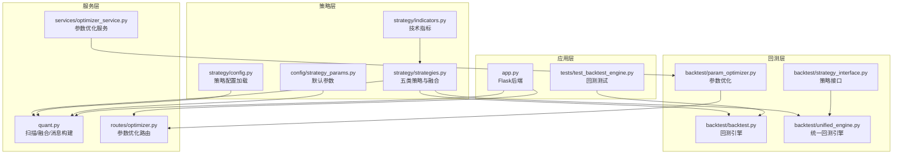
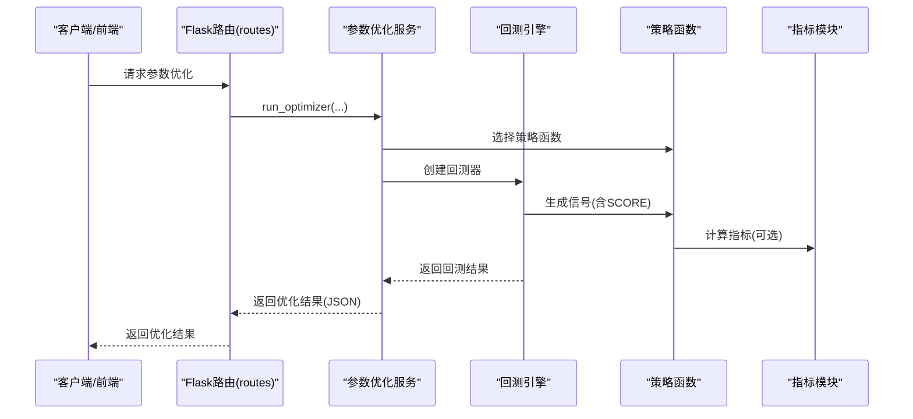
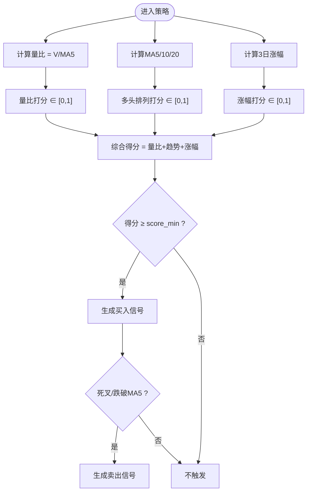
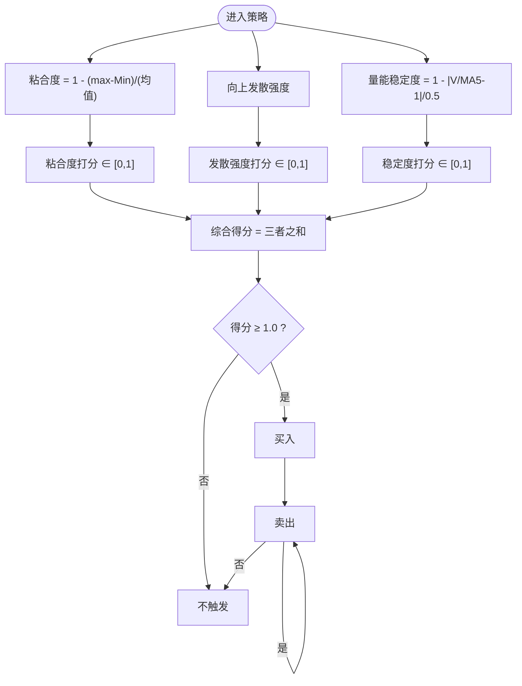
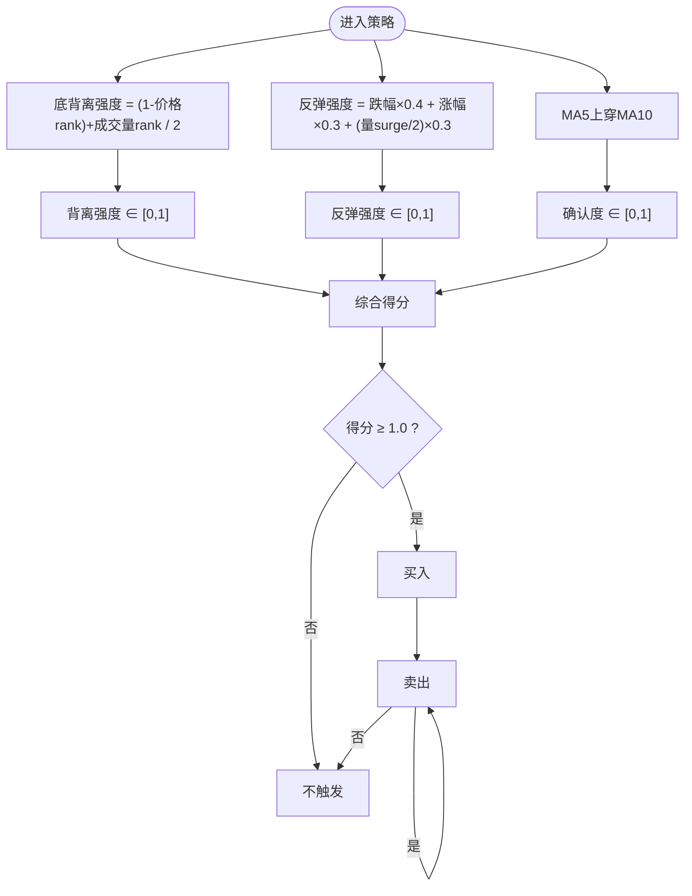
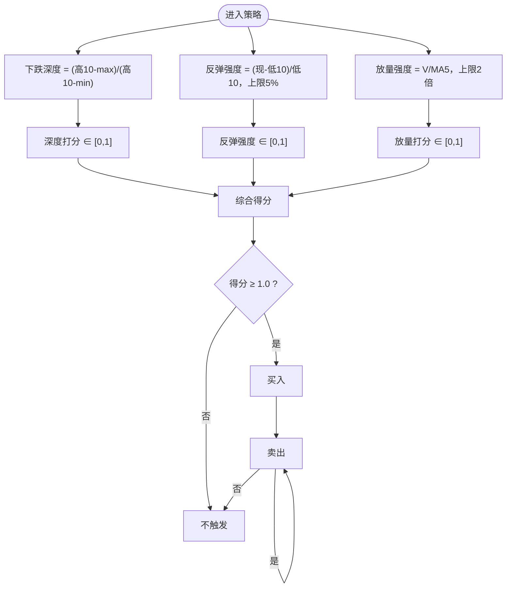
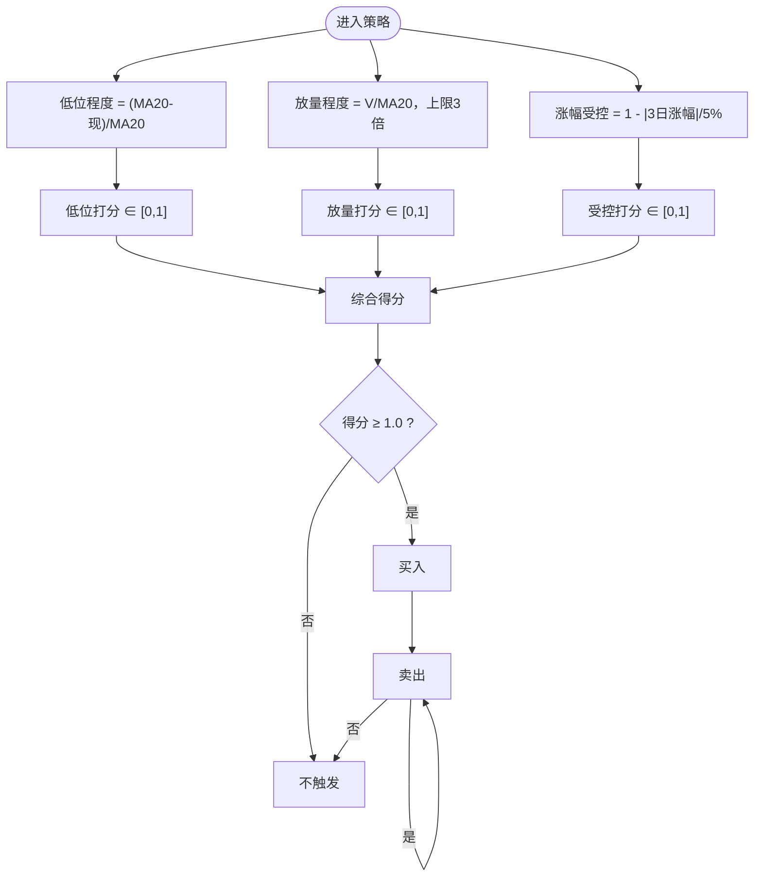
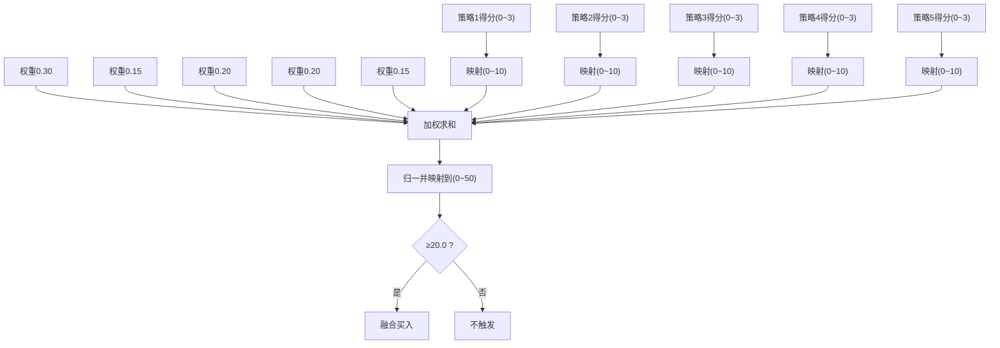
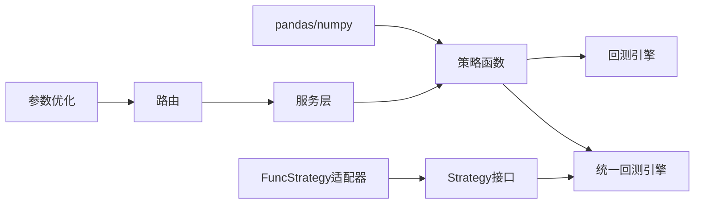

# 多策略量化分析

<cite>
**本文引用的文件**
- [strategy/strategies.py](file://strategy/strategies.py)
- [strategy/indicators.py](file://strategy/indicators.py)
- [strategy/config.py](file://strategy/config.py)
- [config/strategy_params.py](file://config/strategy_params.py)
- [quant.py](file://quant.py)
- [backtest/backtest.py](file://backtest/backtest.py)
- [backtest/unified_engine.py](file://backtest/unified_engine.py)
- [backtest/strategy_interface.py](file://backtest/strategy_interface.py)
- [backtest/param_optimizer.py](file://backtest/param_optimizer.py)
- [routes/optimizer.py](file://routes/optimizer.py)
- [services/optimizer_service.py](file://services/optimizer_service.py)
- [tests/test_backtest_engine.py](file://tests/test_backtest_engine.py)
- [app.py](file://app.py)
</cite>

## 目录
1. [简介](#简介)
2. [项目结构](#项目结构)
3. [核心组件](#核心组件)
4. [架构总览](#架构总览)
5. [详细组件分析](#详细组件分析)
6. [依赖关系分析](#依赖关系分析)
7. [性能考量](#性能考量)
8. [故障排查指南](#故障排查指南)
9. [结论](#结论)
10. [附录](#附录)

## 简介
本文件面向AIQuant多策略量化分析系统，围绕五类A股量化策略（放量突破型、均线粘合型、量价背离型、抄底型、主力建仓型）进行深入解析，涵盖信号生成机制、技术指标、交易逻辑、参数配置、策略融合与权重设计、参数调优与性能评估方法，并提供可落地的使用场景与实践建议。读者可据此理解策略工作原理与实际应用价值。

## 项目结构
系统采用模块化分层设计：
- 策略层：策略函数与指标计算
- 回测层：统一回测引擎与参数优化
- 服务层：策略扫描、信号生成与持久化
- 路由与应用：REST API与Web界面
- 配置层：策略参数与融合权重的集中管理

**图表来源**
- [strategy/strategies.py:1-431](file://strategy/strategies.py#L1-L431)
- [strategy/indicators.py:1-244](file://strategy/indicators.py#L1-L244)
- [strategy/config.py:1-132](file://strategy/config.py#L1-L132)
- [config/strategy_params.py:1-76](file://config/strategy_params.py#L1-L76)
- [quant.py:1-631](file://quant.py#L1-L631)
- [backtest/backtest.py:1-517](file://backtest/backtest.py#L1-L517)
- [backtest/unified_engine.py:1-143](file://backtest/unified_engine.py#L1-L143)
- [backtest/strategy_interface.py:1-86](file://backtest/strategy_interface.py#L1-L86)
- [backtest/param_optimizer.py:250-368](file://backtest/param_optimizer.py#L250-L368)
- [routes/optimizer.py:1-47](file://routes/optimizer.py#L1-L47)
- [services/optimizer_service.py:1-32](file://services/optimizer_service.py#L1-L32)
- [app.py:1-164](file://app.py#L1-L164)
- [tests/test_backtest_engine.py:1-130](file://tests/test_backtest_engine.py#L1-L130)

**章节来源**
- [strategy/strategies.py:1-431](file://strategy/strategies.py#L1-L431)
- [quant.py:1-631](file://quant.py#L1-L631)
- [backtest/backtest.py:1-517](file://backtest/backtest.py#L1-L517)
- [backtest/unified_engine.py:1-143](file://backtest/unified_engine.py#L1-L143)
- [backtest/strategy_interface.py:1-86](file://backtest/strategy_interface.py#L1-L86)
- [backtest/param_optimizer.py:250-368](file://backtest/param_optimizer.py#L250-L368)
- [routes/optimizer.py:1-47](file://routes/optimizer.py#L1-L47)
- [services/optimizer_service.py:1-32](file://services/optimizer_service.py#L1-L32)
- [app.py:1-164](file://app.py#L1-L164)
- [tests/test_backtest_engine.py:1-130](file://tests/test_backtest_engine.py#L1-L130)

## 核心组件
- 五类策略函数：统一返回BUY_SIGNAL/SELL_SIGNAL/BUY_SCORE/STRATEGY等列，便于回测与融合
- 指标模块：提供MA/EMA/MACD/RSI/KDJ/布林带/ATR/OBV/VWAP/CCI/DMI/量比等指标
- 策略配置：支持YAML热加载，集中管理策略开关、参数与融合权重
- 回测引擎：支持T+1执行、手续费/印花税/滑点、止损止盈、动态仓位、大盘择时、回撤熔断
- 参数优化：网格/遗传/行走验证等方法，支持路由与服务封装
- 扫描与融合：按阈值筛选、融合分映射、消息构建与面板回填

**章节来源**
- [strategy/strategies.py:17-431](file://strategy/strategies.py#L17-L431)
- [strategy/indicators.py:1-244](file://strategy/indicators.py#L1-L244)
- [strategy/config.py:1-132](file://strategy/config.py#L1-L132)
- [config/strategy_params.py:1-76](file://config/strategy_params.py#L1-L76)
- [backtest/backtest.py:56-494](file://backtest/backtest.py#L56-L494)
- [backtest/param_optimizer.py:250-368](file://backtest/param_optimizer.py#L250-L368)
- [quant.py:26-143](file://quant.py#L26-L143)

## 架构总览
系统通过策略函数生成信号，经回测引擎评估，结合参数优化持续迭代，最终由服务层进行扫描与消息推送，前端通过Flask路由访问。

**图表来源**
- [routes/optimizer.py:11-47](file://routes/optimizer.py#L11-L47)
- [services/optimizer_service.py:9-32](file://services/optimizer_service.py#L9-L32)
- [backtest/backtest.py:56-494](file://backtest/backtest.py#L56-L494)
- [strategy/strategies.py:36-91](file://strategy/strategies.py#L36-L91)
- [strategy/indicators.py:192-236](file://strategy/indicators.py#L192-L236)

## 详细组件分析

### 放量突破型策略
- 信号生成机制
  - 量比打分：当日量/5日均量，映射至0~1
  - 多头排列打分：基于MA5/10/20相对位置与斜率
  - 3日涨幅打分：(close/3日前-close)/close/3日前，映射至0~1
  - 综合得分：三者相加，满分为3分；触发阈值score_min（默认≥1.0）
  - 卖出条件：MA5死叉MA10或跌破MA5
- 关键参数
  - vol_factor：放量倍数
  - rise_3d：3日涨幅最小值
  - score_min：触发所需最少条件数
- 适用场景
  - 趋势初显、量价配合、短期强势突破

**图表来源**
- [strategy/strategies.py:36-91](file://strategy/strategies.py#L36-L91)

**章节来源**
- [strategy/strategies.py:36-91](file://strategy/strategies.py#L36-L91)
- [config/strategy_params.py:13-18](file://config/strategy_params.py#L13-L18)

### 均线粘合型策略
- 信号生成机制
  - 粘合度打分：MA5/10/20区间宽度/均值，越小越粘合
  - 向上发散强度：价格与MA5关系 + MA5与MA20斜率
  - 量能稳定度：当日量/5日均量接近1为佳
  - 综合得分≥1.0触发买入；卖出为MA5死叉MA10或跌破MA20
- 关键参数
  - ma_narrow：均线差值占比阈值（在配置中体现）
- 适用场景
  - 整理末期向上突破、震荡转强

**图表来源**
- [strategy/strategies.py:98-134](file://strategy/strategies.py#L98-L134)

**章节来源**
- [strategy/strategies.py:98-134](file://strategy/strategies.py#L98-L134)
- [config/strategy_params.py:20-24](file://config/strategy_params.py#L20-L24)

### 量价背离型策略
- 信号生成机制
  - 底背离强度：价格相对20日低点越低、成交量相对20日低点越高，得分越高
  - 反弹强度：前3日跌幅与当日涨幅加权，量能 surge 调整
  - 趋势逆转确认：MA5上穿MA10
  - 综合得分≥1.0触发买入；卖出为跌破MA5×0.95
- 适用场景
  - 超卖反转、量价背离修复

**图表来源**
- [strategy/strategies.py:141-178](file://strategy/strategies.py#L141-L178)

**章节来源**
- [strategy/strategies.py:141-178](file://strategy/strategies.py#L141-L178)

### 抄底型策略
- 信号生成机制
  - 下跌深度：前期10日高点与10日低点落差，越深得分越高
  - 反弹强度：当前价格相对10日低点的涨幅，5%满分
  - 放量强度：量比，2倍量满分
  - 综合得分≥1.0触发买入；卖出为跌破MA5或量比<0.5
- 关键参数
  - drop_threshold：下跌阈值（在配置中体现）
- 适用场景
  - 连续调整后的温和反弹、均值回归

**图表来源**
- [strategy/strategies.py:185-217](file://strategy/strategies.py#L185-L217)

**章节来源**
- [strategy/strategies.py:185-217](file://strategy/strategies.py#L185-L217)
- [config/strategy_params.py:32-37](file://config/strategy_params.py#L32-L37)

### 主力建仓型策略
- 信号生成机制
  - 低位程度：(MA20-现)/MA20，越低得分越高
  - 放量程度：V/20日均量，3倍量满分
  - 涨幅受控：3日涨幅越小越好，5%涨幅满分
  - 综合得分≥1.0触发买入；卖出为现>MA20×1.1
- 关键参数
  - vol_ratio：放量倍数（在策略中体现）
- 适用场景
  - 低位异动、温和放量、机构行为观察

**图表来源**
- [strategy/strategies.py:224-255](file://strategy/strategies.py#L224-L255)

**章节来源**
- [strategy/strategies.py:224-255](file://strategy/strategies.py#L224-L255)
- [config/strategy_params.py:39-43](file://config/strategy_params.py#L39-L43)

### 策略融合与权重分配
- 融合思路
  - 将各策略原始得分(0~3)映射到(0~10)，按权重加权求和，再映射到(0~50)
  - 默认权重：放量突破(0.30)、均线粘合(0.15)、量价背离(0.20)、抄底(0.20)、主力建仓(0.15)
  - 融合阈值：≥20.0触发买入
- 适用场景
  - 多信号共振、降低单一策略过拟合风险

**图表来源**
- [strategy/strategies.py:368-429](file://strategy/strategies.py#L368-L429)
- [quant.py:108-109](file://quant.py#L108-L109)

**章节来源**
- [strategy/strategies.py:258-271](file://strategy/strategies.py#L258-L271)
- [strategy/strategies.py:368-429](file://strategy/strategies.py#L368-L429)
- [quant.py:48-49](file://quant.py#L48-L49)

### 技术指标模块
- 提供趋势、震荡、波动、成交量等指标，支持一次性计算并拼接至行情数据
- 常用指标：MA/EMA/MACD/RSI/KDJ/布林带/ATR/OBV/VWAP/CCI/DMI/量比
- 用途：策略前置特征工程、回测辅助风控

**章节来源**
- [strategy/indicators.py:13-236](file://strategy/indicators.py#L13-L236)

### 策略配置与参数
- 策略配置
  - 支持YAML热加载，集中管理策略开关、参数与融合权重
  - 提供获取策略配置、参数、融合权重、回测/交易参数的方法
- 默认参数
  - 各策略默认参数集中于strategy_params.py，便于快速替换与实验

**章节来源**
- [strategy/config.py:20-128](file://strategy/config.py#L20-L128)
- [config/strategy_params.py:6-75](file://config/strategy_params.py#L6-L75)

### 回测引擎与统一回测
- 回测引擎特性
  - T+1执行、手续费/印花税/滑点、止损止盈、最大持仓天数
  - 回撤熔断、大盘择时、动态仓位（基于ATR）
  - 交易明细、资金曲线、绩效指标（年化收益、最大回撤、夏普比率、胜率、盈亏比等）
- 统一回测引擎
  - 策略插件化接口，接收Strategy实例列表
  - 逐步替代历史重复逻辑，形成统一资金曲线与风控框架

**章节来源**
- [backtest/backtest.py:56-494](file://backtest/backtest.py#L56-L494)
- [backtest/unified_engine.py:59-143](file://backtest/unified_engine.py#L59-L143)
- [backtest/strategy_interface.py:23-86](file://backtest/strategy_interface.py#L23-L86)

### 参数优化与性能评估
- 优化方法
  - 网格搜索、遗传算法、行走验证（Walk-Forward）
  - 支持按指标（如夏普比率）选择最优参数组合
- 路由与服务
  - 路由层：/api/optimizer/run、/api/optimizer/walkforward
  - 服务层：封装数据获取与策略函数选择，返回优化结果

**章节来源**
- [backtest/param_optimizer.py:250-368](file://backtest/param_optimizer.py#L250-L368)
- [routes/optimizer.py:11-47](file://routes/optimizer.py#L11-L47)
- [services/optimizer_service.py:9-32](file://services/optimizer_service.py#L9-L32)

### 扫描与消息构建（策略融合）
- 全市场扫描
  - 读取数据库股票列表，逐只运行策略，按阈值筛选Top-N
  - 支持v4超跌反弹策略与5策略融合两种模式
- 历史回填
  - 将融合分≥阈值的历史日期写入stock_signal表，用于面板对比
- 消息构建
  - 根据策略阈值与参数，生成微信/面板消息，包含买卖金额、止损止盈等

**章节来源**
- [quant.py:289-546](file://quant.py#L289-L546)
- [quant.py:344-430](file://quant.py#L344-L430)

## 依赖关系分析
- 策略函数依赖pandas/numpy进行向量化计算
- 回测引擎依赖策略返回的BUY_SIGNAL/SELL_SIGNAL/SCORE列
- 统一回测引擎依赖Strategy接口，通过FuncStrategy适配既有函数式策略
- 参数优化通过路由与服务层解耦，便于扩展

**图表来源**
- [strategy/strategies.py:28-30](file://strategy/strategies.py#L28-L30)
- [backtest/backtest.py:121-131](file://backtest/backtest.py#L121-L131)
- [backtest/unified_engine.py:108-132](file://backtest/unified_engine.py#L108-L132)
- [backtest/strategy_interface.py:62-86](file://backtest/strategy_interface.py#L62-L86)
- [routes/optimizer.py:11-28](file://routes/optimizer.py#L11-L28)
- [services/optimizer_service.py:9-32](file://services/optimizer_service.py#L9-L32)

**章节来源**
- [strategy/strategies.py:28-30](file://strategy/strategies.py#L28-L30)
- [backtest/backtest.py:121-131](file://backtest/backtest.py#L121-L131)
- [backtest/unified_engine.py:108-132](file://backtest/unified_engine.py#L108-L132)
- [backtest/strategy_interface.py:62-86](file://backtest/strategy_interface.py#L62-L86)
- [routes/optimizer.py:11-28](file://routes/optimizer.py#L11-L28)
- [services/optimizer_service.py:9-32](file://services/optimizer_service.py#L9-L32)

## 性能考量
- 计算复杂度
  - 策略函数主要为滚动窗口与向量化运算，时间复杂度O(N)，空间复杂度O(N)
  - 指标模块按需计算，避免重复计算
- 回测效率
  - T+1延迟执行减少未来数据泄露风险
  - 动态仓位与熔断机制提升鲁棒性
- 参数优化
  - Walk-Forward可有效避免过拟合，提高泛化能力

[本节为一般性指导，不直接分析具体文件]

## 故障排查指南
- T+1执行验证
  - 买入信号日不应成交，次日开盘价成交；滑点应用于开盘价
- 资金曲线连续性
  - 持仓日若无行情数据，应使用最近可用收盘价延续估值
- 手续费与税费
  - 买入+卖出双向手续费，卖出单向印花税
- 统一回测引擎框架
  - FuncStrategy适配器可将既有函数包装为Strategy接口，确保SCORE列存在

**章节来源**
- [tests/test_backtest_engine.py:19-127](file://tests/test_backtest_engine.py#L19-L127)
- [backtest/backtest.py:190-383](file://backtest/backtest.py#L190-L383)
- [backtest/unified_engine.py:108-132](file://backtest/unified_engine.py#L108-L132)
- [backtest/strategy_interface.py:62-86](file://backtest/strategy_interface.py#L62-L86)

## 结论
本系统以“函数式策略+统一回测+参数优化”为核心，提供了可扩展、可验证、可落地的A股多策略量化框架。五类策略覆盖趋势、反转、均值回归与机构行为观察，融合机制与参数体系支持持续迭代。通过指标模块与配置中心，系统具备良好的可维护性与可移植性。

[本节为总结性内容，不直接分析具体文件]

## 附录
- 使用场景建议
  - 放量突破：趋势初显、短期强势突破
  - 均线粘合：整理末期向上突破
  - 量价背离：超卖反转、量价修复
  - 抄底：连续调整后的温和反弹
  - 主力建仓：低位异动、温和放量
- 参数调优流程
  - 选择策略与数据区间 → 设定参数网格 → 选择优化方法（网格/遗传/Walk-Forward） → 评估指标（夏普/回撤/胜率） → 保存最优参数
- 性能评估方法
  - 年化收益、最大回撤、夏普比率、胜率、盈亏比、平均持仓天数、基准收益与Alpha

[本节为一般性指导，不直接分析具体文件]