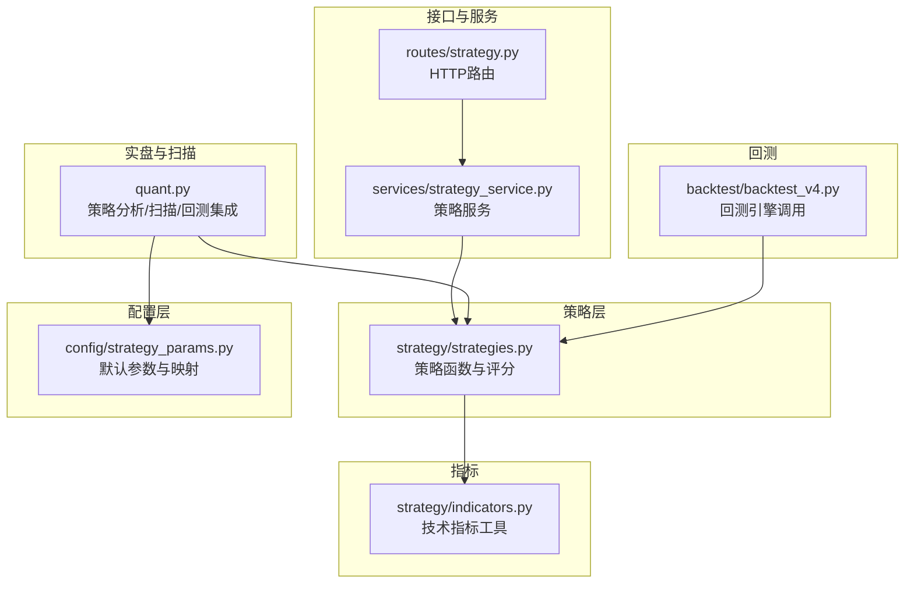
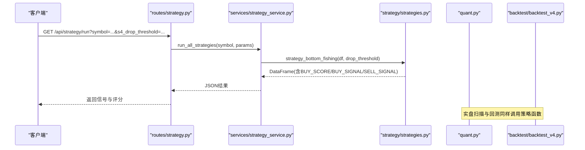
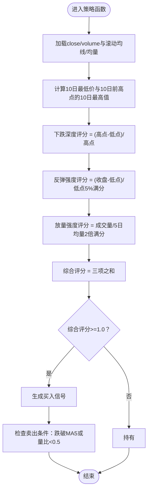
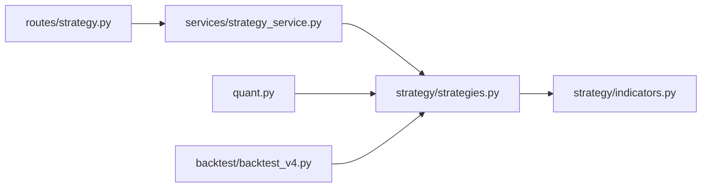

# 抄底型策略

<cite>
**本文档引用的文件**
- [strategy/strategies.py](file://strategy/strategies.py)
- [config/strategy_params.py](file://config/strategy_params.py)
- [routes/strategy.py](file://routes/strategy.py)
- [services/strategy_service.py](file://services/strategy_service.py)
- [quant.py](file://quant.py)
- [backtest/backtest_v4.py](file://backtest/backtest_v4.py)
- [strategy/indicators.py](file://strategy/indicators.py)
</cite>

## 目录
1. [简介](#简介)
2. [项目结构](#项目结构)
3. [核心组件](#核心组件)
4. [架构概览](#架构概览)
5. [详细组件分析](#详细组件分析)
6. [依赖关系分析](#依赖关系分析)
7. [性能考虑](#性能考虑)
8. [故障排查指南](#故障排查指南)
9. [结论](#结论)
10. [附录](#附录)

## 简介
本文件面向AIQuant平台的“抄底型策略”，系统性阐述其识别连续下跌后的放量反弹机制，包括：
- 下跌深度评分：10日内最高价与最低值差距、相对跌幅的量化计算方法
- 反弹强度评估：价格相对底部的回升幅度、3日跌幅与当日涨幅的综合评分
- 放量强度判断：成交量相对于5日均量的倍数关系
- 策略适用条件：前期大幅下跌（drop_threshold参数）、底部放量反弹确认、技术指标配合
- 参数配置指南与实盘应用建议，帮助用户在合适的市场环境下识别抄底机会并控制风险

## 项目结构
围绕“抄底型策略”的关键文件与职责如下：
- 策略实现：strategy/strategies.py 提供策略函数与评分体系
- 参数配置：config/strategy_params.py 提供默认参数与参数映射
- 接口与服务：routes/strategy.py、services/strategy_service.py 提供HTTP接口与业务服务
- 实盘与扫描：quant.py 提供策略分析、扫描与回测集成
- 回测引擎：backtest/backtest_v4.py 展示策略在回测中的调用与信号生成
- 技术指标：strategy/indicators.py 提供通用技术指标工具

图表来源
- [strategy/strategies.py:185-217](file://strategy/strategies.py#L185-L217)
- [config/strategy_params.py:32-37](file://config/strategy_params.py#L32-L37)
- [routes/strategy.py:14-32](file://routes/strategy.py#L14-L32)
- [services/strategy_service.py:46-107](file://services/strategy_service.py#L46-L107)
- [quant.py:26-35](file://quant.py#L26-L35)
- [backtest/backtest_v4.py:285-293](file://backtest/backtest_v4.py#L285-L293)
- [strategy/indicators.py:13-236](file://strategy/indicators.py#L13-L236)

章节来源
- [strategy/strategies.py:1-431](file://strategy/strategies.py#L1-L431)
- [config/strategy_params.py:1-76](file://config/strategy_params.py#L1-L76)
- [routes/strategy.py:1-87](file://routes/strategy.py#L1-L87)
- [services/strategy_service.py:1-325](file://services/strategy_service.py#L1-L325)
- [quant.py:1-631](file://quant.py#L1-L631)
- [backtest/backtest_v4.py:270-320](file://backtest/backtest_v4.py#L270-L320)
- [strategy/indicators.py:1-244](file://strategy/indicators.py#L1-L244)

## 核心组件
- 抄底型策略函数：strategy_bottom_fishing(df, drop_threshold)
  - 输入：OHLCV数据框，参数drop_threshold（默认-0.05）
  - 输出：包含BUY_SIGNAL、BUY_SCORE、SELL_SIGNAL、STRATEGY列的数据框
- 评分体系（每项0~1，满分为3）：
  - 下跌深度评分：基于10日滚动极值差与前期高点的相对跌幅
  - 反弹强度评分：当前价格相对10日底部的回升幅度
  - 放量强度评分：当日成交量相对5日均量的倍数
- 卖出信号：收盘价跌破5日均线或成交量跌破5日均量的一半

章节来源
- [strategy/strategies.py:185-217](file://strategy/strategies.py#L185-L217)

## 架构概览
抄底型策略在系统中的位置与交互如下：
- HTTP路由接收参数，调用策略服务
- 策略服务加载历史数据，运行策略函数，生成信号
- 实盘扫描与回测集成通过quant.py统一调度
- 技术指标工具为策略提供基础计算支持

图表来源
- [routes/strategy.py:14-32](file://routes/strategy.py#L14-L32)
- [services/strategy_service.py:46-107](file://services/strategy_service.py#L46-L107)
- [strategy/strategies.py:185-217](file://strategy/strategies.py#L185-L217)
- [quant.py:71-142](file://quant.py#L71-L142)
- [backtest/backtest_v4.py:285-293](file://backtest/backtest_v4.py#L285-L293)

## 详细组件分析

### 抄底型策略算法详解
- 输入输出约定
  - 输入：DataFrame，至少包含close、volume列
  - 输出：DataFrame，新增BUY_SCORE、BUY_SIGNAL、SELL_SIGNAL、STRATEGY
- 关键步骤
  - 计算5日均线与5日均量
  - 计算10日最低价与10日前高点的10日最高值
  - 下跌深度评分：(10日前高点 - 10日最低)/10日前高点，映射至0~1
  - 反弹强度评分：(当日收盘 - 10日最低)/10日最低，映射至0~1（5%反弹满分）
  - 放量强度评分：当日成交量/5日均量，映射至0~1（2倍量满分）
  - 综合评分：三项之和，>=1.0视为买入信号
  - 卖出信号：收盘价跌破5日均线或成交量跌破5日均量的一半

图表来源
- [strategy/strategies.py:193-216](file://strategy/strategies.py#L193-L216)

章节来源
- [strategy/strategies.py:185-217](file://strategy/strategies.py#L185-L217)

### 参数配置与接口集成
- HTTP路由参数
  - s4_drop_threshold：传递给strategy_bottom_fishing的drop_threshold
- 策略服务
  - run_all_strategies会调用strategy_bottom_fishing，并返回各策略的信号与融合结果
- 参数映射
  - config/strategy_params.py提供策略默认参数，但抄底型策略在HTTP路由中通过请求参数直接传入

章节来源
- [routes/strategy.py:20-27](file://routes/strategy.py#L20-L27)
- [services/strategy_service.py:46-107](file://services/strategy_service.py#L46-L107)
- [config/strategy_params.py:32-37](file://config/strategy_params.py#L32-L37)

### 实盘扫描与回测集成
- 实盘扫描
  - quant.py的analyze_stock_from_db会运行5个策略（含抄底），并进行加权融合
- 回测引擎
  - backtest_v4.py在计算信号时调用strategy_oversold_rebound（超跌反弹），但抄底型策略同样可被回测引擎使用

章节来源
- [quant.py:71-142](file://quant.py#L71-L142)
- [backtest/backtest_v4.py:285-293](file://backtest/backtest_v4.py#L285-L293)

### 技术指标工具
- strategy/indicators.py提供常用技术指标，如MA、RSI、MACD等
- 抄底型策略主要依赖滚动均值与均量，未直接使用该模块中的指标函数

章节来源
- [strategy/indicators.py:13-236](file://strategy/indicators.py#L13-L236)

## 依赖关系分析
- 策略函数依赖
  - pandas/numpy进行滚动计算与向量化操作
  - 策略函数之间相互独立，无交叉依赖
- 服务与路由依赖
  - routes依赖services，services依赖strategy与quant
- 回测与扫描依赖
  - 回测引擎与扫描任务均依赖策略函数与数据源

图表来源
- [routes/strategy.py:8-11](file://routes/strategy.py#L8-L11)
- [services/strategy_service.py:14-21](file://services/strategy_service.py#L14-L21)
- [quant.py:26-35](file://quant.py#L26-L35)
- [backtest/backtest_v4.py:285-293](file://backtest/backtest_v4.py#L285-L293)
- [strategy/indicators.py:13-18](file://strategy/indicators.py#L13-L18)

章节来源
- [routes/strategy.py:1-87](file://routes/strategy.py#L1-L87)
- [services/strategy_service.py:1-325](file://services/strategy_service.py#L1-L325)
- [strategy/strategies.py:1-431](file://strategy/strategies.py#L1-L431)
- [quant.py:1-631](file://quant.py#L1-L631)
- [backtest/backtest_v4.py:1-624](file://backtest/backtest_v4.py#L1-L624)
- [strategy/indicators.py:1-244](file://strategy/indicators.py#L1-L244)

## 性能考虑
- 向量化计算：策略使用pandas滚动函数与向量化运算，适合大规模回测
- 时间复杂度：O(n)，其中n为交易日数量
- 内存占用：主要为滚动窗口产生的中间列，通常可接受
- 并发扫描：服务层支持批量扫描与SSE流式输出，便于实时展示

## 故障排查指南
- 信号缺失
  - 检查输入数据长度是否小于策略所需的滚动窗口（如10日、5日）
  - 确认close、volume列存在且非空
- 参数不当
  - drop_threshold过大可能导致难以触发买入信号
  - 若成交量数据异常，可能影响放量强度评分
- 接口问题
  - 确认HTTP路由参数正确传递至策略服务
  - 查看服务层异常捕获与错误返回

章节来源
- [services/strategy_service.py:54-55](file://services/strategy_service.py#L54-L55)
- [routes/strategy.py:17-18](file://routes/strategy.py#L17-L18)

## 结论
抄底型策略通过“下跌深度+反弹强度+放量强度”的三因子评分，在连续下跌后的底部放量反弹中提供明确的买入信号。结合实盘扫描与回测集成，可在合适的市场环境下识别抄底机会并控制风险。建议根据市场环境调整参数，并结合其他技术指标与风控规则使用。

## 附录

### 参数配置指南
- HTTP路由参数
  - s4_drop_threshold：传递给strategy_bottom_fishing的drop_threshold（默认-0.05）
- 策略函数参数
  - drop_threshold：前期大幅下跌阈值（负值表示跌幅）
- 默认参数映射
  - config/strategy_params.py提供策略默认参数字典，但抄底型策略在HTTP路由中通过请求参数覆盖

章节来源
- [routes/strategy.py:20-27](file://routes/strategy.py#L20-L27)
- [config/strategy_params.py:32-37](file://config/strategy_params.py#L32-L37)

### 实盘应用建议
- 适用条件
  - 前期大幅下跌（由drop_threshold控制）
  - 底部出现放量反弹（成交量相对5日均量显著放大）
  - 技术指标配合（如均线多头排列、RSI处于超卖区间等）
- 风险控制
  - 设置卖出信号：跌破5日均线或成交量持续萎缩
  - 结合止损与止盈规则，控制单笔与总体回撤
- 参数优化
  - 可通过参数扫描与回测对比不同drop_threshold与评分阈值的效果

章节来源
- [strategy/strategies.py:185-217](file://strategy/strategies.py#L185-L217)
- [quant.py:43-51](file://quant.py#L43-L51)
- [backtest/backtest_v4.py:592-602](file://backtest/backtest_v4.py#L592-L602)