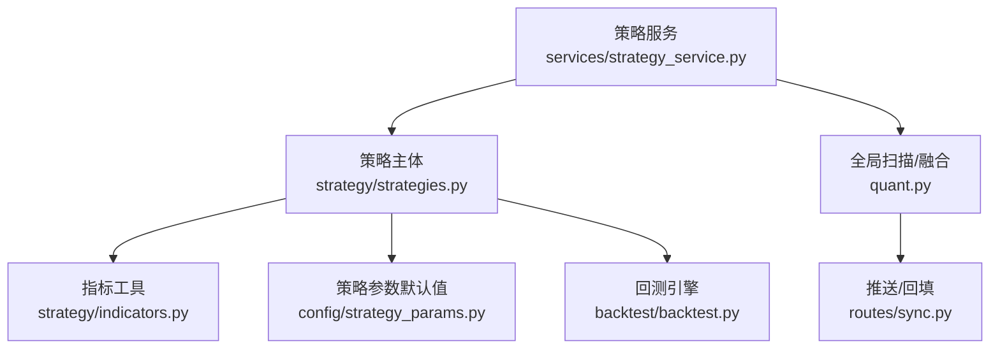
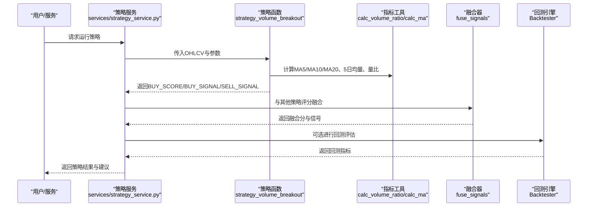
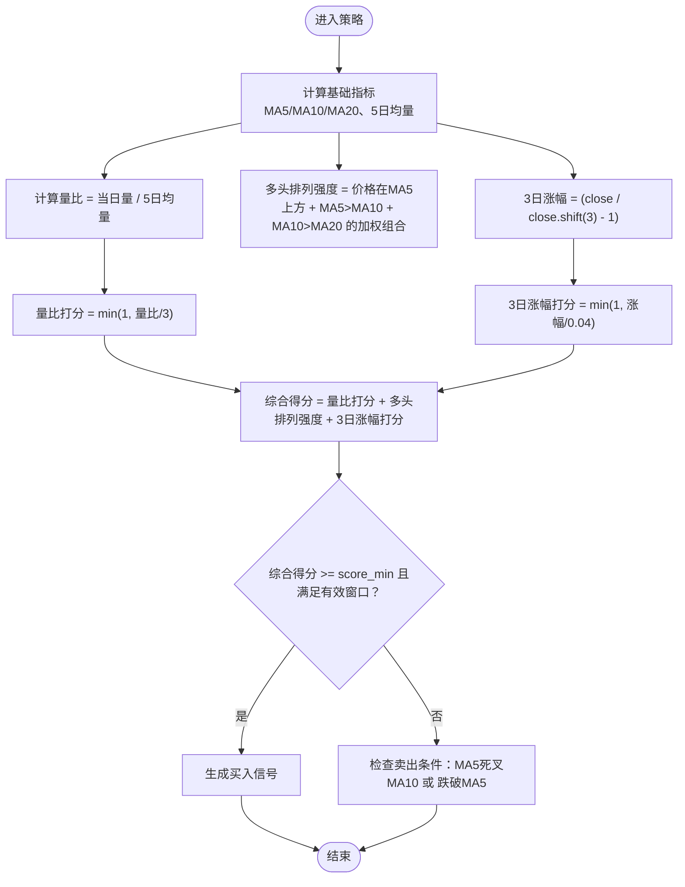
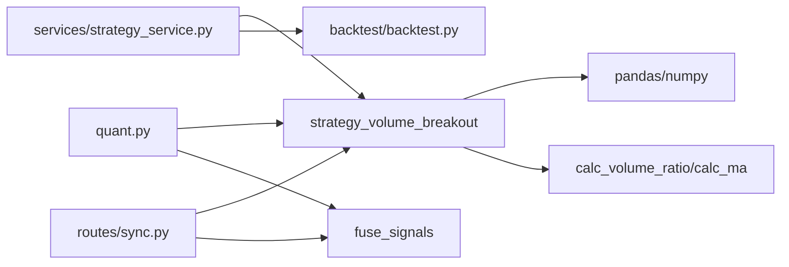

# 放量突破型策略

<cite>
**本文引用的文件**
- [strategy/strategies.py](file://strategy/strategies.py)
- [strategy/indicators.py](file://strategy/indicators.py)
- [config/strategy_params.py](file://config/strategy_params.py)
- [services/strategy_service.py](file://services/strategy_service.py)
- [quant.py](file://quant.py)
- [routes/sync.py](file://routes/sync.py)
- [backtest/backtest.py](file://backtest/backtest.py)
</cite>

## 目录
1. [简介](#简介)
2. [项目结构](#项目结构)
3. [核心组件](#核心组件)
4. [架构总览](#架构总览)
5. [详细组件分析](#详细组件分析)
6. [依赖关系分析](#依赖关系分析)
7. [性能考量](#性能考量)
8. [故障排查指南](#故障排查指南)
9. [结论](#结论)
10. [附录](#附录)

## 简介
本文件面向A股市场的“放量突破型”策略，系统化阐述其技术组合逻辑与实现细节：放量（量比）、多头排列（均线多头强度）、3日涨幅评分三者协同的连续打分机制，并给出参数配置（vol_factor、rise_3d、score_min）的作用机制与调优建议。同时，结合项目中的指标计算、信号生成与回测集成，帮助用户理解该策略在实际交易中的适用场景与执行流程。

## 项目结构
围绕“放量突破型”策略的关键文件与职责如下：
- 策略主体与信号生成：strategy/strategies.py
- 技术指标工具：strategy/indicators.py
- 策略参数默认值：config/strategy_params.py
- 策略服务与批量筛选：services/strategy_service.py
- 全局扫描与融合：quant.py
- 推送与回填：routes/sync.py
- 回测引擎：backtest/backtest.py

图表来源
- [strategy/strategies.py:36-91](file://strategy/strategies.py#L36-L91)
- [strategy/indicators.py:182-189](file://strategy/indicators.py#L182-L189)
- [config/strategy_params.py:14-18](file://config/strategy_params.py#L14-L18)
- [services/strategy_service.py:46-107](file://services/strategy_service.py#L46-L107)
- [quant.py:89-109](file://quant.py#L89-L109)
- [routes/sync.py:60-69](file://routes/sync.py#L60-L69)
- [backtest/backtest.py:121-200](file://backtest/backtest.py#L121-L200)

章节来源
- [strategy/strategies.py:1-14](file://strategy/strategies.py#L1-L14)
- [strategy/indicators.py:1-244](file://strategy/indicators.py#L1-L244)
- [config/strategy_params.py:1-76](file://config/strategy_params.py#L1-L76)
- [services/strategy_service.py:1-325](file://services/strategy_service.py#L1-L325)
- [quant.py:1-631](file://quant.py#L1-L631)
- [routes/sync.py:1-140](file://routes/sync.py#L1-L140)
- [backtest/backtest.py:1-200](file://backtest/backtest.py#L1-L200)

## 核心组件
- 放量突破策略函数：strategy_volume_breakout
- 均线与量比指标工具：calc_volume_ratio、calc_ma
- 策略参数默认值：VOLUME_BREAKOUT
- 策略服务封装：run_all_strategies
- 全局扫描与融合：analyze_stock_from_db、fuse_signals
- 推送与回填：scan_job、_backfill_stock_signal_progress
- 回测引擎：Backtester

章节来源
- [strategy/strategies.py:36-91](file://strategy/strategies.py#L36-L91)
- [strategy/indicators.py:182-189](file://strategy/indicators.py#L182-L189)
- [config/strategy_params.py:14-18](file://config/strategy_params.py#L14-L18)
- [services/strategy_service.py:46-107](file://services/strategy_service.py#L46-L107)
- [quant.py:89-109](file://quant.py#L89-L109)
- [routes/sync.py:60-69](file://routes/sync.py#L60-L69)
- [backtest/backtest.py:121-200](file://backtest/backtest.py#L121-L200)

## 架构总览
放量突破型策略在系统中的位置与交互如下：

图表来源
- [services/strategy_service.py:46-107](file://services/strategy_service.py#L46-L107)
- [strategy/strategies.py:36-91](file://strategy/strategies.py#L36-L91)
- [strategy/indicators.py:182-189](file://strategy/indicators.py#L182-L189)
- [quant.py:89-109](file://quant.py#L89-L109)
- [backtest/backtest.py:121-200](file://backtest/backtest.py#L121-L200)

## 详细组件分析

### 放量突破型策略：核心原理与信号生成
- 技术组合逻辑
  - 放量：当日成交量与5日均量的比值（量比），衡量放量强度。
  - 多头排列：MA5、MA10、MA20的相对位置与斜率，反映趋势多头强度。
  - 3日涨幅：过去3日累计涨跌幅，衡量短期动能。
- 连续打分机制
  - 量比打分：0~1分，上限对应3倍量比。
  - 多头排列强度：0~1分，综合价格在均线上方与均线向上倾斜程度。
  - 3日涨幅打分：0~1分，上限对应4%涨幅。
  - 综合得分：三者相加，满分为3分。
- 买入信号判定
  - 当综合得分达到阈值（score_min，默认2分）且满足有效数据窗口（至少前20日）时，视为买入信号。
  - 卖出信号：MA5死叉MA10或价格跌破MA5。

图表来源
- [strategy/strategies.py:58-91](file://strategy/strategies.py#L58-L91)

章节来源
- [strategy/strategies.py:36-91](file://strategy/strategies.py#L36-L91)

### 技术指标计算过程
- 均线计算
  - MA5、MA10、MA20：使用滚动均值计算。
- 成交量均值与量比
  - 5日均量：volume.rolling(5).mean()
  - 量比：volume / 5日均量（即当日量 / 5日均量）
- 量比公式与阈值
  - 量比 > 1 表示放量；项目中将3倍量比作为上限映射为1分，1.5倍量比映射为0.5分。

章节来源
- [strategy/strategies.py:58-67](file://strategy/strategies.py#L58-L67)
- [strategy/indicators.py:182-189](file://strategy/indicators.py#L182-L189)

### 参数配置与作用机制
- vol_factor（放量倍数）
  - 用于量比上限映射的分母基准，影响量比打分的饱和度。数值越大，对放量的容忍度越高。
- rise_3d（3日涨幅阈值）
  - 用于3日涨幅打分的上限映射，决定涨幅评分的饱和点。数值越大，对短期涨幅的容忍度越高。
- score_min（触发分数）
  - 综合得分的最低阈值，决定买入信号的严格程度。数值越高，信号越稀有。

章节来源
- [strategy/strategies.py:36-53](file://strategy/strategies.py#L36-L53)
- [config/strategy_params.py:14-18](file://config/strategy_params.py#L14-L18)

### 信号生成算法详解
- 连续打分
  - 量比打分：量比 ≤ 3 时按比例映射，超过3按1分计。
  - 多头排列强度：价格在MA5上方、MA5>MA10、MA10>MA20分别赋予权重并裁剪至0~1。
  - 3日涨幅打分：涨幅 ≤ 4% 时按比例映射，超过4%按1分计。
- 最终买入信号
  - 综合得分 ≥ score_min 且索引满足有效窗口（至少前20日）。
- 卖出信号
  - MA5由上穿MA10转为下穿MA10（死叉）或价格跌破MA5。

章节来源
- [strategy/strategies.py:63-91](file://strategy/strategies.py#L63-L91)

### 代码示例与调用路径
- 在策略服务中运行放量突破策略
  - 调用路径：services/strategy_service.py -> run_all_strategies -> strategy_volume_breakout
  - 示例路径：[services/strategy_service.py:58-60](file://services/strategy_service.py#L58-L60)
- 在全局扫描中使用放量突破策略
  - 调用路径：quant.py -> analyze_stock_from_db -> strategy_volume_breakout
  - 示例路径：[quant.py:90](file://quant.py#L90)
- 在批量扫描中使用放量突破策略
  - 调用路径：routes/sync.py -> strategy_volume_breakout
  - 示例路径：[routes/sync.py:64](file://routes/sync.py#L64)

章节来源
- [services/strategy_service.py:46-107](file://services/strategy_service.py#L46-L107)
- [quant.py:89-109](file://quant.py#L89-L109)
- [routes/sync.py:60-69](file://routes/sync.py#L60-L69)

### 参数调优建议（基于项目默认值与实现）
- vol_factor
  - 项目默认为1.5，表示1.5倍量比对应0.5分。若希望更严格地筛选放量，可适当提高；若希望放宽，可降低。
- rise_3d
  - 项目默认为0.02（2%），对应0.5分。若希望捕捉更强的短期动能，可提高；若希望避免追高，可降低。
- score_min
  - 项目默认为1.0（在连续打分下约等于2/3条件满足）。若追求稳健，可提高至2；若追求高灵敏度，可降低至0.5~1.0之间。

章节来源
- [config/strategy_params.py:14-18](file://config/strategy_params.py#L14-L18)
- [strategy/strategies.py:36-53](file://strategy/strategies.py#L36-L53)

### 与回测与融合的衔接
- 回测引擎
  - 回测输入包含BUY_SIGNAL、SELL_SIGNAL与close/open等列，遵循T+1执行规则。
  - 可直接对放量突破策略的结果进行回测评估。
  - 示例路径：[backtest/backtest.py:121-200](file://backtest/backtest.py#L121-L200)
- 融合策略
  - 放量突破策略的BUY_SCORE经映射后参与多策略融合，形成最终融合分与信号。
  - 示例路径：[quant.py:108-109](file://quant.py#L108-L109)

章节来源
- [backtest/backtest.py:121-200](file://backtest/backtest.py#L121-L200)
- [quant.py:108-109](file://quant.py#L108-L109)

## 依赖关系分析
- 策略函数依赖
  - strategy_volume_breakout 依赖 pandas/numpy 的滚动均值与位移运算。
- 指标工具依赖
  - calc_volume_ratio 依赖 volume 与 rolling 均值。
- 服务层依赖
  - services/strategy_service.py 依赖策略函数与回测引擎。
- 全局扫描依赖
  - quant.py 依赖策略函数与融合器，负责批量扫描与阈值过滤。
- 推送与回填依赖
  - routes/sync.py 依赖策略函数与融合器，负责历史回填与阈值过滤。

图表来源
- [strategy/strategies.py:36-91](file://strategy/strategies.py#L36-L91)
- [strategy/indicators.py:182-189](file://strategy/indicators.py#L182-L189)
- [services/strategy_service.py:46-107](file://services/strategy_service.py#L46-L107)
- [quant.py:89-109](file://quant.py#L89-L109)
- [routes/sync.py:60-69](file://routes/sync.py#L60-L69)
- [backtest/backtest.py:121-200](file://backtest/backtest.py#L121-L200)

章节来源
- [strategy/strategies.py:36-91](file://strategy/strategies.py#L36-L91)
- [strategy/indicators.py:182-189](file://strategy/indicators.py#L182-L189)
- [services/strategy_service.py:46-107](file://services/strategy_service.py#L46-L107)
- [quant.py:89-109](file://quant.py#L89-L109)
- [routes/sync.py:60-69](file://routes/sync.py#L60-L69)
- [backtest/backtest.py:121-200](file://backtest/backtest.py#L121-L200)

## 性能考量
- 计算复杂度
  - 策略函数主要使用滚动均值与位移运算，时间复杂度近似O(n)，空间复杂度O(n)。
- 数据窗口要求
  - 需要至少20日的有效数据窗口以确保均线与3日涨幅计算的稳定性。
- 批量扫描与回测
  - 全局扫描与回测涉及多策略并行，注意内存与IO开销，建议分批处理与缓存中间结果。

## 故障排查指南
- 数据不足
  - 若数据长度小于30条，策略服务会抛出错误提示。请确保数据完整。
  - 参考路径：[services/strategy_service.py:54-55](file://services/strategy_service.py#L54-L55)
- 信号稀疏
  - 若score_min设置过高，可能导致信号稀疏。可适当降低score_min或调整vol_factor/rise_3d。
- 回测结果异常
  - 检查BUY_SIGNAL/SELL_SIGNAL列是否正确生成，以及T+1执行规则是否生效。
  - 参考路径：[backtest/backtest.py:121-200](file://backtest/backtest.py#L121-L200)

章节来源
- [services/strategy_service.py:54-55](file://services/strategy_service.py#L54-L55)
- [backtest/backtest.py:121-200](file://backtest/backtest.py#L121-L200)

## 结论
放量突破型策略通过“放量+多头排列+3日涨幅”的连续打分机制，在A股市场中提供了稳健的趋势捕捉能力。其参数配置灵活，便于根据市场风格进行调优；与回测与融合模块无缝衔接，适合纳入多策略体系中进行综合评估与实盘应用。

## 附录
- 关键实现路径
  - 放量突破策略函数：[strategy/strategies.py:36-91](file://strategy/strategies.py#L36-L91)
  - 量比与均线指标：[strategy/indicators.py:182-189](file://strategy/indicators.py#L182-L189)
  - 策略参数默认值：[config/strategy_params.py:14-18](file://config/strategy_params.py#L14-L18)
  - 策略服务调用示例：[services/strategy_service.py:58-60](file://services/strategy_service.py#L58-L60)
  - 全局扫描与融合：[quant.py:90-109](file://quant.py#L90-L109)
  - 推送与回填：[routes/sync.py:64-69](file://routes/sync.py#L64-L69)
  - 回测引擎：[backtest/backtest.py:121-200](file://backtest/backtest.py#L121-L200)