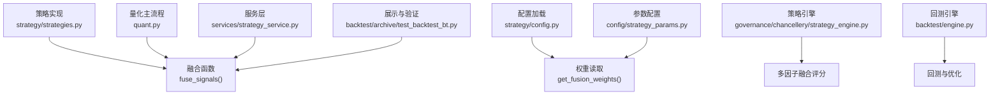
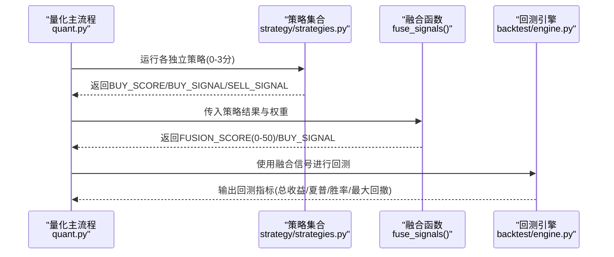
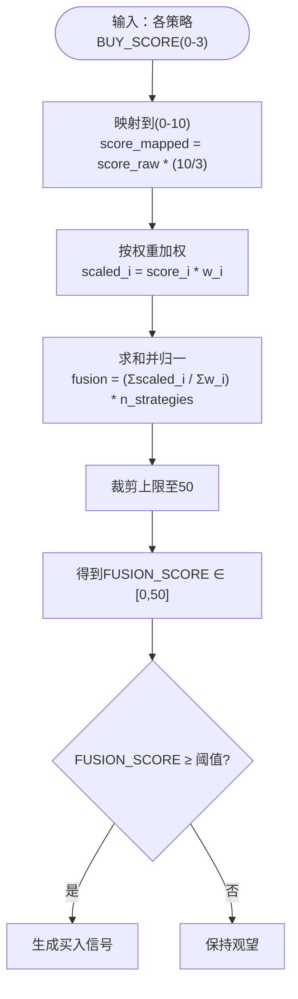
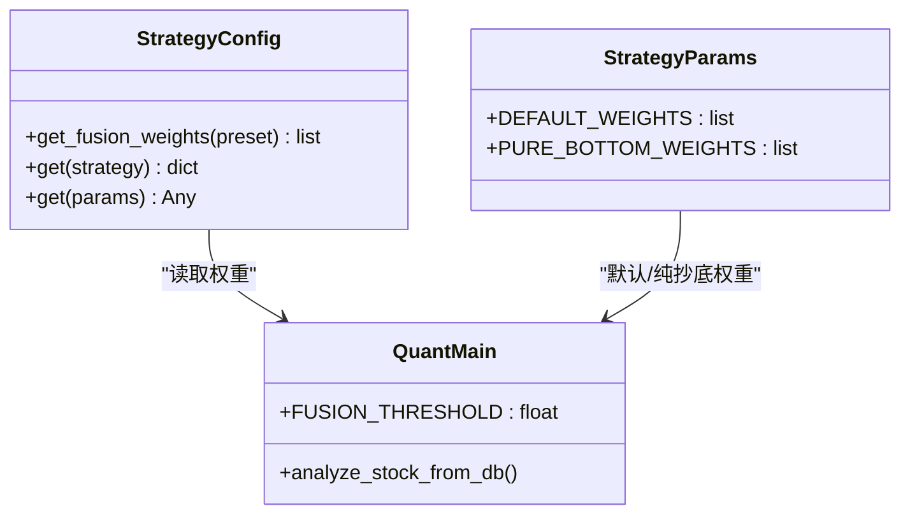
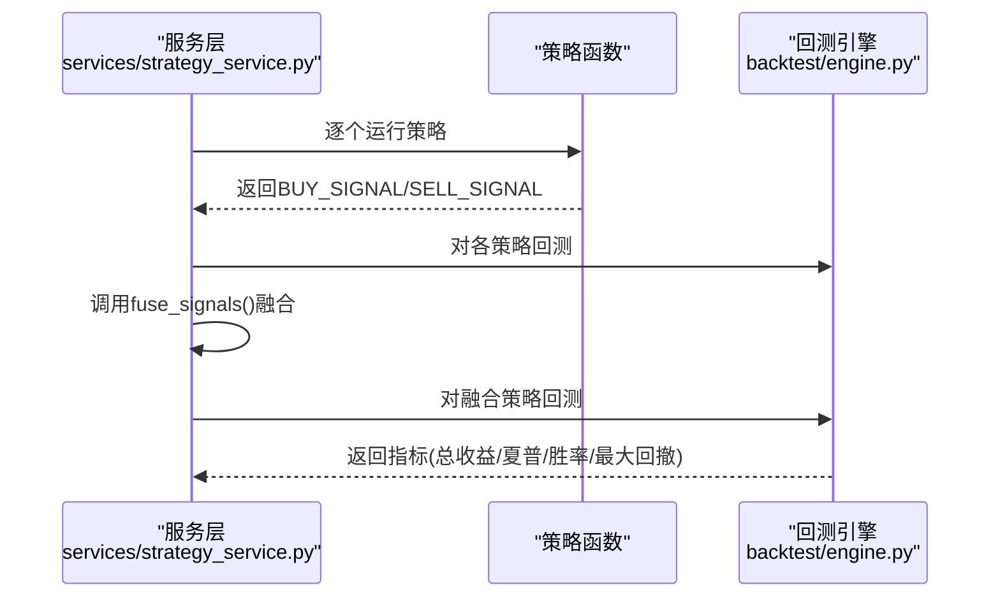
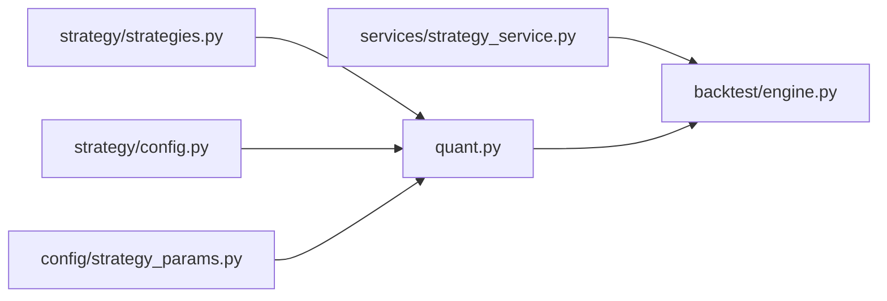

# 策略融合算法

<cite>
**本文引用的文件**   
- [strategies.py](file://strategy/strategies.py)
- [strategy.py](file://strategy/strategy.py)
- [config.py](file://strategy/config.py)
- [strategy_params.py](file://config/strategy_params.py)
- [quant.py](file://quant.py)
- [strategy_engine.py](file://governance/chancellery/strategy_engine.py)
- [scoring_engine.py](file://governance/chancellery/scoring_engine.py)
- [strategy_service.py](file://services/strategy_service.py)
- [engine.py](file://backtest/engine.py)
- [test_backtest_bt.py](file://backtest/archive/test_backtest_bt.py)
</cite>

## 目录
1. [简介](#简介)
2. [项目结构](#项目结构)
3. [核心组件](#核心组件)
4. [架构总览](#架构总览)
5. [详细组件分析](#详细组件分析)
6. [依赖分析](#依赖分析)
7. [性能考虑](#性能考虑)
8. [故障排查指南](#故障排查指南)
9. [结论](#结论)
10. [附录](#附录)

## 简介
本文件系统性阐述AIQuant中的“多策略加权融合”算法，覆盖数学原理、实现机制、评分与信号生成、权重配置策略、优势与适用场景、调优与评估方法。融合算法将多个独立策略的原始评分（0-3分）通过线性加权映射到0-10分，再进一步归一化到0-50的融合分，并以固定阈值触发买入信号。文档同时给出默认等权、基于历史回测的权重优化以及当前推荐的“纯抄底策略”权重配置，帮助用户在不同市场环境下动态调整策略组合。

## 项目结构
围绕策略融合的关键文件与职责如下：
- 策略与融合：strategy/strategies.py 提供五类独立策略与融合函数fuse_signals
- 配置与权重：strategy/config.py、config/strategy_params.py 提供权重与参数加载
- 扫描与集成：quant.py 负责全市场扫描、阈值与仓位管理、回填stock_signal
- 策略引擎：governance/chancellery/strategy_engine.py 提供多因子融合评分（另一套体系）
- 回测与评估：backtest/engine.py 提供回测与参数优化能力
- 展示与服务：services/strategy_service.py 提供策略对比回测与融合回测

**图示来源**
- [strategies.py:368-430](file://strategy/strategies.py#L368-L430)
- [config.py:103-105](file://strategy/config.py#L103-L105)
- [strategy_params.py:7-11](file://config/strategy_params.py#L7-L11)
- [quant.py:89-109](file://quant.py#L89-L109)
- [strategy_engine.py:53-74](file://governance/chancellery/strategy_engine.py#L53-L74)
- [engine.py:72-141](file://backtest/engine.py#L72-L141)
- [strategy_service.py:229-261](file://services/strategy_service.py#L229-L261)
- [test_backtest_bt.py:14-45](file://backtest/archive/test_backtest_bt.py#L14-L45)

**章节来源**
- [strategies.py:1-431](file://strategy/strategies.py#L1-L431)
- [config.py:1-132](file://strategy/config.py#L1-L132)
- [strategy_params.py:1-76](file://config/strategy_params.py#L1-L76)
- [quant.py:1-631](file://quant.py#L1-L631)
- [strategy_engine.py:1-103](file://governance/chancellery/strategy_engine.py#L1-L103)
- [scoring_engine.py:1-370](file://governance/chancellery/scoring_engine.py#L1-L370)
- [strategy_service.py:229-268](file://services/strategy_service.py#L229-L268)
- [engine.py:72-141](file://backtest/engine.py#L72-L141)
- [test_backtest_bt.py:14-45](file://backtest/archive/test_backtest_bt.py#L14-L45)

## 核心组件
- 多策略独立评分：每策略输出BUY_SCORE（0-3），并生成BUY_SIGNAL/SELL_SIGNAL
- 融合评分计算：将各策略BUY_SCORE映射到0-10分，按权重加权求和，再乘以策略数量并裁剪至0-50
- 融合信号生成：FUSION_SCORE ≥ 20（或更高阈值）触发BUY_SIGNAL，保留各策略独立评分列便于回测与展示
- 权重配置：默认等权；支持从配置文件读取；历史回测可驱动权重优化；当前推荐纯抄底权重
- 集成与回测：quant.py负责扫描、阈值与仓位、stock_signal回填；回测引擎提供参数优化与指标提取

**章节来源**
- [strategies.py:368-430](file://strategy/strategies.py#L368-L430)
- [quant.py:48-51](file://quant.py#L48-L51)
- [config.py:103-105](file://strategy/config.py#L103-L105)
- [strategy_params.py:7-11](file://config/strategy_params.py#L7-L11)

## 架构总览
策略融合贯穿“策略计算 → 融合评分 → 信号生成 → 回测评估”的闭环，如下所示：

**图示来源**
- [quant.py:89-109](file://quant.py#L89-L109)
- [strategies.py:368-430](file://strategy/strategies.py#L368-L430)
- [engine.py:79-141](file://backtest/engine.py#L79-L141)

## 详细组件分析

### 数学原理与实现机制
- 原始评分映射：各策略BUY_SCORE ∈ [0,3]，映射到[0,10]：score_mapped = score_raw × (10/3)
- 权重加权求和：对第i个策略，贡献为 score_i_mapped × weight_i
- 归一化与裁剪：融合分 = (Σ贡献 / Σ权重) × 策略数，且上限裁剪至50
- 信号阈值：FUSION_SCORE ≥ 20（quant.py中默认阈值为28，回测验证更严格）

**图示来源**
- [strategies.py:403-421](file://strategy/strategies.py#L403-L421)
- [quant.py:48-51](file://quant.py#L48-L51)

**章节来源**
- [strategies.py:368-430](file://strategy/strategies.py#L368-L430)
- [quant.py:48-51](file://quant.py#L48-L51)

### 融合评分计算细节
- 输入：多个策略DataFrame，每个含BUY_SCORE列
- 输出：包含FUSION_SCORE、BUY_SIGNAL、SELL_SIGNAL，以及各策略独立映射分列（如VOL_SCORE、MA_SCORE等）
- 关键公式与步骤已在“数学原理与实现机制”中给出，具体实现参见fuse_signals函数

**章节来源**
- [strategies.py:368-430](file://strategy/strategies.py#L368-L430)

### 权重配置策略
- 默认等权：每策略权重相等，适合初学者与稳健策略组合
- 基于历史回测的权重优化：通过回测引擎对参数网格进行回测，选择最优指标（如夏普、年化收益、胜率等）对应的权重组合
- 当前推荐权重配置（纯抄底策略）：将主力建仓与放量突破权重设为0，仅保留抄底权重为1，强调均值回归与底部反转

**图示来源**
- [config.py:103-105](file://strategy/config.py#L103-L105)
- [strategy_params.py:7-11](file://config/strategy_params.py#L7-L11)
- [quant.py:48-51](file://quant.py#L48-L51)

**章节来源**
- [config.py:103-105](file://strategy/config.py#L103-L105)
- [strategy_params.py:7-11](file://config/strategy_params.py#L7-L11)
- [quant.py:48-51](file://quant.py#L48-L51)

### 融合信号生成
- 买入信号：FUSION_SCORE ≥ 阈值（默认20，quant.py中为28）
- 卖出信号：当前实现中SELL_SIGNAL固定为False，实际卖出逻辑通常在回测引擎或交易执行模块中处理
- 独立评分列：保留各策略映射分列（如VOL_SCORE、MA_SCORE、DIVERGE_SCORE、BOTTOM_SCORE、WHALE_SCORE、OVERSOLD_SCORE），便于回测与展示

**章节来源**
- [strategies.py:426-429](file://strategy/strategies.py#L426-L429)
- [quant.py:107-114](file://quant.py#L107-L114)

### 策略引擎对比（多因子评分）
governance/chancellery/strategy_engine.py提供另一套“多因子融合评分”，其特点：
- 输入为各因子的0-10分子评分
- 加权融合后映射到0-100的总分
- 与策略融合算法（0-50）属于不同评分尺度，服务于不同场景

该引擎与策略融合算法并行存在，前者面向多因子打分，后者面向多策略信号融合。

**章节来源**
- [strategy_engine.py:53-74](file://governance/chancellery/strategy_engine.py#L53-L74)
- [scoring_engine.py:246-314](file://governance/chancellery/scoring_engine.py#L246-L314)

### 回测与评估
- 回测引擎：提供run_backtest/optimize接口，支持参数网格回测与指标提取
- 服务层对比：services/strategy_service.py对各策略分别回测，并对融合策略统一回测，便于横向比较
- 阈值与风控：quant.py中设定融合阈值、止损止盈、仓位比例等参数，影响回测结果与实盘表现

**图示来源**
- [strategy_service.py:229-261](file://services/strategy_service.py#L229-L261)
- [engine.py:79-141](file://backtest/engine.py#L79-L141)

**章节来源**
- [strategy_service.py:229-261](file://services/strategy_service.py#L229-L261)
- [engine.py:79-141](file://backtest/engine.py#L79-L141)

## 依赖分析
- fuse_signals依赖：各策略DataFrame的BUY_SCORE列；权重列表；策略数量
- quant.py依赖：fuse_signals、策略函数、配置阈值与参数
- 回测依赖：回测引擎、策略信号DataFrame
- 配置依赖：StrategyConfig与StrategyParams提供权重与参数

**图示来源**
- [strategies.py:368-430](file://strategy/strategies.py#L368-L430)
- [quant.py:89-109](file://quant.py#L89-L109)
- [config.py:103-105](file://strategy/config.py#L103-L105)
- [strategy_params.py:7-11](file://config/strategy_params.py#L7-L11)
- [strategy_service.py:229-261](file://services/strategy_service.py#L229-L261)
- [engine.py:79-141](file://backtest/engine.py#L79-L141)

**章节来源**
- [strategies.py:368-430](file://strategy/strategies.py#L368-L430)
- [quant.py:89-109](file://quant.py#L89-L109)
- [config.py:103-105](file://strategy/config.py#L103-L105)
- [strategy_params.py:7-11](file://config/strategy_params.py#L7-L11)
- [strategy_service.py:229-261](file://services/strategy_service.py#L229-L261)
- [engine.py:79-141](file://backtest/engine.py#L79-L141)

## 性能考虑
- 计算复杂度：fuse_signals对每个策略执行一次映射与加权，整体O(N×M)，N为策略数，M为交易日数；在策略数固定情况下为线性复杂度
- 内存占用：保留各策略映射分列与融合分列，列数增加带来额外内存；可通过仅保留必要列优化
- 回测成本：回测引擎对融合策略与各策略分别回测，计算量随策略数线性增长；建议在参数网格较小范围内先行筛选

[本节为通用性能讨论，不直接分析具体文件]

## 故障排查指南
- 融合分异常为0：检查输入策略DataFrame是否包含BUY_SCORE列，以及权重是否为空或全零
- 信号全为False：确认阈值设置（quant.py中默认28，回测验证更严格），或检查回测数据是否包含open列以支持T+1回测
- 回测报错：检查回测引擎参数传递与数据格式，确保DataFrame包含OHLCV与BUY_SIGNAL/SELL_SIGNAL列
- 配置未生效：确认StrategyConfig与StrategyParams文件路径与内容正确，必要时手动reload或重启服务

**章节来源**
- [strategies.py:379-381](file://strategy/strategies.py#L379-L381)
- [quant.py:48-51](file://quant.py#L48-L51)
- [engine.py:79-141](file://backtest/engine.py#L79-L141)
- [config.py:58-72](file://strategy/config.py#L58-L72)

## 结论
多策略加权融合通过将各策略的连续评分（0-3）映射到0-10分并加权求和，形成统一的0-50融合分，结合固定阈值生成买入信号。该方法具备以下优势：
- 降低单一策略风险：多策略共振提升信号稳定性
- 提高信号稳定性：通过阈值与权重抑制噪声
- 增强策略适应性：可按市场环境调整权重，当前推荐纯抄底策略以应对震荡市

建议用户结合回测结果与市场周期动态调整权重，并通过回测引擎进行参数网格优化，以获得更稳健的收益风险特征。

[本节为总结性内容，不直接分析具体文件]

## 附录

### 融合分范围与阈值说明
- 原始评分：0-3分
- 映射范围：0-10分
- 融合范围：0-50分（通过加权与策略数放大）
- 信号阈值：默认20分；quant.py中为28分（经回测验证更稳健）

**章节来源**
- [strategies.py:403-421](file://strategy/strategies.py#L403-L421)
- [quant.py:48-51](file://quant.py#L48-L51)

### 权重配置与推荐
- 默认等权：适用于初学者与稳健组合
- 基于历史回测：通过回测引擎优化权重
- 纯抄底策略：当前推荐权重（抄底权重1，其他为0），强调底部反转与均值回归

**章节来源**
- [config.py:103-105](file://strategy/config.py#L103-L105)
- [strategy_params.py:7-11](file://config/strategy_params.py#L7-L11)
- [quant.py:259-271](file://quant.py#L259-L271)

### 融合信号生成与展示
- 保留各策略独立映射分列（如VOL_SCORE、MA_SCORE、DIVERGE_SCORE、BOTTOM_SCORE、WHALE_SCORE、OVERSOLD_SCORE）
- 用于回测与展示，便于分析各策略对融合分的贡献

**章节来源**
- [strategies.py:394-411](file://strategy/strategies.py#L394-L411)