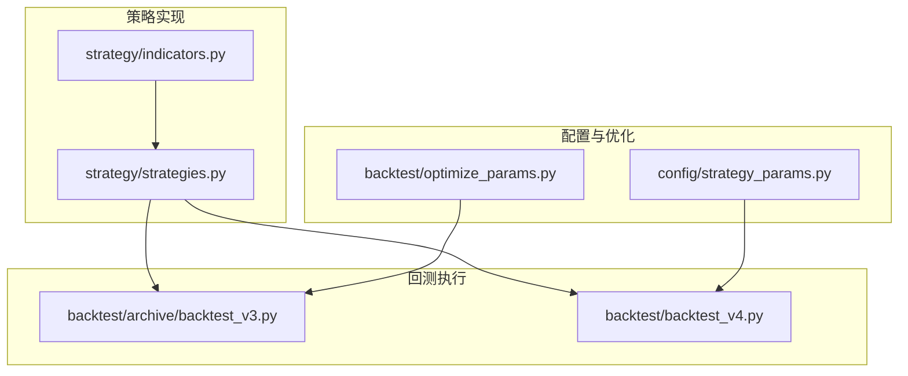
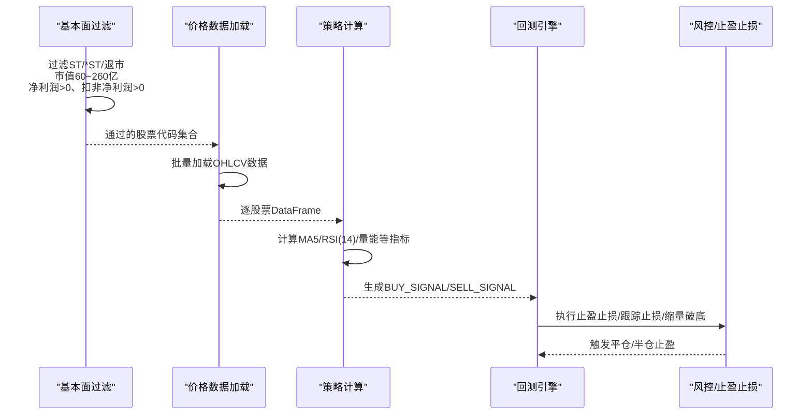
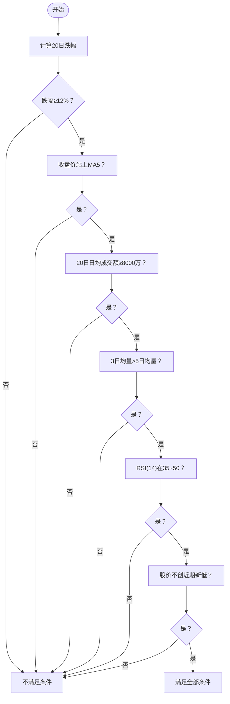
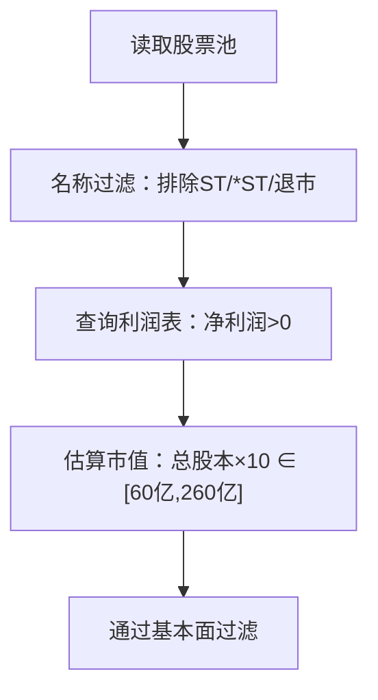
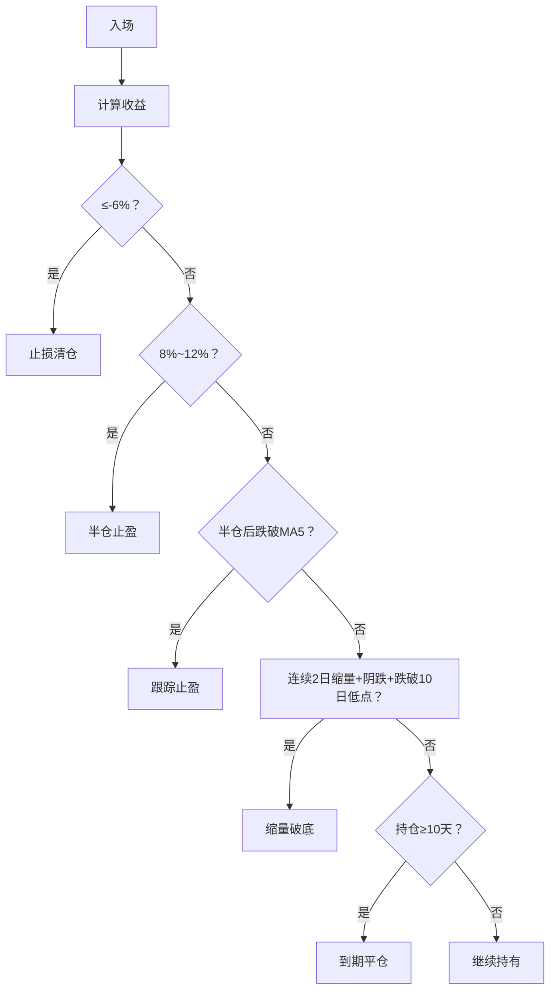
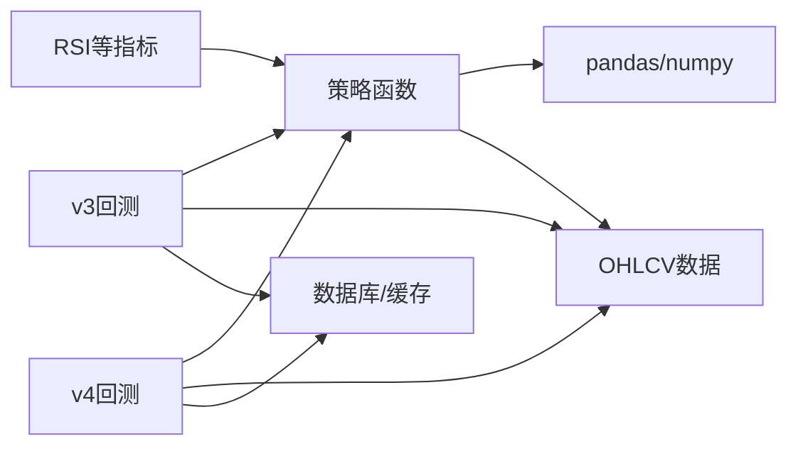

# 超跌反弹策略

<cite>
**本文引用的文件**
- [策略实现 strategies.py](file://strategy/strategies.py)
- [超跌反弹v3回测 backtest_v3.py](file://backtest/archive/backtest_v3.py)
- [超跌反弹v4回测 backtest_v4.py](file://backtest/backtest_v4.py)
- [技术指标 indicators.py](file://strategy/indicators.py)
- [策略参数配置 strategy_params.py](file://config/strategy_params.py)
- [参数优化 optimize_params.py](file://backtest/optimize_params.py)
</cite>

## 目录
1. [简介](#简介)
2. [项目结构](#项目结构)
3. [核心组件](#核心组件)
4. [架构概览](#架构概览)
5. [详细组件分析](#详细组件分析)
6. [依赖分析](#依赖分析)
7. [性能考虑](#性能考虑)
8. [故障排查指南](#故障排查指南)
9. [结论](#结论)
10. [附录](#附录)

## 简介
本文件面向AIQuant平台的“超跌反弹策略”，系统性阐述策略v3的技术实现与基本面过滤机制，并给出参数调优与风险控制建议。策略聚焦中小盘股票，通过六大买入条件识别超跌企稳信号，结合严格的卖出规则与风控机制，力求在震荡与阶段性反弹行情中捕捉确定性机会。

## 项目结构
围绕超跌反弹策略的关键文件组织如下：
- 策略实现层：策略函数与技术指标计算
- 回测执行层：v3与v4两套回测引擎
- 配置与优化：参数配置与网格搜索优化
- 风险控制：回撤熔断、动态仓位、择时等

图表来源
- [策略实现 strategies.py:281-360](file://strategy/strategies.py#L281-L360)
- [超跌反弹v3回测 backtest_v3.py:253-354](file://backtest/archive/backtest_v3.py#L253-L354)
- [超跌反弹v4回测 backtest_v4.py:218-306](file://backtest/backtest_v4.py#L218-L306)
- [技术指标 indicators.py:46-60](file://strategy/indicators.py#L46-L60)
- [策略参数配置 strategy_params.py:45-53](file://config/strategy_params.py#L45-L53)
- [参数优化 optimize_params.py:63-86](file://backtest/optimize_params.py#L63-L86)

章节来源
- [策略实现 strategies.py:1-431](file://strategy/strategies.py#L1-L431)
- [超跌反弹v3回测 backtest_v3.py:1-676](file://backtest/archive/backtest_v3.py#L1-L676)
- [超跌反弹v4回测 backtest_v4.py:1-624](file://backtest/backtest_v4.py#L1-L624)
- [技术指标 indicators.py:1-244](file://strategy/indicators.py#L1-L244)
- [策略参数配置 strategy_params.py:1-76](file://config/strategy_params.py#L1-L76)
- [参数优化 optimize_params.py:1-462](file://backtest/optimize_params.py#L1-L462)

## 核心组件
- 超跌反弹策略v3（技术面+基本面）
  - 技术面六大条件：20日跌幅≥12%、收盘价站上5日均线、近20日日均成交额≥8000万、温和放量（3日均量>5日均量）、RSI(14)在35~50区间、股价不创近期新低（底部平台确认）
  - 基本面过滤：ST/*ST/退市标记排除、总市值60~260亿、净利润与扣非净利润为正
  - 卖出规则：分批止盈、跟踪止损、连续缩量阴跌、最长持有天数限制
- 超跌反弹策略v4（在v3基础上引入择时、动态仓位与跟踪止盈）
- 技术指标：RSI(14)、MA5、成交量均量等
- 参数配置与优化：v4默认参数、参数扫描网格、通用参数优化脚本

章节来源
- [策略实现 strategies.py:281-360](file://strategy/strategies.py#L281-L360)
- [超跌反弹v3回测 backtest_v3.py:1-31](file://backtest/archive/backtest_v3.py#L1-L31)
- [超跌反弹v4回测 backtest_v4.py:21-38](file://backtest/backtest_v4.py#L21-L38)
- [技术指标 indicators.py:46-60](file://strategy/indicators.py#L46-L60)
- [策略参数配置 strategy_params.py:45-53](file://config/strategy_params.py#L45-L53)

## 架构概览
策略从“基本面过滤”开始，筛选符合财务健康与市值范围的股票；随后对候选股票批量计算技术面信号；最后进入回测引擎，依据策略规则生成买卖决策并执行风控与止盈止损。

图表来源
- [超跌反弹v3回测 backtest_v3.py:282-354](file://backtest/archive/backtest_v3.py#L282-L354)
- [超跌反弹v4回测 backtest_v4.py:245-306](file://backtest/backtest_v4.py#L245-L306)
- [策略实现 strategies.py:281-360](file://strategy/strategies.py#L281-L360)

## 详细组件分析

### 技术面六大买入条件
- 20日跌幅≥12%：衡量深度调整幅度，确保超跌基础
- 收盘价站上5日均线：技术确认，短期趋势转强
- 近20日日均成交额≥8000万：资金门槛，避免流动性不足
- 温和放量（3日均量>5日均量）：量价配合，避免放量滞涨
- RSI(14)在35~50区间：超卖修复阶段，避免过热
- 股价不创近期新低（底部平台确认）：确认底部平台，避免假突破

图表来源
- [策略实现 strategies.py:281-360](file://strategy/strategies.py#L281-L360)

章节来源
- [策略实现 strategies.py:281-360](file://strategy/strategies.py#L281-L360)

### 基本面过滤机制
- 排除ST/*ST/退市标记
- 总市值60亿~260亿（以总股本×10估算）
- 净利润>0、扣非净利润>0
- 过滤逻辑通过baostock批量查询并缓存至数据库

图表来源
- [超跌反弹v3回测 backtest_v3.py:119-151](file://backtest/archive/backtest_v3.py#L119-L151)
- [超跌反弹v4回测 backtest_v4.py:84-103](file://backtest/backtest_v4.py#L84-L103)

章节来源
- [超跌反弹v3回测 backtest_v3.py:81-181](file://backtest/archive/backtest_v3.py#L81-L181)
- [超跌反弹v4回测 backtest_v4.py:57-123](file://backtest/backtest_v4.py#L57-L123)

### 卖出规则与风控
- 分批止盈：达到8%~12%涨幅后半仓止盈，剩余部分跟踪MA5
- 跟踪止损：半仓后若价格跌破MA5即清仓
- 连续缩量阴跌：连续2日缩量且阴跌跌破10日低点，强制清仓
- 持仓期限：最短2天（避免日内波动）、最长10天（到期强制平仓）
- v4新增：大盘择时（MA5>MA20时才开仓）、动态仓位（基于信号分与单股上限）

图表来源
- [超跌反弹v3回测 backtest_v3.py:426-481](file://backtest/archive/backtest_v3.py#L426-L481)
- [超跌反弹v4回测 backtest_v4.py:383-425](file://backtest/backtest_v4.py#L383-L425)

章节来源
- [超跌反弹v3回测 backtest_v3.py:20-31](file://backtest/archive/backtest_v3.py#L20-L31)
- [超跌反弹v3回测 backtest_v3.py:426-481](file://backtest/archive/backtest_v3.py#L426-L481)
- [超跌反弹v4回测 backtest_v4.py:340-425](file://backtest/backtest_v4.py#L340-L425)

### 策略实现细节（策略函数）
- 输入：OHLCV数据（至少25日）
- 输出：含BUY_SIGNAL/SELL_SIGNAL/BUY_SCORE/STRATEGY列的DataFrame
- 关键指标：MA5、RSI(14)、3日均量/5日均量、20日日均成交额
- 综合打分：四项指标分别归一化后求和，≥1.8触发买入

章节来源
- [策略实现 strategies.py:281-360](file://strategy/strategies.py#L281-L360)

### 技术指标（RSI）
- RSI(14)用于判断超卖修复区间（35~50）
- 计算采用标准公式：gain与loss滚动均值，RS=Gain/Loss，RSI=100–100/(1+RS)

章节来源
- [技术指标 indicators.py:46-60](file://strategy/indicators.py#L46-L60)
- [策略实现 strategies.py:317-322](file://strategy/strategies.py#L317-L322)

### 回测引擎（v3）
- 基本面过滤后，批量加载OHLCV，计算信号，逐日回测
- 严格风控：止损-6%、分批止盈8%~12%、跟踪止损MA5、缩量破底、最长10天
- 仓位：单股上限18%、同时最多6只、留20%现金

章节来源
- [超跌反弹v3回测 backtest_v3.py:253-634](file://backtest/archive/backtest_v3.py#L253-L634)

### 回测引擎（v4）
- 在v3基础上增加：大盘择时（MA5>MA20）、动态仓位（基于信号分与单股上限）、跟踪止盈（半仓后从最高点回落一定比例）
- 参数扫描：提供多组参数组合对比，便于选择最优策略

章节来源
- [超跌反弹v4回测 backtest_v4.py:218-581](file://backtest/backtest_v4.py#L218-L581)

### 参数配置与优化
- v4默认参数：score_threshold=1.8、stop_loss=-6%、trailing_pct=10%、single_pos_ratio=40%、use_market_timing=True、use_trailing_stop=True
- 参数扫描网格：覆盖不同跟踪止盈幅度、单股上限、是否启用择时等
- 通用参数优化：支持网格搜索与约束条件（最小交易数、最大回撤、夏普比率等）

章节来源
- [策略参数配置 strategy_params.py:45-62](file://config/strategy_params.py#L45-L62)
- [参数优化 optimize_params.py:63-86](file://backtest/optimize_params.py#L63-L86)
- [参数优化 optimize_params.py:120-176](file://backtest/optimize_params.py#L120-L176)

## 依赖分析
- 策略依赖：pandas/numpy、baostock（基本面查询）、数据库连接（股票池与缓存）
- 回测依赖：策略函数、OHLCV数据、风控规则
- 指标依赖：RSI、MA、成交量均量等

图表来源
- [策略实现 strategies.py:28-30](file://strategy/strategies.py#L28-L30)
- [超跌反弹v3回测 backtest_v3.py:39-41](file://backtest/archive/backtest_v3.py#L39-L41)
- [超跌反弹v4回测 backtest_v4.py:16-18](file://backtest/backtest_v4.py#L16-L18)
- [技术指标 indicators.py:9-11](file://strategy/indicators.py#L9-L11)

章节来源
- [策略实现 strategies.py:28-30](file://strategy/strategies.py#L28-L30)
- [超跌反弹v3回测 backtest_v3.py:39-41](file://backtest/archive/backtest_v3.py#L39-L41)
- [超跌反弹v4回测 backtest_v4.py:16-18](file://backtest/backtest_v4.py#L16-L18)
- [技术指标 indicators.py:9-11](file://strategy/indicators.py#L9-L11)

## 性能考虑
- 批量预加载OHLCV，减少IO开销
- 信号计算与回测分离，便于扩展与复用
- v4引入择时与动态仓位，提升在不同市场环境下的适应性
- 参数扫描与网格搜索可并行化，缩短优化时间

## 故障排查指南
- 无价格数据：检查数据源可用性与日期范围
- 无交易日：确认起止日期与节假日安排
- 基本面过滤为空：检查ST标记、利润数据与市值估算逻辑
- 信号数量过少：调整score_threshold或放宽条件
- 回撤过大：收紧止损、缩短持有期、启用择时与动态仓位

章节来源
- [超跌反弹v3回测 backtest_v3.py:305-318](file://backtest/archive/backtest_v3.py#L305-L318)
- [超跌反弹v4回测 backtest_v4.py:265-273](file://backtest/backtest_v4.py#L265-L273)

## 结论
超跌反弹策略通过“深度调整+技术确认+资金门槛+量价配合+超卖修复+底部平台”的六大条件，构建了稳健的中小盘超跌捕捉框架；配合严格的风控与止盈止损机制，能在震荡市中有效控制回撤并捕捉阶段性反弹。v4在v3基础上进一步引入择时与动态仓位，提升策略在不同市场阶段的稳定性与收益能力。

## 附录
- 参数调优建议
  - 以v4默认参数为起点，逐步调整trailing_pct与single_pos_ratio观察收益与回撤
  - 使用参数扫描网格对比不同组合，关注最大回撤与盈亏比
  - 结合通用参数优化脚本设定约束条件，避免过拟合
- 风险控制策略
  - 启用止损-6%与跟踪止损MA5，防止趋势反转造成重大损失
  - 连续缩量阴跌与跌破10日低点作为强制清仓信号
  - 控制单股上限与同时持仓数量，分散集中度风险

章节来源
- [策略参数配置 strategy_params.py:45-62](file://config/strategy_params.py#L45-L62)
- [参数优化 optimize_params.py:63-86](file://backtest/optimize_params.py#L63-L86)
- [超跌反弹v3回测 backtest_v3.py:20-31](file://backtest/archive/backtest_v3.py#L20-L31)
- [超跌反弹v4回测 backtest_v4.py:340-425](file://backtest/backtest_v4.py#L340-L425)