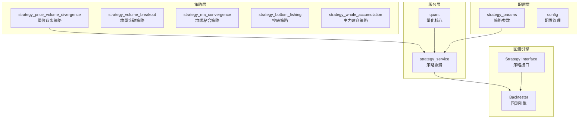
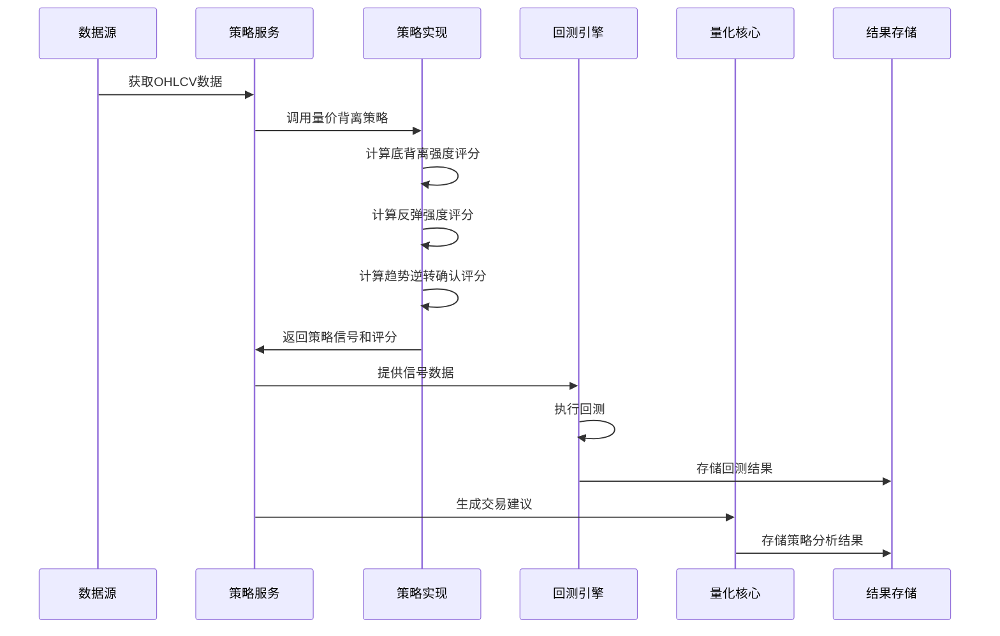
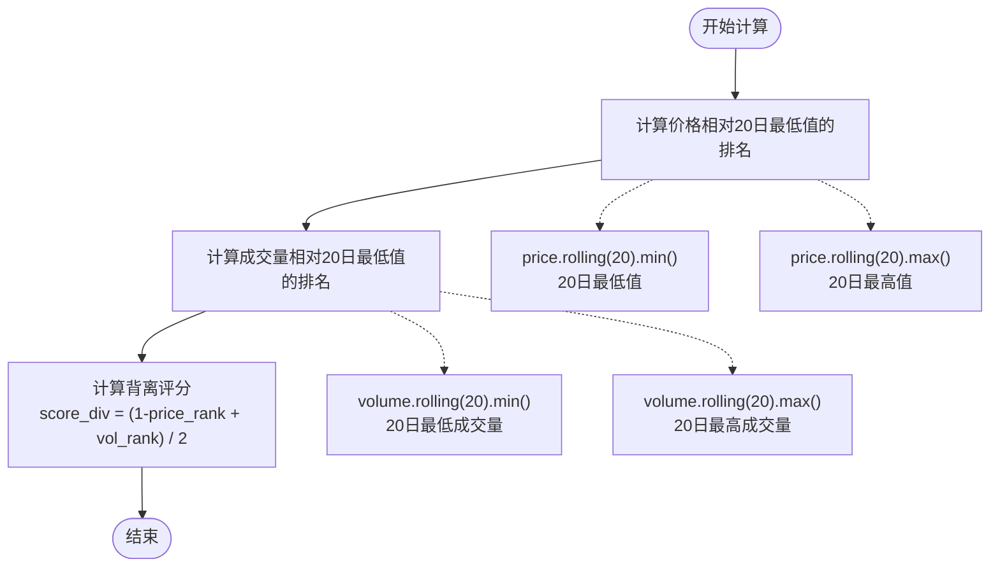
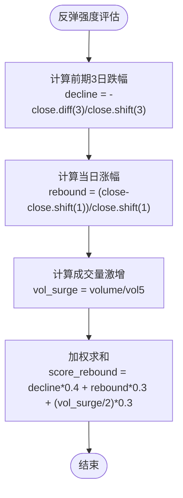
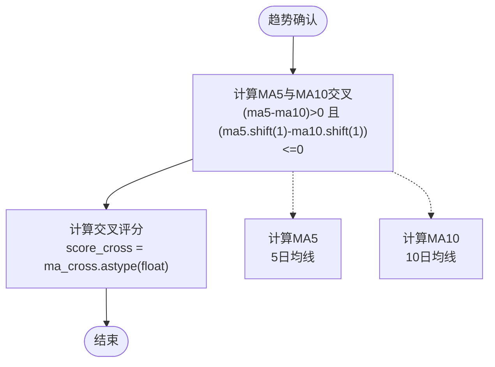
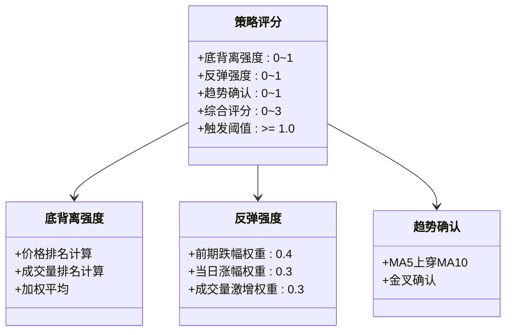
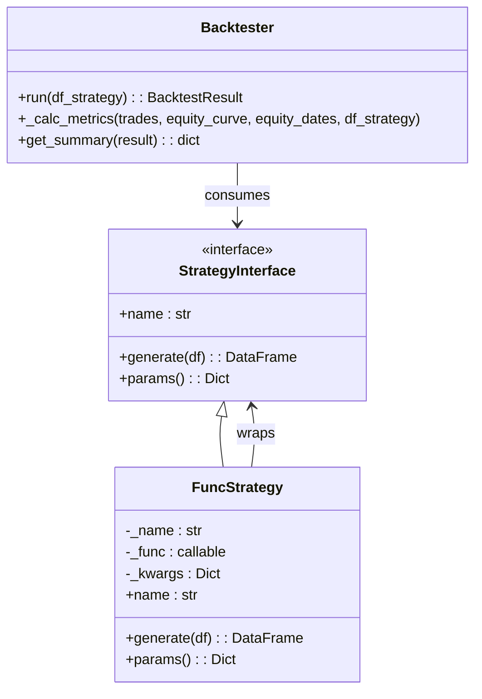
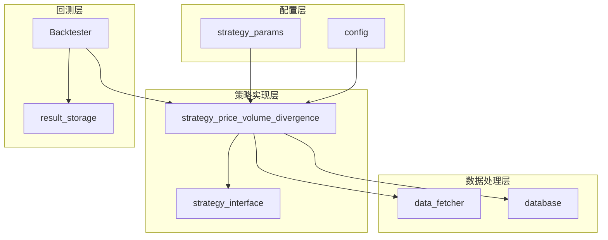

# 量价背离型策略

<cite>
**本文档引用的文件**
- [strategy/strategies.py](file://strategy/strategies.py)
- [backtest/backtest.py](file://backtest/backtest.py)
- [quant.py](file://quant.py)
- [services/strategy_service.py](file://services/strategy_service.py)
- [config/strategy_params.py](file://config/strategy_params.py)
- [strategy/indicators.py](file://strategy/indicators.py)
- [ai/features.py](file://ai/features.py)
- [backtest/strategy_interface.py](file://backtest/strategy_interface.py)
</cite>

## 目录
1. [简介](#简介)
2. [项目结构](#项目结构)
3. [核心组件](#核心组件)
4. [架构概览](#架构概览)
5. [详细组件分析](#详细组件分析)
6. [依赖分析](#依赖分析)
7. [性能考虑](#性能考虑)
8. [故障排除指南](#故障排除指南)
9. [结论](#结论)
10. [附录](#附录)

## 简介
量价背离型策略是一种基于技术分析的反转信号识别系统，专门用于捕捉下跌趋势中的底部反转信号。该策略通过检测价格创新低而成交量未创新高的现象（底背离），结合反弹强度评估和趋势逆转确认，形成完整的反转交易信号。

该策略的核心价值在于：
- **反转信号识别**：通过底背离检测捕捉潜在的底部反转
- **强度评分体系**：综合价格、成交量和趋势三维度评分
- **风险控制机制**：内置止损和趋势确认机制
- **多场景应用**：适用于下跌趋势中的反转捕捉和底部区域的超卖反弹识别

## 项目结构
AIQuant量化系统采用模块化设计，量价背离策略作为其中的一个独立策略模块，与其他策略共同构成完整的多策略选股框架。

**图表来源**
- [strategy/strategies.py:141-178](file://strategy/strategies.py#L141-L178)
- [services/strategy_service.py:14-22](file://services/strategy_service.py#L14-L22)
- [backtest/backtest.py:56-111](file://backtest/backtest.py#L56-L111)

**章节来源**
- [strategy/strategies.py:1-431](file://strategy/strategies.py#L1-L431)
- [services/strategy_service.py:1-325](file://services/strategy_service.py#L1-L325)

## 核心组件
量价背离策略由三个核心评分维度组成，每个维度都有明确的计算逻辑和权重分配：

### 1. 底背离强度评分
通过20日时间窗口内的价格和成交量排名计算，形成背离强度评分。

### 2. 反弹强度评估
综合前期3日跌幅、当日涨幅和成交量激增三个因素，计算反弹强度评分。

### 3. 趋势逆转确认
通过MA5上穿MA10的技术信号确认趋势逆转的有效性。

**章节来源**
- [strategy/strategies.py:141-178](file://strategy/strategies.py#L141-L178)

## 架构概览
量价背离策略在整个AIQuant系统中的位置和交互关系如下：

**图表来源**
- [services/strategy_service.py:46-107](file://services/strategy_service.py#L46-L107)
- [quant.py:71-142](file://quant.py#L71-L142)
- [backtest/backtest.py:121-409](file://backtest/backtest.py#L121-L409)

## 详细组件分析

### 量价背离策略实现

#### 底背离强度计算机制
策略通过20日滚动窗口计算价格和成交量的相对排名，形成背离评分：

**图表来源**
- [strategy/strategies.py:156-160](file://strategy/strategies.py#L156-L160)

#### 反弹强度评估算法
策略综合三个因素评估反弹强度：

**图表来源**
- [strategy/strategies.py:163-166](file://strategy/strategies.py#L163-L166)

#### 趋势逆转确认机制
通过MA5上穿MA10的技术信号确认趋势逆转：

**图表来源**
- [strategy/strategies.py:169-170](file://strategy/strategies.py#L169-L170)

### 策略评分体系

#### 综合评分计算
策略将三个评分维度相加得到最终买入评分：

**图表来源**
- [strategy/strategies.py:155-172](file://strategy/strategies.py#L155-L172)

### 信号生成流程

#### 买入信号判定
策略在满足以下条件时生成买入信号：
1. 综合评分 ≥ 1.0
2. 数据索引 ≥ 20（确保有足够的历史数据）
3. 价格处于上升趋势中

#### 卖出信号判定
策略在以下情况生成卖出信号：
1. 价格跌破5日均线的95%
2. 出现死叉或跌破MA5
3. 达到最大持仓天数限制

**章节来源**
- [strategy/strategies.py:175-177](file://strategy/strategies.py#L175-L177)

### 回测集成机制

#### 回测引擎对接
量价背离策略通过标准化接口与回测引擎集成：

**图表来源**
- [backtest/strategy_interface.py:23-86](file://backtest/strategy_interface.py#L23-L86)
- [backtest/backtest.py:56-472](file://backtest/backtest.py#L56-L472)

**章节来源**
- [backtest/strategy_interface.py:60-86](file://backtest/strategy_interface.py#L60-L86)
- [backtest/backtest.py:121-409](file://backtest/backtest.py#L121-L409)

## 依赖分析

### 策略依赖关系

**图表来源**
- [strategy/strategies.py:141-178](file://strategy/strategies.py#L141-L178)
- [services/strategy_service.py:14-22](file://services/strategy_service.py#L14-L22)
- [quant.py:26-35](file://quant.py#L26-L35)

### 关键依赖组件

#### 技术指标依赖
量价背离策略依赖以下技术指标：
- **移动平均线**：MA5、MA10用于趋势确认
- **成交量指标**：5日均量用于成交量分析
- **价格序列**：收盘价用于价格分析

#### 数据依赖
策略对数据质量有严格要求：
- **数据完整性**：至少30个交易日的数据
- **时间序列**：连续的日线数据
- **OHLCV格式**：包含开盘、最高、最低、收盘、成交量

**章节来源**
- [strategy/strategies.py:148-152](file://strategy/strategies.py#L148-L152)
- [services/strategy_service.py:52-55](file://services/strategy_service.py#L52-L55)

## 性能考虑

### 计算复杂度分析
量价背离策略的时间复杂度为O(n)，空间复杂度为O(n)，其中n为交易日数量。

#### 计算优化
1. **滚动窗口优化**：使用pandas的rolling函数进行高效计算
2. **向量化操作**：充分利用numpy的向量化特性
3. **内存管理**：及时释放不需要的中间变量

### 性能监控指标
策略运行的关键性能指标包括：
- **计算时间**：单次计算耗时
- **内存使用**：数据帧大小
- **信号频率**：交易信号生成频率
- **回测效率**：回测执行速度

## 故障排除指南

### 常见问题及解决方案

#### 数据质量问题
**问题**：策略返回空结果或异常
**可能原因**：
- 数据缺失或格式错误
- 交易日数量不足
- 价格或成交量数据异常

**解决方案**：
1. 检查数据完整性
2. 验证OHLCV数据格式
3. 确认交易日历

#### 参数调优问题
**问题**：策略信号过于稀少或过于频繁
**调整建议**：
1. 调整评分阈值
2. 修改权重分配
3. 优化时间窗口参数

#### 回测结果异常
**问题**：回测结果显示异常的交易行为
**排查步骤**：
1. 检查信号生成逻辑
2. 验证回测参数设置
3. 复核交易成本计算

**章节来源**
- [services/strategy_service.py:52-55](file://services/strategy_service.py#L52-L55)
- [quant.py:84-87](file://quant.py#L84-L87)

## 结论
量价背离型策略通过科学的评分体系和严格的信号确认机制，为投资者提供了可靠的底部反转信号识别工具。该策略具有以下优势：

1. **理论基础扎实**：基于技术分析的经典原理
2. **实现简洁高效**：算法复杂度低，计算速度快
3. **风险控制完善**：内置多种风险控制机制
4. **可扩展性强**：模块化设计便于功能扩展

通过合理的参数调优和风险管理，量价背离策略能够在实际投资中发挥重要作用，帮助投资者更好地把握市场转折点。

## 附录

### 参数调优建议

#### 核心参数
- **评分阈值**：建议设置在0.8-1.2之间
- **时间窗口**：20日窗口已验证有效
- **权重分配**：底背离0.33，反弹强度0.33，趋势确认0.33

#### 风险控制要点
- **止损设置**：建议设置在买入价下方5-8%
- **止盈设置**：建议设置在买入价上方15-25%
- **仓位管理**：单票仓位不超过总资金的20%

### 应用场景
1. **下跌趋势中的反转捕捉**
2. **底部区域的超卖反弹识别**
3. **震荡市中的反弹机会寻找**
4. **技术面超卖区域的交易信号**

### 技术指标补充
策略可以与其他技术指标结合使用：
- **RSI指标**：确认超卖超买状态
- **MACD指标**：验证趋势强度
- **布林带**：判断价格位置
- **成交量指标**：确认量价配合