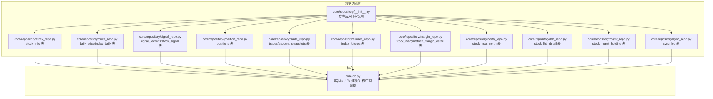
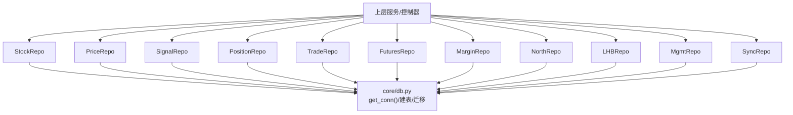
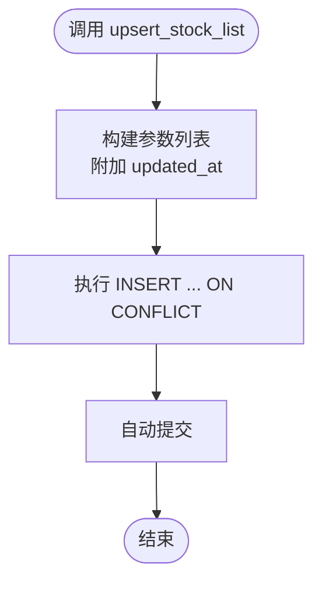
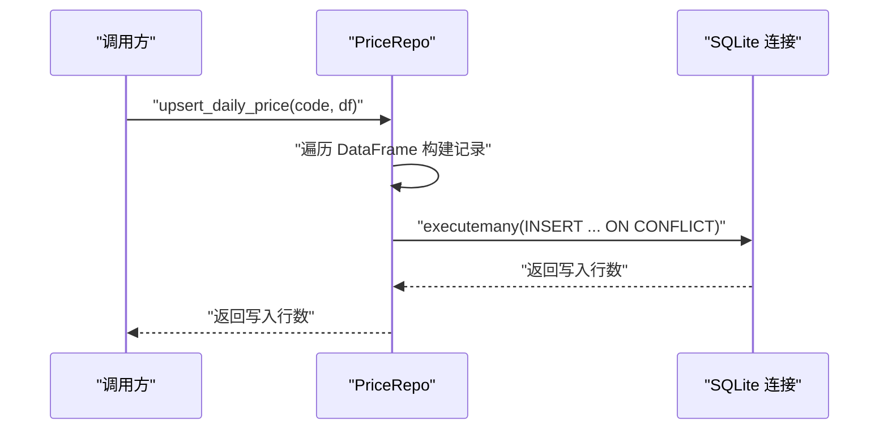
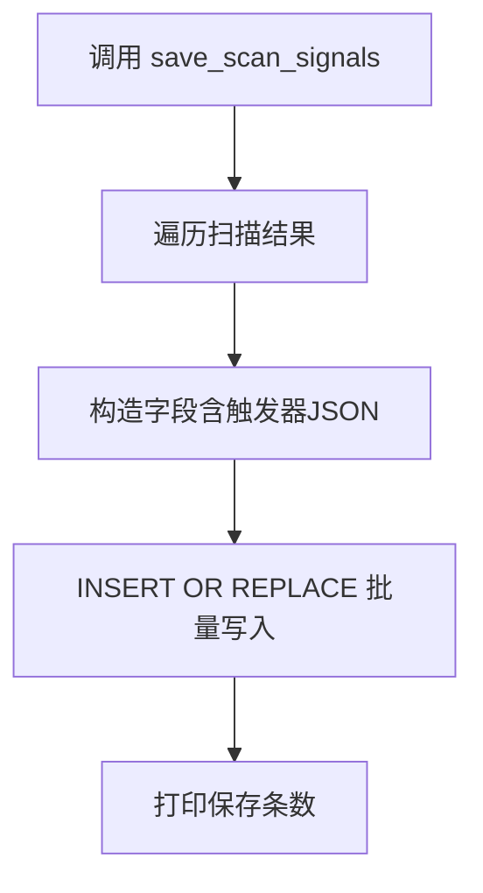
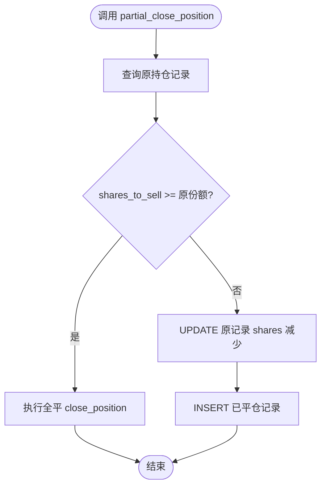
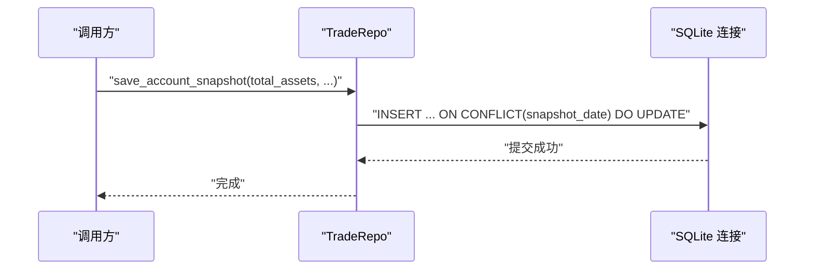

# 数据仓库模式

<cite>
**本文引用的文件**
- [core/repository/__init__.py](file://core/repository/__init__.py)
- [core/db.py](file://core/db.py)
- [core/repository/stock_repo.py](file://core/repository/stock_repo.py)
- [core/repository/price_repo.py](file://core/repository/price_repo.py)
- [core/repository/signal_repo.py](file://core/repository/signal_repo.py)
- [core/repository/position_repo.py](file://core/repository/position_repo.py)
- [core/repository/trade_repo.py](file://core/repository/trade_repo.py)
- [core/repository/futures_repo.py](file://core/repository/futures_repo.py)
- [core/repository/margin_repo.py](file://core/repository/margin_repo.py)
- [core/repository/north_repo.py](file://core/repository/north_repo.py)
- [core/repository/lhb_repo.py](file://core/repository/lhb_repo.py)
- [core/repository/mgmt_repo.py](file://core/repository/mgmt_repo.py)
- [core/repository/sync_repo.py](file://core/repository/sync_repo.py)
- [tests/test_repository.py](file://tests/test_repository.py)
</cite>

## 目录
1. [简介](#简介)
2. [项目结构](#项目结构)
3. [核心组件](#核心组件)
4. [架构总览](#架构总览)
5. [详细组件分析](#详细组件分析)
6. [依赖分析](#依赖分析)
7. [性能考虑](#性能考虑)
8. [故障排查指南](#故障排查指南)
9. [结论](#结论)
10. [附录](#附录)

## 简介
本技术文档围绕 AIQuant 的数据仓库模式（Repository Pattern）展开，系统化阐述其在量化系统中的应用与实现。仓库模式通过将数据访问层与业务逻辑解耦，统一抽象 CRUD 操作与查询优化策略，使上层服务专注于业务编排。本文覆盖以下仓库类的设计职责与功能边界：
- StockRepo（股票信息仓库）
- PriceRepo（行情数据仓库）
- SignalRepo（信号记录仓库）
- PositionRepo（持仓管理仓库）
- TradeRepo（交易记录仓库）
- FuturesRepo、MarginRepo、NorthRepo、LHBRepo、MgmtRepo（扩展主题数据仓库）
并说明数据访问层的抽象设计、CRUD 封装、查询优化、缓存策略、事务管理与错误处理机制，最后给出使用示例路径以便快速上手。

## 项目结构
仓库层位于 core/repository，按“按表拆分”的方式组织，每个仓库文件负责一张表或一组相关表的 CRUD 与查询封装；核心数据库连接与建表迁移逻辑集中在 core/db.py。测试文件 tests/test_repository.py 验证仓库模块的可导入性与基础行为。

图表来源
- [core/repository/__init__.py:1-7](file://core/repository/__init__.py#L1-L7)
- [core/db.py:1-467](file://core/db.py#L1-L467)

章节来源
- [core/repository/__init__.py:1-7](file://core/repository/__init__.py#L1-L7)
- [core/db.py:1-467](file://core/db.py#L1-L467)

## 核心组件
本节概述各仓库类的职责边界与典型用途，便于快速定位功能与数据表对应关系。

- StockRepo（股票信息仓库）
  - 职责：维护 stock_info 表，提供股票清单批量写入/更新、股本信息更新与查询、活跃股票列表与名称解析等。
  - 关键能力：upsert_stock_list、batch_update_market_cap、get_all_stocks、get_stock_name、get_market_cap_map。
  - 适用场景：数据源拉取股票基础信息、定期更新总/流通股本、上游策略筛选前的股票清单准备。

- PriceRepo（行情数据仓库）
  - 职责：维护 daily_price 与 index_daily 表，提供日线行情批量写入/更新、策略评分批量更新、历史行情查询、最新交易日查询等。
  - 关键能力：upsert_daily_price、update_strategy_scores_batch、get_daily_price、upsert_index_daily、get_index_daily、get_latest_date、get_latest_date_all、has_today_data、get_stock_count_in_db。
  - 适用场景：行情入库、策略评分落库、回测与实时监控的行情读取。

- SignalRepo（信号记录仓库）
  - 职责：维护 signal_records 与 stock_signal 表，提供策略筛选结果与扫描推荐的保存、查询与今日信号获取。
  - 关键能力：save_signals、save_scan_signals、get_signals、get_today_signals。
  - 适用场景：信号生成与推送、策略扫描结果归档与检索。

- PositionRepo（持仓管理仓库）
  - 职责：维护 positions 表，提供开仓、平仓、部分平仓、价格更新、按条件查询、汇总统计等。
  - 关键能力：add_position、close_position、partial_close_position、update_position_price、get_positions、get_position_by_id、get_position_by_code、delete_position、get_position_summary。
  - 适用场景：实盘/回测中的持仓管理、风控与收益统计。

- TradeRepo（交易记录仓库）
  - 职责：维护 trades 与 account_snapshots 表，提供交易记录写入、查询、账户快照保存与查询。
  - 关键能力：add_trade、get_trades、save_account_snapshot、get_account_snapshots、get_latest_snapshot。
  - 适用场景：成交回报记录、账户资产快照与回测收益曲线构建。

- FuturesRepo/MarginRepo/NorthRepo/LHBRepo/MgmtRepo/SyncRepo（扩展主题数据仓库）
  - 职责：分别维护指数期货、融资融券、北向资金、龙虎榜、高管持股、同步日志等主题数据表，提供批量写入、查询与最新日期查询。
  - 关键能力：upsert_*、get_*、get_latest_*。
  - 适用场景：多因子研究、宏观择时、监管与舆情跟踪。

章节来源
- [core/repository/stock_repo.py:1-80](file://core/repository/stock_repo.py#L1-L80)
- [core/repository/price_repo.py:1-237](file://core/repository/price_repo.py#L1-L237)
- [core/repository/signal_repo.py:1-119](file://core/repository/signal_repo.py#L1-L119)
- [core/repository/position_repo.py:1-138](file://core/repository/position_repo.py#L1-L138)
- [core/repository/trade_repo.py:1-77](file://core/repository/trade_repo.py#L1-L77)
- [core/repository/futures_repo.py:1-109](file://core/repository/futures_repo.py#L1-L109)
- [core/repository/margin_repo.py:1-186](file://core/repository/margin_repo.py#L1-L186)
- [core/repository/north_repo.py:1-117](file://core/repository/north_repo.py#L1-L117)
- [core/repository/lhb_repo.py:1-99](file://core/repository/lhb_repo.py#L1-L99)
- [core/repository/mgmt_repo.py:1-103](file://core/repository/mgmt_repo.py#L1-L103)
- [core/repository/sync_repo.py:1-55](file://core/repository/sync_repo.py#L1-L55)

## 架构总览
仓库层采用“按表拆分”的模块化设计，每个仓库文件内部：
- 统一通过 _get_conn() 获取连接，委托 core/db.py 中的 get_conn() 上下文管理器，确保事务提交/回滚与连接关闭；
- 使用 PRAGMA 设置 WAL 模式与同步级别，兼顾并发与可靠性；
- 对外暴露清晰的 CRUD 与查询函数，屏蔽 SQL 细节，便于上层服务调用。

图表来源
- [core/db.py:26-40](file://core/db.py#L26-L40)
- [core/repository/stock_repo.py:8-10](file://core/repository/stock_repo.py#L8-L10)
- [core/repository/price_repo.py:8-10](file://core/repository/price_repo.py#L8-L10)
- [core/repository/signal_repo.py:9-11](file://core/repository/signal_repo.py#L9-L11)
- [core/repository/position_repo.py:7-9](file://core/repository/position_repo.py#L7-L9)
- [core/repository/trade_repo.py:7-9](file://core/repository/trade_repo.py#L7-L9)
- [core/repository/futures_repo.py:7-9](file://core/repository/futures_repo.py#L7-L9)
- [core/repository/margin_repo.py:7-9](file://core/repository/margin_repo.py#L7-L9)
- [core/repository/north_repo.py:7-9](file://core/repository/north_repo.py#L7-L9)
- [core/repository/lhb_repo.py:7-9](file://core/repository/lhb_repo.py#L7-L9)
- [core/repository/mgmt_repo.py:7-9](file://core/repository/mgmt_repo.py#L7-L9)
- [core/repository/sync_repo.py:8-10](file://core/repository/sync_repo.py#L8-L10)

## 详细组件分析

### StockRepo（股票信息仓库）
- 设计要点
  - 批量 upsert：基于 ON CONFLICT 更新，避免重复主键异常。
  - 股本更新：支持单条与批量更新，便于外部数据源补充市值维度。
  - 查询封装：活跃股票过滤、名称解析、股本映射。
- 事务与错误处理
  - 通过 _get_conn() 的上下文管理器自动 commit/rollback，异常时回滚并抛出。
- 性能建议
  - 批量写入使用 executemany 提升吞吐。
  - 股本查询返回字典映射，减少上层重复查询。

图表来源
- [core/repository/stock_repo.py:13-28](file://core/repository/stock_repo.py#L13-L28)

章节来源
- [core/repository/stock_repo.py:1-80](file://core/repository/stock_repo.py#L1-L80)

### PriceRepo（行情数据仓库）
- 设计要点
  - 日线与指数行情双表：daily_price 与 index_daily，均支持 upsert 与批量评分更新。
  - 评分更新：update_strategy_scores_batch 单独更新评分列，避免影响 OHLCV 结构。
  - 查询优化：支持日期范围过滤、索引列查询、返回带日期索引的 DataFrame。
  - 最新日期与存在性：提供 get_latest_date、get_latest_date_all、has_today_data、get_stock_count_in_db。
- 事务与错误处理
  - 评分更新显式关闭外键约束检查以提升批量更新性能，并逐条执行后提交。
- 性能建议
  - 批量写入使用 executemany。
  - 评分更新与行情写入分离，降低锁竞争。

图表来源
- [core/repository/price_repo.py:13-47](file://core/repository/price_repo.py#L13-L47)

章节来源
- [core/repository/price_repo.py:1-237](file://core/repository/price_repo.py#L1-L237)

### SignalRepo（信号记录仓库）
- 设计要点
  - 两表并存：signal_records（旧表）与 stock_signal（新表），分别用于筛选记录与扫描推荐。
  - 批量保存：save_signals 与 save_scan_signals 支持批量写入，扫描推荐包含 JSON 触发器列表。
  - 查询：按日期与限制返回最近信号。
- 事务与错误处理
  - 通过 _get_conn() 自动事务管理。
- 性能建议
  - 批量写入使用 executemany。
  - 触发器列表序列化为 JSON，便于后续解析与规则匹配。

图表来源
- [core/repository/signal_repo.py:46-99](file://core/repository/signal_repo.py#L46-L99)

章节来源
- [core/repository/signal_repo.py:1-119](file://core/repository/signal_repo.py#L1-L119)

### PositionRepo（持仓管理仓库）
- 设计要点
  - 开仓：add_position 返回 position_id，状态默认 holding。
  - 平仓：close_position 支持全平；partial_close_position 支持减仓并新增已平仓记录。
  - 价格更新：update_position_price 用于浮动盈亏计算。
  - 查询与汇总：按状态/ID/代码查询，get_position_summary 计算总价值、总盈亏与收益率。
- 事务与错误处理
  - 通过 _get_conn() 自动事务管理。
- 性能建议
  - 按状态与代码建立索引，查询效率更高。
  - 部分平仓逻辑先读取原记录再更新，保证一致性。

图表来源
- [core/repository/position_repo.py:42-74](file://core/repository/position_repo.py#L42-L74)

章节来源
- [core/repository/position_repo.py:1-138](file://core/repository/position_repo.py#L1-L138)

### TradeRepo（交易记录仓库）
- 设计要点
  - 交易记录：add_trade 写入 trades 表，包含方向、价格、数量、手续费、滑点等。
  - 账户快照：save_account_snapshot 以日期为键去重更新，支持回测收益曲线构建。
  - 查询：按代码与时间倒序返回最近交易记录。
- 事务与错误处理
  - 通过 _get_conn() 自动事务管理。
- 性能建议
  - 交易与快照分离，避免频繁写入导致锁竞争。

图表来源
- [core/repository/trade_repo.py:42-57](file://core/repository/trade_repo.py#L42-L57)

章节来源
- [core/repository/trade_repo.py:1-77](file://core/repository/trade_repo.py#L1-L77)

### 扩展主题仓库（Futures/Margin/North/LHB/Mgmt/Sync）
- 设计要点
  - 统一采用 upsert_* 与 get_* 的命名风格，支持日期格式清洗与空值清理。
  - 提供 get_latest_* 便捷查询最新可用日期。
- 事务与错误处理
  - 通过 _get_conn() 自动事务管理。
- 性能建议
  - 批量写入使用 executemany。
  - 日期列建立索引，加速范围查询。

章节来源
- [core/repository/futures_repo.py:1-109](file://core/repository/futures_repo.py#L1-L109)
- [core/repository/margin_repo.py:1-186](file://core/repository/margin_repo.py#L1-L186)
- [core/repository/north_repo.py:1-117](file://core/repository/north_repo.py#L1-L117)
- [core/repository/lhb_repo.py:1-99](file://core/repository/lhb_repo.py#L1-L99)
- [core/repository/mgmt_repo.py:1-103](file://core/repository/mgmt_repo.py#L1-L103)
- [core/repository/sync_repo.py:1-55](file://core/repository/sync_repo.py#L1-L55)

## 依赖分析
- 仓库层对核心数据库模块的依赖
  - 所有仓库通过 _get_conn() 引用 core/db.py 的 get_conn()，统一连接生命周期与事务语义。
- 表间依赖与索引
  - trades 表通过 position_id 关联 positions 表，建议保持外键约束与索引。
  - 各表均建立常用查询索引（如 code+date、trade_date 等），提升查询性能。
- 可能的循环依赖
  - 仓库层之间无直接相互依赖，仅依赖 core/db.py，避免循环依赖风险。

图表来源
- [core/repository/stock_repo.py:8-10](file://core/repository/stock_repo.py#L8-L10)
- [core/repository/price_repo.py:8-10](file://core/repository/price_repo.py#L8-L10)
- [core/repository/signal_repo.py:9-11](file://core/repository/signal_repo.py#L9-L11)
- [core/repository/position_repo.py:7-9](file://core/repository/position_repo.py#L7-L9)
- [core/repository/trade_repo.py:7-9](file://core/repository/trade_repo.py#L7-L9)
- [core/db.py:26-40](file://core/db.py#L26-L40)

章节来源
- [core/db.py:26-40](file://core/db.py#L26-L40)

## 性能考虑
- 连接与事务
  - 使用 WAL 模式与 NORMAL 同步级别，在并发与可靠性间取得平衡。
  - 通过上下文管理器确保事务提交/回滚与连接释放。
- 批量写入
  - 优先使用 executemany 执行批量插入/更新，显著提升吞吐。
- 索引优化
  - 表级索引（如 code+date、trade_date、status 等）配合查询条件，减少全表扫描。
- 锁竞争控制
  - 将评分更新与行情写入分离，避免同一表内批量更新造成锁竞争。
- 缓存策略
  - 当前仓库层未内置应用层缓存；可在上层服务按需引入内存缓存（如股票名称映射、最新日期等），注意与数据库一致性策略。

## 故障排查指南
- 常见问题与定位
  - 连接超时：检查 get_conn() 的 timeout 设置与数据库文件权限。
  - 事务异常：确认异常是否被上抛至上下文管理器触发回滚。
  - 主键冲突：upsert 场景使用 ON CONFLICT/INSERT OR REPLACE，确保唯一索引存在。
  - 日期格式：统一 YYYY-MM-DD 或 YYYYMMDD，避免解析失败。
- 排查步骤
  - 使用 tests/test_repository.py 验证仓库函数可导入与签名正确。
  - 通过 sync_repo 的 db_stats 输出数据库概要统计，核对记录数与最新日期。
  - 在核心迁移与建表逻辑中定位表结构差异，确保索引与列存在。

章节来源
- [tests/test_repository.py:1-86](file://tests/test_repository.py#L1-L86)
- [core/repository/sync_repo.py:36-55](file://core/repository/sync_repo.py#L36-L55)
- [core/db.py:57-467](file://core/db.py#L57-L467)

## 结论
AIQuant 的仓库模式通过“按表拆分”的模块化设计，将数据访问细节封装在仓库层，实现了业务逻辑与数据层的清晰解耦。结合统一的连接与事务管理、批量写入与索引优化策略，仓库层能够稳定支撑回测、实时监控与实盘交易等多场景需求。建议在上层服务中按需引入缓存与批处理策略，进一步提升整体性能与可维护性。

## 附录
- 使用示例（以路径代替代码片段）
  - 股票信息入库与查询
    - [批量写入股票清单:13-28](file://core/repository/stock_repo.py#L13-L28)
    - [获取活跃股票列表:62-70](file://core/repository/stock_repo.py#L62-L70)
    - [获取股票名称:73-80](file://core/repository/stock_repo.py#L73-L80)
  - 行情入库与评分更新
    - [批量写入日线行情:13-47](file://core/repository/price_repo.py#L13-L47)
    - [批量更新策略评分:50-93](file://core/repository/price_repo.py#L50-L93)
    - [查询日线行情:95-129](file://core/repository/price_repo.py#L95-L129)
  - 信号保存与查询
    - [保存筛选结果:14-43](file://core/repository/signal_repo.py#L14-L43)
    - [保存扫描推荐:46-99](file://core/repository/signal_repo.py#L46-L99)
    - [查询今日信号:116-119](file://core/repository/signal_repo.py#L116-L119)
  - 持仓管理
    - [开仓:12-24](file://core/repository/position_repo.py#L12-L24)
    - [全平/减仓:27-74](file://core/repository/position_repo.py#L27-L74)
    - [查询汇总:120-138](file://core/repository/position_repo.py#L120-L138)
  - 交易与账户快照
    - [添加交易记录:12-24](file://core/repository/trade_repo.py#L12-L24)
    - [保存账户快照:42-57](file://core/repository/trade_repo.py#L42-L57)
    - [查询最近快照:70-77](file://core/repository/trade_repo.py#L70-L77)
  - 扩展主题数据
    - [指数期货入库:27-71](file://core/repository/futures_repo.py#L27-L71)
    - [融资融券入库:29-80](file://core/repository/margin_repo.py#L29-L80)
    - [北向资金入库:27-87](file://core/repository/north_repo.py#L27-L87)
    - [龙虎榜入库:27-69](file://core/repository/lhb_repo.py#L27-L69)
    - [高管持股入库:27-70](file://core/repository/mgmt_repo.py#L27-L70)
    - [同步日志与统计:18-55](file://core/repository/sync_repo.py#L18-L55)