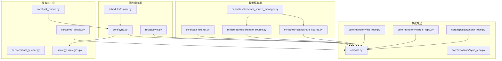
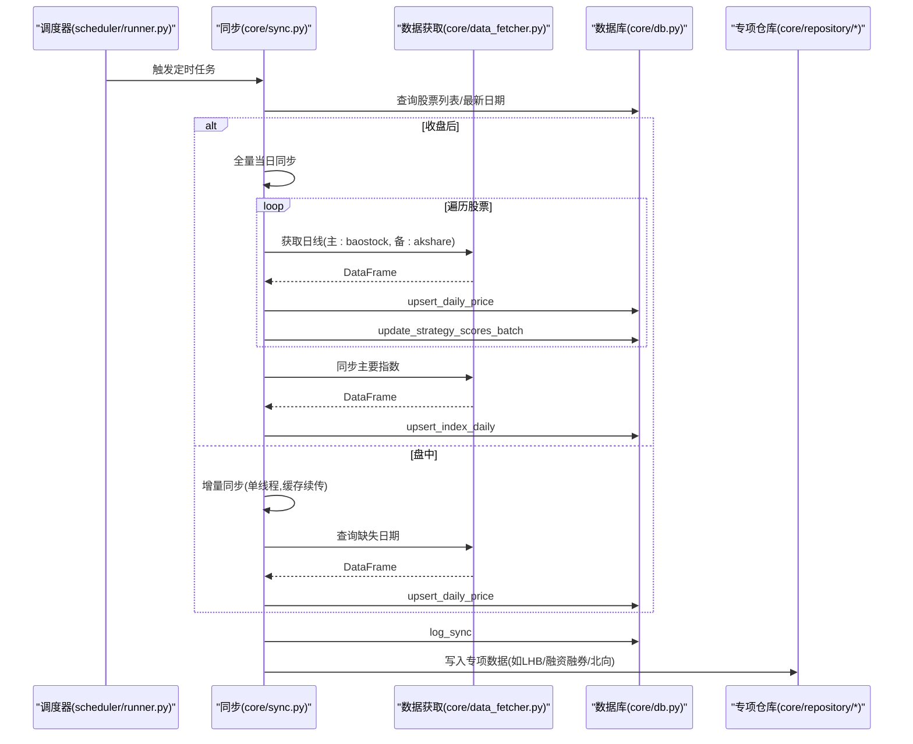
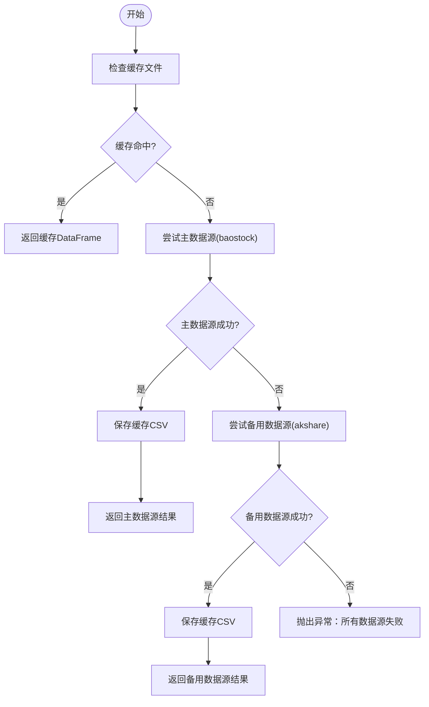
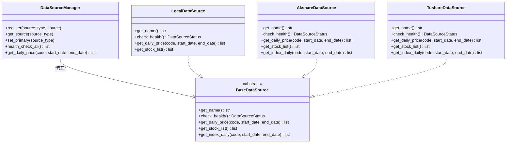
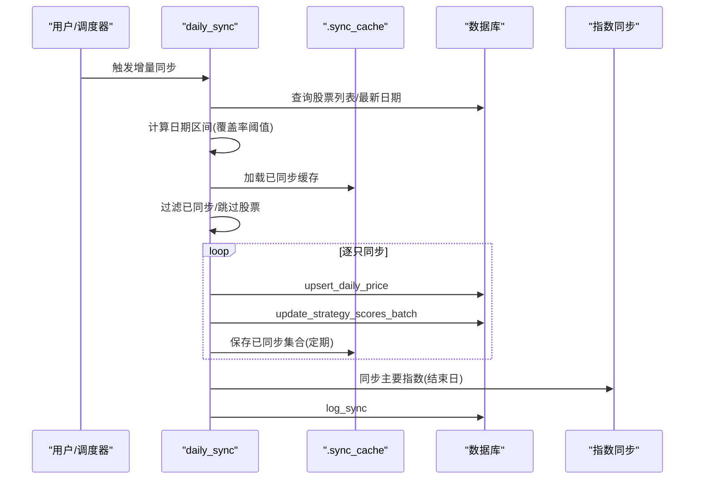
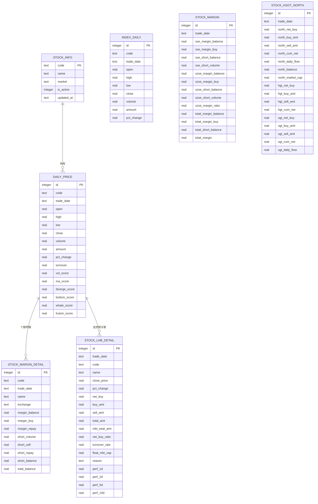
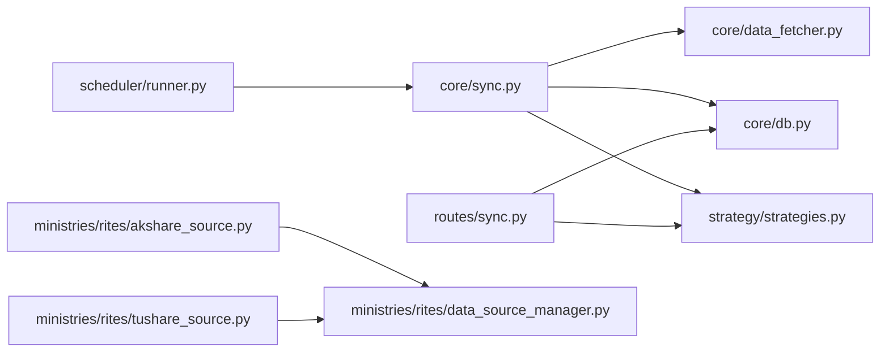

# 数据同步机制

<cite>
**本文档引用的文件**
- [core/data_fetcher.py](file://core/data_fetcher.py)
- [core/sync.py](file://core/sync.py)
- [core/sync_simple.py](file://core/sync_simple.py)
- [ministries/rites/data_source_manager.py](file://ministries/rites/data_source_manager.py)
- [ministries/rites/akshare_source.py](file://ministries/rites/akshare_source.py)
- [ministries/rites/tushare_source.py](file://ministries/rites/tushare_source.py)
- [core/db.py](file://core/db.py)
- [routes/sync.py](file://routes/sync.py)
- [scheduler/runner.py](file://scheduler/runner.py)
- [services/data_fetcher.py](file://services/data_fetcher.py)
- [core/repository/sync_repo.py](file://core/repository/sync_repo.py)
- [core/repository/lhb_repo.py](file://core/repository/lhb_repo.py)
- [core/repository/margin_repo.py](file://core/repository/margin_repo.py)
- [core/repository/north_repo.py](file://core/repository/north_repo.py)
- [strategy/strategies.py](file://strategy/strategies.py)
- [core/task_queue.py](file://core/task_queue.py)
</cite>

## 目录
1. [简介](#简介)
2. [项目结构](#项目结构)
3. [核心组件](#核心组件)
4. [架构总览](#架构总览)
5. [详细组件分析](#详细组件分析)
6. [依赖分析](#依赖分析)
7. [性能考虑](#性能考虑)
8. [故障排查指南](#故障排查指南)
9. [结论](#结论)
10. [附录](#附录)

## 简介
本文件面向AIQuant项目的“数据同步机制”，系统性阐述数据获取器(DataFetcher)、多数据源适配、清洗与标准化流程、调度与增量/全量同步策略、数据质量检查与异常处理、日志与进度跟踪、性能监控，以及针对股票基本信息、日线行情、指数、融资融券、龙虎榜等不同数据类型的同步策略与最佳实践。

## 项目结构
围绕数据同步的关键模块分布如下：
- 数据获取层：core/data_fetcher.py（baostock/akshare）、ministries/rites/*（多数据源适配）
- 数据库层：core/db.py（SQLite建表/写入/查询）、core/repository/*（专项表写入）
- 同步调度层：core/sync.py（全量/增量）、scheduler/runner.py（定时任务）、routes/sync.py（接口）
- 服务与工具：services/data_fetcher.py、core/sync_simple.py、core/task_queue.py
- 策略评分：strategy/strategies.py（策略评分写入）

**图表来源**
- [core/data_fetcher.py:1-578](file://core/data_fetcher.py#L1-L578)
- [ministries/rites/data_source_manager.py:1-190](file://ministries/rites/data_source_manager.py#L1-L190)
- [ministries/rites/akshare_source.py:1-135](file://ministries/rites/akshare_source.py#L1-L135)
- [ministries/rites/tushare_source.py:1-167](file://ministries/rites/tushare_source.py#L1-L167)
- [core/db.py:1-800](file://core/db.py#L1-L800)
- [core/repository/lhb_repo.py:1-99](file://core/repository/lhb_repo.py#L1-L99)
- [core/repository/margin_repo.py:1-186](file://core/repository/margin_repo.py#L1-L186)
- [core/repository/north_repo.py:1-117](file://core/repository/north_repo.py#L1-L117)
- [core/repository/sync_repo.py:1-55](file://core/repository/sync_repo.py#L1-L55)
- [core/sync.py:1-760](file://core/sync.py#L1-L760)
- [scheduler/runner.py:1-212](file://scheduler/runner.py#L1-L212)
- [routes/sync.py:1-140](file://routes/sync.py#L1-L140)
- [services/data_fetcher.py:1-106](file://services/data_fetcher.py#L1-L106)
- [core/sync_simple.py:1-173](file://core/sync_simple.py#L1-L173)
- [core/task_queue.py:1-222](file://core/task_queue.py#L1-L222)
- [strategy/strategies.py:1-200](file://strategy/strategies.py#L1-L200)

**章节来源**
- [core/data_fetcher.py:1-578](file://core/data_fetcher.py#L1-L578)
- [core/sync.py:1-760](file://core/sync.py#L1-L760)
- [core/db.py:1-800](file://core/db.py#L1-L800)

## 核心组件
- 数据获取器(DataFetcher)
  - 核心能力：股票日线、指数、股票基本信息、实时价格、热门股票、市值估算等
  - 主数据源：baostock（免费、稳定、无频率限制）
  - 备用数据源：akshare（多接口降级）
  - 关键函数：get_stock_history、get_market_index、get_stock_info、get_realtime_price、fetch_all_market_cap
- 多数据源适配
  - DataSourceManager：统一管理本地/akshare/tushare/yfinance/local等数据源，支持健康检查与自动切换
  - AkshareDataSource/TushareDataSource：标准化数据格式
- 同步调度器
  - initial_sync：全量历史初始化（断点续传）
  - daily_sync：每日增量同步（单线程，缓存续传）
  - sync_one_stock：单只股票同步（主数据源+备用）
  - sync_all_indices：主要指数同步
- 数据库层
  - daily_price/index_daily/stock_info等表写入与查询
  - upsert_*系列函数实现冲突更新
- 策略评分
  - sync_strategy_score：批量写入策略评分（全量历史）
- 调度与接口
  - scheduler/runner.py：定时任务（传统/流水线模式）
  - routes/sync.py：全量评分与信号写入接口

**章节来源**
- [core/data_fetcher.py:173-578](file://core/data_fetcher.py#L173-L578)
- [ministries/rites/data_source_manager.py:111-190](file://ministries/rites/data_source_manager.py#L111-L190)
- [ministries/rites/akshare_source.py:15-135](file://ministries/rites/akshare_source.py#L15-L135)
- [ministries/rites/tushare_source.py:16-167](file://ministries/rites/tushare_source.py#L16-L167)
- [core/sync.py:319-760](file://core/sync.py#L319-L760)
- [core/db.py:543-775](file://core/db.py#L543-L775)
- [routes/sync.py:23-140](file://routes/sync.py#L23-L140)
- [scheduler/runner.py:29-87](file://scheduler/runner.py#L29-L87)

## 架构总览
整体采用“多数据源适配 + 本地SQLite数据库 + 调度器”的架构，强调：
- 主备数据源自动切换
- 断点续传与缓存
- 增量/全量双模式
- 策略评分与信号写入一体化

**图表来源**
- [scheduler/runner.py:29-87](file://scheduler/runner.py#L29-L87)
- [core/sync.py:462-760](file://core/sync.py#L462-L760)
- [core/data_fetcher.py:173-578](file://core/data_fetcher.py#L173-L578)
- [core/db.py:543-775](file://core/db.py#L543-L775)
- [core/repository/lhb_repo.py:27-69](file://core/repository/lhb_repo.py#L27-L69)
- [core/repository/margin_repo.py:29-80](file://core/repository/margin_repo.py#L29-L80)
- [core/repository/north_repo.py:27-87](file://core/repository/north_repo.py#L27-L87)

## 详细组件分析

### 数据获取器(DataFetcher)工作原理
- 登录与连接管理
  - baostock全局单例登录，线程安全锁保护
  - akshare备用接口自动降级（东方财富→新浪）
- 代码格式转换
  - _to_bs_code/_from_bs_code：统一A股代码格式（sh./sz./bj.）
- 核心数据获取
  - get_stock_history：主数据源baostock，失败自动akshare降级
  - get_market_index：指数数据（baostock→akshare）
  - get_stock_info：股票基本信息（baostock→akshare）
  - get_realtime_price：最近交易日收盘价
  - fetch_all_market_cap：基于换手率反推流通股本（baostock）
- 数据清洗与标准化
  - 数值列转换、空值过滤、列名统一、索引设置、排序
  - 缓存机制：data_cache目录CSV缓存，命中即返回

**图表来源**
- [core/data_fetcher.py:194-222](file://core/data_fetcher.py#L194-L222)

**章节来源**
- [core/data_fetcher.py:28-222](file://core/data_fetcher.py#L28-L222)

### 多数据源适配与数据清洗
- DataSourceManager
  - 注册本地/akshare/tushare/yfinance等数据源
  - 健康检查与自动切换
- AkshareDataSource/TushareDataSource
  - 标准化列名与日期格式
  - 错误捕获与降级
- 清洗流程
  - 数值类型转换、空值处理、列名映射、索引设置、排序、过滤无效行

**图表来源**
- [ministries/rites/data_source_manager.py:111-190](file://ministries/rites/data_source_manager.py#L111-L190)
- [ministries/rites/akshare_source.py:15-135](file://ministries/rites/akshare_source.py#L15-L135)
- [ministries/rites/tushare_source.py:16-167](file://ministries/rites/tushare_source.py#L16-L167)

**章节来源**
- [ministries/rites/data_source_manager.py:111-190](file://ministries/rites/data_source_manager.py#L111-L190)
- [ministries/rites/akshare_source.py:45-99](file://ministries/rites/akshare_source.py#L45-L99)
- [ministries/rites/tushare_source.py:65-126](file://ministries/rites/tushare_source.py#L65-L126)

### 同步调度机制与策略
- 全量初始化(initial_sync)
  - 断点续传：跳过已有股票
  - 无频率限制主数据源，快速拉取历史
  - 写入日志与统计
- 增量同步(daily_sync)
  - 单线程（baostock线程不安全），登录一次
  - 基于覆盖率阈值选择日期区间
  - 同步缓存：.sync_cache目录记录已同步股票，支持断点续传
  - 同步完成后清理缓存
- 单只同步(sync_one_stock)
  - 主数据源+备用自动切换
  - 代码格式转换与北交所过滤
- 指数同步(sync_all_indices)
  - 主要指数（上证/深证/沪深300/中证500/中证1000）
- 策略评分(sync_strategy_score)
  - 5策略独立评分+融合评分，批量写入历史全量

**图表来源**
- [core/sync.py:462-760](file://core/sync.py#L462-L760)
- [core/repository/sync_repo.py:18-34](file://core/repository/sync_repo.py#L18-L34)

**章节来源**
- [core/sync.py:319-760](file://core/sync.py#L319-L760)
- [core/repository/sync_repo.py:18-55](file://core/repository/sync_repo.py#L18-L55)

### 数据质量检查、异常处理与重试
- 健康检查
  - DataSourceManager.health_check_all：遍历数据源健康状态
  - 各数据源check_health：尝试拉取少量数据验证可用性
- 异常处理
  - 数据源失败自动切换
  - baostock/akshare双重降级
  - 增量同步缓存续传，避免重复请求
- 重试机制
  - 当前实现以“自动切换+缓存续传”为主，未见显式指数退避重试
  - 建议：在网络波动时增加指数/个股的指数退避重试

**章节来源**
- [ministries/rites/data_source_manager.py:136-177](file://ministries/rites/data_source_manager.py#L136-L177)
- [ministries/rites/akshare_source.py:21-43](file://ministries/rites/akshare_source.py#L21-L43)
- [ministries/rites/tushare_source.py:33-63](file://ministries/rites/tushare_source.py#L33-L63)
- [core/sync.py:529-650](file://core/sync.py#L529-L650)

### 同步日志、进度跟踪与性能监控
- 同步日志
  - log_sync：记录同步类型、总数、成功/失败、耗时、备注
  - get_sync_logs：查询最近N条日志
- 进度跟踪
  - initial_sync/daily_sync：打印实时进度、速度、ETA
  - 增量同步缓存：周期性保存已同步股票集合
- 性能监控
  - db_stats：数据库概要统计（股票数、行情数、最早/最新日期、数据库大小）
  - 增量同步单线程，避免baostock线程不安全问题

**章节来源**
- [core/repository/sync_repo.py:18-55](file://core/repository/sync_repo.py#L18-L55)
- [core/sync.py:348-390](file://core/sync.py#L348-L390)
- [core/db.py:768-775](file://core/db.py#L768-L775)

### 不同数据类型的同步策略
- 股票基本信息
  - get_stock_info：baostock主，akshare备
  - 写入stock_info表
- 日线行情
  - get_stock_history：baostock主，akshare备
  - upsert_daily_price：冲突更新，支持断点续传
- 指数数据
  - get_market_index：baostock主，akshare备
  - upsert_index_daily：主要指数写入index_daily
- 融资融券
  - stock_margin（全市场汇总）：upsert_market_margin
  - stock_margin_detail（个股明细）：upsert_margin_detail
- 龙虎榜
  - stock_lhb_detail：upsert_lhb_detail
- 北向资金
  - stock_hsgt_north：upsert_north_money

**图表来源**
- [core/db.py:61-427](file://core/db.py#L61-L427)
- [core/repository/margin_repo.py:29-80](file://core/repository/margin_repo.py#L29-L80)
- [core/repository/lhb_repo.py:27-69](file://core/repository/lhb_repo.py#L27-L69)
- [core/repository/north_repo.py:27-87](file://core/repository/north_repo.py#L27-L87)

**章节来源**
- [core/data_fetcher.py:225-424](file://core/data_fetcher.py#L225-L424)
- [core/sync.py:91-131](file://core/sync.py#L91-L131)
- [core/repository/margin_repo.py:29-162](file://core/repository/margin_repo.py#L29-L162)
- [core/repository/lhb_repo.py:27-92](file://core/repository/lhb_repo.py#L27-L92)
- [core/repository/north_repo.py:27-110](file://core/repository/north_repo.py#L27-L110)

### 最佳实践与故障恢复
- 最佳实践
  - 使用断点续传：增量同步缓存与全量初始化
  - 交易日判断与收盘后全量：避免盘中数据不稳
  - 策略评分全量写入：回测时直接读取历史评分
  - 多数据源自动切换：提升稳定性
- 故障恢复
  - 增量同步失败：保留缓存，下次重启自动续传
  - 数据源失败：自动切换到备用数据源
  - 数据库异常：事务封装与回滚，确保一致性

**章节来源**
- [core/sync.py:462-760](file://core/sync.py#L462-L760)
- [core/data_fetcher.py:204-222](file://core/data_fetcher.py#L204-L222)
- [core/db.py:26-40](file://core/db.py#L26-L40)

## 依赖分析
- 组件耦合
  - core/sync.py 依赖 core/data_fetcher.py、core/db.py、strategy/strategies.py
  - scheduler/runner.py 依赖 core/sync.py、core/db.py
  - routes/sync.py 依赖 core/db.py、strategy/strategies.py
  - 数据源适配器依赖 DataSourceManager
- 外部依赖
  - baostock、akshare、tushare、sqlite3、pandas、numpy

**图表来源**
- [core/sync.py:16-26](file://core/sync.py#L16-L26)
- [scheduler/runner.py:32-35](file://scheduler/runner.py#L32-L35)
- [routes/sync.py:12-20](file://routes/sync.py#L12-L20)
- [ministries/rites/data_source_manager.py:114-131](file://ministries/rites/data_source_manager.py#L114-L131)
- [ministries/rites/akshare_source.py:9-12](file://ministries/rites/akshare_source.py#L9-L12)
- [ministries/rites/tushare_source.py:9-13](file://ministries/rites/tushare_source.py#L9-L13)

**章节来源**
- [core/sync.py:16-26](file://core/sync.py#L16-L26)
- [scheduler/runner.py:32-35](file://scheduler/runner.py#L32-L35)
- [routes/sync.py:12-20](file://routes/sync.py#L12-L20)

## 性能考虑
- 主数据源baostock无频率限制，全量初始化极快
- 增量同步单线程避免baostock线程不安全，建议后续可引入轻量任务队列优化
- 数据库采用WAL模式与索引优化，upsert冲突更新减少重复写入
- 增量同步缓存降低网络请求与重复计算

[本节为通用性能讨论，无需特定文件引用]

## 故障排查指南
- 常见问题
  - 数据源不可用：检查网络与令牌，查看DataSourceManager健康状态
  - 增量同步卡住：检查缓存文件是否存在，确认已同步集合是否正确
  - 数据库异常：查看事务回滚日志，确认唯一约束冲突
- 排查步骤
  - 查看同步日志：get_sync_logs
  - 查看数据库统计：db_stats
  - 重新执行增量同步：daily_sync
  - 重算策略评分：/recalc_all_scores接口

**章节来源**
- [core/repository/sync_repo.py:28-34](file://core/repository/sync_repo.py#L28-L34)
- [core/db.py:768-775](file://core/db.py#L768-L775)
- [routes/sync.py:23-140](file://routes/sync.py#L23-L140)

## 结论
AIQuant的数据同步机制以“多数据源适配 + 本地SQLite + 断点续传 + 增量/全量双模式”为核心，具备高可靠性与可维护性。通过baostock主数据源与akshare备用机制、策略评分全量写入、完善的日志与统计，系统在保证数据质量的同时兼顾了性能与可扩展性。建议后续引入更细粒度的并发与指数退避重试，进一步提升稳定性与吞吐。

[本节为总结性内容，无需特定文件引用]

## 附录
- 命令行接口
  - core/sync.py：list/init/init_test/daily/stat/test
  - core/sync_simple.py：cache/fetch/stat
- 服务接口
  - routes/sync.py：/recalc_all_scores
- 任务队列
  - core/task_queue.py：异步任务提交与状态跟踪

**章节来源**
- [core/sync.py:734-760](file://core/sync.py#L734-L760)
- [core/sync_simple.py:146-173](file://core/sync_simple.py#L146-L173)
- [routes/sync.py:23-140](file://routes/sync.py#L23-L140)
- [core/task_queue.py:64-106](file://core/task_queue.py#L64-L106)