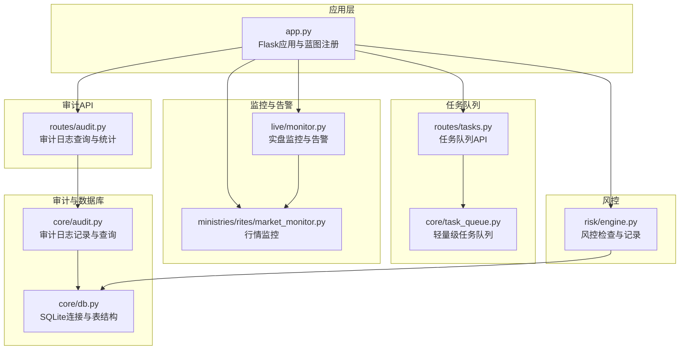
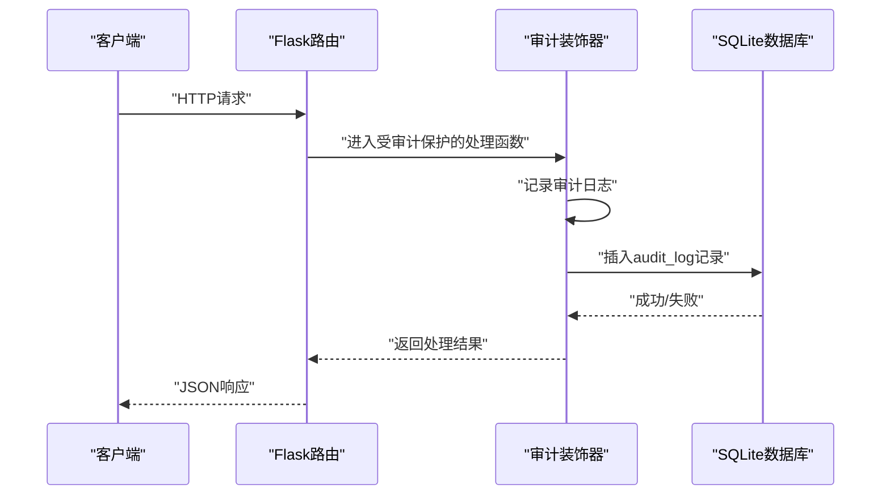
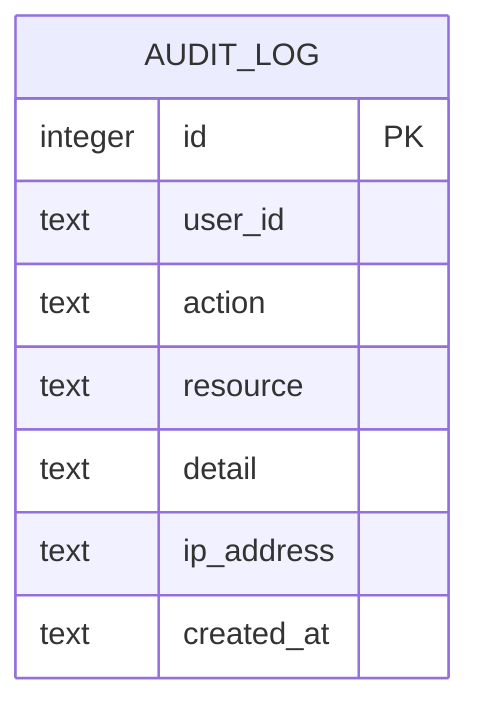
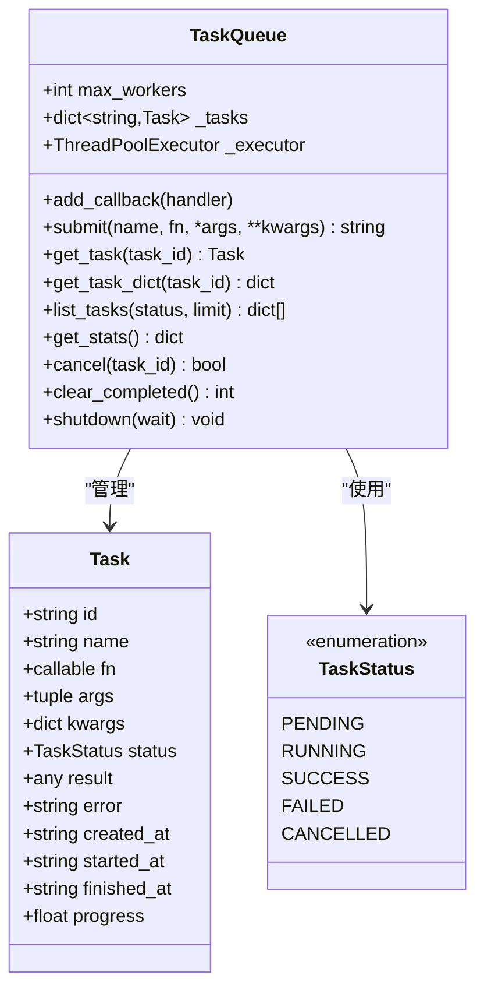
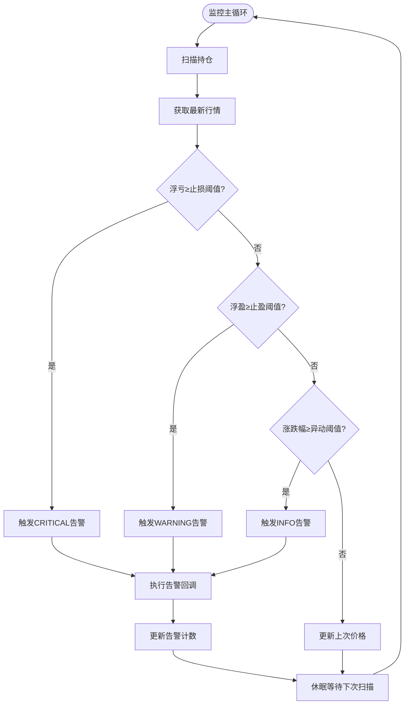
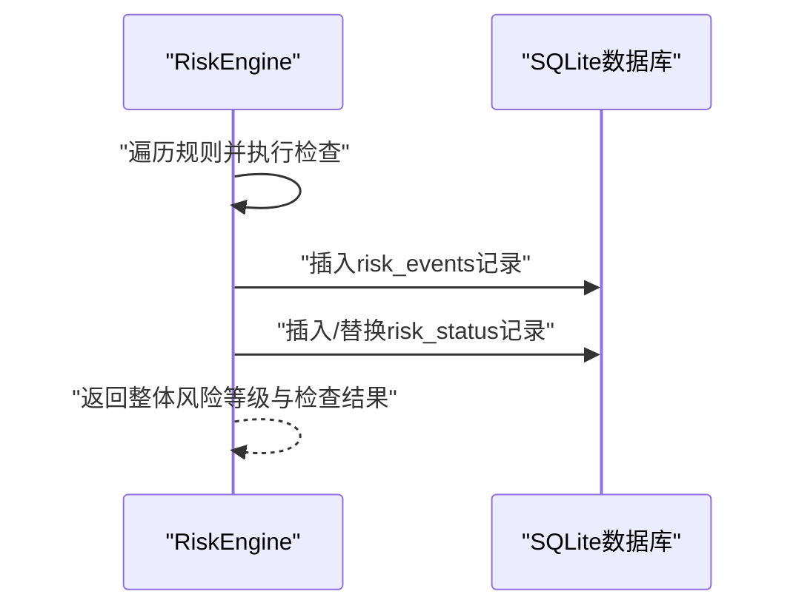
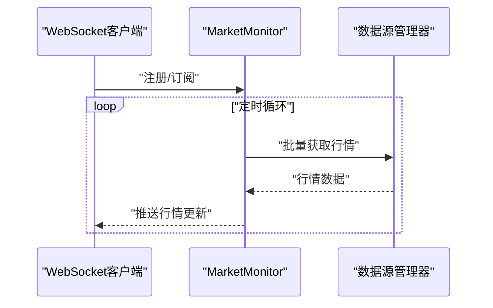
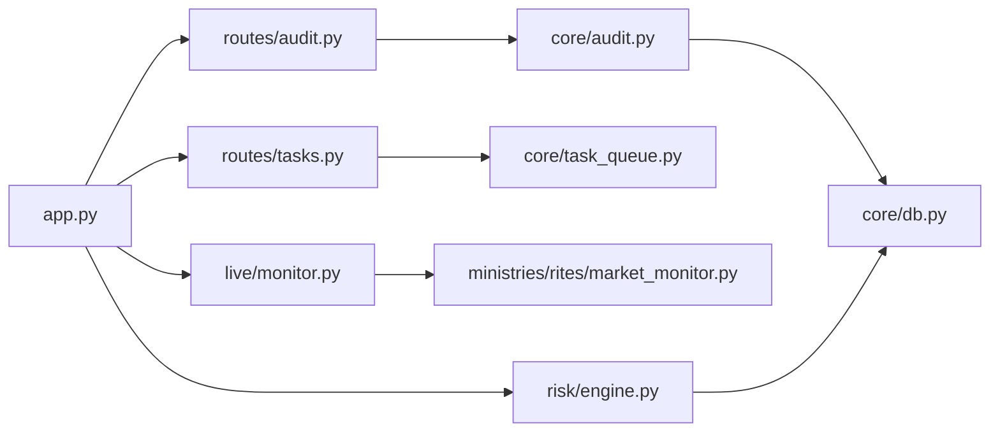

# 数据审计与监控

<cite>
**本文引用的文件**
- [core/audit.py](file://core/audit.py)
- [routes/audit.py](file://routes/audit.py)
- [core/db.py](file://core/db.py)
- [core/task_queue.py](file://core/task_queue.py)
- [routes/tasks.py](file://routes/tasks.py)
- [live/monitor.py](file://live/monitor.py)
- [risk/engine.py](file://risk/engine.py)
- [ministries/rites/market_monitor.py](file://ministries/rites/market_monitor.py)
- [app.py](file://app.py)
</cite>

## 目录
1. [简介](#简介)
2. [项目结构](#项目结构)
3. [核心组件](#核心组件)
4. [架构概览](#架构概览)
5. [详细组件分析](#详细组件分析)
6. [依赖分析](#依赖分析)
7. [性能考虑](#性能考虑)
8. [故障排查指南](#故障排查指南)
9. [结论](#结论)
10. [附录](#附录)

## 简介
本技术文档面向AIQuant数据审计与监控系统，系统性阐述审计日志机制、任务队列调度、实时监控与告警、以及合规性检查的实现方法。文档覆盖以下关键主题：
- 审计日志表(audit_log)的结构设计与记录策略
- 任务队列(TaskQueue)的调度机制、优先级管理与失败重试策略
- 数据变更追踪、操作审计与合规性检查
- 实时监控指标、告警机制与性能分析
- 审计事件的分类、严重级别与处理流程
- 使用审计数据进行系统监控、故障排查与合规审计的实践示例

## 项目结构
AIQuant采用模块化组织，审计与监控相关能力分布在以下模块：
- 核心审计与数据库：core/audit.py、core/db.py
- 审计API：routes/audit.py
- 任务队列：core/task_queue.py、routes/tasks.py
- 实时监控与告警：live/monitor.py、ministries/rites/market_monitor.py
- 风控引擎：risk/engine.py
- 应用入口与蓝图注册：app.py

**图表来源**
- [app.py:1-164](file://app.py#L1-L164)
- [core/audit.py:1-147](file://core/audit.py#L1-L147)
- [core/db.py:1-467](file://core/db.py#L1-L467)
- [routes/audit.py:1-79](file://routes/audit.py#L1-L79)
- [core/task_queue.py:1-222](file://core/task_queue.py#L1-L222)
- [routes/tasks.py:1-178](file://routes/tasks.py#L1-L178)
- [live/monitor.py:1-286](file://live/monitor.py#L1-L286)
- [ministries/rites/market_monitor.py:1-244](file://ministries/rites/market_monitor.py#L1-L244)
- [risk/engine.py:1-168](file://risk/engine.py#L1-L168)

**章节来源**
- [app.py:1-164](file://app.py#L1-L164)

## 核心组件
本节聚焦审计与监控系统的核心组件及其职责：
- 审计日志系统：提供统一的审计日志记录与查询能力，支持装饰器自动记录API调用。
- 任务队列：提供轻量级异步任务提交、执行、状态跟踪与统计。
- 实时监控与告警：实盘监控器负责止损/止盈/价格异动告警，并支持Webhook推送。
- 风控引擎：执行风控检查并将结果持久化至数据库。
- 行情监控：管理WebSocket客户端连接与行情推送。

**章节来源**
- [core/audit.py:16-147](file://core/audit.py#L16-L147)
- [core/task_queue.py:51-222](file://core/task_queue.py#L51-L222)
- [live/monitor.py:55-286](file://live/monitor.py#L55-L286)
- [risk/engine.py:13-168](file://risk/engine.py#L13-L168)
- [ministries/rites/market_monitor.py:21-244](file://ministries/rites/market_monitor.py#L21-L244)

## 架构概览
系统采用“模块化+蓝图”的架构，审计与监控能力通过独立模块实现，通过Flask蓝图对外提供REST API。数据库采用SQLite，审计日志表与风控事件表均位于同一数据库中，便于统一查询与分析。

**图表来源**
- [core/audit.py:41-92](file://core/audit.py#L41-L92)
- [core/db.py:26-39](file://core/db.py#L26-L39)

## 详细组件分析

### 审计日志系统
审计日志系统提供两类能力：
- 手动记录：log_audit函数直接插入audit_log表。
- 自动记录：audit_log装饰器自动记录API调用，包括用户ID、IP、耗时、结果状态等。

审计日志表结构与索引：
- 表名：audit_log
- 字段：id、user_id、action、resource、detail、ip_address、created_at
- 索引：按created_at倒序排序，便于快速查询最新日志

查询能力：
- 支持按action、user_id过滤
- 支持分页查询与总数统计
- 提供统计接口，包括当日操作数、操作类型分布、近7天趋势

**图表来源**
- [core/db.py:416-427](file://core/db.py#L416-L427)

**章节来源**
- [core/audit.py:16-147](file://core/audit.py#L16-L147)
- [routes/audit.py:16-79](file://routes/audit.py#L16-L79)
- [core/db.py:416-427](file://core/db.py#L416-L427)

### 任务队列(TaskQueue)
任务队列提供轻量级异步任务执行能力：
- 任务状态：PENDING、RUNNING、SUCCESS、FAILED、CANCELLED
- 线程池执行：ThreadPoolExecutor，支持自定义max_workers
- 任务查询：支持按状态过滤、分页、排序
- 统计信息：总任务数、各状态分布、最大并发数
- 回调机制：任务完成后触发回调，便于扩展通知或后续处理
- 清理策略：可清理已完成任务，释放内存

**图表来源**
- [core/task_queue.py:25-222](file://core/task_queue.py#L25-L222)

**章节来源**
- [core/task_queue.py:51-222](file://core/task_queue.py#L51-L222)
- [routes/tasks.py:93-178](file://routes/tasks.py#L93-L178)

### 实时监控与告警
实盘监控器负责：
- 定时扫描持仓，检查止损/止盈/价格异动
- 告警等级：INFO、WARNING、CRITICAL
- 告警去重与限频：限制单股最大告警数
- 回调与Webhook：支持注册告警处理器，如Webhook推送
- 状态查询：提供告警列表、活跃告警数、阈值配置等

**图表来源**
- [live/monitor.py:91-155](file://live/monitor.py#L91-L155)

**章节来源**
- [live/monitor.py:55-286](file://live/monitor.py#L55-L286)

### 风控引擎与事件记录
风控引擎：
- 执行全量风控检查，聚合规则结果，确定整体风险等级
- 将检查结果与当前风控状态写入数据库，包括risk_events与risk_status表
- 提供查询接口，支持获取最近风险事件与最新风控状态

**图表来源**
- [risk/engine.py:51-128](file://risk/engine.py#L51-L128)

**章节来源**
- [risk/engine.py:13-168](file://risk/engine.py#L13-L168)

### 行情监控与WebSocket
行情监控器：
- 管理WebSocket客户端连接与订阅
- 定时批量拉取行情并推送至订阅者
- 提供状态查询接口，便于监控系统健康度

**图表来源**
- [ministries/rites/market_monitor.py:108-174](file://ministries/rites/market_monitor.py#L108-L174)

**章节来源**
- [ministries/rites/market_monitor.py:21-244](file://ministries/rites/market_monitor.py#L21-L244)

## 依赖分析
- 审计日志依赖数据库连接与表结构，查询与统计接口通过SQL实现。
- 任务队列依赖线程池与锁，保证并发安全与状态一致性。
- 实时监控依赖数据源管理器与订单管理器，结合行情监控器实现推送。
- 风控引擎依赖规则集合与配置加载，结果持久化至数据库。
- 应用入口通过蓝图注册所有API，统一暴露监控与审计能力。

**图表来源**
- [core/audit.py:13](file://core/audit.py#L13)
- [core/db.py:19](file://core/db.py#L19)
- [routes/audit.py:11](file://routes/audit.py#L11)
- [routes/tasks.py:15](file://routes/tasks.py#L15)
- [core/task_queue.py:54](file://core/task_queue.py#L54)
- [live/monitor.py:20-21](file://live/monitor.py#L20-L21)
- [ministries/rites/market_monitor.py:18](file://ministries/rites/market_monitor.py#L18)
- [risk/engine.py:76-125](file://risk/engine.py#L76-L125)
- [app.py:22-32](file://app.py#L22-L32)

**章节来源**
- [app.py:1-164](file://app.py#L1-L164)

## 性能考虑
- 数据库优化
  - 使用WAL模式与NORMAL同步策略，平衡性能与可靠性。
  - 为audit_log按created_at建立索引，加速时间序列查询。
- 任务队列优化
  - 线程池大小可配置，避免过度并发导致上下文切换开销。
  - 任务完成后及时清理，防止内存膨胀。
- 实时监控优化
  - 行情推送采用批处理与限频，避免频繁I/O。
  - 告警限频与去重，减少重复通知带来的系统压力。
- 风控检查优化
  - 规则执行异常保护，避免单个规则影响整体风控。
  - 结果聚合采用严格等级策略，减少冗余检查。

[本节为通用性能建议，不直接分析特定文件]

## 故障排查指南
- 审计日志无法写入
  - 检查数据库连接与权限，确认audit_log表存在且具备写入权限。
  - 查看装饰器捕获的异常信息，定位具体API调用问题。
- 任务队列异常
  - 查看任务状态是否停留在PENDING或RUNNING过久。
  - 检查线程池是否饱和，适当增加max_workers。
  - 使用统计接口确认任务分布，清理已完成任务。
- 实时监控告警无效
  - 检查阈值配置是否合理，确认数据源可用。
  - 查看告警回调是否注册，Webhook推送是否可达。
- 风控事件缺失
  - 检查规则执行是否抛出异常，查看风控状态表是否更新。
  - 确认数据库连接与事务提交逻辑。

**章节来源**
- [core/audit.py:37-38](file://core/audit.py#L37-L38)
- [core/task_queue.py:169-179](file://core/task_queue.py#L169-L179)
- [live/monitor.py:180-186](file://live/monitor.py#L180-L186)
- [risk/engine.py:98-99](file://risk/engine.py#L98-L99)

## 结论
AIQuant的审计与监控体系以SQLite为核心，结合轻量级任务队列、实时监控与风控引擎，构建了完整可观测性闭环。审计日志提供细粒度的操作轨迹，任务队列支撑异步处理与可观测性统计，实时监控与告警保障系统稳定性，风控引擎与数据库记录为合规审计提供可靠依据。通过统一的API与模块化设计，系统易于扩展与维护。

[本节为总结性内容，不直接分析特定文件]

## 附录

### 审计事件分类与严重级别
- 分类：按action字段区分，如交易、风控、配置、回测等。
- 严重级别：由装饰器自动识别，基于HTTP状态码或异常类型判定。
- 处理流程：记录→查询→统计→可视化，支持按时间、用户、操作类型过滤。

**章节来源**
- [core/audit.py:41-92](file://core/audit.py#L41-L92)
- [routes/audit.py:16-79](file://routes/audit.py#L16-L79)

### 实时监控指标与告警机制
- 指标：活跃告警数、阈值配置、最近告警列表。
- 告警等级：INFO、WARNING、CRITICAL，对应不同紧急程度。
- 告警处理：回调与Webhook推送，支持限频与去重。

**章节来源**
- [live/monitor.py:204-245](file://live/monitor.py#L204-L245)
- [live/monitor.py:256-273](file://live/monitor.py#L256-L273)

### 性能分析与优化建议
- 数据库层面：关注索引命中率与慢查询，定期清理历史数据。
- 任务队列层面：监控队列长度与执行耗时，动态调整线程池大小。
- 实时监控层面：评估推送频率与订阅规模，避免热点股票造成拥塞。
- 风控层面：规则复杂度与执行时间权衡，必要时拆分规则集。

[本节为通用性能建议，不直接分析特定文件]

### 使用审计数据进行系统监控、故障排查与合规审计
- 系统监控
  - 通过审计统计接口获取当日操作数与操作类型分布，识别异常高峰。
  - 结合任务队列统计，监控异步任务执行情况与失败率。
- 故障排查
  - 使用审计日志定位异常API调用，结合装饰器记录的耗时与结果状态。
  - 对比风控事件与实时告警，快速定位风险触发点。
- 合规审计
  - 通过审计日志与风控事件记录，形成完整的操作轨迹与决策依据。
  - 定期导出审计数据，满足合规要求与内部审计需要。

**章节来源**
- [routes/audit.py:41-79](file://routes/audit.py#L41-L79)
- [routes/tasks.py:158-164](file://routes/tasks.py#L158-L164)
- [risk/engine.py:155-167](file://risk/engine.py#L155-L167)